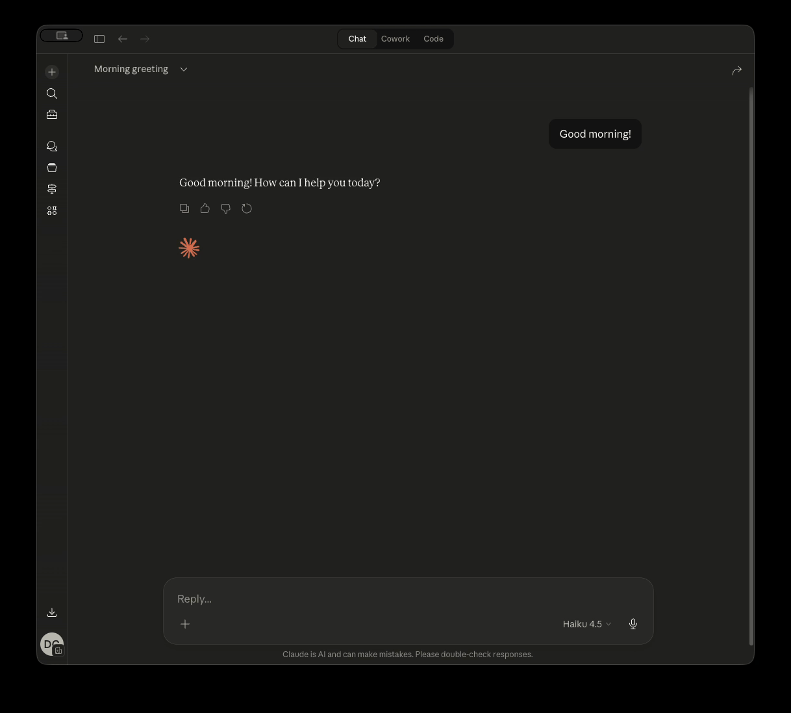

# Outlook Local MCP Server

A single-binary MCP server that connects Claude Desktop and Claude Code to Microsoft Outlook via the Microsoft Graph API. Manage your calendar, read email, and compose drafts without leaving your AI assistant.

<p align="center">
  
</p>

## Install

**Go binary** (recommended):

```bash
go install github.com/desek/outlook-local-mcp/cmd/outlook-local-mcp@latest
```

**Claude Desktop extension** (no terminal required):

Download the `.mcpb` file from the [latest release](https://github.com/desek/outlook-local-mcp/releases/latest) and open it in Claude Desktop via **Settings > Extensions > Install from file**.

## Tool invocation shape

All operations use four aggregate domain tools dispatched by an `operation` verb:

```
{tool: "calendar", args: {operation: "list_events", date: "today"}}
{tool: "mail",     args: {operation: "list_folders"}}
{tool: "account",  args: {operation: "list"}}
{tool: "system",   args: {operation: "status"}}
```

Call any domain with `operation: "help"` to list its verbs and parameters.

## Documentation

| Guide | Contents |
|---|---|
| [docs/readme.md](docs/readme.md) | Project overview and feature list |
| [docs/quickstart.md](docs/quickstart.md) | Prerequisites, installation, and first tool call |
| [docs/concepts.md](docs/concepts.md) | Output tiers, multi-account model, mail gating, OAuth scopes, observability, and more |
| [docs/troubleshooting.md](docs/troubleshooting.md) | Auth errors, Keychain issues, Graph throttling, and account lifecycle |

For LLM clients: see [llms.txt](llms.txt) for a machine-readable index.

## License

MIT License. See [LICENSE](LICENSE) for details.
