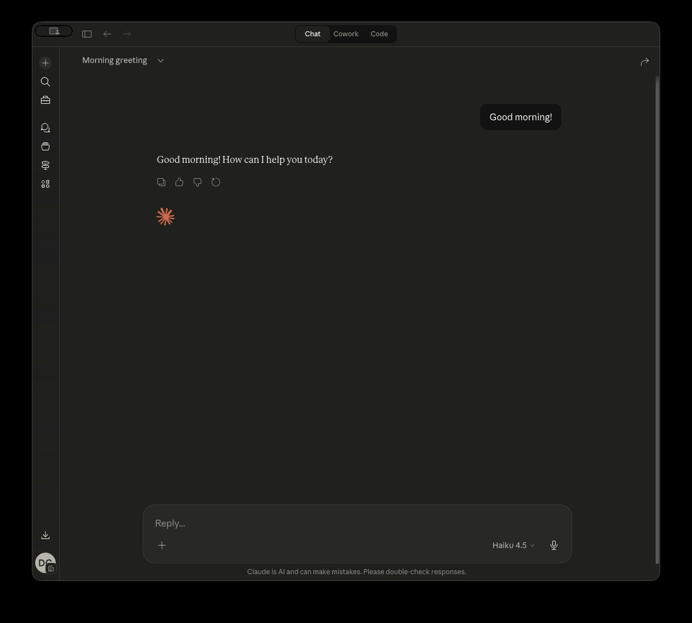

# Outlook Local MCP Server

A single-binary MCP server that connects Claude Desktop and Claude Code to Microsoft Outlook via the Microsoft Graph API. Manage your calendar, read and triage email, and compose drafts without leaving your AI assistant.

<p align="center">
  
</p>

## Install

**Go binary** (recommended):

```bash
go install github.com/desek/outlook-local-mcp/cmd/outlook-local-mcp@latest
```

**Docker / OCI**:

```bash
docker run -i --rm \
  -v outlook-mcp-auth:/data/auth \
  -e OUTLOOK_MCP_TENANT_ID=<tenant> \
  -e OUTLOOK_MCP_CLIENT_ID=<client> \
  ghcr.io/desek/outlook-local-mcp:latest
```

See [Container deployment](docs/quickstart.md#container-deployment) for the full client config snippet, and [Container runtime](docs/concepts.md#container-runtime) for the keychain trade-off and image variants.

**Claude Desktop extension** (no terminal required):

Download the `.mcpb` file from the [latest release](https://github.com/desek/outlook-local-mcp/releases/latest) and open it in Claude Desktop via **Settings > Extensions > Install from file**.

**Claude Code or Cowork plugin**: install the plugin from the Claude directory with `/plugin`. See [the quickstart](docs/quickstart.md#2c-install-as-a-claude-code-or-cowork-plugin).

## Tool invocation shape

All operations use four aggregate domain tools dispatched by an `operation` verb, plus two opt-in ones registered only when their variable is set, `contacts` under `OUTLOOK_MCP_CONTACTS_ENABLED` and `teams` under `OUTLOOK_MCP_TEAMS_ENABLED`:

```
{tool: "calendar", args: {operation: "list_events", date: "today"}}
{tool: "mail",     args: {operation: "list_folders"}}
{tool: "account",  args: {operation: "list"}}
{tool: "system",   args: {operation: "status"}}
{tool: "contacts", args: {operation: "search", query: "alex"}}   // OUTLOOK_MCP_CONTACTS_ENABLED
{tool: "teams",    args: {operation: "search", query: "release checklist"}}   // OUTLOOK_MCP_TEAMS_ENABLED
```

Call any domain with `operation: "help"` to list its verbs and parameters.

## Documentation

| Guide | Contents |
|---|---|
| [docs/readme.md](docs/readme.md) | Project overview and feature list |
| [docs/quickstart.md](docs/quickstart.md) | Prerequisites, installation, and first tool call |
| [docs/concepts.md](docs/concepts.md) | Output tiers, multi-account model, mail gating, OAuth scopes, observability, and more |
| [docs/troubleshooting.md](docs/troubleshooting.md) | Auth errors, Keychain issues, Graph throttling, and account lifecycle |

For LLM clients: see [llms.txt](llms.txt) for a machine-readable index.

## Privacy Policy

The server runs locally and sends your data only to Microsoft services with your own credentials. Read the full [privacy policy](PRIVACY.md) for what it accesses, keeps, and contacts.

## Acknowledgements

Support and testing by [GigWhere](https://gigwhere.com) ❤️

## License

MIT License. See [LICENSE](LICENSE) for details.
