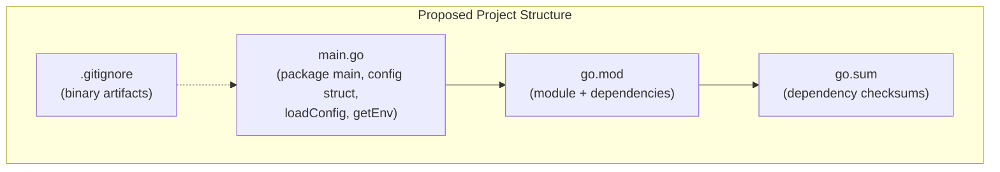
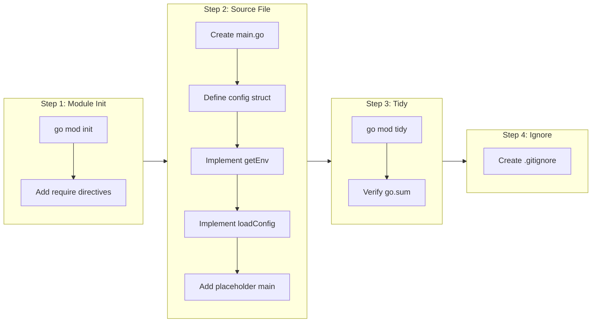

# Project Foundation & Configuration

## Change Summary

The Outlook Local MCP Server project currently has no Go source code, module definition, or project structure. This CR establishes the foundational project scaffolding: Go module initialization with all required dependencies, the canonical directory layout for a single-binary Go project, the configuration loading mechanism (environment variables with sensible defaults), and a `.gitignore` for build artifacts. Once implemented, all subsequent CRs (logging, authentication, Graph client, MCP server, tool handlers) can build on this foundation without revisiting project-level concerns.

## Motivation and Background

Every Go project begins with a `go.mod` file and a clear directory structure. Without these, no code can be compiled, no dependencies resolved, and no tests executed. The Outlook Local MCP Server depends on seven external modules spanning three ecosystems (MCP protocol, Azure Identity, Microsoft Graph), and these dependencies must be declared before any functional code can import them. Additionally, the server is configured entirely through environment variables, and the configuration loading pattern (struct + helper function + defaults) is a cross-cutting concern that every other component relies on. Establishing this foundation first avoids circular dependency issues and gives all downstream CRs a stable base to build upon.

## Change Drivers

* No Go module or project structure exists yet; the repository contains only the technical specification and governance templates
* All downstream CRs (CR-0002 through CR-0009) depend on having a compilable Go project with dependencies resolved
* The configuration loading pattern is referenced by authentication (CR-0003), logging (CR-0002), and Graph client initialization (CR-0004)
* A well-defined directory layout prevents ad-hoc file placement and establishes conventions early

## Current State

The repository contains only documentation and governance scaffolding:

```
outlook-mcp/
  .agents/skills/         # Governance templates and skills
  .claude/                # Claude agent configuration
  docs/reference/         # Technical specification
  skills-lock.json        # Skill version lock file
```

There is no `go.mod`, no `.go` source files, no `.gitignore`, and no build tooling. The project cannot be compiled or tested.

## Proposed Change

Initialize the Go project with a complete module definition, canonical directory layout, configuration loading infrastructure, and build artifact exclusions. This creates the minimal compilable skeleton that all subsequent CRs build upon.

### Proposed State Diagram



## Requirements

### Functional Requirements

1. The project **MUST** define a Go module at path `github.com/desek/outlook-local-mcp` (or the appropriate module path matching the repository) with Go version 1.24 or later in `go.mod`
2. The `go.mod` file **MUST** declare the following direct dependencies:
   - `github.com/mark3labs/mcp-go` at version v0.45.0 or later
   - `github.com/Azure/azure-sdk-for-go/sdk/azidentity` at latest stable
   - `github.com/Azure/azure-sdk-for-go/sdk/azidentity/cache` at v0.4.x
   - `github.com/microsoftgraph/msgraph-sdk-go` at v1.x
   - `github.com/microsoftgraph/msgraph-sdk-go-core` at v1.x
   - `github.com/microsoft/kiota-authentication-azure-go` at latest stable
   - `github.com/microsoft/kiota-abstractions-go` at latest stable
3. The project **MUST** define a `config` struct in `main.go` with the following fields:
   - `ClientID` (string) for the OAuth client ID
   - `TenantID` (string) for the Azure AD tenant
   - `AuthRecordPath` (string) for the authentication record file path
   - `CacheName` (string) for the OS-level token cache partition name
   - `DefaultTimezone` (string) for the default event timezone
   - `LogLevel` (string) for the minimum log level
   - `LogFormat` (string) for the log output format
4. The project **MUST** implement a `loadConfig()` function that returns a populated `config` struct by reading environment variables with the defaults specified in the technical specification
5. The project **MUST** implement a `getEnv(key, defaultValue string) string` helper function that returns the environment variable value if set and non-empty, or the default value otherwise
6. The `loadConfig()` function **MUST** expand the `~` character in `OUTLOOK_MCP_AUTH_RECORD_PATH` to the user's home directory using `os.UserHomeDir()`
7. The project **MUST** include a `.gitignore` file that excludes Go binary artifacts (the compiled binary name, and common build output patterns)
8. The `main.go` file **MUST** declare `package main` and contain a `main()` function (which may be minimal/placeholder at this stage, as full startup logic is covered by later CRs)

### Non-Functional Requirements

1. The project **MUST** compile successfully with `go build ./...` after implementation, producing zero errors
2. The project **MUST** pass `go vet ./...` with zero warnings
3. All dependencies **MUST** be resolvable via `go mod tidy` without manual intervention
4. The `go.sum` file **MUST** be committed alongside `go.mod` to ensure reproducible builds
5. The `config` struct and `loadConfig()` function **MUST** be usable by downstream CRs without modification to this CR's code

## Affected Components

* `go.mod` -- new file, module definition and dependency declarations
* `go.sum` -- new file, dependency integrity checksums
* `main.go` -- new file, package main with config struct, `loadConfig()`, `getEnv()`, and placeholder `main()`
* `.gitignore` -- new file, build artifact exclusions

## Scope Boundaries

### In Scope

* Go module initialization (`go mod init`, dependency declarations, `go mod tidy`)
* Project directory layout definition (single-binary, all code in `main.go` for now)
* The `config` struct type definition with all seven configuration fields
* The `loadConfig()` function reading environment variables and returning a populated config
* The `getEnv()` helper function for reading environment variables with defaults
* Home directory expansion (`~`) for the auth record path
* `.gitignore` for Go build artifacts
* A placeholder `main()` function that calls `loadConfig()` (full startup sequence is out of scope)

### Out of Scope ("Here, But Not Further")

* Logging initialization (`initLogger()`, `slog` handler setup) -- deferred to CR-0002
* Authentication logic (device code flow, token caching, auth record persistence) -- deferred to CR-0003
* Graph client construction (`NewGraphServiceClientWithCredentials`) -- deferred to CR-0004
* Error handling utilities (`formatGraphError`, error response helpers) -- deferred to CR-0005
* MCP server creation and tool registration -- deferred to CR-0004
* Tool handler implementations -- deferred to CR-0006 through CR-0009
* CI/CD pipeline configuration -- not in current milestone
* Dockerfile or container build -- not in current milestone
* Makefile or build automation -- not in current milestone

## Alternative Approaches Considered

* **Multi-package layout** (`cmd/`, `internal/`, `pkg/`): Considered and rejected. The technical specification describes a single Go binary with all code in one package. A multi-package layout adds unnecessary complexity for a project of this size. If the codebase grows, refactoring into packages can be done later.
* **Configuration via YAML/TOML file**: Rejected. The specification explicitly states "The server reads configuration from environment variables with sensible defaults. No configuration file is required for basic operation." Environment variables are the standard for MCP servers launched as subprocesses by clients like Claude Desktop.
* **Third-party config library (Viper, envconfig)**: Rejected. The configuration surface is seven environment variables with string defaults. A simple `getEnv()` helper is sufficient and avoids adding an unnecessary dependency.

## Impact Assessment

### User Impact

No direct user impact. This CR establishes internal project infrastructure. Users will not interact with the configuration system until the full server is assembled in later CRs.

### Technical Impact

This CR creates the dependency tree that all subsequent code will import from. The specific module versions pinned in `go.mod` and `go.sum` determine the API surface available to downstream CRs:

- `mcp-go` v0.45.0+ provides the `mcp.NewTool`, `server.NewMCPServer`, and `server.ServeStdio` APIs used in CR-0004
- `azidentity` provides `NewDeviceCodeCredential` used in CR-0003
- `azidentity/cache` v0.4.x provides `cache.New()` used in CR-0003
- `msgraph-sdk-go` v1.x provides the typed Graph client used in CR-0004 through CR-0009
- `kiota-authentication-azure-go` and `kiota-abstractions-go` provide request configuration types used in tool handlers

Changing dependency versions after this CR would require re-validating all downstream CRs.

### Business Impact

Minimal direct business impact. This is a prerequisite for all functional development. Blocking this CR blocks all other work.

## Implementation Approach

The implementation consists of four sequential steps that must be completed in order.

### Implementation Flow



### Step 1: Go Module Initialization

Run `go mod init` with the project module path. Add `require` directives for all seven direct dependencies at the versions specified in the technical specification.

### Step 2: Create main.go

Create `main.go` in the project root with:

1. `package main` declaration
2. The `config` struct with all seven fields
3. The `getEnv(key, defaultValue string) string` function
4. The `loadConfig() config` function that reads all seven environment variables, expands `~` in the auth record path, and returns a populated struct
5. A `main()` function that calls `loadConfig()` as a placeholder (the full startup sequence will be built by subsequent CRs)

### Step 3: Dependency Resolution

Run `go mod tidy` to resolve the full dependency graph and generate `go.sum`. Verify with `go build ./...`.

### Step 4: Build Artifact Exclusion

Create `.gitignore` with entries for the compiled binary name and common Go build artifacts.

### Configuration Default Values

The following table defines the exact environment variable names, struct field mappings, and default values that `loadConfig()` **MUST** use:

| Environment Variable | Config Field | Default Value | Purpose |
|---|---|---|---|
| `OUTLOOK_MCP_CLIENT_ID` | `ClientID` | `d3590ed6-52b3-4102-aeff-aad2292ab01c` | Microsoft Office first-party OAuth client ID |
| `OUTLOOK_MCP_TENANT_ID` | `TenantID` | `common` | Azure AD tenant; supports `common`, `organizations`, `consumers`, or a tenant GUID |
| `OUTLOOK_MCP_AUTH_RECORD_PATH` | `AuthRecordPath` | `~/.outlook-local-mcp/auth_record.json` | Path to the persisted authentication record (non-secret metadata) |
| `OUTLOOK_MCP_CACHE_NAME` | `CacheName` | `outlook-local-mcp` | Name for the OS-native persistent token cache partition |
| `OUTLOOK_MCP_DEFAULT_TIMEZONE` | `DefaultTimezone` | `UTC` | Default IANA timezone when not specified in tool calls |
| `OUTLOOK_MCP_LOG_LEVEL` | `LogLevel` | `warn` | Minimum log level: `debug`, `info`, `warn`, `error` |
| `OUTLOOK_MCP_LOG_FORMAT` | `LogFormat` | `json` | Log output format: `json` or `text` |

### Home Directory Expansion

The `loadConfig()` function **MUST** expand the `~` prefix in the auth record path to the current user's home directory. The expansion logic:

```
if strings.HasPrefix(path, "~/") {
    home, err := os.UserHomeDir()
    if err == nil {
        path = filepath.Join(home, path[2:])
    }
}
```

If `os.UserHomeDir()` fails, the path **MUST** be left unexpanded (the caller will encounter a file-not-found error at runtime, which is acceptable).

## Test Strategy

### Tests to Add

| Test File | Test Name | Description | Inputs | Expected Output |
|-----------|-----------|-------------|--------|-----------------|
| `main_test.go` | `TestGetEnvReturnsValue` | Validates that `getEnv` returns the environment variable value when set | Set `TEST_VAR=hello`, call `getEnv("TEST_VAR", "default")` | Returns `"hello"` |
| `main_test.go` | `TestGetEnvReturnsDefault` | Validates that `getEnv` returns the default when the variable is unset | Unset `TEST_VAR`, call `getEnv("TEST_VAR", "default")` | Returns `"default"` |
| `main_test.go` | `TestGetEnvReturnsDefaultForEmpty` | Validates that `getEnv` returns the default when the variable is set to empty string | Set `TEST_VAR=""`, call `getEnv("TEST_VAR", "default")` | Returns `"default"` |
| `main_test.go` | `TestLoadConfigDefaults` | Validates that `loadConfig` returns correct defaults when no environment variables are set | No env vars set (clear all `OUTLOOK_MCP_*`) | Config struct with all default values; `AuthRecordPath` expanded to `$HOME/.outlook-local-mcp/auth_record.json` |
| `main_test.go` | `TestLoadConfigCustomValues` | Validates that `loadConfig` reads custom values from environment variables | Set all seven `OUTLOOK_MCP_*` vars to custom values | Config struct reflecting all custom values |
| `main_test.go` | `TestLoadConfigAuthRecordPathExpansion` | Validates that `~` is expanded to the home directory | `OUTLOOK_MCP_AUTH_RECORD_PATH` unset (uses default with `~`) | `AuthRecordPath` starts with the value from `os.UserHomeDir()` |
| `main_test.go` | `TestLoadConfigCustomAuthRecordPath` | Validates that a custom absolute path is not modified | Set `OUTLOOK_MCP_AUTH_RECORD_PATH=/tmp/auth.json` | `AuthRecordPath` equals `/tmp/auth.json` |

### Tests to Modify

Not applicable. This is the initial CR; no existing tests exist.

### Tests to Remove

Not applicable. This is the initial CR; no existing tests exist.

## Acceptance Criteria

### AC-1: Go module compiles successfully

```gherkin
Given the go.mod file has been created with all required dependencies
  And main.go contains the config struct, getEnv, loadConfig, and main functions
When the developer runs "go build ./..."
Then the build completes with exit code 0 and zero errors
```

### AC-2: All dependencies resolve correctly

```gherkin
Given the go.mod file declares all seven required direct dependencies
When the developer runs "go mod tidy"
Then no dependencies are added or removed
  And the go.sum file contains integrity checksums for all resolved modules
```

### AC-3: getEnv returns environment variable value when set

```gherkin
Given the environment variable "OUTLOOK_MCP_CLIENT_ID" is set to "custom-client-id"
When getEnv("OUTLOOK_MCP_CLIENT_ID", "d3590ed6-52b3-4102-aeff-aad2292ab01c") is called
Then the return value is "custom-client-id"
```

### AC-4: getEnv returns default value when variable is unset

```gherkin
Given the environment variable "OUTLOOK_MCP_CLIENT_ID" is not set
When getEnv("OUTLOOK_MCP_CLIENT_ID", "d3590ed6-52b3-4102-aeff-aad2292ab01c") is called
Then the return value is "d3590ed6-52b3-4102-aeff-aad2292ab01c"
```

### AC-5: getEnv returns default value when variable is empty

```gherkin
Given the environment variable "OUTLOOK_MCP_CLIENT_ID" is set to ""
When getEnv("OUTLOOK_MCP_CLIENT_ID", "d3590ed6-52b3-4102-aeff-aad2292ab01c") is called
Then the return value is "d3590ed6-52b3-4102-aeff-aad2292ab01c"
```

### AC-6: loadConfig populates all fields with defaults

```gherkin
Given no OUTLOOK_MCP_* environment variables are set
When loadConfig() is called
Then the returned config struct has:
  And ClientID equals "d3590ed6-52b3-4102-aeff-aad2292ab01c"
  And TenantID equals "common"
  And AuthRecordPath equals "<user-home-dir>/.outlook-local-mcp/auth_record.json"
  And CacheName equals "outlook-local-mcp"
  And DefaultTimezone equals "UTC"
  And LogLevel equals "warn"
  And LogFormat equals "json"
```

### AC-7: loadConfig reads custom environment variable values

```gherkin
Given OUTLOOK_MCP_CLIENT_ID is set to "my-app-id"
  And OUTLOOK_MCP_TENANT_ID is set to "my-tenant-guid"
  And OUTLOOK_MCP_AUTH_RECORD_PATH is set to "/custom/path/auth.json"
  And OUTLOOK_MCP_CACHE_NAME is set to "my-cache"
  And OUTLOOK_MCP_DEFAULT_TIMEZONE is set to "America/New_York"
  And OUTLOOK_MCP_LOG_LEVEL is set to "debug"
  And OUTLOOK_MCP_LOG_FORMAT is set to "text"
When loadConfig() is called
Then the returned config struct has:
  And ClientID equals "my-app-id"
  And TenantID equals "my-tenant-guid"
  And AuthRecordPath equals "/custom/path/auth.json"
  And CacheName equals "my-cache"
  And DefaultTimezone equals "America/New_York"
  And LogLevel equals "debug"
  And LogFormat equals "text"
```

### AC-8: Home directory expansion in auth record path

```gherkin
Given OUTLOOK_MCP_AUTH_RECORD_PATH is not set (default value contains ~)
  And the current user's home directory is "/home/testuser"
When loadConfig() is called
Then AuthRecordPath equals "/home/testuser/.outlook-local-mcp/auth_record.json"
```

### AC-9: Static analysis passes

```gherkin
Given the project has been fully implemented per this CR
When the developer runs "go vet ./..."
Then the command completes with exit code 0 and zero warnings
```

### AC-10: .gitignore excludes binary artifacts

```gherkin
Given the .gitignore file has been created
When the developer runs "go build -o outlook-local-mcp ."
Then the resulting binary file matches a pattern in .gitignore
  And "git status" does not show the binary as an untracked file
```

### AC-11: All unit tests pass

```gherkin
Given main_test.go contains the tests specified in the Test Strategy
When the developer runs "go test ./... -v"
Then all tests pass with exit code 0
```

## Quality Standards Compliance

### Build & Compilation

- [ ] Code compiles/builds without errors (`go build ./...`)
- [ ] No new compiler warnings introduced

### Linting & Code Style

- [ ] All linter checks pass with zero warnings/errors (`go vet ./...`)
- [ ] Code follows Go conventions (gofmt formatting, exported names documented)
- [ ] Any linter exceptions are documented with justification

### Test Execution

- [ ] All existing tests pass after implementation (N/A for initial CR)
- [ ] All new tests pass (`go test ./... -v`)
- [ ] Test coverage meets project requirements for changed code

### Documentation

- [ ] Inline code documentation updated where applicable (Go doc comments on exported types and functions)
- [ ] API documentation updated for any API changes (N/A for initial CR)
- [ ] User-facing documentation updated if behavior changes (N/A for initial CR)

### Code Review

- [ ] Changes submitted via pull request
- [ ] PR title follows Conventional Commits format
- [ ] Code review completed and approved
- [ ] Changes squash-merged to maintain linear history

### Verification Commands

```bash
# Build verification
go build ./...

# Static analysis
go vet ./...

# Test execution
go test ./... -v

# Module integrity
go mod tidy && git diff --exit-code go.mod go.sum

# Format check
gofmt -l . | grep -c . && echo "FAIL: unformatted files" || echo "PASS: all files formatted"
```

## Risks and Mitigation

### Risk 1: Dependency version conflicts between Azure SDK, Kiota, and Graph SDK modules

**Likelihood:** medium
**Impact:** high
**Mitigation:** Run `go mod tidy` after declaring all dependencies and verify the build succeeds. The Microsoft Graph SDK Go modules are designed to work together, but transitive dependency conflicts can arise. Pin to specific compatible versions if needed and document any version constraints discovered during implementation.

### Risk 2: `azidentity/cache` v0.4.x pre-v1 API instability

**Likelihood:** low
**Impact:** medium
**Mitigation:** Pin the exact minor version (e.g., v0.4.0) in `go.mod`. The `cache` package API surface used by this project is minimal (`cache.New()` with `cache.Options`). Monitor the Azure SDK changelog for breaking changes. The technical specification already notes this risk.

### Risk 3: Home directory expansion fails on non-standard systems

**Likelihood:** low
**Impact:** low
**Mitigation:** If `os.UserHomeDir()` returns an error, leave the path unexpanded. This gracefully degrades -- the auth record path will contain a literal `~`, which will cause a file-not-found error when authentication is attempted (CR-0003), and the user will need to set the environment variable to an absolute path.

## Dependencies

* None -- this is the foundational CR. All other CRs depend on it:
  - CR-0002 (Logging) depends on `config.LogLevel` and `config.LogFormat`
  - CR-0003 (Authentication) depends on `config.ClientID`, `config.TenantID`, `config.AuthRecordPath`, and `config.CacheName`
  - CR-0004 (MCP Server & Graph Client) depends on the compilable project and resolved dependencies
  - CR-0005 (Error Handling) depends on the compilable project
  - CR-0006 through CR-0009 (Tool Handlers) depend on all preceding CRs

## Estimated Effort

| Component | Effort |
|-----------|--------|
| Go module initialization and dependency resolution | 1 hour |
| `config` struct, `getEnv()`, `loadConfig()` implementation | 1 hour |
| `.gitignore` creation | 15 minutes |
| Unit tests for `getEnv()` and `loadConfig()` | 1.5 hours |
| Build verification and dependency conflict resolution | 30 minutes |
| **Total** | **4.25 hours** |

## Decision Outcome

Chosen approach: "Single-file `main.go` with environment variable configuration via `getEnv()` helper", because the project is a single Go binary with a small configuration surface (seven environment variables), the technical specification explicitly mandates environment variable configuration, and a simple helper function avoids unnecessary third-party dependencies while remaining easy to test and extend.

## Related Items

* Technical specification: `docs/reference/outlook-local-mcp-spec.md` (sections: "Go module dependencies", "Configuration", "Startup and lifecycle sequence")
* Downstream CRs: CR-0002 (Logging), CR-0003 (Authentication), CR-0004 (MCP Server & Graph Client), CR-0005 (Error Handling), CR-0006 through CR-0009 (Tool Handlers)
