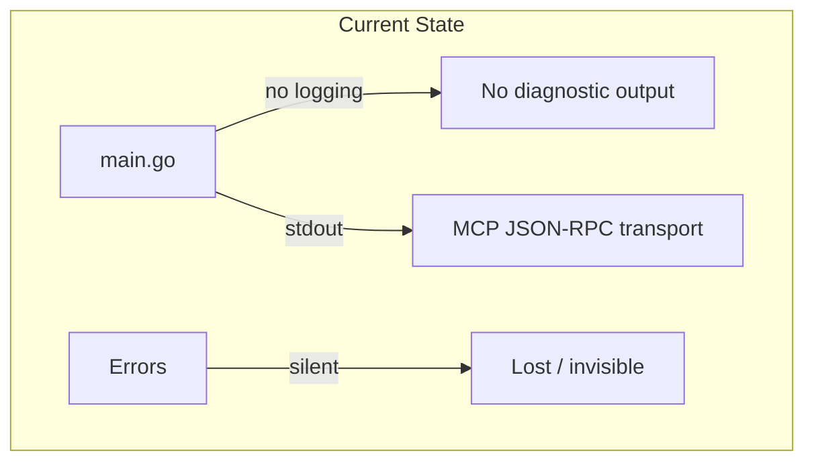
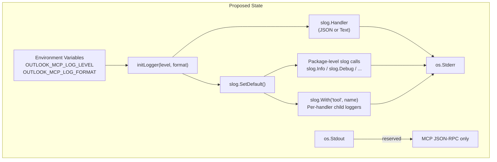
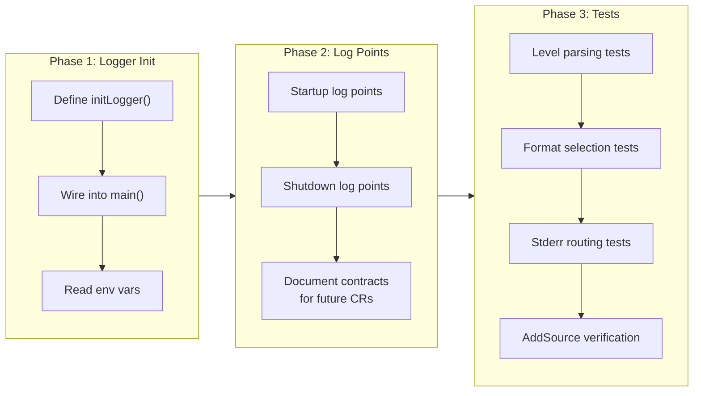
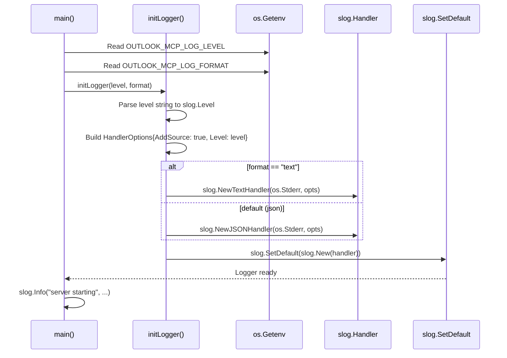

# Structured Logging with log/slog

## Change Summary

The Outlook Local MCP Server currently has no logging infrastructure. This CR introduces structured logging using Go's standard library `log/slog` package, establishing a consistent, machine-parseable logging framework that all subsequent server components will use. The implementation covers logger initialization, log level configuration via environment variables, mandatory log points for key server lifecycle events, and per-handler contextual logging with `slog.With()`.

## Motivation and Background

An MCP server communicates with its host over stdio, making stdout exclusively reserved for JSON-RPC protocol traffic. Without a disciplined logging strategy that routes all diagnostic output to stderr, any stray `fmt.Println` or default `log.Println` call will corrupt the MCP protocol stream and crash the client connection. Structured logging is therefore not a convenience feature but a correctness requirement.

Beyond protocol safety, structured logs provide critical operational visibility. When the server runs inside Claude Desktop or another MCP host, operators need machine-parseable log records to diagnose authentication failures, Graph API errors, retry storms, and slow tool calls. JSON-formatted slog output integrates directly with log aggregation tools and the Claude Desktop developer console at `~/Library/Logs/Claude/mcp-server-*.log`.

## Change Drivers

* **Protocol correctness**: stdout is reserved for MCP JSON-RPC; all diagnostic output MUST go to stderr
* **Operational visibility**: structured logs enable filtering, searching, and alerting on server behavior
* **Debugging efficiency**: `AddSource: true` provides automatic file/line attribution in every log record
* **Foundation for subsequent CRs**: all tool handlers (CR-0006 through CR-0009), authentication (CR-0003), and Graph API client code depend on this logging infrastructure
* **Standard library alignment**: using `log/slog` (Go 1.21+) avoids third-party dependencies and ensures long-term compatibility

## Current State

The project has no logging infrastructure. There are no log statements, no logger initialization, and no conventions for how diagnostic information should be emitted. Any code that currently writes to stdout would corrupt the MCP JSON-RPC transport.

### Current State Diagram



## Proposed Change

Introduce a `initLogger()` function that creates a configured `slog` logger at process startup, routing all output to `os.Stderr`. The logger supports JSON (default) and text formats, four log levels (debug, info, warn, error), and automatic source file/line annotation. Environment variables control runtime configuration. All subsequent server code uses the package-level `slog.Info()`, `slog.Debug()`, etc. functions or per-handler child loggers created with `slog.With()`.

### Proposed State Diagram



## Requirements

### Functional Requirements

1. The system **MUST** provide an `initLogger(levelStr, format string)` function that initializes the process-wide default logger
2. The `initLogger` function **MUST** parse the `levelStr` parameter as one of `debug`, `info`, `warn`, or `error` (case-insensitive), defaulting to `warn` for any unrecognized value
3. The `initLogger` function **MUST** select `slog.NewJSONHandler` when `format` is empty or `"json"`, and `slog.NewTextHandler` when `format` is `"text"`
4. All log handler constructors **MUST** receive `os.Stderr` as the `io.Writer` argument; no log output **MUST** ever be written to `os.Stdout`
5. The `slog.HandlerOptions` **MUST** set `AddSource: true` so that every log record includes the source file, line number, and function name
6. The `initLogger` function **MUST** call `slog.SetDefault()` to set the process-wide default logger
7. The `initLogger()` call **MUST** be the very first operation in `main()`, before any other code that might produce log output
8. The system **MUST** read the log level from the `OUTLOOK_MCP_LOG_LEVEL` environment variable
9. The system **MUST** read the log format from the `OUTLOOK_MCP_LOG_FORMAT` environment variable
10. The system **MUST** emit all mandatory log points specified in the "Required Log Points" section of this CR at their designated log levels
11. All log calls **MUST** use structured key-value attributes; string interpolation via `fmt.Sprintf` inside the message parameter is prohibited
12. Tool handler functions **MUST** use `slog.With("tool", toolName)` to create a per-handler child logger that automatically includes the tool name in every log record
13. The system **MUST** use only `log/slog` from the Go standard library; no third-party logging libraries (zerolog, zap, logrus, etc.) are permitted

### Non-Functional Requirements

1. Logger initialization **MUST** complete in under 1 millisecond to avoid delaying server startup
2. Logging at levels below the configured threshold **MUST** incur negligible overhead due to `slog`'s built-in level gating
3. Log output **MUST** be valid JSON (one object per line) when using the default JSON format, enabling consumption by log aggregation tools
4. Log records **MUST** include a `time`, `level`, `source`, and `msg` field at minimum

## Affected Components

* `main.go` -- `initLogger()` function and first call in `main()`
* `logger.go` (or equivalent) -- logger initialization logic if extracted from main
* All future tool handler files -- will use `slog.With()` for per-handler context
* All future Graph API client code -- will use package-level `slog.Debug()` for request/response logging

## Scope Boundaries

### In Scope

* `initLogger(levelStr, format string)` function implementation
* Environment variable reading for `OUTLOOK_MCP_LOG_LEVEL` and `OUTLOOK_MCP_LOG_FORMAT`
* Log level parsing (debug/info/warn/error with default warn)
* JSON and text handler selection
* `AddSource: true` configuration
* `slog.SetDefault()` call
* Definition and documentation of all mandatory log points (startup, tool lifecycle, Graph API, auth, retry, shutdown)
* Per-handler `slog.With()` pattern definition
* Unit tests for logger initialization
* Skeleton log points for server startup and shutdown that can be placed in `main()`

### Out of Scope ("Here, But Not Further")

* Configuration loading mechanism (environment variable parsing infrastructure) -- covered by CR-0001
* Authentication flow and its associated log points -- covered by CR-0003
* Actual tool handler implementations that emit tool lifecycle log points -- covered by CR-0006 through CR-0009
* Graph API client code that emits request/response debug log points -- covered by respective tool CRs
* Retry logic implementation that emits retry warning log points -- covered by Graph API client CR
* Log rotation, log file management, or log shipping -- handled by the MCP host (Claude Desktop) or external tooling
* Custom log levels beyond the four standard slog levels

## Alternative Approaches Considered

* **zerolog**: Provides zero-allocation JSON logging but introduces a third-party dependency. Rejected because the spec mandates `log/slog` only.
* **zap**: High-performance structured logger from Uber. Rejected for the same reason -- third-party dependency prohibited.
* **Standard `log` package**: Available in Go stdlib but lacks structured key-value logging, log levels, and the `AddSource` feature. Insufficient for the project's needs.
* **Custom logger wrapper**: Writing a wrapper around `log/slog` to add features. Rejected as unnecessary complexity; `slog`'s built-in features (handlers, `With()`, `AddSource`) cover all requirements.

## Impact Assessment

### User Impact

End users (MCP host operators, developers running the server locally) gain visibility into server behavior through structured log output on stderr. When `OUTLOOK_MCP_LOG_LEVEL=debug` is set, full diagnostic detail is available for troubleshooting. Default `warn` level keeps output minimal during normal operation.

### Technical Impact

* **No breaking changes**: this is a greenfield addition to the project
* **Dependency on Go 1.21+**: `log/slog` was introduced in Go 1.21; the project MUST use Go 1.21 or later (already established in CR-0001)
* **Convention enforcement**: all subsequent CRs MUST follow the logging patterns established here
* **stderr exclusivity**: reinforces the critical constraint that stdout is reserved for MCP JSON-RPC

### Business Impact

* Reduces mean time to diagnosis for production issues
* Enables proactive monitoring and alerting on error/warn log patterns
* No additional cost -- uses Go standard library only

## Implementation Approach

The implementation proceeds in three phases within a single PR.

### Phase 1: Logger Initialization

Implement the `initLogger()` function with level parsing, format selection, `AddSource: true`, and `slog.SetDefault()`. Wire it as the first call in `main()`.

### Phase 2: Mandatory Log Point Definitions

Define constants or documentation for all mandatory log points. Implement the startup and shutdown log points directly in `main()`. Other log points (tool lifecycle, Graph API, auth, retry) are documented as contracts for their respective CRs to implement.

### Phase 3: Testing

Write unit tests verifying logger initialization, level parsing, format selection, stderr routing, and source location inclusion.

### Implementation Flow



### Logger Initialization Sequence



## Test Strategy

### Tests to Add

| Test File | Test Name | Description | Inputs | Expected Output |
|-----------|-----------|-------------|--------|-----------------|
| `logger_test.go` | `TestInitLoggerDefaultLevel` | Verifies default log level is warn when an unrecognized string is provided | `levelStr="bogus", format="json"` | Logger level is `slog.LevelWarn` |
| `logger_test.go` | `TestInitLoggerDebugLevel` | Verifies debug level is correctly parsed | `levelStr="debug", format="json"` | Logger level is `slog.LevelDebug` |
| `logger_test.go` | `TestInitLoggerInfoLevel` | Verifies info level is correctly parsed | `levelStr="info", format="json"` | Logger level is `slog.LevelInfo` |
| `logger_test.go` | `TestInitLoggerWarnLevel` | Verifies warn level is correctly parsed | `levelStr="warn", format="json"` | Logger level is `slog.LevelWarn` |
| `logger_test.go` | `TestInitLoggerErrorLevel` | Verifies error level is correctly parsed | `levelStr="error", format="json"` | Logger level is `slog.LevelError` |
| `logger_test.go` | `TestInitLoggerCaseInsensitive` | Verifies level parsing is case-insensitive | `levelStr="DEBUG", format="json"` | Logger level is `slog.LevelDebug` |
| `logger_test.go` | `TestInitLoggerJSONFormat` | Verifies JSON handler is selected by default | `levelStr="info", format="json"` | Output is valid JSON with `time`, `level`, `msg` fields |
| `logger_test.go` | `TestInitLoggerTextFormat` | Verifies text handler when format is "text" | `levelStr="info", format="text"` | Output is `key=value` format |
| `logger_test.go` | `TestInitLoggerDefaultFormat` | Verifies JSON handler when format is empty | `levelStr="info", format=""` | Output is valid JSON |
| `logger_test.go` | `TestInitLoggerStderrOnly` | Verifies log output goes to stderr, not stdout | `levelStr="info", format="json"` | stderr has output, stdout is empty |
| `logger_test.go` | `TestInitLoggerAddSource` | Verifies `AddSource: true` includes source location | `levelStr="info", format="json"` | JSON output contains `source` field with `file` and `line` |
| `logger_test.go` | `TestInitLoggerSetsDefault` | Verifies `slog.SetDefault()` is called | `levelStr="info", format="json"` | `slog.Default()` returns the configured logger |
| `logger_test.go` | `TestLoggerWithContext` | Verifies `slog.With()` adds persistent attributes | Child logger with `"tool", "list_events"` | All log records include `tool=list_events` |
| `logger_test.go` | `TestLogLevelGating` | Verifies messages below threshold are suppressed | Level set to `warn`, emit `slog.Debug()` | Debug message does not appear in output |

### Tests to Modify

Not applicable. This is a greenfield component with no existing tests.

### Tests to Remove

Not applicable. No existing tests to remove.

## Acceptance Criteria

### AC-1: Logger initialization with default level

```gherkin
Given the OUTLOOK_MCP_LOG_LEVEL environment variable is not set
When initLogger is called with an empty level string
Then the logger MUST be configured with slog.LevelWarn as the minimum level
  And the logger MUST write output to os.Stderr
  And the logger MUST use slog.NewJSONHandler as the default format
```

### AC-2: Logger initialization with explicit debug level

```gherkin
Given the OUTLOOK_MCP_LOG_LEVEL environment variable is set to "debug"
When initLogger is called with levelStr="debug"
Then the logger MUST be configured with slog.LevelDebug as the minimum level
  And debug-level messages MUST appear in the log output
```

### AC-3: Text format selection

```gherkin
Given the OUTLOOK_MCP_LOG_FORMAT environment variable is set to "text"
When initLogger is called with format="text"
Then the logger MUST use slog.NewTextHandler
  And log output MUST be in key=value format
```

### AC-4: Stdout protection

```gherkin
Given the logger has been initialized
When any slog call is made (Debug, Info, Warn, or Error)
Then the output MUST appear on os.Stderr
  And no output MUST appear on os.Stdout
```

### AC-5: Source location in log records

```gherkin
Given the logger has been initialized with AddSource: true
When a log message is emitted
Then the log record MUST contain a "source" field
  And the source field MUST include "file" and "line" subfields
  And the file value MUST be the actual source file path of the call site
```

### AC-6: Process-wide default logger

```gherkin
Given initLogger has been called
When slog.Default() is invoked anywhere in the codebase
Then the returned logger MUST be the one configured by initLogger
  And package-level slog.Info(), slog.Debug(), etc. MUST use this logger
```

### AC-7: Per-handler contextual logging

```gherkin
Given a tool handler function creates a child logger with slog.With("tool", "list_events")
When the child logger emits any log message
Then the log record MUST include the attribute tool="list_events"
  And the log record MUST still include source location, time, and level
```

### AC-8: Log level gating

```gherkin
Given the logger is configured with level "warn"
When a slog.Debug() or slog.Info() call is made
Then the message MUST NOT appear in the log output
  And slog.Warn() and slog.Error() messages MUST appear
```

### AC-9: Startup log sequence

```gherkin
Given the server is starting up
When main() executes after initLogger()
Then the log output MUST include an info-level "server starting" message
  And the message MUST include "version" and "transport" attributes
```

### AC-10: initLogger is first operation in main

```gherkin
Given the main() function is defined
When the source code is inspected
Then initLogger() MUST be the very first function call in main()
  And no other code that could produce output MUST precede it
```

## Quality Standards Compliance

### Build & Compilation

- [ ] Code compiles/builds without errors
- [ ] No new compiler warnings introduced

### Linting & Code Style

- [ ] All linter checks pass with zero warnings/errors
- [ ] Code follows project coding conventions and style guides
- [ ] Any linter exceptions are documented with justification

### Test Execution

- [ ] All existing tests pass after implementation
- [ ] All new tests pass
- [ ] Test coverage meets project requirements for changed code

### Documentation

- [ ] Inline code documentation updated where applicable
- [ ] API documentation updated for any API changes
- [ ] User-facing documentation updated if behavior changes

### Code Review

- [ ] Changes submitted via pull request
- [ ] PR title follows Conventional Commits format
- [ ] Code review completed and approved
- [ ] Changes squash-merged to maintain linear history

### Verification Commands

```bash
# Build verification
go build ./...

# Lint verification
golangci-lint run ./...

# Test execution
go test -v -race ./...

# Test coverage for logger
go test -cover -coverprofile=coverage.out ./...
go tool cover -func=coverage.out | grep -E "initLogger|logger"
```

## Risks and Mitigation

### Risk 1: Accidental stdout writes in future code

**Likelihood:** medium
**Impact:** high (corrupts MCP JSON-RPC transport, breaks client connection)
**Mitigation:** Code review checklist item: verify no `fmt.Print*` or `log.Print*` calls targeting stdout. Add a CI lint rule or `go vet` check that flags direct stdout writes. Document the stderr-only constraint prominently in contributing guidelines.

### Risk 2: Excessive debug logging impacts performance

**Likelihood:** low
**Impact:** low (debug level is opt-in via environment variable)
**Mitigation:** Default log level is `warn`, which suppresses debug and info messages. `slog`'s built-in level check short-circuits before allocating log records, so disabled levels have negligible overhead.

### Risk 3: Log format incompatibility with MCP host log viewer

**Likelihood:** low
**Impact:** medium (logs may not be parseable by Claude Desktop developer tools)
**Mitigation:** JSON is the default format, which is what Claude Desktop's `mcp-server-*.log` files expect. Text format is opt-in for local debugging only.

### Risk 4: Missing log points in subsequent CRs

**Likelihood:** medium
**Impact:** medium (reduced operational visibility)
**Mitigation:** This CR documents all mandatory log points as contracts. Each subsequent CR's acceptance criteria MUST reference the specific log points it is responsible for implementing. Code review checklists MUST verify log point compliance.

## Dependencies

* **CR-0001 (Project Foundation)**: provides the `go.mod`, project structure, and environment variable reading mechanism that `initLogger()` depends on
* **Go 1.21+**: `log/slog` is only available in Go 1.21 and later; the project's `go.mod` MUST specify `go 1.21` or higher

## Estimated Effort

| Phase | Effort |
|-------|--------|
| Phase 1: Logger initialization function | 2 hours |
| Phase 2: Mandatory log point definitions and startup/shutdown logs | 1 hour |
| Phase 3: Unit tests | 3 hours |
| Code review and iteration | 1 hour |
| **Total** | **7 hours** |

## Decision Outcome

Chosen approach: "Go standard library `log/slog` with JSON default format to stderr", because it satisfies the spec requirement for stdlib-only logging, provides structured output compatible with MCP host log viewers, enforces the critical stdout/stderr separation via handler construction, and includes automatic source location annotation without custom code.

## Related Items

* Spec reference: `docs/reference/outlook-local-mcp-spec.md`, section "Structured logging with log/slog" (lines 1252-1477)
* Depends on: CR-0001 (Project Foundation and Configuration)
* Depended on by: CR-0003 (Authentication), CR-0006 through CR-0009 (Tool Handlers)
* Related pattern: MCP stdio transport constraint (stdout reserved for JSON-RPC)

## Required Log Points Reference

The following table summarizes all mandatory log points defined by the spec. Each log point is assigned to the CR responsible for its implementation.

| Category | Level | Message | Key Attributes | Implementing CR |
|----------|-------|---------|----------------|-----------------|
| Startup | info | `server starting` | `version`, `transport` | CR-0002 |
| Startup | info | `persistent token cache initialized` | `cache_name` | CR-0003 |
| Startup | warn | `persistent token cache unavailable, using in-memory cache` | `error` | CR-0003 |
| Startup | info | `authentication record loaded` | `path` | CR-0003 |
| Startup | info | `no authentication record found, device code flow required` | `path` | CR-0003 |
| Startup | info | `authentication successful` | `tenant` | CR-0003 |
| Startup | info | `authentication record saved` | `path` | CR-0003 |
| Startup | info | `graph client initialized` | `scopes` | CR-0003 |
| Startup | info | `tool registered` | `tool` | CR-0002 |
| Startup | info | `stdio transport started, waiting for requests` | (none) | CR-0002 |
| Tool call | debug | `tool called` | `tool`, `params` | CR-0006..CR-0009 |
| Tool call | info | `tool completed` | `tool`, `duration_ms`, `result_count` | CR-0006..CR-0009 |
| Tool call | error | `tool failed` | `tool`, `error`, `duration_ms` | CR-0006..CR-0009 |
| Tool call | warn | `invalid tool parameters` | `tool`, `error` | CR-0006..CR-0009 |
| Graph API | debug | `graph api request` | `method`, `path`, `query_params` | CR-0006..CR-0009 |
| Graph API | debug | `graph api response` | `path`, `event_count`, `has_next_page` | CR-0006..CR-0009 |
| Auth | debug | `token cache hit, using cached credential` | (none) | CR-0003 |
| Auth | warn | `token refresh required, attempting silent refresh` | (none) | CR-0003 |
| Auth | error | `token refresh failed, re-authentication required` | `error` | CR-0003 |
| Auth | info | `device code message displayed to user` | (none) | CR-0003 |
| Retry | warn | `graph api rate limited, retrying` | `attempt`, `max_attempts`, `retry_after_seconds`, `path` | CR-0006..CR-0009 |
| Retry | warn | `graph api service unavailable, retrying` | `attempt`, `wait_seconds`, `path` | CR-0006..CR-0009 |
| Retry | error | `graph api retries exhausted` | `attempts`, `last_status`, `path` | CR-0006..CR-0009 |
| Shutdown | info | `server shutting down` | `reason`, optionally `signal` | CR-0002 |
