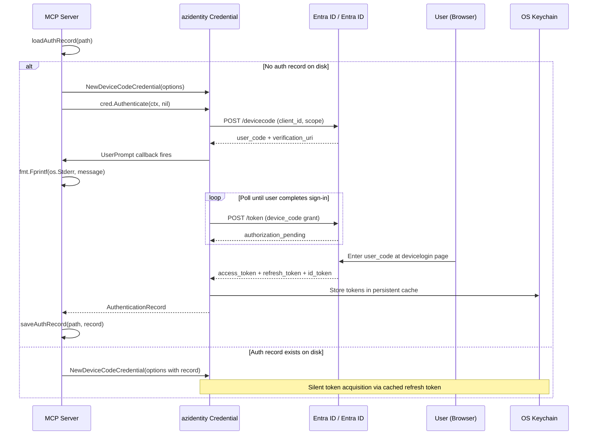
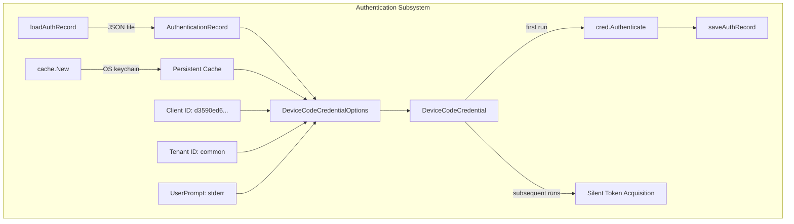
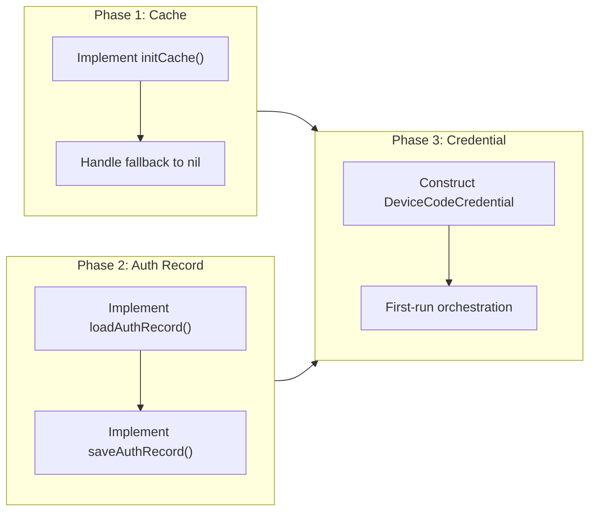

# Authentication & Token Persistence

## Change Summary

The Outlook Local MCP Server currently has no authentication implementation. This CR introduces device code flow authentication using the Microsoft Office first-party client ID (`d3590ed6-52b3-4102-aeff-aad2292ab01c`) via the `azidentity` library, persistent OS-native token caching via the `azidentity/cache` package, and authentication record persistence to disk. Together these mechanisms ensure that users authenticate interactively only once and all subsequent runs acquire tokens silently.

## Motivation and Background

The MCP server requires authenticated access to the Microsoft Graph API to read and write calendar events on behalf of the user. Without authentication, no calendar operations can be performed. The device code flow is chosen specifically because the MCP server runs as a CLI process with no browser integration and no ability to handle OAuth redirect URIs. Using the Microsoft Office first-party client ID eliminates the need for users to register their own Entra ID application, dramatically lowering the barrier to adoption.

Token persistence is equally critical: requiring users to re-authenticate on every server startup would make the tool impractical for daily use. The combination of OS keychain-backed token caching and authentication record persistence provides a seamless experience where the device code prompt appears only on first run.

## Change Drivers

* The MCP server cannot perform any Graph API operations without valid authentication credentials.
* Device code flow is the only viable OAuth flow for a stdio-based MCP server process.
* The Microsoft Office client ID is pre-authorized for `Calendars.ReadWrite` in all Entra ID tenants, eliminating app registration requirements.
* Token persistence is required for a usable developer experience; re-authentication on every launch is unacceptable.
* Secure token storage via OS keychain prevents plaintext credential leakage.

## Current State

The project has no authentication implementation. There is no credential construction, no token caching, and no authentication record management. The codebase at commit `a95b083` contains the initial project structure but no functional authentication code.

## Proposed Change

Implement a complete authentication subsystem consisting of three tightly integrated components:

1. **Device Code Credential Construction** -- Create an `azidentity.DeviceCodeCredential` configured with the Microsoft Office client ID, a configurable tenant ID (defaulting to `"common"`), a persistent token cache, an authentication record loaded from disk, and a `UserPrompt` callback that writes exclusively to stderr.

2. **Persistent Token Cache** -- Initialize an OS-native encrypted token cache using `cache.New(&cache.Options{Name: "outlook-local-mcp"})` with graceful fallback to in-memory caching when the OS keychain is unavailable.

3. **Authentication Record Persistence** -- Implement `loadAuthRecord` and `saveAuthRecord` functions that read and write a JSON-serialized `azidentity.AuthenticationRecord` to `~/.outlook-local-mcp/auth_record.json` (configurable via environment variable), with appropriate file and directory permissions.

4. **First-Run vs Subsequent-Run Orchestration** -- Detect whether an authentication record exists. On first run, explicitly call `cred.Authenticate(ctx, nil)` to trigger the device code flow, then persist the resulting record. On subsequent runs, rely on the cached refresh token for silent token acquisition.

### Device Code Flow Sequence Diagram



### Proposed Architecture Diagram



## Requirements

### Functional Requirements

1. The system **MUST** construct an `azidentity.DeviceCodeCredential` using client ID `d3590ed6-52b3-4102-aeff-aad2292ab01c`.
2. The system **MUST** use `"common"` as the default tenant ID when no tenant ID is configured.
3. The system **MUST** allow the tenant ID to be overridden via configuration (sourced from CR-0001).
4. The system **MUST** request exactly the scope `Calendars.ReadWrite` and no other explicit scopes.
5. The system **MUST** print device code prompts to stderr via the `UserPrompt` callback and **MUST** never write authentication prompts to stdout.
6. The system **MUST** initialize a persistent token cache using `cache.New(&cache.Options{Name: "outlook-local-mcp"})`.
7. The system **MUST** fall back to in-memory caching (passing `nil` for the `Cache` option) when the OS keychain is unavailable, and **MUST** log a warning when this fallback occurs.
8. The system **MUST** implement a `loadAuthRecord(path string) azidentity.AuthenticationRecord` function that reads and deserializes a JSON authentication record from the specified file path.
9. The system **MUST** implement a `saveAuthRecord(path string, record azidentity.AuthenticationRecord) error` function that serializes and writes the authentication record to the specified file path.
10. The system **MUST** return a zero-value `azidentity.AuthenticationRecord{}` when the authentication record file does not exist or contains invalid JSON.
11. The system **MUST** detect first-run conditions by comparing the loaded authentication record against `azidentity.AuthenticationRecord{}` (zero-value comparison).
12. The system **MUST** call `cred.Authenticate(ctx, nil)` on first run to trigger the device code flow and obtain an `AuthenticationRecord`.
13. The system **MUST** persist the `AuthenticationRecord` to disk immediately after successful first-run authentication.
14. The system **MUST** use the default authentication record path `~/.outlook-local-mcp/auth_record.json` when no override is configured.
15. The system **MUST** allow the authentication record path to be overridden via environment variable configuration (sourced from CR-0001).

### Non-Functional Requirements

1. The system **MUST** create the authentication record file with permissions `0600` (owner read/write only).
2. The system **MUST** create the authentication record directory with permissions `0700` (owner read/write/execute only).
3. The system **MUST** never write tokens, secrets, or credentials to the authentication record file; only the `AuthenticationRecord` metadata (account ID, tenant, authority) is persisted.
4. The system **MUST** log all authentication lifecycle events (cache initialization, record load/save, authentication success/failure) using structured logging via `slog` (sourced from CR-0002).
5. The system **MUST** terminate with a non-zero exit code if device code authentication fails on first run.
6. The system **MUST** not block MCP JSON-RPC communication on stdout during the device code flow.

## Affected Components

* `internal/auth/` -- New package containing authentication credential construction, token cache initialization, and authentication record persistence.
* `cmd/outlook-local-mcp/main.go` -- Startup orchestration calling into the auth package.
* `go.mod` / `go.sum` -- New dependencies on `azidentity` and `azidentity/cache`.

## Scope Boundaries

### In Scope

* `azidentity.NewDeviceCodeCredential` construction with all required options.
* `UserPrompt` callback implementation writing to stderr.
* `cache.New` for persistent OS-native token caching with graceful fallback.
* `loadAuthRecord` and `saveAuthRecord` functions with file I/O and JSON serialization.
* First-run vs subsequent-run detection and orchestration.
* File and directory permission enforcement for the authentication record.
* Structured logging for all authentication events.

### Out of Scope ("Here, But Not Further")

* Graph client construction using the credential -- addressed in CR-0004.
* MCP server setup and tool registration -- addressed in CR-0004.
* Configuration loading (environment variables, config struct) -- addressed in CR-0001. This CR consumes configuration values but does not define how they are loaded.
* Logging infrastructure setup (`slog` handler configuration) -- addressed in CR-0002. This CR calls `slog` functions but does not configure the logger.
* Token refresh logic -- handled internally by the `azidentity` library; no custom implementation required.
* Multi-account support -- only a single authenticated account is supported.
* Custom Entra ID app registration -- the Microsoft Office first-party client ID is used exclusively.

## Alternative Approaches Considered

* **Azure CLI client ID (`04b07795-8ddb-461a-bbee-02f9e1bf7b46`)** -- Rejected because it does not have `Calendars.ReadWrite` pre-authorized and fails with `AADSTS65002`.
* **Interactive browser flow (`azidentity.InteractiveBrowserCredential`)** -- Rejected because the MCP server runs as a stdio process without the ability to open a browser or listen for redirect URIs reliably.
* **Client credentials flow (app-only)** -- Rejected because it requires an Entra ID app registration and admin-consented application permissions, contradicting the zero-setup design goal.
* **Manual OAuth implementation** -- Rejected in favor of the well-maintained `azidentity` library which handles token refresh, caching integration, and error handling.
* **Storing tokens directly on disk instead of using OS keychain** -- Rejected because plaintext token storage is a security risk. The `azidentity/cache` package leverages OS-native secure storage.

## Impact Assessment

### User Impact

On first run, users will see a device code prompt on stderr instructing them to visit `https://microsoft.com/devicelogin` and enter a code. This is a one-time interaction. On all subsequent runs, authentication is silent and invisible. If the OS keychain is cleared or the authentication record is deleted, the user will need to re-authenticate.

### Technical Impact

* **New dependencies:** `github.com/Azure/azure-sdk-for-go/sdk/azidentity` and `github.com/Azure/azure-sdk-for-go/sdk/azidentity/cache`. These are official Microsoft SDKs with stable APIs.
* **OS-specific behavior:** Token caching uses macOS Keychain, Linux libsecret, or Windows DPAPI. Systems without these services will fall back to in-memory caching.
* **File system changes:** Creates `~/.outlook-local-mcp/` directory and `auth_record.json` file on the user's system.
* **No breaking changes:** This is a new subsystem with no existing code to modify.

### Business Impact

Authentication is a prerequisite for all calendar operations. Until this CR is implemented, no other functional CR (calendar read/write, MCP tool registration) can be validated end-to-end. This is on the critical path for the first usable release.

## Implementation Approach

The implementation is structured in three phases within a single package (`internal/auth/`).

### Phase 1: Token Cache Initialization

Implement the persistent cache initialization function that calls `cache.New` and handles the fallback case. This is a standalone function with no dependencies on other auth components.

### Phase 2: Authentication Record Persistence

Implement `loadAuthRecord` and `saveAuthRecord` as pure functions operating on a file path. These handle JSON serialization, file I/O, directory creation, and permission enforcement.

### Phase 3: Credential Construction and Orchestration

Wire together the cache, authentication record, and credential options into a single `SetupCredential` (or similar) function that returns a configured `azidentity.DeviceCodeCredential`. This function orchestrates first-run detection and the `cred.Authenticate` call.

### Implementation Flow



## Test Strategy

### Tests to Add

| Test File | Test Name | Description | Inputs | Expected Output |
|-----------|-----------|-------------|--------|-----------------|
| `internal/auth/auth_test.go` | `TestLoadAuthRecord_FileNotFound` | Validates that a missing file returns a zero-value AuthenticationRecord | Non-existent file path | Zero-value `azidentity.AuthenticationRecord{}` |
| `internal/auth/auth_test.go` | `TestLoadAuthRecord_ValidJSON` | Validates that a valid JSON auth record is deserialized correctly | Temp file with valid JSON | Populated `AuthenticationRecord` with correct fields |
| `internal/auth/auth_test.go` | `TestLoadAuthRecord_InvalidJSON` | Validates graceful handling of corrupt JSON | Temp file with invalid JSON | Zero-value `azidentity.AuthenticationRecord{}` |
| `internal/auth/auth_test.go` | `TestSaveAuthRecord_CreatesDirectory` | Validates that the parent directory is created with 0700 permissions | Path under non-existent directory | Directory created with 0700, file created with 0600 |
| `internal/auth/auth_test.go` | `TestSaveAuthRecord_FilePermissions` | Validates that the auth record file is written with 0600 permissions | Valid record and temp path | File exists with 0600 permissions |
| `internal/auth/auth_test.go` | `TestSaveAuthRecord_RoundTrip` | Validates save then load produces the same record | Valid `AuthenticationRecord` | Loaded record equals saved record |
| `internal/auth/auth_test.go` | `TestInitCache_Fallback` | Validates that cache initialization returns nil when keychain is unavailable | Environment without keychain | `nil` cache returned, warning logged |
| `internal/auth/auth_test.go` | `TestUserPrompt_WritesToStderr` | Validates that the UserPrompt callback writes to stderr, not stdout | Mock `DeviceCodeMessage` | Output captured on stderr, stdout empty |
| `internal/auth/auth_test.go` | `TestFirstRunDetection_ZeroValueRecord` | Validates that a zero-value record is detected as first run | `azidentity.AuthenticationRecord{}` | First-run path is taken |
| `internal/auth/auth_test.go` | `TestFirstRunDetection_PopulatedRecord` | Validates that a non-zero record skips first-run path | Populated `AuthenticationRecord` | First-run path is skipped |

### Tests to Modify

Not applicable. This is a new subsystem with no existing tests.

### Tests to Remove

Not applicable. No existing tests are affected by this change.

## Acceptance Criteria

### AC-1: Device Code Credential Construction

```gherkin
Given the server is starting up
  And configuration provides a client ID of "d3590ed6-52b3-4102-aeff-aad2292ab01c"
  And configuration provides a tenant ID of "common"
When the authentication subsystem initializes the credential
Then an azidentity.DeviceCodeCredential is constructed with the specified client ID and tenant ID
  And the credential's Cache is set to the persistent token cache (or nil on fallback)
  And the credential's AuthenticationRecord is loaded from disk
  And the credential's UserPrompt callback writes to stderr
```

### AC-2: Device Code Prompt Outputs to Stderr

```gherkin
Given the device code flow is triggered
When Entra ID returns a user_code and verification_uri
Then the UserPrompt callback prints the device code message to stderr
  And no output is written to stdout
```

### AC-3: Persistent Token Cache Initialization

```gherkin
Given the OS provides a keychain service (macOS Keychain, Linux libsecret, or Windows DPAPI)
When the cache is initialized with cache.New(&cache.Options{Name: "outlook-local-mcp"})
Then a non-nil persistent cache is returned
  And an informational log message is emitted confirming cache initialization
```

### AC-4: Token Cache Graceful Fallback

```gherkin
Given the OS keychain service is unavailable
When the cache initialization is attempted
Then cache.New returns an error
  And the system falls back to in-memory caching by using a nil Cache value
  And a warning log message is emitted indicating the fallback
```

### AC-5: Authentication Record Load (File Exists)

```gherkin
Given an authentication record file exists at the configured path
  And the file contains valid JSON representing an AuthenticationRecord
When loadAuthRecord is called with that path
Then the function returns a populated AuthenticationRecord matching the file contents
  And an informational log message is emitted confirming the record was loaded
```

### AC-6: Authentication Record Load (File Missing)

```gherkin
Given no authentication record file exists at the configured path
When loadAuthRecord is called with that path
Then the function returns a zero-value AuthenticationRecord
  And an informational log message is emitted indicating no record was found
```

### AC-7: Authentication Record Load (Corrupt JSON)

```gherkin
Given an authentication record file exists at the configured path
  And the file contains invalid or corrupt JSON
When loadAuthRecord is called with that path
Then the function returns a zero-value AuthenticationRecord
  And a warning log message is emitted indicating the record is corrupt
```

### AC-8: Authentication Record Save

```gherkin
Given a valid AuthenticationRecord has been obtained from authentication
When saveAuthRecord is called with a file path and the record
Then the parent directory is created with permissions 0700 if it does not exist
  And the record is serialized to JSON and written to the file
  And the file is created with permissions 0600
  And an informational log message is emitted confirming the save
```

### AC-9: First-Run Authentication Flow

```gherkin
Given no authentication record exists on disk (zero-value record loaded)
When the authentication subsystem detects the first-run condition
Then cred.Authenticate(ctx, nil) is called to trigger device code flow
  And upon successful authentication the returned AuthenticationRecord is saved to disk
  And a log message confirms successful authentication with the tenant ID
```

### AC-10: Subsequent-Run Silent Authentication

```gherkin
Given a valid authentication record exists on disk
  And the persistent token cache contains a valid refresh token
When the authentication subsystem initializes
Then no device code flow is triggered
  And token acquisition occurs silently via the cached refresh token
```

### AC-11: Authentication Failure on First Run

```gherkin
Given no authentication record exists on disk
When cred.Authenticate(ctx, nil) is called and fails
Then an error log message is emitted with the failure details
  And the server terminates with a non-zero exit code
```

## Quality Standards Compliance

### Build & Compilation

- [ ] Code compiles/builds without errors
- [ ] No new compiler warnings introduced

### Linting & Code Style

- [ ] All linter checks pass with zero warnings/errors
- [ ] Code follows project coding conventions and style guides
- [ ] Any linter exceptions are documented with justification

### Test Execution

- [ ] All existing tests pass after implementation
- [ ] All new tests pass
- [ ] Test coverage meets project requirements for changed code

### Documentation

- [ ] Inline code documentation updated where applicable
- [ ] API documentation updated for any API changes
- [ ] User-facing documentation updated if behavior changes

### Code Review

- [ ] Changes submitted via pull request
- [ ] PR title follows Conventional Commits format
- [ ] Code review completed and approved
- [ ] Changes squash-merged to maintain linear history

### Verification Commands

```bash
# Build verification
go build ./...

# Lint verification
golangci-lint run ./...

# Test execution
go test ./internal/auth/... -v -count=1

# Test coverage
go test ./internal/auth/... -coverprofile=coverage.out
go tool cover -func=coverage.out
```

## Risks and Mitigation

### Risk 1: OS Keychain Unavailable in CI/CD or Headless Environments

**Likelihood:** high
**Impact:** medium
**Mitigation:** The implementation gracefully falls back to in-memory caching when `cache.New` fails. This is acceptable for CI/CD environments where tokens are ephemeral. A warning log is emitted so operators are aware of the degraded state.

### Risk 2: Microsoft Revokes or Changes Pre-Authorization for the Office Client ID

**Likelihood:** low
**Impact:** critical
**Mitigation:** The Microsoft Office client ID has been stable and widely used for years. If pre-authorization changes, the fix would be to switch to a different well-known client ID or require users to register their own app. This would be handled in a future CR.

### Risk 3: Authentication Record File Corruption

**Likelihood:** low
**Impact:** low
**Mitigation:** The `loadAuthRecord` function treats corrupt JSON as equivalent to a missing file and returns a zero-value record, triggering re-authentication. The user experience degrades only to a one-time device code prompt.

### Risk 4: Device Code Flow Timeout

**Likelihood:** medium
**Impact:** low
**Mitigation:** The Entra ID device code has a ~15-minute expiration window. If the user does not complete sign-in in time, the `Authenticate` call returns an error and the server exits with an error message. The user can simply restart and try again.

### Risk 5: File Permission Issues on Shared Systems

**Likelihood:** low
**Impact:** medium
**Mitigation:** The authentication record is written with `0600` permissions and the directory with `0700`, preventing other users from reading the file. The `AuthenticationRecord` itself contains no tokens, limiting the impact even if permissions are compromised.

## Dependencies

* **CR-0001 (Configuration):** Provides the configuration struct with `ClientID`, `TenantID`, `AuthRecordPath`, and `CacheName` fields. This CR consumes those values but does not define how they are loaded.
* **CR-0002 (Logging):** Provides the configured `slog` handler. This CR emits log messages via `slog` but does not configure the logging infrastructure.
* **`github.com/Azure/azure-sdk-for-go/sdk/azidentity`:** Core authentication library providing `DeviceCodeCredential`, `AuthenticationRecord`, and related types.
* **`github.com/Azure/azure-sdk-for-go/sdk/azidentity/cache`:** Persistent token cache backed by OS keychain.

## Estimated Effort

* **Phase 1 (Token Cache Initialization):** 1-2 hours
* **Phase 2 (Auth Record Persistence):** 2-3 hours
* **Phase 3 (Credential Construction & Orchestration):** 2-3 hours
* **Unit Tests:** 3-4 hours
* **Integration Testing & Manual Verification:** 2-3 hours
* **Total Estimated Effort:** 10-15 person-hours

## Decision Outcome

Chosen approach: "Device code flow with Microsoft Office client ID, OS-native token cache, and file-based authentication record persistence", because it provides zero-configuration authentication (no app registration required), secure token storage via OS keychain, and a seamless subsequent-run experience with silent token acquisition. The `azidentity` library handles all token lifecycle management, minimizing custom code and security risk.

## Related Items

* Related change requests: CR-0001 (Configuration), CR-0002 (Logging), CR-0004 (Graph Client & MCP Server)
* Specification reference: `docs/reference/outlook-local-mcp-spec.md` (sections "Authentication: device code flow without app registration" and "Token caching and persistence")

## More Information

### Microsoft Office Client ID Details

The client ID `d3590ed6-52b3-4102-aeff-aad2292ab01c` is the Microsoft Office first-party application. It is present in every Entra ID / Entra ID tenant by default and has pre-authorized delegated permissions for a broad set of Microsoft Graph scopes including `Calendars.ReadWrite`. This is the only well-known client ID confirmed to work with calendar scopes via device code flow. The Azure CLI client ID (`04b07795-8ddb-461a-bbee-02f9e1bf7b46`) explicitly does not support calendar scopes.

### AuthenticationRecord Security Properties

The `azidentity.AuthenticationRecord` struct contains only non-secret metadata: account ID, tenant ID, client ID, and authority host. It contains no access tokens, refresh tokens, or other credentials. This makes it safe to store as a plain JSON file on disk. The actual tokens are stored exclusively in the OS keychain via the persistent cache mechanism. Even if the authentication record file is compromised, an attacker cannot use it to obtain tokens without access to the OS keychain.

### Scope Justification

`Calendars.ReadWrite` is the minimum delegated permission that supports all required calendar operations (read, create, update, delete events). `Calendars.Read` is insufficient because it does not permit write operations. `Calendars.ReadBasic` omits body content entirely. The `offline_access` scope is automatically included by the Azure Identity library to ensure a refresh token is obtained. No additional scopes are requested to follow the principle of least privilege.
