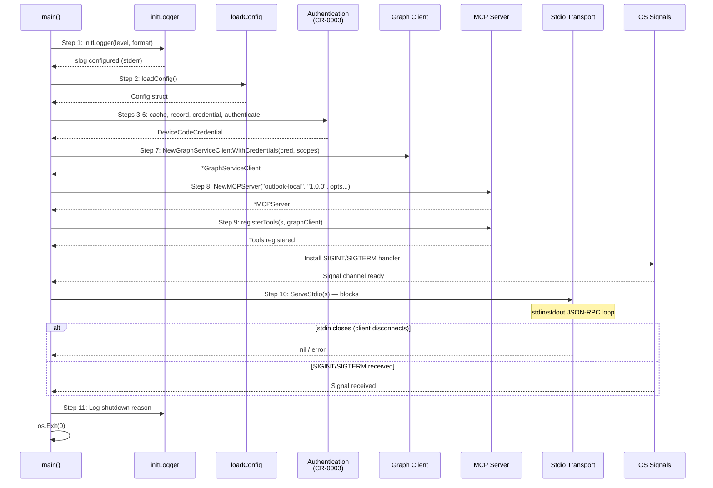
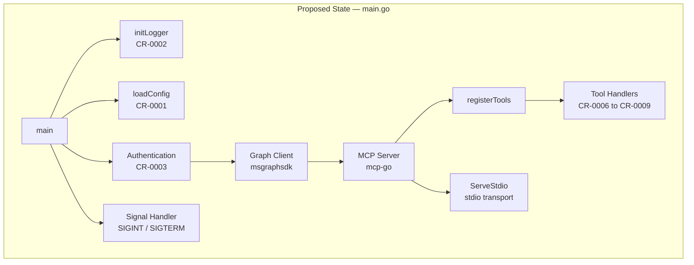
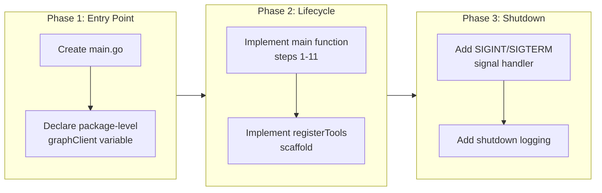

# Graph Client & MCP Server Bootstrap

## Change Summary

The project currently has no runtime entry point — there is no `main()` function, no Graph client initialization, no MCP server creation, and no stdio transport wiring. This CR introduces the complete server bootstrap lifecycle that ties together configuration (CR-0001), logging (CR-0002), and authentication (CR-0003) into a working `main()` function, creates the Microsoft Graph client, constructs the MCP server with the correct options, provides a `registerTools` scaffold for future tool CRs, starts the stdio transport, and handles graceful shutdown via signal handling.

## Motivation and Background

The Outlook Local MCP Server is a single Go binary that runs as a local stdio-based MCP server for Claude Desktop. Without the bootstrap lifecycle implemented, none of the individual components (logging, config, auth, tools) can function as a cohesive system. This CR is the integration point that orchestrates the full startup sequence (steps 1-11 from the spec) and establishes the runtime foundation on which all tool handlers will be registered.

The Graph client is the single shared dependency for every tool handler. It must be initialized exactly once at startup and made available to all handlers via a package-level variable. The MCP server must be configured with the correct name, version, and options before tools can be registered. The stdio transport must be started last and must block until the client disconnects.

## Change Drivers

* **Integration requirement** — CR-0001, CR-0002, and CR-0003 produce individual components that must be composed into a working application lifecycle.
* **Dependency for tool CRs** — CR-0006 through CR-0009 (tool implementations) cannot be developed or tested without a functional server bootstrap and Graph client.
* **Spec compliance** — The specification defines an explicit 11-step startup sequence that must be implemented faithfully to ensure correct behavior with Claude Desktop.
* **Stdio protocol safety** — stdout must be reserved exclusively for MCP JSON-RPC messages; all other output must go to stderr. This constraint must be enforced at the bootstrap level.

## Current State

There is no `main.go` file or any Go source code in the repository. The project consists only of documentation and specification files. No Graph client, MCP server, or stdio transport exists.

## Proposed Change

Implement the complete server bootstrap in `main.go` at the repository root, consisting of:

1. A `main()` function that executes the full 11-step startup lifecycle from the specification.
2. Graph client initialization using `msgraphsdk.NewGraphServiceClientWithCredentials`.
3. MCP server creation using `server.NewMCPServer` with appropriate options.
4. A `registerTools(s, graphClient)` function that serves as the registration point for tool handlers.
5. Stdio transport startup via `server.ServeStdio(s)`.
6. Signal handling for SIGINT and SIGTERM for graceful shutdown.

### Startup Lifecycle Sequence



### Proposed Component Diagram



## Requirements

### Functional Requirements

1. The `main()` function **MUST** execute the startup steps in the exact order specified: (1) init logger, (2) load config, (3) init cache, (4) load auth record, (5) create credential, (6) authenticate if needed, (7) create Graph client, (8) create MCP server, (9) register tools, (10) start stdio transport, (11) log shutdown on exit.

2. The Graph client **MUST** be created using `msgraphsdk.NewGraphServiceClientWithCredentials(cred, []string{"Calendars.ReadWrite"})` where `cred` is the `*azidentity.DeviceCodeCredential` produced by CR-0003.

3. The Graph client **MUST** be stored as a package-level `*msgraphsdk.GraphServiceClient` variable that is accessible to all tool handler functions.

4. The MCP server **MUST** be created via `server.NewMCPServer("outlook-local", "1.0.0", server.WithToolCapabilities(false), server.WithRecovery())`.

5. The server name **MUST** be `"outlook-local"` and the version **MUST** be `"1.0.0"`.

6. The `WithToolCapabilities(false)` option **MUST** be used to indicate a static tool list (no `tools/list_changed` notifications).

7. The `WithRecovery()` option **MUST** be used to catch panics in tool handlers and convert them to error responses.

8. A `registerTools(s *server.MCPServer, graphClient *msgraphsdk.GraphServiceClient)` function **MUST** exist as the single registration point for all tool handlers.

9. The `registerTools` function **MUST** accept the MCP server and Graph client as parameters and call `s.AddTool(tool, handler)` for each tool.

10. The `registerTools` function **MUST** log each tool registration at `slog.Info` level with the tool name.

11. The stdio transport **MUST** be started via `server.ServeStdio(s)` which blocks until stdin closes or the process is terminated.

12. If `server.ServeStdio(s)` returns an error, the process **MUST** log the error via `slog.Error` and exit with code 1.

13. If Graph client initialization fails, the process **MUST** log the error via `slog.Error` and exit with code 1.

14. The process **MUST** handle SIGINT and SIGTERM signals for graceful shutdown.

15. On shutdown (whether from stdin closing or signal), the process **MUST** log the shutdown reason before exiting.

### Non-Functional Requirements

1. All diagnostic output (log messages, authentication prompts, errors) **MUST** be written to stderr, never to stdout.

2. stdout **MUST** be reserved exclusively for MCP JSON-RPC protocol messages emitted by `server.ServeStdio`.

3. The Graph client **MUST** be thread-safe for concurrent use by multiple tool handlers (guaranteed by the Microsoft Graph SDK).

4. The server **MUST** start and become ready to accept MCP requests within 5 seconds (excluding interactive authentication time on first run).

5. The `main.go` file **MUST** compile without errors using `go build ./...`.

6. The implementation **MUST** use only the import paths specified in the project specification.

## Affected Components

* `main.go` — new file, complete server entry point and bootstrap lifecycle
* `go.mod` / `go.sum` — additions for `msgraph-sdk-go` and `mcp-go` dependencies (if not already present from prior CRs)

## Scope Boundaries

### In Scope

* `main()` function implementing the full 11-step startup lifecycle
* Graph client initialization and package-level variable declaration
* MCP server creation with `WithToolCapabilities(false)` and `WithRecovery()` options
* `registerTools(s, graphClient)` function signature and scaffold (initially empty or with placeholder comments)
* Stdio transport startup via `server.ServeStdio(s)`
* SIGINT/SIGTERM signal handling for graceful shutdown
* Shutdown logging (step 11)

### Out of Scope ("Here, But Not Further")

* Actual tool handler implementations — deferred to CR-0006 through CR-0009
* Authentication logic (credential creation, device code flow, token cache, auth record) — implemented by CR-0003
* Logging initialization (`initLogger`) — implemented by CR-0002
* Configuration loading (`loadConfig`) — implemented by CR-0001
* Error handling utilities (structured error types, retry logic) — implemented by CR-0005
* Custom HTTP transport configuration or middleware for the Graph client
* SSE, Streamable HTTP, or any transport other than stdio

## Alternative Approaches Considered

* **Dependency injection via struct**: Instead of a package-level Graph client variable, tool handlers could receive the client via a struct with methods. This was rejected because the spec explicitly calls for a package-level variable and the SDK guarantees thread safety, making a simpler approach sufficient for a single-binary server.
* **Context-based Graph client passing**: Storing the Graph client in `context.Context` values. Rejected because it adds unnecessary indirection and type assertions; a typed package-level variable is clearer and more idiomatic for this use case.
* **HTTP/SSE transport**: The spec explicitly mandates stdio transport for Claude Desktop compatibility. Other transports add complexity with no benefit for a local single-user server.

## Impact Assessment

### User Impact

End users (Claude Desktop users) will gain a functional MCP server binary that starts, authenticates, and begins accepting tool calls. The server will appear in Claude Desktop's MCP server list as "outlook-local" version "1.0.0". Until tool CRs are implemented, the server will start and run but report no available tools.

### Technical Impact

This CR establishes the runtime entry point that all other CRs depend on for integration. Once implemented:

- CR-0006 through CR-0009 can add their tool registrations into `registerTools`.
- The full binary can be built and tested end-to-end.
- The stdio transport enforces the stdout/stderr separation critical for MCP protocol correctness.

No breaking changes are introduced as this is net-new code.

### Business Impact

This CR unblocks parallel development of tool handlers by providing the integration scaffold. It is on the critical path for delivering a functional Outlook Local MCP Server.

## Implementation Approach

The implementation follows a single-phase approach since all components are tightly coupled within `main.go`.

### Implementation Tasks

1. **Create `main.go`** with the full `main()` function implementing steps 1-11.
2. **Declare package-level Graph client variable**: `var graphClient *msgraphsdk.GraphServiceClient`.
3. **Implement `registerTools` function** with the correct signature, initially containing placeholder comments for each tool group (CR-0006 through CR-0009).
4. **Implement signal handling** using `os/signal` and `syscall` packages for SIGINT/SIGTERM.
5. **Verify compilation** with `go build ./...`.

### Implementation Flow



### Key Code Structures

The `main()` function **MUST** follow this structure:

```go
func main() {
    // Step 1: Logger FIRST
    initLogger(logLevel, logFormat)

    // Step 2: Load config
    cfg := loadConfig()

    // Steps 3-6: Authentication (from CR-0003)
    // ... cache, record, credential, authenticate ...

    // Step 7: Create Graph client
    graphClient, err := msgraphsdk.NewGraphServiceClientWithCredentials(
        cred, []string{"Calendars.ReadWrite"},
    )
    // handle error: slog.Error + os.Exit(1)

    // Step 8: Create MCP server
    s := server.NewMCPServer("outlook-local", "1.0.0",
        server.WithToolCapabilities(false),
        server.WithRecovery(),
    )

    // Step 9: Register tools
    registerTools(s, graphClient)

    // Step 10: Start stdio transport (blocks)
    if err := server.ServeStdio(s); err != nil {
        slog.Error("stdio transport error", "error", err)
        os.Exit(1)
    }

    // Step 11: Shutdown
    slog.Info("server shutting down", "reason", "stdin closed")
}
```

The `registerTools` function signature:

```go
func registerTools(s *server.MCPServer, graphClient *msgraphsdk.GraphServiceClient) {
    // Tool registrations will be added by CR-0006 through CR-0009
    slog.Info("tool registration complete")
}
```

The signal handler:

```go
sigCh := make(chan os.Signal, 1)
signal.Notify(sigCh, syscall.SIGINT, syscall.SIGTERM)
go func() {
    sig := <-sigCh
    slog.Info("received signal, shutting down", "signal", sig)
    os.Exit(0)
}()
```

## Test Strategy

### Tests to Add

| Test File | Test Name | Description | Inputs | Expected Output |
|-----------|-----------|-------------|--------|-----------------|
| `main_test.go` | `TestRegisterTools_NoTools` | Validates that `registerTools` executes without error when no tools are registered | Mock MCP server, nil-safe Graph client | No panic, function returns normally |
| `main_test.go` | `TestRegisterTools_LogsCompletion` | Validates that `registerTools` logs a completion message | Mock MCP server, nil-safe Graph client | `slog.Info` called with "tool registration complete" |
| `main_test.go` | `TestGraphClientCreation_InvalidCredential` | Validates that Graph client creation with an invalid credential produces an error | Invalid/nil credential, valid scopes | Non-nil error returned |
| `main_test.go` | `TestGraphClientCreation_ValidCredential` | Validates that Graph client creation with a valid mock credential succeeds | Mock credential, `["Calendars.ReadWrite"]` | Non-nil `*GraphServiceClient`, nil error |
| `main_test.go` | `TestMCPServerCreation` | Validates that the MCP server is created with correct name, version, and options | `"outlook-local"`, `"1.0.0"`, options | Non-nil `*MCPServer` |
| `main_test.go` | `TestSignalHandler_SIGTERM` | Validates that SIGTERM triggers graceful shutdown | Send SIGTERM to process | Process exits with code 0, shutdown logged |
| `main_test.go` | `TestSignalHandler_SIGINT` | Validates that SIGINT triggers graceful shutdown | Send SIGINT to process | Process exits with code 0, shutdown logged |
| `main_test.go` | `TestStdoutExclusivity` | Validates that no diagnostic output is written to stdout during startup | Capture stdout during server bootstrap | stdout is empty (no non-protocol output) |

### Tests to Modify

Not applicable — this is a new file with no existing tests.

### Tests to Remove

Not applicable — no pre-existing tests to remove.

## Acceptance Criteria

### AC-1: Graph client initializes successfully with valid credential

```gherkin
Given authentication has completed successfully (CR-0003)
  And a valid DeviceCodeCredential is available
When main() calls msgraphsdk.NewGraphServiceClientWithCredentials(cred, []string{"Calendars.ReadWrite"})
Then a non-nil *GraphServiceClient is returned
  And slog.Info is called with "graph client initialized" and the scopes
  And the client is stored in the package-level graphClient variable
```

### AC-2: Graph client initialization failure causes exit with code 1

```gherkin
Given authentication has completed successfully
  And the credential is invalid or the SDK returns an error
When main() calls msgraphsdk.NewGraphServiceClientWithCredentials
Then slog.Error is called with "graph client initialization failed" and the error
  And the process exits with code 1
```

### AC-3: MCP server is created with correct parameters

```gherkin
Given the Graph client has been initialized successfully
When main() creates the MCP server
Then server.NewMCPServer is called with name "outlook-local" and version "1.0.0"
  And WithToolCapabilities(false) is applied
  And WithRecovery() is applied
```

### AC-4: registerTools function is called with correct arguments

```gherkin
Given the MCP server has been created
  And the Graph client is available
When main() calls registerTools(s, graphClient)
Then the function receives the MCP server instance and Graph client
  And the function completes without error
  And "tool registration complete" is logged
```

### AC-5: Stdio transport starts and blocks

```gherkin
Given the MCP server has been created and tools registered
When main() calls server.ServeStdio(s)
Then the server begins reading JSON-RPC messages from stdin
  And the server writes JSON-RPC responses to stdout
  And the call blocks until stdin closes or a signal is received
```

### AC-6: Stdio transport error causes exit with code 1

```gherkin
Given the stdio transport is running
When server.ServeStdio returns a non-nil error
Then slog.Error is called with "stdio transport error" and the error
  And the process exits with code 1
```

### AC-7: Stdout is reserved for MCP protocol only

```gherkin
Given the server is starting up
When any step in the lifecycle produces diagnostic output
Then that output is written to stderr
  And stdout contains only MCP JSON-RPC protocol messages (or nothing if no client request has been made)
```

### AC-8: SIGINT triggers graceful shutdown

```gherkin
Given the server is running and the stdio transport is active
When the process receives a SIGINT signal
Then the server logs the shutdown reason including the signal name
  And the process exits with code 0
```

### AC-9: SIGTERM triggers graceful shutdown

```gherkin
Given the server is running and the stdio transport is active
When the process receives a SIGTERM signal
Then the server logs the shutdown reason including the signal name
  And the process exits with code 0
```

### AC-10: Natural shutdown when stdin closes

```gherkin
Given the server is running and the stdio transport is active
When the MCP client disconnects (stdin closes)
Then server.ServeStdio returns nil
  And slog.Info is called with "server shutting down" and reason "stdin closed"
  And the process exits with code 0
```

### AC-11: Full lifecycle executes in correct order

```gherkin
Given the environment is correctly configured (CR-0001)
  And logging is initialized (CR-0002)
  And authentication succeeds (CR-0003)
When the server binary is started
Then the 11-step lifecycle executes in order: logger, config, cache, auth record, credential, authenticate, Graph client, MCP server, register tools, stdio transport, shutdown logging
  And the server becomes ready to accept MCP requests
```

## Quality Standards Compliance

### Build & Compilation

- [ ] Code compiles/builds without errors
- [ ] No new compiler warnings introduced

### Linting & Code Style

- [ ] All linter checks pass with zero warnings/errors
- [ ] Code follows project coding conventions and style guides
- [ ] Any linter exceptions are documented with justification

### Test Execution

- [ ] All existing tests pass after implementation
- [ ] All new tests pass
- [ ] Test coverage meets project requirements for changed code

### Documentation

- [ ] Inline code documentation updated where applicable
- [ ] API documentation updated for any API changes
- [ ] User-facing documentation updated if behavior changes

### Code Review

- [ ] Changes submitted via pull request
- [ ] PR title follows Conventional Commits format
- [ ] Code review completed and approved
- [ ] Changes squash-merged to maintain linear history

### Verification Commands

```bash
# Build verification
go build ./...

# Lint verification
golangci-lint run

# Test execution
go test ./... -v

# Verify no stdout pollution during startup (manual check)
# Run the binary and confirm stderr-only diagnostic output
```

## Risks and Mitigation

### Risk 1: mcp-go API changes between CR authoring and implementation

**Likelihood:** low
**Impact:** high
**Mitigation:** Pin `mcp-go` to a specific version in `go.mod` (v0.45.0+). Validate function signatures against the DeepWiki or source repository for `github.com/mark3labs/mcp-go` before implementation. If the API has changed, update this CR accordingly.

### Risk 2: Graph SDK credential type incompatibility

**Likelihood:** low
**Impact:** high
**Mitigation:** The `msgraphsdk.NewGraphServiceClientWithCredentials` function accepts `azcore.TokenCredential`, which `*azidentity.DeviceCodeCredential` implements. Verify this interface satisfaction at compile time. If the SDK version changes the constructor signature, consult DeepWiki for `github.com/microsoftgraph/msgraph-sdk-go`.

### Risk 3: Signal handler interferes with stdio transport shutdown

**Likelihood:** medium
**Impact:** medium
**Mitigation:** The signal handler calls `os.Exit(0)` which will terminate the process cleanly. Since `ServeStdio` blocks on stdin, the signal handler goroutine provides the only way to exit on signal. Test both shutdown paths (stdin close and signal) independently to confirm no deadlock or race condition.

### Risk 4: Stdout corruption from unintended writes

**Likelihood:** medium
**Impact:** high
**Mitigation:** Ensure `initLogger` (CR-0002) configures `slog` to write to stderr. Audit all `fmt.Print`/`fmt.Println` calls to confirm they use `fmt.Fprint(os.Stderr, ...)`. Add a test (`TestStdoutExclusivity`) that captures stdout during bootstrap and asserts it is empty.

## Dependencies

* **CR-0001** (Configuration) — `loadConfig()` function must be available to load environment-based configuration.
* **CR-0002** (Logging) — `initLogger()` function must be available to configure `slog` with stderr output.
* **CR-0003** (Authentication) — Device code credential creation, token cache initialization, and auth record management must be implemented.
* **mcp-go v0.45.0+** — `server.NewMCPServer`, `server.ServeStdio`, `server.WithToolCapabilities`, `server.WithRecovery` must be available.
* **msgraph-sdk-go v1.x** — `msgraphsdk.NewGraphServiceClientWithCredentials` must be available.

## Estimated Effort

| Task | Estimate |
|------|----------|
| Create `main.go` with full lifecycle | 2 hours |
| Implement `registerTools` scaffold | 0.5 hours |
| Implement signal handling | 0.5 hours |
| Write unit tests | 2 hours |
| Integration testing with stdio | 1 hour |
| Code review and revisions | 1 hour |
| **Total** | **7 hours** |

## Decision Outcome

Chosen approach: "Single `main.go` with 11-step lifecycle, package-level Graph client, and stdio-only transport", because this directly mirrors the specification's prescribed startup sequence, minimizes architectural complexity for a single-binary local server, and provides a clear integration point (`registerTools`) for subsequent tool CRs without introducing unnecessary abstractions.

## Related Items

* Related change requests: CR-0001 (Config), CR-0002 (Logging), CR-0003 (Authentication), CR-0005 (Error Handling), CR-0006 through CR-0009 (Tool Handlers)
* Specification: `docs/reference/outlook-local-mcp-spec.md` — sections "Graph client initialization", "MCP server setup and transport", "Startup and lifecycle sequence"
* Key libraries: `github.com/mark3labs/mcp-go`, `github.com/microsoftgraph/msgraph-sdk-go`, `github.com/Azure/azure-sdk-for-go/sdk/azidentity`
