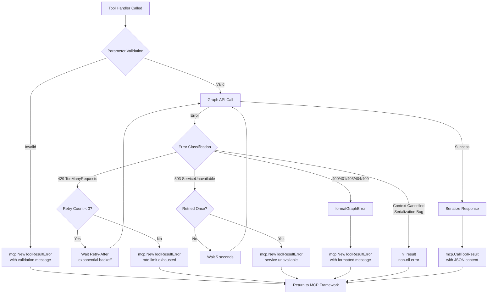
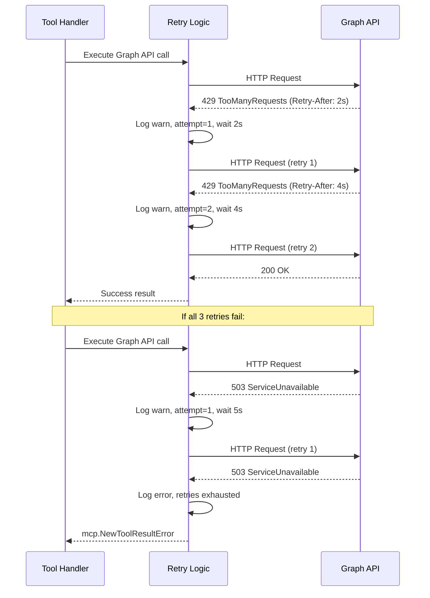
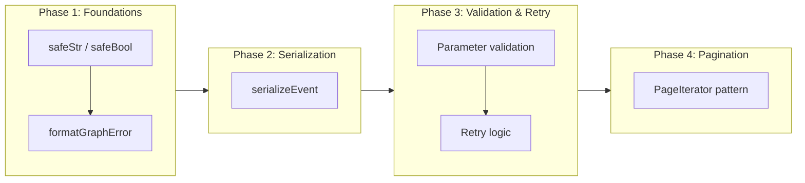

# Error Handling & Shared Utilities

## Change Summary

This change request defines the error handling architecture and shared utility functions for the Outlook Local MCP Server. The server currently lacks a standardized approach to Graph API error extraction, null-safe pointer dereferencing, pagination traversal, event serialization, parameter validation, and transient error retry logic. This CR establishes those foundational utilities so that all tool handlers (CR-0006 through CR-0009) can consume them consistently.

## Motivation and Background

The Microsoft Graph API returns errors as OData-wrapped HTTP responses with nested error codes and messages. Without a centralized extraction function, each tool handler would duplicate brittle error parsing logic. Additionally, the MCP protocol defines two distinct error tiers (tool-level vs. protocol-level), and misusing them causes either silent failures or unnecessarily fatal crashes. The Go SDK for Microsoft Graph returns pointer-typed fields from all model getters, creating a pervasive nil-dereference risk across every handler. Shared utilities for null safety, pagination, serialization, parameter validation, and retry logic eliminate redundancy and prevent entire categories of bugs before individual tools are implemented.

## Change Drivers

* Every `models.Eventable` and `models.Calendarable` getter returns a pointer, requiring nil-checks on every field access across all nine tools
* The MCP protocol's two-tier error model demands consistent classification of errors as tool-level (retryable by LLM) vs. protocol-level (fatal)
* Microsoft Graph API rate limiting (HTTP 429) and transient failures (HTTP 503) require retry logic to maintain reliability
* Five tools (`list_events`, `search_events`, `get_event`, `get_free_busy`, `list_calendars`) share common event/calendar serialization patterns
* Pagination via `@odata.nextLink` is required by `list_events` and `search_events` and must be handled transparently

## Current State

No error handling, null safety, pagination, serialization, or retry infrastructure exists. The project foundation (CR-0001) provides the Go module structure and dependency declarations, and the Graph client initialization (CR-0004) provides the authenticated client instance, but no shared utility code has been implemented.

## Proposed Change

Implement a set of shared utility functions in the `main` package (single-binary architecture) that provide:

1. A `formatGraphError` function that unwraps `*odataerrors.ODataError` to extract structured error codes and messages
2. Null safety helpers (`safeStr`, `safeBool`) for pointer dereferencing
3. A `serializeEvent` function that extracts a standard set of fields from `models.Eventable` into a `map[string]any`
4. Parameter validation patterns using `request.RequireString` with range checks
5. Retry logic for HTTP 429 (exponential backoff, up to 3 retries) and HTTP 503 (single retry after 5 seconds)
6. Pagination support using `msgraphcore.NewPageIterator` with callback-based iteration and `max_results` cap

### Error Flow Diagram



### Retry Logic Diagram



## Requirements

### Functional Requirements

1. The system **MUST** implement a `formatGraphError(err error) string` function that unwraps `*odataerrors.ODataError` to extract the inner error code and message, returning a formatted string in the pattern `"Graph API error [CODE]: MESSAGE"`
2. The system **MUST** fall back to `odataErr.Error()` when the inner error is present but `GetErrorEscaped()` returns nil
3. The system **MUST** fall back to `err.Error()` when the error is not an `*odataerrors.ODataError`
4. The system **MUST** implement `safeStr(s *string) string` that returns `""` when `s` is nil and `*s` otherwise
5. The system **MUST** implement `safeBool(b *bool) bool` that returns `false` when `b` is nil and `*b` otherwise
6. The system **MUST** return tool-level errors via `mcp.NewToolResultError(message)` with `nil` error for all expected failures including invalid parameters, Graph API 400/401/403/404/409 responses, and exhausted retries
7. The system **MUST** return protocol-level errors (nil result, non-nil error) only for truly exceptional situations such as serialization bugs or context cancellation
8. The system **MUST** implement a `serializeEvent(event models.Eventable) map[string]any` function that extracts the following fields: `id`, `subject`, `start`, `end`, `location`, `organizer`, `isAllDay`, `showAs`, `importance`, `sensitivity`, `isCancelled`, `categories`, `webLink`, `isOnlineMeeting`, `onlineMeetingUrl`
9. The system **MUST** use `safeStr` and `safeBool` within `serializeEvent` for every pointer field access
10. The system **MUST** validate required string parameters using `request.RequireString(name)` and return a tool-level error if the parameter is missing or not a string
11. The system **MUST** validate numeric parameters against their allowed ranges (e.g., `max_results` must be 1-100) and return a tool-level error with a descriptive message if out of range
12. The system **MUST** implement retry logic for HTTP 429 responses using exponential backoff with the `Retry-After` header value, up to 3 retry attempts
13. The system **MUST** implement retry logic for HTTP 503 responses with a single retry after a 5-second wait
14. The system **MUST** log retry attempts at `warn` level with structured fields: `attempt`, `max_attempts`, `retry_after_seconds`, and `path`
15. The system **MUST** log exhausted retries at `error` level with structured fields: `attempts`, `last_status`, and `path`
16. The system **MUST** support pagination via `msgraphcore.NewPageIterator[models.Eventable]` using `models.CreateEventCollectionResponseFromDiscriminatorValue` as the discriminator and `graphClient.GetAdapter()` for the request adapter
17. The system **MUST** enforce `max_results` as a hard cap by returning `false` from the page iterator callback when the count reaches the limit
18. The system **MUST** map the following Graph API error codes to user-friendly tool error messages:
    - 400 `BadRequest`: descriptive message about the parameter issue
    - 400 `ErrorOccurrenceCrossingBoundary`: explanation of the recurrence constraint
    - 400 `ErrorPropertyValidationFailure`: specific validation failure details
    - 401 `Unauthorized`: "Authentication expired. Please restart the server to re-authenticate."
    - 403 `Forbidden`: "Insufficient permissions. The Calendars.ReadWrite scope is required."
    - 403 `ErrorAccessDenied`: "Only the meeting organizer can cancel this event."
    - 404 `NotFound`/`ErrorItemNotFound`: "Event not found: {id}"
    - 409 `Conflict`: retry once, then return tool error
    - 429 `TooManyRequests`: exponential backoff retry, then tool error
    - 503 `ServiceUnavailable`: single retry after 5 seconds, then tool error

### Non-Functional Requirements

1. The system **MUST** have zero pointer dereference panics — every `models.Eventable` and `models.Calendarable` getter result **MUST** be nil-checked before use
2. The system **MUST** log all Graph API errors at `error` level using `slog.Error` with the formatted error message before returning tool-level errors
3. The system **MUST** not introduce any additional external dependencies beyond those declared in CR-0001
4. The system **MUST** keep retry wait times bounded: maximum 60 seconds for any single retry wait, maximum 3 minutes total retry duration per tool invocation

## Affected Components

* `main.go` — shared utility functions (`formatGraphError`, `safeStr`, `safeBool`, `serializeEvent`)
* `main_test.go` — unit tests for all shared utilities
* All tool handlers (future CR-0006 through CR-0009) consume these utilities

## Scope Boundaries

### In Scope

* `formatGraphError` function with OData error unwrapping
* `safeStr` and `safeBool` null safety helpers
* `serializeEvent` event serialization helper
* Two-tier MCP error model classification (tool-level vs. protocol-level)
* Parameter validation patterns (`RequireString`, range validation)
* Pagination support via `msgraphcore.NewPageIterator`
* Retry logic for HTTP 429 and 503 transient errors
* Structured logging for error and retry events
* Unit tests for all utility functions

### Out of Scope ("Here, But Not Further")

* Actual tool handler implementations — addressed in CR-0006 (read-only calendar tools), CR-0007 (event creation), CR-0008 (event modification), CR-0009 (event deletion)
* Authentication and token management — addressed in CR-0003
* MCP server initialization and tool registration — addressed in CR-0004
* Graph client construction — addressed in CR-0004
* Custom HTTP middleware or transport-level interceptors — retry logic is implemented at the application level within tool handlers

## Implementation Approach

### Phase 1: Null Safety and Error Formatting

Implement the foundational utility functions that have no external dependencies beyond the Graph SDK types:

1. `safeStr(s *string) string` — returns empty string for nil pointers
2. `safeBool(b *bool) bool` — returns false for nil pointers
3. `formatGraphError(err error) string` — unwraps OData errors to extract code and message

### Phase 2: Event Serialization

Implement the `serializeEvent` function that converts a `models.Eventable` into a `map[string]any` using the null safety helpers:

```go
func serializeEvent(event models.Eventable) map[string]any {
    result := map[string]any{
        "id":               safeStr(event.GetId()),
        "subject":          safeStr(event.GetSubject()),
        "isAllDay":         safeBool(event.GetIsAllDay()),
        "isCancelled":      safeBool(event.GetIsCancelled()),
        "isOnlineMeeting":  safeBool(event.GetIsOnlineMeeting()),
        "webLink":          safeStr(event.GetWebLink()),
    }
    // ... additional field extraction with nil-checks for nested objects
    return result
}
```

### Phase 3: Parameter Validation and Retry Logic

Implement parameter validation patterns and the retry wrapper:

1. Required string parameter validation via `request.RequireString(name)`
2. Range validation for numeric parameters with descriptive error messages
3. Retry logic: exponential backoff for 429, single retry for 503, structured warn/error logging

### Phase 4: Pagination Support

Implement the page iterator pattern for use by `list_events` and `search_events`:

1. Create `msgraphcore.NewPageIterator[models.Eventable]` with the appropriate discriminator
2. Callback-based iteration with `max_results` hard cap
3. Automatic `@odata.nextLink` following via the SDK page iterator

### Implementation Flow



## Test Strategy

### Tests to Add

| Test File | Test Name | Description | Inputs | Expected Output |
|-----------|-----------|-------------|--------|-----------------|
| `main_test.go` | `TestSafeStr_Nil` | Validates safeStr returns empty string for nil | `nil` | `""` |
| `main_test.go` | `TestSafeStr_NonNil` | Validates safeStr returns dereferenced value | `ptr("hello")` | `"hello"` |
| `main_test.go` | `TestSafeStr_EmptyString` | Validates safeStr returns empty string for empty pointer | `ptr("")` | `""` |
| `main_test.go` | `TestSafeBool_Nil` | Validates safeBool returns false for nil | `nil` | `false` |
| `main_test.go` | `TestSafeBool_True` | Validates safeBool returns true for true pointer | `ptr(true)` | `true` |
| `main_test.go` | `TestSafeBool_False` | Validates safeBool returns false for false pointer | `ptr(false)` | `false` |
| `main_test.go` | `TestFormatGraphError_ODataError` | Validates OData error unwrapping with code and message | ODataError with code="NotFound", message="Item not found" | `"Graph API error [NotFound]: Item not found"` |
| `main_test.go` | `TestFormatGraphError_ODataError_NilInner` | Validates fallback when inner error is nil | ODataError with nil inner | ODataError.Error() string |
| `main_test.go` | `TestFormatGraphError_GenericError` | Validates fallback for non-OData errors | `errors.New("timeout")` | `"timeout"` |
| `main_test.go` | `TestSerializeEvent_AllFields` | Validates all fields are extracted from a fully populated event | Mock Eventable with all fields set | Map with all 15 fields populated |
| `main_test.go` | `TestSerializeEvent_NilFields` | Validates nil-safe serialization when all optional fields are nil | Mock Eventable with nil fields | Map with empty/default values, no panic |
| `main_test.go` | `TestSerializeEvent_PartialFields` | Validates mixed nil and non-nil fields | Mock Eventable with some fields set | Map with correct values and defaults |
| `main_test.go` | `TestParameterValidation_MissingRequired` | Validates error on missing required string param | Request without required param | Tool-level error with descriptive message |
| `main_test.go` | `TestParameterValidation_MaxResultsRange` | Validates range check for max_results | `max_results=0`, `max_results=101`, `max_results=50` | Error for 0 and 101, success for 50 |

### Tests to Modify

Not applicable — this is the first implementation of shared utilities; no existing tests require modification.

### Tests to Remove

Not applicable — no prior tests exist for these utilities.

## Acceptance Criteria

### AC-1: OData error unwrapping extracts code and message

```gherkin
Given a Graph API call returns an *odataerrors.ODataError with code "ErrorItemNotFound" and message "The specified object was not found in the store."
When formatGraphError is called with that error
Then the returned string MUST be "Graph API error [ErrorItemNotFound]: The specified object was not found in the store."
```

### AC-2: OData error fallback for nil inner error

```gherkin
Given a Graph API call returns an *odataerrors.ODataError where GetErrorEscaped() returns nil
When formatGraphError is called with that error
Then the returned string MUST be the result of odataErr.Error()
```

### AC-3: Generic error fallback

```gherkin
Given an error that is not an *odataerrors.ODataError
When formatGraphError is called with that error
Then the returned string MUST be the result of err.Error()
```

### AC-4: Null safety for string pointers

```gherkin
Given a nil *string pointer
When safeStr is called with that pointer
Then the returned string MUST be ""
```

### AC-5: Null safety for bool pointers

```gherkin
Given a nil *bool pointer
When safeBool is called with that pointer
Then the returned bool MUST be false
```

### AC-6: Tool-level error for invalid parameters

```gherkin
Given a tool handler receives a request missing the required "event_id" parameter
When the handler calls request.RequireString("event_id")
Then the handler MUST return mcp.NewToolResultError with a message indicating the missing parameter
  And the error return value MUST be nil
```

### AC-7: Tool-level error for out-of-range numeric parameter

```gherkin
Given a tool handler receives max_results with value 150
When the handler validates the range (1-100)
Then the handler MUST return mcp.NewToolResultError with message "max_results must be between 1 and 100"
  And the error return value MUST be nil
```

### AC-8: Retry on HTTP 429 with exponential backoff

```gherkin
Given a Graph API call returns HTTP 429 with Retry-After header of 2 seconds
When the retry logic processes the response
Then the system MUST wait at least 2 seconds before retrying
  And the system MUST log at warn level with attempt, max_attempts, retry_after_seconds, and path fields
  And the system MUST retry up to 3 times before returning a tool-level error
```

### AC-9: Retry on HTTP 503 with single retry

```gherkin
Given a Graph API call returns HTTP 503 ServiceUnavailable
When the retry logic processes the response
Then the system MUST wait 5 seconds and retry once
  And if the retry also fails the system MUST return mcp.NewToolResultError
  And the system MUST log at warn level on the first retry and error level if retries are exhausted
```

### AC-10: Event serialization extracts all required fields

```gherkin
Given a models.Eventable object with all fields populated
When serializeEvent is called with that event
Then the returned map MUST contain all 15 keys: id, subject, start, end, location, organizer, isAllDay, showAs, importance, sensitivity, isCancelled, categories, webLink, isOnlineMeeting, onlineMeetingUrl
  And each value MUST match the corresponding field from the event object
```

### AC-11: Event serialization handles nil fields without panic

```gherkin
Given a models.Eventable object where all getter methods return nil
When serializeEvent is called with that event
Then the function MUST NOT panic
  And the returned map MUST contain all 15 keys with safe default values (empty strings, false, nil for complex objects)
```

### AC-12: Pagination respects max_results cap

```gherkin
Given a Graph API CalendarView response containing 200 events across multiple pages
  And max_results is set to 50
When the page iterator processes the results
Then the callback MUST return false after collecting 50 events
  And the returned events slice MUST contain exactly 50 events
```

### AC-13: Protocol-level error for exceptional situations only

```gherkin
Given a tool handler encounters a context cancellation error
When the handler processes the error
Then the handler MUST return nil result with a non-nil error
  And the MCP framework MUST translate this to a JSON-RPC error response
```

## Quality Standards Compliance

### Build & Compilation

- [ ] Code compiles/builds without errors
- [ ] No new compiler warnings introduced

### Linting & Code Style

- [ ] All linter checks pass with zero warnings/errors
- [ ] Code follows project coding conventions and style guides
- [ ] Any linter exceptions are documented with justification

### Test Execution

- [ ] All existing tests pass after implementation
- [ ] All new tests pass
- [ ] Test coverage meets project requirements for changed code

### Documentation

- [ ] Inline code documentation updated where applicable
- [ ] API documentation updated for any API changes
- [ ] User-facing documentation updated if behavior changes

### Code Review

- [ ] Changes submitted via pull request
- [ ] PR title follows Conventional Commits format
- [ ] Code review completed and approved
- [ ] Changes squash-merged to maintain linear history

### Verification Commands

```bash
# Build verification
go build ./...

# Lint verification
golangci-lint run

# Test execution
go test ./... -v

# Test coverage
go test ./... -coverprofile=coverage.out
go tool cover -func=coverage.out
```

## Risks and Mitigation

### Risk 1: OData error type assertion fails on future SDK versions

**Likelihood:** low
**Impact:** high
**Mitigation:** Pin the `msgraph-sdk-go` dependency to a specific version in `go.mod`. Add a unit test that constructs a real `*odataerrors.ODataError` to verify the type assertion works. If the SDK changes the error type, the test will fail immediately.

### Risk 2: Retry-After header missing or malformed on 429 responses

**Likelihood:** medium
**Impact:** low
**Mitigation:** If the `Retry-After` header is absent or cannot be parsed, fall back to a default exponential backoff schedule (1s, 2s, 4s). Log a warning when the header is missing so the issue is observable.

### Risk 3: Page iterator behavior changes across SDK versions

**Likelihood:** low
**Impact:** medium
**Mitigation:** Pin the `msgraph-sdk-go-core` dependency version. Write integration-style tests that verify the page iterator correctly stops at the `max_results` boundary using a mock response with `@odata.nextLink`.

### Risk 4: Retry logic masks persistent errors

**Likelihood:** low
**Impact:** medium
**Mitigation:** Limit retry scope strictly to HTTP 429 and 503. All other error codes (400, 401, 403, 404) are never retried. Log every retry attempt with full context so persistent issues are visible in logs.

## Dependencies

* CR-0001 (Project Foundation) — provides Go module structure, `go.mod` with all dependency declarations including `msgraph-sdk-go`, `msgraph-sdk-go-core`, `mcp-go`, and `odataerrors`
* CR-0004 (MCP Server & Graph Client) — provides the initialized `graphClient` variable and `graphClient.GetAdapter()` method required by the page iterator

## Estimated Effort

| Phase | Description | Effort |
|-------|-------------|--------|
| Phase 1 | Null safety helpers + formatGraphError | 2 hours |
| Phase 2 | serializeEvent implementation | 2 hours |
| Phase 3 | Parameter validation + retry logic | 3 hours |
| Phase 4 | Pagination support | 2 hours |
| Testing | Unit tests for all utilities | 3 hours |
| **Total** | | **12 hours** |

## Decision Outcome

Chosen approach: "Application-level shared utilities in the main package", because the single-binary architecture (established in CR-0001) keeps all code in one package, and these utilities are tightly coupled to the Graph SDK types and MCP error model. Extracting them into a separate package would add import complexity without meaningful encapsulation benefit. The retry logic is implemented at the application level rather than as HTTP middleware because the `mcp-go` and `msgraph-sdk-go` libraries manage their own HTTP transports, and intercepting at the handler level gives full control over error classification and structured logging.

## Related Items

* CR-0001 — Project Foundation (dependency)
* CR-0003 — Authentication & Token Management
* CR-0004 — MCP Server & Graph Client (dependency)
* CR-0006 through CR-0009 — Tool handler implementations (consumers of these utilities)
* Spec reference: `docs/reference/outlook-local-mcp-spec.md`, sections "Error handling strategy" (lines 1480-1540), "Pagination handling" (lines 1543-1573)
