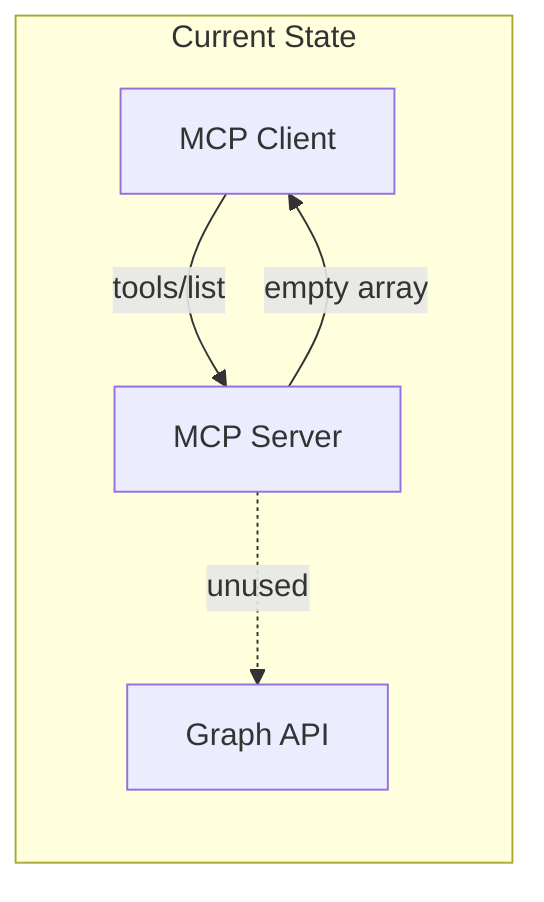
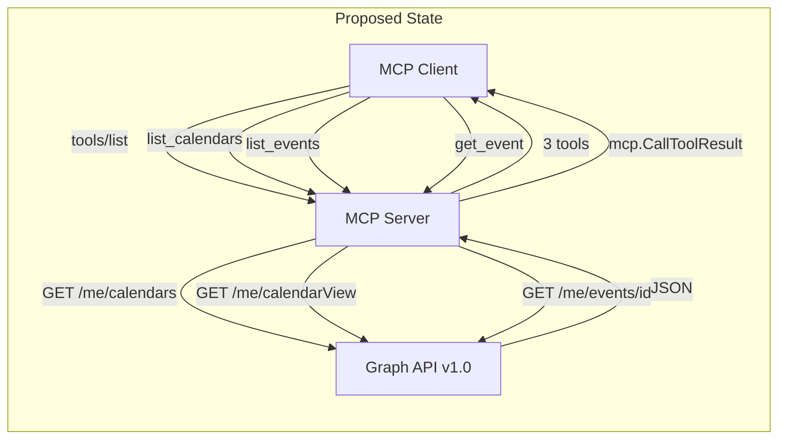
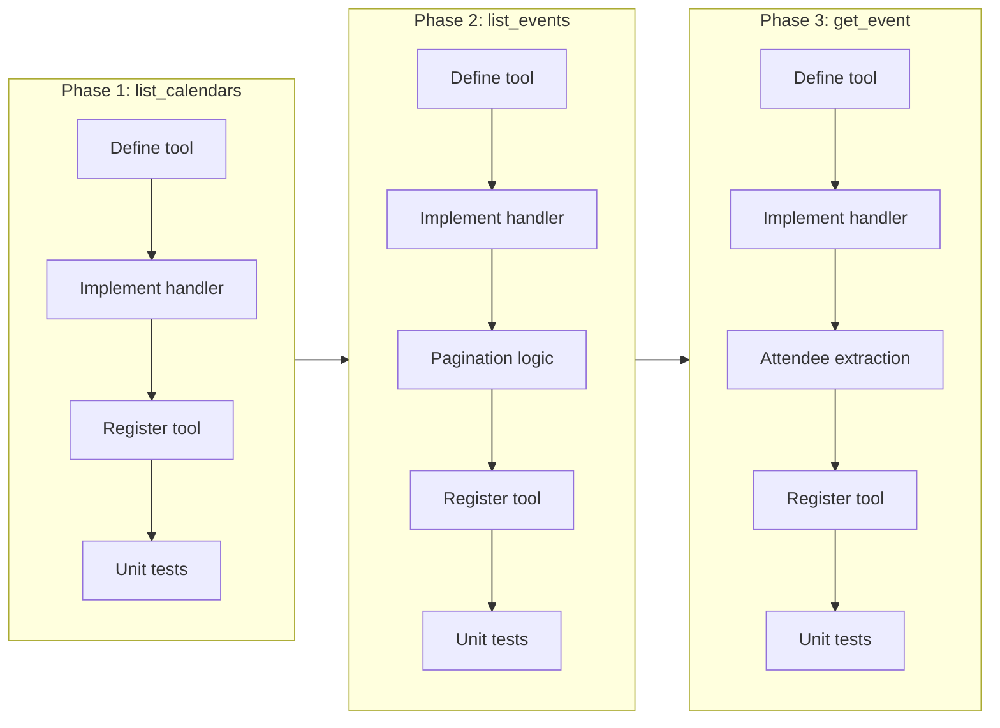
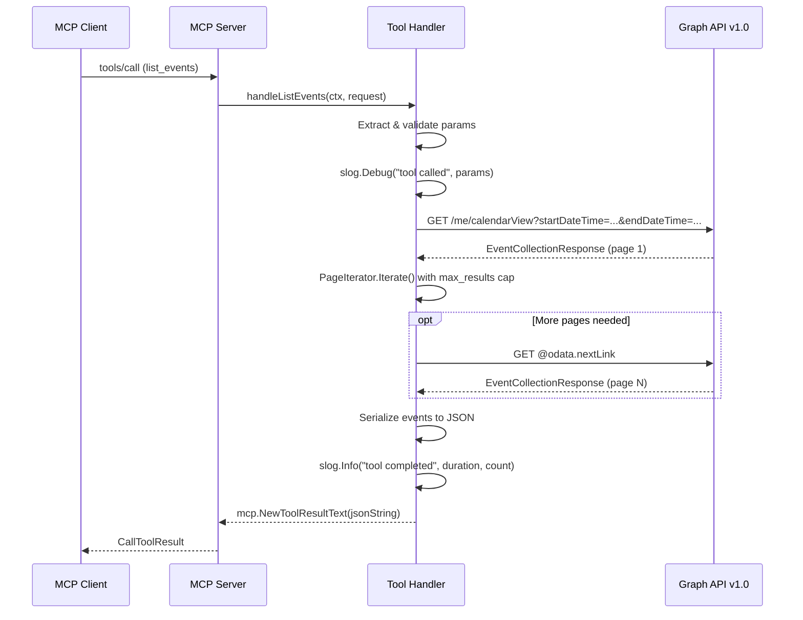

# Read-Only Calendar Tools (list_calendars, list_events, get_event)

## Change Summary

The Outlook Local MCP Server currently has foundational infrastructure (project scaffolding, logging, Graph client initialization, MCP server setup, and error handling utilities) but exposes no tool functionality to MCP clients. This CR introduces the first three read-only tools -- `list_calendars`, `list_events`, and `get_event` -- enabling MCP clients to discover available calendars, retrieve events within a time range with recurring event expansion, and fetch full event details by ID. These tools form the core read-only surface area upon which all subsequent calendar interactions depend.

## Motivation and Background

The MCP server's value proposition is exposing Outlook calendar data to LLM-powered agents via the Model Context Protocol. Without tool implementations, the server is a functional but inert shell. The three read-only tools in this CR represent the minimum viable feature set for calendar consumption: discovering calendars, browsing events in a time window, and drilling into event details. These tools are prerequisites for search capabilities (CR-0007) and write operations (CR-0008, CR-0009), and they establish the patterns (JSON serialization, Graph API interaction, error propagation, pagination) that all subsequent tools will follow.

## Change Drivers

* LLM agents require calendar read access to answer scheduling questions and provide context-aware assistance
* The read-only tools establish implementation patterns reused by all subsequent tools
* CalendarView endpoint with recurring event expansion is essential for accurate schedule representation
* MCP client integrations (e.g., Claude Desktop) cannot function without at least one registered tool

## Current State

The server infrastructure is in place from prior CRs:

* **CR-0001**: Go module, project structure, dependencies
* **CR-0002**: Structured logging with `log/slog` to stderr
* **CR-0004**: Graph client initialization, MCP server creation with `server.NewMCPServer()`, stdio transport via `server.ServeStdio()`, tool registration scaffolding
* **CR-0005**: Error handling utilities (`formatGraphError()`, `safeStr()`, `safeBool()`), pagination infrastructure (`msgraphcore.NewPageIterator`), JSON serialization helpers

No MCP tools are currently registered. The server starts, authenticates, initializes the Graph client, and begins listening on stdio, but responds to `tools/list` with an empty array.

### Current State Diagram



## Proposed Change

Implement three read-only MCP tools that query the Microsoft Graph API v1.0 and return structured JSON responses. Each tool is registered via `s.AddTool(tool, handler)` with a `mcp.WithReadOnlyHintAnnotation(true)` annotation. All tools share common patterns: structured logging at entry/completion/error, `formatGraphError()` for Graph API error extraction, `safeStr()`/`safeBool()` for nil-safe pointer dereferencing, and `mcp.NewToolResultText()` for JSON response delivery.

### Tool 1: list_calendars

Retrieves all calendars accessible to the authenticated user. No parameters. Calls `GET /me/calendars` via `graphClient.Me().Calendars().Get(ctx, nil)`. Returns a JSON array of calendar objects with fields: `id`, `name`, `color`, `hexColor`, `isDefaultCalendar`, `canEdit`, and `owner` (containing `name` and `address`). Fields are extracted from `models.Calendarable` using nil-safe getter patterns.

### Tool 2: list_events

Lists calendar events within a specified time range using the CalendarView endpoint, which expands recurring events into individual occurrences. Accepts `start_datetime` (required), `end_datetime` (required), `calendar_id` (optional), `max_results` (optional, default 25, max 100), and `timezone` (optional). Uses `$select` for minimal data transfer and `$orderby=start/dateTime` for chronological ordering. Supports timezone preference via the `Prefer: outlook.timezone="..."` header. Implements pagination via `msgraphcore.NewPageIterator` with a `max_results` cap enforced in the iteration callback.

### Tool 3: get_event

Retrieves full details of a single event by ID. Accepts `event_id` (required) and `timezone` (optional). Calls `GET /me/events/{id}` with a comprehensive `$select` covering all event fields including `body`, `attendees`, `recurrence`, `responseStatus`, `seriesMasterId`, `type`, `hasAttachments`, `createdDateTime`, and `lastModifiedDateTime`. Implements the attendee extraction pattern with nil-safe access through `GetEmailAddress()`, `GetTypeEscaped()`, and `GetStatus().GetResponse()`.

### Proposed State Diagram



## Requirements

### Functional Requirements

1. The system **MUST** register a `list_calendars` tool with `mcp.WithReadOnlyHintAnnotation(true)` and no parameters
2. The system **MUST** call `graphClient.Me().Calendars().Get(ctx, nil)` when `list_calendars` is invoked
3. The system **MUST** return a JSON array from `list_calendars` containing objects with keys: `id`, `name`, `color`, `hexColor`, `isDefaultCalendar`, `canEdit`, and `owner` (with `name` and `address`)
4. The system **MUST** extract `list_calendars` fields from `models.Calendarable` using `GetId()`, `GetName()`, `GetColor()`, `GetHexColor()`, `GetIsDefaultCalendar()`, `GetCanEdit()`, and `GetOwner()` with nil-safe access
5. The system **MUST** register a `list_events` tool with `mcp.WithReadOnlyHintAnnotation(true)` accepting `start_datetime` (required string), `end_datetime` (required string), `calendar_id` (optional string), `max_results` (optional number, min 1, max 100), and `timezone` (optional string)
6. The system **MUST** use the CalendarView endpoint (`GET /me/calendarView?startDateTime=...&endDateTime=...`) for `list_events` to expand recurring events into individual occurrences
7. The system **MUST** route `list_events` requests with a `calendar_id` parameter to `GET /me/calendars/{id}/calendarView?startDateTime=...&endDateTime=...`
8. The system **MUST** apply `$select` on `list_events` requests with fields: `id`, `subject`, `start`, `end`, `location`, `organizer`, `isAllDay`, `showAs`, `importance`, `sensitivity`, `isCancelled`, `categories`, `webLink`, `isOnlineMeeting`, `onlineMeeting`
9. The system **MUST** apply `$orderby=start/dateTime` on `list_events` requests to return events in chronological order
10. The system **MUST** set the `Prefer` header to `outlook.timezone="{timezone}"` on `list_events` requests when a `timezone` parameter is provided
11. The system **MUST** default `max_results` to 25 when not specified and enforce a maximum of 100
12. The system **MUST** use `msgraphcore.NewPageIterator` for `list_events` pagination with a callback that stops iteration after `max_results` events
13. The system **MUST** register a `get_event` tool with `mcp.WithReadOnlyHintAnnotation(true)` accepting `event_id` (required string) and `timezone` (optional string)
14. The system **MUST** call `graphClient.Me().Events().ByEventId(eventID).Get(ctx, config)` when `get_event` is invoked
15. The system **MUST** apply `$select` on `get_event` requests with the full field set: `id`, `subject`, `body`, `bodyPreview`, `start`, `end`, `location`, `locations`, `organizer`, `attendees`, `isAllDay`, `showAs`, `importance`, `sensitivity`, `isCancelled`, `recurrence`, `categories`, `webLink`, `isOnlineMeeting`, `onlineMeeting`, `responseStatus`, `seriesMasterId`, `type`, `hasAttachments`, `createdDateTime`, `lastModifiedDateTime`
16. The system **MUST** extract attendees from `get_event` results using the nil-safe pattern: `GetAttendees()` iteration with `GetEmailAddress()`, `GetTypeEscaped()`, and `GetStatus().GetResponse()` checks
17. The system **MUST** return all tool results via `mcp.NewToolResultText(jsonString)` with JSON-serialized content
18. The system **MUST** return Graph API errors via `mcp.NewToolResultError(formatGraphError(err))` with `nil` as the second return value
19. The system **MUST** validate required parameters (`start_datetime`, `end_datetime` for `list_events`; `event_id` for `get_event`) and return a tool error if missing

### Non-Functional Requirements

1. The system **MUST** log tool call entry at `debug` level with full parameters
2. The system **MUST** log tool call completion at `info` level with duration and result count/size
3. The system **MUST** log tool call errors at `error` level with the formatted error and duration
4. The system **MUST** use `slog.With("tool", toolName)` for per-handler log context
5. The system **MUST** use `safeStr()` and `safeBool()` helpers for all pointer dereferences from Graph SDK model getters
6. The system **MUST** serialize all JSON responses using `encoding/json` with proper error handling

## Affected Components

* `main.go` or tool registration module -- tool registration via `s.AddTool()`
* New or existing handler functions: `handleListCalendars`, `handleListEvents`, `handleGetEvent`
* Serialization helpers for converting `models.Calendarable` and `models.Eventable` to `map[string]any`

## Scope Boundaries

### In Scope

* `list_calendars` tool: registration, handler, Graph API call, response serialization
* `list_events` tool: registration, handler, parameter validation, CalendarView endpoint, `$select`/`$orderby`, timezone header, pagination with max_results cap, response serialization
* `get_event` tool: registration, handler, parameter validation, event retrieval by ID, full `$select`, attendee extraction, response serialization
* Structured logging for all three tool handlers (entry, completion, error)
* JSON serialization of Graph SDK model objects to response maps

### Out of Scope ("Here, But Not Further")

* `search_events` tool -- deferred to CR-0007
* `get_free_busy` tool -- deferred to CR-0007
* Write tools (`create_event`, `update_event`, `delete_event`, `cancel_event`) -- deferred to CR-0008 and CR-0009
* Error handling utilities (`formatGraphError`, `safeStr`, `safeBool`) -- provided by CR-0005
* Pagination infrastructure (`msgraphcore.NewPageIterator`) -- provided by CR-0005
* Graph client initialization and MCP server creation -- provided by CR-0004
* Authentication and token management -- provided by CR-0003

## Alternative Approaches Considered

* **REST-based direct HTTP calls instead of Graph SDK**: Rejected because the typed SDK provides compile-time safety, automatic pagination support via `PageIterator`, and built-in OData error deserialization. Manual HTTP calls would require reimplementing all of this.
* **Returning raw Graph API JSON responses without field mapping**: Rejected because the raw responses contain excessive internal metadata (`@odata.context`, `@odata.etag`, internal IDs) that would confuse LLM consumers. Explicit field mapping produces cleaner, more predictable output.
* **Single `get_events` tool combining list and get functionality**: Rejected because list (CalendarView with recurring expansion) and get (single event by ID) serve fundamentally different use cases and require different Graph API endpoints with different `$select` field sets.

## Impact Assessment

### User Impact

MCP clients gain the ability to read calendar data for the first time. LLM agents can answer questions about upcoming events, check schedules, and retrieve meeting details including attendees and online meeting links. No user-facing configuration changes are required.

### Technical Impact

* Three new tool handler functions are added to the codebase
* Dependencies on CR-0005 utilities (`formatGraphError`, `safeStr`, `safeBool`, `PageIterator` pattern) are exercised for the first time
* The `list_events` handler establishes the CalendarView + pagination pattern reused by `search_events` (CR-0007)
* The `get_event` handler establishes the attendee extraction pattern reused by write tool response serialization (CR-0008)
* No breaking changes to existing infrastructure

### Business Impact

Enables the core value proposition of the MCP server: LLM-assisted calendar interaction. The read-only tools are the minimum viable feature set required for demonstration and early adoption.

## Implementation Approach

Implementation proceeds in three phases within a single PR, as the tools share common patterns and can be developed and tested together.

### Phase 1: list_calendars

Implement the simplest tool first to establish the registration-handler-serialization pattern. This involves:
1. Define the tool with `mcp.NewTool("list_calendars", ...)` and `mcp.WithReadOnlyHintAnnotation(true)`
2. Implement `handleListCalendars` with Graph API call, calendar iteration, field extraction using nil-safe helpers, JSON serialization, and structured logging
3. Register via `s.AddTool(tool, handleListCalendars)`

### Phase 2: list_events

Build on the pattern from Phase 1, adding parameter handling, CalendarView endpoint routing, timezone support, and pagination:
1. Define the tool with five parameters (two required, three optional) and `mcp.WithReadOnlyHintAnnotation(true)`
2. Implement `handleListEvents` with parameter extraction and validation, query parameter construction (`$select`, `$orderby`, `$top`), `Prefer` header for timezone, CalendarView endpoint selection (default vs. specific calendar), `PageIterator`-based pagination with `max_results` cap, event serialization, and structured logging
3. Register via `s.AddTool(tool, handleListEvents)`

### Phase 3: get_event

Implement single-event retrieval with the full field set and attendee extraction:
1. Define the tool with two parameters (one required, one optional) and `mcp.WithReadOnlyHintAnnotation(true)`
2. Implement `handleGetEvent` with parameter extraction, query parameter construction (full `$select`), timezone header, Graph API call, comprehensive field extraction including body/attendees/recurrence, and structured logging
3. Register via `s.AddTool(tool, handleGetEvent)`

### Implementation Flow



### Tool Call Flow (Sequence)



## Test Strategy

### Tests to Add

| Test File | Test Name | Description | Inputs | Expected Output |
|-----------|-----------|-------------|--------|-----------------|
| `handlers_test.go` | `TestHandleListCalendars_Success` | Validates successful calendar listing with mock Graph client | Mock returning 2 calendars | JSON array with 2 calendar objects containing all expected fields |
| `handlers_test.go` | `TestHandleListCalendars_EmptyResult` | Validates empty calendar list | Mock returning 0 calendars | Empty JSON array `[]` |
| `handlers_test.go` | `TestHandleListCalendars_GraphError` | Validates error propagation from Graph API | Mock returning ODataError | Tool error result with formatted error message |
| `handlers_test.go` | `TestHandleListEvents_Success` | Validates event listing with required params | start/end datetime, mock returning 3 events | JSON array with 3 event summaries |
| `handlers_test.go` | `TestHandleListEvents_WithCalendarId` | Validates routing to specific calendar endpoint | start/end datetime + calendar_id | Graph call routed to `/me/calendars/{id}/calendarView` |
| `handlers_test.go` | `TestHandleListEvents_WithTimezone` | Validates Prefer header is set | start/end datetime + timezone="America/New_York" | Prefer header contains `outlook.timezone="America/New_York"` |
| `handlers_test.go` | `TestHandleListEvents_MaxResultsDefault` | Validates default max_results of 25 | start/end datetime only | Pagination callback stops at 25 |
| `handlers_test.go` | `TestHandleListEvents_MaxResultsCap` | Validates max_results enforcement | max_results=50, mock returning 100 events | JSON array with exactly 50 events |
| `handlers_test.go` | `TestHandleListEvents_MissingStartDatetime` | Validates required param check | end_datetime only | Tool error: "start_datetime is required" |
| `handlers_test.go` | `TestHandleListEvents_MissingEndDatetime` | Validates required param check | start_datetime only | Tool error: "end_datetime is required" |
| `handlers_test.go` | `TestHandleListEvents_GraphError` | Validates error propagation | Mock returning ODataError | Tool error result with formatted message |
| `handlers_test.go` | `TestHandleGetEvent_Success` | Validates full event retrieval | event_id, mock returning event with attendees | JSON object with all fields including attendees array |
| `handlers_test.go` | `TestHandleGetEvent_WithTimezone` | Validates timezone header on get_event | event_id + timezone | Prefer header set correctly |
| `handlers_test.go` | `TestHandleGetEvent_MissingEventId` | Validates required param check | No event_id | Tool error: "event_id is required" |
| `handlers_test.go` | `TestHandleGetEvent_NotFound` | Validates 404 handling | event_id for nonexistent event | Tool error: "Event not found: {id}" |
| `handlers_test.go` | `TestHandleGetEvent_NilAttendeeFields` | Validates nil-safe attendee extraction | Event with partially nil attendee data | Attendee serialized with empty strings for nil fields |
| `handlers_test.go` | `TestHandleGetEvent_NilBodyFields` | Validates nil-safe body extraction | Event with nil body | Body field omitted or empty in response |
| `handlers_test.go` | `TestSerializeCalendar_AllFields` | Validates calendar serialization with all fields populated | Calendarable with all fields set | Map with correct key-value pairs |
| `handlers_test.go` | `TestSerializeCalendar_NilFields` | Validates nil-safe calendar serialization | Calendarable with nil pointers | Map with empty string/false defaults |
| `handlers_test.go` | `TestSerializeEventSummary_AllFields` | Validates event summary serialization | Eventable with all summary fields | Map with correct key-value pairs |
| `handlers_test.go` | `TestSerializeEventFull_WithAttendees` | Validates full event serialization including attendees | Eventable with 3 attendees | Map with attendees array containing 3 entries |

### Tests to Modify

Not applicable. This is a new feature with no pre-existing tool handler tests.

### Tests to Remove

Not applicable. No existing tests are made redundant by this change.

## Acceptance Criteria

### AC-1: list_calendars returns all user calendars

```gherkin
Given the MCP server is running and authenticated
  And the user has 3 calendars (including the default)
When the MCP client invokes the list_calendars tool with no arguments
Then the server returns a JSON array containing 3 calendar objects
  And each object contains the keys: id, name, color, hexColor, isDefaultCalendar, canEdit, owner
  And exactly one object has isDefaultCalendar set to true
  And each owner object contains name and address keys
```

### AC-2: list_calendars handles empty calendar list

```gherkin
Given the MCP server is running and authenticated
  And the Graph API returns an empty calendar collection
When the MCP client invokes the list_calendars tool
Then the server returns an empty JSON array []
```

### AC-3: list_events returns events within time range

```gherkin
Given the MCP server is running and authenticated
  And the default calendar contains 5 events between 2026-03-12 and 2026-03-13
When the MCP client invokes list_events with start_datetime="2026-03-12T00:00:00Z" and end_datetime="2026-03-13T00:00:00Z"
Then the server returns a JSON array containing 5 event summary objects
  And each object contains the keys: id, subject, start, end, location, organizer, isAllDay, showAs, importance, sensitivity, isCancelled, categories, webLink, isOnlineMeeting
  And events are ordered chronologically by start time
```

### AC-4: list_events expands recurring events

```gherkin
Given the MCP server is running and authenticated
  And the calendar contains a weekly recurring event on Mondays
When the MCP client invokes list_events with a range spanning 4 weeks
Then the server returns 4 individual event occurrences for the recurring event
  And each occurrence has a unique id
```

### AC-5: list_events routes to specific calendar

```gherkin
Given the MCP server is running and authenticated
  And a non-default calendar with ID "cal-123" exists
When the MCP client invokes list_events with calendar_id="cal-123" and valid date range
Then the server queries GET /me/calendars/cal-123/calendarView
  And returns events from that specific calendar only
```

### AC-6: list_events respects max_results

```gherkin
Given the MCP server is running and authenticated
  And the calendar contains 50 events in the specified range
When the MCP client invokes list_events with max_results=10
Then the server returns a JSON array containing exactly 10 events
  And pagination stops after collecting 10 events
```

### AC-7: list_events applies timezone preference

```gherkin
Given the MCP server is running and authenticated
When the MCP client invokes list_events with timezone="America/New_York"
Then the server includes the header Prefer: outlook.timezone="America/New_York" in the Graph API request
  And returned event start/end times reflect the specified timezone
```

### AC-8: list_events validates required parameters

```gherkin
Given the MCP server is running and authenticated
When the MCP client invokes list_events without start_datetime
Then the server returns a tool error indicating start_datetime is required
  And no Graph API call is made
```

### AC-9: get_event returns full event details

```gherkin
Given the MCP server is running and authenticated
  And an event with ID "evt-456" exists with 2 attendees and an HTML body
When the MCP client invokes get_event with event_id="evt-456"
Then the server returns a JSON object containing all fields: id, subject, body, bodyPreview, start, end, location, locations, organizer, attendees, isAllDay, showAs, importance, sensitivity, isCancelled, recurrence, categories, webLink, isOnlineMeeting, onlineMeeting, responseStatus, seriesMasterId, type, hasAttachments, createdDateTime, lastModifiedDateTime
  And the attendees array contains 2 entries each with name, email, type, and response
  And the body object contains contentType and content
```

### AC-10: get_event handles not found

```gherkin
Given the MCP server is running and authenticated
  And no event with ID "nonexistent-id" exists
When the MCP client invokes get_event with event_id="nonexistent-id"
Then the server returns a tool error containing "not found" or the Graph API error code
  And the error is logged at error level
```

### AC-11: All tools use read-only annotation

```gherkin
Given the MCP server is running
When the MCP client requests the tool list via tools/list
Then all three tools (list_calendars, list_events, get_event) include the readOnlyHint annotation set to true
```

### AC-12: Graph API errors are properly formatted

```gherkin
Given the MCP server is running and authenticated
  And the Graph API returns a 403 Forbidden error with OData error code "Forbidden"
When any of the three tools is invoked
Then the server returns a tool error formatted as "Graph API error [Forbidden]: {message}"
  And the error is logged at error level with the tool name and duration
```

## Quality Standards Compliance

### Build & Compilation

- [ ] Code compiles/builds without errors
- [ ] No new compiler warnings introduced

### Linting & Code Style

- [ ] All linter checks pass with zero warnings/errors
- [ ] Code follows project coding conventions and style guides
- [ ] Any linter exceptions are documented with justification

### Test Execution

- [ ] All existing tests pass after implementation
- [ ] All new tests pass
- [ ] Test coverage meets project requirements for changed code

### Documentation

- [ ] Inline code documentation updated where applicable
- [ ] API documentation updated for any API changes
- [ ] User-facing documentation updated if behavior changes

### Code Review

- [ ] Changes submitted via pull request
- [ ] PR title follows Conventional Commits format
- [ ] Code review completed and approved
- [ ] Changes squash-merged to maintain linear history

### Verification Commands

```bash
# Build verification
go build ./...

# Lint verification
golangci-lint run

# Test execution
go test ./... -v

# Test coverage
go test ./... -coverprofile=coverage.out
go tool cover -func=coverage.out
```

## Risks and Mitigation

### Risk 1: Graph SDK model getter nil pointer panics

**Likelihood:** high
**Impact:** high
**Mitigation:** All pointer dereferences from `models.Calendarable` and `models.Eventable` getter methods **MUST** use `safeStr()` and `safeBool()` helpers. The `get_event` attendee extraction pattern **MUST** check each level of the accessor chain (`GetEmailAddress()`, `GetStatus()`, `GetResponse()`) for nil before dereferencing. Unit tests **MUST** cover scenarios with partially nil model objects.

### Risk 2: Pagination causes excessive Graph API calls

**Likelihood:** medium
**Impact:** medium
**Mitigation:** The `max_results` cap (default 25, maximum 100) limits the total number of events collected. The `$top` query parameter is set to `max_results` so the Graph API returns at most that many per page. The `PageIterator` callback returns `false` to stop iteration once the cap is reached, preventing unnecessary page fetches.

### Risk 3: CalendarView endpoint returns unexpected data for edge-case recurring patterns

**Likelihood:** low
**Impact:** medium
**Mitigation:** CalendarView is the Microsoft-recommended endpoint for recurring event expansion and is well-tested. The serialization layer uses nil-safe access for all fields, so unexpected null values will produce empty strings/false rather than panics. Logging at debug level captures raw response counts for diagnosis.

### Risk 4: Timezone header not applied correctly

**Likelihood:** low
**Impact:** medium
**Mitigation:** The `Prefer` header format `outlook.timezone="{tz}"` is specified exactly by the Graph API documentation. Unit tests **MUST** verify that the header is set when the timezone parameter is provided and omitted when it is not. Invalid timezone names are handled gracefully by the Graph API (it falls back to UTC).

## Dependencies

* **CR-0001** (Project Scaffolding): Go module, directory structure, dependency declarations
* **CR-0002** (Structured Logging): `log/slog` initialization, stderr output, `AddSource: true`
* **CR-0004** (Graph Client & MCP Server): `graphClient` package-level variable, `server.NewMCPServer()`, `s.AddTool()` registration, `server.ServeStdio()`
* **CR-0005** (Error Handling & Utilities): `formatGraphError()`, `safeStr()`, `safeBool()`, `msgraphcore.NewPageIterator` pattern, JSON serialization approach

## Estimated Effort

| Phase | Effort |
|-------|--------|
| Phase 1: list_calendars (tool + handler + tests) | 2 hours |
| Phase 2: list_events (tool + handler + pagination + tests) | 4 hours |
| Phase 3: get_event (tool + handler + attendee extraction + tests) | 3 hours |
| Integration testing and code review | 1 hour |
| **Total** | **10 hours** |

## Decision Outcome

Chosen approach: "Three separate tool handlers with shared serialization patterns and PageIterator-based pagination", because this follows the spec's tool-per-endpoint design, maintains clear separation of concerns between calendar listing, event browsing, and event detail retrieval, and leverages the Graph SDK's typed models and built-in pagination support rather than manual HTTP handling.

## Related Items

* Technical Specification: `docs/reference/outlook-local-mcp-spec.md` (Tools 1-3, lines 281-533)
* CR-0001: Project scaffolding
* CR-0002: Structured logging
* CR-0004: Graph client and MCP server setup
* CR-0005: Error handling and utility functions
* CR-0007: Search and free/busy tools (depends on patterns established here)
* CR-0008: Write tools (depends on patterns established here)
