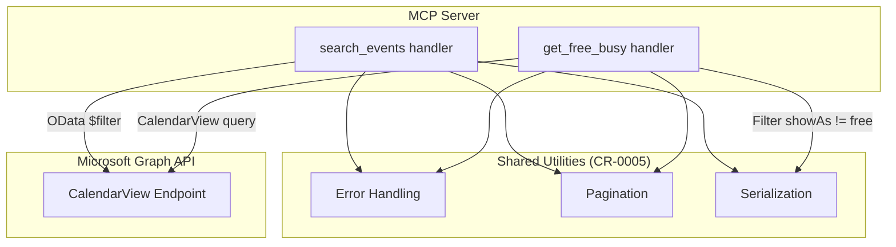
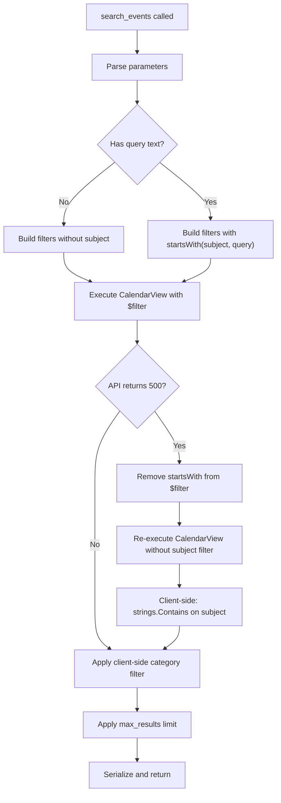
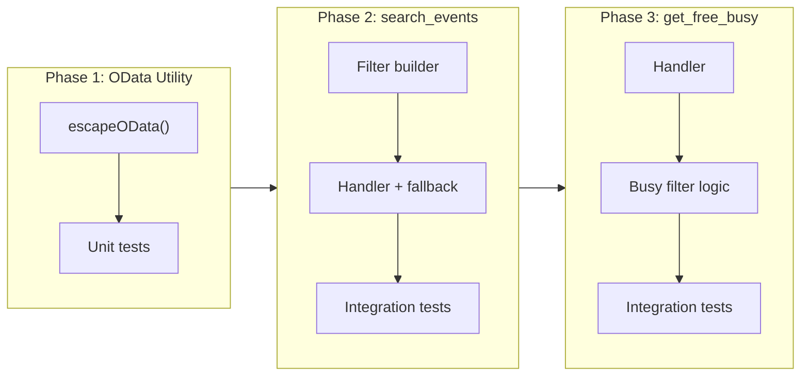

# Search & Free/Busy Tools (search_events, get_free_busy)

## Change Summary

The Outlook Local MCP Server currently has no capability for searching calendar events by subject text, importance, sensitivity, or other properties, nor does it provide a way to query free/busy availability. This CR introduces two read-only MCP tools -- `search_events` and `get_free_busy` -- that enable flexible event searching with composite OData filtering (including a critical server-side fallback for the `startsWith` null-subject bug) and a compact busy-period availability view built on top of CalendarView.

## Motivation and Background

Calendar search and availability checking are core scheduling workflows. An AI assistant needs the ability to find specific events by keyword or property (e.g., "find all high-importance meetings next week") and to determine when a user is free or busy for scheduling purposes. The Microsoft Graph API's CalendarView endpoint provides recurring-event expansion but has significant filtering limitations that require careful handling, including a known 500-error bug when events have null subjects. This CR specifies the exact filtering strategy, fallback behavior, and response contracts needed for robust implementations of both tools.

## Change Drivers

* AI assistants need to search calendars by keyword and properties to answer scheduling questions
* Free/busy lookups are essential for scheduling suggestions and conflict detection
* The Graph API's OData filtering on calendar events has documented limitations that require defensive implementation
* The `startsWith(subject, ...)` null-subject bug necessitates a specified fallback strategy to prevent runtime failures

## Current State

The MCP server (as specified in CR-0004) provides the foundational Graph client and MCP server infrastructure. CR-0005 establishes shared error handling, pagination, and serialization utilities. CR-0006 introduces `list_calendars`, `list_events`, and `get_event` as the first read-only tools. Currently, there is no mechanism to search events by arbitrary criteria or to retrieve a compact free/busy availability summary.

## Proposed Change

Implement two new MCP tools registered on the server:

1. **`search_events`** -- A flexible search tool that accepts optional text query, date range, and property filters. It builds a composite OData `$filter` expression for server-side filtering via CalendarView, with a mandatory client-side fallback path when the Graph API returns errors due to null-subject events.

2. **`get_free_busy`** -- An availability tool that queries CalendarView internally, filters out events where `showAs` equals `"free"`, and returns a compact JSON structure containing the queried time range and an array of busy periods with start, end, status, and subject.

### Proposed Architecture Diagram



### Search Filtering Flow with Fallback



## Requirements

### Functional Requirements

#### search_events

1. The `search_events` tool **MUST** be registered with `mcp.WithReadOnlyHintAnnotation(true)`
2. The `search_events` tool **MUST** accept the following optional parameters: `query` (string), `start_datetime` (string), `end_datetime` (string), `importance` (string), `sensitivity` (string), `is_all_day` (boolean), `show_as` (string), `is_cancelled` (boolean), `categories` (string), `max_results` (number), `timezone` (string)
3. The `start_datetime` parameter **MUST** default to the current time when not provided
4. The `end_datetime` parameter **MUST** default to 30 days from the start when not provided
5. The `max_results` parameter **MUST** accept values between 1 and 100, defaulting to 25
6. The handler **MUST** use the CalendarView endpoint for date-range queries to ensure recurring event expansion
7. The handler **MUST** build a composite OData `$filter` string by combining individual filter expressions with `and`
8. The handler **MUST** generate the following OData filter expressions when the corresponding parameter is provided:
   - `importance eq '{value}'` for the `importance` parameter
   - `sensitivity eq '{value}'` for the `sensitivity` parameter
   - `isAllDay eq {value}` for the `is_all_day` parameter
   - `showAs eq '{value}'` for the `show_as` parameter
   - `isCancelled eq {value}` for the `is_cancelled` parameter
   - `startsWith(subject,'{escaped_query}')` for the `query` parameter
9. The handler **MUST** use an `escapeOData(query)` function to safely escape single quotes and special characters in query text before embedding in OData filter expressions
10. The handler **MUST** catch HTTP 500 errors from the Graph API when `startsWith(subject, ...)` is in the filter, and fall back to client-side subject filtering by removing the `startsWith` clause and re-executing the query
11. The client-side subject fallback **MUST** use case-insensitive substring matching equivalent to `strings.Contains(strings.ToLower(subject), strings.ToLower(query))`
12. The handler **MUST NOT** use OData `$search` on calendar events, as it is not supported by the Graph API
13. Categories filtering **MUST** be performed client-side by splitting the comma-separated `categories` input and matching events that contain any of the listed categories
14. The response **MUST** use the same array format as `list_events` (CR-0006), serialized via `mcp.NewToolResultText`

#### get_free_busy

15. The `get_free_busy` tool **MUST** be registered with `mcp.WithReadOnlyHintAnnotation(true)`
16. The `get_free_busy` tool **MUST** require `start_datetime` and `end_datetime` parameters, with an optional `timezone` parameter
17. The handler **MUST** use CalendarView internally to retrieve events in the specified time range
18. The handler **MUST** filter out events where `showAs` equals `"free"`, retaining only events that represent busy time
19. The response **MUST** return a JSON object with the schema: `{ "timeRange": { "start": "<ISO8601>", "end": "<ISO8601>" }, "busyPeriods": [{ "start": "<ISO8601>", "end": "<ISO8601>", "status": "<showAs value>", "subject": "<string>" }] }`
20. The response **MUST** be returned via `mcp.NewToolResultText`

### Non-Functional Requirements

1. Both tools **MUST** use shared error handling and pagination utilities established in CR-0005
2. Both tools **MUST** use shared event serialization patterns established in CR-0006 where applicable
3. The `search_events` fallback path **MUST** not silently discard the error; it **MUST** log the 500 error and the fallback action at an appropriate log level (per CR-0002)
4. OData filter string construction **MUST** be safe against injection by escaping user-provided values

## Affected Components

* `tools/search_events.go` -- new file containing the `search_events` tool registration and handler
* `tools/get_free_busy.go` -- new file containing the `get_free_busy` tool registration and handler
* `tools/odata.go` -- new or shared file containing the `escapeOData()` utility function
* `server.go` or tool registration module -- updated to register both new tools on the MCP server

## Scope Boundaries

### In Scope

* Implementation of the `search_events` MCP tool with composite OData filtering and client-side fallback
* Implementation of the `get_free_busy` MCP tool with CalendarView-based busy period extraction
* The `escapeOData()` utility function for safe OData string escaping
* Client-side category matching logic
* Client-side subject substring fallback logic

### Out of Scope ("Here, But Not Further")

* `list_calendars`, `list_events`, `get_event` tools -- covered by CR-0006
* Write operations (`create_event`, `update_event`, `delete_event`) -- deferred to CR-0008 and CR-0009
* Multi-user or delegated free/busy queries (e.g., querying another user's availability via the `getSchedule` endpoint) -- potential future CR
* Filtering on attendee properties or response status -- not specified in the current tool design
* Advanced recurring event pattern analysis -- beyond the scope of CalendarView expansion

## Alternative Approaches Considered

* **Using `$search` instead of `$filter` with `startsWith`:** Rejected because the Graph API does not support `$search` on calendar event endpoints
* **Using `contains()` in OData filter:** Partially functional but `not(contains(...))` triggers `ErrorInternalServerError`; `startsWith` with fallback is more reliable
* **Using the `getSchedule` endpoint for free/busy:** This endpoint supports querying multiple users' availability but requires additional permissions and has a different response format; the simpler CalendarView approach is sufficient for single-user free/busy in this iteration
* **Always using client-side filtering (no server-side OData):** Rejected because server-side filtering reduces data transfer and improves performance for most cases; the fallback handles the edge case

## Impact Assessment

### User Impact

These tools enable AI assistants to answer natural-language calendar queries such as "What high-importance meetings do I have this week?" and "When am I free on Thursday?" without requiring users to manually browse their calendar. The `get_free_busy` tool provides a compact output optimized for scheduling workflows.

### Technical Impact

* Introduces composite OData filter building logic that must handle Graph API limitations defensively
* The `startsWith` null-subject fallback adds a retry path that must be well-tested to avoid infinite loops or degraded performance
* Both tools depend on CalendarView pagination (CR-0005) and event serialization (CR-0006)
* No breaking changes to existing tools or infrastructure

### Business Impact

Search and availability checking are high-value features that directly support the primary use case of AI-assisted calendar management. Delivering these tools enables practical scheduling assistance scenarios.

## Implementation Approach

### Phase 1: OData Utility

Implement the `escapeOData()` function for safe string escaping in OData filter expressions. This is a shared utility used by `search_events`.

### Phase 2: search_events Tool

Implement the `search_events` handler with the following sequence:
1. Parse and validate all parameters (defaults for `start_datetime`, `end_datetime`, `max_results`)
2. Build composite OData `$filter` string from provided parameters
3. Execute CalendarView request with pagination (CR-0005)
4. On 500 error with `startsWith` in filter: log, remove `startsWith`, re-execute, apply client-side subject filter
5. Apply client-side category filter if `categories` parameter is provided
6. Apply `max_results` limit
7. Serialize using shared event format (CR-0006) and return via `mcp.NewToolResultText`

### Phase 3: get_free_busy Tool

Implement the `get_free_busy` handler:
1. Parse and validate `start_datetime` (required), `end_datetime` (required), `timezone` (optional)
2. Execute CalendarView request with pagination (CR-0005)
3. Filter events where `showAs != "free"`
4. Build compact response with `timeRange` and `busyPeriods` arrays
5. Return via `mcp.NewToolResultText`

### Implementation Flow



## Test Strategy

### Tests to Add

| Test File | Test Name | Description | Inputs | Expected Output |
|-----------|-----------|-------------|--------|-----------------|
| `tools/odata_test.go` | `TestEscapeOData_SingleQuotes` | Validates single-quote escaping in OData strings | `"O'Brien"` | `"O''Brien"` |
| `tools/odata_test.go` | `TestEscapeOData_EmptyString` | Validates empty string handling | `""` | `""` |
| `tools/odata_test.go` | `TestEscapeOData_NoSpecialChars` | Validates passthrough for clean strings | `"meeting"` | `"meeting"` |
| `tools/search_events_test.go` | `TestSearchEvents_DefaultDateRange` | Validates default start (now) and end (30 days) | No date params | Start = now, End = now + 30d |
| `tools/search_events_test.go` | `TestSearchEvents_FilterBuildImportance` | Validates OData filter for importance | `importance: "high"` | Filter contains `importance eq 'high'` |
| `tools/search_events_test.go` | `TestSearchEvents_FilterBuildComposite` | Validates multiple filters combined with `and` | importance + sensitivity + query | All three joined by ` and ` |
| `tools/search_events_test.go` | `TestSearchEvents_StartsWithFallback` | Validates fallback on 500 error from startsWith | Query with null-subject event | Client-side filter applied, results returned |
| `tools/search_events_test.go` | `TestSearchEvents_CategoryClientSide` | Validates client-side category matching (any match) | `categories: "Work,Personal"` | Events with either category included |
| `tools/search_events_test.go` | `TestSearchEvents_MaxResultsDefault` | Validates default max_results is 25 | No max_results param | At most 25 results |
| `tools/search_events_test.go` | `TestSearchEvents_MaxResultsClamp` | Validates max_results boundaries | `max_results: 150` | Clamped or error |
| `tools/search_events_test.go` | `TestSearchEvents_NoFilters` | Validates behavior with no filters at all | Only date range | All events in range returned |
| `tools/search_events_test.go` | `TestSearchEvents_ReadOnlyAnnotation` | Validates tool has read-only annotation | Tool registration | `ReadOnlyHint` is true |
| `tools/get_free_busy_test.go` | `TestGetFreeBusy_FiltersOutFree` | Validates events with showAs=free are excluded | Mix of free/busy events | Only non-free events in busyPeriods |
| `tools/get_free_busy_test.go` | `TestGetFreeBusy_ResponseSchema` | Validates response contains timeRange and busyPeriods | Valid date range | JSON with both fields |
| `tools/get_free_busy_test.go` | `TestGetFreeBusy_RequiredParams` | Validates error when start/end missing | Missing start_datetime | Error returned |
| `tools/get_free_busy_test.go` | `TestGetFreeBusy_EmptyRange` | Validates empty busyPeriods when no busy events | All events showAs=free | `busyPeriods: []` |
| `tools/get_free_busy_test.go` | `TestGetFreeBusy_ReadOnlyAnnotation` | Validates tool has read-only annotation | Tool registration | `ReadOnlyHint` is true |

### Tests to Modify

Not applicable. This CR introduces new tools with no modifications to existing tool behavior.

### Tests to Remove

Not applicable. No existing tests become redundant as a result of this CR.

## Acceptance Criteria

### AC-1: Basic subject search with server-side filtering

```gherkin
Given the MCP server is running and authenticated with Microsoft Graph
  And the user's calendar contains events with subjects "Team Standup", "Project Review", and "Lunch"
When the search_events tool is called with query "Team"
Then the response contains events whose subjects start with "Team"
  And the response format matches the list_events array schema
```

### AC-2: Fallback on startsWith null-subject bug

```gherkin
Given the MCP server is running and authenticated with Microsoft Graph
  And the user's calendar contains an event with a null subject in the queried date range
When the search_events tool is called with query "Meeting"
  And the Graph API returns a 500 error due to the null-subject bug
Then the handler logs the 500 error and fallback action
  And the handler re-executes the CalendarView query without the startsWith filter
  And the handler applies client-side case-insensitive substring matching on event subjects
  And the response contains only events whose subjects contain "meeting" (case-insensitive)
```

### AC-3: Composite filter building

```gherkin
Given the MCP server is running and authenticated with Microsoft Graph
When the search_events tool is called with importance "high", sensitivity "private", and is_all_day true
Then the OData $filter string sent to the Graph API contains "importance eq 'high' and sensitivity eq 'private' and isAllDay eq true"
  And only events matching all three criteria are returned
```

### AC-4: Client-side category filtering

```gherkin
Given the MCP server is running and authenticated with Microsoft Graph
  And the user's calendar contains events with categories ["Work"], ["Personal"], ["Work", "Personal"], and []
When the search_events tool is called with categories "Work,Personal"
Then events with category "Work" or "Personal" (or both) are included
  And events with no categories are excluded
```

### AC-5: Default date range for search_events

```gherkin
Given the MCP server is running and authenticated with Microsoft Graph
When the search_events tool is called with no start_datetime and no end_datetime
Then the search range starts at the current time
  And the search range ends 30 days from the current time
```

### AC-6: max_results enforcement

```gherkin
Given the MCP server is running and authenticated with Microsoft Graph
  And the user's calendar contains 50 events in the queried date range
When the search_events tool is called with max_results 10
Then the response contains at most 10 events
```

### AC-7: get_free_busy returns compact busy periods

```gherkin
Given the MCP server is running and authenticated with Microsoft Graph
  And the user's calendar contains events with showAs values "busy", "tentative", "free", and "oof" in the queried range
When the get_free_busy tool is called with start_datetime and end_datetime
Then the response contains a timeRange object with the queried start and end
  And the busyPeriods array contains entries for events with showAs "busy", "tentative", and "oof"
  And the busyPeriods array does not contain entries for events with showAs "free"
  And each busy period contains start, end, status, and subject fields
```

### AC-8: get_free_busy required parameters validation

```gherkin
Given the MCP server is running
When the get_free_busy tool is called without start_datetime or end_datetime
Then the tool returns an error indicating the required parameters are missing
```

### AC-9: OData injection safety

```gherkin
Given the MCP server is running and authenticated with Microsoft Graph
When the search_events tool is called with query "O'Brien"
Then the escapeOData function escapes the single quote appropriately
  And the OData filter string is syntactically valid
  And no OData injection occurs
```

## Quality Standards Compliance

### Build & Compilation

- [ ] Code compiles/builds without errors
- [ ] No new compiler warnings introduced

### Linting & Code Style

- [ ] All linter checks pass with zero warnings/errors
- [ ] Code follows project coding conventions and style guides
- [ ] Any linter exceptions are documented with justification

### Test Execution

- [ ] All existing tests pass after implementation
- [ ] All new tests pass
- [ ] Test coverage meets project requirements for changed code

### Documentation

- [ ] Inline code documentation updated where applicable
- [ ] API documentation updated for any API changes
- [ ] User-facing documentation updated if behavior changes

### Code Review

- [ ] Changes submitted via pull request
- [ ] PR title follows Conventional Commits format
- [ ] Code review completed and approved
- [ ] Changes squash-merged to maintain linear history

### Verification Commands

```bash
# Build verification
go build ./...

# Lint verification
golangci-lint run

# Test execution
go test ./...

# Test coverage for changed files
go test -coverprofile=coverage.out ./tools/...
go tool cover -func=coverage.out
```

## Risks and Mitigation

### Risk 1: Graph API startsWith null-subject bug causes persistent 500 errors

**Likelihood:** High (known bug documented by Microsoft)
**Impact:** High (search_events would be unusable without fallback)
**Mitigation:** The implementation **MUST** detect 500 errors when `startsWith` is in the filter and automatically fall back to client-side subject filtering. The fallback path is a mandatory requirement, not optional.

### Risk 2: Client-side fallback fetches excessive data for large calendars

**Likelihood:** Medium (users with many events in a 30-day window)
**Impact:** Medium (increased latency and memory usage)
**Mitigation:** The `max_results` parameter and CalendarView pagination (CR-0005) limit the data volume. The fallback only removes the subject filter; other OData filters (importance, sensitivity, etc.) remain server-side to reduce the result set.

### Risk 3: OData filter injection via unsanitized user input

**Likelihood:** Low (requires malicious input through MCP)
**Impact:** High (could alter query semantics or cause API errors)
**Mitigation:** The `escapeOData()` function **MUST** be applied to all user-provided string values before embedding in OData filter expressions. Unit tests **MUST** cover single-quote escaping and special character handling.

### Risk 4: Category matching inconsistencies due to case sensitivity

**Likelihood:** Medium (category names may vary in case)
**Impact:** Low (some events may not match expected categories)
**Mitigation:** Client-side category matching **MUST** use case-insensitive string comparison to handle variations in category naming.

## Dependencies

* **CR-0001** (Configuration) -- provides application configuration including Azure AD credentials and tenant settings
* **CR-0002** (Logging) -- provides structured logging used for fallback path logging and error reporting
* **CR-0004** (Graph Client, MCP Server) -- provides the authenticated Graph API client and MCP server infrastructure for tool registration
* **CR-0005** (Error Handling, Pagination, Serialization) -- provides shared utilities for Graph API error handling, CalendarView pagination, and JSON serialization
* **CR-0006** (Read-Only Calendar Tools) -- provides shared event serialization patterns and establishes the response format that `search_events` must match

## Estimated Effort

| Phase | Description | Estimate |
|-------|-------------|----------|
| Phase 1 | `escapeOData()` utility + tests | 2 hours |
| Phase 2 | `search_events` handler + filter builder + fallback + tests | 6 hours |
| Phase 3 | `get_free_busy` handler + tests | 3 hours |
| Integration | End-to-end validation with Graph API | 2 hours |
| **Total** | | **13 hours** |

## Decision Outcome

Chosen approach: "CalendarView with composite OData filtering and mandatory client-side fallback", because it maximizes server-side filtering efficiency for the common case while defensively handling the documented `startsWith` null-subject bug. The `get_free_busy` tool reuses CalendarView infrastructure rather than introducing the `getSchedule` endpoint, keeping the implementation simpler and consistent with the existing tool patterns.

## Related Items

* Related change requests: CR-0001, CR-0002, CR-0004, CR-0005, CR-0006
* Spec reference: `docs/reference/outlook-local-mcp-spec.md` (Tool 4: lines 537-638, Tool 5: lines 642-691)
* Future CRs: CR-0008 and CR-0009 (write tools)
