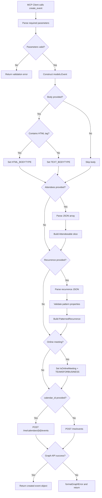
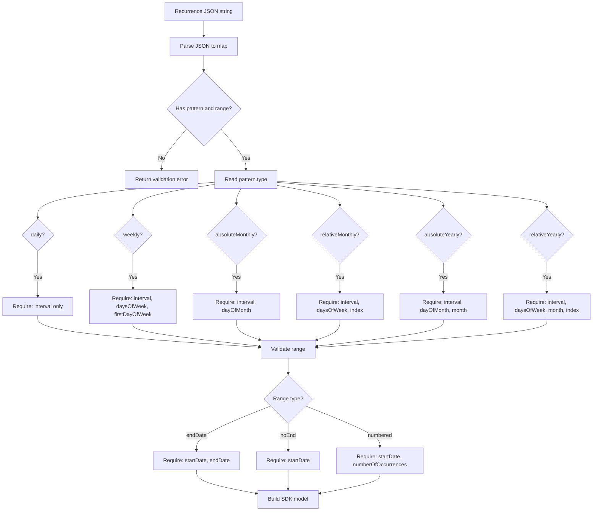
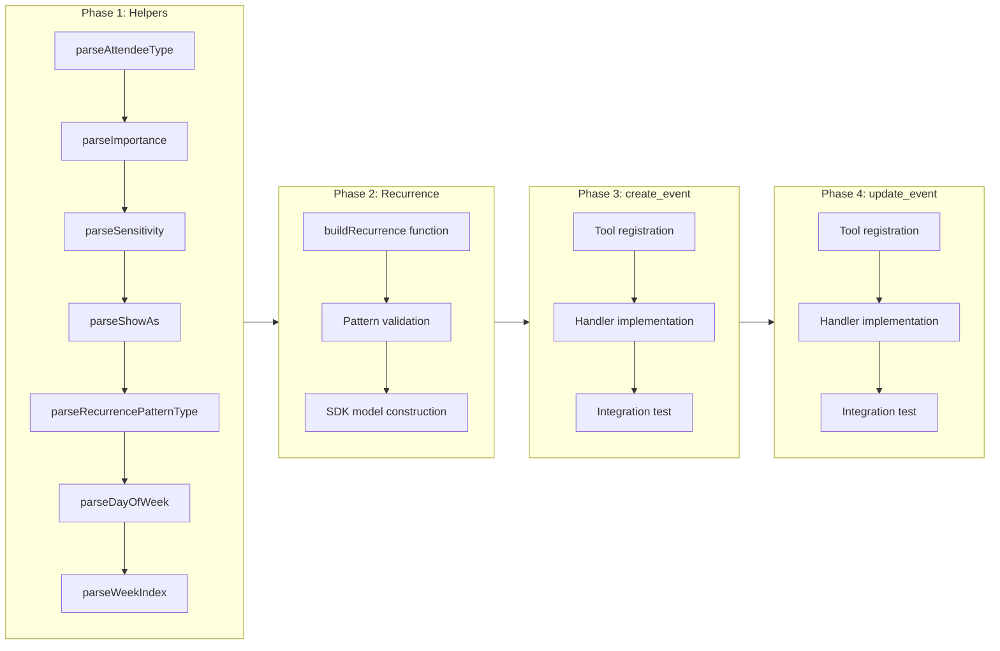

# Create & Update Event Tools (create_event, update_event)

## Change Summary

The Outlook Local MCP Server currently lacks the ability to create new calendar events or modify existing ones. This CR introduces two write tools -- `create_event` and `update_event` -- that enable full event lifecycle management through the Microsoft Graph API, including support for attendees, Teams online meetings, recurrence patterns, and all standard event properties. These tools form the core write capability of the MCP server, complementing the read-only tools established in prior CRs.

## Motivation and Background

Read-only calendar access (CR-0006, CR-0007) provides visibility into schedules, but an AI assistant cannot be truly useful for calendar management without the ability to create and modify events. Users need to schedule meetings, set up recurring events, add attendees (which triggers automatic invitation delivery), and update event details -- all through natural language interactions with the MCP client. The `create_event` and `update_event` tools are the highest-value write operations and represent the minimum viable set for productive calendar management.

## Change Drivers

* Core product requirement: event creation and modification are fundamental calendar operations
* User workflow completeness: read-only access without write capability limits the assistant's utility
* Teams integration demand: users need to create Teams online meetings directly from the assistant
* Recurrence support: scheduling recurring meetings is one of the most common calendar tasks

## Current State

The MCP server (as established by CR-0004) has a running MCP server instance with a Graph API client, but no event write tools are registered. The server can authenticate and make Graph API calls, and the error handling framework (CR-0005) is in place, but there are no tool handlers for creating or updating events.

## Proposed Change

Implement two new MCP tools registered with the server:

1. **`create_event`** -- Creates a new calendar event via `POST /me/events` (or `POST /me/calendars/{id}/events` when a specific calendar is targeted). Supports the full range of event properties: subject, start/end with timezones, body (HTML/text auto-detection), location, attendees (with automatic invitation sending), Teams online meetings, all-day events, importance, sensitivity, free/busy status, categories, recurrence patterns, and reminders.

2. **`update_event`** -- Updates an existing event via `PATCH /me/events/{id}` with PATCH semantics (only specified fields are changed). Supports all mutable event properties, attendee list replacement, recurrence modification or removal, and series vs. occurrence update semantics.

3. **Shared infrastructure** -- Enum parsing helpers and recurrence pattern construction logic shared by both tools.

### Event Creation Flow



### Recurrence Pattern Validation Flow



## Requirements

### Functional Requirements

1. The system **MUST** register a `create_event` tool with the MCP server that accepts the parameters: `subject` (required), `start_datetime` (required), `start_timezone` (required), `end_datetime` (required), `end_timezone` (required), `body`, `location`, `attendees`, `is_online_meeting`, `is_all_day`, `importance`, `sensitivity`, `show_as`, `categories`, `recurrence`, `reminder_minutes`, and `calendar_id`.
2. The system **MUST** register an `update_event` tool with the MCP server that accepts the parameters: `event_id` (required), `subject`, `start_datetime`, `start_timezone`, `end_datetime`, `end_timezone`, `body`, `location`, `attendees`, `is_all_day`, `importance`, `sensitivity`, `show_as`, `categories`, `recurrence`, `reminder_minutes`, and `is_reminder_on`.
3. The `create_event` tool **MUST** call `POST /me/events` when no `calendar_id` is provided, and `POST /me/calendars/{id}/events` when `calendar_id` is specified.
4. The `update_event` tool **MUST** call `PATCH /me/events/{id}` using the provided `event_id`.
5. The `update_event` tool **MUST** use PATCH semantics: only fields explicitly provided in the request are set on the request body; omitted fields are not included.
6. The system **MUST** detect body content type automatically: if the `body` string contains a `<` character, set content type to `HTML_BODYTYPE`; otherwise set it to `TEXT_BODYTYPE`.
7. The system **MUST** parse the `attendees` parameter as a JSON array of objects with `email`, `name`, and `type` fields, and construct `models.Attendeeable` instances for each entry.
8. The system **MUST** set `SetIsOnlineMeeting` to `true` and `SetOnlineMeetingProvider` to `TEAMSFORBUSINESS_ONLINEMEETINGPROVIDERTYPE` when `is_online_meeting` is `true`.
9. The system **MUST** format `dateTime` fields as ISO 8601 without UTC offset (e.g., `2026-04-15T09:00:00`), with the timezone specified separately via the `timeZone` property.
10. The system **MUST** parse the `recurrence` parameter as a JSON string and construct the appropriate `models.PatternedRecurrence` with `models.RecurrencePattern` and `models.RecurrenceRange` SDK objects.
11. The system **MUST** support recurrence range date values using `serialization.NewDateOnly()` or `serialization.ParseDateOnly()` for date-only fields (`startDate`, `endDate`).
12. The `update_event` tool **MUST** accept the string `"null"` for the `recurrence` parameter to remove recurrence from a series master event.
13. The system **MUST** parse comma-separated `categories` strings into a string slice and set them via `SetCategories`.
14. The system **MUST** return the full event object from the Graph API response for both create and update operations.
15. The system **MUST** pass Graph API errors through the `formatGraphError` function (CR-0005) and return structured error responses.

### Non-Functional Requirements

1. The system **MUST** implement the following enum parsing helper functions with case-insensitive matching: `parseAttendeeType`, `parseImportance`, `parseSensitivity`, `parseShowAs`, `parseRecurrencePatternType`, `parseDayOfWeek`, and `parseWeekIndex`.
2. The system **MUST** validate that `start_timezone` is provided when `start_datetime` is provided on `update_event`, and likewise for `end_timezone` with `end_datetime`.
3. The system **MUST** log all tool invocations and Graph API calls using the structured logging framework (CR-0002).
4. The system **MUST** enforce the Exchange Online limit of 500 attendees maximum and return a clear validation error if exceeded.

## Affected Components

* `main.go` or tool registration module -- new tool registrations for `create_event` and `update_event`
* Tool handler functions -- `handleCreateEvent`, `handleUpdateEvent`
* Enum parsing helpers -- shared utility functions for mapping string values to Go SDK enum constants
* Recurrence builder -- shared logic for constructing `PatternedRecurrence` from JSON input

## Scope Boundaries

### In Scope

* `create_event` tool registration, handler, and all parameter processing
* `update_event` tool registration, handler, and PATCH-semantics parameter processing
* Recurrence pattern JSON parsing and SDK model construction (shared by both tools)
* Enum parsing helper functions for attendee type, importance, sensitivity, free/busy status, recurrence pattern type, day of week, and week index
* Body content type auto-detection (HTML vs. text)
* Attendees JSON parsing and `Attendeeable` construction
* Teams online meeting setup (`IsOnlineMeeting`, `OnlineMeetingProvider`)
* Calendar targeting via `calendar_id` parameter (create only)
* Error handling integration with `formatGraphError` (CR-0005)

### Out of Scope ("Here, But Not Further")

* `delete_event` tool -- deferred to CR-0009
* `cancel_event` tool -- deferred to CR-0009
* Read-only tools (`list_events`, `get_event`, `list_calendars`, `find_meeting_times`) -- covered by CR-0006 and CR-0007
* "This and all following" occurrence update workaround (not natively supported by Graph API; documented as a limitation)
* `transactionId` idempotency support -- not exposed as a tool parameter in this iteration
* Time zone validation against the IANA database
* Rich location types (coordinates, address) -- only `displayName` is supported

## Impact Assessment

### User Impact

Users will be able to create new calendar events and modify existing ones through the MCP client. Meeting invitations are sent automatically by the Graph API when attendees are included, requiring no additional user action. Users can create Teams meetings, set up recurring events with complex patterns, and update individual properties of existing events without affecting other fields.

### Technical Impact

This CR introduces the first write operations to the MCP server. The Graph API write calls have side effects (sending invitations, modifying server-side state) that are not reversible through the same API. The enum parsing helpers and recurrence builder logic introduced here will be reused by future write tools (CR-0009 and beyond). The PATCH semantics of `update_event` require careful handling to avoid accidentally clearing fields that should be preserved.

### Business Impact

Event creation and modification are the core value proposition of a calendar management assistant. Without these tools, the MCP server is limited to read-only access, which significantly reduces its utility. Delivering these tools unblocks productive calendar automation workflows.

## Implementation Approach

### Phase 1: Enum Parsing Helpers

Implement all enum parsing functions as a shared utility. Each function takes a lowercase string and returns the corresponding Go SDK enum constant. Unknown values default to a sensible fallback (e.g., `REQUIRED_ATTENDEETYPE` for unknown attendee types, `NORMAL_IMPORTANCE` for unknown importance values).

### Phase 2: Recurrence Builder

Implement a `buildRecurrence(jsonStr string) (*models.PatternedRecurrence, error)` function that:
1. Parses the JSON string into a map structure
2. Validates required properties for the given pattern type
3. Constructs `models.RecurrencePattern` with the appropriate enum values and properties
4. Constructs `models.RecurrenceRange` with date-only values via `serialization.ParseDateOnly`
5. Returns the assembled `models.PatternedRecurrence`

### Phase 3: create_event Tool

Register the tool and implement `handleCreateEvent`:
1. Extract and validate required parameters
2. Construct `models.NewEvent()` with all provided properties
3. Handle body content type detection
4. Parse attendees JSON and build the attendee list
5. Set online meeting properties if requested
6. Build recurrence if provided
7. Call the appropriate Graph API endpoint
8. Return the created event object

### Phase 4: update_event Tool

Register the tool and implement `handleUpdateEvent`:
1. Extract `event_id` (required)
2. Conditionally set only provided fields on `models.NewEvent()`
3. Handle `recurrence: "null"` for recurrence removal
4. Call `PATCH /me/events/{id}`
5. Return the updated event object

### Implementation Flow



## Test Strategy

### Tests to Add

| Test File | Test Name | Description | Inputs | Expected Output |
|-----------|-----------|-------------|--------|-----------------|
| `main_test.go` | `TestParseAttendeeType` | Validates attendee type parsing for all valid values and unknown input | `"required"`, `"optional"`, `"resource"`, `"unknown"` | Corresponding SDK enum constants; unknown defaults to `REQUIRED_ATTENDEETYPE` |
| `main_test.go` | `TestParseImportance` | Validates importance parsing | `"low"`, `"normal"`, `"high"`, `""` | Corresponding SDK constants; empty defaults to `NORMAL_IMPORTANCE` |
| `main_test.go` | `TestParseSensitivity` | Validates sensitivity parsing | `"normal"`, `"personal"`, `"private"`, `"confidential"` | Corresponding SDK constants |
| `main_test.go` | `TestParseShowAs` | Validates free/busy status parsing | `"free"`, `"tentative"`, `"busy"`, `"oof"`, `"workingElsewhere"` | Corresponding SDK constants |
| `main_test.go` | `TestParseRecurrencePatternType` | Validates recurrence pattern type parsing | `"daily"`, `"weekly"`, `"absoluteMonthly"`, `"relativeMonthly"`, `"absoluteYearly"`, `"relativeYearly"` | Corresponding SDK constants |
| `main_test.go` | `TestParseDayOfWeek` | Validates day of week parsing | `"monday"` through `"sunday"` | Corresponding SDK constants |
| `main_test.go` | `TestParseWeekIndex` | Validates week index parsing | `"first"`, `"second"`, `"third"`, `"fourth"`, `"last"` | Corresponding SDK constants |
| `main_test.go` | `TestBuildRecurrenceWeekly` | Validates weekly recurrence pattern construction | Weekly pattern JSON with endDate range | Valid `PatternedRecurrence` with correct pattern type, days, and range |
| `main_test.go` | `TestBuildRecurrenceDaily` | Validates daily recurrence pattern construction | Daily pattern JSON with numbered range | Valid `PatternedRecurrence` with daily type and occurrence count |
| `main_test.go` | `TestBuildRecurrenceRelativeMonthly` | Validates relative monthly pattern | Relative monthly JSON with index and daysOfWeek | Valid `PatternedRecurrence` with index and day |
| `main_test.go` | `TestBuildRecurrenceInvalidJSON` | Validates error on malformed JSON | `"not valid json"` | Error returned |
| `main_test.go` | `TestBuildRecurrenceMissingPattern` | Validates error when pattern is missing | JSON with only range | Error returned |
| `main_test.go` | `TestBodyContentTypeDetection` | Validates HTML vs text detection | `"<p>Hello</p>"` and `"Hello world"` | `HTML_BODYTYPE` and `TEXT_BODYTYPE` respectively |
| `main_test.go` | `TestAttendeesJSONParsing` | Validates attendee JSON parsing and SDK construction | `[{"email":"a@b.com","name":"A","type":"required"}]` | Slice of one `Attendeeable` with correct email, name, type |
| `main_test.go` | `TestAttendeesJSONInvalid` | Validates error on malformed attendees JSON | `"not json"` | Error returned |
| `main_test.go` | `TestAttendeesExceedLimit` | Validates 500 attendee limit enforcement | JSON array with 501 attendee objects | Validation error returned |
| `main_test.go` | `TestCreateEventMinimalParams` | Validates create with only required params | Subject, start/end datetime and timezone | Event constructed with only those fields set |
| `main_test.go` | `TestUpdateEventPatchSemantics` | Validates only provided fields are set | event_id + subject only | Event body has only subject set |
| `main_test.go` | `TestUpdateEventRecurrenceRemoval` | Validates recurrence removal with "null" string | `recurrence: "null"` | Recurrence set to nil on request body |

### Tests to Modify

Not applicable -- this is a new feature with no existing tests to modify.

### Tests to Remove

Not applicable -- no existing tests need removal.

## Acceptance Criteria

### AC-1: Create event with required parameters only

```gherkin
Given the MCP server is running and authenticated with the Graph API
When the create_event tool is called with subject "Team Standup", start_datetime "2026-04-15T09:00:00", start_timezone "America/New_York", end_datetime "2026-04-15T09:30:00", end_timezone "America/New_York"
Then the Graph API receives a POST request to /me/events
  And the request body contains the subject, start, and end properties
  And the tool returns the full created event object with a server-generated id
```

### AC-2: Create event with attendees sends invitations

```gherkin
Given the MCP server is running and authenticated
When the create_event tool is called with attendees '[{"email":"alice@example.com","name":"Alice","type":"required"}]'
Then the request body contains an attendees array with one Attendeeable object
  And the attendee email is "alice@example.com"
  And the attendee type is REQUIRED_ATTENDEETYPE
  And the Graph API automatically sends a meeting invitation to alice@example.com
```

### AC-3: Create event with Teams online meeting

```gherkin
Given the MCP server is running with a work/school account
When the create_event tool is called with is_online_meeting set to true
Then the request body has isOnlineMeeting set to true
  And the onlineMeetingProvider is set to TEAMSFORBUSINESS_ONLINEMEETINGPROVIDERTYPE
  And the response includes an onlineMeeting.joinUrl
```

### AC-4: Create event in a specific calendar

```gherkin
Given the MCP server is running and authenticated
  And a calendar exists with ID "calendar-abc-123"
When the create_event tool is called with calendar_id "calendar-abc-123"
Then the Graph API receives a POST request to /me/calendars/calendar-abc-123/events
  And the tool returns the created event object
```

### AC-5: Create event with weekly recurrence

```gherkin
Given the MCP server is running and authenticated
When the create_event tool is called with recurrence '{"pattern":{"type":"weekly","interval":1,"daysOfWeek":["monday"],"firstDayOfWeek":"sunday"},"range":{"type":"endDate","startDate":"2026-04-15","endDate":"2026-12-31"}}'
Then the request body contains a recurrence property
  And the pattern type is WEEKLY_RECURRENCEPATTERNTYPE
  And the range startDate is 2026-04-15
  And the range endDate is 2026-12-31
```

### AC-6: Body content type auto-detection

```gherkin
Given the MCP server is running
When the create_event tool is called with body "<p>Meeting agenda</p>"
Then the body content type is set to HTML_BODYTYPE

Given the MCP server is running
When the create_event tool is called with body "Meeting agenda for Monday"
Then the body content type is set to TEXT_BODYTYPE
```

### AC-7: Update event with PATCH semantics

```gherkin
Given the MCP server is running and an event exists with ID "event-xyz"
When the update_event tool is called with event_id "event-xyz" and subject "New Title"
Then the Graph API receives a PATCH request to /me/events/event-xyz
  And the request body contains only the subject field
  And no other event properties are modified
  And the tool returns the full updated event object
```

### AC-8: Update event removes recurrence

```gherkin
Given the MCP server is running and a recurring series master event exists with ID "series-master-id"
When the update_event tool is called with event_id "series-master-id" and recurrence "null"
Then the recurrence is removed from the event
  And the event becomes a single (non-recurring) event
```

### AC-9: Update event replaces attendee list

```gherkin
Given the MCP server is running and an event exists with attendees Alice and Bob
When the update_event tool is called with attendees '[{"email":"charlie@example.com","name":"Charlie","type":"optional"}]'
Then the attendee list is replaced entirely with only Charlie
  And the Graph API sends update notifications to affected attendees
```

### AC-10: Attendee limit enforcement

```gherkin
Given the MCP server is running
When the create_event tool is called with an attendees JSON array containing 501 entries
Then the tool returns a validation error indicating the 500 attendee limit
  And no Graph API call is made
```

### AC-11: Graph API error handling

```gherkin
Given the MCP server is running and the Graph API returns an error
When the create_event or update_event tool encounters the error
Then the error is passed through formatGraphError (CR-0005)
  And a structured error response is returned to the MCP client
```

### AC-12: Start timezone required with start datetime on update

```gherkin
Given the MCP server is running
When the update_event tool is called with start_datetime but without start_timezone
Then the tool returns a validation error indicating start_timezone is required when start_datetime is provided
```

## Quality Standards Compliance

### Build & Compilation

- [ ] Code compiles/builds without errors
- [ ] No new compiler warnings introduced

### Linting & Code Style

- [ ] All linter checks pass with zero warnings/errors
- [ ] Code follows project coding conventions and style guides
- [ ] Any linter exceptions are documented with justification

### Test Execution

- [ ] All existing tests pass after implementation
- [ ] All new tests pass
- [ ] Test coverage meets project requirements for changed code

### Documentation

- [ ] Inline code documentation updated where applicable
- [ ] API documentation updated for any API changes
- [ ] User-facing documentation updated if behavior changes

### Code Review

- [ ] Changes submitted via pull request
- [ ] PR title follows Conventional Commits format
- [ ] Code review completed and approved
- [ ] Changes squash-merged to maintain linear history

### Verification Commands

```bash
# Build verification
go build ./...

# Lint verification
golangci-lint run

# Test execution
go test ./... -v

# Test coverage
go test ./... -coverprofile=coverage.out
go tool cover -func=coverage.out
```

## Risks and Mitigation

### Risk 1: Automatic invitation sending on create/update

**Likelihood:** high
**Impact:** high
**Mitigation:** Document clearly in tool descriptions that attendee inclusion triggers automatic invitation emails. The MCP client (AI assistant) **MUST** confirm with the user before calling `create_event` or `update_event` with attendees. There is no "draft" mode in the Graph API -- the invitation is sent immediately.

### Risk 2: Recurrence pattern validation errors from Graph API

**Likelihood:** medium
**Impact:** medium
**Mitigation:** Implement client-side validation of required properties per pattern type before making the API call. Invalid combinations (e.g., including `dayOfMonth` on a `weekly` pattern) cause HTTP 400 errors. The `buildRecurrence` function **MUST** validate property sets before constructing the SDK model.

### Risk 3: Teams meeting body content overwrite on update

**Likelihood:** medium
**Impact:** high
**Mitigation:** Document in the `update_event` tool description that updating the body of a Teams meeting event can destroy the meeting join link HTML blob. The tool description **MUST** warn users about this behavior. Future enhancement could add automatic preservation logic, but that is out of scope for this CR.

### Risk 4: Occurrence crossing boundary errors

**Likelihood:** low
**Impact:** medium
**Mitigation:** When updating a single occurrence's time, the Graph API returns `ErrorOccurrenceCrossingBoundary` if the new time would overlap with adjacent occurrences. This error **MUST** be surfaced clearly through `formatGraphError`. The tool description **MUST** note this constraint.

### Risk 5: Attendee list replacement semantics on update

**Likelihood:** medium
**Impact:** medium
**Mitigation:** The `update_event` attendees parameter replaces the entire attendee list (not a merge). The tool description **MUST** clearly state this behavior. The MCP client should retrieve the current attendee list first if only adding/removing specific attendees.

## Dependencies

* CR-0001 (Configuration) -- provides tenant ID, client ID, and authentication configuration
* CR-0002 (Logging) -- provides structured logging for tool invocations and API calls
* CR-0004 (Graph Client & MCP Server) -- provides the authenticated Graph client and MCP server instance for tool registration
* CR-0005 (Error Handling) -- provides `formatGraphError` for consistent Graph API error reporting
* Microsoft Graph SDK (`github.com/microsoftgraph/msgraph-sdk-go`) -- provides `models.NewEvent()`, `models.NewDateTimeTimeZone()`, `models.NewAttendee()`, `models.NewEmailAddress()`, `models.NewItemBody()`, `models.NewLocation()`, `models.NewPatternedRecurrence()`, `models.NewRecurrencePattern()`, `models.NewRecurrenceRange()`
* Kiota Serialization (`github.com/microsoft/kiota-abstractions-go/serialization`) -- provides `DateOnly`, `NewDateOnly()`, `ParseDateOnly()` for recurrence range dates

## Estimated Effort

| Phase | Description | Estimate |
|-------|-------------|----------|
| Phase 1 | Enum parsing helpers (7 functions + tests) | 3 hours |
| Phase 2 | Recurrence builder (construction + validation + tests) | 4 hours |
| Phase 3 | create_event tool (registration + handler + tests) | 5 hours |
| Phase 4 | update_event tool (registration + handler + tests) | 4 hours |
| **Total** | | **16 hours** |

## Decision Outcome

Chosen approach: "Direct Graph SDK model construction with shared helper functions", because the Microsoft Graph Go SDK provides strongly-typed model builders (`models.NewEvent()`, `models.NewAttendee()`, etc.) that map directly to the API schema. Sharing enum parsing and recurrence building logic between `create_event` and `update_event` avoids duplication while keeping each handler self-contained. JSON string parameters for attendees and recurrence follow the MCP convention of passing complex structures as strings, since MCP tool parameters are limited to primitive types.

## Related Items

* CR-0001 -- Configuration and authentication setup
* CR-0002 -- Structured logging framework
* CR-0004 -- Graph client initialization and MCP server setup
* CR-0005 -- Error handling and `formatGraphError`
* CR-0006 -- Read-only event tools (list_events, get_event)
* CR-0007 -- Read-only calendar tools (list_calendars, find_meeting_times)
* CR-0009 -- Delete and cancel event tools (future)
* Spec reference: `docs/reference/outlook-local-mcp-spec.md` (Tool 6, Tool 7, Recurrence Patterns Reference, Go SDK Enum Reference)
