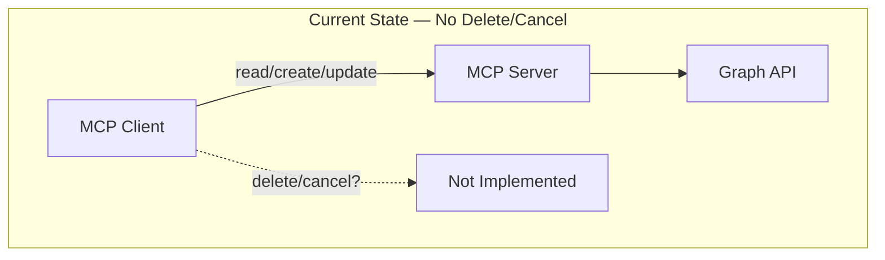
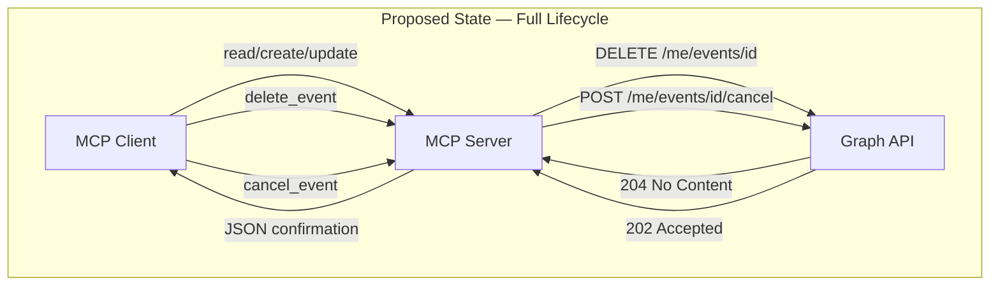
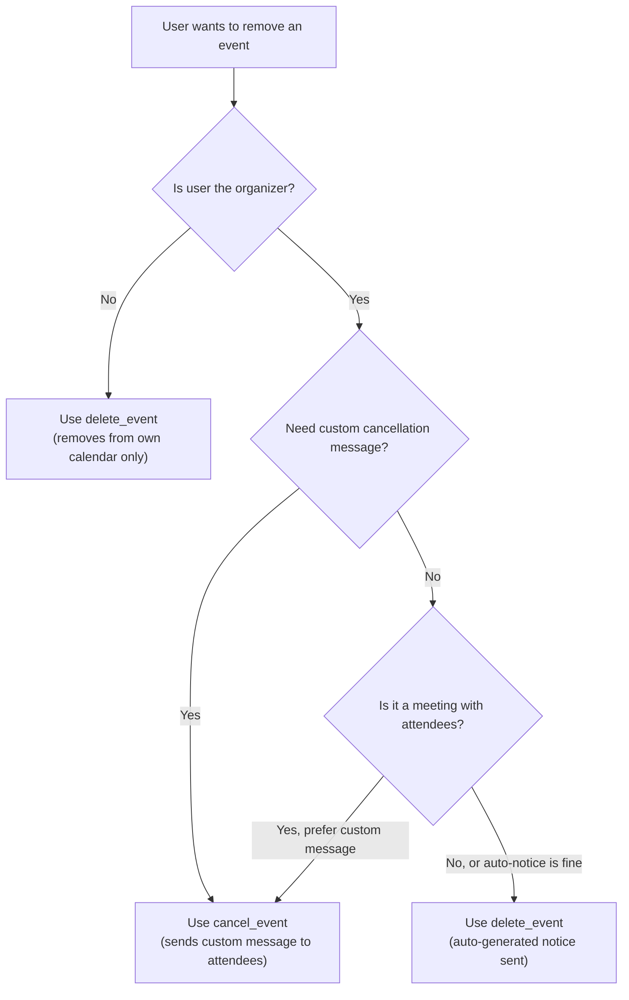
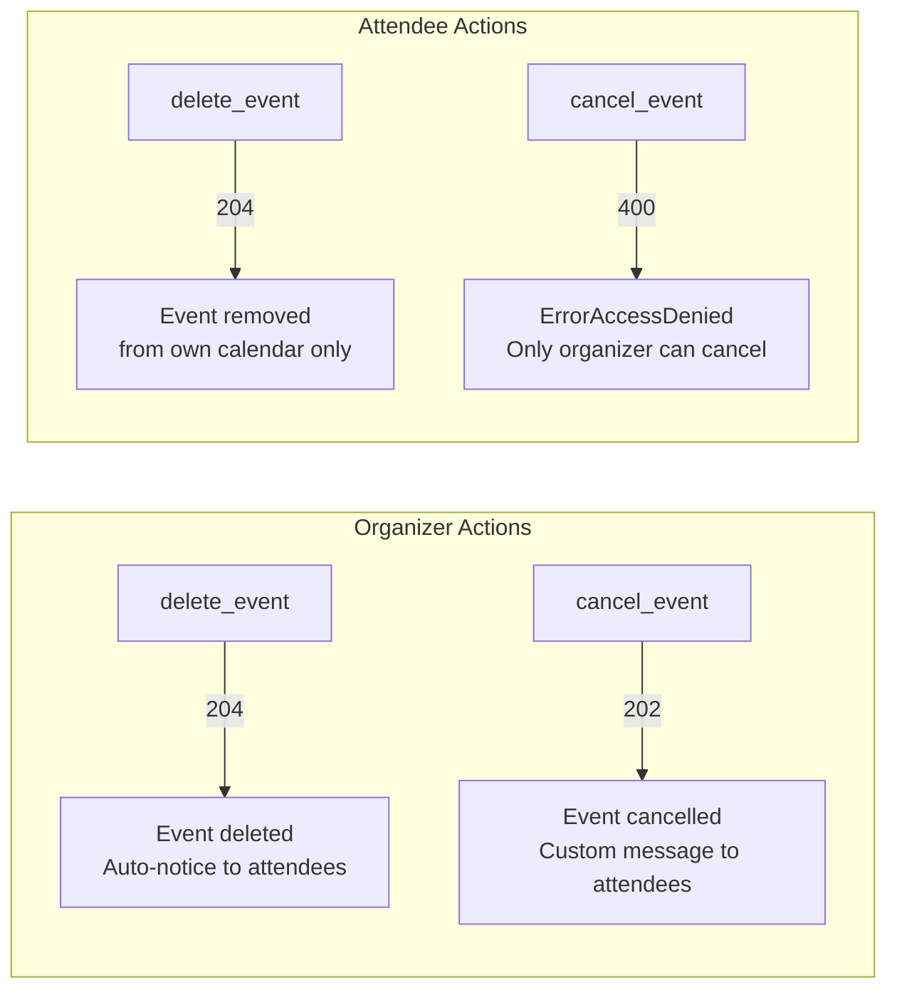
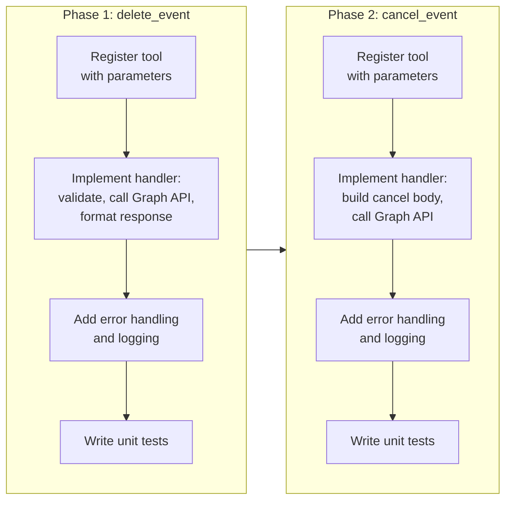

# Delete & Cancel Event Tools (delete_event, cancel_event)

## Change Summary

This CR introduces two destructive calendar operations to the Outlook Local MCP Server: `delete_event` and `cancel_event`. Currently the server has no capability to remove or cancel calendar events. The desired future state is a server that exposes both tools, allowing an MCP client to delete events from a user's calendar or cancel meetings with custom messages sent to attendees, using the Microsoft Graph API.

## Motivation and Background

A calendar management tool that can only read and create events is incomplete. Users need the ability to remove events that are no longer relevant and to cancel meetings while communicating a reason to attendees. The Microsoft Graph API provides two distinct mechanisms for this — DELETE and Cancel — each with different semantics, permissions, and attendee notification behavior. Exposing both as separate MCP tools gives the AI assistant the ability to choose the appropriate action based on context (e.g., whether the user is the organizer, whether a custom cancellation message is needed).

## Change Drivers

* **Feature completeness:** Full CRUD lifecycle for calendar events requires delete/cancel capabilities.
* **User expectations:** Users expect to manage their calendar end-to-end, including removing and cancelling events.
* **Semantic distinction:** The Graph API treats "delete" and "cancel" as fundamentally different operations with different access rules and notification behaviors; exposing both provides correct, idiomatic calendar management.

## Current State

The Outlook Local MCP Server does not implement any destructive event operations. There is no way for an MCP client to remove an event from a user's calendar or cancel a meeting with attendees. Users who need to delete or cancel events must do so through another interface (e.g., Outlook directly).

### Current State Diagram



## Proposed Change

Implement two new MCP tools — `delete_event` and `cancel_event` — each registered on the MCP server, each calling the appropriate Microsoft Graph API endpoint, and each returning a structured JSON confirmation to the MCP client.

### delete_event Tool

* **Parameters:** `event_id` (string, required)
* **Graph API:** `DELETE /me/events/{id}` via `graphClient.Me().Events().ByEventId(eventID).Delete(ctx, nil)`
* **HTTP response:** 204 No Content (empty body)
* **Behavior:** When the organizer deletes a meeting, cancellation notices are automatically sent to attendees. When an attendee deletes, the event is removed only from their own calendar. Deleting a series master deletes all occurrences. The event is moved to Deleted Items and is recoverable within the retention period.
* **Tool response:**
  ```json
  {
    "deleted": true,
    "event_id": "AAMkAG...",
    "message": "Event deleted successfully. Cancellation notices were sent to attendees if applicable."
  }
  ```

### cancel_event Tool

* **Parameters:** `event_id` (string, required), `comment` (string, optional — custom cancellation message)
* **Graph API:** `POST /me/events/{id}/cancel` via `graphClient.Me().Events().ByEventId(eventID).Cancel().Post(ctx, cancelBody, nil)`
* **HTTP response:** 202 Accepted
* **Behavior:** Only the organizer can cancel. A non-organizer receives HTTP 400 (ErrorAccessDenied). Cancelling a series master cancels all future instances. Cancelling a single occurrence cancels just that one. The optional `comment` parameter is sent as the cancellation message to all attendees.
* **Tool response:**
  ```json
  {
    "cancelled": true,
    "event_id": "AAMkAG...",
    "message": "Meeting cancelled. Cancellation message sent to all attendees."
  }
  ```

### Proposed State Diagram



### Delete vs Cancel Decision Flow



### Organizer vs Attendee Behavior



## Requirements

### Functional Requirements

1. The system **MUST** register a `delete_event` tool on the MCP server with a required `event_id` string parameter.
2. The system **MUST** register a `cancel_event` tool on the MCP server with a required `event_id` string parameter and an optional `comment` string parameter.
3. The `delete_event` tool **MUST** call `graphClient.Me().Events().ByEventId(eventID).Delete(ctx, nil)` to perform the deletion.
4. The `cancel_event` tool **MUST** construct a request body using `graphusers.NewItemCancelPostRequestBody()` and call `graphClient.Me().Events().ByEventId(eventID).Cancel().Post(ctx, cancelBody, nil)`.
5. The `cancel_event` tool **MUST** set the comment on the cancel request body via `SetComment(&comment)` when the `comment` parameter is provided and non-empty.
6. The `cancel_event` tool **MUST** omit the comment from the request body when the `comment` parameter is not provided or is empty.
7. The `delete_event` tool **MUST** return a JSON object containing `"deleted": true`, the `event_id`, and a descriptive message on success.
8. The `cancel_event` tool **MUST** return a JSON object containing `"cancelled": true`, the `event_id`, and a descriptive message on success.
9. Both tools **MUST** return an MCP tool error result via `mcp.NewToolResultError(formatGraphError(err))` when the Graph API call fails.
10. Both tools **MUST** log errors using `slog.Error` with structured fields including `event_id` and the formatted error before returning the error result.
11. Neither tool **MUST** use `mcp.WithReadOnlyHintAnnotation(true)` — both are write operations.
12. The `delete_event` tool description **MUST** mention that cancellation notices are automatically sent to attendees when the organizer deletes, and suggest `cancel_event` for custom messages.
13. The `cancel_event` tool description **MUST** state that only the organizer can cancel and suggest `delete_event` for non-meeting events or when no custom message is needed.

### Non-Functional Requirements

1. The system **MUST** handle Graph API error responses (e.g., 404 Not Found for invalid event IDs, 400 Bad Request for non-organizer cancel attempts) and surface them through `formatGraphError`.
2. The system **MUST** complete delete and cancel operations within the same timeout constraints as other Graph API calls in the server.
3. The system **MUST** not block or perform retries on 4xx client errors from the Graph API for these operations.

## Affected Components

* `main.go` (or equivalent tool registration file) — new tool registrations and handler functions
* Graph API client usage — new DELETE and POST /cancel calls
* Error handling — use of existing `formatGraphError` utility
* Structured logging — `slog.Error` calls for failure cases

## Scope Boundaries

### In Scope

* Implementation of the `delete_event` MCP tool with Graph API DELETE call
* Implementation of the `cancel_event` MCP tool with Graph API POST /cancel call
* Tool registration with correct parameter definitions and descriptions
* Structured JSON success responses for both tools
* Error handling and structured logging for both tools
* Unit tests covering success and error paths for both tools

### Out of Scope ("Here, But Not Further")

* `create_event` tool — addressed in CR-0008
* `update_event` tool — addressed in CR-0008
* Read-only tools (`list_events`, `get_event`, `list_calendars`) — addressed in CR-0006 and CR-0007
* Batch deletion of multiple events in a single call
* Undo/restore of deleted events from Deleted Items
* Recurring event occurrence-level delete/cancel UI guidance (the tools operate on whatever event ID is provided; series master vs occurrence is determined by the ID)
* Confirmation prompts or safeguards before destructive operations (left to the MCP client/AI assistant layer)

## Impact Assessment

### User Impact

Users (via their MCP-connected AI assistant) will gain the ability to delete events and cancel meetings directly from the conversational interface. The AI assistant can choose between `delete_event` and `cancel_event` based on context — whether the user is the organizer, whether a custom message is needed, and whether the event has attendees. There is no workflow change for users; this is net-new capability.

### Technical Impact

* Two new tool handler functions are added to the server.
* A new import for `graphusers` types (`NewItemCancelPostRequestBody`) is required for the cancel tool.
* No breaking changes to existing tools or server behavior.
* The dependency on `formatGraphError` from CR-0005 is critical; both tools use it for error formatting.
* No database or state changes; all operations are stateless calls to the Graph API.

### Business Impact

Completing the destructive operations brings the MCP server closer to feature parity with native Outlook calendar management, making the tool more useful in real-world assistant scenarios. Without delete/cancel, the server would be limited to read-and-create workflows, significantly reducing its practical value.

## Implementation Approach

Implementation is a single phase, as both tools are independent of each other and follow the same pattern established by existing tools.

### Implementation Flow



### Implementation Details

**delete_event handler:**

1. Extract `event_id` from the tool call arguments.
2. Call `graphClient.Me().Events().ByEventId(eventID).Delete(ctx, nil)`.
3. On error: log with `slog.Error("delete event failed", "event_id", eventID, "error", formatGraphError(err))` and return `mcp.NewToolResultError(formatGraphError(err))`.
4. On success: marshal and return the JSON confirmation with `deleted: true`.

**cancel_event handler:**

1. Extract `event_id` and optional `comment` from the tool call arguments.
2. Create cancel body: `cancelBody := graphusers.NewItemCancelPostRequestBody()`.
3. If `comment` is non-empty: `cancelBody.SetComment(&comment)`.
4. Call `graphClient.Me().Events().ByEventId(eventID).Cancel().Post(ctx, cancelBody, nil)`.
5. On error: log with `slog.Error("cancel event failed", "event_id", eventID, "error", formatGraphError(err))` and return `mcp.NewToolResultError(formatGraphError(err))`.
6. On success: marshal and return the JSON confirmation with `cancelled: true`.

## Test Strategy

### Tests to Add

| Test File | Test Name | Description | Inputs | Expected Output |
|-----------|-----------|-------------|--------|-----------------|
| `main_test.go` | `TestDeleteEvent_Success` | Verifies successful deletion returns correct JSON with `deleted: true` | Valid `event_id`, mock Graph client returning nil error | JSON with `deleted: true`, matching `event_id`, success message |
| `main_test.go` | `TestDeleteEvent_NotFound` | Verifies 404 error from Graph API is formatted and returned | Invalid `event_id`, mock Graph client returning 404 error | MCP tool error result with formatted error message |
| `main_test.go` | `TestDeleteEvent_MissingEventId` | Verifies that missing required `event_id` parameter is handled | Empty/missing `event_id` | MCP tool error result indicating missing parameter |
| `main_test.go` | `TestCancelEvent_Success_WithComment` | Verifies cancel with custom comment returns correct JSON | Valid `event_id`, `comment` string, mock Graph client returning nil | JSON with `cancelled: true`, matching `event_id`, success message |
| `main_test.go` | `TestCancelEvent_Success_WithoutComment` | Verifies cancel without comment still succeeds | Valid `event_id`, no `comment`, mock Graph client returning nil | JSON with `cancelled: true`, matching `event_id`, success message |
| `main_test.go` | `TestCancelEvent_NonOrganizer` | Verifies HTTP 400 from Graph API for non-organizer is handled | Valid `event_id`, mock Graph client returning 400 ErrorAccessDenied | MCP tool error result with formatted access denied message |
| `main_test.go` | `TestCancelEvent_NotFound` | Verifies 404 error from Graph API is formatted and returned | Invalid `event_id`, mock Graph client returning 404 error | MCP tool error result with formatted error message |
| `main_test.go` | `TestCancelEvent_MissingEventId` | Verifies that missing required `event_id` parameter is handled | Empty/missing `event_id` | MCP tool error result indicating missing parameter |

### Tests to Modify

Not applicable. This CR introduces new tools; no existing tests require modification.

### Tests to Remove

Not applicable. No existing tests become redundant as a result of this CR.

## Acceptance Criteria

### AC-1: Successful event deletion

```gherkin
Given the MCP server is running and authenticated with the Graph API
  And an event exists with a known event_id
When the MCP client calls delete_event with that event_id
Then the server calls DELETE /me/events/{id} on the Graph API
  And the server returns a JSON object with "deleted" set to true
  And the JSON object contains the event_id
  And the JSON object contains a success message
```

### AC-2: Delete event — Graph API error handling

```gherkin
Given the MCP server is running and authenticated with the Graph API
When the MCP client calls delete_event with a non-existent event_id
Then the Graph API returns a 404 error
  And the server logs the error with slog.Error including the event_id
  And the server returns an MCP tool error result with the formatted error message
```

### AC-3: Successful meeting cancellation with custom message

```gherkin
Given the MCP server is running and authenticated as the meeting organizer
  And a meeting exists with a known event_id and has attendees
When the MCP client calls cancel_event with that event_id and a comment "Meeting postponed to next week"
Then the server constructs a cancel request body with the comment set
  And the server calls POST /me/events/{id}/cancel on the Graph API
  And the server returns a JSON object with "cancelled" set to true
  And the JSON object contains the event_id
  And the JSON object contains a success message
```

### AC-4: Successful meeting cancellation without custom message

```gherkin
Given the MCP server is running and authenticated as the meeting organizer
  And a meeting exists with a known event_id
When the MCP client calls cancel_event with that event_id and no comment
Then the server constructs a cancel request body without a comment set
  And the server calls POST /me/events/{id}/cancel on the Graph API
  And the server returns a JSON object with "cancelled" set to true
```

### AC-5: Cancel event — non-organizer receives access denied

```gherkin
Given the MCP server is running and authenticated as a meeting attendee (not the organizer)
  And a meeting exists with a known event_id
When the MCP client calls cancel_event with that event_id
Then the Graph API returns HTTP 400 with ErrorAccessDenied
  And the server logs the error with slog.Error including the event_id
  And the server returns an MCP tool error result with the formatted error message
```

### AC-6: Tool registration — delete_event

```gherkin
Given the MCP server is starting up
When the delete_event tool is registered
Then the tool has a required "event_id" string parameter
  And the tool does not have the ReadOnlyHintAnnotation set
  And the tool description mentions automatic cancellation notices for organizer deletions
  And the tool description suggests cancel_event for custom messages
```

### AC-7: Tool registration — cancel_event

```gherkin
Given the MCP server is starting up
When the cancel_event tool is registered
Then the tool has a required "event_id" string parameter
  And the tool has an optional "comment" string parameter
  And the tool does not have the ReadOnlyHintAnnotation set
  And the tool description states only the organizer can cancel
  And the tool description suggests delete_event for non-meeting events
```

### AC-8: Structured error logging for both tools

```gherkin
Given the MCP server is running
When either delete_event or cancel_event encounters a Graph API error
Then the server logs at Error level via slog.Error
  And the log entry includes the "event_id" field
  And the log entry includes the "error" field with the formatted Graph error
```

## Quality Standards Compliance

### Build & Compilation

- [ ] Code compiles/builds without errors
- [ ] No new compiler warnings introduced

### Linting & Code Style

- [ ] All linter checks pass with zero warnings/errors
- [ ] Code follows project coding conventions and style guides
- [ ] Any linter exceptions are documented with justification

### Test Execution

- [ ] All existing tests pass after implementation
- [ ] All new tests pass
- [ ] Test coverage meets project requirements for changed code

### Documentation

- [ ] Inline code documentation updated where applicable
- [ ] API documentation updated for any API changes
- [ ] User-facing documentation updated if behavior changes

### Code Review

- [ ] Changes submitted via pull request
- [ ] PR title follows Conventional Commits format
- [ ] Code review completed and approved
- [ ] Changes squash-merged to maintain linear history

### Verification Commands

```bash
# Build verification
go build ./...

# Lint verification
golangci-lint run

# Test execution
go test ./... -v

# Test coverage
go test ./... -coverprofile=coverage.out
go tool cover -func=coverage.out
```

## Risks and Mitigation

### Risk 1: Accidental deletion of recurring event series

**Likelihood:** medium
**Impact:** high
**Mitigation:** The tool description for `delete_event` **MUST** clearly state that deleting a series master deletes all occurrences. The AI assistant layer is responsible for confirming intent with the user before invoking destructive operations. The event is recoverable from Deleted Items within the retention period.

### Risk 2: Non-organizer attempts to cancel a meeting

**Likelihood:** medium
**Impact:** low
**Mitigation:** The Graph API returns HTTP 400 (ErrorAccessDenied) which is caught by `formatGraphError` and returned as an MCP tool error. The tool description clearly states organizer-only access. The AI assistant can use `delete_event` instead for attendees who want to remove the event from their own calendar.

### Risk 3: Event ID becomes stale between read and delete/cancel

**Likelihood:** low
**Impact:** low
**Mitigation:** The Graph API returns a 404 error for non-existent event IDs, which is handled through standard error handling. This is an inherent characteristic of eventually-consistent distributed systems and does not require special mitigation beyond proper error handling.

## Dependencies

* **CR-0001 (Configuration):** Required for Entra ID credentials and tenant configuration used by the Graph client.
* **CR-0002 (Logging):** Required for `slog` structured logging infrastructure.
* **CR-0004 (Graph Client & MCP Server):** Required for `graphClient` initialization and MCP server/tool registration framework.
* **CR-0005 (Error Handling):** Required for `formatGraphError` utility used by both tools to format Graph API errors into user-friendly messages.

## Estimated Effort

| Component | Estimate |
|-----------|----------|
| `delete_event` tool registration and handler | 1 hour |
| `cancel_event` tool registration and handler | 1.5 hours |
| Unit tests for both tools | 2 hours |
| Code review and integration testing | 1 hour |
| **Total** | **5.5 hours** |

## Decision Outcome

Chosen approach: "Two separate MCP tools — `delete_event` and `cancel_event` — each mapping directly to a distinct Graph API endpoint", because the Microsoft Graph API treats these as fundamentally different operations with different HTTP methods (DELETE vs POST), different permission models (anyone vs organizer-only), different notification behaviors (auto-generated vs custom message), and different semantic meanings. A single combined tool would obscure these distinctions and force complex conditional logic that is better expressed as two clearly-defined tools.

## Related Items

* Spec reference: `docs/reference/outlook-local-mcp-spec.md`, Tool 8 (lines 985-1031) and Tool 9 (lines 1034-1093)
* Dependencies: CR-0001, CR-0002, CR-0004, CR-0005
* Related write tools: CR-0008 (create_event, update_event)
* Related read tools: CR-0006 (list_events, get_event), CR-0007 (list_calendars)
