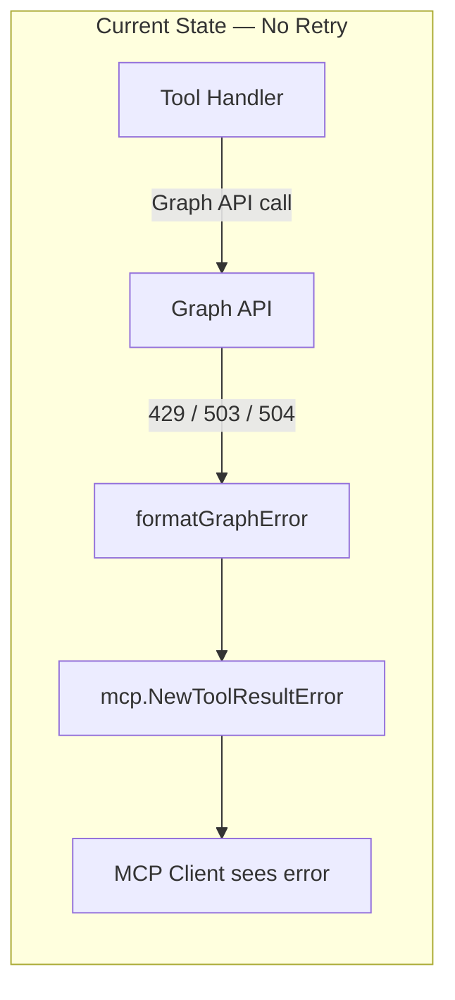
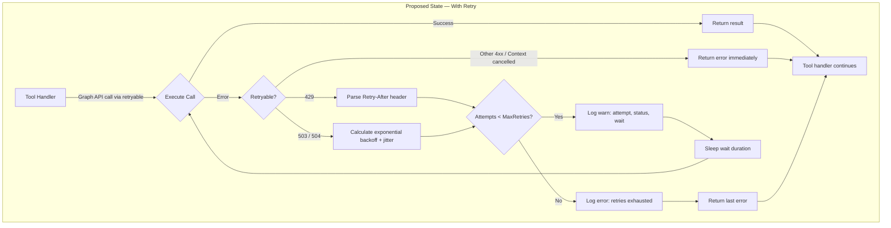
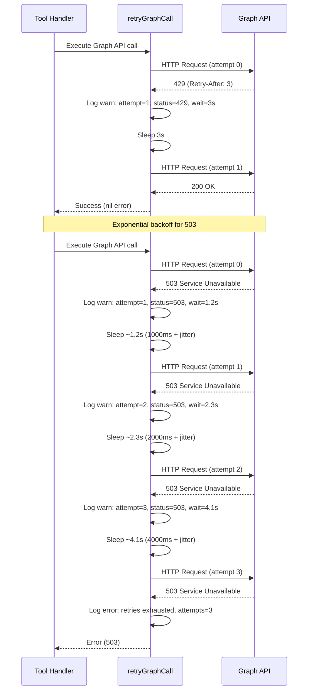
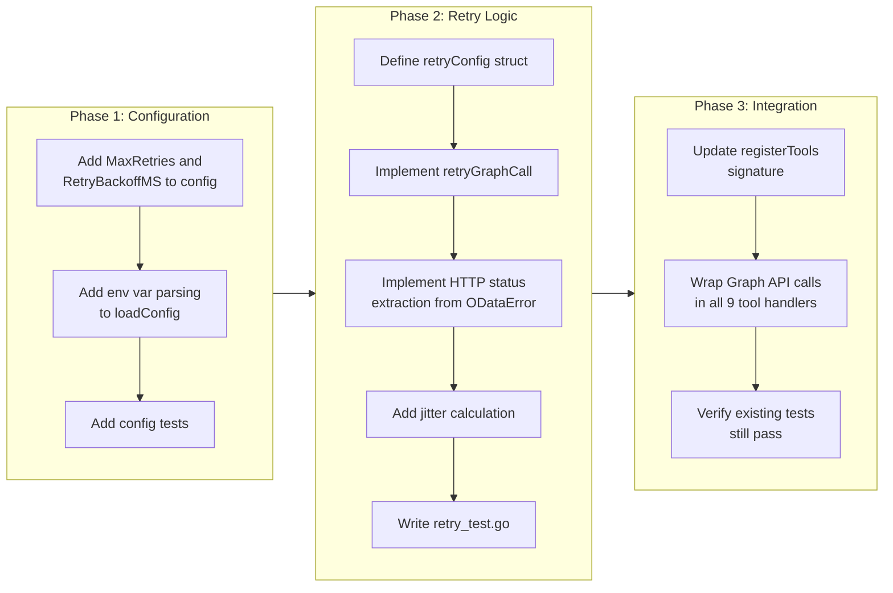

# Graph API Retry & Rate Limiting

## Change Summary

This CR introduces an HTTP-level retry middleware for Microsoft Graph API calls, handling transient failures and rate limiting. The server currently makes Graph API calls without any retry logic; if a request fails due to throttling (HTTP 429), service unavailability (HTTP 503), or gateway timeout (HTTP 504), the error is immediately surfaced to the MCP client. The desired future state is a server that automatically retries transient failures with appropriate backoff strategies — respecting the `Retry-After` header for 429 responses and applying exponential backoff with jitter for 503/504 responses — before surfacing errors, with all retry behavior configurable via environment variables and observable via structured logging.

## Motivation and Background

The Microsoft Graph API enforces per-tenant and per-application rate limits. When a client exceeds these limits, the API returns HTTP 429 (Too Many Requests) with a `Retry-After` header indicating how long the client must wait before retrying. The API can also return HTTP 503 (Service Unavailable) during planned maintenance or transient backend failures, and HTTP 504 (Gateway Timeout) when upstream services are slow. Without retry logic, any of these transient conditions causes an immediate failure visible to the end user through the MCP client, even though the operation would likely succeed after a brief wait. This degrades the user experience for an AI assistant that relies on calendar data being available.

The existing error handling (CR-0005) correctly formats Graph API errors into human-readable messages via `formatGraphError`, but it makes no distinction between permanent failures (4xx client errors) and transient failures (429, 503, 504). CR-0005's specification anticipated retry logic (referenced in its error flow diagram and acceptance criteria AC-8 and AC-9) but the actual implementation deferred it. This CR fulfills that deferred work.

## Change Drivers

* **Reliability:** Microsoft Graph API throttling is expected behavior under normal usage patterns, not an exceptional error. A production-quality client must handle it gracefully.
* **User experience:** Transient failures that auto-resolve after a brief wait should not surface as errors to the AI assistant or end user.
* **CR-0005 completion:** The error handling CR specified retry logic for HTTP 429 and 503 but it was not implemented. This CR closes that gap and extends coverage to HTTP 504.
* **Operational observability:** Retry attempts must be logged so that operators can detect throttling patterns and adjust usage if needed.

## Current State

All nine tool handlers (`list_calendars`, `list_events`, `get_event`, `search_events`, `get_free_busy`, `create_event`, `update_event`, `delete_event`, `cancel_event`) call the Microsoft Graph API via the `msgraph-sdk-go` client without any retry logic. When a transient error occurs, the error is formatted by `formatGraphError` and immediately returned to the MCP client as a tool-level error.

The `config` struct in `main.go` has no fields for retry configuration. The `loadConfig` function does not read any retry-related environment variables.

### Current State Diagram



## Proposed Change

Implement a retry middleware function in a new file `retry.go` that wraps Graph API calls with automatic retry logic. The middleware operates at the application level, wrapping each Graph API call site in tool handlers. The retry function accepts a callable that returns an error, inspects the error for retryable HTTP status codes, and re-executes the callable with appropriate backoff.

### Retry Strategy

| HTTP Status | Strategy | Wait Duration | Max Retries |
|-------------|----------|---------------|-------------|
| 429 Too Many Requests | Respect `Retry-After` header | Header value (seconds) | Configurable (default 3) |
| 503 Service Unavailable | Exponential backoff with jitter | Initial backoff * 2^attempt + jitter | Configurable (default 3) |
| 504 Gateway Timeout | Exponential backoff with jitter | Initial backoff * 2^attempt + jitter | Configurable (default 3) |
| Other 4xx | Not retried | N/A | 0 |
| Other 5xx | Not retried | N/A | 0 |
| Context cancelled | Not retried | N/A | 0 |

### Configuration

Two new environment variables control retry behavior:

| Environment Variable | Config Field | Default Value | Purpose |
|---|---|---|---|
| `OUTLOOK_MCP_MAX_RETRIES` | `MaxRetries` | `3` | Maximum number of retry attempts for transient Graph API failures |
| `OUTLOOK_MCP_RETRY_BACKOFF_MS` | `RetryBackoffMS` | `1000` | Initial backoff duration in milliseconds for exponential backoff |

### Proposed State Diagram



### Retry Sequence Diagram



### Backoff Calculation

For non-429 retries (503, 504), the backoff duration is calculated as:

```
wait = min(initialBackoff * 2^attempt + jitter, 60s)
```

Where:
- `initialBackoff` is `RetryBackoffMS` converted to a `time.Duration`
- `attempt` is the zero-indexed retry attempt number (0 for the first retry)
- `jitter` is a random duration between 0 and `initialBackoff` (to prevent thundering herd)
- The maximum wait for any single retry is capped at 60 seconds

For 429 retries, the `Retry-After` header value is used directly. If the header is missing or unparseable, the exponential backoff formula above is used as a fallback.

## Requirements

### Functional Requirements

1. The system **MUST** implement a `retryGraphCall(ctx context.Context, cfg retryConfig, fn func() error) error` function in `retry.go` that executes `fn`, inspects errors for retryable HTTP status codes, and re-executes `fn` with appropriate backoff.
2. The system **MUST** define a `retryConfig` struct containing `MaxRetries int`, `InitialBackoff time.Duration`, and `Logger *slog.Logger` fields.
3. The system **MUST** retry on HTTP 429 (Too Many Requests) by extracting the `Retry-After` header from the OData error response and waiting the specified number of seconds before retrying.
4. The system **MUST** retry on HTTP 503 (Service Unavailable) using exponential backoff with jitter.
5. The system **MUST** retry on HTTP 504 (Gateway Timeout) using exponential backoff with jitter.
6. The system **MUST NOT** retry on HTTP 4xx errors other than 429 (e.g., 400, 401, 403, 404 are permanent client errors).
7. The system **MUST NOT** retry when the context is cancelled or has expired (`context.Canceled`, `context.DeadlineExceeded`).
8. The system **MUST** respect the `Retry-After` header value (in seconds) when present on 429 responses. If the header is absent or unparseable, it **MUST** fall back to exponential backoff.
9. The system **MUST** apply exponential backoff with jitter for 503 and 504 retries: `wait = min(initialBackoff * 2^attempt + jitter, 60s)` where jitter is random in `[0, initialBackoff)`.
10. The system **MUST** cap the maximum wait for any single retry at 60 seconds.
11. The system **MUST** stop retrying after `MaxRetries` attempts and return the last error.
12. The system **MUST** log each retry attempt at `slog.Warn` level with structured fields: `attempt` (1-indexed), `max_retries`, `status_code`, and `wait` (duration).
13. The system **MUST** log exhausted retries at `slog.Error` level with structured fields: `attempts` (total attempted), `status_code`, and `error`.
14. The system **MUST** add `MaxRetries` (int) and `RetryBackoffMS` (int) fields to the `config` struct in `main.go`.
15. The system **MUST** read `OUTLOOK_MCP_MAX_RETRIES` (default `"3"`) and `OUTLOOK_MCP_RETRY_BACKOFF_MS` (default `"1000"`) environment variables in `loadConfig`.
16. The system **MUST** parse the environment variable string values to integers using `strconv.Atoi`, falling back to defaults on parse failure.
17. The system **MUST** extract the HTTP status code from Graph API errors by inspecting the `*odataerrors.ODataError` type and its embedded `ApiError` response status code.
18. The system **MUST** use `context.WithCancel` or respect the incoming context deadline — if the context is cancelled during a retry wait, the function **MUST** return immediately without performing the next retry.

### Non-Functional Requirements

1. The system **MUST** not introduce any new external dependencies beyond those already declared in `go.mod`.
2. The system **MUST** keep per-invocation total retry duration bounded: the sum of all wait durations for a single call **MUST** not exceed 3 minutes.
3. The system **MUST** use `math/rand` (or `crypto/rand` for jitter seed) to generate jitter values; the jitter **MUST** be non-deterministic across invocations.
4. The retry logic **MUST** be unit-testable in isolation without making real HTTP calls, using injected `func() error` callables that return mock errors.
5. The retry wait **MUST** be interruptible by context cancellation to support graceful shutdown via the signal handler (CR-0004).

## Affected Components

* `main.go` — add `MaxRetries` and `RetryBackoffMS` fields to `config` struct; add env var parsing to `loadConfig`; pass retry config to `registerTools`
* `server.go` — update `registerTools` signature to accept retry configuration and pass it to tool handler constructors
* `retry.go` — new file containing `retryConfig` struct, `retryGraphCall` function, and HTTP status code extraction helpers
* `retry_test.go` — new file with comprehensive unit tests
* `errors.go` — no changes; `formatGraphError` is used by tool handlers after retry exhaustion, not by the retry logic itself
* `tool_*.go` — each tool handler wraps its Graph API call(s) with `retryGraphCall`

## Scope Boundaries

### In Scope

* Implementation of the `retryGraphCall` function with configurable max retries and backoff
* HTTP 429 handling with `Retry-After` header parsing
* HTTP 503 and 504 handling with exponential backoff and jitter
* Configuration fields and environment variable loading for retry parameters
* Structured logging of retry attempts and exhaustion
* Unit tests for all retry paths (success, 429, 503, 504, non-retryable, context cancellation, max retries exhausted)
* Integration of `retryGraphCall` into all nine existing tool handlers

### Out of Scope ("Here, But Not Further")

* Circuit breaker pattern — not needed at current scale; can be added in a future CR if throttling becomes persistent
* Retry at the HTTP transport level via Kiota middleware pipeline — the retry is implemented at the application level for full control over error classification and logging
* Per-tool retry configuration — all tools share the same retry parameters
* Retry for non-Graph-API errors (e.g., JSON serialization failures, page iterator creation failures)
* Rate limiting on the client side (proactive throttling) — only reactive retry on server-side throttling responses
* Retry budget or global concurrency limiting across concurrent tool invocations
* Persistent retry queue or dead-letter mechanism

## Alternative Approaches Considered

* **Kiota built-in retry handler:** The `kiota-http-go` library includes a `RetryHandler` middleware that can be added to the HTTP client pipeline. This was rejected because: (a) it operates at the HTTP transport level below the Graph SDK, making it difficult to log retries with tool-level context (tool name, parameters); (b) the Kiota retry handler has its own configuration surface that would conflict with the application-level configuration model; (c) the `msgraph-sdk-go` client constructor (`NewGraphServiceClientWithCredentials`) builds its own middleware pipeline, and inserting custom middleware requires replacing the default client construction, increasing complexity.
* **Generic HTTP retry library (hashicorp/go-retryablehttp):** Rejected because it would add an external dependency, and the retry logic needed is simple enough to implement in ~60 lines of application code. The project already has zero non-essential dependencies.
* **Retry inside `formatGraphError`:** Rejected because error formatting is a pure function with no side effects; adding retry logic (which sleeps and re-executes) would violate the Single Responsibility Principle and make the function untestable.
* **Decorator pattern wrapping the Graph client:** Rejected because the `*msgraphsdk.GraphServiceClient` type is concrete (not an interface), and wrapping it would require either duplicating the entire client surface or introducing an abstraction layer across all nine tools — excessive for the current scope.

## Impact Assessment

### User Impact

Users will experience fewer transient failures when interacting with calendar operations through the MCP client. Throttled requests and temporary service outages will be transparently retried, with the AI assistant receiving a successful response after the retry rather than an error message. In rare cases where all retries are exhausted, the user receives the same error they would today, so there is no degradation in the failure path.

### Technical Impact

* Two new files added to the project (`retry.go`, `retry_test.go`).
* The `config` struct gains two new fields; `loadConfig` gains two new env var reads with `strconv.Atoi` parsing.
* The `registerTools` function signature changes to accept retry configuration, which is a breaking change to the internal API but has no external impact (all callers are in `package main`).
* All nine tool handler files are modified to wrap their Graph API calls with `retryGraphCall`. The change per file is mechanical: wrapping the existing `graphClient.Me()...` call in a closure passed to `retryGraphCall`.
* No changes to the Graph client construction, authentication flow, or MCP server setup.

### Business Impact

Improved reliability directly translates to a more dependable calendar assistant. Rate limiting is the most common transient failure mode when scaling Graph API usage, and handling it correctly is a prerequisite for any production deployment. This CR removes the single largest reliability gap in the current implementation.

## Implementation Approach

Implementation is divided into three phases executed sequentially.

### Implementation Flow



### Step-by-step Details

**Phase 1: Configuration**

1. Add two new fields to the `config` struct in `main.go`:
   ```go
   MaxRetries     int
   RetryBackoffMS int
   ```
2. Add environment variable reading in `loadConfig` using `strconv.Atoi` with fallback to defaults:
   ```go
   maxRetries, err := strconv.Atoi(getEnv("OUTLOOK_MCP_MAX_RETRIES", "3"))
   if err != nil {
       maxRetries = 3
   }
   retryBackoffMS, err := strconv.Atoi(getEnv("OUTLOOK_MCP_RETRY_BACKOFF_MS", "1000"))
   if err != nil {
       retryBackoffMS = 1000
   }
   ```
3. Add unit tests for the new config fields (default values, custom values, invalid values).

**Phase 2: Retry Logic**

1. Create `retry.go` with the `retryConfig` struct:
   ```go
   type retryConfig struct {
       MaxRetries     int
       InitialBackoff time.Duration
       Logger         *slog.Logger
   }
   ```
2. Implement a helper function `extractHTTPStatus(err error) int` that inspects the error for `*odataerrors.ODataError`, reads the response status code from the embedded `ApiError`, and returns it (or 0 if the error is not an OData error).
3. Implement `retryGraphCall(ctx context.Context, cfg retryConfig, fn func() error) error`:
   - Execute `fn()`.
   - On success (nil error), return nil.
   - On error, extract the HTTP status code.
   - If the status is not 429, 503, or 504, return the error immediately.
   - If the context is cancelled, return the error immediately.
   - If the retry count has reached `MaxRetries`, log at error level and return the error.
   - Calculate the wait duration:
     - For 429: parse the `Retry-After` header from the OData error; fall back to exponential backoff if absent.
     - For 503/504: calculate `min(initialBackoff * 2^attempt + jitter, 60s)`.
   - Log at warn level with attempt, max_retries, status_code, and wait.
   - Wait using `time.NewTimer` with a `select` on the timer and `ctx.Done()`.
   - If the context is cancelled during the wait, return `ctx.Err()`.
   - Retry by re-executing `fn()`.
4. Implement jitter calculation using `math/rand` seeded via `sync.Once` or using the global rand source (Go 1.20+ auto-seeds).
5. Write comprehensive unit tests in `retry_test.go`.

**Phase 3: Integration**

1. Update `registerTools` in `server.go` to accept a `retryConfig` parameter and pass it to each tool handler constructor.
2. Update each of the nine tool handler files to accept `retryConfig` and wrap their Graph API calls. Example for `tool_delete_event.go`:
   ```go
   var deleteErr error
   err = retryGraphCall(ctx, retryCfg, func() error {
       deleteErr = graphClient.Me().Events().ByEventId(eventID).Delete(ctx, nil)
       return deleteErr
   })
   ```
   For tool handlers that return a value from the Graph API call (e.g., `Get` calls), the closure captures the result variable:
   ```go
   var event models.Eventable
   err := retryGraphCall(ctx, retryCfg, func() error {
       var graphErr error
       event, graphErr = graphClient.Me().Events().ByEventId(eventID).Get(ctx, cfg)
       return graphErr
   })
   ```
3. Update `main.go` to construct the `retryConfig` from the loaded config and pass it to `registerTools`.
4. Verify all existing tests pass.

### Extracting HTTP Status from ODataError

The `*odataerrors.ODataError` type embeds `abstractions.ApiError` which provides `ResponseStatusCode` (int). The extraction function:

```go
func extractHTTPStatus(err error) int {
    var odataErr *odataerrors.ODataError
    if errors.As(err, &odataErr) {
        return odataErr.ResponseStatusCode
    }
    return 0
}
```

### Extracting Retry-After from ODataError

The `Retry-After` header value can be accessed through the OData error's response headers. However, the `odataerrors.ODataError` type does not directly expose response headers. As a fallback strategy, the retry logic will:

1. Attempt to extract `Retry-After` from the OData error's `ResponseHeaders` map if available.
2. If the header is not accessible, fall back to exponential backoff for 429 responses (same formula as 503/504).

This ensures correct behavior regardless of SDK version quirks in header propagation.

## Test Strategy

### Tests to Add

| Test File | Test Name | Description | Inputs | Expected Output |
|-----------|-----------|-------------|--------|-----------------|
| `retry_test.go` | `TestRetryGraphCall_Success_NoRetry` | Verifies that a successful call returns immediately without retrying | `fn` returns nil on first call | nil error, `fn` called exactly once |
| `retry_test.go` | `TestRetryGraphCall_429_RetriesAndSucceeds` | Verifies 429 triggers retry and eventual success | `fn` returns 429 error twice, then nil | nil error, `fn` called 3 times |
| `retry_test.go` | `TestRetryGraphCall_503_RetriesAndSucceeds` | Verifies 503 triggers retry with backoff and eventual success | `fn` returns 503 error once, then nil | nil error, `fn` called 2 times |
| `retry_test.go` | `TestRetryGraphCall_504_RetriesAndSucceeds` | Verifies 504 triggers retry with backoff and eventual success | `fn` returns 504 error once, then nil | nil error, `fn` called 2 times |
| `retry_test.go` | `TestRetryGraphCall_429_ExhaustsRetries` | Verifies that max retries is respected for 429 | `fn` always returns 429; MaxRetries=2 | 429 error returned, `fn` called 3 times (1 initial + 2 retries) |
| `retry_test.go` | `TestRetryGraphCall_503_ExhaustsRetries` | Verifies that max retries is respected for 503 | `fn` always returns 503; MaxRetries=2 | 503 error returned, `fn` called 3 times |
| `retry_test.go` | `TestRetryGraphCall_400_NoRetry` | Verifies 400 errors are not retried | `fn` returns 400 error | 400 error returned, `fn` called once |
| `retry_test.go` | `TestRetryGraphCall_401_NoRetry` | Verifies 401 errors are not retried | `fn` returns 401 error | 401 error returned, `fn` called once |
| `retry_test.go` | `TestRetryGraphCall_403_NoRetry` | Verifies 403 errors are not retried | `fn` returns 403 error | 403 error returned, `fn` called once |
| `retry_test.go` | `TestRetryGraphCall_404_NoRetry` | Verifies 404 errors are not retried | `fn` returns 404 error | 404 error returned, `fn` called once |
| `retry_test.go` | `TestRetryGraphCall_NonODataError_NoRetry` | Verifies generic (non-OData) errors are not retried | `fn` returns `errors.New("network error")` | Error returned, `fn` called once |
| `retry_test.go` | `TestRetryGraphCall_ContextCancelled_NoRetry` | Verifies context cancellation stops retries | Cancelled context, `fn` returns 429 | Context error returned, no retry attempted |
| `retry_test.go` | `TestRetryGraphCall_ContextCancelledDuringWait` | Verifies context cancellation during wait aborts | Context cancelled after first 429 while sleeping | Context error returned, `fn` called once |
| `retry_test.go` | `TestRetryGraphCall_MaxRetries_Zero` | Verifies MaxRetries=0 disables retry | `fn` returns 429; MaxRetries=0 | 429 error returned, `fn` called once |
| `retry_test.go` | `TestRetryGraphCall_BackoffIncreases` | Verifies exponential backoff durations increase | `fn` returns 503 three times; record wait durations | Each wait is approximately 2x the previous |
| `retry_test.go` | `TestRetryGraphCall_BackoffCappedAt60s` | Verifies single wait never exceeds 60 seconds | `fn` returns 503; InitialBackoff=30s; MaxRetries=3 | No single wait exceeds 60 seconds |
| `retry_test.go` | `TestExtractHTTPStatus_ODataError` | Verifies status extraction from ODataError | ODataError with ResponseStatusCode=429 | Returns 429 |
| `retry_test.go` | `TestExtractHTTPStatus_NonODataError` | Verifies status extraction returns 0 for non-OData errors | `errors.New("generic")` | Returns 0 |
| `retry_test.go` | `TestExtractHTTPStatus_NilError` | Verifies status extraction handles nil | nil error | Returns 0 |
| `retry_test.go` | `TestRetryGraphCall_LogsWarnOnRetry` | Verifies warn-level log output on each retry attempt | `fn` returns 503 once then nil; capture log output | Log contains warn entry with attempt, max_retries, status_code, wait |
| `retry_test.go` | `TestRetryGraphCall_LogsErrorOnExhaustion` | Verifies error-level log output when retries are exhausted | `fn` always returns 503; MaxRetries=1 | Log contains error entry with attempts and status_code |
| `main_test.go` | `TestLoadConfig_MaxRetries_Default` | Verifies default MaxRetries value | No env var set | MaxRetries=3 |
| `main_test.go` | `TestLoadConfig_MaxRetries_Custom` | Verifies custom MaxRetries from env var | `OUTLOOK_MCP_MAX_RETRIES=5` | MaxRetries=5 |
| `main_test.go` | `TestLoadConfig_MaxRetries_Invalid` | Verifies fallback on invalid env var | `OUTLOOK_MCP_MAX_RETRIES=abc` | MaxRetries=3 |
| `main_test.go` | `TestLoadConfig_RetryBackoffMS_Default` | Verifies default RetryBackoffMS value | No env var set | RetryBackoffMS=1000 |
| `main_test.go` | `TestLoadConfig_RetryBackoffMS_Custom` | Verifies custom RetryBackoffMS from env var | `OUTLOOK_MCP_RETRY_BACKOFF_MS=2000` | RetryBackoffMS=2000 |
| `main_test.go` | `TestLoadConfig_RetryBackoffMS_Invalid` | Verifies fallback on invalid env var | `OUTLOOK_MCP_RETRY_BACKOFF_MS=fast` | RetryBackoffMS=1000 |

### Tests to Modify

| Test File | Test Name | Modification |
|-----------|-----------|--------------|
| `main_test.go` | `TestLoadConfigDefaults` | Add assertions for `MaxRetries=3` and `RetryBackoffMS=1000` default values |
| `main_test.go` | `TestLoadConfigCustomValues` | Add `OUTLOOK_MCP_MAX_RETRIES` and `OUTLOOK_MCP_RETRY_BACKOFF_MS` to custom value assertions |

### Tests to Remove

Not applicable. No existing tests become redundant as a result of this CR.

## Acceptance Criteria

### AC-1: Successful call returns immediately without retry

```gherkin
Given the retry middleware is configured with MaxRetries=3
  And a Graph API call succeeds on the first attempt
When retryGraphCall executes the call
Then the call is made exactly once
  And the result is returned without delay
  And no retry-related log entries are produced
```

### AC-2: HTTP 429 triggers retry with Retry-After header

```gherkin
Given the retry middleware is configured with MaxRetries=3
  And a Graph API call returns HTTP 429 with Retry-After header of 2 seconds
When retryGraphCall processes the response
Then the system waits at least 2 seconds before the next attempt
  And a warn-level log entry is emitted with attempt=1, status_code=429, and wait duration
  And the call is retried
```

### AC-3: HTTP 429 without Retry-After falls back to exponential backoff

```gherkin
Given the retry middleware is configured with MaxRetries=3 and InitialBackoff=1s
  And a Graph API call returns HTTP 429 without a Retry-After header
When retryGraphCall processes the response
Then the system uses exponential backoff with jitter for the wait duration
  And the call is retried
```

### AC-4: HTTP 503 triggers retry with exponential backoff

```gherkin
Given the retry middleware is configured with MaxRetries=3 and InitialBackoff=1s
  And a Graph API call returns HTTP 503 Service Unavailable
When retryGraphCall processes the response
Then the system waits approximately 1s (plus jitter) before the first retry
  And approximately 2s (plus jitter) before the second retry
  And approximately 4s (plus jitter) before the third retry
  And each retry attempt produces a warn-level log entry
```

### AC-5: HTTP 504 triggers retry with exponential backoff

```gherkin
Given the retry middleware is configured with MaxRetries=3 and InitialBackoff=1s
  And a Graph API call returns HTTP 504 Gateway Timeout
When retryGraphCall processes the response
Then the system retries with exponential backoff identical to HTTP 503 behavior
```

### AC-6: Non-retryable 4xx errors are not retried

```gherkin
Given the retry middleware is configured with MaxRetries=3
  And a Graph API call returns HTTP 400 Bad Request
When retryGraphCall processes the response
Then the error is returned immediately without retrying
  And the call is made exactly once
  And no retry-related log entries are produced
```

### AC-7: Context cancellation prevents retry

```gherkin
Given the retry middleware is configured with MaxRetries=3
  And the context has been cancelled
  And a Graph API call returns HTTP 429
When retryGraphCall processes the response
Then the function returns immediately with the context error
  And no retry is attempted
```

### AC-8: Context cancellation during wait aborts retry

```gherkin
Given the retry middleware is configured with MaxRetries=3
  And a Graph API call returns HTTP 429 with Retry-After of 30 seconds
  And the context is cancelled 1 second into the wait
When retryGraphCall is waiting for the retry
Then the function returns immediately with ctx.Err()
  And the remaining 29 seconds of wait are abandoned
```

### AC-9: Maximum retries are respected

```gherkin
Given the retry middleware is configured with MaxRetries=2
  And a Graph API call always returns HTTP 503
When retryGraphCall processes the responses
Then the call is made exactly 3 times (1 initial + 2 retries)
  And an error-level log entry is emitted with attempts=2 and status_code=503
  And the last HTTP 503 error is returned
```

### AC-10: MaxRetries=0 disables retry

```gherkin
Given the retry middleware is configured with MaxRetries=0
  And a Graph API call returns HTTP 429
When retryGraphCall processes the response
Then the error is returned immediately without retrying
  And the call is made exactly once
```

### AC-11: Backoff wait is capped at 60 seconds

```gherkin
Given the retry middleware is configured with InitialBackoff=30s and MaxRetries=3
  And a Graph API call returns HTTP 503 on every attempt
When retryGraphCall calculates the backoff for attempt 2
Then the calculated wait (30s * 2^2 = 120s) is capped at 60 seconds
  And the actual wait does not exceed 60 seconds plus jitter
```

### AC-12: Configuration via environment variables

```gherkin
Given OUTLOOK_MCP_MAX_RETRIES is set to "5"
  And OUTLOOK_MCP_RETRY_BACKOFF_MS is set to "2000"
When loadConfig() is called
Then cfg.MaxRetries equals 5
  And cfg.RetryBackoffMS equals 2000
```

### AC-13: Invalid configuration falls back to defaults

```gherkin
Given OUTLOOK_MCP_MAX_RETRIES is set to "not-a-number"
  And OUTLOOK_MCP_RETRY_BACKOFF_MS is set to "also-invalid"
When loadConfig() is called
Then cfg.MaxRetries equals 3
  And cfg.RetryBackoffMS equals 1000
```

### AC-14: All tool handlers use retry middleware

```gherkin
Given the retry middleware is integrated into the server
When any of the nine MCP tools (list_calendars, list_events, get_event, search_events, get_free_busy, create_event, update_event, delete_event, cancel_event) makes a Graph API call
Then the call is wrapped in retryGraphCall with the server's retry configuration
```

## Quality Standards Compliance

### Build & Compilation

- [ ] Code compiles/builds without errors
- [ ] No new compiler warnings introduced

### Linting & Code Style

- [ ] All linter checks pass with zero warnings/errors
- [ ] Code follows project coding conventions and style guides
- [ ] Any linter exceptions are documented with justification

### Test Execution

- [ ] All existing tests pass after implementation
- [ ] All new tests pass
- [ ] Test coverage meets project requirements for changed code

### Documentation

- [ ] Inline code documentation updated where applicable
- [ ] API documentation updated for any API changes
- [ ] User-facing documentation updated if behavior changes

### Code Review

- [ ] Changes submitted via pull request
- [ ] PR title follows Conventional Commits format
- [ ] Code review completed and approved
- [ ] Changes squash-merged to maintain linear history

### Verification Commands

```bash
# Build verification
go build ./...

# Lint verification
golangci-lint run

# Test execution
go test ./... -v

# Test coverage
go test ./... -coverprofile=coverage.out
go tool cover -func=coverage.out
```

## Risks and Mitigation

### Risk 1: Retry-After header not accessible through ODataError

**Likelihood:** medium
**Impact:** low
**Mitigation:** The `Retry-After` header may not be propagated through the `odataerrors.ODataError` type depending on the SDK version. The implementation **MUST** include a fallback to exponential backoff when the header is not accessible. This ensures correct behavior even if the header extraction path changes across SDK versions. A unit test specifically validates the fallback behavior.

### Risk 2: Retry delays cause MCP client timeout

**Likelihood:** medium
**Impact:** medium
**Mitigation:** The maximum per-retry wait is capped at 60 seconds, and the total retry duration is bounded by MaxRetries (default 3) multiplied by the maximum wait. With default settings, the worst case is approximately 3 retries * 60s = 180s (3 minutes). MCP clients typically have longer timeouts. Additionally, the retry respects context cancellation, so if the MCP framework cancels the context, the retry aborts immediately.

### Risk 3: Jitter implementation produces predictable values

**Likelihood:** low
**Impact:** low
**Mitigation:** Go 1.20+ automatically seeds the global `math/rand` source with a cryptographically random seed. Since the project uses Go 1.24, `math/rand.IntN` produces non-deterministic values without explicit seeding. A unit test verifies that jitter values differ across invocations.

### Risk 4: Mechanical integration into tool handlers introduces bugs

**Likelihood:** low
**Impact:** medium
**Mitigation:** The integration change per tool handler is mechanical and follows a single pattern (wrapping the Graph API call in a closure). Each tool handler already has existing unit tests that validate the end-to-end flow. The retry wrapper is transparent to successful calls (returns nil immediately), so existing tests continue to pass without modification. New tests specifically cover the retry paths.

### Risk 5: Retry masks persistent API failures during development

**Likelihood:** low
**Impact:** low
**Mitigation:** Every retry attempt is logged at warn level with full context (status code, attempt number, wait duration). Exhausted retries are logged at error level. This ensures persistent failures are visible in the log stream. Additionally, non-retryable errors (all 4xx except 429) are never retried, preventing masking of permission, authentication, or request format issues.

## Dependencies

* **CR-0001 (Configuration):** Required for the `config` struct, `getEnv`, and `loadConfig` function that this CR extends.
* **CR-0002 (Logging):** Required for `slog` structured logging used in retry log entries.
* **CR-0004 (Graph Client & MCP Server):** Required for the `registerTools` function and tool handler registration pattern.
* **CR-0005 (Error Handling):** Required for `formatGraphError` used by tool handlers after retry exhaustion, and for the `*odataerrors.ODataError` type used by `extractHTTPStatus`.
* **CR-0006 through CR-0009 (Tool Handlers):** These CRs define the nine tool handlers that this CR modifies to integrate retry logic. All must be implemented before this CR.

## Estimated Effort

| Component | Estimate |
|-----------|----------|
| Configuration: add fields to `config`, update `loadConfig` | 0.5 hours |
| Configuration: unit tests for new config fields | 0.5 hours |
| `retry.go`: `retryConfig` struct, `extractHTTPStatus`, `retryGraphCall` | 2 hours |
| `retry_test.go`: unit tests for all retry paths | 3 hours |
| Integration: update `registerTools` and all 9 tool handlers | 2 hours |
| Verification: build, lint, test, existing test regression | 1 hour |
| **Total** | **9 hours** |

## Decision Outcome

Chosen approach: "Application-level retry wrapper function (`retryGraphCall`) in a dedicated `retry.go` file", because it provides full control over error classification, structured logging with tool-level context, and clean testability via injected callables — without requiring modifications to the Graph SDK's HTTP client pipeline or introducing additional dependencies. The approach is consistent with the architecture established in CR-0005 (application-level error handling) and the project's single-binary, small-isolated-files design principle.

## Related Items

* CR-0005 (Error Handling) — defined the error flow diagram and acceptance criteria (AC-8, AC-9) that anticipated retry logic; this CR implements the deferred work
* CR-0001 (Configuration) — extended with retry configuration fields
* CR-0004 (Server Bootstrap) — `registerTools` signature updated to pass retry config
* CR-0006 through CR-0009 (Tool Handlers) — all nine handlers modified to use `retryGraphCall`
* Microsoft Graph API throttling documentation: https://learn.microsoft.com/en-us/graph/throttling
* Microsoft Graph API best practices for retry: https://learn.microsoft.com/en-us/graph/best-practices-concept#handling-expected-errors
