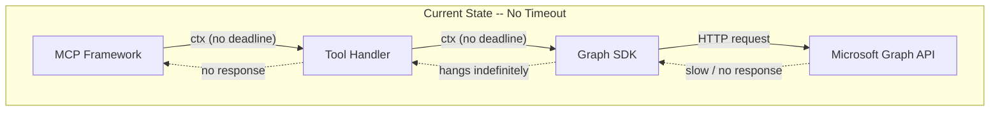
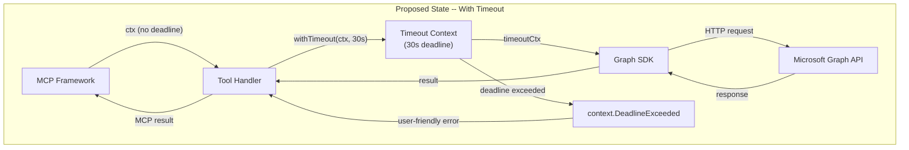
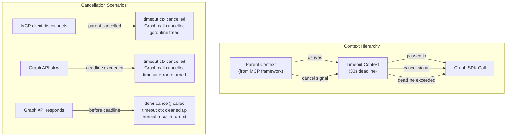
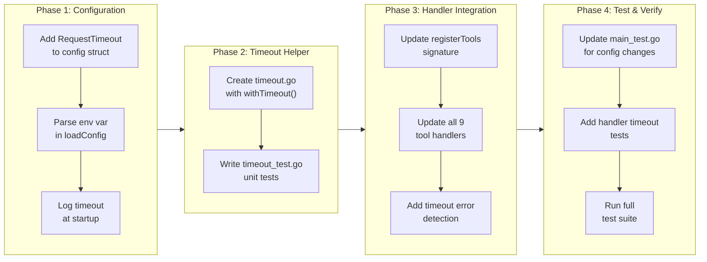

# Request Timeout Management

## Change Summary

This CR introduces per-request timeout management for all Graph API calls in the Outlook Calendar MCP Server. Currently, all nine tool handlers pass the incoming `context.Context` directly to the Graph SDK without applying any deadline, meaning a Graph API call can hang indefinitely if the network is degraded or Microsoft services are slow. The proposed change adds a configurable timeout (default: 30 seconds) loaded from the `OUTLOOK_MCP_REQUEST_TIMEOUT_SECONDS` environment variable, a new `withTimeout` helper function in `timeout.go`, and integration of that helper into every tool handler's Graph API call path. When a timeout fires, the server returns a user-friendly MCP tool error and logs the event at error level with full context.

## Motivation and Background

The MCP server uses a stdio transport, meaning it runs as a long-lived subprocess of the MCP host (e.g., Claude Desktop). If a Graph API call hangs indefinitely due to network issues, DNS failures, or Microsoft service degradation, the entire tool invocation blocks without any feedback to the user. The MCP host has no visibility into why the tool is unresponsive, and the user receives no error or status update. In extreme cases, the hanging request can exhaust the MCP host's patience and lead to a forced kill of the server process, losing all in-flight state.

Go's `context.Context` is the idiomatic mechanism for enforcing request deadlines and propagating cancellation. The MCP framework provides a context to each tool handler, but without an explicit deadline that context will never expire on its own. By wrapping each Graph API call with a timeout-scoped context derived from the parent, the server gains bounded execution time, proper cancellation propagation, and the ability to return a meaningful error when the Graph API is unreachable.

## Change Drivers

* **Reliability:** Unbounded Graph API calls can hang indefinitely, making the MCP server unresponsive to the host and user.
* **User experience:** A clear "request timed out after 30s" error is far more actionable than an indefinite hang with no feedback.
* **Resource safety:** Without timeouts, goroutines servicing Graph API calls may accumulate during network outages, consuming memory and file descriptors.
* **Operational observability:** Timeout events logged at error level provide signal for diagnosing connectivity or service degradation issues.
* **Defense in depth:** Even if the Graph SDK or HTTP transport has its own internal timeouts, an application-level timeout provides a guaranteed upper bound that the server controls.

## Current State

All nine tool handlers (`list_calendars`, `list_events`, `get_event`, `search_events`, `get_free_busy`, `create_event`, `update_event`, `delete_event`, `cancel_event`) accept a `context.Context` from the MCP framework and pass it directly to Graph SDK methods. No timeout or deadline is applied to the context before making Graph API calls. The `config` struct in `main.go` has seven fields, none related to timeouts. There is no `timeout.go` file.

### Current State Diagram



## Proposed Change

Add a configurable request timeout that wraps every Graph API call in a deadline-scoped context. The implementation consists of three changes:

1. **Configuration:** Add `OUTLOOK_MCP_REQUEST_TIMEOUT_SECONDS` environment variable (default: `30`) and a `RequestTimeout time.Duration` field to the `config` struct. The string value is parsed to an integer and converted to `time.Duration` in `loadConfig`.

2. **Timeout helper:** Create `timeout.go` with a `withTimeout(ctx context.Context, timeout time.Duration) (context.Context, context.CancelFunc)` function that derives a child context with the specified deadline. The child context inherits all values and cancellation signals from the parent, ensuring that if the MCP client disconnects (parent context cancelled), the Graph API call is also cancelled.

3. **Handler integration:** Each tool handler calls `withTimeout` before its Graph API call(s), defers the cancel function, and checks for `context.DeadlineExceeded` in the error path to return a user-friendly timeout message.

### Proposed State Diagram



### Cancellation Propagation Diagram



## Requirements

### Functional Requirements

1. The system **MUST** read the `OUTLOOK_MCP_REQUEST_TIMEOUT_SECONDS` environment variable and parse it as a positive integer representing seconds.
2. The system **MUST** default to `30` seconds when `OUTLOOK_MCP_REQUEST_TIMEOUT_SECONDS` is unset, empty, or contains an invalid (non-numeric or non-positive) value.
3. The system **MUST** add a `RequestTimeout time.Duration` field to the `config` struct, populated by `loadConfig` after converting the parsed integer to a `time.Duration` via `time.Duration(n) * time.Second`.
4. The system **MUST** implement a `withTimeout(ctx context.Context, timeout time.Duration) (context.Context, context.CancelFunc)` function in a new file `timeout.go` that calls `context.WithTimeout(ctx, timeout)` and returns the derived context and cancel function.
5. The system **MUST** ensure the timeout context is a child of the parent context, so that cancellation of the parent (e.g., MCP client disconnect) propagates to the Graph API call.
6. Each of the nine tool handlers **MUST** call `withTimeout` with the configured timeout duration before making any Graph API call, and **MUST** `defer cancel()` immediately after obtaining the cancel function.
7. When a Graph API call returns an error and `errors.Is(err, context.DeadlineExceeded)` is true, the tool handler **MUST** return `mcp.NewToolResultError` with the message `"request timed out after Xs"` where `X` is the configured timeout in seconds.
8. When a timeout occurs, the tool handler **MUST** log at error level via `slog.Error` with structured fields: `tool` (the tool name), `timeout_seconds` (the configured timeout), and `error` (the original error string).
9. The system **MUST NOT** leak goroutines on timeout -- the `defer cancel()` call ensures the timeout context's resources are released regardless of whether the Graph API call completes, times out, or the parent context is cancelled.
10. The system **MUST** propagate cancellation from the parent context: if the parent context is cancelled before the timeout fires, the Graph API call **MUST** be cancelled and the handler **MUST** return an appropriate error.
11. The system **MUST** pass the `RequestTimeout` duration from the config to `registerTools` (or make it accessible to tool handlers) so that each handler can use the configured value.
12. The timeout error message format **MUST** be `"request timed out after Xs"` where `X` is an integer (not a floating-point duration string), matching the configured seconds value.

### Non-Functional Requirements

1. The system **MUST** not introduce any new external dependencies -- `context.WithTimeout` is part of the Go standard library.
2. The `withTimeout` function **MUST** have zero allocations beyond the context and cancel function created by `context.WithTimeout`.
3. The system **MUST** not alter the behavior of Graph API calls that complete within the timeout -- existing tool response formats, error handling, and logging **MUST** remain unchanged for non-timeout scenarios.
4. The timeout configuration **MUST** be validated at startup: if the parsed value is zero or negative, the system **MUST** fall back to the 30-second default and log a warning.
5. The system **MUST** log the configured timeout value at startup (info level) so operators can verify the active configuration.

## Affected Components

* `main.go` -- Add `RequestTimeout time.Duration` field to `config` struct; add `OUTLOOK_MCP_REQUEST_TIMEOUT_SECONDS` parsing to `loadConfig`; pass timeout to `registerTools` or make accessible to handlers; log timeout at startup.
* `timeout.go` (new) -- `withTimeout` helper function.
* `timeout_test.go` (new) -- Unit tests for `withTimeout` and config parsing.
* `server.go` -- Update `registerTools` signature to accept timeout duration and pass it to tool handler constructors.
* `tool_list_calendars.go` -- Wrap Graph API call with `withTimeout`; add timeout error handling.
* `tool_list_events.go` -- Wrap Graph API call with `withTimeout`; add timeout error handling.
* `tool_get_event.go` -- Wrap Graph API call with `withTimeout`; add timeout error handling.
* `tool_search_events.go` -- Wrap Graph API call with `withTimeout`; add timeout error handling.
* `tool_get_free_busy.go` -- Wrap Graph API call with `withTimeout`; add timeout error handling.
* `tool_create_event.go` -- Wrap Graph API call with `withTimeout`; add timeout error handling.
* `tool_update_event.go` -- Wrap Graph API call with `withTimeout`; add timeout error handling.
* `tool_delete_event.go` -- Wrap Graph API call with `withTimeout`; add timeout error handling.
* `tool_cancel_event.go` -- Wrap Graph API call with `withTimeout`; add timeout error handling.
* `main_test.go` -- Add tests for new config field and env var parsing.

## Scope Boundaries

### In Scope

* `OUTLOOK_MCP_REQUEST_TIMEOUT_SECONDS` environment variable and config parsing
* `RequestTimeout` field on the `config` struct
* `withTimeout` helper function in `timeout.go`
* Integration of `withTimeout` into all nine tool handlers
* Timeout-specific error detection (`context.DeadlineExceeded`) and user-friendly error messages
* Timeout event logging at error level with structured fields
* Unit tests for the `withTimeout` function, config parsing, and timeout error paths in handlers
* Startup logging of the configured timeout value

### Out of Scope ("Here, But Not Further")

* Per-tool timeout configuration (all tools share the same timeout value)
* Retry logic for timed-out requests (retries are addressed in CR-0005; a timeout is a final outcome, not a retryable condition)
* HTTP transport-level timeout configuration on the Graph SDK's underlying HTTP client
* MCP protocol-level timeouts or keepalive mechanisms (controlled by the MCP host, not the server)
* Circuit breaker or bulkhead patterns for Graph API calls
* Timeout configuration via a config file (all configuration is via environment variables per CR-0001)

## Alternative Approaches Considered

### Alternative 1: HTTP client-level timeout on the Graph SDK transport

Configure a `net/http.Client` with a `Timeout` field and inject it into the Graph SDK's request adapter. This would apply a timeout at the HTTP layer rather than the application layer.

**Rejected because:** The Graph SDK manages its own HTTP client and request adapter construction. Injecting a custom HTTP client requires overriding internal SDK behavior, is fragile across SDK version upgrades, and does not integrate with Go's context cancellation model. Application-level `context.WithTimeout` is idiomatic Go, composable with parent context cancellation, and independent of the HTTP transport implementation.

### Alternative 2: Global context with deadline for all tool calls

Create a single context with a deadline at server startup and pass it to all tool handlers.

**Rejected because:** A global context with a fixed deadline would expire at an absolute time, not relative to each request. Tool calls are independent requests that should each have their own timeout measured from invocation. Per-request `context.WithTimeout` correctly scopes the deadline to each individual Graph API call.

### Alternative 3: No application-level timeout (rely on Graph SDK defaults)

Trust the Graph SDK and underlying HTTP transport to enforce their own timeouts.

**Rejected because:** The Graph SDK for Go does not set a default request timeout on its HTTP client. The default `net/http.Client` has no timeout (`Timeout` field is zero, meaning no timeout). Without an explicit application-level timeout, Graph API calls can hang indefinitely, which is unacceptable for a long-lived MCP server subprocess.

## Impact Assessment

### User Impact

Users will experience bounded response times for all calendar operations. Instead of an indefinite hang when the Graph API is slow or unreachable, users receive a clear "request timed out after 30s" error message within a predictable time window. The default 30-second timeout is generous enough to accommodate legitimate slow responses (e.g., large calendar views across many pages) while preventing indefinite hangs. Users who need a different timeout can set `OUTLOOK_MCP_REQUEST_TIMEOUT_SECONDS` to any positive integer.

### Technical Impact

* All nine tool handlers gain a consistent timeout boundary around their Graph API calls.
* The `config` struct grows by one field (`RequestTimeout`), and `loadConfig` gains one additional environment variable parse.
* The `registerTools` function signature changes to accept the timeout duration, which is a breaking change to the function's interface but not to any external API.
* The `withTimeout` helper is a thin wrapper around `context.WithTimeout` with no complex logic.
* Existing tests that do not involve timeouts continue to pass unchanged, as the timeout only affects the context passed to Graph API calls.
* No new external dependencies are introduced.

### Business Impact

Request timeout management is a reliability requirement for production readiness. Without bounded execution time, the MCP server cannot provide predictable quality of service. This change is a prerequisite for any SLA commitment around response times and is essential for operator confidence in deploying the server in production environments.

## Implementation Approach

### Implementation Flow



### Step-by-step details

**Phase 1: Configuration**

1. Add `RequestTimeout time.Duration` field to the `config` struct in `main.go` with a Go doc comment explaining its purpose, source environment variable, and default value.
2. In `loadConfig`, read `OUTLOOK_MCP_REQUEST_TIMEOUT_SECONDS` via `getEnv` with default `"30"`, parse it with `strconv.Atoi`, validate it is positive, convert to `time.Duration(n) * time.Second`, and assign to `cfg.RequestTimeout`. If parsing fails or the value is non-positive, default to `30 * time.Second` and log a warning.
3. In `main()`, log the configured timeout at info level: `slog.Info("request timeout configured", "timeout_seconds", int(cfg.RequestTimeout.Seconds()))`.

**Phase 2: Timeout Helper**

4. Create `timeout.go` containing:
   - Package-level doc comment explaining the file's purpose.
   - `withTimeout(ctx context.Context, timeout time.Duration) (context.Context, context.CancelFunc)` that calls `context.WithTimeout(ctx, timeout)` and returns the result.
   - `isTimeoutError(err error) bool` that returns `errors.Is(err, context.DeadlineExceeded)`.
   - `timeoutErrorMessage(timeoutSeconds int) string` that returns `fmt.Sprintf("request timed out after %ds", timeoutSeconds)`.
5. Create `timeout_test.go` with tests for `withTimeout`, `isTimeoutError`, and `timeoutErrorMessage`.

**Phase 3: Handler Integration**

6. Update `registerTools` in `server.go` to accept a `timeout time.Duration` parameter and pass it to each tool handler constructor. Update the call site in `main()`.
7. Update each of the nine tool handler constructors to accept `timeout time.Duration` as an additional parameter (alongside `graphClient`).
8. In each tool handler's closure, immediately before the Graph API call:
   ```go
   timeoutCtx, cancel := withTimeout(ctx, timeout)
   defer cancel()
   ```
   Then use `timeoutCtx` instead of `ctx` for the Graph API call.
9. In each tool handler's error path, add a check before the existing `formatGraphError` call:
   ```go
   if isTimeoutError(err) {
       logger.ErrorContext(ctx, "request timed out",
           "timeout_seconds", int(timeout.Seconds()),
           "error", err.Error())
       return mcp.NewToolResultError(timeoutErrorMessage(int(timeout.Seconds()))), nil
   }
   ```

**Phase 4: Test & Verify**

10. Update `main_test.go`: add tests for `RequestTimeout` in `TestLoadConfigDefaults` (expect `30s`) and `TestLoadConfigCustomValues` (set env var to a custom value). Add `OUTLOOK_MCP_REQUEST_TIMEOUT_SECONDS` to `clearOutlookEnvVars`.
11. Add handler-level timeout tests using a context that is already expired (`context.WithTimeout(ctx, 0)`) to verify timeout error messages are returned correctly.
12. Run `go build ./... && golangci-lint run && go test ./...` to verify all quality checks pass.

## Test Strategy

### Tests to Add

| Test File | Test Name | Description | Inputs | Expected Output |
|-----------|-----------|-------------|--------|-----------------|
| `timeout_test.go` | `TestWithTimeout_DerivesChildContext` | Verifies `withTimeout` returns a context with the specified deadline | `context.Background()`, `5 * time.Second` | Returned context has deadline approximately 5s from now |
| `timeout_test.go` | `TestWithTimeout_ParentCancellation` | Verifies child context is cancelled when parent is cancelled | Parent context cancelled via `cancel()` | Child context's `Done()` channel is closed |
| `timeout_test.go` | `TestWithTimeout_DeadlineExpires` | Verifies context expires after the specified duration | `context.Background()`, `1 * time.Millisecond`, sleep 10ms | Context `Err()` returns `context.DeadlineExceeded` |
| `timeout_test.go` | `TestWithTimeout_CancelFreesResources` | Verifies calling cancel before deadline does not leak | `context.Background()`, `1 * time.Hour`, immediate `cancel()` | Context `Err()` returns `context.Canceled`, no goroutine leak |
| `timeout_test.go` | `TestIsTimeoutError_DeadlineExceeded` | Verifies `isTimeoutError` returns true for `context.DeadlineExceeded` | `context.DeadlineExceeded` | `true` |
| `timeout_test.go` | `TestIsTimeoutError_WrappedDeadlineExceeded` | Verifies `isTimeoutError` returns true for wrapped deadline error | `fmt.Errorf("graph: %w", context.DeadlineExceeded)` | `true` |
| `timeout_test.go` | `TestIsTimeoutError_OtherError` | Verifies `isTimeoutError` returns false for non-timeout errors | `errors.New("network error")` | `false` |
| `timeout_test.go` | `TestIsTimeoutError_ContextCanceled` | Verifies `isTimeoutError` returns false for `context.Canceled` | `context.Canceled` | `false` |
| `timeout_test.go` | `TestIsTimeoutError_Nil` | Verifies `isTimeoutError` returns false for nil | `nil` | `false` |
| `timeout_test.go` | `TestTimeoutErrorMessage` | Verifies message format | `30` | `"request timed out after 30s"` |
| `timeout_test.go` | `TestTimeoutErrorMessage_CustomValue` | Verifies message with custom timeout | `60` | `"request timed out after 60s"` |
| `main_test.go` | `TestLoadConfigDefaults_RequestTimeout` | Verifies default timeout is 30s | No env var set | `cfg.RequestTimeout == 30 * time.Second` |
| `main_test.go` | `TestLoadConfigCustomTimeout` | Verifies custom timeout from env var | `OUTLOOK_MCP_REQUEST_TIMEOUT_SECONDS=60` | `cfg.RequestTimeout == 60 * time.Second` |
| `main_test.go` | `TestLoadConfigInvalidTimeout` | Verifies fallback on invalid value | `OUTLOOK_MCP_REQUEST_TIMEOUT_SECONDS=abc` | `cfg.RequestTimeout == 30 * time.Second` |
| `main_test.go` | `TestLoadConfigZeroTimeout` | Verifies fallback on zero value | `OUTLOOK_MCP_REQUEST_TIMEOUT_SECONDS=0` | `cfg.RequestTimeout == 30 * time.Second` |
| `main_test.go` | `TestLoadConfigNegativeTimeout` | Verifies fallback on negative value | `OUTLOOK_MCP_REQUEST_TIMEOUT_SECONDS=-5` | `cfg.RequestTimeout == 30 * time.Second` |
| `tool_delete_event_test.go` | `TestDeleteEvent_Timeout` | Verifies timeout error when Graph API call exceeds deadline | Expired context, mock Graph client | MCP tool error with `"request timed out after 30s"` |
| `tool_cancel_event_test.go` | `TestCancelEvent_Timeout` | Verifies timeout error when Graph API call exceeds deadline | Expired context, mock Graph client | MCP tool error with `"request timed out after 30s"` |

### Tests to Modify

| Test File | Test Name | Modification |
|-----------|-----------|--------------|
| `main_test.go` | `TestLoadConfigDefaults` | Add assertion for `cfg.RequestTimeout == 30 * time.Second` |
| `main_test.go` | `TestLoadConfigCustomValues` | Add `OUTLOOK_MCP_REQUEST_TIMEOUT_SECONDS=45` and assert `cfg.RequestTimeout == 45 * time.Second` |
| `main_test.go` | `clearOutlookEnvVars` | Add `"OUTLOOK_MCP_REQUEST_TIMEOUT_SECONDS"` to the list of variables to clear |
| `server_test.go` | Any tests calling `registerTools` | Update call sites to include the new `timeout` parameter |

### Tests to Remove

Not applicable. No existing tests become redundant as a result of this CR.

## Acceptance Criteria

### AC-1: Default timeout configuration

```gherkin
Given no OUTLOOK_MCP_REQUEST_TIMEOUT_SECONDS environment variable is set
When loadConfig is called
Then cfg.RequestTimeout MUST be 30 * time.Second
```

### AC-2: Custom timeout configuration

```gherkin
Given OUTLOOK_MCP_REQUEST_TIMEOUT_SECONDS is set to "60"
When loadConfig is called
Then cfg.RequestTimeout MUST be 60 * time.Second
```

### AC-3: Invalid timeout falls back to default

```gherkin
Given OUTLOOK_MCP_REQUEST_TIMEOUT_SECONDS is set to "abc"
When loadConfig is called
Then cfg.RequestTimeout MUST be 30 * time.Second
  And a warning MUST be logged indicating the invalid value and the default being used
```

### AC-4: Non-positive timeout falls back to default

```gherkin
Given OUTLOOK_MCP_REQUEST_TIMEOUT_SECONDS is set to "0" or "-5"
When loadConfig is called
Then cfg.RequestTimeout MUST be 30 * time.Second
  And a warning MUST be logged indicating the invalid value and the default being used
```

### AC-5: Timeout context derives from parent

```gherkin
Given a parent context from the MCP framework
When withTimeout is called with that parent and a 30-second timeout
Then the returned context MUST be a child of the parent context
  And cancelling the parent MUST cancel the child
  And the child MUST have a deadline 30 seconds from now
```

### AC-6: Graph API call uses timeout context

```gherkin
Given a tool handler receives a request
When the handler makes a Graph API call
Then the call MUST use a context derived from withTimeout
  And defer cancel() MUST be called immediately after obtaining the cancel function
```

### AC-7: Timeout produces user-friendly error

```gherkin
Given a tool handler's Graph API call exceeds the configured timeout
When the handler processes the error
Then the handler MUST detect context.DeadlineExceeded via isTimeoutError
  And the handler MUST return mcp.NewToolResultError with message "request timed out after 30s"
  And the error return value MUST be nil
```

### AC-8: Timeout event logging

```gherkin
Given a tool handler's Graph API call times out
When the handler processes the timeout
Then the handler MUST log at error level via slog.Error
  And the log entry MUST include the "tool" field with the tool name
  And the log entry MUST include the "timeout_seconds" field with the configured timeout
  And the log entry MUST include the "error" field with the original error string
```

### AC-9: No goroutine leak on timeout

```gherkin
Given a Graph API call is in progress
When the timeout fires and the handler returns a timeout error
Then the defer cancel() call MUST release the timeout context's resources
  And no goroutines associated with the timeout context MUST remain running
```

### AC-10: Parent cancellation propagates

```gherkin
Given a tool handler has created a timeout context from the parent
When the MCP client disconnects and the parent context is cancelled
Then the timeout context MUST be cancelled
  And the Graph API call MUST receive the cancellation signal
  And the handler MUST return an appropriate error
```

### AC-11: Non-timeout behavior unchanged

```gherkin
Given a Graph API call completes successfully within the timeout
When the handler processes the response
Then the response format, content, and logging MUST be identical to the pre-CR-0011 behavior
  And the defer cancel() MUST clean up the timeout context after the handler returns
```

### AC-12: Startup timeout logging

```gherkin
Given the server starts with a configured timeout
When the main function logs the startup configuration
Then a log entry at info level MUST include the configured timeout in seconds
```

## Quality Standards Compliance

### Build & Compilation

- [ ] Code compiles/builds without errors
- [ ] No new compiler warnings introduced

### Linting & Code Style

- [ ] All linter checks pass with zero warnings/errors
- [ ] Code follows project coding conventions and style guides
- [ ] Any linter exceptions are documented with justification

### Test Execution

- [ ] All existing tests pass after implementation
- [ ] All new tests pass
- [ ] Test coverage meets project requirements for changed code

### Documentation

- [ ] Inline code documentation updated where applicable
- [ ] API documentation updated for any API changes
- [ ] User-facing documentation updated if behavior changes

### Code Review

- [ ] Changes submitted via pull request
- [ ] PR title follows Conventional Commits format
- [ ] Code review completed and approved
- [ ] Changes squash-merged to maintain linear history

### Verification Commands

```bash
# Build verification
go build ./...

# Lint verification
golangci-lint run

# Test execution
go test ./... -v

# Test coverage
go test ./... -coverprofile=coverage.out
go tool cover -func=coverage.out
```

## Risks and Mitigation

### Risk 1: Timeout too short for legitimate large calendar operations

**Likelihood:** medium
**Impact:** medium
**Mitigation:** The default of 30 seconds is generous for individual Graph API calls, which typically complete in 1-3 seconds. For operations like `list_events` with pagination that make multiple sequential API calls, each call gets its own timeout (the handler calls `withTimeout` before each Graph API call, not once for the entire handler). If users have specific needs, they can increase the timeout via `OUTLOOK_MCP_REQUEST_TIMEOUT_SECONDS`. The startup log message makes the active timeout visible.

### Risk 2: Timeout fires during Graph SDK internal retry

**Likelihood:** low
**Impact:** medium
**Mitigation:** The Graph SDK has internal retry logic for transient HTTP errors. If the application-level timeout fires while the SDK is in a retry loop, the context cancellation will interrupt the retry. This is the correct behavior: the application has decided the total time is too long, regardless of how many internal retries have occurred. The user receives a timeout error and can retry at the MCP level.

### Risk 3: Context cancellation causes partial writes (create/update)

**Likelihood:** low
**Impact:** low
**Mitigation:** Context cancellation during a write operation means the HTTP request may have been sent but the response was not received before the deadline. The Graph API processes requests atomically at the server side; a sent request either completes or does not. The event may have been created/updated even though the client timed out. This is an inherent characteristic of distributed systems and is not unique to this implementation. The timeout error message does not claim the operation failed -- it states only that the request timed out.

### Risk 4: Changing registerTools signature breaks existing tests

**Likelihood:** high
**Impact:** low
**Mitigation:** The `registerTools` function is internal to `package main` and called only from `main()` and `server_test.go`. The signature change is straightforward (adding a `timeout time.Duration` parameter), and affected test call sites are updated as part of this CR. This is a compile-time error, so any missed call sites will be caught immediately.

## Dependencies

* **CR-0001 (Project Foundation):** Required for the `config` struct, `loadConfig`, `getEnv`, and environment variable conventions.
* **CR-0002 (Structured Logging):** Required for `slog` logging infrastructure used to log timeout events and startup configuration.
* **CR-0004 (Server Bootstrap):** Required for the `registerTools` function and MCP server setup that this CR modifies.
* **CR-0005 (Error Handling):** Required for `formatGraphError` -- timeout detection is checked before `formatGraphError` so both paths are available.
* **CR-0006 through CR-0009 (Tool Handlers):** Required as existing implementations that this CR modifies to add timeout wrapping.

## Estimated Effort

| Component | Estimate |
|-----------|----------|
| Config struct and env var parsing | 0.5 hours |
| `timeout.go` helper functions | 0.5 hours |
| `timeout_test.go` unit tests | 1 hour |
| Update `registerTools` signature and `main()` | 0.5 hours |
| Integrate timeout into all 9 tool handlers | 2 hours |
| Update `main_test.go` and `server_test.go` | 1 hour |
| Handler timeout tests | 1.5 hours |
| Code review and integration testing | 1 hour |
| **Total** | **8 hours** |

## Decision Outcome

Chosen approach: "Application-level per-request context timeout via `context.WithTimeout`", because it is the idiomatic Go mechanism for enforcing request deadlines, composes naturally with the parent context provided by the MCP framework, propagates cancellation in both directions (parent-to-child and deadline expiry), requires no external dependencies, does not depend on the Graph SDK's internal HTTP client configuration, and provides a clean separation between timeout enforcement (application concern) and HTTP transport management (SDK concern). The thin `withTimeout` helper keeps the implementation minimal while the centralized `isTimeoutError` and `timeoutErrorMessage` functions ensure consistent error detection and user-facing messages across all nine tool handlers.

## Related Items

* Dependencies: CR-0001, CR-0002, CR-0004, CR-0005, CR-0006, CR-0007, CR-0008, CR-0009
* Related error handling: CR-0005 (Error Handling & Shared Utilities) -- timeout detection is a new error classification added alongside the existing `formatGraphError` path
* Related configuration: CR-0001 (Project Foundation) -- establishes the environment variable configuration pattern that this CR extends
* Affected tool handlers: `tool_list_calendars.go`, `tool_list_events.go`, `tool_get_event.go`, `tool_search_events.go`, `tool_get_free_busy.go`, `tool_create_event.go`, `tool_update_event.go`, `tool_delete_event.go`, `tool_cancel_event.go`
