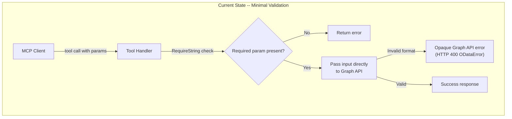
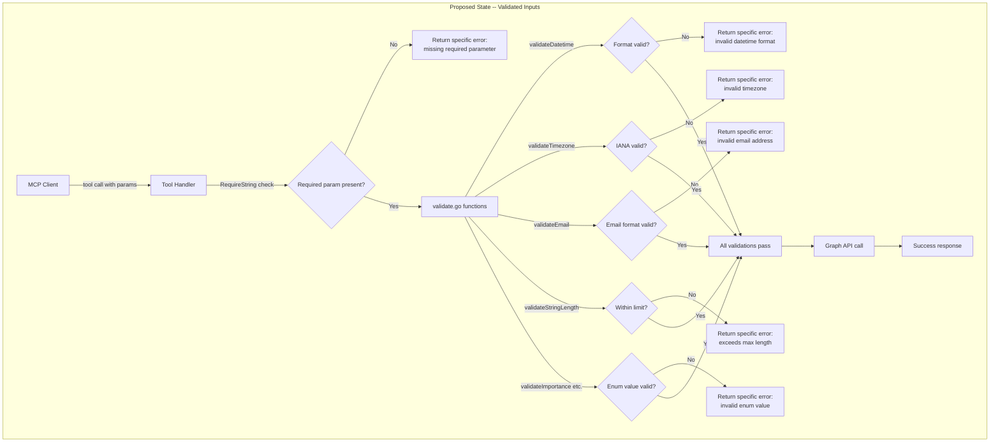
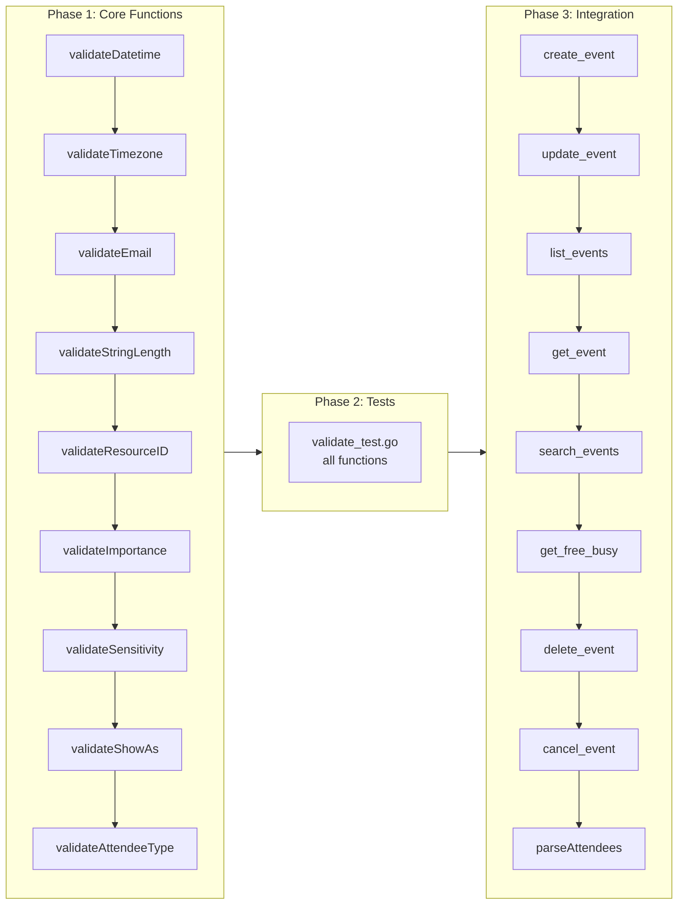

# Input Validation & Sanitization

## Change Summary

This CR introduces a centralized input validation layer to the Outlook Calendar MCP Server. Currently, tool handlers perform minimal validation -- required parameters are checked for presence, `max_results` is clamped to 1-100, and attendee count is limited to 500. All other inputs (datetime strings, timezone names, email addresses, string lengths, enum values, and resource IDs) are passed directly to the Microsoft Graph API without validation. The desired future state is a set of reusable validation functions in `validate.go` that enforce format, length, and value constraints on all user-provided inputs before they reach the Graph API, returning clear and specific error messages on validation failure.

## Motivation and Background

The MCP server accepts user-provided input from an AI assistant and forwards it to the Microsoft Graph API. Without input validation, malformed inputs produce opaque Graph API errors (HTTP 400 with OData error bodies) that are difficult for the AI assistant to interpret and correct. For example, an invalid datetime format like `"next Tuesday"` passes through to the Graph API and returns a generic serialization error; an invalid timezone like `"EST"` may silently produce incorrect results; an email address like `"not-an-email"` creates an attendee with an invalid address that causes delivery failures.

Validating inputs at the MCP server layer provides three benefits: (1) clear, specific error messages that the AI assistant can act on to self-correct, (2) reduced unnecessary Graph API calls for obviously invalid inputs, and (3) defense-in-depth against injection or unexpected behavior from unsanitized inputs in OData filter expressions and HTML body content.

## Change Drivers

* **Error clarity:** Graph API errors for invalid inputs are generic and unhelpful; server-side validation produces actionable error messages.
* **Reduced latency:** Rejecting obviously invalid inputs before making network calls to the Graph API avoids round-trip latency.
* **Security hardening:** String length limits, email format validation, and enum value whitelisting prevent unexpected behavior from malformed inputs.
* **Consistency:** A centralized validation module ensures all tools apply the same rules uniformly.

## Current State

The current validation landscape across tool handlers:

| Input Type | Current Validation | Gap |
|---|---|---|
| Required parameters | `request.RequireString()` checks presence | None |
| `max_results` | Clamped to 1-100 range | None |
| Attendee count | Limited to 500 | None |
| Datetime strings | None -- passed directly to Graph API | No ISO 8601 format check |
| Timezone strings | None -- passed directly to Graph API or Prefer header | No IANA validity check |
| Email addresses | None -- passed directly to attendee model | No format validation |
| Subject string | None | No length limit |
| Body content | None -- HTML passed through | No length limit |
| Location string | None | No length limit |
| Search query | None | No length limit |
| Calendar/Event IDs | None -- passed directly to Graph API path | No length limit, no emptiness check beyond RequireString |
| Importance enum | `parseImportance()` silently defaults unknown to "normal" | No rejection of invalid values |
| Sensitivity enum | `parseSensitivity()` silently defaults unknown to "normal" | No rejection of invalid values |
| Show_as enum | `parseShowAs()` silently defaults unknown to "busy" | No rejection of invalid values |
| Attendee type enum | `parseAttendeeType()` silently defaults unknown to "required" | No rejection of invalid values |
| Comment string | None | No length limit |
| Categories string | None | No length limit |
| OData query values | `escapeOData()` escapes single quotes | Sufficient for current use |

### Current State Diagram



## Proposed Change

Introduce a new file `validate.go` containing pure validation functions that each tool handler calls before constructing Graph API requests. Each function validates a single concern and returns a specific error message on failure. The existing enum parsing functions in `enums.go` are augmented with strict-mode validation alternatives that reject unknown values instead of silently defaulting.

### Validation Functions

The following validation functions will be implemented in `validate.go`:

| Function | Signature | Purpose |
|---|---|---|
| `validateDatetime` | `func(value, paramName string) error` | Validates ISO 8601 datetime format (multiple accepted layouts) |
| `validateTimezone` | `func(value, paramName string) error` | Validates IANA timezone via `time.LoadLocation` |
| `validateEmail` | `func(email string) error` | Validates email address format via `net/mail.ParseAddress` |
| `validateStringLength` | `func(value, paramName string, maxLen int) error` | Enforces maximum string length |
| `validateResourceID` | `func(value, paramName string) error` | Validates non-empty and <= 512 characters |
| `validateImportance` | `func(value string) error` | Rejects values not in {low, normal, high} |
| `validateSensitivity` | `func(value string) error` | Rejects values not in {normal, personal, private, confidential} |
| `validateShowAs` | `func(value string) error` | Rejects values not in {free, tentative, busy, oof, workingElsewhere} |
| `validateAttendeeType` | `func(value string) error` | Rejects values not in {required, optional, resource} |

### String Length Limits

| Parameter | Max Length | Rationale |
|---|---|---|
| `subject` | 255 | Outlook subject line limit |
| `body` | 32000 | Practical limit for MCP tool responses |
| `location` | 255 | Location display name practical limit |
| `query` (search) | 255 | OData filter expression practical limit |
| `comment` (cancel) | 255 | Cancellation message practical limit |
| `categories` | 1000 | Comma-separated list practical limit |
| `calendar_id` | 512 | Graph API resource ID limit |
| `event_id` | 512 | Graph API resource ID limit |

### Datetime Validation

The `validateDatetime` function accepts the following ISO 8601 layouts:

* `2006-01-02T15:04:05` -- local datetime without offset (primary format for Graph API)
* `2006-01-02T15:04:05Z` -- UTC datetime
* `2006-01-02T15:04:05Z07:00` -- datetime with timezone offset (RFC 3339)
* `2006-01-02T15:04:05.000Z` -- datetime with milliseconds and UTC
* `2006-01-02T15:04:05.000Z07:00` -- datetime with milliseconds and offset

### Timezone Validation

The `validateTimezone` function uses Go's `time.LoadLocation` which validates against the IANA timezone database. This rejects abbreviations like `"EST"` and invalid strings like `"US/Fake"`, while accepting standard IANA names like `"America/New_York"`, `"Europe/London"`, `"UTC"`, and `"Local"`.

### Enum Validation

The enum validation functions differ from the existing `parse*` functions in `enums.go`: the parse functions silently default unknown values for forward compatibility, while the validation functions return errors for unknown values. Both sets coexist -- validation runs first to reject bad input, then parsing runs to convert valid input to SDK constants. This separation preserves the existing API of `parse*` functions.

### Proposed State Diagram



### Tool Handler Integration Flow

```mermaid
flowchart TD
    subgraph create_event["create_event validation"]
        CE1["validateStringLength(subject, 255)"] --> CE2["validateDatetime(start_datetime)"]
        CE2 --> CE3["validateTimezone(start_timezone)"]
        CE3 --> CE4["validateDatetime(end_datetime)"]
        CE4 --> CE5["validateTimezone(end_timezone)"]
        CE5 --> CE6["validateStringLength(body, 32000)"]
        CE6 --> CE7["validateStringLength(location, 255)"]
        CE7 --> CE8["validateEmail per attendee"]
        CE8 --> CE9["validateAttendeeType per attendee"]
        CE9 --> CE10["validateImportance"]
        CE10 --> CE11["validateSensitivity"]
        CE11 --> CE12["validateShowAs"]
        CE12 --> CE13["validateResourceID(calendar_id)"]
        CE13 --> CE14[Proceed to Graph API]
    end
```



## Requirements

### Functional Requirements

1. The system **MUST** implement a `validateDatetime(value, paramName string) error` function that accepts ISO 8601 datetime strings in the formats `YYYY-MM-DDTHH:MM:SS`, `YYYY-MM-DDTHH:MM:SSZ`, and `YYYY-MM-DDTHH:MM:SS+HH:MM` (with optional milliseconds), and returns a descriptive error for any other format.
2. The system **MUST** implement a `validateTimezone(value, paramName string) error` function that validates timezone strings against the Go `time.LoadLocation` function (IANA timezone database), returning a descriptive error for invalid timezones.
3. The system **MUST** implement a `validateEmail(email string) error` function that validates email addresses using `net/mail.ParseAddress`, returning a descriptive error for malformed addresses.
4. The system **MUST** implement a `validateStringLength(value, paramName string, maxLen int) error` function that returns a descriptive error when the string length exceeds `maxLen`.
5. The system **MUST** implement a `validateResourceID(value, paramName string) error` function that validates non-emptiness and enforces a maximum length of 512 characters.
6. The system **MUST** implement `validateImportance(value string) error` that rejects values not in the set `{low, normal, high}` (case-insensitive).
7. The system **MUST** implement `validateSensitivity(value string) error` that rejects values not in the set `{normal, personal, private, confidential}` (case-insensitive).
8. The system **MUST** implement `validateShowAs(value string) error` that rejects values not in the set `{free, tentative, busy, oof, workingElsewhere}` (case-insensitive).
9. The system **MUST** implement `validateAttendeeType(value string) error` that rejects values not in the set `{required, optional, resource}` (case-insensitive).
10. All validation errors **MUST** be returned as `mcp.NewToolResultError` with descriptive messages that include the parameter name, the invalid value (truncated for long strings), and a description of the expected format.
11. The `create_event` handler **MUST** validate `subject` (max 255), `start_datetime` (ISO 8601), `start_timezone` (IANA), `end_datetime` (ISO 8601), `end_timezone` (IANA), and optionally `body` (max 32000), `location` (max 255), `importance`, `sensitivity`, `show_as`, and `calendar_id` (resource ID) before making any Graph API call.
12. The `update_event` handler **MUST** validate `event_id` (resource ID), and any provided optional parameters using the same rules as `create_event`.
13. The `list_events` handler **MUST** validate `start_datetime` (ISO 8601), `end_datetime` (ISO 8601), and optionally `calendar_id` (resource ID) and `timezone` (IANA).
14. The `get_event` handler **MUST** validate `event_id` (resource ID) and optionally `timezone` (IANA).
15. The `search_events` handler **MUST** validate optionally provided `start_datetime` (ISO 8601), `end_datetime` (ISO 8601), `query` (max 255), `importance`, `sensitivity`, `show_as`, and `timezone` (IANA).
16. The `get_free_busy` handler **MUST** validate `start_datetime` (ISO 8601), `end_datetime` (ISO 8601), and optionally `timezone` (IANA).
17. The `delete_event` handler **MUST** validate `event_id` (resource ID).
18. The `cancel_event` handler **MUST** validate `event_id` (resource ID) and optionally `comment` (max 255).
19. The `parseAttendees` function **MUST** validate each attendee's `email` field using `validateEmail` and each attendee's `type` field using `validateAttendeeType`.
20. All validation functions **MUST** use only Go standard library -- no new dependencies.

### Non-Functional Requirements

1. All validation functions **MUST** be pure functions with no side effects, making them trivially testable.
2. Validation errors **MUST** be returned immediately on the first failure (fail-fast) to avoid unnecessary processing.
3. The validation functions **MUST NOT** log -- logging is the responsibility of the calling tool handler.
4. The `validateTimezone` function **MUST** perform within constant time relative to input size (Go's `time.LoadLocation` is O(1) lookup).
5. All validation functions **MUST** handle empty strings gracefully -- either accepting them (for optional parameters) or returning appropriate errors (for required parameters).

## Affected Components

* `validate.go` (new) -- centralized validation functions
* `validate_test.go` (new) -- comprehensive tests for all validation functions
* `tool_create_event.go` -- add validation calls before Graph API request construction
* `tool_update_event.go` -- add validation calls before Graph API request construction
* `tool_list_events.go` -- add validation calls for datetime and timezone parameters
* `tool_get_event.go` -- add validation call for event_id
* `tool_search_events.go` -- add validation calls for optional parameters
* `tool_get_free_busy.go` -- add validation calls for datetime and timezone parameters
* `tool_delete_event.go` -- add validation call for event_id
* `tool_cancel_event.go` -- add validation calls for event_id and comment

## Scope Boundaries

### In Scope

* Implementation of all validation functions in `validate.go`
* Comprehensive unit tests in `validate_test.go`
* Integration of validation calls into all 9 tool handlers
* Email validation for attendees in `parseAttendees`
* Attendee type validation for attendees in `parseAttendees`
* String length enforcement on subject, body, location, query, comment, and categories
* Resource ID validation for calendar_id and event_id
* Datetime format validation for all datetime parameters
* Timezone validation for all timezone parameters
* Enum value validation for importance, sensitivity, show_as, and attendee type

### Out of Scope ("Here, But Not Further")

* HTML sanitization of body content (e.g., stripping script tags) -- the Graph API is responsible for sanitizing HTML content rendered in Outlook
* Semantic datetime validation (e.g., end after start, dates not in the past) -- these are business logic concerns that should be addressed in a separate CR
* Calendar ID existence validation (would require an API call) -- the Graph API returns 404 for non-existent IDs
* Rate limiting or throttling of invalid requests -- left to the MCP client layer
* OData injection prevention beyond the existing `escapeOData` function -- already addressed
* Recurrence JSON deep validation beyond what `buildRecurrence` already performs -- already addressed in CR-0008
* Content-type validation of body (HTML vs text) -- already handled by auto-detection

## Impact Assessment

### User Impact

Users (via their MCP-connected AI assistant) will receive clear, actionable error messages when providing invalid inputs. Instead of opaque Graph API errors like `"The value of property 'dateTime' is invalid"`, users will see messages like `"invalid start_datetime: expected ISO 8601 format (e.g., 2026-04-15T09:00:00), got 'next Tuesday'"`. This enables the AI assistant to self-correct and retry with the correct format without requiring user intervention.

### Technical Impact

* All 9 tool handlers gain validation logic at the entry point, adding a small amount of processing before Graph API calls.
* The existing `parse*` functions in `enums.go` are not modified -- the new `validate*` functions run before them.
* The `parseAttendees` function in `tool_create_event.go` gains email and attendee type validation.
* No changes to the MCP tool definitions (parameters, descriptions, or types).
* No changes to the Graph API client usage patterns.
* No new dependencies -- all validation uses Go stdlib (`time`, `net/mail`, `strings`, `fmt`).

### Business Impact

Input validation is a foundational quality concern. Without it, users encounter frustrating error loops where the AI assistant repeatedly sends invalid inputs to the Graph API and receives unhelpful errors. Validation reduces support burden and improves the perceived reliability of the tool.

## Implementation Approach

### Phase 1: Core Validation Functions

Implement all validation functions in `validate.go`:

1. `validateDatetime` -- attempts parsing against multiple ISO 8601 layouts using `time.Parse`.
2. `validateTimezone` -- calls `time.LoadLocation` and wraps the error with a descriptive message.
3. `validateEmail` -- calls `net/mail.ParseAddress` and wraps the error.
4. `validateStringLength` -- compares `len(value)` against `maxLen`.
5. `validateResourceID` -- checks non-emptiness and length <= 512.
6. `validateImportance`, `validateSensitivity`, `validateShowAs`, `validateAttendeeType` -- switch on `strings.ToLower(value)` with explicit allowed values.

### Phase 2: Validation Tests

Implement comprehensive tests in `validate_test.go` covering:

* Valid inputs for each function
* Invalid inputs with expected error messages
* Edge cases (empty strings, maximum length strings, unicode characters)
* Case-insensitivity for enum validation

### Phase 3: Tool Handler Integration

Add validation calls to each tool handler, ordered as: resource IDs first, then datetime strings, then timezone strings, then string lengths, then enum values. Each validation failure returns immediately via `mcp.NewToolResultError`.

### Implementation Flow



### Implementation Details

**validateDatetime:**

```go
func validateDatetime(value, paramName string) error {
    layouts := []string{
        "2006-01-02T15:04:05",
        "2006-01-02T15:04:05Z",
        time.RFC3339,
        "2006-01-02T15:04:05.000Z",
        "2006-01-02T15:04:05.000Z07:00",
    }
    for _, layout := range layouts {
        if _, err := time.Parse(layout, value); err == nil {
            return nil
        }
    }
    return fmt.Errorf("invalid %s: expected ISO 8601 format (e.g., 2026-04-15T09:00:00), got %q", paramName, truncate(value, 50))
}
```

**validateTimezone:**

```go
func validateTimezone(value, paramName string) error {
    _, err := time.LoadLocation(value)
    if err != nil {
        return fmt.Errorf("invalid %s: %q is not a valid IANA timezone (e.g., America/New_York, UTC)", paramName, value)
    }
    return nil
}
```

**validateEmail:**

```go
func validateEmail(email string) error {
    _, err := mail.ParseAddress(email)
    if err != nil {
        return fmt.Errorf("invalid email address %q: %w", email, err)
    }
    return nil
}
```

**Tool handler integration example (create_event):**

After extracting required parameters:

```go
if err := validateStringLength(subject, "subject", 255); err != nil {
    return mcp.NewToolResultError(err.Error()), nil
}
if err := validateDatetime(startDT, "start_datetime"); err != nil {
    return mcp.NewToolResultError(err.Error()), nil
}
if err := validateTimezone(startTZ, "start_timezone"); err != nil {
    return mcp.NewToolResultError(err.Error()), nil
}
// ... additional validations
```

**parseAttendees integration:**

Within the attendee parsing loop:

```go
if err := validateEmail(a.Email); err != nil {
    return nil, fmt.Errorf("attendee %d: %w", i+1, err)
}
if a.Type != "" {
    if err := validateAttendeeType(a.Type); err != nil {
        return nil, fmt.Errorf("attendee %d: %w", i+1, err)
    }
}
```

## Test Strategy

### Tests to Add

| Test File | Test Name | Description | Inputs | Expected Output |
|---|---|---|---|---|
| `validate_test.go` | `TestValidateDatetime_ValidLocalDatetime` | Validates acceptance of local datetime | `"2026-04-15T09:00:00"` | No error |
| `validate_test.go` | `TestValidateDatetime_ValidUTC` | Validates acceptance of UTC datetime | `"2026-04-15T09:00:00Z"` | No error |
| `validate_test.go` | `TestValidateDatetime_ValidRFC3339` | Validates acceptance of RFC 3339 datetime | `"2026-04-15T09:00:00-04:00"` | No error |
| `validate_test.go` | `TestValidateDatetime_ValidMilliseconds` | Validates acceptance of datetime with ms | `"2026-04-15T09:00:00.000Z"` | No error |
| `validate_test.go` | `TestValidateDatetime_InvalidNaturalLanguage` | Rejects natural language date | `"next Tuesday"` | Error containing parameter name and `"next Tuesday"` |
| `validate_test.go` | `TestValidateDatetime_InvalidDateOnly` | Rejects date without time component | `"2026-04-15"` | Error containing parameter name |
| `validate_test.go` | `TestValidateDatetime_InvalidEmpty` | Rejects empty string | `""` | Error containing parameter name |
| `validate_test.go` | `TestValidateDatetime_InvalidGarbage` | Rejects random string | `"abc123"` | Error containing parameter name |
| `validate_test.go` | `TestValidateTimezone_ValidIANA` | Validates acceptance of IANA timezone | `"America/New_York"` | No error |
| `validate_test.go` | `TestValidateTimezone_ValidUTC` | Validates acceptance of UTC | `"UTC"` | No error |
| `validate_test.go` | `TestValidateTimezone_ValidLocal` | Validates acceptance of Local | `"Local"` | No error |
| `validate_test.go` | `TestValidateTimezone_ValidEuropeLondon` | Validates acceptance of Europe/London | `"Europe/London"` | No error |
| `validate_test.go` | `TestValidateTimezone_InvalidAbbreviation` | Rejects timezone abbreviation | `"EST"` | Error containing `"EST"` |
| `validate_test.go` | `TestValidateTimezone_InvalidFake` | Rejects non-existent timezone | `"US/Fake"` | Error containing `"US/Fake"` |
| `validate_test.go` | `TestValidateTimezone_InvalidEmpty` | Rejects empty string | `""` | Error containing parameter name |
| `validate_test.go` | `TestValidateEmail_ValidSimple` | Validates simple email | `"user@example.com"` | No error |
| `validate_test.go` | `TestValidateEmail_ValidWithName` | Validates email parsed from name format | `"user@example.com"` (plain) | No error |
| `validate_test.go` | `TestValidateEmail_ValidSubdomain` | Validates subdomain email | `"user@mail.example.com"` | No error |
| `validate_test.go` | `TestValidateEmail_InvalidNoAt` | Rejects email without @ | `"userexample.com"` | Error containing the address |
| `validate_test.go` | `TestValidateEmail_InvalidNoDomain` | Rejects email without domain | `"user@"` | Error containing the address |
| `validate_test.go` | `TestValidateEmail_InvalidEmpty` | Rejects empty string | `""` | Error |
| `validate_test.go` | `TestValidateStringLength_WithinLimit` | Validates string within limit | `"hello"`, max 255 | No error |
| `validate_test.go` | `TestValidateStringLength_AtLimit` | Validates string at exact limit | 255-char string, max 255 | No error |
| `validate_test.go` | `TestValidateStringLength_ExceedsLimit` | Rejects string exceeding limit | 256-char string, max 255 | Error containing parameter name and limits |
| `validate_test.go` | `TestValidateStringLength_Empty` | Validates empty string passes | `""`, max 255 | No error |
| `validate_test.go` | `TestValidateStringLength_Unicode` | Validates unicode byte length handling | Unicode string | Correct length calculation |
| `validate_test.go` | `TestValidateResourceID_Valid` | Validates typical Graph API ID | `"AAMkAG..."` (50 chars) | No error |
| `validate_test.go` | `TestValidateResourceID_Empty` | Rejects empty resource ID | `""` | Error containing parameter name |
| `validate_test.go` | `TestValidateResourceID_TooLong` | Rejects ID exceeding 512 chars | 513-char string | Error containing parameter name |
| `validate_test.go` | `TestValidateResourceID_AtLimit` | Validates ID at exactly 512 chars | 512-char string | No error |
| `validate_test.go` | `TestValidateImportance_ValidLow` | Validates "low" | `"low"` | No error |
| `validate_test.go` | `TestValidateImportance_ValidNormal` | Validates "normal" | `"normal"` | No error |
| `validate_test.go` | `TestValidateImportance_ValidHigh` | Validates "high" | `"high"` | No error |
| `validate_test.go` | `TestValidateImportance_ValidMixedCase` | Validates case-insensitivity | `"HIGH"` | No error |
| `validate_test.go` | `TestValidateImportance_InvalidUnknown` | Rejects unknown value | `"critical"` | Error containing `"critical"` |
| `validate_test.go` | `TestValidateSensitivity_ValidAll` | Validates all four values | `"normal"`, `"personal"`, `"private"`, `"confidential"` | No error for each |
| `validate_test.go` | `TestValidateSensitivity_InvalidUnknown` | Rejects unknown value | `"secret"` | Error containing `"secret"` |
| `validate_test.go` | `TestValidateShowAs_ValidAll` | Validates all five values | `"free"`, `"tentative"`, `"busy"`, `"oof"`, `"workingElsewhere"` | No error for each |
| `validate_test.go` | `TestValidateShowAs_InvalidUnknown` | Rejects unknown value | `"away"` | Error containing `"away"` |
| `validate_test.go` | `TestValidateAttendeeType_ValidAll` | Validates all three values | `"required"`, `"optional"`, `"resource"` | No error for each |
| `validate_test.go` | `TestValidateAttendeeType_InvalidUnknown` | Rejects unknown value | `"mandatory"` | Error containing `"mandatory"` |

### Tests to Modify

| Test File | Test Name | Modification | Reason |
|---|---|---|---|
| `tool_create_event_test.go` | Existing attendee tests | Update to expect validation errors for invalid emails | `parseAttendees` now validates email format |
| `tool_update_event_test.go` | Existing update tests | Ensure test inputs pass validation | Inputs must now conform to validation rules |

### Tests to Remove

Not applicable. No existing tests become redundant as a result of this CR.

## Acceptance Criteria

### AC-1: Datetime format validation

```gherkin
Given the MCP server is running
When the create_event tool is called with start_datetime "next Tuesday"
Then the server returns an MCP tool error result
  And the error message contains "invalid start_datetime"
  And the error message contains "ISO 8601"
  And no Graph API call is made
```

### AC-2: Valid datetime acceptance

```gherkin
Given the MCP server is running
When the create_event tool is called with start_datetime "2026-04-15T09:00:00"
Then the start_datetime validation passes
  And the handler proceeds to the next validation or Graph API call
```

### AC-3: Timezone validation

```gherkin
Given the MCP server is running
When the create_event tool is called with start_timezone "EST"
Then the server returns an MCP tool error result
  And the error message contains "invalid start_timezone"
  And the error message contains "IANA timezone"
  And no Graph API call is made
```

### AC-4: Valid timezone acceptance

```gherkin
Given the MCP server is running
When the create_event tool is called with start_timezone "America/New_York"
Then the start_timezone validation passes
  And the handler proceeds to the next validation or Graph API call
```

### AC-5: Email validation in attendees

```gherkin
Given the MCP server is running
When the create_event tool is called with attendees '[{"email":"not-an-email","name":"Test","type":"required"}]'
Then the server returns an MCP tool error result
  And the error message contains "invalid email"
  And the error message contains "not-an-email"
  And no Graph API call is made
```

### AC-6: String length enforcement

```gherkin
Given the MCP server is running
When the create_event tool is called with a subject exceeding 255 characters
Then the server returns an MCP tool error result
  And the error message contains "subject"
  And the error message contains "255"
  And no Graph API call is made
```

### AC-7: Resource ID validation

```gherkin
Given the MCP server is running
When the get_event tool is called with an event_id exceeding 512 characters
Then the server returns an MCP tool error result
  And the error message contains "event_id"
  And the error message contains "512"
  And no Graph API call is made
```

### AC-8: Enum value rejection

```gherkin
Given the MCP server is running
When the create_event tool is called with importance "critical"
Then the server returns an MCP tool error result
  And the error message contains "invalid importance"
  And the error message lists the valid values: low, normal, high
  And no Graph API call is made
```

### AC-9: Enum case-insensitivity

```gherkin
Given the MCP server is running
When the create_event tool is called with importance "HIGH"
Then the importance validation passes
  And the handler proceeds with the parsed enum value
```

### AC-10: Validation on all read tools

```gherkin
Given the MCP server is running
When the list_events tool is called with start_datetime "invalid-date"
Then the server returns an MCP tool error result containing "invalid start_datetime"

When the get_event tool is called with an empty event_id
Then the server returns an MCP tool error result containing "event_id"

When the get_free_busy tool is called with an invalid timezone "FAKE"
Then the server returns an MCP tool error result containing "invalid timezone"
```

### AC-11: Validation on all write tools

```gherkin
Given the MCP server is running
When the delete_event tool is called with event_id exceeding 512 characters
Then the server returns an MCP tool error result containing "event_id"

When the cancel_event tool is called with comment exceeding 255 characters
Then the server returns an MCP tool error result containing "comment"
```

### AC-12: Attendee type validation

```gherkin
Given the MCP server is running
When the create_event tool is called with attendees '[{"email":"a@b.com","name":"A","type":"mandatory"}]'
Then the server returns an MCP tool error result
  And the error message contains "invalid attendee type"
  And the error message lists the valid values: required, optional, resource
```

### AC-13: Body length enforcement

```gherkin
Given the MCP server is running
When the create_event tool is called with a body exceeding 32000 characters
Then the server returns an MCP tool error result
  And the error message contains "body"
  And the error message contains "32000"
```

## Quality Standards Compliance

### Build & Compilation

- [ ] Code compiles/builds without errors
- [ ] No new compiler warnings introduced

### Linting & Code Style

- [ ] All linter checks pass with zero warnings/errors
- [ ] Code follows project coding conventions and style guides
- [ ] Any linter exceptions are documented with justification

### Test Execution

- [ ] All existing tests pass after implementation
- [ ] All new tests pass
- [ ] Test coverage meets project requirements for changed code

### Documentation

- [ ] Inline code documentation updated where applicable
- [ ] API documentation updated for any API changes
- [ ] User-facing documentation updated if behavior changes

### Code Review

- [ ] Changes submitted via pull request
- [ ] PR title follows Conventional Commits format
- [ ] Code review completed and approved
- [ ] Changes squash-merged to maintain linear history

### Verification Commands

```bash
# Build verification
go build ./...

# Lint verification
golangci-lint run

# Test execution
go test ./... -v

# Test coverage
go test ./... -coverprofile=coverage.out
go tool cover -func=coverage.out
```

## Risks and Mitigation

### Risk 1: Timezone validation rejects valid timezone strings not in the build's IANA database

**Likelihood:** low
**Impact:** medium
**Mitigation:** Go's `time.LoadLocation` relies on the IANA timezone database bundled with the Go binary (or the system's `zoneinfo`). Obscure but valid timezones may be missing on minimal Docker images. The Go stdlib includes `time/tzdata` as an import option for embedding the full database, but adding it is out of scope. If this becomes an issue, it can be addressed in a follow-up CR. Document this limitation in the `validateTimezone` function docstring.

### Risk 2: Breaking change for AI assistants sending previously-accepted but technically invalid inputs

**Likelihood:** medium
**Impact:** medium
**Mitigation:** The primary concern is enum values that were silently defaulted and now produce errors. For example, an AI assistant sending `importance: "urgent"` previously got `NORMAL_IMPORTANCE` silently and now gets a validation error. This is the correct behavior -- the silent default masked incorrect input. The descriptive error message enables the AI assistant to self-correct. The existing `parse*` functions continue to provide the silent-default behavior for any code path that does not call the validation functions first.

### Risk 3: Overly strict datetime validation rejects formats accepted by the Graph API

**Likelihood:** low
**Impact:** low
**Mitigation:** The accepted datetime layouts cover all formats documented in the Microsoft Graph API datetime reference. If a new format is discovered, adding it to the layouts slice is a one-line change. The validation function is designed to be easily extensible.

### Risk 4: Email validation with net/mail.ParseAddress is too strict or too lenient

**Likelihood:** low
**Impact:** low
**Mitigation:** Go's `net/mail.ParseAddress` follows RFC 5322, which is the same standard used by email systems. It may accept technically valid but unusual addresses (e.g., `"quoted string"@example.com`) that Graph API also accepts. It correctly rejects clearly malformed addresses. This is a reasonable balance between strictness and compatibility.

## Dependencies

* **CR-0001 (Configuration):** Required for the running server and Graph client configuration.
* **CR-0002 (Logging):** Tool handlers log validation context at debug level; the validation functions themselves do not log.
* **CR-0004 (Server Bootstrap):** Required for MCP server and tool registration infrastructure.
* **CR-0005 (Error Handling):** Validation errors use `mcp.NewToolResultError` consistent with Graph API error handling pattern.
* **CR-0006 (Read-Only Tools):** `list_events`, `get_event` handlers are modified to add validation calls.
* **CR-0007 (Search & Free/Busy):** `search_events`, `get_free_busy` handlers are modified to add validation calls.
* **CR-0008 (Create & Update Tools):** `create_event`, `update_event` handlers and `parseAttendees` are modified to add validation calls.
* **CR-0009 (Delete & Cancel Tools):** `delete_event`, `cancel_event` handlers are modified to add validation calls.

## Estimated Effort

| Phase | Description | Estimate |
|---|---|---|
| Phase 1 | Core validation functions in `validate.go` (9 functions) | 3 hours |
| Phase 2 | Comprehensive tests in `validate_test.go` (40+ test cases) | 4 hours |
| Phase 3 | Integration into all 9 tool handlers + `parseAttendees` | 4 hours |
| Phase 3 | Update existing tests to conform to validation rules | 2 hours |
| Review | Code review and integration testing | 1.5 hours |
| **Total** | | **14.5 hours** |

## Decision Outcome

Chosen approach: "Centralized validation functions in a single `validate.go` file, called explicitly by each tool handler before Graph API calls", because: (1) pure validation functions are trivially testable and composable, (2) explicit calls in each handler make the validation order and coverage visible in code review, (3) fail-fast semantics with immediate return on first validation error provide clear error attribution, and (4) the validation layer is independent of the existing `parse*` enum functions, preserving backward compatibility. An alternative middleware-based approach was considered but rejected because MCP tool handlers have heterogeneous parameter sets that do not lend themselves to generic middleware validation.

## Related Items

* Dependencies: CR-0001, CR-0002, CR-0004, CR-0005, CR-0006, CR-0007, CR-0008, CR-0009
* Related validation: `escapeOData()` in `odata.go` (OData string escaping, unchanged by this CR)
* Related validation: `buildRecurrence()` in `recurrence.go` (recurrence JSON validation, unchanged by this CR)
* Related parsing: `parse*` functions in `enums.go` (silent-default enum parsing, unchanged by this CR)
