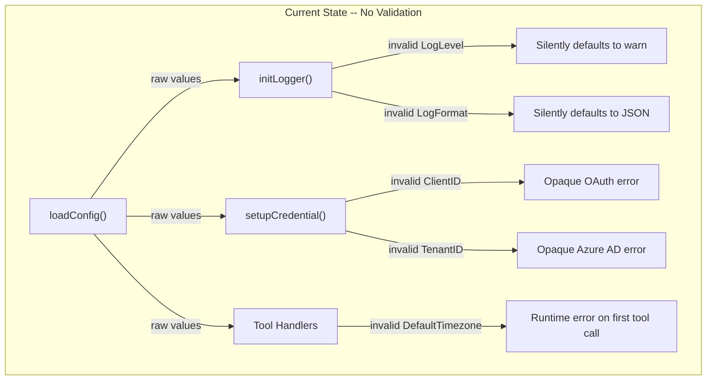
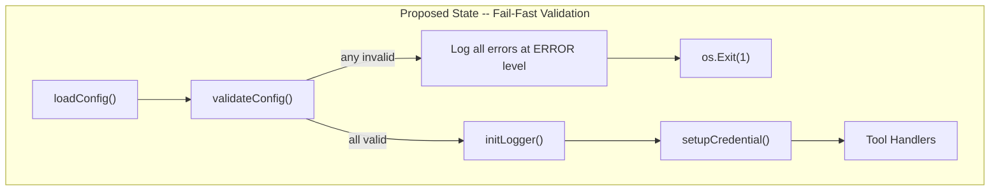
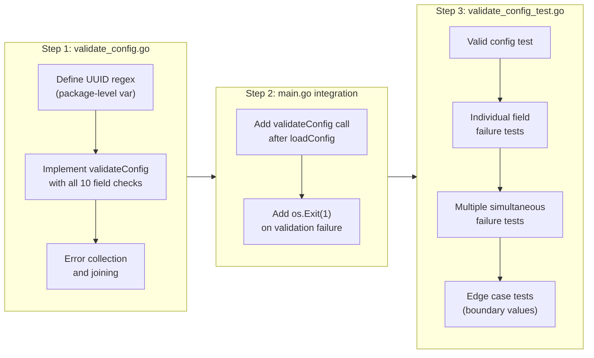

# Configuration Validation

## Change Summary

This CR introduces startup-time configuration validation for the Outlook Calendar MCP Server. Currently, `loadConfig()` in `main.go` reads environment variables and returns a `config` struct with no validation whatsoever. Invalid values (e.g., a malformed UUID for `ClientID`, an unrecognized timezone for `DefaultTimezone`, or out-of-range retry parameters) silently propagate through the system and either cause obscure runtime errors or get silently coerced to defaults. The desired future state is a `validateConfig(cfg config) error` function in a new `validate_config.go` file that inspects every config field at startup, collects all validation failures, logs each one at error level with the field name, provided value, and expected format, and returns a combined error so that `main()` can exit with code 1 and a descriptive message before any network calls or authentication attempts are made.

## Motivation and Background

Enterprise-grade server software must fail fast on misconfiguration. The current codebase silently absorbs invalid configuration values in multiple places: `parseLogLevel()` defaults unrecognized levels to "warn", `initLogger()` defaults unrecognized formats to JSON, and `DefaultTimezone` is passed unchecked to `time.LoadLocation()` inside tool handlers, where a failure surfaces as a cryptic runtime error deep in a user-facing tool call. The `ClientID` is expected to be a UUID but is never validated, meaning a typo would only manifest as an opaque OAuth error during device code authentication. Similarly, `TenantID` accepts a fixed set of well-known values or a UUID, but an invalid value produces a confusing Azure AD error at authentication time rather than a clear startup message.

With CR-0010 and CR-0011 adding `MaxRetries`, `RetryBackoffMS`, and `RequestTimeout` fields to the config struct, the validation surface grows further. Each of these numeric fields has a valid range, and out-of-range values could cause either excessive retry storms or effectively disabled timeouts. Validating all fields in one place, at one time (startup), with all errors reported together, is the standard approach for production server software.

## Change Drivers

* **Silent misconfiguration:** Invalid `LogLevel` silently defaults to "warn"; invalid `LogFormat` silently defaults to JSON. Users have no indication their intended configuration was ignored.
* **Runtime failures from invalid config:** An invalid `DefaultTimezone` string causes `time.LoadLocation()` to fail inside tool handlers, producing a runtime error on the first tool call rather than at startup.
* **Authentication failures from invalid credentials:** A malformed `ClientID` or `TenantID` does not fail until the OAuth flow is attempted, producing opaque Azure AD error messages instead of a clear "invalid UUID format" message at startup.
* **New numeric fields:** CR-0010 adds `MaxRetries` (0-10) and `RetryBackoffMS` (100-30000); CR-0011 adds `RequestTimeout` (1-300 seconds). These fields have strict valid ranges that must be enforced.
* **Enterprise requirement:** Misconfiguration must be caught at startup, not at runtime. The fail-fast principle ensures operators discover all configuration errors in a single startup attempt rather than encountering them one at a time during operation.

## Current State

The `loadConfig()` function in `main.go` reads seven environment variables (expanding to ten after CR-0010 and CR-0011) and returns a `config` struct. No validation is performed on any field. Invalid values silently propagate:

* `LogLevel` with an unrecognized value is silently coerced to `slog.LevelWarn` by `parseLogLevel()` in `logger.go`.
* `LogFormat` with an unrecognized value is silently coerced to JSON output by `initLogger()` in `logger.go`.
* `DefaultTimezone` is never validated; an invalid IANA timezone string causes `time.LoadLocation()` to return an error inside tool handlers at runtime.
* `ClientID` is never checked for UUID format; a malformed value fails during OAuth authentication with an opaque Azure AD error.
* `TenantID` is never checked against the allowed set (`common`, `organizations`, `consumers`, or UUID); an invalid value fails during Azure AD tenant resolution.
* `AuthRecordPath` has `~` expanded but the parent directory is never checked for existence or writability.
* `CacheName` is never checked for emptiness or length.

### Current State Diagram



## Proposed Change

Implement a `validateConfig(cfg config) error` function in a new `validate_config.go` file that validates every field of the `config` struct at startup. The function collects all validation errors into a slice, logs each error individually at error level with structured fields (`field`, `value`, `expected`), and returns a combined error containing all failures. The `main()` function in `main.go` calls `validateConfig()` immediately after `loadConfig()` and before `initLogger()`, exiting with code 1 if validation fails.

### Validation Rules

| Field | Validation Rule | Error Message Pattern |
|---|---|---|
| `ClientID` | Must match UUID regex `^[0-9a-fA-F]{8}-[0-9a-fA-F]{4}-[0-9a-fA-F]{4}-[0-9a-fA-F]{4}-[0-9a-fA-F]{12}$` | `"ClientID must be a valid UUID (e.g., d3590ed6-52b3-4102-aeff-aad2292ab01c), got: <value>"` |
| `TenantID` | Must be one of `common`, `organizations`, `consumers`, or match UUID regex | `"TenantID must be 'common', 'organizations', 'consumers', or a valid UUID, got: <value>"` |
| `DefaultTimezone` | Must be loadable by `time.LoadLocation()` | `"DefaultTimezone must be a valid IANA timezone (e.g., America/New_York, UTC), got: <value>"` |
| `LogLevel` | Must be one of `debug`, `info`, `warn`, `error` (case-insensitive) | `"LogLevel must be one of: debug, info, warn, error, got: <value>"` |
| `LogFormat` | Must be one of `json`, `text` (case-insensitive) | `"LogFormat must be one of: json, text, got: <value>"` |
| `AuthRecordPath` | Parent directory must exist or be creatable (best-effort; warn on failure, do not fail validation) | Logged at warn level: `"AuthRecordPath parent directory does not exist and could not be verified: <dir>"` |
| `CacheName` | Must be non-empty and <= 128 characters | `"CacheName must be non-empty and at most 128 characters, got length: <len>"` |
| `MaxRetries` | Must be 0-10 (from CR-0010) | `"MaxRetries must be between 0 and 10, got: <value>"` |
| `RetryBackoffMS` | Must be 100-30000 (from CR-0010) | `"RetryBackoffMS must be between 100 and 30000, got: <value>"` |
| `RequestTimeout` | Must be 1-300 seconds (from CR-0011) | `"RequestTimeout must be between 1 and 300 seconds, got: <value>"` |

### Proposed State Diagram



### Validation Flow Diagram

```mermaid
flowchart TD
    Start["validateConfig(cfg)"] --> Init["errs = []string{}"]
    Init --> V1{"ClientID matches\nUUID regex?"}
    V1 -->|No| E1["append error + slog.Error"]
    V1 -->|Yes| V2
    E1 --> V2{"TenantID is well-known\nor UUID?"}
    V2 -->|No| E2["append error + slog.Error"]
    V2 -->|Yes| V3
    E2 --> V3{"time.LoadLocation\nsucceeds?"}
    V3 -->|No| E3["append error + slog.Error"]
    V3 -->|Yes| V4
    E3 --> V4{"LogLevel in\nallowed set?"}
    V4 -->|No| E4["append error + slog.Error"]
    V4 -->|Yes| V5
    E4 --> V5{"LogFormat in\nallowed set?"}
    V5 -->|No| E5["append error + slog.Error"]
    V5 -->|Yes| V6
    E5 --> V6{"AuthRecordPath\nparent dir OK?"}
    V6 -->|No| W6["slog.Warn (best-effort)"]
    V6 -->|Yes| V7
    W6 --> V7{"CacheName non-empty\nand <= 128 chars?"}
    V7 -->|No| E7["append error + slog.Error"]
    V7 -->|Yes| V8
    E7 --> V8{"MaxRetries\n0-10?"}
    V8 -->|No| E8["append error + slog.Error"]
    V8 -->|Yes| V9
    E8 --> V9{"RetryBackoffMS\n100-30000?"}
    V9 -->|No| E9["append error + slog.Error"]
    V9 -->|Yes| V10
    E9 --> V10{"RequestTimeout\n1-300?"}
    V10 -->|No| E10["append error + slog.Error"]
    V10 -->|Yes| Done
    E10 --> Done{"len(errs) > 0?"}
    Done -->|Yes| Fail["return errors.New\n(joined messages)"]
    Done -->|No| Pass["return nil"]
```



### Error Collection and Reporting

The function collects all errors into a `[]string` slice, then joins them with `"; "` as separator and wraps the result in a single `error` via `fmt.Errorf("configuration validation failed: %s", strings.Join(errs, "; "))`. This ensures the caller (and the log output) shows every misconfigured field in a single message, enabling operators to fix all issues in one iteration rather than playing whack-a-mole with one-at-a-time failures.

## Requirements

### Functional Requirements

1. The system **MUST** implement a `validateConfig(cfg config) error` function in a new `validate_config.go` file.
2. The system **MUST** validate `ClientID` matches the UUID regex pattern `^[0-9a-fA-F]{8}-[0-9a-fA-F]{4}-[0-9a-fA-F]{4}-[0-9a-fA-F]{4}-[0-9a-fA-F]{12}$` using `regexp.MustCompile` (compiled once as a package-level variable).
3. The system **MUST** validate `TenantID` is one of `common`, `organizations`, `consumers` (case-insensitive comparison via `strings.ToLower`) or matches the same UUID regex used for `ClientID`.
4. The system **MUST** validate `DefaultTimezone` by calling `time.LoadLocation(cfg.DefaultTimezone)` and treating a non-nil error as a validation failure.
5. The system **MUST** validate `LogLevel` is one of `debug`, `info`, `warn`, `error` (case-insensitive comparison via `strings.ToLower`).
6. The system **MUST** validate `LogFormat` is one of `json`, `text` (case-insensitive comparison via `strings.ToLower`).
7. The system **MUST** check that the parent directory of `AuthRecordPath` exists by calling `os.Stat(filepath.Dir(cfg.AuthRecordPath))`. If the stat fails, the system **MUST** log a warning at `slog.Warn` level but **MUST NOT** treat this as a validation error (best-effort check).
8. The system **MUST** validate `CacheName` is non-empty (`len(cfg.CacheName) > 0`) and at most 128 characters (`len(cfg.CacheName) <= 128`).
9. The system **MUST** validate `MaxRetries` is in the range 0-10 inclusive (from CR-0010).
10. The system **MUST** validate `RetryBackoffMS` is in the range 100-30000 inclusive (from CR-0010).
11. The system **MUST** validate `RequestTimeout` is in the range 1-300 inclusive (from CR-0011).
12. The system **MUST** collect all validation errors into a `[]string` slice before returning, ensuring all errors are reported together in a single `error` value.
13. The system **MUST** log each validation error individually at `slog.Error` level with structured fields: `"field"` (the config field name), `"value"` (the provided value), and `"expected"` (the expected format or allowed values).
14. The system **MUST** return `nil` when all validations pass.
15. The system **MUST** return a non-nil error containing all validation failure messages joined with `"; "` when one or more validations fail, prefixed with `"configuration validation failed: "`.
16. The `main()` function in `main.go` **MUST** call `validateConfig(cfg)` after `loadConfig()` and before `initLogger()`, exiting with `os.Exit(1)` if the returned error is non-nil.
17. The `main()` function **MUST** log the validation error at `slog.Error` level before exiting, using the default logger (since `initLogger()` has not yet been called, this will use `slog`'s default text handler to stderr).
18. The UUID regex **MUST** be compiled once as a package-level `var` using `regexp.MustCompile`, not recompiled on each call.

### Non-Functional Requirements

1. The system **MUST NOT** introduce any new external dependencies. All validation uses the Go standard library (`regexp`, `time`, `os`, `strings`, `fmt`, `path/filepath`, `log/slog`).
2. The system **MUST** complete validation in under 100 milliseconds under normal conditions (`time.LoadLocation` is the only potentially slow call, and it reads from the local timezone database).
3. The system **MUST** be safe to call from tests without side effects beyond logging (no file creation, no network calls, no environment variable mutation).
4. The `validate_config_test.go` file **MUST** achieve 100% branch coverage of the `validateConfig` function.

## Affected Components

* `validate_config.go` -- new file, contains `validateConfig()` function and the package-level UUID regex variable.
* `validate_config_test.go` -- new file, contains unit tests for all validation paths.
* `main.go` -- modified to call `validateConfig()` after `loadConfig()` and exit on failure.

## Scope Boundaries

### In Scope

* Implementation of `validateConfig(cfg config) error` in `validate_config.go`.
* Package-level UUID regex compilation via `regexp.MustCompile`.
* Validation of all 10 config fields (7 existing + 3 from CR-0010/CR-0011).
* Error collection (all errors reported together, not one at a time).
* Structured error logging for each validation failure.
* Best-effort `AuthRecordPath` parent directory check with warn-level logging.
* Integration point in `main()` between `loadConfig()` and `initLogger()`.
* Comprehensive unit tests in `validate_config_test.go`.

### Out of Scope ("Here, But Not Further")

* Modifying `loadConfig()` itself -- this CR validates the output of `loadConfig()`, it does not change how values are read from environment variables.
* Removing the silent defaults in `parseLogLevel()` or `initLogger()` -- those functions still handle their own defaults for resilience, but `validateConfig()` ensures only valid values reach them.
* Adding new config fields -- `MaxRetries`, `RetryBackoffMS`, and `RequestTimeout` are added by CR-0010 and CR-0011; this CR only validates them.
* Custom error types -- a plain `error` with a descriptive message is sufficient; no sentinel errors or custom error types are needed.
* Interactive configuration prompts or auto-correction of invalid values.
* Configuration file support (YAML, TOML, etc.).

## Impact Assessment

### User Impact

Operators who previously received opaque OAuth or Azure AD errors due to misconfigured `ClientID` or `TenantID` will now receive clear, actionable error messages at startup. Operators who set an invalid timezone will see a clear message listing the problem field and expected format instead of encountering a runtime error on their first tool call. All misconfigured fields are reported at once, enabling single-iteration fixes.

### Technical Impact

* A new file `validate_config.go` is added to the `main` package.
* A new file `validate_config_test.go` is added with comprehensive tests.
* The `main()` function in `main.go` gains a validation call and conditional exit between `loadConfig()` and `initLogger()`.
* No changes to existing functions (`loadConfig`, `initLogger`, `parseLogLevel`, `setupCredential`).
* No new external dependencies.
* The validation function is pure (no side effects beyond logging) and safe to call from tests.

### Business Impact

Reduces support burden by converting opaque runtime errors into clear startup-time validation messages. Improves operator confidence that a successfully started server has a valid configuration. Aligns with enterprise expectations for fail-fast configuration validation.

## Implementation Approach

Implementation is a single phase with three sequential steps.

### Implementation Flow



### Implementation Details

**validate_config.go:**

1. Define `var uuidRegex = regexp.MustCompile(`^[0-9a-fA-F]{8}-[0-9a-fA-F]{4}-[0-9a-fA-F]{4}-[0-9a-fA-F]{4}-[0-9a-fA-F]{12}$`)` at package level.
2. Implement `validateConfig(cfg config) error`:
   - Initialize `var errs []string`.
   - Validate `ClientID`: if `!uuidRegex.MatchString(cfg.ClientID)`, append error message and log at `slog.Error`.
   - Validate `TenantID`: check if `strings.ToLower(cfg.TenantID)` is in `{"common", "organizations", "consumers"}` or matches `uuidRegex`; if neither, append error and log.
   - Validate `DefaultTimezone`: call `time.LoadLocation(cfg.DefaultTimezone)`; on error, append message and log.
   - Validate `LogLevel`: check if `strings.ToLower(cfg.LogLevel)` is in `{"debug", "info", "warn", "error"}`; if not, append error and log.
   - Validate `LogFormat`: check if `strings.ToLower(cfg.LogFormat)` is in `{"json", "text"}`; if not, append error and log.
   - Validate `AuthRecordPath`: call `os.Stat(filepath.Dir(cfg.AuthRecordPath))`; on error, log at `slog.Warn` but do NOT append to `errs`.
   - Validate `CacheName`: check `len(cfg.CacheName) == 0 || len(cfg.CacheName) > 128`; if true, append error and log.
   - Validate `MaxRetries`: check `cfg.MaxRetries < 0 || cfg.MaxRetries > 10`; if true, append error and log.
   - Validate `RetryBackoffMS`: check `cfg.RetryBackoffMS < 100 || cfg.RetryBackoffMS > 30000`; if true, append error and log.
   - Validate `RequestTimeout`: check `cfg.RequestTimeout < 1 || cfg.RequestTimeout > 300`; if true, append error and log.
   - If `len(errs) > 0`, return `fmt.Errorf("configuration validation failed: %s", strings.Join(errs, "; "))`.
   - Otherwise, return `nil`.

**main.go modification:**

Insert between `cfg := loadConfig()` and `initLogger(cfg.LogLevel, cfg.LogFormat)`:

```go
if err := validateConfig(cfg); err != nil {
    slog.Error("configuration validation failed", "error", err)
    os.Exit(1)
}
```

## Test Strategy

### Tests to Add

| Test File | Test Name | Description | Inputs | Expected Output |
|-----------|-----------|-------------|--------|-----------------|
| `validate_config_test.go` | `TestValidateConfig_AllValid` | Validates that a fully valid config returns nil error | Config with all valid values (default config values) | `nil` error |
| `validate_config_test.go` | `TestValidateConfig_InvalidClientID_NotUUID` | Validates that a non-UUID ClientID fails | `ClientID: "not-a-uuid"` | Error containing `"ClientID"` |
| `validate_config_test.go` | `TestValidateConfig_InvalidClientID_Empty` | Validates that an empty ClientID fails | `ClientID: ""` | Error containing `"ClientID"` |
| `validate_config_test.go` | `TestValidateConfig_InvalidClientID_PartialUUID` | Validates that an incomplete UUID fails | `ClientID: "d3590ed6-52b3-4102"` | Error containing `"ClientID"` |
| `validate_config_test.go` | `TestValidateConfig_ValidClientID` | Validates that a valid UUID passes | `ClientID: "d3590ed6-52b3-4102-aeff-aad2292ab01c"` | No `"ClientID"` error |
| `validate_config_test.go` | `TestValidateConfig_TenantID_Common` | Validates "common" is accepted | `TenantID: "common"` | No `"TenantID"` error |
| `validate_config_test.go` | `TestValidateConfig_TenantID_Organizations` | Validates "organizations" is accepted | `TenantID: "organizations"` | No `"TenantID"` error |
| `validate_config_test.go` | `TestValidateConfig_TenantID_Consumers` | Validates "consumers" is accepted | `TenantID: "consumers"` | No `"TenantID"` error |
| `validate_config_test.go` | `TestValidateConfig_TenantID_ValidUUID` | Validates a UUID tenant ID is accepted | `TenantID: "550e8400-e29b-41d4-a716-446655440000"` | No `"TenantID"` error |
| `validate_config_test.go` | `TestValidateConfig_TenantID_Invalid` | Validates an invalid tenant ID fails | `TenantID: "my-company"` | Error containing `"TenantID"` |
| `validate_config_test.go` | `TestValidateConfig_TenantID_CaseInsensitive` | Validates case-insensitive well-known values | `TenantID: "Common"` | No `"TenantID"` error |
| `validate_config_test.go` | `TestValidateConfig_DefaultTimezone_Valid` | Validates a valid IANA timezone passes | `DefaultTimezone: "America/New_York"` | No `"DefaultTimezone"` error |
| `validate_config_test.go` | `TestValidateConfig_DefaultTimezone_UTC` | Validates UTC passes | `DefaultTimezone: "UTC"` | No `"DefaultTimezone"` error |
| `validate_config_test.go` | `TestValidateConfig_DefaultTimezone_Invalid` | Validates an invalid timezone fails | `DefaultTimezone: "Mars/Olympus"` | Error containing `"DefaultTimezone"` |
| `validate_config_test.go` | `TestValidateConfig_DefaultTimezone_Empty` | Validates an empty timezone fails | `DefaultTimezone: ""` | Error containing `"DefaultTimezone"` |
| `validate_config_test.go` | `TestValidateConfig_LogLevel_Valid` | Validates all four valid log levels pass | `LogLevel: "debug"`, `"info"`, `"warn"`, `"error"` | No `"LogLevel"` error for each |
| `validate_config_test.go` | `TestValidateConfig_LogLevel_CaseInsensitive` | Validates case-insensitive matching | `LogLevel: "DEBUG"` | No `"LogLevel"` error |
| `validate_config_test.go` | `TestValidateConfig_LogLevel_Invalid` | Validates an invalid log level fails | `LogLevel: "verbose"` | Error containing `"LogLevel"` |
| `validate_config_test.go` | `TestValidateConfig_LogFormat_JSON` | Validates "json" passes | `LogFormat: "json"` | No `"LogFormat"` error |
| `validate_config_test.go` | `TestValidateConfig_LogFormat_Text` | Validates "text" passes | `LogFormat: "text"` | No `"LogFormat"` error |
| `validate_config_test.go` | `TestValidateConfig_LogFormat_Invalid` | Validates an invalid format fails | `LogFormat: "yaml"` | Error containing `"LogFormat"` |
| `validate_config_test.go` | `TestValidateConfig_CacheName_Empty` | Validates an empty cache name fails | `CacheName: ""` | Error containing `"CacheName"` |
| `validate_config_test.go` | `TestValidateConfig_CacheName_TooLong` | Validates a 129-char cache name fails | `CacheName: string of 129 chars` | Error containing `"CacheName"` |
| `validate_config_test.go` | `TestValidateConfig_CacheName_MaxLength` | Validates a 128-char cache name passes | `CacheName: string of 128 chars` | No `"CacheName"` error |
| `validate_config_test.go` | `TestValidateConfig_MaxRetries_BelowRange` | Validates MaxRetries below 0 fails | `MaxRetries: -1` | Error containing `"MaxRetries"` |
| `validate_config_test.go` | `TestValidateConfig_MaxRetries_AboveRange` | Validates MaxRetries above 10 fails | `MaxRetries: 11` | Error containing `"MaxRetries"` |
| `validate_config_test.go` | `TestValidateConfig_MaxRetries_Boundaries` | Validates 0 and 10 both pass | `MaxRetries: 0`, `MaxRetries: 10` | No `"MaxRetries"` error for each |
| `validate_config_test.go` | `TestValidateConfig_RetryBackoffMS_BelowRange` | Validates RetryBackoffMS below 100 fails | `RetryBackoffMS: 99` | Error containing `"RetryBackoffMS"` |
| `validate_config_test.go` | `TestValidateConfig_RetryBackoffMS_AboveRange` | Validates RetryBackoffMS above 30000 fails | `RetryBackoffMS: 30001` | Error containing `"RetryBackoffMS"` |
| `validate_config_test.go` | `TestValidateConfig_RetryBackoffMS_Boundaries` | Validates 100 and 30000 both pass | `RetryBackoffMS: 100`, `RetryBackoffMS: 30000` | No `"RetryBackoffMS"` error for each |
| `validate_config_test.go` | `TestValidateConfig_RequestTimeout_BelowRange` | Validates RequestTimeout below 1 fails | `RequestTimeout: 0` | Error containing `"RequestTimeout"` |
| `validate_config_test.go` | `TestValidateConfig_RequestTimeout_AboveRange` | Validates RequestTimeout above 300 fails | `RequestTimeout: 301` | Error containing `"RequestTimeout"` |
| `validate_config_test.go` | `TestValidateConfig_RequestTimeout_Boundaries` | Validates 1 and 300 both pass | `RequestTimeout: 1`, `RequestTimeout: 300` | No `"RequestTimeout"` error for each |
| `validate_config_test.go` | `TestValidateConfig_MultipleErrors` | Validates that multiple invalid fields produce a combined error | Config with invalid `ClientID`, `LogLevel`, and `DefaultTimezone` | Error containing all three field names, joined by `"; "` |
| `validate_config_test.go` | `TestValidateConfig_AllFieldsInvalid` | Validates that all fields failing produces all errors | Config with every field invalid | Error containing all field names |
| `validate_config_test.go` | `TestValidateConfig_AuthRecordPath_MissingParent` | Validates that a missing parent directory produces a warning, not an error | `AuthRecordPath: "/nonexistent/dir/file.json"` | `nil` error (warning logged, not a validation failure) |
| `validate_config_test.go` | `TestValidateConfig_AuthRecordPath_ExistingParent` | Validates that an existing parent directory produces no warning | `AuthRecordPath: "/tmp/auth.json"` | `nil` error (no warning) |

### Tests to Modify

Not applicable. This CR introduces new validation; no existing tests require modification.

### Tests to Remove

Not applicable. No existing tests become redundant as a result of this CR.

## Acceptance Criteria

### AC-1: Valid configuration passes validation

```gherkin
Given a config struct with all default values from loadConfig()
When validateConfig is called with that config
Then the returned error is nil
```

### AC-2: Invalid ClientID is detected

```gherkin
Given a config struct where ClientID is "not-a-uuid"
When validateConfig is called with that config
Then the returned error is non-nil
  And the error message contains "ClientID"
  And the error message contains "must be a valid UUID"
  And slog.Error was called with field "ClientID" and value "not-a-uuid"
```

### AC-3: TenantID accepts well-known values and UUIDs

```gherkin
Given a config struct where TenantID is "common"
When validateConfig is called with that config
Then no validation error is produced for TenantID

Given a config struct where TenantID is "organizations"
When validateConfig is called with that config
Then no validation error is produced for TenantID

Given a config struct where TenantID is "consumers"
When validateConfig is called with that config
Then no validation error is produced for TenantID

Given a config struct where TenantID is "550e8400-e29b-41d4-a716-446655440000"
When validateConfig is called with that config
Then no validation error is produced for TenantID
```

### AC-4: Invalid TenantID is detected

```gherkin
Given a config struct where TenantID is "my-company"
When validateConfig is called with that config
Then the returned error is non-nil
  And the error message contains "TenantID"
  And slog.Error was called with field "TenantID" and value "my-company"
```

### AC-5: Invalid DefaultTimezone is detected

```gherkin
Given a config struct where DefaultTimezone is "Mars/Olympus"
When validateConfig is called with that config
Then the returned error is non-nil
  And the error message contains "DefaultTimezone"
  And the error message contains "valid IANA timezone"
  And slog.Error was called with field "DefaultTimezone" and value "Mars/Olympus"
```

### AC-6: Invalid LogLevel is detected

```gherkin
Given a config struct where LogLevel is "verbose"
When validateConfig is called with that config
Then the returned error is non-nil
  And the error message contains "LogLevel"
  And the error message contains "debug, info, warn, error"
  And slog.Error was called with field "LogLevel" and value "verbose"
```

### AC-7: Invalid LogFormat is detected

```gherkin
Given a config struct where LogFormat is "yaml"
When validateConfig is called with that config
Then the returned error is non-nil
  And the error message contains "LogFormat"
  And the error message contains "json, text"
  And slog.Error was called with field "LogFormat" and value "yaml"
```

### AC-8: Empty CacheName is detected

```gherkin
Given a config struct where CacheName is ""
When validateConfig is called with that config
Then the returned error is non-nil
  And the error message contains "CacheName"
  And the error message contains "non-empty"
```

### AC-9: CacheName exceeding 128 characters is detected

```gherkin
Given a config struct where CacheName is a string of 129 characters
When validateConfig is called with that config
Then the returned error is non-nil
  And the error message contains "CacheName"
  And the error message contains "at most 128 characters"
```

### AC-10: MaxRetries out of range is detected

```gherkin
Given a config struct where MaxRetries is 11
When validateConfig is called with that config
Then the returned error is non-nil
  And the error message contains "MaxRetries"
  And the error message contains "between 0 and 10"
```

### AC-11: RetryBackoffMS out of range is detected

```gherkin
Given a config struct where RetryBackoffMS is 50
When validateConfig is called with that config
Then the returned error is non-nil
  And the error message contains "RetryBackoffMS"
  And the error message contains "between 100 and 30000"
```

### AC-12: RequestTimeout out of range is detected

```gherkin
Given a config struct where RequestTimeout is 0
When validateConfig is called with that config
Then the returned error is non-nil
  And the error message contains "RequestTimeout"
  And the error message contains "between 1 and 300"
```

### AC-13: AuthRecordPath parent directory check is best-effort

```gherkin
Given a config struct where AuthRecordPath is "/nonexistent/deeply/nested/path/auth.json"
When validateConfig is called with that config
Then the returned error is nil (AuthRecordPath check does not cause validation failure)
  And slog.Warn was called with a message about the parent directory
```

### AC-14: Multiple errors are collected and reported together

```gherkin
Given a config struct where ClientID is "bad", LogLevel is "verbose", and DefaultTimezone is "Invalid/Zone"
When validateConfig is called with that config
Then the returned error is non-nil
  And the error message contains "ClientID"
  And the error message contains "LogLevel"
  And the error message contains "DefaultTimezone"
  And the error message starts with "configuration validation failed:"
  And slog.Error was called three times, once for each invalid field
```

### AC-15: main() exits on validation failure

```gherkin
Given OUTLOOK_MCP_LOG_LEVEL is set to "verbose"
When the MCP server binary is executed
Then the process exits with code 1
  And stderr contains "configuration validation failed"
  And stderr contains "LogLevel"
```

### AC-16: main() proceeds on validation success

```gherkin
Given all OUTLOOK_MCP_* environment variables are valid or unset (defaults are valid)
When the MCP server binary is executed
Then validateConfig returns nil
  And the server proceeds to initLogger and subsequent startup steps
```

### AC-17: Case-insensitive validation for LogLevel and LogFormat

```gherkin
Given a config struct where LogLevel is "DEBUG" and LogFormat is "TEXT"
When validateConfig is called with that config
Then no validation errors are produced for LogLevel or LogFormat
```

### AC-18: TenantID case-insensitive well-known value matching

```gherkin
Given a config struct where TenantID is "Common"
When validateConfig is called with that config
Then no validation error is produced for TenantID
```

## Quality Standards Compliance

### Build & Compilation

- [ ] Code compiles/builds without errors
- [ ] No new compiler warnings introduced

### Linting & Code Style

- [ ] All linter checks pass with zero warnings/errors
- [ ] Code follows project coding conventions and style guides
- [ ] Any linter exceptions are documented with justification

### Test Execution

- [ ] All existing tests pass after implementation
- [ ] All new tests pass
- [ ] Test coverage meets project requirements for changed code

### Documentation

- [ ] Inline code documentation updated where applicable
- [ ] API documentation updated for any API changes
- [ ] User-facing documentation updated if behavior changes

### Code Review

- [ ] Changes submitted via pull request
- [ ] PR title follows Conventional Commits format
- [ ] Code review completed and approved
- [ ] Changes squash-merged to maintain linear history

### Verification Commands

```bash
# Build verification
go build ./...

# Lint verification
golangci-lint run

# Test execution
go test ./... -v

# Test coverage
go test ./... -coverprofile=coverage.out
go tool cover -func=coverage.out

# Verify validate_config.go coverage specifically
go test -run TestValidateConfig -coverprofile=coverage.out -covermode=atomic
go tool cover -func=coverage.out | grep validateConfig
```

## Risks and Mitigation

### Risk 1: time.LoadLocation fails on minimal container images without timezone data

**Likelihood:** medium
**Impact:** medium
**Mitigation:** The Go standard library embeds timezone data since Go 1.15 via the `time/tzdata` package. If the binary is built with the standard Go toolchain, `time.LoadLocation` will work even without OS-level timezone databases. Document this in the Dockerfile (if one is created in a future CR) to ensure the timezone database is available. Alternatively, import `_ "time/tzdata"` as a blank import if container deployments are anticipated.

### Risk 2: Validation call order -- slog.Error before initLogger means default logger format

**Likelihood:** certain (by design)
**Impact:** low
**Mitigation:** The validation must run before `initLogger()` because the logger configuration itself is being validated. The default `slog` logger writes text output to stderr, which is acceptable for startup error messages. The validation failure message will be human-readable regardless of format. This is an intentional design decision, not a bug.

### Risk 3: CR-0010 and CR-0011 config fields do not yet exist

**Likelihood:** certain
**Impact:** low
**Mitigation:** This CR is designed to be implemented after CR-0010 and CR-0011 add the `MaxRetries`, `RetryBackoffMS`, and `RequestTimeout` fields to the `config` struct. If this CR is implemented before those CRs, the three numeric field validations should be omitted and added when the fields exist. The validation function is structured to make this straightforward: each field check is independent and can be added or removed without affecting other checks.

### Risk 4: UUID regex may reject valid non-standard UUID formats

**Likelihood:** low
**Impact:** low
**Mitigation:** The regex `^[0-9a-fA-F]{8}-[0-9a-fA-F]{4}-[0-9a-fA-F]{4}-[0-9a-fA-F]{4}-[0-9a-fA-F]{12}$` matches the standard 8-4-4-4-12 UUID format used by Azure AD. Microsoft Azure exclusively uses this format for client IDs and tenant IDs. Non-standard UUID representations (e.g., without hyphens, with braces) are not used by Azure AD and should be rejected.

## Dependencies

* **CR-0001 (Project Foundation):** Required for the `config` struct definition, `loadConfig()` function, and `main()` function that this CR extends.
* **CR-0002 (Structured Logging):** Required for `slog` structured logging used to report validation errors.
* **CR-0010 (Retry Configuration):** Required for the `MaxRetries` and `RetryBackoffMS` fields on the `config` struct. Validation of these fields should be implemented after CR-0010 adds them.
* **CR-0011 (Request Timeout Configuration):** Required for the `RequestTimeout` field on the `config` struct. Validation of this field should be implemented after CR-0011 adds it.

## Estimated Effort

| Component | Estimate |
|-----------|----------|
| `validate_config.go` with UUID regex and `validateConfig()` function | 2 hours |
| `validate_config_test.go` with all test cases | 3 hours |
| `main.go` integration (add validation call) | 15 minutes |
| Code review and edge case verification | 1 hour |
| **Total** | **6.25 hours** |

## Decision Outcome

Chosen approach: "Single `validateConfig()` function with error collection in a dedicated `validate_config.go` file", because it consolidates all validation logic in one place (Single Responsibility), enables fail-fast behavior with all errors reported at once (enterprise requirement), uses only standard library functions (no new dependencies), and follows the project's small-isolated-file architecture. The alternative of adding inline validation to `loadConfig()` was rejected because it would violate Single Responsibility (loading vs. validating) and make it harder to test validation in isolation. The alternative of returning on the first error was rejected because it forces operators to fix and restart repeatedly to discover all issues.

## Related Items

* CR-0001 -- Project Foundation (dependency: provides `config` struct and `loadConfig()`)
* CR-0002 -- Structured Logging (dependency: provides `slog` infrastructure)
* CR-0010 -- Retry Configuration (dependency: adds `MaxRetries` and `RetryBackoffMS` fields)
* CR-0011 -- Request Timeout Configuration (dependency: adds `RequestTimeout` field)
* Affected files: `main.go` (lines 119-122, insertion point for validation call), `validate_config.go` (new), `validate_config_test.go` (new)
