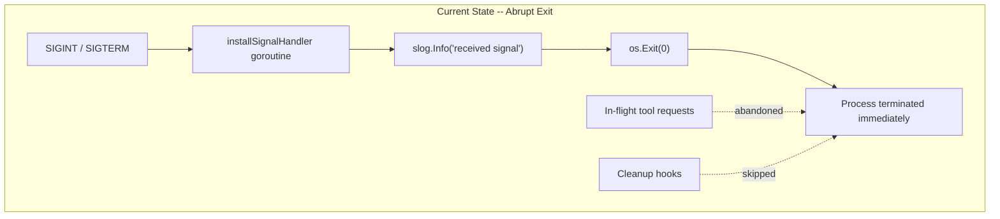
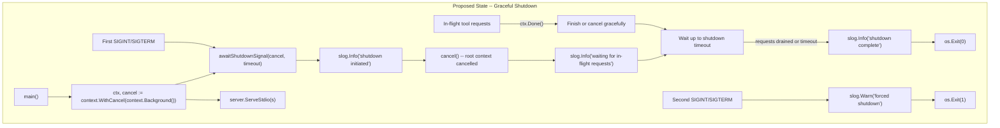
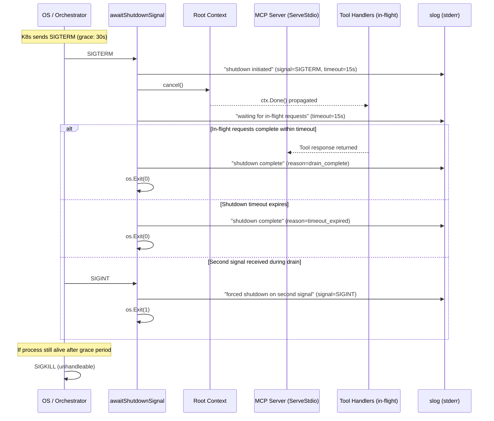
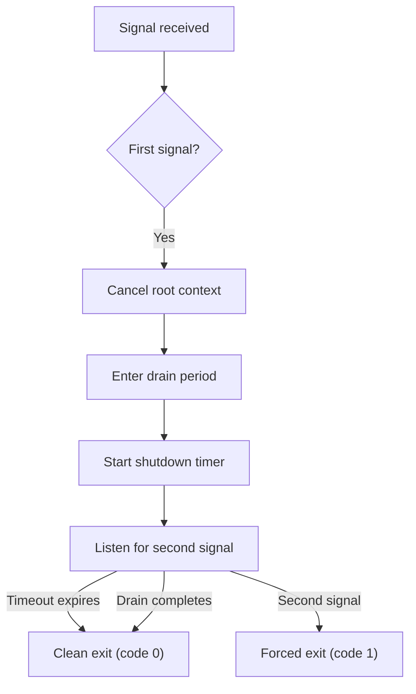
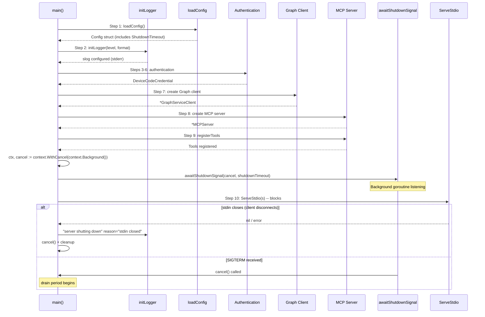
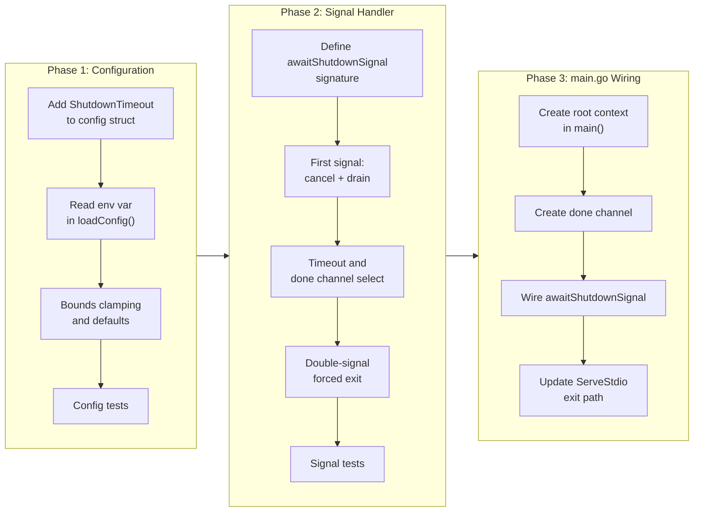

# Graceful Shutdown with Context Cancellation

## Change Summary

This CR replaces the abrupt `os.Exit(0)` signal handler in `signal.go` with a context-based graceful shutdown mechanism. Currently, when the server receives SIGINT or SIGTERM, the process terminates immediately with no opportunity for in-flight tool requests to complete, no cleanup, and no drain period. The desired future state is a server that propagates a root context cancellation through the entire request lifecycle, waits for in-flight requests to drain within a configurable timeout, logs structured shutdown phase information, and handles double-signal scenarios for forced immediate exit -- all compatible with container orchestrator (Kubernetes, Docker) grace period models.

## Motivation and Background

The Outlook Calendar MCP Server runs as a long-lived process that may handle concurrent tool requests via the MCP framework. When deployed in containerized environments (Kubernetes, Docker Compose), the orchestrator sends SIGTERM with a configurable grace period (Kubernetes default: 30 seconds) before escalating to SIGKILL. The current `installSignalHandler()` implementation calls `os.Exit(0)` immediately upon receiving the signal, which means:

1. **In-flight Graph API calls are abandoned** -- partial writes (e.g., a `create_event` mid-flight) may leave the calendar in an inconsistent state with no error reported to the MCP client.
2. **No cleanup is performed** -- file handles, network connections, and any future resource cleanup hooks are skipped.
3. **No observability** -- the only log message is "received signal, shutting down" before the process vanishes. Operators have no visibility into whether requests completed or were abandoned.
4. **Context cancellation is not propagated** -- tool handlers receive a `ctx` from the MCP framework, but there is no root context that the signal handler can cancel. The framework-provided context has no relationship to the process lifecycle.
5. **Container orchestrators waste their grace period** -- the process exits in milliseconds, but the orchestrator still waits for the full grace period before considering the pod terminated, adding unnecessary delay to rolling updates.

A context-based shutdown mechanism solves all of these issues by giving in-flight requests a bounded window to complete, providing structured shutdown phase logging, and allowing the process to exit cleanly before the orchestrator's SIGKILL.

## Change Drivers

* **Operational reliability:** In-flight Graph API write operations (create, update, delete, cancel) must not be silently abandoned during shutdown.
* **Container orchestrator compatibility:** Kubernetes and Docker send SIGTERM with a grace period; the server must use that time productively to drain requests.
* **Observability:** Operators need structured log messages for each shutdown phase to diagnose issues in production.
* **Context propagation:** The Go standard pattern of propagating cancellation through `context.Context` is not currently wired into the server lifecycle.
* **Double-signal safety:** Operators sending a second SIGINT/SIGTERM expect immediate exit, a standard Unix behavior pattern that the current implementation supports only incidentally (because the first signal already exits immediately).

## Current State

The current `signal.go` file contains a single function `installSignalHandler()` that creates a buffered channel, listens for SIGINT and SIGTERM, and calls `os.Exit(0)` in a background goroutine when a signal is received. There is no context propagation, no drain period, no shutdown timeout, and no double-signal handling. The `main()` function in `main.go` creates no root context -- it calls `installSignalHandler()` after tool registration and before `server.ServeStdio(s)`, which blocks on stdin.

### Current State Diagram



### Current Signal Handler Code

```go
func installSignalHandler() {
    sigCh := make(chan os.Signal, 1)
    signal.Notify(sigCh, syscall.SIGINT, syscall.SIGTERM)
    go func() {
        sig := <-sigCh
        slog.Info("received signal, shutting down", "signal", sig)
        os.Exit(0)
    }()
}
```

### Current main() Lifecycle (relevant excerpt)

```go
// Install signal handler for graceful shutdown
installSignalHandler()

// Step 10: Start stdio transport (blocks)
if err := server.ServeStdio(s); err != nil {
    slog.Error("stdio transport error", "error", err)
    os.Exit(1)
}

// Step 11: Shutdown
slog.Info("server shutting down", "reason", "stdin closed")
```

## Proposed Change

Replace the abrupt `os.Exit(0)` signal handler with a context-based graceful shutdown mechanism that:

1. Creates a root context with cancel in `main()` via `context.WithCancel(context.Background())`.
2. Replaces `installSignalHandler()` with `awaitShutdownSignal(cancel context.CancelFunc, timeout time.Duration)` that cancels the root context on SIGINT/SIGTERM instead of calling `os.Exit(0)`.
3. Introduces a configurable shutdown timeout via `OUTLOOK_MCP_SHUTDOWN_TIMEOUT_SECONDS` environment variable (default: 15 seconds).
4. After context cancellation, waits up to the shutdown timeout for in-flight requests to complete.
5. Logs structured shutdown phase messages: "shutdown initiated", "waiting for in-flight requests", "shutdown complete".
6. Handles double-signal: a second SIGINT/SIGTERM during the drain period forces immediate exit via `os.Exit(1)`.
7. Updates `main.go` to wire the root context into the shutdown flow.

### Proposed State Diagram



### Shutdown Sequence Diagram



### Double-Signal Handling Flow



### Updated main() Lifecycle



## Requirements

### Functional Requirements

1. The `main()` function **MUST** create a root context via `context.WithCancel(context.Background())` before starting the stdio transport.

2. The system **MUST** replace `installSignalHandler()` with `awaitShutdownSignal(cancel context.CancelFunc, timeout time.Duration)` in `signal.go`.

3. The `awaitShutdownSignal` function **MUST** listen for SIGINT and SIGTERM signals and call the provided `cancel` function when the first signal is received, instead of calling `os.Exit(0)`.

4. The system **MUST** read the `OUTLOOK_MCP_SHUTDOWN_TIMEOUT_SECONDS` environment variable to configure the shutdown timeout.

5. The system **MUST** default to 15 seconds when `OUTLOOK_MCP_SHUTDOWN_TIMEOUT_SECONDS` is unset or empty.

6. The system **MUST** parse the `OUTLOOK_MCP_SHUTDOWN_TIMEOUT_SECONDS` value as an integer. If parsing fails, the system **MUST** log a warning and fall back to the 15-second default.

7. After calling `cancel()`, the `awaitShutdownSignal` function **MUST** wait up to the configured shutdown timeout before exiting the process.

8. After the drain period completes (either by timeout expiration or in-flight request completion), the process **MUST** exit with code 0.

9. If a second SIGINT or SIGTERM is received during the drain period, the process **MUST** log a warning and exit immediately with code 1.

10. The system **MUST** log the following shutdown phase messages at the indicated levels:
    - `slog.Info("shutdown initiated", "signal", sig, "timeout_seconds", timeout.Seconds())` -- when the first signal is received.
    - `slog.Info("waiting for in-flight requests", "timeout_seconds", timeout.Seconds())` -- immediately after cancelling the context.
    - `slog.Info("shutdown complete", "reason", reason)` -- when the process is about to exit, where `reason` is either `"drain_complete"` or `"timeout_expired"`.
    - `slog.Warn("forced shutdown on second signal", "signal", sig)` -- when a second signal triggers immediate exit.

11. The `main.go` file **MUST** be updated to call `awaitShutdownSignal(cancel, shutdownTimeout)` instead of `installSignalHandler()`.

12. The `main.go` file **MUST** add `ShutdownTimeout` to the `config` struct, populated from `OUTLOOK_MCP_SHUTDOWN_TIMEOUT_SECONDS` via `loadConfig()`.

13. The `main.go` file **MUST** call `cancel()` in the normal stdin-close shutdown path (after `server.ServeStdio` returns) to ensure the root context is always cancelled on exit.

14. The `awaitShutdownSignal` function **MUST** run its signal-listening and drain logic in a background goroutine, returning immediately to the caller (non-blocking), consistent with the original `installSignalHandler` behavior.

15. The `awaitShutdownSignal` function **MUST** accept a `done <-chan struct{}` parameter (or equivalent mechanism) to be notified when in-flight requests have drained, allowing it to exit before the timeout if the drain completes early.

### Non-Functional Requirements

1. The shutdown mechanism **MUST** be compatible with Kubernetes SIGTERM grace period behavior (default 30 seconds), meaning the server **MUST** complete its shutdown within the configured timeout, which **MUST** be less than the orchestrator's grace period.

2. The shutdown timeout **MUST** be bounded between 1 and 300 seconds. Values outside this range **MUST** be clamped and a warning logged.

3. The `awaitShutdownSignal` function **MUST NOT** leak goroutines -- all goroutines spawned by the function **MUST** terminate when the process exits.

4. The shutdown mechanism **MUST NOT** corrupt the MCP JSON-RPC transport on stdout. No shutdown-related output **MUST** be written to stdout.

5. The graceful shutdown **MUST** add less than 1 millisecond of latency to normal (non-shutdown) request processing.

6. The implementation **MUST** use only Go standard library packages (`context`, `os`, `os/signal`, `syscall`, `time`, `strconv`, `log/slog`) -- no third-party dependencies.

## Affected Components

* `signal.go` -- complete rewrite: replace `installSignalHandler()` with `awaitShutdownSignal(cancel, timeout, done)`.
* `signal_test.go` -- complete rewrite: new tests for context cancellation, timeout, double-signal, and shutdown phase logging.
* `main.go` -- modifications: add `ShutdownTimeout` to `config` struct, add `OUTLOOK_MCP_SHUTDOWN_TIMEOUT_SECONDS` to `loadConfig()`, create root context, wire `awaitShutdownSignal`, call `cancel()` on stdin-close path.
* `main_test.go` -- additions: tests for the new `ShutdownTimeout` config field and env var parsing.

## Scope Boundaries

### In Scope

* Replacing `installSignalHandler()` with context-aware `awaitShutdownSignal()` in `signal.go`
* Creating root context with cancel in `main()`
* Configurable shutdown timeout via `OUTLOOK_MCP_SHUTDOWN_TIMEOUT_SECONDS` environment variable
* Shutdown phase logging (initiated, waiting, complete, forced)
* Double-signal handling for immediate forced exit
* Updating `main.go` to wire the new shutdown flow
* Adding `ShutdownTimeout` to the `config` struct and `loadConfig()`
* Comprehensive unit tests for the new shutdown mechanism
* Updating existing signal tests to match the new API

### Out of Scope ("Here, But Not Further")

* Passing the root context to tool handlers via the MCP framework -- the MCP framework (`mcp-go`) manages its own request contexts; wiring the root context into the framework's request dispatch is a separate concern.
* In-flight request tracking/counting -- this CR provides the context cancellation and timeout mechanism; an `sync.WaitGroup` or `atomic` counter for active requests would be a follow-up enhancement.
* HTTP/SSE transport shutdown -- the server uses stdio transport only; HTTP graceful shutdown (`http.Server.Shutdown`) is not applicable.
* Health check endpoints for Kubernetes readiness/liveness probes -- the stdio transport does not expose HTTP endpoints.
* Persistent state cleanup (e.g., flushing write-ahead logs, closing database connections) -- the server is stateless beyond the auth record, which is only written during initial authentication.
* Modifications to tool handler code to check for context cancellation -- tool handlers already receive `ctx` from the MCP framework and should already respect `ctx.Done()`; this CR does not modify individual tool handlers.

## Alternative Approaches Considered

* **`context.WithTimeout` on the root context:** Creating the root context with a built-in timeout instead of manually managing a timer after signal receipt. Rejected because the timeout should only start when a shutdown signal is received, not at process startup. A pre-configured timeout would cause the server to shut itself down after a fixed duration even without a signal.

* **`server.ServeStdio` with context parameter:** Passing a cancellable context to `ServeStdio` so the MCP framework can shut down its read loop when the context is cancelled. Rejected because `mcp-go`'s `ServeStdio` does not accept a context parameter -- it blocks on stdin until EOF. This is a limitation of the upstream library, not something this CR can change.

* **Channel-based shutdown coordination (no context):** Using a `done` channel passed from `main()` to the signal handler, with `main()` selecting on it. Rejected because `context.Context` is the idiomatic Go mechanism for cancellation propagation, is composable with tool handler contexts, and is understood by the entire Go ecosystem.

* **Keeping `os.Exit(0)` with a deferred cleanup function:** Adding `defer cleanup()` calls in `main()` and keeping the immediate exit. Rejected because `os.Exit` does not run deferred functions, making this approach unreliable.

## Impact Assessment

### User Impact

End users (MCP client operators) will experience cleaner disconnections. When the server is stopped via signal, in-flight tool calls will either complete within the timeout or be cancelled cleanly via context cancellation rather than being silently dropped. The MCP client will receive either a successful response (if the request completes during the drain period) or a context-cancelled error (if the timeout expires), rather than a broken pipe / connection reset.

### Technical Impact

* `signal.go` is completely rewritten -- the exported `installSignalHandler()` function is removed and replaced with `awaitShutdownSignal()`.
* `main.go` gains a root context, a new config field, and updated shutdown wiring.
* All existing signal tests must be rewritten to test the new behavior.
* No changes to tool handler files -- they continue to receive `ctx` from the MCP framework as before.
* No new external dependencies are introduced.
* The `config` struct gains one new field (`ShutdownTimeout`), and `loadConfig()` reads one new environment variable.

### Business Impact

* Reduces risk of data corruption during deployments -- rolling updates in Kubernetes will allow in-flight calendar write operations (create, update, delete, cancel) to complete before the pod is terminated.
* Improves operational confidence -- structured shutdown logging enables operators to verify that shutdowns are clean and no requests are being dropped.
* No additional infrastructure cost -- the change is purely in-process behavior.

## Implementation Approach

Implementation proceeds in three phases within a single PR.

### Phase 1: Configuration Extension

Add the shutdown timeout configuration to the `config` struct and `loadConfig()` function.

1. Add `ShutdownTimeout time.Duration` field to the `config` struct.
2. Read `OUTLOOK_MCP_SHUTDOWN_TIMEOUT_SECONDS` in `loadConfig()`, parse as integer, convert to `time.Duration`.
3. Apply default (15s) and bounds clamping (1s-300s) with warning on out-of-range.
4. Add unit tests for the new config field.

### Phase 2: Signal Handler Rewrite

Replace `installSignalHandler()` with `awaitShutdownSignal()`.

1. Define the new function signature: `awaitShutdownSignal(cancel context.CancelFunc, timeout time.Duration, done <-chan struct{})`.
2. First signal: log "shutdown initiated", call `cancel()`, log "waiting for in-flight requests", start timeout timer.
3. Select on: timeout expiration, `done` channel (drain complete), or second signal.
4. Log "shutdown complete" with reason on clean exit, or "forced shutdown" on second signal.
5. Write comprehensive unit tests using subprocess pattern (consistent with existing signal tests).

### Phase 3: main.go Wiring

Update `main()` to use the new shutdown mechanism.

1. Create `ctx, cancel := context.WithCancel(context.Background())` after tool registration.
2. Create a `done` channel that can be closed when ServeStdio returns.
3. Replace `installSignalHandler()` with `awaitShutdownSignal(cancel, cfg.ShutdownTimeout, done)`.
4. After `server.ServeStdio(s)` returns, call `cancel()` and close the `done` channel.
5. Update shutdown logging to include the reason.

### Implementation Flow



### Key Code Structures

The `awaitShutdownSignal` function:

```go
func awaitShutdownSignal(cancel context.CancelFunc, timeout time.Duration, done <-chan struct{}) {
    sigCh := make(chan os.Signal, 1)
    signal.Notify(sigCh, syscall.SIGINT, syscall.SIGTERM)
    go func() {
        // Wait for first signal.
        sig := <-sigCh
        slog.Info("shutdown initiated", "signal", sig, "timeout_seconds", timeout.Seconds())
        cancel()
        slog.Info("waiting for in-flight requests", "timeout_seconds", timeout.Seconds())

        // Wait for drain, timeout, or second signal.
        select {
        case <-time.After(timeout):
            slog.Info("shutdown complete", "reason", "timeout_expired")
            os.Exit(0)
        case <-done:
            slog.Info("shutdown complete", "reason", "drain_complete")
            os.Exit(0)
        case sig = <-sigCh:
            slog.Warn("forced shutdown on second signal", "signal", sig)
            os.Exit(1)
        }
    }()
}
```

The updated `config` struct addition:

```go
// ShutdownTimeout is the maximum duration to wait for in-flight requests
// to complete after a shutdown signal is received. Configurable via
// OUTLOOK_MCP_SHUTDOWN_TIMEOUT_SECONDS (default: 15, range: 1-300).
ShutdownTimeout time.Duration
```

The updated `loadConfig()` addition:

```go
shutdownStr := getEnv("OUTLOOK_MCP_SHUTDOWN_TIMEOUT_SECONDS", "15")
shutdownSec, err := strconv.Atoi(shutdownStr)
if err != nil {
    slog.Warn("invalid OUTLOOK_MCP_SHUTDOWN_TIMEOUT_SECONDS, using default",
        "value", shutdownStr, "default", 15)
    shutdownSec = 15
}
if shutdownSec < 1 {
    slog.Warn("OUTLOOK_MCP_SHUTDOWN_TIMEOUT_SECONDS below minimum, clamping to 1",
        "value", shutdownSec)
    shutdownSec = 1
} else if shutdownSec > 300 {
    slog.Warn("OUTLOOK_MCP_SHUTDOWN_TIMEOUT_SECONDS above maximum, clamping to 300",
        "value", shutdownSec)
    shutdownSec = 300
}
cfg.ShutdownTimeout = time.Duration(shutdownSec) * time.Second
```

The updated `main()` shutdown wiring:

```go
// Create root context for graceful shutdown.
ctx, cancel := context.WithCancel(context.Background())
defer cancel()

// Create done channel to signal when ServeStdio returns.
done := make(chan struct{})

// Install context-aware shutdown handler.
awaitShutdownSignal(cancel, cfg.ShutdownTimeout, done)

// Step 10: Start stdio transport (blocks).
if err := server.ServeStdio(s); err != nil {
    slog.Error("stdio transport error", "error", err)
    cancel()
    close(done)
    os.Exit(1)
}

// Step 11: Shutdown (stdin closed path).
slog.Info("server shutting down", "reason", "stdin closed")
cancel()
close(done)
```

## Test Strategy

### Tests to Add

| Test File | Test Name | Description | Inputs | Expected Output |
|-----------|-----------|-------------|--------|-----------------|
| `signal_test.go` | `TestAwaitShutdownSignal_NonBlocking` | Validates that `awaitShutdownSignal` returns immediately without blocking the caller | Valid cancel func, 5s timeout, open done channel | Function returns without blocking |
| `signal_test.go` | `TestAwaitShutdownSignal_SIGTERM_CancelsContext` | Validates that SIGTERM causes the cancel function to be called | Subprocess: install handler, send SIGTERM, check context | Context is cancelled (ctx.Err() == context.Canceled) |
| `signal_test.go` | `TestAwaitShutdownSignal_SIGINT_CancelsContext` | Validates that SIGINT causes the cancel function to be called | Subprocess: install handler, send SIGINT, check context | Context is cancelled (ctx.Err() == context.Canceled) |
| `signal_test.go` | `TestAwaitShutdownSignal_ExitCode0_OnTimeout` | Validates that process exits with code 0 when shutdown timeout expires | Subprocess: install handler with 1s timeout, send SIGTERM, do not close done | Exit code 0 after ~1s |
| `signal_test.go` | `TestAwaitShutdownSignal_ExitCode0_OnDrainComplete` | Validates that process exits with code 0 when done channel is closed before timeout | Subprocess: install handler with 10s timeout, send SIGTERM, close done immediately | Exit code 0 immediately (well before 10s) |
| `signal_test.go` | `TestAwaitShutdownSignal_ExitCode1_OnDoubleSignal` | Validates that a second signal during drain causes exit with code 1 | Subprocess: install handler with 10s timeout, send SIGTERM, then send SIGINT | Exit code 1 |
| `signal_test.go` | `TestAwaitShutdownSignal_LogsShutdownInitiated` | Validates "shutdown initiated" log message on first signal | Subprocess: send SIGTERM, capture stderr | stderr contains "shutdown initiated" |
| `signal_test.go` | `TestAwaitShutdownSignal_LogsWaitingForInflight` | Validates "waiting for in-flight requests" log message | Subprocess: send SIGTERM, capture stderr | stderr contains "waiting for in-flight requests" |
| `signal_test.go` | `TestAwaitShutdownSignal_LogsShutdownComplete` | Validates "shutdown complete" log message with reason | Subprocess: send SIGTERM, wait for timeout, capture stderr | stderr contains "shutdown complete" with reason |
| `signal_test.go` | `TestAwaitShutdownSignal_LogsForcedShutdown` | Validates "forced shutdown on second signal" warning on double signal | Subprocess: send SIGTERM then SIGINT, capture stderr | stderr contains "forced shutdown on second signal" |
| `main_test.go` | `TestLoadConfig_ShutdownTimeoutDefault` | Validates default shutdown timeout of 15 seconds | No env var set | `cfg.ShutdownTimeout == 15 * time.Second` |
| `main_test.go` | `TestLoadConfig_ShutdownTimeoutCustom` | Validates custom shutdown timeout from env var | `OUTLOOK_MCP_SHUTDOWN_TIMEOUT_SECONDS=30` | `cfg.ShutdownTimeout == 30 * time.Second` |
| `main_test.go` | `TestLoadConfig_ShutdownTimeoutInvalid` | Validates fallback to default on unparseable value | `OUTLOOK_MCP_SHUTDOWN_TIMEOUT_SECONDS=abc` | `cfg.ShutdownTimeout == 15 * time.Second` |
| `main_test.go` | `TestLoadConfig_ShutdownTimeoutClampMin` | Validates clamping to minimum of 1 second | `OUTLOOK_MCP_SHUTDOWN_TIMEOUT_SECONDS=0` | `cfg.ShutdownTimeout == 1 * time.Second` |
| `main_test.go` | `TestLoadConfig_ShutdownTimeoutClampMax` | Validates clamping to maximum of 300 seconds | `OUTLOOK_MCP_SHUTDOWN_TIMEOUT_SECONDS=999` | `cfg.ShutdownTimeout == 300 * time.Second` |

### Tests to Modify

| Test File | Test Name | Modification | Reason |
|-----------|-----------|--------------|--------|
| `signal_test.go` | `TestInstallSignalHandler` | Remove entirely | `installSignalHandler()` is replaced by `awaitShutdownSignal()` |
| `signal_test.go` | `TestSignalHandler_SIGTERM` | Remove entirely | Replaced by `TestAwaitShutdownSignal_SIGTERM_CancelsContext` and `TestAwaitShutdownSignal_ExitCode0_OnTimeout` |
| `signal_test.go` | `TestSignalHandler_SIGINT` | Remove entirely | Replaced by `TestAwaitShutdownSignal_SIGINT_CancelsContext` |
| `signal_test.go` | `TestSignalHelper` | Rewrite | Must use `awaitShutdownSignal` instead of `installSignalHandler` |
| `signal_test.go` | `testSignalExit` | Rewrite | Must verify context cancellation and exit code behavior |
| `main_test.go` | `TestLoadConfigDefaults` | Extend | Must verify `ShutdownTimeout` default value |
| `main_test.go` | `TestLoadConfigCustomValues` | Extend | Must include `OUTLOOK_MCP_SHUTDOWN_TIMEOUT_SECONDS` |
| `main_test.go` | `clearOutlookEnvVars` | Extend | Must include `OUTLOOK_MCP_SHUTDOWN_TIMEOUT_SECONDS` in the list |

### Tests to Remove

| Test File | Test Name | Reason |
|-----------|-----------|--------|
| `signal_test.go` | `TestInstallSignalHandler` | `installSignalHandler()` no longer exists |
| `signal_test.go` | `TestSignalHandler_SIGTERM` | Replaced by new context-aware tests |
| `signal_test.go` | `TestSignalHandler_SIGINT` | Replaced by new context-aware tests |

## Acceptance Criteria

### AC-1: Root context created in main

```gherkin
Given the main() function is executing
When the server reaches the shutdown handler installation step
Then a root context MUST be created via context.WithCancel(context.Background())
  And the cancel function MUST be passed to awaitShutdownSignal
  And the cancel function MUST be called when server.ServeStdio returns (stdin-close path)
```

### AC-2: First SIGTERM cancels root context

```gherkin
Given the server is running with awaitShutdownSignal installed
  And a root context has been created
When the process receives a SIGTERM signal
Then the cancel function MUST be called, cancelling the root context
  And the server MUST log "shutdown initiated" at info level with signal and timeout_seconds
  And the server MUST NOT call os.Exit immediately
```

### AC-3: First SIGINT cancels root context

```gherkin
Given the server is running with awaitShutdownSignal installed
  And a root context has been created
When the process receives a SIGINT signal
Then the cancel function MUST be called, cancelling the root context
  And the server MUST log "shutdown initiated" at info level with signal and timeout_seconds
  And the server MUST NOT call os.Exit immediately
```

### AC-4: Drain period waits up to shutdown timeout

```gherkin
Given a shutdown signal has been received and the root context is cancelled
When the drain period begins
Then the server MUST log "waiting for in-flight requests" at info level
  And the server MUST wait up to OUTLOOK_MCP_SHUTDOWN_TIMEOUT_SECONDS before exiting
  And if the timeout expires the server MUST log "shutdown complete" with reason "timeout_expired"
  And the process MUST exit with code 0
```

### AC-5: Early exit when drain completes

```gherkin
Given a shutdown signal has been received and the drain period has started
When all in-flight requests complete before the timeout (done channel is closed)
Then the server MUST log "shutdown complete" with reason "drain_complete"
  And the process MUST exit with code 0
  And the process MUST NOT wait for the full timeout duration
```

### AC-6: Double signal forces immediate exit

```gherkin
Given a first signal has been received and the drain period is active
When a second SIGINT or SIGTERM signal is received during the drain period
Then the server MUST log "forced shutdown on second signal" at warn level with the signal name
  And the process MUST exit immediately with code 1
```

### AC-7: Shutdown timeout defaults to 15 seconds

```gherkin
Given the OUTLOOK_MCP_SHUTDOWN_TIMEOUT_SECONDS environment variable is not set
When loadConfig() is called
Then cfg.ShutdownTimeout MUST be 15 * time.Second
```

### AC-8: Shutdown timeout is configurable

```gherkin
Given the OUTLOOK_MCP_SHUTDOWN_TIMEOUT_SECONDS environment variable is set to "30"
When loadConfig() is called
Then cfg.ShutdownTimeout MUST be 30 * time.Second
```

### AC-9: Invalid shutdown timeout falls back to default

```gherkin
Given the OUTLOOK_MCP_SHUTDOWN_TIMEOUT_SECONDS environment variable is set to "abc"
When loadConfig() is called
Then a warning MUST be logged indicating the invalid value
  And cfg.ShutdownTimeout MUST be 15 * time.Second
```

### AC-10: Shutdown timeout is clamped to valid range

```gherkin
Given the OUTLOOK_MCP_SHUTDOWN_TIMEOUT_SECONDS environment variable is set to "0"
When loadConfig() is called
Then a warning MUST be logged indicating the value is below minimum
  And cfg.ShutdownTimeout MUST be 1 * time.Second

Given the OUTLOOK_MCP_SHUTDOWN_TIMEOUT_SECONDS environment variable is set to "999"
When loadConfig() is called
Then a warning MUST be logged indicating the value is above maximum
  And cfg.ShutdownTimeout MUST be 300 * time.Second
```

### AC-11: Stdin-close path cancels context

```gherkin
Given the server is running and the stdio transport is active
When the MCP client disconnects (stdin closes, server.ServeStdio returns)
Then main() MUST call cancel() on the root context
  And main() MUST close the done channel
  And main() MUST log "server shutting down" with reason "stdin closed"
```

### AC-12: Structured shutdown phase logging

```gherkin
Given the server receives a shutdown signal
When the shutdown sequence executes
Then the log output MUST contain four distinct phase messages in order:
  1. "shutdown initiated" at info level with signal and timeout_seconds attributes
  2. "waiting for in-flight requests" at info level with timeout_seconds attribute
  3. Either "shutdown complete" at info level with reason attribute
     OR "forced shutdown on second signal" at warn level with signal attribute
```

### AC-13: No stdout corruption during shutdown

```gherkin
Given the server is shutting down
When shutdown phase log messages are emitted
Then all messages MUST be written to stderr
  And no shutdown-related output MUST appear on stdout
  And the MCP JSON-RPC transport MUST NOT be corrupted
```

### AC-14: Container orchestrator compatibility

```gherkin
Given the server is running in a Kubernetes pod with terminationGracePeriodSeconds=30
  And OUTLOOK_MCP_SHUTDOWN_TIMEOUT_SECONDS is set to "15"
When Kubernetes sends SIGTERM to the pod
Then the server MUST complete its shutdown within 15 seconds
  And the server MUST exit with code 0 before the 30-second SIGKILL
  And the pod MUST transition to Terminated state without requiring SIGKILL
```

## Quality Standards Compliance

### Build & Compilation

- [ ] Code compiles/builds without errors
- [ ] No new compiler warnings introduced

### Linting & Code Style

- [ ] All linter checks pass with zero warnings/errors
- [ ] Code follows project coding conventions and style guides
- [ ] Any linter exceptions are documented with justification

### Test Execution

- [ ] All existing tests pass after implementation
- [ ] All new tests pass
- [ ] Test coverage meets project requirements for changed code

### Documentation

- [ ] Inline code documentation updated where applicable
- [ ] API documentation updated for any API changes
- [ ] User-facing documentation updated if behavior changes

### Code Review

- [ ] Changes submitted via pull request
- [ ] PR title follows Conventional Commits format
- [ ] Code review completed and approved
- [ ] Changes squash-merged to maintain linear history

### Verification Commands

```bash
# Build verification
go build ./...

# Lint verification
golangci-lint run

# Test execution
go test ./... -v

# Test coverage
go test ./... -coverprofile=coverage.out
go tool cover -func=coverage.out

# Race condition detection (important for concurrent shutdown logic)
go test -race ./...

# Verify no stdout pollution during shutdown (manual check)
# Run the binary, send SIGTERM, confirm only stderr output
```

## Risks and Mitigation

### Risk 1: mcp-go ServeStdio does not respect context cancellation

**Likelihood:** high
**Impact:** medium
**Mitigation:** `server.ServeStdio` blocks on stdin and does not accept a context parameter. The root context cancellation will not cause `ServeStdio` to return -- it will continue blocking until stdin closes. This means the shutdown handler's drain period runs concurrently with an active `ServeStdio`. The process will exit via `os.Exit(0)` from the signal handler goroutine after the timeout, which is acceptable because all log messages have been written and the MCP client will see a broken pipe. Document this limitation clearly. A future enhancement could involve closing stdin to force `ServeStdio` to return.

### Risk 2: Race condition between signal handler exit and main goroutine

**Likelihood:** medium
**Impact:** low
**Mitigation:** The signal handler goroutine calls `os.Exit()` which terminates all goroutines atomically. There is no risk of partial state corruption. The `cancel()` call happens before the drain wait, ensuring the context is cancelled before any exit path. The `done` channel is closed in the main goroutine after `ServeStdio` returns, and read by the signal handler goroutine -- this is safe because channel close is visible to all readers.

### Risk 3: Shutdown timeout too short for large Graph API responses

**Likelihood:** low
**Impact:** medium
**Mitigation:** The default timeout is 15 seconds, which is generous for individual Graph API calls (typical response time: 200ms-2s). Operators can increase the timeout via `OUTLOOK_MCP_SHUTDOWN_TIMEOUT_SECONDS` up to 300 seconds. The timeout should be set to less than the orchestrator's grace period (Kubernetes default: 30s) to allow for clean exit before SIGKILL.

### Risk 4: Double-signal exit code 1 confuses orchestrators

**Likelihood:** low
**Impact:** low
**Mitigation:** Exit code 1 from a forced shutdown is appropriate -- it signals to the orchestrator that the shutdown was not clean. Kubernetes treats any non-zero exit code as a failed termination, which may trigger alerts. This is the desired behavior: operators should be alerted when a forced shutdown occurs. The double-signal scenario should be rare in automated environments (orchestrators send only one SIGTERM).

### Risk 5: Tests using subprocess pattern are flaky on CI

**Likelihood:** medium
**Impact:** medium
**Mitigation:** The existing signal tests already use the subprocess pattern (`exec.Command` + `cmd.Process.Signal`) and have proven stable. The new tests follow the same pattern. Use generous timing margins (500ms sleep for handler installation, 2x timeout for assertions). Skip tests on Windows where SIGTERM is not supported. Add `-race` flag to test execution to catch concurrency issues.

## Dependencies

* **CR-0001 (Configuration):** Required for `loadConfig()` function and `config` struct that will be extended with `ShutdownTimeout`.
* **CR-0002 (Logging):** Required for `slog` structured logging infrastructure used by all shutdown phase messages.
* **CR-0004 (Server Bootstrap):** Required for `main()` function, `installSignalHandler()` (being replaced), and `server.ServeStdio` call site.

## Estimated Effort

| Component | Estimate |
|-----------|----------|
| Add `ShutdownTimeout` to `config` struct and `loadConfig()` | 1 hour |
| Rewrite `signal.go` with `awaitShutdownSignal()` | 2 hours |
| Update `main.go` shutdown wiring (root context, done channel) | 1 hour |
| Rewrite `signal_test.go` with new test cases | 3 hours |
| Add config tests in `main_test.go` | 1 hour |
| Race condition testing and CI verification | 1 hour |
| Code review and revisions | 1 hour |
| **Total** | **10 hours** |

## Decision Outcome

Chosen approach: "Context-based cancellation with configurable drain timeout and double-signal forced exit", because it follows the idiomatic Go pattern for lifecycle management (`context.WithCancel`), is compatible with container orchestrator signal semantics (SIGTERM -> grace period -> SIGKILL), provides structured observability into shutdown phases, and handles the edge case of an impatient operator sending a second signal. The approach is minimally invasive to the existing codebase -- only `signal.go` and `main.go` are modified, and no tool handler code changes are required.

## Related Items

* Related change requests: CR-0001 (Configuration), CR-0002 (Logging), CR-0004 (Server Bootstrap)
* Supersedes: The `installSignalHandler()` function introduced in CR-0004
* Key libraries: Go standard library (`context`, `os/signal`, `syscall`, `time`)
* Kubernetes reference: [Pod Termination](https://kubernetes.io/docs/concepts/workloads/pods/pod-lifecycle/#pod-termination) -- SIGTERM + terminationGracePeriodSeconds + SIGKILL lifecycle
* Docker reference: [docker stop](https://docs.docker.com/reference/cli/docker/container/stop/) -- SIGTERM + timeout + SIGKILL
