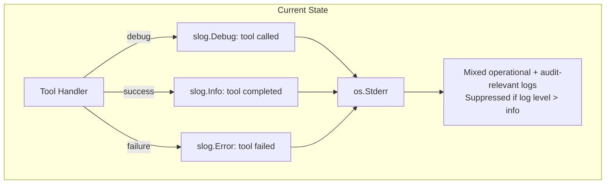
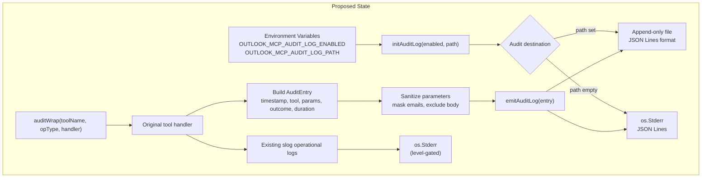
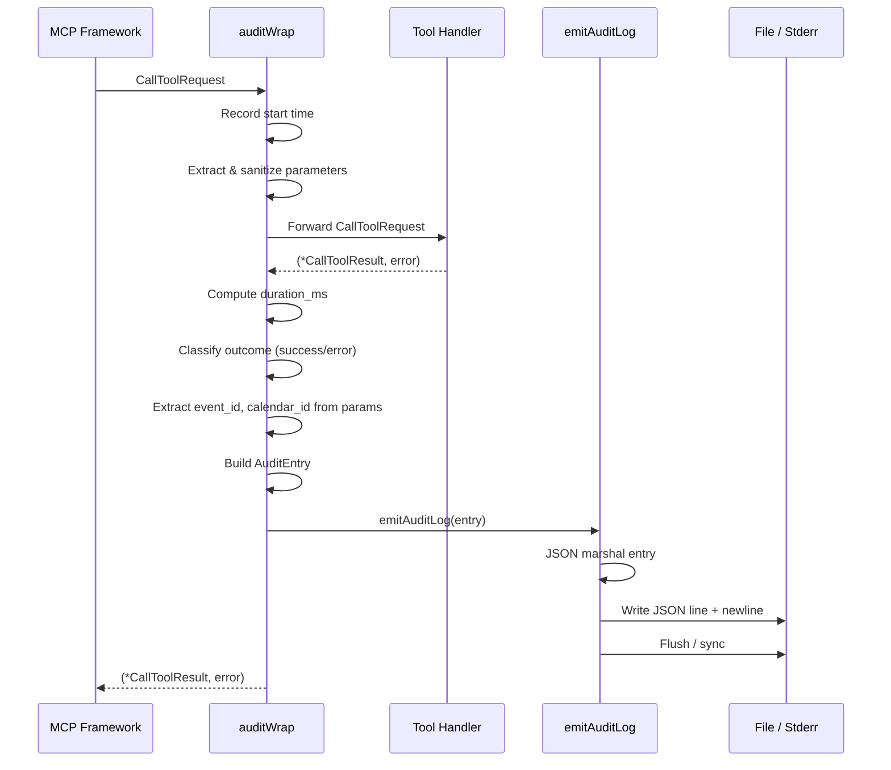
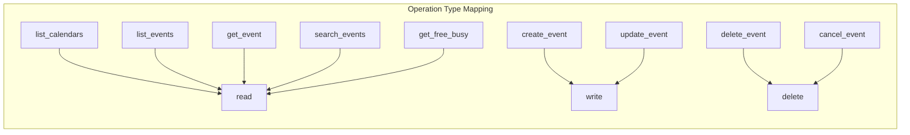
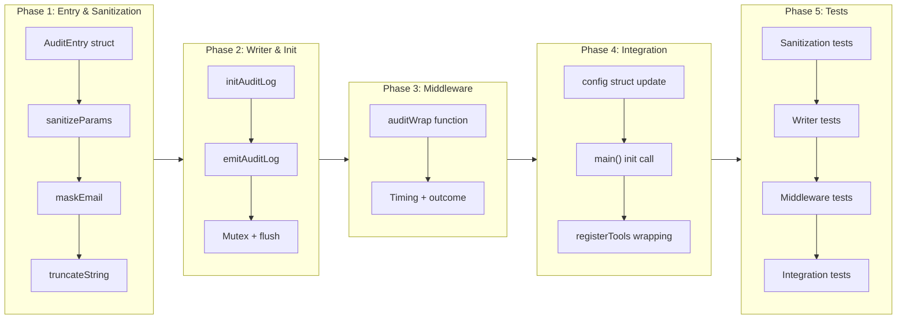
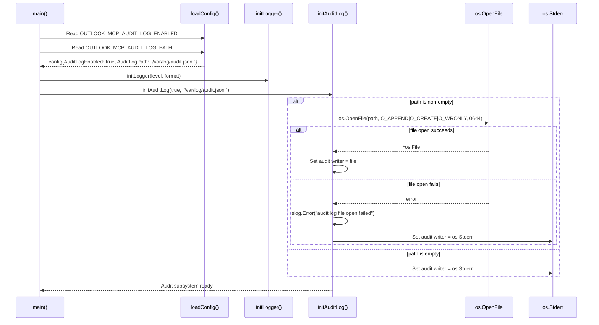

# Audit Logging

## Change Summary

The Outlook Calendar MCP Server currently emits operational logs via `slog` to stderr at various levels (debug, info, warn, error), but these logs are not structured for compliance or audit purposes. This CR introduces a dedicated audit logging subsystem that produces a structured, append-only audit trail of every tool invocation. Each audit entry records which tool was called, with what parameters (sanitized), what the outcome was, and how long it took. Audit entries can be written to a separate file in JSON Lines format or to stderr alongside operational logs, controlled by environment variables. The implementation uses a middleware/wrapper pattern so that existing tool handlers require minimal modification.

## Motivation and Background

Enterprise compliance requirements demand a clear, machine-parseable record of who did what, when, to which resource, and what the outcome was. The current operational logs mix audit-relevant information with debug diagnostics, making it difficult to extract a reliable audit trail. Write operations (`create_event`, `update_event`, `delete_event`, `cancel_event`) are especially audit-critical because they modify server-side state and trigger side effects (sending meeting invitations, cancellation notices). A dedicated audit log provides a single source of truth for compliance audits, security reviews, and incident investigations.

Additionally, the operational log level may be set to `warn` or `error` in production, suppressing the `info`-level tool completion messages. The audit log operates independently of the operational log level, ensuring that every tool invocation is recorded regardless of the configured `slog` threshold.

## Change Drivers

* **Enterprise compliance**: organizations require an auditable record of all calendar operations performed by the MCP server
* **Security visibility**: write and delete operations modify Exchange data and send emails on behalf of the user; these must be tracked
* **Separation of concerns**: operational diagnostics and audit records serve different audiences and retention requirements
* **Log level independence**: audit entries must be emitted regardless of the `OUTLOOK_MCP_LOG_LEVEL` setting
* **Privacy**: audit logs must sanitize sensitive data (email addresses, event body content) while preserving operational utility

## Current State

The server uses `log/slog` for all logging (CR-0002). Each tool handler follows a consistent pattern:

1. Creates a child logger with `slog.With("tool", toolName)`
2. Logs at `debug` level on entry with parameters
3. Logs at `info` level on successful completion with duration and result count
4. Logs at `error` level on failure with the error message

These operational logs are useful for debugging but are not structured for audit purposes: they lack a standardized schema, do not classify operation types, do not sanitize sensitive data, and are suppressed when the log level is set above `info`.

### Current State Diagram



## Proposed Change

Introduce a dedicated audit logging subsystem consisting of:

1. An `AuditEntry` struct with a standardized schema for all audit-relevant fields.
2. An `emitAuditLog(entry AuditEntry)` function that serializes the entry as a JSON line and writes it to the configured destination (separate file or stderr).
3. An `auditWrap` middleware function that wraps any MCP tool handler, automatically measuring duration, capturing parameters, recording the outcome, and emitting an audit entry after each invocation.
4. Sanitization functions that mask email addresses and exclude sensitive content from audit entries.
5. Two new environment variables: `OUTLOOK_MCP_AUDIT_LOG_ENABLED` (default: `"true"`) and `OUTLOOK_MCP_AUDIT_LOG_PATH` (default: `""` meaning stderr).

The `auditWrap` pattern allows existing tool handlers to remain unchanged -- the audit wrapper is applied at registration time in `registerTools`.

### Proposed State Diagram



### Audit Middleware Sequence



### Operation Type Classification



## Requirements

### Functional Requirements

1. The system **MUST** define an `AuditEntry` struct with the following fields: `Timestamp` (RFC 3339 string), `ToolName` (string), `OperationType` (string: `"read"`, `"write"`, or `"delete"`), `Parameters` (map of sanitized parameter key-value pairs), `Outcome` (string: `"success"` or `"error"`), `DurationMs` (int64 milliseconds), `ErrorMessage` (string, empty on success), `EventID` (string, empty if not applicable), `CalendarID` (string, empty if not applicable).
2. The system **MUST** classify each tool's operation type as follows: `read` for `list_calendars`, `list_events`, `get_event`, `search_events`, `get_free_busy`; `write` for `create_event`, `update_event`; `delete` for `delete_event`, `cancel_event`.
3. The system **MUST** implement an `emitAuditLog(entry AuditEntry)` function that serializes the entry as a single JSON line and writes it to the configured destination, followed by a newline character.
4. The system **MUST** flush the output writer after each audit entry to ensure crash safety (no buffered entries lost on unexpected termination).
5. The system **MUST** implement an `auditWrap(toolName, opType string, handler mcp.ToolHandlerFunc) mcp.ToolHandlerFunc` function that wraps a tool handler to automatically emit an audit entry after each invocation.
6. The `auditWrap` function **MUST** record the start time before calling the inner handler, compute the duration after the handler returns, classify the outcome based on the result (error if `CallToolResult.IsError` is true or the error return is non-nil), and emit the audit entry via `emitAuditLog`.
7. The system **MUST** read the `OUTLOOK_MCP_AUDIT_LOG_ENABLED` environment variable at startup; when set to `"false"` (case-insensitive), the audit log subsystem **MUST** be disabled and `emitAuditLog` **MUST** be a no-op.
8. The system **MUST** read the `OUTLOOK_MCP_AUDIT_LOG_PATH` environment variable at startup; when set to a non-empty path, the system **MUST** open the file in append-only mode (`os.O_APPEND|os.O_CREATE|os.O_WRONLY`) and write all audit entries to that file.
9. When `OUTLOOK_MCP_AUDIT_LOG_PATH` is empty (the default), the system **MUST** write audit entries to `os.Stderr` alongside operational logs.
10. The system **MUST** sanitize parameters before including them in audit entries: the `body` parameter **MUST** be excluded entirely, string values longer than 200 characters **MUST** be truncated with a `"...[truncated]"` suffix, and email addresses **MUST** be masked to show only the first character and the domain (e.g., `"alice@example.com"` becomes `"a***@example.com"`).
11. The system **MUST** extract `event_id` and `calendar_id` from the tool parameters (when present) and include them as top-level fields in the audit entry for easy filtering.
12. The `auditWrap` function **MUST** be applied to all nine tool handlers in `registerTools`, replacing direct handler registration with wrapped handlers.
13. The audit log **MUST** operate independently of the operational `slog` log level -- audit entries are emitted even when `OUTLOOK_MCP_LOG_LEVEL` is set to `"error"`.
14. The system **MUST** implement an `initAuditLog(enabled bool, path string)` function that initializes the audit subsystem at startup, called from `main()` after `loadConfig`.
15. If the audit log file cannot be opened at startup, the system **MUST** log an `slog.Error` message and fall back to writing audit entries to `os.Stderr`.

### Non-Functional Requirements

1. The audit entry JSON serialization and write **MUST** complete in under 1 millisecond per entry under normal conditions to avoid adding perceptible latency to tool invocations.
2. The audit log **MUST** be append-only; the system **MUST NOT** seek, truncate, or overwrite existing entries.
3. Each audit log line **MUST** be a valid, self-contained JSON object (JSON Lines format) suitable for consumption by log aggregation tools such as `jq`, Splunk, or ELK.
4. The audit subsystem **MUST** not introduce any additional external dependencies beyond the Go standard library.
5. The audit subsystem **MUST** be safe for concurrent use if multiple tool invocations execute simultaneously (use a `sync.Mutex` to serialize writes).

## Affected Components

* `audit.go` -- new file: `AuditEntry` struct, `initAuditLog`, `emitAuditLog`, `auditWrap`, sanitization helpers
* `audit_test.go` -- new file: unit tests for all audit logging functions
* `main.go` -- add `AuditLogEnabled` and `AuditLogPath` fields to `config` struct, add `OUTLOOK_MCP_AUDIT_LOG_ENABLED` and `OUTLOOK_MCP_AUDIT_LOG_PATH` to `loadConfig`, call `initAuditLog` in `main()`
* `server.go` -- modify `registerTools` to wrap all tool handlers with `auditWrap`

## Scope Boundaries

### In Scope

* `AuditEntry` struct definition and JSON serialization
* `emitAuditLog` function with file and stderr output
* `auditWrap` middleware function for MCP tool handlers
* `initAuditLog` initialization function with file open and fallback
* Parameter sanitization: body exclusion, string truncation, email masking
* Operation type classification for all nine tools
* Environment variable configuration (`OUTLOOK_MCP_AUDIT_LOG_ENABLED`, `OUTLOOK_MCP_AUDIT_LOG_PATH`)
* Mutex-based concurrency safety for audit writes
* Integration with `registerTools` via wrapper application
* Unit tests for all new functions

### Out of Scope ("Here, But Not Further")

* Audit log rotation -- handled by external tooling (logrotate, etc.)
* Audit log shipping to remote systems -- handled by log aggregation infrastructure
* Audit log encryption at rest -- handled by filesystem-level encryption
* Per-user identity tracking beyond the single authenticated user -- the server authenticates as one user via device code flow; multi-user audit trails require a different authentication model
* Audit log retention policies -- managed externally
* Audit log search or query API -- consumers use standard tools (grep, jq, etc.)
* Modification of existing operational log statements in tool handlers -- the audit wrapper operates independently

## Alternative Approaches Considered

* **Embedding audit fields in existing slog calls**: Rejected because slog output is gated by the configured log level. Setting `OUTLOOK_MCP_LOG_LEVEL=error` would suppress all audit records emitted at `info` level. The audit log must be independent of operational log levels.
* **Using a separate slog.Logger instance with its own handler for audit**: Considered but rejected because it would require managing a parallel logger configuration and would still produce slog-formatted output rather than a clean JSON Lines audit trail with a dedicated schema.
* **Database-backed audit log (SQLite)**: Rejected as over-engineering for a single-binary MCP server. Introduces an external dependency and filesystem complexity. JSON Lines files are simpler, portable, and easily consumed by existing log infrastructure.
* **Audit log as a separate MCP tool**: Rejected because audit logging should be automatic and transparent, not dependent on the MCP client choosing to call an audit tool.

## Impact Assessment

### User Impact

No user-facing behavior changes. The audit log is a backend concern. When `OUTLOOK_MCP_AUDIT_LOG_PATH` is configured, audit entries are written to the specified file without affecting the MCP protocol stream or operational logs. When writing to stderr (default), audit entries appear alongside operational logs but are distinguishable by their JSON schema (presence of `"audit":true` field).

### Technical Impact

* **Minimal handler modification**: the `auditWrap` middleware is applied at registration time in `registerTools`; individual tool handler files are not modified.
* **New configuration fields**: two new environment variables and corresponding `config` struct fields.
* **Startup sequence change**: `initAuditLog` is called after `loadConfig` and `initLogger` in `main()`.
* **Concurrency**: a `sync.Mutex` protects the audit writer, adding negligible contention since tool invocations are typically sequential in an MCP stdio transport.
* **File handle**: when using file output, a file descriptor is held open for the server's lifetime and closed on shutdown.

### Business Impact

* Enables compliance with enterprise audit requirements for calendar automation
* Provides forensic capability for investigating unintended calendar modifications
* Reduces risk of deploying the MCP server in regulated environments

## Implementation Approach

### Phase 1: Audit Entry and Sanitization

Define the `AuditEntry` struct, the operation type classification, and the sanitization functions (email masking, body exclusion, string truncation).

```go
// AuditEntry represents a single audit log record emitted after each tool
// invocation. It captures the tool name, operation classification, sanitized
// parameters, outcome, timing, and relevant resource identifiers.
type AuditEntry struct {
    Audit         bool              `json:"audit"`
    Timestamp     string            `json:"timestamp"`
    ToolName      string            `json:"tool_name"`
    OperationType string            `json:"operation_type"`
    Parameters    map[string]string `json:"parameters"`
    Outcome       string            `json:"outcome"`
    DurationMs    int64             `json:"duration_ms"`
    ErrorMessage  string            `json:"error_message,omitempty"`
    EventID       string            `json:"event_id,omitempty"`
    CalendarID    string            `json:"calendar_id,omitempty"`
}
```

### Phase 2: Audit Writer and Initialization

Implement `initAuditLog` (file open with fallback to stderr), `emitAuditLog` (JSON marshal + write + flush), and the module-level state (writer, mutex, enabled flag).

### Phase 3: Audit Middleware

Implement `auditWrap` that wraps a tool handler function, captures timing, extracts and sanitizes parameters, classifies the outcome, and calls `emitAuditLog`.

### Phase 4: Integration

Modify `main.go` to add the new config fields and call `initAuditLog`. Modify `server.go` to apply `auditWrap` to all nine tool registrations.

### Phase 5: Testing

Write unit tests for sanitization, audit entry construction, file output, stderr fallback, disabled mode, and the middleware wrapper.

### Implementation Flow



### Audit Initialization Sequence



## Test Strategy

### Tests to Add

| Test File | Test Name | Description | Inputs | Expected Output |
|-----------|-----------|-------------|--------|-----------------|
| `audit_test.go` | `TestMaskEmail_Standard` | Validates standard email masking | `"alice@example.com"` | `"a***@example.com"` |
| `audit_test.go` | `TestMaskEmail_SingleChar` | Validates masking when local part is one character | `"a@example.com"` | `"a***@example.com"` |
| `audit_test.go` | `TestMaskEmail_NoAtSign` | Validates non-email strings are returned unchanged | `"not-an-email"` | `"not-an-email"` |
| `audit_test.go` | `TestMaskEmail_Empty` | Validates empty string input | `""` | `""` |
| `audit_test.go` | `TestTruncateString_Short` | Validates short strings are not truncated | `"hello"` (limit 200) | `"hello"` |
| `audit_test.go` | `TestTruncateString_Exact` | Validates strings at the limit are not truncated | 200-char string (limit 200) | unchanged |
| `audit_test.go` | `TestTruncateString_Long` | Validates long strings are truncated with suffix | 250-char string (limit 200) | first 200 chars + `"...[truncated]"` |
| `audit_test.go` | `TestSanitizeParams_ExcludesBody` | Validates body parameter is excluded | `{"subject":"Test","body":"<p>Secret</p>"}` | map without `"body"` key |
| `audit_test.go` | `TestSanitizeParams_MasksEmail` | Validates email-like values are masked in attendees | `{"attendees":"[{\"email\":\"alice@example.com\"}]"}` | attendees value with masked email |
| `audit_test.go` | `TestSanitizeParams_TruncatesLong` | Validates long parameter values are truncated | param value of 300 chars | truncated to 200 + suffix |
| `audit_test.go` | `TestSanitizeParams_PreservesNormal` | Validates normal parameters pass through | `{"event_id":"abc-123"}` | `{"event_id":"abc-123"}` |
| `audit_test.go` | `TestEmitAuditLog_JSONFormat` | Validates emitted entry is valid JSON with all fields | Complete AuditEntry | valid JSON line with `audit`, `timestamp`, `tool_name`, `operation_type`, `outcome`, `duration_ms` |
| `audit_test.go` | `TestEmitAuditLog_FileOutput` | Validates audit entries are written to a file | AuditEntry + temp file path | file contains one JSON line |
| `audit_test.go` | `TestEmitAuditLog_StderrFallback` | Validates audit entries go to stderr when no path | AuditEntry + empty path | stderr buffer contains JSON line |
| `audit_test.go` | `TestEmitAuditLog_Disabled` | Validates no output when audit is disabled | `enabled=false` | no output written |
| `audit_test.go` | `TestEmitAuditLog_AppendOnly` | Validates multiple entries append to same file | Two AuditEntries | file contains two JSON lines |
| `audit_test.go` | `TestEmitAuditLog_FlushAfterWrite` | Validates file is synced after each write | AuditEntry + temp file | re-opened file contains the entry immediately |
| `audit_test.go` | `TestAuditWrap_Success` | Validates wrapper emits audit entry on success | Mock handler returning success | AuditEntry with outcome `"success"` and duration > 0 |
| `audit_test.go` | `TestAuditWrap_ToolError` | Validates wrapper emits audit entry on tool error | Mock handler returning `mcp.NewToolResultError` | AuditEntry with outcome `"error"` and error_message populated |
| `audit_test.go` | `TestAuditWrap_ProtocolError` | Validates wrapper emits audit entry on protocol error | Mock handler returning `(nil, error)` | AuditEntry with outcome `"error"` and error_message populated |
| `audit_test.go` | `TestAuditWrap_DurationMeasured` | Validates duration is correctly measured | Mock handler with artificial delay | `duration_ms` reflects the delay |
| `audit_test.go` | `TestAuditWrap_EventIDExtracted` | Validates event_id is extracted from params | Params with `event_id` | AuditEntry with `event_id` populated |
| `audit_test.go` | `TestAuditWrap_CalendarIDExtracted` | Validates calendar_id is extracted from params | Params with `calendar_id` | AuditEntry with `calendar_id` populated |
| `audit_test.go` | `TestAuditWrap_PassesResultThrough` | Validates the wrapper returns the handler's result unchanged | Mock handler result | Same result returned to caller |
| `audit_test.go` | `TestInitAuditLog_FileCreated` | Validates file is created at specified path | Temp directory path | File exists and is writable |
| `audit_test.go` | `TestInitAuditLog_InvalidPath` | Validates fallback to stderr on invalid path | `"/nonexistent/dir/audit.jsonl"` | slog.Error logged, writer falls back to stderr |
| `audit_test.go` | `TestInitAuditLog_Disabled` | Validates disabled flag prevents file open | `enabled=false, path="/some/file"` | File is not created |
| `audit_test.go` | `TestOperationTypeClassification` | Validates all 9 tools map to correct operation type | All tool names | Correct `read`/`write`/`delete` classification |
| `audit_test.go` | `TestAuditEntryAuditField` | Validates the `audit: true` marker field is present | Any AuditEntry | JSON contains `"audit":true` |

### Tests to Modify

Not applicable. Existing tool handler tests are unaffected because the audit wrapper is transparent -- it passes through the handler's return values unchanged.

### Tests to Remove

Not applicable. No existing tests need removal.

## Acceptance Criteria

### AC-1: Audit entry emitted on successful tool invocation

```gherkin
Given the audit log is enabled (default)
  And a tool handler completes successfully
When the auditWrap middleware processes the result
Then an audit entry MUST be emitted with outcome "success"
  And the entry MUST contain a valid RFC 3339 timestamp
  And the entry MUST contain the correct tool_name
  And the entry MUST contain the correct operation_type
  And the entry MUST contain duration_ms greater than or equal to 0
  And the error_message field MUST be empty
```

### AC-2: Audit entry emitted on tool error

```gherkin
Given the audit log is enabled
  And a tool handler returns mcp.NewToolResultError with a message
When the auditWrap middleware processes the result
Then an audit entry MUST be emitted with outcome "error"
  And the error_message field MUST contain the error description
  And the entry MUST still contain tool_name, operation_type, and duration_ms
```

### AC-3: Audit entry emitted on protocol error

```gherkin
Given the audit log is enabled
  And a tool handler returns (nil, non-nil error)
When the auditWrap middleware processes the result
Then an audit entry MUST be emitted with outcome "error"
  And the error_message field MUST contain the error string
```

### AC-4: Body parameter excluded from audit entries

```gherkin
Given a create_event invocation with a body parameter containing HTML content
When the audit entry is constructed
Then the parameters map MUST NOT contain a "body" key
  And all other parameters MUST be present in sanitized form
```

### AC-5: Email addresses masked in audit entries

```gherkin
Given a create_event invocation with attendees containing email addresses
When the audit entry parameters are sanitized
Then email addresses MUST be masked to show only the first character and domain
  And "alice@example.com" MUST appear as "a***@example.com"
```

### AC-6: Long strings truncated in audit entries

```gherkin
Given a tool invocation with a parameter value exceeding 200 characters
When the audit entry parameters are sanitized
Then the value MUST be truncated to 200 characters followed by "...[truncated]"
```

### AC-7: Audit log written to separate file

```gherkin
Given OUTLOOK_MCP_AUDIT_LOG_PATH is set to "/var/log/outlook-mcp-audit.jsonl"
When the server starts and a tool is invoked
Then the audit entry MUST be written to "/var/log/outlook-mcp-audit.jsonl"
  And the file MUST be opened in append-only mode
  And each entry MUST be a single JSON line followed by a newline
  And no audit entries MUST appear on stderr
```

### AC-8: Audit log falls back to stderr

```gherkin
Given OUTLOOK_MCP_AUDIT_LOG_PATH is empty (default)
When a tool is invoked
Then the audit entry MUST be written to os.Stderr
  And the entry MUST be valid JSON on a single line
  And the entry MUST contain "audit":true to distinguish it from slog output
```

### AC-9: Audit log disabled

```gherkin
Given OUTLOOK_MCP_AUDIT_LOG_ENABLED is set to "false"
When a tool is invoked
Then no audit entry MUST be emitted
  And no audit log file MUST be created or opened
  And the tool handler result MUST be returned unchanged
```

### AC-10: Crash-safe flush after each entry

```gherkin
Given the audit log is writing to a file
When an audit entry is emitted
Then the entry MUST be flushed to disk immediately after writing
  And if the process crashes after emitAuditLog returns, the entry MUST be recoverable from the file
```

### AC-11: Operation type classification

```gherkin
Given the nine registered tools
When an audit entry is emitted for each tool
Then list_calendars, list_events, get_event, search_events, and get_free_busy MUST have operation_type "read"
  And create_event and update_event MUST have operation_type "write"
  And delete_event and cancel_event MUST have operation_type "delete"
```

### AC-12: Event ID and calendar ID extracted

```gherkin
Given a tool invocation with event_id "abc-123" in the parameters
When the audit entry is constructed
Then the event_id top-level field MUST be "abc-123"

Given a tool invocation with calendar_id "cal-456" in the parameters
When the audit entry is constructed
Then the calendar_id top-level field MUST be "cal-456"
```

### AC-13: Audit wrapper passes through handler result

```gherkin
Given a tool handler returns a specific *mcp.CallToolResult and error
When the auditWrap middleware processes the invocation
Then the wrapper MUST return the exact same *mcp.CallToolResult and error
  And the handler's return values MUST NOT be modified by the audit subsystem
```

### AC-14: File open failure falls back to stderr

```gherkin
Given OUTLOOK_MCP_AUDIT_LOG_PATH is set to a path in a non-existent directory
When initAuditLog is called
Then the system MUST log an slog.Error message indicating the file open failure
  And the audit writer MUST fall back to os.Stderr
  And subsequent audit entries MUST be written to os.Stderr
```

### AC-15: Audit log independent of operational log level

```gherkin
Given OUTLOOK_MCP_LOG_LEVEL is set to "error"
  And the audit log is enabled
When a tool invocation completes successfully
Then the audit entry MUST still be emitted
  And slog.Info operational messages may be suppressed (expected)
  But the audit entry MUST NOT be suppressed
```

### AC-16: All nine tool handlers wrapped with auditWrap

```gherkin
Given the registerTools function in server.go
When the source code is inspected
Then all nine tool registrations MUST use auditWrap to wrap the tool handler
  And each wrapper MUST pass the correct tool name and operation type
```

## Quality Standards Compliance

### Build & Compilation

- [ ] Code compiles/builds without errors
- [ ] No new compiler warnings introduced

### Linting & Code Style

- [ ] All linter checks pass with zero warnings/errors
- [ ] Code follows project coding conventions and style guides
- [ ] Any linter exceptions are documented with justification

### Test Execution

- [ ] All existing tests pass after implementation
- [ ] All new tests pass
- [ ] Test coverage meets project requirements for changed code

### Documentation

- [ ] Inline code documentation updated where applicable
- [ ] API documentation updated for any API changes
- [ ] User-facing documentation updated if behavior changes

### Code Review

- [ ] Changes submitted via pull request
- [ ] PR title follows Conventional Commits format
- [ ] Code review completed and approved
- [ ] Changes squash-merged to maintain linear history

### Verification Commands

```bash
# Build verification
go build ./...

# Lint verification
golangci-lint run ./...

# Test execution
go test -v -race ./...

# Test coverage for audit
go test -cover -coverprofile=coverage.out ./...
go tool cover -func=coverage.out | grep -E "audit|Audit|mask|sanitize|truncate"

# Verify audit log output format
OUTLOOK_MCP_AUDIT_LOG_ENABLED=true OUTLOOK_MCP_LOG_LEVEL=error go test -run TestEmitAuditLog -v
```

## Risks and Mitigation

### Risk 1: Audit log file fills disk in high-usage environments

**Likelihood:** low
**Impact:** high (server crash or OS-level issues if disk fills)
**Mitigation:** The audit log is append-only with no built-in rotation. Document that operators **MUST** configure external log rotation (e.g., `logrotate`) when using file-based audit output. Each audit entry is typically under 500 bytes, so even 10,000 invocations per day produce under 5 MB.

### Risk 2: Audit write latency impacts tool response time

**Likelihood:** low
**Impact:** low (audit write is a single small JSON marshal + file write)
**Mitigation:** JSON marshaling a small struct and writing a single line is sub-millisecond. The `sync.Mutex` serializes writes but contention is negligible because MCP stdio transport processes one request at a time. If future transports enable concurrency, the mutex ensures correctness without significant performance impact.

### Risk 3: Sensitive data leaks through audit log despite sanitization

**Likelihood:** medium
**Impact:** high (compliance violation if PII appears in audit logs)
**Mitigation:** Body content is unconditionally excluded. Email addresses are masked. Long strings are truncated. The sanitization logic is covered by unit tests with explicit edge cases. Additional sensitive fields can be added to the exclusion list in future iterations without changing the audit middleware.

### Risk 4: Audit file handle becomes invalid (file deleted, filesystem unmounted)

**Likelihood:** low
**Impact:** medium (audit entries silently lost)
**Mitigation:** Each `emitAuditLog` call writes and flushes. If the write fails, the error is logged via `slog.Error` to stderr (which is always available). Future enhancement could implement file handle re-open on write failure, but this is out of scope for the initial implementation.

### Risk 5: Audit wrapper changes tool handler behavior

**Likelihood:** low
**Impact:** high (tool functionality breaks)
**Mitigation:** The `auditWrap` function is strictly pass-through: it calls the inner handler, records the result, emits the audit entry, and returns the original result and error unchanged. Unit tests verify that the wrapper does not modify the handler's return values. The audit entry emission occurs after the handler completes, so it cannot affect the handler's execution.

## Dependencies

* CR-0001 (Project Foundation) -- provides `getEnv`, `loadConfig`, and the `config` struct that will be extended
* CR-0002 (Structured Logging) -- provides the `slog` infrastructure used for error reporting when the audit subsystem encounters issues (e.g., file open failure)
* CR-0004 (MCP Server & Graph Client) -- provides `registerTools` where the audit wrapper is applied
* CR-0006 through CR-0009 -- provide the nine tool handlers that are wrapped by `auditWrap`

## Estimated Effort

| Phase | Description | Effort |
|-------|-------------|--------|
| Phase 1 | AuditEntry struct, sanitization helpers (maskEmail, truncateString, sanitizeParams) | 2 hours |
| Phase 2 | initAuditLog, emitAuditLog, module-level state with mutex | 2 hours |
| Phase 3 | auditWrap middleware function | 2 hours |
| Phase 4 | main.go config changes, server.go registerTools wrapping | 1 hour |
| Phase 5 | Unit tests (28+ test cases) | 4 hours |
| Code review and iteration | | 1 hour |
| **Total** | | **12 hours** |

## Decision Outcome

Chosen approach: "Middleware wrapper with dedicated audit writer", because it cleanly separates audit concerns from tool handler logic, requires no modification to individual tool handler files, operates independently of the operational `slog` log level, and produces a standardized JSON Lines output suitable for enterprise log aggregation. The wrapper pattern (`auditWrap`) is applied at the single registration point (`registerTools`), ensuring that no tool can bypass the audit trail. Writing directly to an `io.Writer` (file or stderr) with mutex protection is the simplest approach that satisfies crash-safety and concurrency requirements without introducing external dependencies.

## Related Items

* CR-0001 -- Project Foundation (provides config infrastructure)
* CR-0002 -- Structured Logging (provides operational logging; audit logging is complementary)
* CR-0004 -- MCP Server & Graph Client (provides tool registration point)
* CR-0005 -- Error Handling (audit wrapper observes error results produced by formatGraphError)
* CR-0006 -- Read-Only Tools (list_calendars, list_events, get_event -- classified as "read" operations)
* CR-0007 -- Search & Free/Busy Tools (search_events, get_free_busy -- classified as "read" operations)
* CR-0008 -- Create & Update Tools (create_event, update_event -- classified as "write" operations)
* CR-0009 -- Delete & Cancel Tools (delete_event, cancel_event -- classified as "delete" operations)
