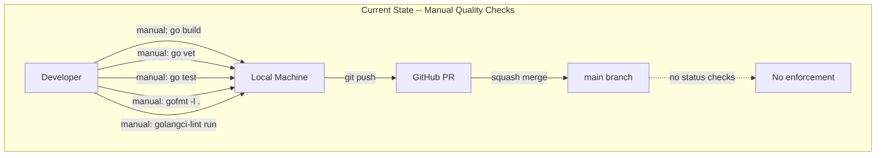
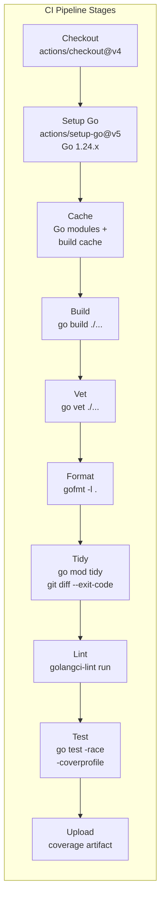
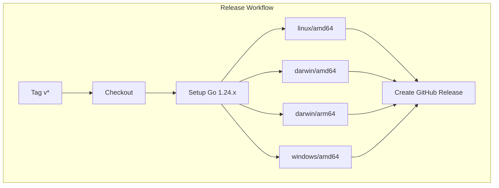
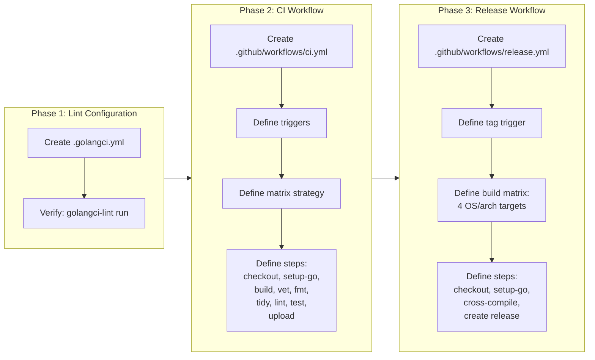

# CI/CD Pipeline

## Change Summary

The Outlook Local MCP Server has no automated CI/CD pipeline. All quality checks (build, vet, lint, test, formatting) are executed manually by developers before committing. This CR introduces a GitHub Actions CI workflow that runs on every push to `main` and every pull request targeting `main`, a release workflow that builds cross-platform binaries and creates GitHub releases on version tags, and a `golangci-lint` configuration file that codifies the project's linting standards. Once implemented, every code change will be automatically validated against the project's quality gates, and tagged releases will produce downloadable binaries for linux/amd64, darwin/amd64, darwin/arm64, and windows/amd64.

## Motivation and Background

The project currently has 40 source files (20 implementation, 20 test), 132+ passing tests, and references `golangci-lint` in its `CLAUDE.md` quality standards — but there is no CI pipeline to enforce these standards automatically. Manual quality checks are error-prone: a developer can forget to run `go vet`, skip `gofmt`, or push code that breaks the build. The `main` branch is protected (no direct commits, squash merge only, linear history required), but there is no status check to block merging a PR that fails quality gates. Additionally, there is no automated process to build release binaries; distribution requires manual compilation on each target platform.

GitHub Actions is the natural choice for CI/CD given the project is hosted on GitHub, the `gh` CLI is available, and GitHub Actions provides free minutes for public repositories. The pipeline will enforce the same quality commands documented in `CLAUDE.md` — `go build`, `go vet`, `golangci-lint run`, `go test -race`, `gofmt`, and `go mod tidy` — ensuring that automated checks match developer expectations.

## Change Drivers

* **No automated quality enforcement:** The `main` branch protection rules require PRs but cannot block merges on failing builds, tests, or linting without a CI status check.
* **Manual quality checks are unreliable:** Developers must remember to run five separate commands (`go build`, `go vet`, `golangci-lint run`, `go test`, `gofmt -l .`) before every commit; any omission risks merging broken code.
* **No golangci-lint configuration exists:** `CLAUDE.md` references `golangci-lint` but no `.golangci.yml` file defines which linters are enabled or how they are configured, leaving linting behavior inconsistent across developer environments.
* **No release automation:** Building binaries for four platform/architecture combinations requires manual cross-compilation and manual creation of GitHub releases, which is tedious and error-prone.
* **Branch protection gap:** Without a required status check, the "squash merge only" and "linear history" constraints are necessary but insufficient to guarantee code quality on `main`.

## Current State

The project has no CI/CD infrastructure:

```
outlook-mcp/
  .github/              # Does not exist
  .golangci.yml         # Does not exist
  *.go                  # 40 source files (20 impl + 20 test)
  go.mod                # Module definition, Go 1.24.0
  go.sum                # Dependency checksums
  .gitignore            # Binary artifacts excluded
  CLAUDE.md             # References golangci-lint in quality standards
```

Quality checks are entirely manual. There is no `.github/workflows/` directory, no linter configuration, and no release process.

### Current State Diagram



## Proposed Change

Introduce three new files that establish automated CI/CD:

1. **`.github/workflows/ci.yml`** — CI workflow triggered on push to `main` and PRs targeting `main`. Runs checkout, Go 1.24.x setup, module caching, build, vet, format check, module tidiness check, golangci-lint, and tests with race detection and coverage.
2. **`.github/workflows/release.yml`** — Release workflow triggered on version tag push (`v*`). Builds cross-platform binaries for four targets and creates a GitHub release with the binaries attached.
3. **`.golangci.yml`** — golangci-lint configuration enabling govet, errcheck, staticcheck, unused, gosimple, ineffassign, gocritic, gofmt, and goimports linters with project-appropriate settings.

### Proposed State Diagram

```mermaid
flowchart TD
    subgraph Proposed["Proposed State -- Automated CI/CD"]
        A[Developer] -->|"git push"| B[GitHub PR]
        B -->|"triggers"| C[CI Workflow]
        C --> C1["Checkout"]
        C1 --> C2["Setup Go 1.24.x"]
        C2 --> C3["Cache modules + build"]
        C3 --> C4["go build ./..."]
        C4 --> C5["go vet ./..."]
        C5 --> C6["gofmt -l ."]
        C6 --> C7["go mod tidy + diff"]
        C7 --> C8["golangci-lint run"]
        C8 --> C9["go test -race -coverprofile"]
        C9 --> C10["Upload coverage artifact"]
        C10 -->|"all pass"| D["PR merge allowed"]
        D -->|"squash merge"| E[main branch]
        F[Tag push v*] -->|"triggers"| G[Release Workflow]
        G --> G1["Cross-compile\n4 targets"]
        G1 --> G2["Create GitHub Release\nwith binaries"]
    end
```



### CI Pipeline Stage Flow



### Release Build Matrix



## Requirements

### Functional Requirements

1. The project **MUST** include a `.github/workflows/ci.yml` file that defines a GitHub Actions workflow named "CI".
2. The CI workflow **MUST** trigger on `push` events to the `main` branch and on `pull_request` events targeting the `main` branch.
3. The CI workflow **MUST** use a matrix strategy with Go version `1.24.x`.
4. The CI workflow **MUST** use `actions/checkout@v4` to check out the repository.
5. The CI workflow **MUST** use `actions/setup-go@v5` to install the Go toolchain with the matrix Go version.
6. The CI workflow **MUST** cache Go modules and build cache using the built-in caching in `actions/setup-go@v5` (via the `cache` parameter) for performance.
7. The CI workflow **MUST** run `go build ./...` and fail the pipeline if the build fails.
8. The CI workflow **MUST** run `go vet ./...` and fail the pipeline if vet reports any issues.
9. The CI workflow **MUST** run a format check that executes `gofmt -l .` and fails the pipeline if any unformatted files are found.
10. The CI workflow **MUST** run a module tidiness check that executes `go mod tidy` followed by `git diff --exit-code go.mod go.sum`, failing the pipeline if either file has been modified.
11. The CI workflow **MUST** run `golangci-lint run` using `golangci/golangci-lint-action@v6` and fail the pipeline if any lint errors are found.
12. The CI workflow **MUST** run tests with `go test -race -coverprofile=coverage.out ./...` and fail the pipeline if any tests fail.
13. The CI workflow **MUST** upload the `coverage.out` file as a GitHub Actions artifact using `actions/upload-artifact@v4`.
14. The CI workflow **MUST** use `fail-fast: true` in the matrix strategy so that any quality gate failure stops the entire pipeline immediately.
15. The project **MUST** include a `.github/workflows/release.yml` file that defines a GitHub Actions workflow named "Release".
16. The release workflow **MUST** trigger on `push` events for tags matching the pattern `v*`.
17. The release workflow **MUST** build the binary for four platform/architecture combinations: `linux/amd64`, `darwin/amd64`, `darwin/arm64`, and `windows/amd64`.
18. The release workflow **MUST** name each binary `outlook-local-mcp-{GOOS}-{GOARCH}` (with `.exe` suffix for Windows).
19. The release workflow **MUST** create a GitHub release using the pushed tag, with all four binaries attached as release assets.
20. The release workflow **MUST** use `actions/checkout@v4` and `actions/setup-go@v5` with Go `1.24.x`.
21. The release workflow **MUST** set appropriate `GOOS` and `GOARCH` environment variables for each cross-compilation target.
22. The release workflow **MUST** use `CGO_ENABLED=0` for all release builds to produce statically linked binaries.
23. The project **MUST** include a `.golangci.yml` file that configures golangci-lint for the project.
24. The `.golangci.yml` file **MUST** enable the following linters: `govet`, `errcheck`, `staticcheck`, `unused`, `gosimple`, `ineffassign`, `gocritic`, `gofmt`, `goimports`.
25. The `.golangci.yml` file **MUST** set the Go version to `1.24`.
26. The `.golangci.yml` file **MUST** configure a lint timeout sufficient for the project (at least 3 minutes).

### Non-Functional Requirements

1. The CI workflow **MUST** complete within 10 minutes for the current codebase size under normal GitHub Actions runner performance.
2. The CI workflow **MUST** use caching to avoid downloading Go modules on every run, reducing execution time.
3. The release workflow **MUST** produce binaries that are immediately executable on their target platforms without additional runtime dependencies.
4. All workflow files **MUST** use the latest stable versions of GitHub Actions (`actions/checkout@v4`, `actions/setup-go@v5`, `actions/upload-artifact@v4`, `golangci/golangci-lint-action@v6`).
5. Workflow files **MUST** pin action versions to major version tags (e.g., `@v4`) for security and stability.
6. The CI workflow **MUST** run on `ubuntu-latest` runners.

## Affected Components

* `.github/workflows/ci.yml` -- new file, CI pipeline definition
* `.github/workflows/release.yml` -- new file, release pipeline definition
* `.golangci.yml` -- new file, golangci-lint configuration

## Scope Boundaries

### In Scope

* GitHub Actions CI workflow with build, vet, format check, module tidiness check, lint, test, and coverage upload stages
* GitHub Actions release workflow with cross-platform binary compilation and GitHub release creation
* golangci-lint configuration file with the specified linters enabled
* Module and build caching for CI performance
* Coverage report artifact upload
* Matrix strategy for Go version

### Out of Scope ("Here, But Not Further")

* Docker image builds or container registry publishing -- not in current milestone
* Deployment automation (the server is an MCP binary run locally, not a deployed service)
* Code coverage thresholds or coverage badge generation -- coverage is uploaded as an artifact but no minimum threshold is enforced
* Dependency update automation (Dependabot, Renovate) -- separate concern
* Security scanning (CodeQL, Snyk, gosec) -- separate concern, can be added in a future CR
* Branch protection rule configuration via GitHub API -- this is a manual admin action, not automated by the pipeline
* Makefile or task runner (the CI workflow invokes Go toolchain commands directly)
* Notification integrations (Slack, email) for CI/CD status
* macOS or Windows CI runners -- CI runs on `ubuntu-latest` only; cross-compilation handles platform coverage
* Release changelogs or release notes generation -- the GitHub release is created with the tag name only

## Alternative Approaches Considered

* **Makefile-based CI:** Using a Makefile to define build/test/lint targets and having CI simply run `make ci`. Rejected because it adds an additional file and indirection layer. The Go toolchain commands are simple enough to invoke directly in the workflow, and the workflow file itself serves as the single source of truth for CI steps.
* **Multi-job CI workflow (separate jobs for build, lint, test):** Considered splitting the CI pipeline into parallel jobs. Rejected because the project is small (40 files, ~1.5s test suite), and the overhead of spinning up multiple runners and restoring caches would exceed the time saved by parallelization. A single sequential job is simpler and faster for this codebase size.
* **GoReleaser for release automation:** GoReleaser is a popular tool for Go release workflows. Rejected because it introduces a third-party dependency and configuration file for a task that requires only four `GOOS/GOARCH` cross-compilations. The release workflow is simple enough to implement directly with `go build` and `gh release create`.
* **Pre-commit hooks instead of CI:** Using Git pre-commit hooks (via `pre-commit` framework) to run quality checks locally. Rejected as a replacement for CI because pre-commit hooks can be bypassed with `--no-verify`, are not enforced on the server side, and do not provide a GitHub status check that branch protection can require. Pre-commit hooks are complementary to CI, not a substitute.

## Impact Assessment

### User Impact

No direct user impact. CI/CD is internal development infrastructure. Users will benefit indirectly from higher code quality (fewer regressions reaching `main`) and from automated release binaries (downloadable from GitHub Releases instead of requiring manual compilation).

### Technical Impact

* **Branch protection enforcement:** Once the CI workflow is running, the repository administrator can add it as a required status check on the `main` branch, preventing merges of PRs that fail any quality gate.
* **golangci-lint standardization:** The `.golangci.yml` file ensures all developers and the CI pipeline use the same linter configuration, eliminating "works on my machine" linting discrepancies.
* **Build reproducibility:** The release workflow produces binaries with `CGO_ENABLED=0` and pinned Go versions, ensuring reproducible builds across releases.
* **No changes to existing source code:** This CR adds only workflow and configuration files. No `.go` files are modified.

### Business Impact

Automated CI/CD reduces the cost of quality assurance by catching defects earlier and eliminating manual release processes. For a project with 132+ tests across 20 test files, automated test execution on every PR ensures regressions are caught before merge rather than discovered manually.

## Implementation Approach

Implementation consists of three independent files that can be created in any order.

### Implementation Flow



### Phase 1: golangci-lint Configuration (`.golangci.yml`)

Create the golangci-lint configuration file at the project root. This file defines:

* **Run settings:** Go version 1.24, timeout of 3 minutes.
* **Enabled linters:** `govet`, `errcheck`, `staticcheck`, `unused`, `gosimple`, `ineffassign`, `gocritic`, `gofmt`, `goimports`. All other linters are disabled by default (using `disable-all: true` with an explicit `enable` list).
* **Issues settings:** Report all issues (no max limit), do not exclude default patterns so that all findings are visible.

Verification: Run `golangci-lint run` locally and confirm it passes with zero errors on the current codebase.

### Phase 2: CI Workflow (`.github/workflows/ci.yml`)

Create the CI workflow with the following structure:

```yaml
name: CI
on:
  push:
    branches: [main]
  pull_request:
    branches: [main]
```

**Job: `ci`** (runs on `ubuntu-latest`)

| Step | Name | Command / Action | Failure Behavior |
|------|------|-----------------|------------------|
| 1 | Checkout | `actions/checkout@v4` | Fail pipeline |
| 2 | Setup Go | `actions/setup-go@v5` with `go-version: '1.24.x'` and `cache: true` | Fail pipeline |
| 3 | Build | `go build ./...` | Fail pipeline |
| 4 | Vet | `go vet ./...` | Fail pipeline |
| 5 | Format check | `gofmt -l .` piped to check for output; non-empty output fails | Fail pipeline |
| 6 | Module tidiness | `go mod tidy && git diff --exit-code go.mod go.sum` | Fail pipeline |
| 7 | Lint | `golangci/golangci-lint-action@v6` | Fail pipeline |
| 8 | Test | `go test -race -coverprofile=coverage.out ./...` | Fail pipeline |
| 9 | Upload coverage | `actions/upload-artifact@v4` with `coverage.out` | Non-critical |

The matrix strategy specifies `go-version: ['1.24.x']` with `fail-fast: true`.

### Phase 3: Release Workflow (`.github/workflows/release.yml`)

Create the release workflow with the following structure:

```yaml
name: Release
on:
  push:
    tags: ['v*']
```

**Job: `release`** (runs on `ubuntu-latest`)

The release job uses a matrix strategy to cross-compile for four targets:

| GOOS | GOARCH | Binary Name |
|------|--------|-------------|
| `linux` | `amd64` | `outlook-local-mcp-linux-amd64` |
| `darwin` | `amd64` | `outlook-local-mcp-darwin-amd64` |
| `darwin` | `arm64` | `outlook-local-mcp-darwin-arm64` |
| `windows` | `amd64` | `outlook-local-mcp-windows-amd64.exe` |

Each build step sets `CGO_ENABLED=0`, `GOOS`, and `GOARCH` environment variables and runs `go build -o <binary-name> .`.

A final step uses `gh release create` (via the `GITHUB_TOKEN`) to create a GitHub release from the tag and attach all four binaries. Alternatively, `softprops/action-gh-release@v2` can be used for release creation.

### golangci-lint Linter Configuration Details

| Linter | Purpose | Category |
|--------|---------|----------|
| `govet` | Reports suspicious constructs (e.g., Printf format string mismatches) | Correctness |
| `errcheck` | Ensures error return values are checked | Correctness |
| `staticcheck` | Advanced static analysis (nil pointer dereference, unreachable code, etc.) | Correctness |
| `unused` | Detects unused constants, variables, functions, and types | Cleanliness |
| `gosimple` | Suggests code simplifications | Style |
| `ineffassign` | Detects ineffective assignments to existing variables | Correctness |
| `gocritic` | Opinionated linter with diagnostic, style, and performance checks | Quality |
| `gofmt` | Enforces standard Go formatting | Formatting |
| `goimports` | Enforces import grouping and ordering | Formatting |

## Test Strategy

### Tests to Add

This CR introduces no Go source code changes, so no Go unit tests are added. The CI workflow itself is validated by the following integration verification steps:

| Verification | Method | Description | Expected Result |
|--------------|--------|-------------|-----------------|
| `golangci-lint local run` | `golangci-lint run` | Run the new `.golangci.yml` against the current codebase locally | Zero lint errors; all 40 source files pass all 9 enabled linters |
| `CI workflow syntax` | Push branch, observe GitHub Actions | Create a PR with the new workflow files and verify the CI workflow runs successfully | All 9 steps pass; coverage artifact is uploaded |
| `Release workflow syntax` | `act` or manual tag push to a test tag | Verify the release workflow triggers and produces binaries | Four binaries are built and attached to the GitHub release |
| `Format check passes` | `gofmt -l .` locally | Verify no unformatted files exist | Empty output (all files formatted) |
| `Module tidiness` | `go mod tidy && git diff --exit-code go.mod go.sum` locally | Verify modules are already tidy | Zero diff; exit code 0 |

### Tests to Modify

Not applicable. No existing tests require modification for this CR.

### Tests to Remove

Not applicable. No existing tests become redundant as a result of this CR.

## Acceptance Criteria

### AC-1: CI workflow triggers on pull requests to main

```gherkin
Given the .github/workflows/ci.yml file exists in the repository
When a developer opens a pull request targeting the main branch
Then the CI workflow is triggered automatically
  And the workflow appears as a status check on the pull request
```

### AC-2: CI workflow triggers on push to main

```gherkin
Given the .github/workflows/ci.yml file exists in the repository
When a commit is pushed to the main branch (via squash merge)
Then the CI workflow is triggered automatically
```

### AC-3: CI build step compiles the project

```gherkin
Given the CI workflow is running
When the build step executes "go build ./..."
Then the step completes with exit code 0
  And the pipeline continues to the next step
```

### AC-4: CI vet step detects suspicious constructs

```gherkin
Given the CI workflow is running
When the vet step executes "go vet ./..."
Then the step completes with exit code 0 for clean code
  And the pipeline fails if go vet reports any issues
```

### AC-5: CI format check enforces gofmt

```gherkin
Given the CI workflow is running
When the format check step executes "gofmt -l ."
Then the step passes if gofmt returns empty output (all files formatted)
  And the step fails if gofmt lists any unformatted files
```

### AC-6: CI module tidiness check ensures go.mod and go.sum are clean

```gherkin
Given the CI workflow is running
When the module tidiness step executes "go mod tidy" followed by "git diff --exit-code go.mod go.sum"
Then the step passes if go.mod and go.sum are unchanged after go mod tidy
  And the step fails if either file has been modified
```

### AC-7: CI lint step runs golangci-lint with project configuration

```gherkin
Given the CI workflow is running
  And the .golangci.yml file exists with the configured linters
When the lint step runs golangci-lint
Then golangci-lint uses the .golangci.yml configuration
  And the step passes if no lint errors are found
  And the step fails if any lint errors are reported
```

### AC-8: CI test step runs with race detection and coverage

```gherkin
Given the CI workflow is running
When the test step executes "go test -race -coverprofile=coverage.out ./..."
Then all tests pass with exit code 0
  And a coverage.out file is generated
  And the race detector reports no data races
```

### AC-9: CI uploads coverage artifact

```gherkin
Given the CI workflow test step has completed successfully
  And the coverage.out file exists
When the upload artifact step executes
Then the coverage.out file is uploaded as a GitHub Actions artifact named "coverage"
  And the artifact is downloadable from the workflow run summary
```

### AC-10: CI uses Go module caching

```gherkin
Given the CI workflow is running
  And a previous workflow run has populated the Go module cache
When actions/setup-go@v5 runs with cache enabled
Then the Go module cache is restored from the previous run
  And module download time is reduced compared to a cold run
```

### AC-11: CI fails fast on any quality gate failure

```gherkin
Given the CI workflow is running with fail-fast enabled
When any step (build, vet, format, tidy, lint, or test) fails
Then the pipeline stops immediately
  And the workflow reports a failure status on the PR
```

### AC-12: golangci-lint configuration enables all required linters

```gherkin
Given the .golangci.yml file exists in the project root
When a developer runs "golangci-lint linters"
Then the output shows the following linters as enabled:
  | govet | errcheck | staticcheck | unused | gosimple |
  | ineffassign | gocritic | gofmt | goimports |
```

### AC-13: golangci-lint passes on current codebase

```gherkin
Given the .golangci.yml file exists with all required linters enabled
  And the current codebase has 40 source files
When the developer runs "golangci-lint run"
Then the command completes with exit code 0 and zero errors
```

### AC-14: Release workflow triggers on version tags

```gherkin
Given the .github/workflows/release.yml file exists in the repository
When a tag matching the pattern "v*" is pushed (e.g., "v1.0.0")
Then the release workflow is triggered automatically
```

### AC-15: Release workflow builds binaries for all target platforms

```gherkin
Given the release workflow is running
When the build steps execute with CGO_ENABLED=0
Then four binaries are produced:
  | outlook-local-mcp-linux-amd64       |
  | outlook-local-mcp-darwin-amd64      |
  | outlook-local-mcp-darwin-arm64      |
  | outlook-local-mcp-windows-amd64.exe |
```

### AC-16: Release workflow creates GitHub release with binaries

```gherkin
Given the release workflow has built all four platform binaries
When the release creation step executes
Then a GitHub release is created with the tag name as the release title
  And all four binaries are attached as release assets
  And the release is publicly accessible from the repository's Releases page
```

### AC-17: Release binaries are statically linked

```gherkin
Given the release workflow builds with CGO_ENABLED=0
When a linux/amd64 binary is examined with "ldd" or "file"
Then the binary is statically linked
  And the binary has no dynamic library dependencies
```

## Quality Standards Compliance

### Build & Compilation

- [ ] Code compiles/builds without errors (`go build ./...`)
- [ ] No new compiler warnings introduced
- [ ] CI workflow YAML is valid and parseable by GitHub Actions

### Linting & Code Style

- [ ] All linter checks pass with zero warnings/errors (`golangci-lint run` with new `.golangci.yml`)
- [ ] Workflow files follow GitHub Actions YAML conventions
- [ ] Any linter exceptions are documented with justification

### Test Execution

- [ ] All existing tests pass after implementation (`go test -race ./...`)
- [ ] CI workflow successfully executes all stages on the current codebase
- [ ] Test coverage report is generated and uploaded as artifact

### Documentation

- [ ] Inline code documentation updated where applicable (YAML comments in workflow files)
- [ ] golangci-lint configuration is self-documenting with clear linter names

### Code Review

- [ ] Changes submitted via pull request
- [ ] PR title follows Conventional Commits format
- [ ] Code review completed and approved
- [ ] Changes squash-merged to maintain linear history

### Verification Commands

```bash
# Verify golangci-lint configuration locally
golangci-lint run

# Verify format check passes
test -z "$(gofmt -l .)" && echo "PASS" || echo "FAIL"

# Verify module tidiness
go mod tidy && git diff --exit-code go.mod go.sum

# Verify build
go build ./...

# Verify vet
go vet ./...

# Verify tests with race detection and coverage
go test -race -coverprofile=coverage.out ./...

# Verify workflow YAML syntax (requires actionlint)
actionlint .github/workflows/ci.yml .github/workflows/release.yml
```

## Risks and Mitigation

### Risk 1: golangci-lint finds existing violations in the current codebase

**Likelihood:** medium
**Impact:** medium
**Mitigation:** Run `golangci-lint run` locally with the proposed `.golangci.yml` before committing. If violations are found, fix them in the same PR or add targeted `//nolint` directives with explanatory comments as permitted by the project's quality standards. The linter configuration should be tuned to pass cleanly on the existing codebase before the CI workflow is merged.

### Risk 2: Race detector finds data races in existing tests

**Likelihood:** low
**Impact:** high
**Mitigation:** Run `go test -race ./...` locally before adding the CI workflow. The current test suite (132+ tests) has been passing without `-race`; if races are detected, they must be fixed before this CR is merged. The `-race` flag is non-negotiable for CI because data races are undefined behavior in Go.

### Risk 3: GitHub Actions runner environment differs from local development

**Likelihood:** low
**Impact:** low
**Mitigation:** The CI workflow uses `ubuntu-latest` with the exact Go version specified in `go.mod` (1.24.x). Go is highly portable across platforms. The only platform-specific code in the project is `os.UserHomeDir()`, which works on Linux. The release workflow handles platform differences through cross-compilation with `CGO_ENABLED=0`.

### Risk 4: Cross-compiled binaries fail on target platforms due to CGO dependencies

**Likelihood:** low
**Impact:** medium
**Mitigation:** The project uses `CGO_ENABLED=0` for release builds, which disables cgo and produces fully statically linked binaries. The project's dependencies (Azure SDK, Microsoft Graph SDK, mcp-go) are pure Go and do not require cgo. The `azidentity/cache` package uses OS-level keychain access, but the keychain bindings in the `keybase/go-keychain` dependency use build tags that work with `CGO_ENABLED=0` on macOS. If a specific platform target fails to build, it can be addressed by adjusting build tags for that target.

### Risk 5: GitHub Actions free tier minute exhaustion

**Likelihood:** low
**Impact:** low
**Mitigation:** The CI pipeline is a single job with sequential steps, minimizing runner time. The Go module cache reduces download time on subsequent runs. For a project of this size, the CI workflow should complete in under 3 minutes per run, well within GitHub's free tier limits.

## Dependencies

* **CR-0001 through CR-0009 (All existing CRs):** The CI pipeline validates the code produced by all previous CRs. The current codebase must pass all quality gates before this CR can be merged.
* **GitHub repository settings:** The repository administrator must manually add the CI workflow as a required status check on the `main` branch after this CR is merged for full enforcement.
* **golangci-lint availability:** The CI workflow uses `golangci/golangci-lint-action@v6`, which installs golangci-lint on the runner. No pre-installation is required. Local development requires developers to install golangci-lint separately.

## Estimated Effort

| Component | Estimate |
|-----------|----------|
| `.golangci.yml` creation and local validation | 1 hour |
| `.github/workflows/ci.yml` implementation | 2 hours |
| `.github/workflows/release.yml` implementation | 1.5 hours |
| Local verification of all quality gates | 1 hour |
| Fix any existing lint violations discovered | 1.5 hours |
| PR creation, CI validation on GitHub, and review | 1 hour |
| **Total** | **8 hours** |

## Decision Outcome

Chosen approach: "GitHub Actions with sequential single-job CI and matrix-based cross-compilation release", because GitHub Actions is native to the project's hosting platform (GitHub), requires no external service configuration, provides free CI minutes, integrates directly with branch protection rules as a required status check, and the project's small size (40 files, 1.5s test suite) makes a single sequential job the most efficient pipeline structure. The golangci-lint configuration codifies the linting standards already referenced in `CLAUDE.md`, ensuring consistency between local development and CI enforcement.

## Related Items

* Project quality standards: `CLAUDE.md` (section: "Quality Standards", references `go build`, `golangci-lint run`, `go test`)
* Branch protection requirements: `CLAUDE.md` (section: "Branch Protection", squash merge only, linear history required)
* Verification commands: `CLAUDE.md` (section: "Verification Commands", `go build ./... && golangci-lint run && go test ./...`)
* Existing CRs: CR-0001 through CR-0009 (all produce code validated by this CI pipeline)
* Go module: `go.mod` (Go 1.24.0, module `github.com/desek/outlook-local-mcp`)
* Build artifacts: `.gitignore` (excludes binary artifacts that the release workflow produces)
