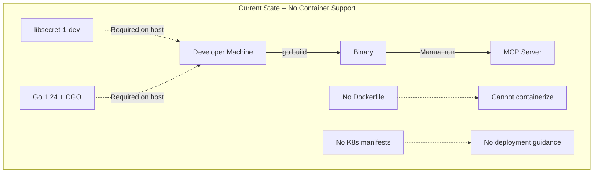
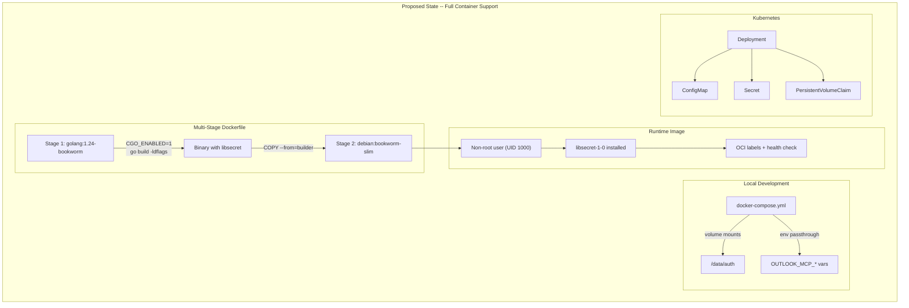
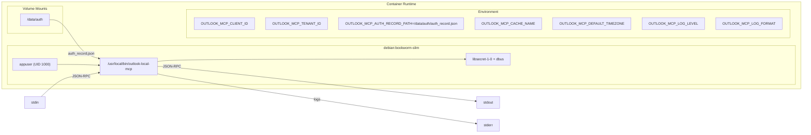
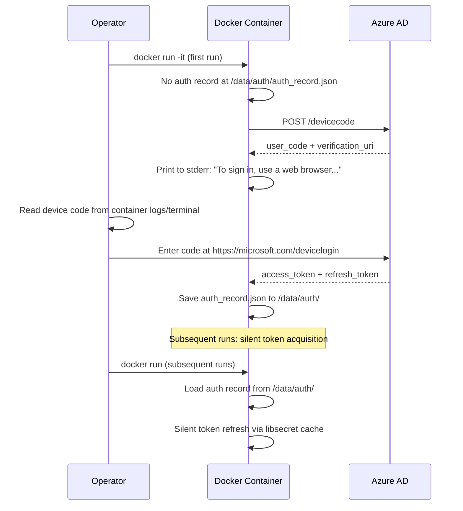
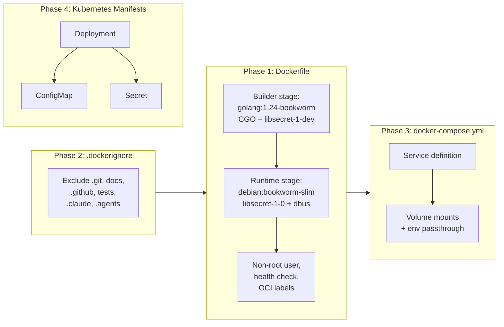
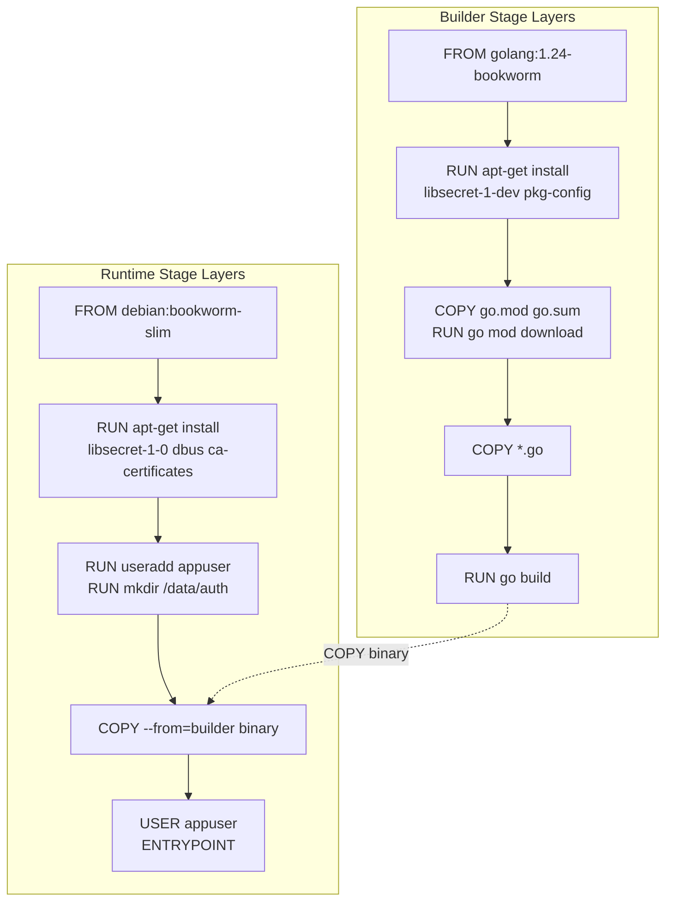

# Container Support

## Change Summary

The Outlook Local MCP Server currently has no container build or deployment artifacts. This CR introduces a multi-stage Dockerfile that produces a minimal Debian-based container image with CGO/libsecret support, a `.dockerignore` for efficient build context, a `docker-compose.yml` for local development, and example Kubernetes manifests in `docs/deploy/` for enterprise deployment. Together these artifacts enable building, running, and deploying the MCP server as a container while preserving the OS-native token cache capability and supporting the device code authentication flow's interactive first-run requirement.

## Motivation and Background

Enterprise deployment of the Outlook Local MCP Server requires containerization. Kubernetes, Docker Compose, and ECS are the standard deployment targets for Go microservices. Without container support, operators must build the binary from source and manage OS-level dependencies (libsecret, GCC) manually on each host. A well-structured Dockerfile with a multi-stage build produces a reproducible, minimal image that bundles all runtime dependencies and runs as a non-root user.

The MCP server has two containerization challenges that distinguish it from a typical Go service: (1) the `azidentity/cache` package requires CGO and libsecret for persistent token caching on Linux, so the binary cannot be a purely static build; and (2) the device code authentication flow requires interactive user input on first run, which must be handled through container log inspection or an attached terminal. This CR addresses both challenges with documented workflows and appropriate mount points for persistent state.

## Change Drivers

* **Enterprise deployment:** Organizations deploying MCP servers alongside other infrastructure require container images compatible with Kubernetes, ECS, and Docker Compose.
* **Reproducible builds:** A Dockerfile ensures the binary is always built with the correct CGO dependencies, Go version, and build flags regardless of the developer's local environment.
* **Security hardening:** Running as a non-root user in a minimal base image with pinned package versions reduces the attack surface.
* **Developer experience:** A `docker-compose.yml` simplifies local testing and development without requiring Go toolchain installation.
* **Deployment guidance:** Example Kubernetes manifests provide a starting point for production deployment, reducing time-to-deploy for platform teams.

## Current State

The project has no container-related files. There is no Dockerfile, no `.dockerignore`, no compose file, and no deployment manifests. Building and running the server requires a local Go 1.24 toolchain with CGO support and libsecret development headers installed.

### Current State Diagram



## Proposed Change

Introduce four categories of container support artifacts:

1. **Dockerfile** -- Multi-stage build producing a minimal Debian-based runtime image with libsecret support, non-root user, OCI labels, and a process-alive health check.
2. **.dockerignore** -- Excludes non-essential files from the Docker build context for faster, smaller builds.
3. **docker-compose.yml** -- Local development compose file with volume mounts for auth persistence and environment variable passthrough.
4. **docs/deploy/** -- Example Kubernetes manifests (Deployment, ConfigMap, Secret) demonstrating production deployment patterns.

### Proposed State Diagram



### Container Architecture



### Device Code Flow in Containers



## Requirements

### Functional Requirements

1. The project **MUST** include a `Dockerfile` at the repository root that uses a multi-stage build with `golang:1.24-bookworm` as the builder stage and `debian:bookworm-slim` as the runtime stage.
2. The builder stage **MUST** set `CGO_ENABLED=1` to enable CGO compilation required by the `azidentity/cache` package for libsecret support.
3. The builder stage **MUST** install `libsecret-1-dev` and `pkg-config` as build-time dependencies for CGO compilation.
4. The builder stage **MUST** compile the binary with `-ldflags` that embed version information: `-X main.version=${VERSION}` (where `VERSION` is a build argument defaulting to `"dev"`).
5. The runtime stage **MUST** install `libsecret-1-0` and `dbus` as runtime dependencies for the persistent token cache.
6. The runtime stage **MUST** create and run as a non-root user named `appuser` with UID 1000 and GID 1000.
7. The runtime stage **MUST** create the directory `/data/auth` owned by the non-root user for auth record persistence.
8. The Dockerfile **MUST** set `OUTLOOK_MCP_AUTH_RECORD_PATH=/data/auth/auth_record.json` as a default environment variable so the auth record is written to the mount point.
9. The Dockerfile **MUST** include a `HEALTHCHECK` instruction that verifies the process is alive using `kill -0 1` (since the stdio server cannot expose an HTTP health endpoint).
10. The Dockerfile **MUST** include OCI-standard container labels via `org.opencontainers.image.*` labels: `title`, `description`, `source`, `version`, and `licenses`.
11. The project **MUST** include a `.dockerignore` file at the repository root that excludes: `.git`, `docs/`, `.github/`, `*_test.go`, `.claude/`, `.agents/`, `*.md` (except `go.sum`), and build artifacts (`outlook-local-mcp`, `*.out`).
12. The project **MUST** include a `docker-compose.yml` file at the repository root that defines a service for the MCP server with volume mounts for `/data/auth` and environment variable passthrough for all `OUTLOOK_MCP_*` variables.
13. The project **MUST** include example Kubernetes manifests in `docs/deploy/` consisting of: `deployment.yaml` (Deployment resource), `configmap.yaml` (ConfigMap for non-secret configuration), and `secret.yaml` (Secret template for sensitive configuration).
14. The Kubernetes Deployment manifest **MUST** specify a `securityContext` with `runAsNonRoot: true`, `runAsUser: 1000`, and `readOnlyRootFilesystem: true`.
15. The Kubernetes Deployment manifest **MUST** include a `volumeMount` for auth record persistence backed by a PersistentVolumeClaim reference.
16. The binary **MUST** be built with `-trimpath` to remove local filesystem paths from the compiled binary for reproducibility and security.

### Non-Functional Requirements

1. The final container image **MUST** be under 150 MB in uncompressed size (debian:bookworm-slim base plus libsecret and the Go binary).
2. The Dockerfile **MUST** order layers to maximize Docker build cache effectiveness: dependency installation before source copy, `go mod download` before source copy.
3. The `.dockerignore` **MUST** reduce the build context to only files required for compilation (Go source files, `go.mod`, `go.sum`).
4. The container **MUST** handle SIGTERM correctly for graceful shutdown in orchestrated environments (Kubernetes pod termination, Docker stop).
5. The Dockerfile **MUST NOT** include any secrets, credentials, or tokens as build arguments, environment variables, or embedded files.
6. The container **MUST** log to stderr as per the MCP server's existing behavior, enabling container log collection via standard Docker/Kubernetes logging drivers.

## Affected Components

* `Dockerfile` -- new file, multi-stage container build definition
* `.dockerignore` -- new file, build context exclusions
* `docker-compose.yml` -- new file, local development compose configuration
* `docs/deploy/deployment.yaml` -- new file, example Kubernetes Deployment manifest
* `docs/deploy/configmap.yaml` -- new file, example Kubernetes ConfigMap manifest
* `docs/deploy/secret.yaml` -- new file, example Kubernetes Secret template

## Scope Boundaries

### In Scope

* Multi-stage Dockerfile with CGO support for libsecret
* `.dockerignore` for efficient build context
* `docker-compose.yml` for local development with volume mounts and environment passthrough
* Non-root user creation and enforcement in the container
* OCI image labels for metadata
* Process-alive health check
* Build argument for version injection via ldflags
* Example Kubernetes manifests (Deployment, ConfigMap, Secret) in `docs/deploy/`
* Documentation of the device code flow challenge in container environments (within the Kubernetes manifests as comments and in this CR)

### Out of Scope ("Here, But Not Further")

* CI/CD pipeline integration (GitHub Actions, GitLab CI) for automated image builds -- deferred to a future CR
* Container registry publishing (pushing to Docker Hub, GHCR, ECR) -- deferred to a future CR
* Helm chart packaging -- deferred to a future CR; raw manifests are sufficient as examples
* Init container or sidecar for automated device code authentication -- beyond current scope
* HTTP/SSE transport for container-native health checks -- the server is stdio-only per specification
* Windows container support -- Linux containers only
* ARM64 multi-architecture builds -- deferred to a future CR
* Container image scanning or vulnerability assessment tooling
* Makefile or build automation scripts for Docker commands
* Runtime secret injection via Vault, AWS Secrets Manager, or similar -- left to the deploying organization

## Alternative Approaches Considered

* **Alpine-based runtime image (`golang:1.24-alpine` / `alpine:3.x`):** Rejected because libsecret requires glibc and the GNOME ecosystem libraries. Alpine uses musl libc, which is incompatible with libsecret. Building libsecret from source on Alpine adds significant complexity and build time with no meaningful image size reduction after adding all required libraries.

* **Fully static binary (`CGO_ENABLED=0`) with `scratch` or `distroless` base:** Rejected because the `azidentity/cache` package requires CGO for libsecret integration on Linux. Disabling CGO would cause the persistent token cache to always fail, forcing in-memory-only caching and requiring re-authentication on every container restart. This defeats the purpose of token persistence.

* **Pre-authenticated token volume (skip device code in container):** Considered as a convenience pattern where the user authenticates on their local machine and mounts the resulting auth record and keychain data into the container. Rejected as the primary approach because keychain data is not portable across machines and the auth record alone is insufficient without the cached tokens. However, mounting the auth record volume is documented as the persistence mechanism for subsequent runs after initial in-container authentication.

* **Sidecar authentication service:** A sidecar container that handles the OAuth flow and provides tokens to the main container via a shared volume or local HTTP endpoint. Rejected as over-engineered for the current scope. The device code flow works within the container when run interactively on first use.

* **Docker Compose with `stdin_open: true` and `tty: true` for first-run auth:** Considered and adopted as the recommended approach for local development first-run authentication in the compose file.

## Impact Assessment

### User Impact

Operators and platform engineers gain the ability to build and deploy the MCP server as a container image. The primary workflow change is that first-run device code authentication must be performed with an interactive terminal attached to the container (`docker run -it` or `kubectl exec -it`). After first-run authentication, the auth record persists on the mounted volume and subsequent container starts acquire tokens silently.

### Technical Impact

* **New files:** Six new files are added (Dockerfile, .dockerignore, docker-compose.yml, three Kubernetes manifests). No existing source code is modified.
* **Build dependency:** The Dockerfile pins `golang:1.24-bookworm` and `debian:bookworm-slim` as base images. These must be updated when the Go version or Debian release changes.
* **CGO requirement confirmed:** The container build explicitly validates that the binary requires CGO for libsecret support, making this a documented architectural constraint.
* **Signal handling:** The existing SIGINT/SIGTERM handler (signal.go, improved by CR-0014) works correctly with `docker stop` (which sends SIGTERM) and Kubernetes pod termination.
* **Auth record path:** The Dockerfile sets `OUTLOOK_MCP_AUTH_RECORD_PATH=/data/auth/auth_record.json` which overrides the default `~/.outlook-local-mcp/auth_record.json`. This is necessary because the home directory for the non-root user is `/home/appuser` and the mount point is `/data/auth`.

### Business Impact

Container support enables enterprise adoption by aligning with standard infrastructure deployment patterns. Organizations that require containerized workloads can deploy the MCP server alongside their existing Kubernetes or Docker Compose infrastructure without custom build procedures.

## Implementation Approach

Implementation is structured in four independent phases that can be completed in any order, as they produce independent artifacts.

### Implementation Flow



### Phase 1: Dockerfile

Create a multi-stage Dockerfile at the repository root.

**Builder stage:**

1. Base image: `golang:1.24-bookworm`
2. Install build dependencies: `libsecret-1-dev`, `pkg-config`, `gcc`
3. Set working directory to `/build`
4. Copy `go.mod` and `go.sum` first, then run `go mod download` (layer caching optimization)
5. Copy all `.go` source files
6. Build with: `CGO_ENABLED=1 go build -trimpath -ldflags="-s -w -X main.version=${VERSION}" -o outlook-local-mcp .`

**Runtime stage:**

1. Base image: `debian:bookworm-slim`
2. Install runtime dependencies: `libsecret-1-0`, `dbus`, `ca-certificates`
3. Create non-root user: `groupadd -g 1000 appuser && useradd -u 1000 -g 1000 -m appuser`
4. Create data directory: `mkdir -p /data/auth && chown appuser:appuser /data/auth`
5. Copy binary from builder stage
6. Set OCI labels via `LABEL` instructions
7. Set default environment: `OUTLOOK_MCP_AUTH_RECORD_PATH=/data/auth/auth_record.json`
8. Set health check: `HEALTHCHECK --interval=30s --timeout=5s --retries=3 CMD kill -0 1 || exit 1`
9. Switch to non-root user: `USER appuser`
10. Set entrypoint: `ENTRYPOINT ["/usr/local/bin/outlook-local-mcp"]`

### Phase 2: .dockerignore

Create a `.dockerignore` file at the repository root excluding:

```
.git
.github
.claude
.agents
docs/
*.md
!go.sum
*_test.go
outlook-local-mcp
*.out
*.test
.gitignore
.deepwiki
skills-lock.json
```

### Phase 3: docker-compose.yml

Create a `docker-compose.yml` at the repository root:

1. Define a single service `outlook-local-mcp`
2. Build context: `.` with Dockerfile: `Dockerfile`
3. `stdin_open: true` and `tty: true` for interactive first-run authentication
4. Volume mount: `./data/auth:/data/auth` for auth record persistence
5. Environment variables: passthrough all `OUTLOOK_MCP_*` vars with `${OUTLOOK_MCP_VAR:-default}` syntax
6. Restart policy: `no` (stdio servers are not long-running daemons in the traditional sense)

### Phase 4: Kubernetes Manifests

Create three files in `docs/deploy/`:

**deployment.yaml:**

1. Deployment with 1 replica (stdio server is single-user)
2. Container spec with the image reference, environment from ConfigMap and Secret
3. Security context: `runAsNonRoot: true`, `runAsUser: 1000`, `readOnlyRootFilesystem: true`
4. Volume mount for `/data/auth` backed by a PersistentVolumeClaim
5. Resource requests and limits (minimal: 64Mi memory, 100m CPU)
6. Comments documenting the device code flow first-run procedure using `kubectl exec -it`

**configmap.yaml:**

1. ConfigMap with non-secret `OUTLOOK_MCP_*` environment variables
2. Includes: `OUTLOOK_MCP_TENANT_ID`, `OUTLOOK_MCP_DEFAULT_TIMEZONE`, `OUTLOOK_MCP_LOG_LEVEL`, `OUTLOOK_MCP_LOG_FORMAT`, `OUTLOOK_MCP_CACHE_NAME`, `OUTLOOK_MCP_AUTH_RECORD_PATH`

**secret.yaml:**

1. Secret template (with placeholder values) for `OUTLOOK_MCP_CLIENT_ID`
2. Comments explaining that the default client ID is not secret but is templated here for organizations using custom app registrations

### Dockerfile Layer Optimization



### Version Injection

The Dockerfile accepts a `VERSION` build argument:

```
docker build --build-arg VERSION=1.0.0 -t outlook-local-mcp:1.0.0 .
```

This value is injected into the binary via `-X main.version=${VERSION}`. The `main.go` file currently uses a hardcoded `"1.0.0"` version string in the MCP server creation and startup log. A package-level `var version = "dev"` will need to be added to `main.go` to receive the ldflags injection. This is a minimal, non-breaking addition.

## Test Strategy

### Tests to Add

| Test File | Test Name | Description | Inputs | Expected Output |
|-----------|-----------|-------------|--------|-----------------|
| N/A (manual) | `DockerBuildSuccess` | Validates that `docker build` completes without errors | Repository source files, Dockerfile | Image builds successfully, exit code 0 |
| N/A (manual) | `DockerImageSize` | Validates that the final image is under 150 MB | Built image | `docker image inspect` shows size < 150 MB |
| N/A (manual) | `DockerNonRootUser` | Validates that the container runs as non-root | Built image | `docker run --rm <image> whoami` outputs `appuser` |
| N/A (manual) | `DockerHealthCheck` | Validates that the health check passes when the process is running | Running container | `docker inspect` shows health status as `healthy` |
| N/A (manual) | `DockerAuthRecordMount` | Validates that auth record persists across container restarts | Volume mount for `/data/auth` | `auth_record.json` exists on host after first-run auth |
| N/A (manual) | `DockerEnvPassthrough` | Validates that `OUTLOOK_MCP_*` environment variables are passed through | `docker run -e OUTLOOK_MCP_LOG_LEVEL=debug` | Server logs at debug level |
| N/A (manual) | `DockerComposeUp` | Validates that `docker compose up` starts the service | `docker-compose.yml` | Service starts, logs visible on stderr |
| N/A (manual) | `DockerignoreEffective` | Validates that excluded files are not in the build context | `.dockerignore`, `docker build` | Build context is small, no docs/ or .git/ transferred |
| N/A (manual) | `KubernetesManifestValid` | Validates that Kubernetes manifests pass `kubectl apply --dry-run` | Manifest files | `kubectl apply --dry-run=client` succeeds |

### Tests to Modify

Not applicable. This CR introduces new files only; no existing tests are affected.

### Tests to Remove

Not applicable. No existing tests become redundant as a result of this CR.

## Acceptance Criteria

### AC-1: Dockerfile builds successfully

```gherkin
Given the Dockerfile exists at the repository root
  And the builder stage uses golang:1.24-bookworm
  And the runtime stage uses debian:bookworm-slim
When the developer runs "docker build -t outlook-local-mcp ."
Then the build completes with exit code 0
  And the resulting image contains the outlook-local-mcp binary at /usr/local/bin/
```

### AC-2: Binary is built with CGO enabled

```gherkin
Given the builder stage sets CGO_ENABLED=1
  And libsecret-1-dev and pkg-config are installed in the builder
When the binary is compiled
Then the binary is dynamically linked against libsecret
  And the runtime stage includes libsecret-1-0 as a runtime dependency
```

### AC-3: Container runs as non-root user

```gherkin
Given the Dockerfile creates a user "appuser" with UID 1000 and GID 1000
  And the USER instruction switches to appuser before the ENTRYPOINT
When the container starts
Then the process runs as UID 1000
  And the process does not have root privileges
```

### AC-4: Auth record mount point exists and is writable

```gherkin
Given the Dockerfile creates /data/auth owned by appuser
When the container starts with a volume mounted at /data/auth
Then the MCP server can write auth_record.json to /data/auth/
  And the file persists across container restarts via the volume mount
```

### AC-5: Default auth record path points to mount

```gherkin
Given the Dockerfile sets OUTLOOK_MCP_AUTH_RECORD_PATH=/data/auth/auth_record.json
When the MCP server starts without overriding the environment variable
Then the server uses /data/auth/auth_record.json as the auth record path
```

### AC-6: OCI labels are present on the image

```gherkin
Given the Dockerfile includes LABEL instructions for org.opencontainers.image.*
When the developer runs "docker inspect" on the built image
Then the image metadata contains org.opencontainers.image.title
  And the image metadata contains org.opencontainers.image.description
  And the image metadata contains org.opencontainers.image.source
  And the image metadata contains org.opencontainers.image.version
  And the image metadata contains org.opencontainers.image.licenses
```

### AC-7: Health check is configured

```gherkin
Given the Dockerfile includes a HEALTHCHECK instruction
  And the check uses "kill -0 1" to verify the process is alive
When the container is running
Then Docker reports the container health status as "healthy"
  And the health check runs at the configured interval
```

### AC-8: .dockerignore excludes non-essential files

```gherkin
Given the .dockerignore file exists at the repository root
When the developer runs "docker build ."
Then the build context does not include .git/
  And the build context does not include docs/
  And the build context does not include .github/
  And the build context does not include *_test.go files
  And the build context does not include .claude/
  And the build context does not include .agents/
```

### AC-9: docker-compose.yml starts the service

```gherkin
Given the docker-compose.yml file exists at the repository root
  And the service defines volume mounts for /data/auth
  And the service passes through OUTLOOK_MCP_* environment variables
When the developer runs "docker compose up --build"
Then the service builds and starts successfully
  And stdin_open and tty are enabled for interactive first-run auth
```

### AC-10: SIGTERM triggers graceful shutdown in container

```gherkin
Given the MCP server is running inside a container
When the operator runs "docker stop <container>"
Then Docker sends SIGTERM to the process
  And the server logs the shutdown reason
  And the container exits with code 0
```

### AC-11: Kubernetes manifests are valid

```gherkin
Given the deployment.yaml, configmap.yaml, and secret.yaml files exist in docs/deploy/
When the developer runs "kubectl apply --dry-run=client -f docs/deploy/"
Then all manifests pass validation
  And the Deployment specifies runAsNonRoot: true and runAsUser: 1000
  And the Deployment includes a volume mount for /data/auth
```

### AC-12: Version injection via build argument

```gherkin
Given the Dockerfile accepts a VERSION build argument
When the developer runs "docker build --build-arg VERSION=1.2.3 ."
Then the compiled binary has version "1.2.3" embedded via ldflags
```

### AC-13: Image size is under 150 MB

```gherkin
Given the container image has been built
When the developer checks the image size via "docker image ls"
Then the uncompressed image size is less than 150 MB
```

## Quality Standards Compliance

### Build & Compilation

- [ ] Code compiles/builds without errors (`go build ./...`)
- [ ] Docker image builds without errors (`docker build .`)
- [ ] No new compiler warnings introduced

### Linting & Code Style

- [ ] All linter checks pass with zero warnings/errors (`golangci-lint run`)
- [ ] Dockerfile follows best practices (hadolint or equivalent)
- [ ] Kubernetes manifests pass validation (`kubectl apply --dry-run=client`)
- [ ] Any linter exceptions are documented with justification

### Test Execution

- [ ] All existing tests pass after implementation (`go test ./... -v`)
- [ ] Docker build completes successfully
- [ ] Container starts and runs as non-root user
- [ ] Volume mounts work for auth record persistence

### Documentation

- [ ] Inline code documentation updated where applicable
- [ ] Kubernetes manifests include comments documenting the device code flow procedure
- [ ] Dockerfile includes comments explaining each stage and key decisions

### Code Review

- [ ] Changes submitted via pull request
- [ ] PR title follows Conventional Commits format
- [ ] Code review completed and approved
- [ ] Changes squash-merged to maintain linear history

### Verification Commands

```bash
# Go build verification (unchanged)
go build ./...

# Lint verification (unchanged)
golangci-lint run

# Test execution (unchanged)
go test ./... -v

# Docker build
docker build -t outlook-local-mcp:dev .

# Verify image size
docker image ls outlook-local-mcp:dev --format '{{.Size}}'

# Verify non-root user
docker run --rm outlook-local-mcp:dev whoami

# Verify OCI labels
docker inspect outlook-local-mcp:dev --format '{{json .Config.Labels}}' | jq .

# Verify health check config
docker inspect outlook-local-mcp:dev --format '{{json .Config.Healthcheck}}'

# Docker compose build and start
docker compose up --build -d

# Kubernetes manifest validation
kubectl apply --dry-run=client -f docs/deploy/

# Dockerfile lint (if hadolint available)
hadolint Dockerfile
```

## Risks and Mitigation

### Risk 1: libsecret token cache does not function inside containers without D-Bus

**Likelihood:** high
**Impact:** medium
**Mitigation:** The libsecret library requires a D-Bus session bus and a secret service provider (like gnome-keyring) to function. Inside a minimal container, these are typically absent. The `azidentity/cache` package handles this gracefully by returning an error from `cache.New()`, which the server catches in `initCache()` (auth.go) and falls back to in-memory caching with a warning log. This means that within a container, the auth record provides session continuity (avoiding the device code prompt) but actual token caching may be in-memory only per container lifetime. The refresh token embedded in the credential obtained via the auth record is sufficient for silent token acquisition on subsequent runs. This is an acceptable tradeoff documented in this CR.

### Risk 2: Device code flow requires interactive terminal on first run

**Likelihood:** high
**Impact:** medium
**Mitigation:** The device code flow prints a prompt to stderr with a URL and code. In a container environment, this requires either: (a) running the container with `-it` (interactive TTY) on first run, (b) inspecting container logs via `docker logs` to read the code, or (c) pre-authenticating on a local machine and mounting the resulting auth record into the container. All three approaches are documented in the Kubernetes manifest comments and the docker-compose.yml. The compose file sets `stdin_open: true` and `tty: true` by default to support approach (a).

### Risk 3: Base image vulnerabilities in debian:bookworm-slim

**Likelihood:** medium
**Impact:** medium
**Mitigation:** Pin the Debian release (bookworm-slim) rather than using `latest`. Run `apt-get update` and install specific package versions where possible. Organizations should integrate container image scanning (Trivy, Snyk, etc.) into their CI/CD pipeline -- this is documented as out of scope for this CR but is a recommended follow-up.

### Risk 4: Build cache invalidation on Go dependency changes

**Likelihood:** low
**Impact:** low
**Mitigation:** The Dockerfile copies `go.mod` and `go.sum` before source files and runs `go mod download` as a separate layer. This ensures that dependency downloads are cached and only invalidated when `go.mod` or `go.sum` changes, not on every source code change.

### Risk 5: Volume permission conflicts between host and container UID

**Likelihood:** medium
**Impact:** low
**Mitigation:** The container runs as UID 1000. If the host bind-mount directory is owned by a different UID, the container may not have write permission. The docker-compose.yml and Kubernetes manifest documentation include notes about ensuring the volume/mount is writable by UID 1000. On Kubernetes, the `fsGroup` security context field can be used to set the group ownership of mounted volumes.

## Dependencies

* **CR-0001 (Configuration):** The Dockerfile sets default values for `OUTLOOK_MCP_AUTH_RECORD_PATH` that override the config defaults. The container must be compatible with the environment variable loading mechanism.
* **CR-0003 (Authentication):** The auth record persistence path and the `initCache` fallback behavior are critical to container operation. The device code flow's stderr output must be visible in container logs.
* **CR-0014 (Signal Handling Improvements):** Graceful shutdown via SIGTERM is essential for `docker stop` and Kubernetes pod termination. If CR-0014 is not yet merged, the existing signal handler in `signal.go` already handles SIGTERM correctly.
* **Docker Engine 20.10+:** Required for multi-stage builds, HEALTHCHECK, and OCI label support.
* **Go 1.24:** The builder stage must match the Go version specified in `go.mod`.

## Estimated Effort

| Component | Estimate |
|-----------|----------|
| Dockerfile (multi-stage build, non-root user, health check, labels) | 2 hours |
| .dockerignore | 15 minutes |
| docker-compose.yml with volume mounts and env passthrough | 1 hour |
| Kubernetes manifests (Deployment, ConfigMap, Secret) | 2 hours |
| Version injection (`var version` in main.go, ldflags) | 30 minutes |
| Manual testing (build, run, first-run auth, restart, volume persistence) | 2 hours |
| Documentation and comments in manifests | 1 hour |
| Code review and revisions | 1 hour |
| **Total** | **9.75 hours** |

## Decision Outcome

Chosen approach: "Multi-stage Dockerfile with debian:bookworm-slim runtime, CGO enabled for libsecret, non-root user, and example Kubernetes manifests", because: (1) the `azidentity/cache` package requires CGO and libsecret, ruling out static/Alpine/distroless builds; (2) debian:bookworm-slim provides a minimal glibc-based image with straightforward libsecret installation; (3) running as non-root follows container security best practices; (4) the process-alive health check is the only viable option for a stdio-based server; and (5) example Kubernetes manifests provide actionable deployment guidance without the overhead of a Helm chart.

## Related Items

* Related change requests: CR-0001 (Configuration), CR-0003 (Authentication), CR-0014 (Signal Handling Improvements)
* Specification reference: `docs/reference/outlook-local-mcp-spec.md` (sections "Configuration", "Authentication: device code flow", "Token caching and persistence")
* Key files: `auth.go` (initCache fallback, setupCredential), `signal.go` (SIGTERM handling), `main.go` (loadConfig, server lifecycle)
* Azure SDK documentation: `github.com/Azure/azure-sdk-for-go/sdk/azidentity/cache` (persistent token cache with libsecret)
