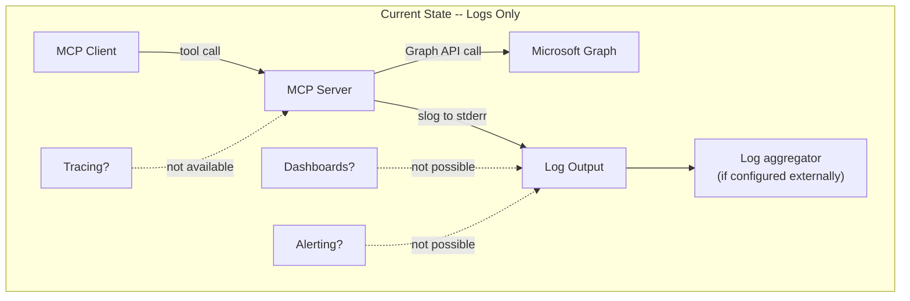
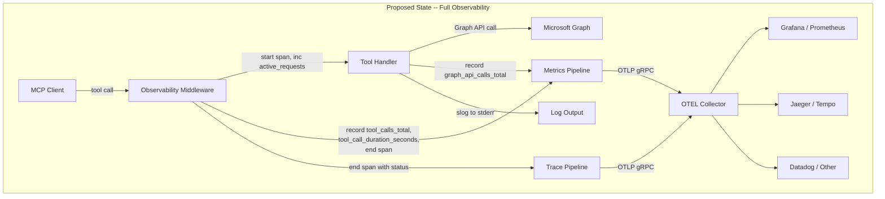
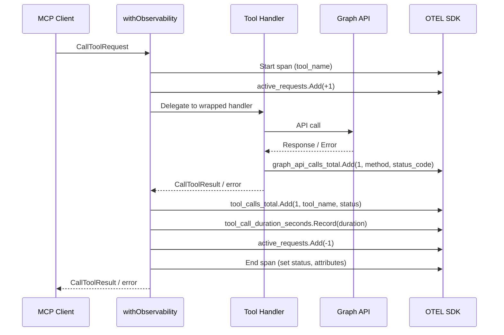
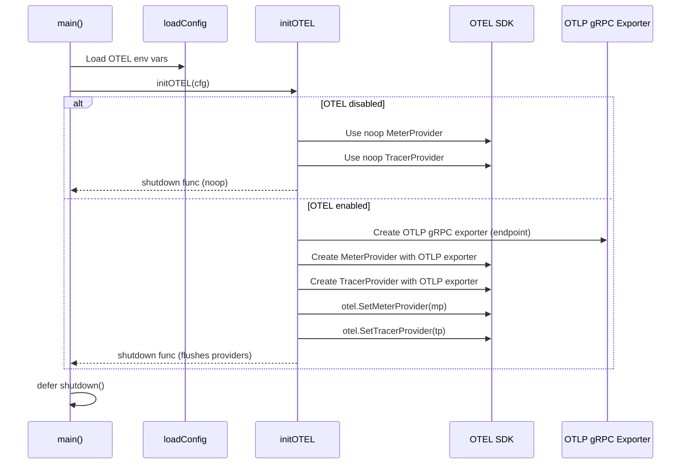
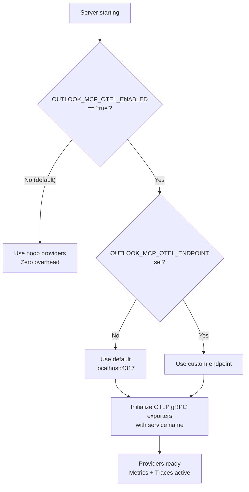
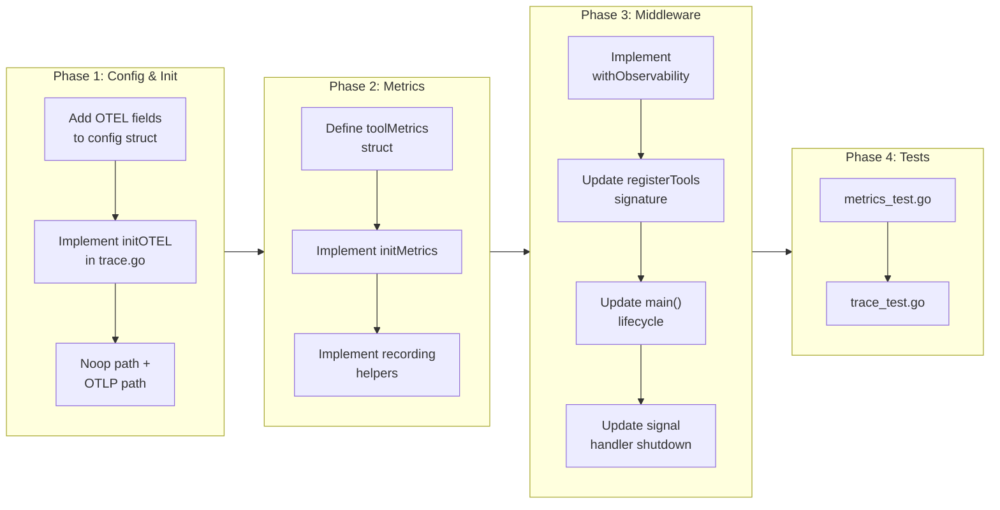

# Observability & Metrics

## Change Summary

This CR introduces OpenTelemetry-based observability to the Outlook Local MCP Server, adding structured metrics (counters, histograms, up/down counters) and distributed tracing for all tool invocations and Graph API interactions. The server currently relies solely on `slog` structured logging for operational visibility. The desired future state adds OTLP-exported metrics and traces that integrate with industry-standard backends (Grafana, Jaeger, Datadog, Prometheus via OTLP receiver) for dashboards, alerting, and SLO monitoring. When observability is disabled (the default), noop providers are used, ensuring zero runtime overhead.

## Motivation and Background

Enterprise deployments of MCP servers require observability beyond structured logs. Operations teams need time-series metrics for dashboard visualization, threshold-based alerting, and SLO tracking. Distributed tracing provides request-scoped context that connects tool invocations to their underlying Graph API calls, enabling rapid root cause analysis when latency spikes or error rates increase.

The server already tracks `time.Since(start)` for duration logging within each tool handler, demonstrating that latency measurement is recognized as important. However, log-based duration tracking cannot feed into Prometheus/Grafana dashboards, cannot trigger alerting rules, and cannot produce percentile distributions (p50, p95, p99) across time windows. OpenTelemetry provides these capabilities through a standardized API with pluggable exporters.

OpenTelemetry is already a transitive dependency in the project (`go.opentelemetry.io/otel v1.37.0`, `otel/metric`, `otel/trace` appear as indirect dependencies in `go.mod`). Promoting these to direct dependencies and adding the OTLP exporter and SDK packages is a natural progression that avoids introducing a competing telemetry framework.

The server uses stdio transport, which means it cannot expose an HTTP `/metrics` endpoint for Prometheus scraping. Instead, the OTLP gRPC exporter pushes telemetry to an external collector, which is the standard architecture for non-HTTP processes.

## Change Drivers

* **Enterprise readiness:** Production deployments require dashboards, alerting, and SLO monitoring — capabilities that structured logging alone cannot provide.
* **Latency visibility:** Tool handlers already measure duration via `time.Since(start)`, but this data is only available in log lines; metrics histograms enable percentile analysis and trend detection.
* **Error rate tracking:** There is no aggregated view of tool success/failure rates; a counter with `status` labels enables rate-based alerting (e.g., error rate > 5% over 5 minutes).
* **Graph API observability:** HTTP status codes and retry counts from the Graph API are logged but not aggregated; counters with `method` and `status_code` labels provide API health visibility.
* **Zero-overhead default:** Using noop providers when OTEL is disabled ensures no performance impact for users who do not need observability, preserving the lightweight local-server experience.
* **Stdio transport constraint:** The server cannot serve HTTP endpoints, making push-based OTLP export the only viable telemetry delivery mechanism.
* **Existing transitive dependency:** OpenTelemetry core packages are already in `go.mod` as indirect dependencies, minimizing the incremental dependency footprint.

## Current State

The server has no metrics collection, no distributed tracing, and no telemetry export capability. Operational visibility is limited to `slog` structured logging to stderr. Tool handlers individually track `time.Since(start)` for duration logging, but this data is not aggregated, cannot be queried across time windows, and cannot feed alerting systems. There is no mechanism to correlate a tool invocation with its underlying Graph API calls at the trace level.

### Current State Diagram



## Proposed Change

Introduce OpenTelemetry SDK integration with three new files (`metrics.go`, `metrics_test.go`, `trace.go`, `trace_test.go`) and modifications to the server bootstrap (`main.go`) and tool registration (`server.go`). The implementation provides:

1. **Metrics instrumentation** — five metric instruments (two counters, one histogram, one counter for retries, one up/down counter for active requests) with tool-level and API-level labels.
2. **Distributed tracing** — a span per tool invocation with tool name, sanitized parameters, and result status as span attributes.
3. **OTLP export** — gRPC-based OTLP exporter for pushing telemetry to any OpenTelemetry Collector-compatible backend.
4. **Noop fallback** — when `OUTLOOK_MCP_OTEL_ENABLED` is `false` (the default), the global meter and tracer providers are noop implementations with zero allocation overhead.
5. **Middleware pattern** — a `withObservability` wrapper function that automatically instruments any tool handler, eliminating the need to modify each handler individually.
6. **Graceful shutdown** — OTEL providers are shut down with a timeout during server shutdown, ensuring buffered telemetry is flushed.

### Proposed State Diagram



### Middleware Wrapping Flow



### OTEL Provider Initialization



### Configuration Decision Flow



## Requirements

### Functional Requirements

1. The system **MUST** implement an `initOTEL(cfg config) (func(context.Context) error, error)` function in `trace.go` that initializes OpenTelemetry meter and tracer providers and returns a shutdown function.
2. The `initOTEL` function **MUST** return noop providers and a noop shutdown function when `cfg.OTELEnabled` is `false`.
3. The `initOTEL` function **MUST** create an OTLP gRPC exporter targeting `cfg.OTELEndpoint` when `cfg.OTELEnabled` is `true`.
4. The `initOTEL` function **MUST** default the OTLP endpoint to `localhost:4317` when `cfg.OTELEndpoint` is empty and OTEL is enabled.
5. The `initOTEL` function **MUST** configure the OTLP exporter with insecure transport (no TLS) by default, since the collector is typically co-located or on a private network.
6. The `initOTEL` function **MUST** set the service name resource attribute to `cfg.OTELServiceName`.
7. The `initOTEL` function **MUST** call `otel.SetMeterProvider(mp)` and `otel.SetTracerProvider(tp)` to set the global providers when OTEL is enabled.
8. The returned shutdown function **MUST** call `TracerProvider.Shutdown(ctx)` and `MeterProvider.Shutdown(ctx)` to flush pending telemetry before process exit.
9. The system **MUST** implement the following metric instruments in `metrics.go`:
    - `tool_calls_total`: an `Int64Counter` with labels `tool_name` (string) and `status` (string, values: `"success"` or `"error"`).
    - `tool_call_duration_seconds`: a `Float64Histogram` with label `tool_name` (string).
    - `graph_api_calls_total`: an `Int64Counter` with labels `method` (string, e.g., `"GET"`, `"POST"`, `"DELETE"`) and `status_code` (string, e.g., `"200"`, `"429"`).
    - `graph_api_retry_total`: an `Int64Counter` with labels `tool_name` (string) and `attempt` (string, e.g., `"1"`, `"2"`, `"3"`).
    - `active_requests`: an `Int64UpDownCounter` with no required labels.
10. The system **MUST** implement an `initMetrics(meter metric.Meter) (*toolMetrics, error)` function that creates all five metric instruments from the given `Meter`.
11. The `toolMetrics` struct **MUST** hold references to all five metric instruments for use by the middleware and recording helpers.
12. The system **MUST** implement a `withObservability(name string, metrics *toolMetrics, tracer trace.Tracer, handler func(ctx context.Context, request mcp.CallToolRequest) (*mcp.CallToolResult, error)) func(ctx context.Context, request mcp.CallToolRequest) (*mcp.CallToolResult, error)` function that wraps a tool handler with automatic metrics recording and span creation.
13. The `withObservability` middleware **MUST** create a new span with the tool name as the span name before calling the wrapped handler.
14. The `withObservability` middleware **MUST** increment `active_requests` by 1 before calling the wrapped handler and decrement it by 1 after the handler returns.
15. The `withObservability` middleware **MUST** record `tool_calls_total` with `status="success"` when the handler returns a non-error result and `status="error"` when the handler returns an error result or the `CallToolResult.IsError` field is true.
16. The `withObservability` middleware **MUST** record `tool_call_duration_seconds` with the wall-clock duration of the handler invocation.
17. The `withObservability` middleware **MUST** set the span status to `codes.Error` with the error message when the handler returns an error, and `codes.Ok` on success.
18. The `withObservability` middleware **MUST** add span attributes for `tool.name` (string) and `tool.status` (string, `"success"` or `"error"`).
19. The system **MUST** implement a `recordGraphAPICall(ctx context.Context, metrics *toolMetrics, method string, statusCode int)` helper function that records a `graph_api_calls_total` increment with the given method and status code as labels.
20. The system **MUST** implement a `recordGraphAPIRetry(ctx context.Context, metrics *toolMetrics, toolName string, attempt int)` helper function that records a `graph_api_retry_total` increment.
21. The system **MUST** add three new fields to the `config` struct: `OTELEnabled` (bool), `OTELEndpoint` (string), `OTELServiceName` (string).
22. The system **MUST** read `OUTLOOK_MCP_OTEL_ENABLED` from the environment, parsing `"true"` (case-insensitive) as enabled, defaulting to `false`.
23. The system **MUST** read `OUTLOOK_MCP_OTEL_ENDPOINT` from the environment, defaulting to `""` (which resolves to `localhost:4317` at initialization time).
24. The system **MUST** read `OUTLOOK_MCP_OTEL_SERVICE_NAME` from the environment, defaulting to `"outlook-local-mcp"`.
25. The `registerTools` function **MUST** wrap each tool handler with `withObservability` so that all nine tools are automatically instrumented.
26. The `main()` function **MUST** call `initOTEL(cfg)` after loading configuration and before creating the MCP server, and **MUST** defer the returned shutdown function.
27. The shutdown function **MUST** be called with a context that has a 5-second timeout to prevent indefinite blocking during process exit.

### Non-Functional Requirements

1. When OTEL is disabled, the system **MUST** incur zero additional memory allocations per tool invocation from the observability layer — noop providers must be used, not conditional checks in hot paths.
2. When OTEL is enabled, the per-tool-call overhead of metrics recording and span creation **MUST** be under 100 microseconds, excluding OTLP export network latency.
3. The OTLP exporter **MUST** use asynchronous batched export to avoid blocking tool handler execution on network I/O.
4. The system **MUST NOT** export any sensitive data (tokens, passwords, full email addresses) in span attributes or metric labels.
5. The system **MUST** sanitize tool parameters before adding them as span attributes — specifically, event body content and attendee email lists must be excluded or truncated.
6. The shutdown function **MUST** complete within the 5-second timeout; if the OTLP endpoint is unreachable, shutdown must not block indefinitely.
7. All new code **MUST** follow the project's Go doc comment standards for packages, functions, structs, and exported fields.
8. The `metrics.go` and `trace.go` files **MUST** each be self-contained, single-purpose files consistent with the project's small-file architecture.

## Affected Components

* `main.go` — add `OTELEnabled`, `OTELEndpoint`, `OTELServiceName` to `config` struct and `loadConfig`; call `initOTEL` in `main()`; defer OTEL shutdown; pass metrics and tracer to `registerTools`.
* `server.go` — update `registerTools` to accept `*toolMetrics` and `trace.Tracer`; wrap each handler with `withObservability`.
* `metrics.go` — new file: `toolMetrics` struct, `initMetrics` function, `recordGraphAPICall` helper, `recordGraphAPIRetry` helper.
* `metrics_test.go` — new file: unit tests for metric initialization and recording helpers.
* `trace.go` — new file: `initOTEL` function, `withObservability` middleware function.
* `trace_test.go` — new file: unit tests for OTEL initialization, middleware wrapping, and span creation.
* `go.mod` — promote `go.opentelemetry.io/otel`, `otel/metric`, `otel/trace` from indirect to direct; add `otel/sdk`, `otel/sdk/metric`, `otel/exporters/otlp/otlptrace/otlptracegrpc`, `otel/exporters/otlp/otlpmetric/otlpmetricgrpc`.
* `signal.go` — update signal handler to call OTEL shutdown before `os.Exit`.

## Scope Boundaries

### In Scope

* OpenTelemetry provider initialization with noop/OTLP modes
* Five metric instruments: `tool_calls_total`, `tool_call_duration_seconds`, `graph_api_calls_total`, `graph_api_retry_total`, `active_requests`
* Distributed tracing with one span per tool call
* `withObservability` middleware for automatic instrumentation of all nine tools
* OTLP gRPC exporter configuration
* Three new environment variables for OTEL configuration
* Graceful OTEL provider shutdown with flush
* Unit tests for all new functions
* Parameter sanitization for span attributes

### Out of Scope ("Here, But Not Further")

* Prometheus scrape endpoint — not possible with stdio transport; OTLP push is used instead
* Custom span events or links within tool handlers beyond the single tool-call span
* Trace context propagation to/from the MCP client — the MCP protocol does not carry trace headers
* Log-to-trace correlation (injecting trace IDs into slog records) — deferred to a future CR
* Custom metric views, exemplars, or histogram bucket configuration — the OTEL SDK defaults are sufficient
* TLS configuration for the OTLP exporter — deferred to a future CR for production hardening
* Retry logic integration (modifying existing retry code to call `recordGraphAPIRetry`) — this CR provides the recording helper; integration into existing retry paths is a separate change
* Dashboard or alerting rule definitions — these are backend-specific and out of scope for the server codebase

## Alternative Approaches Considered

* **Prometheus client library with push gateway:** The `prometheus/client_golang` library is the most common Go metrics library, but it assumes an HTTP scrape endpoint. Using the Prometheus Push Gateway adds operational complexity and an additional dependency. OpenTelemetry's OTLP exporter is more versatile and can feed Prometheus via the OTEL Collector's Prometheus exporter.
* **StatsD/DogStatsD exporter:** Lightweight UDP-based metrics export. Rejected because it lacks tracing support, requires a separate StatsD daemon, and does not provide the rich labeling semantics of OpenTelemetry.
* **Conditional instrumentation without noop providers:** Checking `if otelEnabled` before each metric call. Rejected because it pollutes handler code with conditional logic and has marginally higher overhead than noop providers, which the OTEL SDK is specifically designed to optimize away.
* **Per-handler manual instrumentation:** Adding OTEL calls directly inside each tool handler. Rejected because it violates DRY, increases per-file complexity, and risks inconsistent instrumentation. The middleware pattern centralizes instrumentation in a single function.

## Impact Assessment

### User Impact

For users who do not set `OUTLOOK_MCP_OTEL_ENABLED=true`, there is no behavioral change. The server starts and operates identically to the current version. For users who enable OTEL, telemetry data flows to the configured collector endpoint, enabling:

* Real-time dashboards showing tool call rates, error rates, and latency percentiles.
* Alerting on anomalous patterns (e.g., Graph API 429 rate spikes, tool error rate exceeding threshold).
* Trace-level drill-down for slow or failed tool invocations.

### Technical Impact

* **Dependency additions:** `go.opentelemetry.io/otel/sdk`, `go.opentelemetry.io/otel/sdk/metric`, `go.opentelemetry.io/otel/exporters/otlp/otlptrace/otlptracegrpc`, `go.opentelemetry.io/otel/exporters/otlp/otlpmetric/otlpmetricgrpc`, and their transitive dependencies (primarily gRPC). This is the most significant dependency addition.
* **Function signature change:** `registerTools` gains two additional parameters (`*toolMetrics`, `trace.Tracer`). This is a package-internal change with no external API impact.
* **Shutdown sequence change:** The signal handler and `main()` must call the OTEL shutdown function before exiting to flush buffered telemetry.
* **No breaking changes to existing tool handlers.** The `withObservability` middleware wraps handlers transparently; handler function signatures and behavior are unchanged.

### Business Impact

* Enables enterprise adoption by providing the observability stack integration that operations teams require.
* Reduces mean time to diagnosis (MTTD) and mean time to resolution (MTTR) for production incidents.
* Provides quantitative data for SLO definition and tracking (e.g., "99th percentile tool call latency < 2 seconds").

## Implementation Approach

Implementation proceeds in four phases within a single PR.

### Phase 1: Configuration and OTEL Initialization

Add the three new environment variables to the `config` struct and `loadConfig`. Implement `initOTEL` in `trace.go` with the noop/OTLP provider branching logic.

### Phase 2: Metrics Instrumentation

Implement `metrics.go` with the `toolMetrics` struct, `initMetrics` function, and recording helper functions.

### Phase 3: Middleware and Integration

Implement the `withObservability` middleware in `trace.go`. Update `registerTools` in `server.go` to wrap all handlers. Update `main()` to call `initOTEL` and wire the shutdown function.

### Phase 4: Testing

Write unit tests for all new functions using OTEL's testing utilities (noop providers, in-memory exporters).

### Implementation Flow



### Implementation Details

**config struct additions:**

```go
type config struct {
    // ... existing fields ...

    // OTELEnabled controls whether OpenTelemetry metrics and tracing are active.
    // When false (the default), noop providers are used with zero overhead.
    OTELEnabled bool

    // OTELEndpoint is the OTLP gRPC endpoint for exporting telemetry.
    // Defaults to "" which resolves to localhost:4317 at initialization time.
    OTELEndpoint string

    // OTELServiceName is the service.name resource attribute for OTEL telemetry.
    // Defaults to "outlook-local-mcp".
    OTELServiceName string
}
```

**toolMetrics struct:**

```go
type toolMetrics struct {
    toolCallsTotal       metric.Int64Counter
    toolCallDuration     metric.Float64Histogram
    graphAPICallsTotal   metric.Int64Counter
    graphAPIRetryTotal   metric.Int64Counter
    activeRequests       metric.Int64UpDownCounter
}
```

**withObservability middleware pattern:**

```go
func withObservability(
    name string,
    metrics *toolMetrics,
    tracer trace.Tracer,
    handler func(ctx context.Context, request mcp.CallToolRequest) (*mcp.CallToolResult, error),
) func(ctx context.Context, request mcp.CallToolRequest) (*mcp.CallToolResult, error) {
    return func(ctx context.Context, request mcp.CallToolRequest) (*mcp.CallToolResult, error) {
        ctx, span := tracer.Start(ctx, name)
        defer span.End()

        span.SetAttributes(attribute.String("tool.name", name))
        metrics.activeRequests.Add(ctx, 1)
        defer metrics.activeRequests.Add(ctx, -1)

        start := time.Now()
        result, err := handler(ctx, request)
        duration := time.Since(start).Seconds()

        status := "success"
        if err != nil || (result != nil && result.IsError) {
            status = "error"
            span.SetStatus(codes.Error, status)
        } else {
            span.SetStatus(codes.Ok, "")
        }
        span.SetAttributes(attribute.String("tool.status", status))

        metrics.toolCallsTotal.Add(ctx, 1,
            metric.WithAttributes(
                attribute.String("tool_name", name),
                attribute.String("status", status),
            ),
        )
        metrics.toolCallDuration.Record(ctx, duration,
            metric.WithAttributes(attribute.String("tool_name", name)),
        )

        return result, err
    }
}
```

**Updated registerTools signature:**

```go
func registerTools(
    s *server.MCPServer,
    graphClient *msgraphsdk.GraphServiceClient,
    metrics *toolMetrics,
    tracer trace.Tracer,
) {
    s.AddTool(listCalendarsTool, withObservability("list_calendars", metrics, tracer, newHandleListCalendars(graphClient)))
    // ... repeat for all 9 tools ...
}
```

**Updated main() lifecycle:**

```go
func main() {
    cfg := loadConfig()
    initLogger(cfg.LogLevel, cfg.LogFormat)
    slog.Info("server starting", "version", "1.0.0", "transport", "stdio")

    // Initialize OTEL (noop or OTLP based on config)
    shutdownOTEL, err := initOTEL(cfg)
    if err != nil {
        slog.Error("otel initialization failed", "error", err)
        os.Exit(1)
    }
    defer func() {
        ctx, cancel := context.WithTimeout(context.Background(), 5*time.Second)
        defer cancel()
        if err := shutdownOTEL(ctx); err != nil {
            slog.Error("otel shutdown failed", "error", err)
        }
    }()

    // ... authentication, graph client creation ...

    meter := otel.Meter(cfg.OTELServiceName)
    tracer := otel.Tracer(cfg.OTELServiceName)
    metrics, err := initMetrics(meter)
    if err != nil {
        slog.Error("metrics initialization failed", "error", err)
        os.Exit(1)
    }

    s := server.NewMCPServer("outlook-local", "1.0.0",
        server.WithToolCapabilities(false),
        server.WithRecovery(),
    )
    registerTools(s, graphClient, metrics, tracer)
    // ... rest of lifecycle ...
}
```

## Test Strategy

### Tests to Add

| Test File | Test Name | Description | Inputs | Expected Output |
|-----------|-----------|-------------|--------|-----------------|
| `trace_test.go` | `TestInitOTEL_Disabled` | Verifies noop providers when OTEL is disabled | `config{OTELEnabled: false}` | Non-nil shutdown func, nil error, global providers are noop |
| `trace_test.go` | `TestInitOTEL_Enabled_DefaultEndpoint` | Verifies OTLP provider creation with default endpoint | `config{OTELEnabled: true, OTELEndpoint: "", OTELServiceName: "test"}` | Non-nil shutdown func, nil error, global providers are SDK providers |
| `trace_test.go` | `TestInitOTEL_Enabled_CustomEndpoint` | Verifies OTLP provider creation with custom endpoint | `config{OTELEnabled: true, OTELEndpoint: "collector:4317", OTELServiceName: "test"}` | Non-nil shutdown func, nil error |
| `trace_test.go` | `TestInitOTEL_ServiceNameResource` | Verifies service.name resource attribute is set | `config{OTELEnabled: true, OTELServiceName: "my-service"}` | Resource contains `service.name=my-service` |
| `trace_test.go` | `TestInitOTEL_ShutdownFlushes` | Verifies shutdown function calls provider shutdown | OTEL enabled, call shutdown | No error, providers are shut down |
| `trace_test.go` | `TestWithObservability_Success` | Verifies middleware records success metrics and span on successful handler | Handler returning success result | `tool_calls_total` incremented with `status=success`, span status OK |
| `trace_test.go` | `TestWithObservability_Error` | Verifies middleware records error metrics and span on handler error | Handler returning error | `tool_calls_total` incremented with `status=error`, span status Error |
| `trace_test.go` | `TestWithObservability_ToolResultError` | Verifies middleware detects `IsError` on `CallToolResult` | Handler returning `mcp.NewToolResultError("fail")` | `status=error` in metrics and span |
| `trace_test.go` | `TestWithObservability_SpanAttributes` | Verifies span has correct `tool.name` and `tool.status` attributes | Handler returning success | Span attributes contain `tool.name` and `tool.status` |
| `trace_test.go` | `TestWithObservability_ActiveRequests` | Verifies active_requests increments before and decrements after handler | Handler with observable side effects | `active_requests` returns to 0 after handler completes |
| `trace_test.go` | `TestWithObservability_Duration` | Verifies `tool_call_duration_seconds` is recorded with positive value | Handler with known duration | Histogram records value > 0 |
| `metrics_test.go` | `TestInitMetrics_AllInstruments` | Verifies all five metric instruments are created | Noop meter | Non-nil `toolMetrics` with all fields populated, nil error |
| `metrics_test.go` | `TestInitMetrics_NilMeter` | Verifies graceful handling of nil meter | `nil` | Error or panic-free fallback |
| `metrics_test.go` | `TestRecordGraphAPICall` | Verifies `graph_api_calls_total` is incremented with correct labels | `method="GET"`, `statusCode=200` | Counter incremented with `method=GET`, `status_code=200` |
| `metrics_test.go` | `TestRecordGraphAPICall_ErrorStatus` | Verifies recording of error status codes | `method="POST"`, `statusCode=429` | Counter incremented with `method=POST`, `status_code=429` |
| `metrics_test.go` | `TestRecordGraphAPIRetry` | Verifies `graph_api_retry_total` is incremented with correct labels | `toolName="list_events"`, `attempt=2` | Counter incremented with `tool_name=list_events`, `attempt=2` |
| `metrics_test.go` | `TestToolMetrics_ZeroValueSafe` | Verifies zero-value `toolMetrics` does not panic | Zero-value struct | No panic on any method call |

### Tests to Modify

| Test File | Test Name | Description of Change |
|-----------|-----------|----------------------|
| `server_test.go` | Tests for `registerTools` | Update to pass `*toolMetrics` and `trace.Tracer` (noop instances) as additional parameters |
| `main_test.go` | Tests referencing `loadConfig` | Verify the three new OTEL config fields are loaded with correct defaults |

### Tests to Remove

Not applicable. No existing tests become redundant as a result of this CR.

## Acceptance Criteria

### AC-1: OTEL disabled by default with zero overhead

```gherkin
Given the OUTLOOK_MCP_OTEL_ENABLED environment variable is not set
When the server starts
Then initOTEL returns a noop shutdown function
  And the global MeterProvider is a noop provider
  And the global TracerProvider is a noop provider
  And no OTLP gRPC connections are established
  And tool handler invocations incur zero additional allocations from the observability layer
```

### AC-2: OTEL enabled with default endpoint

```gherkin
Given OUTLOOK_MCP_OTEL_ENABLED is set to "true"
  And OUTLOOK_MCP_OTEL_ENDPOINT is not set
When the server starts
Then initOTEL creates an OTLP gRPC exporter targeting localhost:4317
  And the global MeterProvider is an SDK MeterProvider with the OTLP metric exporter
  And the global TracerProvider is an SDK TracerProvider with the OTLP trace exporter
  And the service.name resource attribute is set to "outlook-local-mcp"
```

### AC-3: OTEL enabled with custom endpoint and service name

```gherkin
Given OUTLOOK_MCP_OTEL_ENABLED is set to "true"
  And OUTLOOK_MCP_OTEL_ENDPOINT is set to "otel-collector.internal:4317"
  And OUTLOOK_MCP_OTEL_SERVICE_NAME is set to "my-outlook-mcp"
When the server starts
Then initOTEL creates an OTLP gRPC exporter targeting otel-collector.internal:4317
  And the service.name resource attribute is set to "my-outlook-mcp"
```

### AC-4: tool_calls_total counter records on every tool invocation

```gherkin
Given OTEL is enabled and the server is running
When the MCP client calls list_events and the handler succeeds
Then tool_calls_total is incremented by 1 with labels tool_name="list_events" and status="success"

When the MCP client calls get_event and the handler returns an error
Then tool_calls_total is incremented by 1 with labels tool_name="get_event" and status="error"
```

### AC-5: tool_call_duration_seconds histogram records latency

```gherkin
Given OTEL is enabled and the server is running
When the MCP client calls any tool
Then tool_call_duration_seconds records the wall-clock duration of the handler invocation in seconds
  And the histogram observation includes the tool_name label
```

### AC-6: graph_api_calls_total counter records API interactions

```gherkin
Given OTEL is enabled and the server is running
When a tool handler calls the Graph API and receives HTTP 200
Then graph_api_calls_total is incremented by 1 with labels method="GET" and status_code="200"

When a tool handler calls the Graph API and receives HTTP 429
Then graph_api_calls_total is incremented by 1 with labels method="GET" and status_code="429"
```

### AC-7: graph_api_retry_total counter records retries

```gherkin
Given OTEL is enabled and the server is running
When a tool handler encounters a retryable Graph API error and retries
Then graph_api_retry_total is incremented by 1 with labels tool_name matching the tool and attempt matching the retry number
```

### AC-8: active_requests tracks concurrent tool invocations

```gherkin
Given OTEL is enabled and the server is running
When a tool handler is invoked
Then active_requests is incremented by 1 before the handler executes
  And active_requests is decremented by 1 after the handler returns
  And the net value returns to zero when no tools are executing
```

### AC-9: Span created per tool invocation

```gherkin
Given OTEL is enabled and the server is running
When the MCP client calls search_events
Then a new span is created with name "search_events"
  And the span has attribute tool.name="search_events"
  And the span has attribute tool.status="success" when the handler succeeds
  And the span status is set to codes.Ok on success
  And the span is ended after the handler returns
```

### AC-10: Span records error status on handler failure

```gherkin
Given OTEL is enabled and the server is running
When the MCP client calls delete_event and the Graph API returns a 404 error
Then the span status is set to codes.Error
  And the span has attribute tool.status="error"
  And the span is ended after the handler returns
```

### AC-11: All nine tools are wrapped with observability middleware

```gherkin
Given the server is starting up
When registerTools is called
Then all nine tool handlers (list_calendars, list_events, get_event, search_events, get_free_busy, create_event, update_event, delete_event, cancel_event) are wrapped with withObservability
  And each wrapped handler automatically records metrics and creates spans
```

### AC-12: Graceful OTEL shutdown flushes telemetry

```gherkin
Given OTEL is enabled and the server has processed tool invocations
When the server receives SIGTERM or stdin closes
Then the OTEL shutdown function is called with a 5-second timeout context
  And the TracerProvider flushes pending spans to the OTLP exporter
  And the MeterProvider flushes pending metrics to the OTLP exporter
  And the shutdown completes before the process exits
```

### AC-13: Shutdown does not block indefinitely on unreachable collector

```gherkin
Given OTEL is enabled with endpoint pointing to an unreachable host
When the server shuts down
Then the OTEL shutdown function respects the 5-second timeout
  And the process exits within 6 seconds of receiving the shutdown signal
  And an error is logged indicating the shutdown timeout
```

### AC-14: Parameter sanitization in span attributes

```gherkin
Given OTEL is enabled and the server is running
When the MCP client calls create_event with body content and attendee emails
Then the span attributes do not contain the full body content
  And the span attributes do not contain attendee email addresses
  And the span contains only the tool name and result status as attributes
```

### AC-15: Environment variable configuration

```gherkin
Given the loadConfig function is called
When OUTLOOK_MCP_OTEL_ENABLED is not set
Then cfg.OTELEnabled is false

When OUTLOOK_MCP_OTEL_ENABLED is set to "true"
Then cfg.OTELEnabled is true

When OUTLOOK_MCP_OTEL_ENABLED is set to "TRUE"
Then cfg.OTELEnabled is true

When OUTLOOK_MCP_OTEL_ENDPOINT is not set
Then cfg.OTELEndpoint is ""

When OUTLOOK_MCP_OTEL_SERVICE_NAME is not set
Then cfg.OTELServiceName is "outlook-local-mcp"
```

## Quality Standards Compliance

### Build & Compilation

- [ ] Code compiles/builds without errors
- [ ] No new compiler warnings introduced

### Linting & Code Style

- [ ] All linter checks pass with zero warnings/errors
- [ ] Code follows project coding conventions and style guides
- [ ] Any linter exceptions are documented with justification

### Test Execution

- [ ] All existing tests pass after implementation
- [ ] All new tests pass
- [ ] Test coverage meets project requirements for changed code

### Documentation

- [ ] Inline code documentation updated where applicable
- [ ] API documentation updated for any API changes
- [ ] User-facing documentation updated if behavior changes

### Code Review

- [ ] Changes submitted via pull request
- [ ] PR title follows Conventional Commits format
- [ ] Code review completed and approved
- [ ] Changes squash-merged to maintain linear history

### Verification Commands

```bash
# Build verification
go build ./...

# Lint verification
golangci-lint run

# Test execution
go test ./... -v

# Test coverage
go test ./... -coverprofile=coverage.out
go tool cover -func=coverage.out

# Verify noop mode has no OTLP connections (manual)
# Start server without OTEL_ENABLED, verify no gRPC connections on port 4317
# ss -tlnp | grep 4317

# Verify OTLP export (manual, requires local collector)
# docker run -p 4317:4317 otel/opentelemetry-collector-contrib
# OUTLOOK_MCP_OTEL_ENABLED=true go run .
```

## Risks and Mitigation

### Risk 1: OTLP gRPC dependency increases binary size significantly

**Likelihood:** medium
**Impact:** low
**Mitigation:** gRPC and its transitive dependencies (protobuf, HTTP/2) will increase the binary size. This is acceptable because the OTEL export path is only active when explicitly enabled. Monitor binary size and document the increase in the PR description. If binary size becomes a concern, the OTLP HTTP exporter (using standard `net/http`) can be substituted in a future CR.

### Risk 2: OTLP exporter connection failures block tool execution

**Likelihood:** medium
**Impact:** high
**Mitigation:** The OTLP exporter uses asynchronous batched export by default. Connection failures cause export errors but do not block the synchronous tool handler path. The OTEL SDK is designed to degrade gracefully when the collector is unreachable. The shutdown function has a 5-second timeout to prevent indefinite blocking on exit.

### Risk 3: Metric cardinality explosion from dynamic label values

**Likelihood:** low
**Impact:** medium
**Mitigation:** All label values are bounded: `tool_name` has exactly 9 values, `status` has 2 values, `method` has 4 values (GET, POST, PATCH, DELETE), `status_code` has a bounded set of HTTP status codes, `attempt` has at most 3 values. No unbounded labels (e.g., event IDs, user IDs) are used.

### Risk 4: Breaking change to registerTools signature

**Likelihood:** certain (by design)
**Impact:** low
**Mitigation:** The `registerTools` function is package-internal (unexported); there are no external consumers. All callers (`main()` and `server_test.go`) are within the same package and will be updated in the same PR.

### Risk 5: OpenTelemetry SDK version incompatibility with transitive dependency

**Likelihood:** low
**Impact:** medium
**Mitigation:** The existing indirect dependencies pin `go.opentelemetry.io/otel v1.37.0`. The new direct dependencies (`otel/sdk`, exporters) must use compatible versions from the same release. Use `go mod tidy` to verify consistent versions. If version conflicts arise, align all OTEL modules to the same release tag.

## Dependencies

* **CR-0001 (Configuration):** Required for the `config` struct and `loadConfig` function that will be extended with OTEL fields.
* **CR-0002 (Logging):** Required for `slog` structured logging used in OTEL initialization and shutdown error reporting.
* **CR-0004 (Server Bootstrap):** Required for `main()` lifecycle and `registerTools` function that will be modified.
* **CR-0005 (Error Handling):** Required for `formatGraphError` used by tool handlers; the middleware must detect errors from handlers that use this utility.
* **CR-0006 through CR-0009 (Tool Handlers):** All nine tool handlers must exist for the middleware wrapping to be applied. This CR depends on their completion.
* **OpenTelemetry Go SDK** (`go.opentelemetry.io/otel/sdk v1.37.0`): Provides the `MeterProvider` and `TracerProvider` SDK implementations.
* **OTLP gRPC exporters** (`go.opentelemetry.io/otel/exporters/otlp/otlptrace/otlptracegrpc`, `go.opentelemetry.io/otel/exporters/otlp/otlpmetric/otlpmetricgrpc`): Provides OTLP gRPC export for traces and metrics.

## Estimated Effort

| Phase | Description | Effort |
|-------|-------------|--------|
| Phase 1 | Config additions + `initOTEL` in `trace.go` | 3 hours |
| Phase 2 | `toolMetrics` struct + `initMetrics` + recording helpers in `metrics.go` | 2 hours |
| Phase 3 | `withObservability` middleware + `registerTools` update + `main()` lifecycle update + signal handler update | 3 hours |
| Phase 4 | Unit tests (`trace_test.go` + `metrics_test.go`) + existing test updates | 4 hours |
| Code review and integration testing | | 2 hours |
| **Total** | | **14 hours** |

## Decision Outcome

Chosen approach: "OpenTelemetry SDK with OTLP gRPC export and middleware-based instrumentation", because OpenTelemetry is already a transitive dependency (minimizing incremental cost), OTLP gRPC push-based export is the only viable telemetry delivery mechanism for a stdio-transport server, the middleware pattern provides automatic instrumentation of all tools without modifying handler code, noop providers ensure zero overhead when observability is disabled, and the approach is backend-agnostic — the same OTLP stream feeds Prometheus, Grafana, Jaeger, Datadog, or any OpenTelemetry Collector-compatible backend.

## Related Items

* Dependencies: CR-0001, CR-0002, CR-0004, CR-0005, CR-0006 through CR-0009
* Related infrastructure: OpenTelemetry Collector deployment (external, out of scope)
* Future CRs: log-to-trace correlation (injecting trace/span IDs into slog records), TLS configuration for OTLP exporter, custom histogram bucket tuning
* Key libraries: `go.opentelemetry.io/otel`, `go.opentelemetry.io/otel/sdk`, `go.opentelemetry.io/otel/exporters/otlp/otlptrace/otlptracegrpc`, `go.opentelemetry.io/otel/exporters/otlp/otlpmetric/otlpmetricgrpc`

## Metric Instruments Reference

The following table summarizes all metric instruments defined by this CR, their types, labels, and semantic meaning.

| Instrument | Type | Labels | Description |
|------------|------|--------|-------------|
| `tool_calls_total` | Int64Counter | `tool_name`, `status` | Total number of tool invocations, partitioned by tool name and outcome (success/error). |
| `tool_call_duration_seconds` | Float64Histogram | `tool_name` | Wall-clock duration of each tool invocation in seconds. Enables p50/p95/p99 latency analysis. |
| `graph_api_calls_total` | Int64Counter | `method`, `status_code` | Total number of Microsoft Graph API HTTP calls, partitioned by HTTP method and response status code. |
| `graph_api_retry_total` | Int64Counter | `tool_name`, `attempt` | Total number of Graph API retry attempts, partitioned by tool name and attempt number. |
| `active_requests` | Int64UpDownCounter | (none) | Number of tool invocations currently in progress. Value increases on entry, decreases on exit. |
