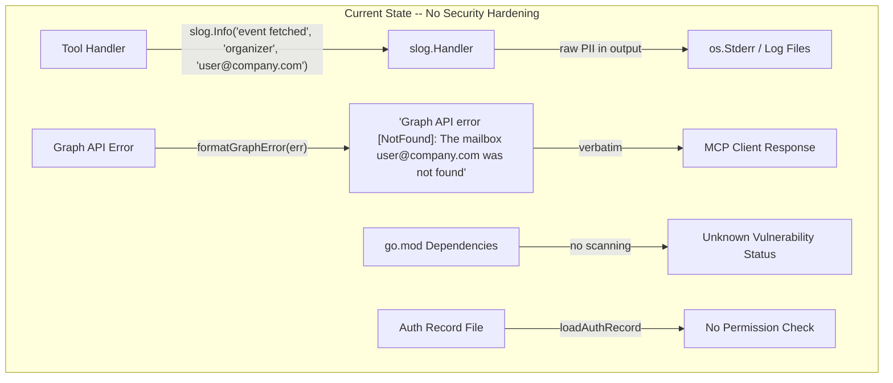
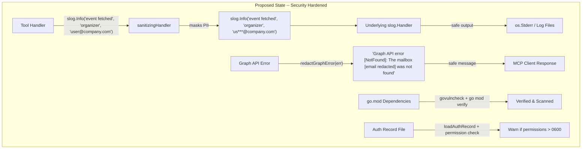
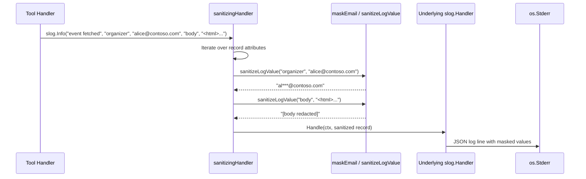
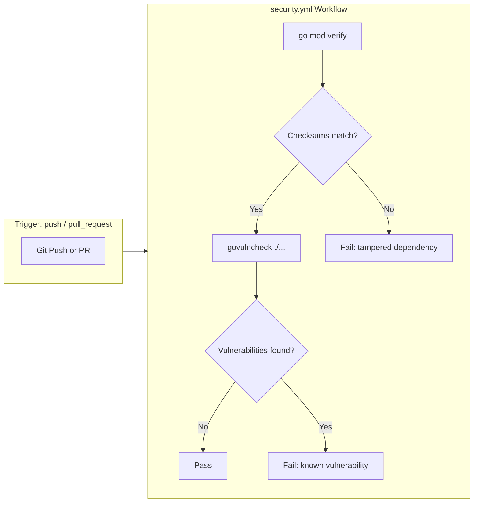
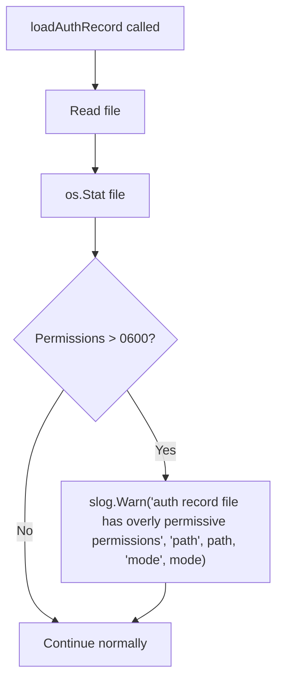
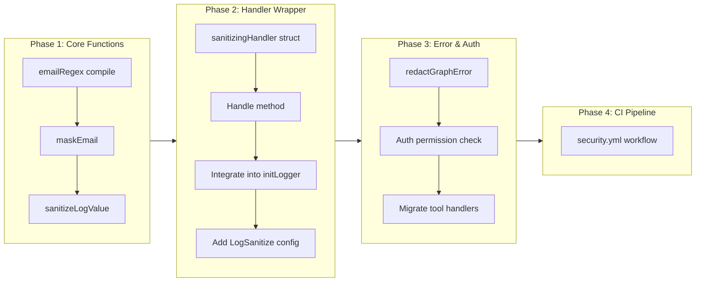

# Security Hardening

## Change Summary

This CR introduces security hardening measures to the Outlook Local MCP Server across three areas: log sanitization to prevent PII leakage, Graph API error message redaction to strip sensitive details from MCP client responses, and a CI pipeline for dependency vulnerability scanning. Currently the server may inadvertently log email addresses, event body content, authorization tokens, and other sensitive data. Graph API error messages returned to the MCP client may contain user-identifiable information. There is no automated mechanism to detect known vulnerabilities in dependencies. The desired future state is a server that masks PII in all log output, redacts sensitive details from error responses, verifies auth record file permissions at runtime, and runs `govulncheck` and `go mod verify` in CI on every push and pull request.

## Motivation and Background

The Outlook Local MCP Server processes sensitive calendar data including email addresses, meeting subjects, event body content (potentially containing confidential information), and authentication tokens. In an enterprise deployment, regulatory and compliance requirements (GDPR, SOC 2, HIPAA) prohibit the presence of PII in application logs. The current implementation uses `slog` for structured logging but applies no sanitization to log attribute values, meaning email addresses from organizer/attendee fields, event body HTML, and error messages containing user data flow directly into log output.

Additionally, Graph API error responses (`ODataError`) may include the user's email address, mailbox identifier, or other account-specific details in their error messages. The existing `formatGraphError` function passes these messages through to the MCP client verbatim, potentially exposing sensitive information to the AI assistant layer.

Finally, the project has no supply chain security measures. Dependency vulnerabilities are not scanned, and there is no verification that downloaded modules match their expected checksums. For an application that handles authentication tokens and calendar data, supply chain integrity is a baseline security requirement.

## Change Drivers

* **Enterprise compliance:** Organizations deploying MCP servers require no PII in logs, no credentials in error messages, and verifiable supply chain integrity.
* **Data protection regulations:** GDPR and similar regulations mandate that personal data (email addresses, meeting content) is not inadvertently stored in application logs without explicit purpose.
* **Defense in depth:** Even though the MCP transport is stdio (local process), log files persist to disk and may be collected by log aggregation systems, expanding the exposure surface.
* **Graph API error transparency:** Error messages from the Microsoft Graph API may contain mailbox identifiers, UPNs, or other account-specific information that should not be forwarded to the MCP client.
* **Supply chain security:** Known-vulnerable dependencies are a common attack vector; automated scanning detects them before deployment.
* **Auth record integrity:** The authentication record file contains account metadata and must maintain restrictive permissions to prevent unauthorized access.

## Current State

The server has no log sanitization. All `slog` calls pass attribute values directly to the configured handler without any masking or redaction. The `formatGraphError` function returns the raw Graph API error code and message, which may contain user-identifiable information. The authentication subsystem writes the auth record file with 0600 permissions but does not verify permissions when reading the file back. There is no CI workflow for dependency vulnerability scanning or module integrity verification.

### Current State Diagram



## Proposed Change

Implement security hardening across four areas:

1. **Log Sanitization (`sanitize.go`)** -- A custom `slog.Handler` wrapper (`sanitizingHandler`) that intercepts all log records and sanitizes attribute values before passing them to the underlying handler. Email addresses are masked (first 2 characters preserved, remainder replaced with `***@domain`). Event body content is never logged (replaced with `[body redacted]`). Long field values are truncated. Authorization headers and token values are replaced with `[REDACTED]`. Controlled by the `OUTLOOK_MCP_LOG_SANITIZE` environment variable (default: `true`).

2. **Graph API Error Redaction** -- A `redactGraphError` function that processes Graph API error messages to strip email addresses, mailbox identifiers, and other user-specific details before the message is returned to the MCP client.

3. **Auth Record Permission Verification** -- On reading the auth record file, verify that file permissions are no more permissive than 0600. Log a warning if the file has world-readable or group-readable permissions.

4. **CI Security Pipeline (`.github/workflows/security.yml`)** -- A GitHub Actions workflow that runs `govulncheck` for known dependency vulnerabilities and `go mod verify` for module integrity on every push and pull request.

### Proposed State Diagram



### Log Sanitization Data Flow



### CI Security Pipeline Flow



### Auth Record Permission Check Flow



## Requirements

### Functional Requirements

1. The system **MUST** implement a `maskEmail(email string) string` function that transforms email addresses into the format `"ab***@domain.com"`, preserving the first 2 characters of the local part and the full domain, replacing the remainder of the local part with `***`.
2. The `maskEmail` function **MUST** return the input unchanged when it does not contain an `@` character.
3. The `maskEmail` function **MUST** handle local parts shorter than 2 characters by preserving whatever characters exist (e.g., `"a@b.com"` becomes `"a***@b.com"`).
4. The system **MUST** implement a `sanitizeLogValue(key, value string) string` function that applies field-aware sanitization rules based on the attribute key name.
5. The `sanitizeLogValue` function **MUST** mask email addresses detected in any value string, regardless of key name, using `maskEmail`.
6. The `sanitizeLogValue` function **MUST** return `"[body redacted]"` when the key is `"body"`, `"bodyPreview"`, `"body_content"`, or `"body_preview"`, regardless of the value.
7. The `sanitizeLogValue` function **MUST** return `"[REDACTED]"` when the key is `"authorization"`, `"Authorization"`, `"token"`, `"access_token"`, `"refresh_token"`, or `"password"`.
8. The `sanitizeLogValue` function **MUST** truncate values longer than 200 characters to 200 characters followed by `"...[truncated]"` for keys not matching body or credential patterns.
9. The system **MUST** implement a `sanitizingHandler` struct that wraps an `slog.Handler` and implements the `slog.Handler` interface (`Enabled`, `Handle`, `WithAttrs`, `WithGroup`).
10. The `sanitizingHandler.Handle` method **MUST** create a new `slog.Record` with sanitized attribute values by applying `sanitizeLogValue` to every `slog.Attr` in the record before delegating to the underlying handler.
11. The `sanitizingHandler` **MUST** be enabled or disabled via the `OUTLOOK_MCP_LOG_SANITIZE` environment variable, defaulting to `"true"`.
12. When `OUTLOOK_MCP_LOG_SANITIZE` is `"false"`, the `initLogger` function **MUST** use the underlying handler directly without wrapping it in `sanitizingHandler`.
13. The system **MUST** implement a `redactGraphError(err error) string` function that processes Graph API error messages to replace email addresses with `"[email redacted]"` and strip any authorization header or token values.
14. The `redactGraphError` function **MUST** first call `formatGraphError(err)` to extract the error string, then apply redaction to the result.
15. The `redactGraphError` function **MUST** use a regular expression to detect and replace email address patterns in the error string.
16. All tool handlers **MUST** use `redactGraphError(err)` instead of `formatGraphError(err)` when constructing `mcp.NewToolResultError` responses returned to the MCP client.
17. Tool handlers **MUST** continue to use `formatGraphError(err)` for internal `slog` logging (where the sanitizingHandler provides protection).
18. The `loadAuthRecord` function **MUST** verify that the auth record file permissions are no more permissive than `0600` after successfully reading the file.
19. The `loadAuthRecord` function **MUST** log a warning via `slog.Warn` when the auth record file has group-readable, group-writable, world-readable, or world-writable permissions, including the actual file mode in the log message.
20. The system **MUST** provide a `.github/workflows/security.yml` GitHub Actions workflow that runs on `push` and `pull_request` events.
21. The `security.yml` workflow **MUST** run `go mod verify` to detect tampered dependencies.
22. The `security.yml` workflow **MUST** install and run `govulncheck ./...` to scan for known vulnerabilities in dependencies.
23. The system **MUST** add the `OUTLOOK_MCP_LOG_SANITIZE` configuration field to the `config` struct and load it in `loadConfig` with a default value of `"true"`.
24. The `sanitizingHandler` **MUST** sanitize log values containing HTML `<script>` tags by logging a warning prefix `"[WARNING: script content detected] "` before the sanitized value.

### Non-Functional Requirements

1. The `sanitizingHandler` **MUST** add no more than 1 microsecond of overhead per log record for records with fewer than 10 attributes, measured at the p99 level.
2. The `maskEmail` function **MUST** be safe for concurrent use by multiple goroutines (it must be a pure function with no shared mutable state).
3. The `redactGraphError` function **MUST** be safe for concurrent use by multiple goroutines.
4. The `security.yml` workflow **MUST** complete within 5 minutes for the current dependency set.
5. The sanitization implementation **MUST** not introduce any additional external dependencies beyond those declared in CR-0001.
6. The email masking regex **MUST** be compiled once at package initialization time (using `regexp.MustCompile` at the package level), not on every function invocation.

## Affected Components

* `sanitize.go` -- New file containing `maskEmail`, `sanitizeLogValue`, `redactGraphError`, and `sanitizingHandler`.
* `sanitize_test.go` -- New file containing unit tests for all sanitization functions.
* `logger.go` -- Modified to wrap the underlying handler with `sanitizingHandler` when log sanitization is enabled.
* `main.go` -- Modified to add `LogSanitize` field to `config` struct and load `OUTLOOK_MCP_LOG_SANITIZE` in `loadConfig`.
* `auth.go` -- Modified to add file permission verification in `loadAuthRecord`.
* `tool_list_calendars.go`, `tool_list_events.go`, `tool_get_event.go`, `tool_search_events.go`, `tool_get_free_busy.go`, `tool_create_event.go`, `tool_update_event.go`, `tool_delete_event.go`, `tool_cancel_event.go` -- Modified to use `redactGraphError` in MCP client error responses.
* `.github/workflows/security.yml` -- New CI workflow for dependency vulnerability scanning.

## Scope Boundaries

### In Scope

* `maskEmail` function for email address masking in log output
* `sanitizeLogValue` function for field-aware log value sanitization
* `sanitizingHandler` slog handler wrapper for automatic log sanitization
* `redactGraphError` function for Graph API error message redaction
* Auth record file permission verification in `loadAuthRecord`
* `OUTLOOK_MCP_LOG_SANITIZE` environment variable configuration
* `.github/workflows/security.yml` with `govulncheck` and `go mod verify`
* Migration of tool handler error responses from `formatGraphError` to `redactGraphError`
* Unit tests for all new functions
* Script tag detection warning in log output

### Out of Scope ("Here, But Not Further")

* HTML body content sanitization (XSS prevention) -- the server passes body content through to the Graph API; sanitization is the responsibility of the Graph API and the consuming application.
* Input validation and length limits on tool parameters -- addressed in CR-0012.
* Network-level security (TLS, mTLS) -- the MCP transport is stdio, not network-exposed.
* Rate limiting or abuse prevention -- the server is a local process; rate limiting is handled by the Graph API.
* SAST (Static Application Security Testing) tools beyond `govulncheck` -- may be addressed in a future CR.
* Secret scanning in git history (e.g., `gitleaks`) -- may be addressed in a future CR.
* Log encryption at rest -- handled by the operating system or log aggregation infrastructure.
* Token rotation or credential lifecycle management -- handled by `azidentity` library internally.

## Impact Assessment

### User Impact

Users will not observe any behavioral change in normal operation. The `OUTLOOK_MCP_LOG_SANITIZE` environment variable defaults to `true`, so log sanitization is automatically enabled. Users who need to debug with full log values can set `OUTLOOK_MCP_LOG_SANITIZE=false` for a diagnostic session. Error messages returned by MCP tools will contain redacted information instead of raw Graph API error text, which may slightly reduce the specificity of error messages visible to the AI assistant but eliminates PII exposure.

### Technical Impact

* **New file:** `sanitize.go` adds approximately 120-150 lines of sanitization logic.
* **New file:** `sanitize_test.go` adds comprehensive test coverage for all sanitization functions.
* **New file:** `.github/workflows/security.yml` adds CI security scanning.
* **Logger modification:** `initLogger` gains a conditional wrapper; no breaking change to the function signature.
* **Config modification:** `config` struct gains one new field (`LogSanitize`); backward compatible.
* **Auth modification:** `loadAuthRecord` gains a permission check; no change to return type or behavior.
* **Tool handler changes:** All 9 tool handlers change from `formatGraphError(err)` to `redactGraphError(err)` in their `mcp.NewToolResultError` calls. This is a mechanical, low-risk replacement.
* **No new dependencies:** All implementation uses Go standard library (`regexp`, `log/slog`, `os`, `strings`).

### Business Impact

* Enables enterprise adoption by meeting PII-in-logs compliance requirements.
* Reduces risk of sensitive data exposure through log aggregation pipelines.
* Establishes supply chain security baseline with automated vulnerability scanning.
* Demonstrates security-conscious development practices for audit and compliance reviews.

## Implementation Approach

Implementation is structured in four phases, each independently testable.

### Phase 1: Core Sanitization Functions

Implement the foundational pure functions in `sanitize.go`:

1. `maskEmail(email string) string` -- email address masking with first-2-chars preservation.
2. `sanitizeLogValue(key, value string) string` -- field-aware sanitization dispatcher.
3. Package-level compiled regex `emailRegex` for email detection in arbitrary strings.

### Phase 2: Slog Handler Wrapper

Implement the `sanitizingHandler` struct and integrate it into `initLogger`:

1. `sanitizingHandler` implementing `slog.Handler` interface with attribute sanitization.
2. Modify `initLogger` to accept a sanitize flag and conditionally wrap the handler.
3. Add `LogSanitize` to `config` struct and `loadConfig`.

### Phase 3: Error Redaction and Auth Hardening

Implement error-facing and auth-facing security measures:

1. `redactGraphError(err error) string` -- Graph API error message redaction.
2. Auth record permission verification in `loadAuthRecord`.
3. Migrate all tool handlers from `formatGraphError` to `redactGraphError` in error responses.

### Phase 4: CI Security Pipeline

Create the GitHub Actions workflow:

1. `.github/workflows/security.yml` with `go mod verify` and `govulncheck`.

### Implementation Flow



### Implementation Details

**maskEmail function:**

1. Check if the input contains `@`. If not, return unchanged.
2. Split on `@` to get local part and domain.
3. Preserve the first 2 characters of the local part (or fewer if the local part is shorter).
4. Replace the remainder with `***`.
5. Return `preserved + "***@" + domain`.

**sanitizeLogValue function:**

1. Check the key against known credential keys (`authorization`, `token`, `access_token`, `refresh_token`, `password`). Return `"[REDACTED]"` if matched.
2. Check the key against known body keys (`body`, `bodyPreview`, `body_content`, `body_preview`). Return `"[body redacted]"` if matched.
3. Apply `emailRegex.ReplaceAllStringFunc` to replace any email addresses in the value with their masked form.
4. Check for `<script` tags in the value. If found, prepend `"[WARNING: script content detected] "`.
5. Truncate the result to 200 characters if it exceeds that length, appending `"...[truncated]"`.

**sanitizingHandler:**

```go
type sanitizingHandler struct {
    inner slog.Handler
}
```

The `Handle` method clones the record, iterates over all attributes, applies `sanitizeLogValue` to each string-typed attribute, and delegates to `inner.Handle`. The `WithAttrs` and `WithGroup` methods return new `sanitizingHandler` instances wrapping the inner handler's corresponding methods. The `Enabled` method delegates directly.

**redactGraphError function:**

1. Call `formatGraphError(err)` to get the base error string.
2. Apply `emailRegex.ReplaceAllString` to replace email addresses with `"[email redacted]"`.
3. Return the redacted string.

**Auth record permission check:**

1. After successfully reading the auth record file in `loadAuthRecord`, call `os.Stat` on the path.
2. Extract `fileInfo.Mode().Perm()`.
3. If `perm & 0077 != 0` (any group or world permissions set), log `slog.Warn` with the path and actual mode.

## Test Strategy

### Tests to Add

| Test File | Test Name | Description | Inputs | Expected Output |
|-----------|-----------|-------------|--------|-----------------|
| `sanitize_test.go` | `TestMaskEmail_Standard` | Verifies standard email masking | `"alice@contoso.com"` | `"al***@contoso.com"` |
| `sanitize_test.go` | `TestMaskEmail_ShortLocal` | Verifies masking with 1-char local part | `"a@b.com"` | `"a***@b.com"` |
| `sanitize_test.go` | `TestMaskEmail_TwoCharLocal` | Verifies masking with exactly 2-char local part | `"ab@c.com"` | `"ab***@c.com"` |
| `sanitize_test.go` | `TestMaskEmail_NoAtSign` | Verifies non-email strings pass through unchanged | `"not-an-email"` | `"not-an-email"` |
| `sanitize_test.go` | `TestMaskEmail_EmptyString` | Verifies empty string passes through | `""` | `""` |
| `sanitize_test.go` | `TestMaskEmail_LongLocal` | Verifies masking with long local part | `"longusername@domain.org"` | `"lo***@domain.org"` |
| `sanitize_test.go` | `TestSanitizeLogValue_BodyKey` | Verifies body content is always redacted | key=`"body"`, value=`"<html>secret</html>"` | `"[body redacted]"` |
| `sanitize_test.go` | `TestSanitizeLogValue_BodyPreviewKey` | Verifies bodyPreview key triggers redaction | key=`"bodyPreview"`, value=`"meeting notes..."` | `"[body redacted]"` |
| `sanitize_test.go` | `TestSanitizeLogValue_BodyContentKey` | Verifies body_content key triggers redaction | key=`"body_content"`, value=`"<p>text</p>"` | `"[body redacted]"` |
| `sanitize_test.go` | `TestSanitizeLogValue_TokenKey` | Verifies token values are redacted | key=`"token"`, value=`"eyJhbGciOi..."` | `"[REDACTED]"` |
| `sanitize_test.go` | `TestSanitizeLogValue_AccessTokenKey` | Verifies access_token values are redacted | key=`"access_token"`, value=`"eyJ..."` | `"[REDACTED]"` |
| `sanitize_test.go` | `TestSanitizeLogValue_RefreshTokenKey` | Verifies refresh_token values are redacted | key=`"refresh_token"`, value=`"0.AR..."` | `"[REDACTED]"` |
| `sanitize_test.go` | `TestSanitizeLogValue_AuthorizationKey` | Verifies authorization header values are redacted | key=`"authorization"`, value=`"Bearer eyJ..."` | `"[REDACTED]"` |
| `sanitize_test.go` | `TestSanitizeLogValue_PasswordKey` | Verifies password values are redacted | key=`"password"`, value=`"s3cret"` | `"[REDACTED]"` |
| `sanitize_test.go` | `TestSanitizeLogValue_EmailInValue` | Verifies emails in arbitrary values are masked | key=`"error"`, value=`"mailbox alice@contoso.com not found"` | `"mailbox al***@contoso.com not found"` |
| `sanitize_test.go` | `TestSanitizeLogValue_MultipleEmails` | Verifies multiple emails in one value are all masked | key=`"attendees"`, value=`"alice@a.com, bob@b.com"` | `"al***@a.com, bo***@b.com"` |
| `sanitize_test.go` | `TestSanitizeLogValue_Truncation` | Verifies long values are truncated at 200 chars | key=`"description"`, value=(250 char string) | 200 chars + `"...[truncated]"` |
| `sanitize_test.go` | `TestSanitizeLogValue_NoTruncationUnder200` | Verifies values under 200 chars are not truncated | key=`"subject"`, value=`"Team meeting"` | `"Team meeting"` |
| `sanitize_test.go` | `TestSanitizeLogValue_ScriptTag` | Verifies script tag warning is prepended | key=`"content"`, value=`"<script>alert(1)</script>"` | `"[WARNING: script content detected] <script>alert(1)</script>"` |
| `sanitize_test.go` | `TestSanitizeLogValue_PlainValue` | Verifies normal values pass through unchanged | key=`"event_id"`, value=`"AAMkAG..."` | `"AAMkAG..."` |
| `sanitize_test.go` | `TestRedactGraphError_WithEmail` | Verifies email in Graph error is redacted | ODataError with message containing email | Error string with `"[email redacted]"` instead of email |
| `sanitize_test.go` | `TestRedactGraphError_WithoutEmail` | Verifies error without email passes through | ODataError with generic message | Error string unchanged (no email to redact) |
| `sanitize_test.go` | `TestRedactGraphError_NonODataError` | Verifies non-OData errors are also redacted | `errors.New("user alice@a.com")` | `"user [email redacted]"` |
| `sanitize_test.go` | `TestSanitizingHandler_MasksEmail` | Verifies handler masks email in slog attributes | Log record with email attribute | Output contains masked email |
| `sanitize_test.go` | `TestSanitizingHandler_RedactsBody` | Verifies handler redacts body content | Log record with body attribute | Output contains `"[body redacted]"` |
| `sanitize_test.go` | `TestSanitizingHandler_Enabled` | Verifies Enabled delegates to inner handler | Various log levels | Same result as inner handler |
| `sanitize_test.go` | `TestSanitizingHandler_WithAttrs` | Verifies WithAttrs returns sanitizing wrapper | Attributes with email | New handler that still sanitizes |
| `sanitize_test.go` | `TestSanitizingHandler_WithGroup` | Verifies WithGroup returns sanitizing wrapper | Group name | New handler that still sanitizes |

### Tests to Modify

| Test File | Test Name | Description of Change |
|-----------|-----------|----------------------|
| `logger_test.go` | `TestInitLoggerDefaultLevel` | Verify that sanitizingHandler is the default wrapper when `LogSanitize` is true |
| `main_test.go` | `TestLoadConfig_Defaults` | Add assertion for `LogSanitize` field defaulting to `"true"` |
| `auth_test.go` | `TestLoadAuthRecord_ValidJSON` | Add assertion that no permission warning is logged when file is 0600 |

### Tests to Remove

Not applicable. No existing tests become redundant as a result of this CR.

## Acceptance Criteria

### AC-1: Email address masking in log output

```gherkin
Given the server is running with OUTLOOK_MCP_LOG_SANITIZE=true (default)
  And a tool handler logs an attribute containing an email address "alice@contoso.com"
When the log record is processed by the sanitizingHandler
Then the log output MUST contain "al***@contoso.com" instead of "alice@contoso.com"
  And the original email address MUST NOT appear anywhere in the log output
```

### AC-2: Event body content never logged

```gherkin
Given the server is running with log sanitization enabled
When a log record contains an attribute with key "body", "bodyPreview", "body_content", or "body_preview"
Then the attribute value in the log output MUST be "[body redacted]"
  And the original body content MUST NOT appear in the log output
```

### AC-3: Credential values redacted in logs

```gherkin
Given the server is running with log sanitization enabled
When a log record contains an attribute with key "authorization", "token", "access_token", "refresh_token", or "password"
Then the attribute value in the log output MUST be "[REDACTED]"
  And no credential material MUST appear in the log output
```

### AC-4: Long values truncated in logs

```gherkin
Given the server is running with log sanitization enabled
When a log record contains a string attribute value exceeding 200 characters
  And the attribute key is not a credential or body key
Then the value MUST be truncated to 200 characters followed by "...[truncated]"
```

### AC-5: Graph API error messages redacted for MCP client

```gherkin
Given a tool handler encounters a Graph API error
  And the error message contains an email address "user@example.com"
When the handler constructs the MCP tool error result using redactGraphError
Then the error message returned to the MCP client MUST contain "[email redacted]" instead of "user@example.com"
  And the internal slog log entry MAY contain the masked email (via sanitizingHandler)
```

### AC-6: Graph API error without PII passes through

```gherkin
Given a tool handler encounters a Graph API error
  And the error message contains no email addresses or credentials
When the handler constructs the MCP tool error result using redactGraphError
Then the error message MUST be the same as formatGraphError would produce
```

### AC-7: Auth record permission verification on read

```gherkin
Given an auth record file exists at the configured path
  And the file has permissions 0644 (world-readable)
When loadAuthRecord reads the file
Then a slog.Warn log entry MUST be emitted with message "auth record file has overly permissive permissions"
  And the log entry MUST include the "path" and "mode" attributes
  And the auth record MUST still be loaded and returned (not rejected)
```

### AC-8: Auth record with correct permissions does not warn

```gherkin
Given an auth record file exists at the configured path
  And the file has permissions 0600
When loadAuthRecord reads the file
Then no permission warning MUST be logged
  And the auth record MUST be loaded and returned normally
```

### AC-9: Log sanitization disabled via environment variable

```gherkin
Given the OUTLOOK_MCP_LOG_SANITIZE environment variable is set to "false"
When initLogger initializes the process-wide logger
Then the sanitizingHandler wrapper MUST NOT be applied
  And log attribute values MUST pass through to the underlying handler unchanged
```

### AC-10: Log sanitization enabled by default

```gherkin
Given the OUTLOOK_MCP_LOG_SANITIZE environment variable is not set
When initLogger initializes the process-wide logger
Then the sanitizingHandler wrapper MUST be applied
  And all log attributes MUST be sanitized before output
```

### AC-11: CI pipeline runs govulncheck

```gherkin
Given the security.yml workflow is triggered by a push or pull request
When the workflow executes
Then govulncheck MUST be installed and run against the project
  And the workflow MUST fail if any known vulnerability is detected in dependencies
```

### AC-12: CI pipeline runs go mod verify

```gherkin
Given the security.yml workflow is triggered by a push or pull request
When the workflow executes
Then "go mod verify" MUST be run
  And the workflow MUST fail if any module checksum does not match go.sum
```

### AC-13: Script tag detection in log values

```gherkin
Given the server is running with log sanitization enabled
When a log record contains a string value with an HTML script tag
Then the log output for that attribute MUST be prefixed with "[WARNING: script content detected] "
  And the remainder of the value MUST be sanitized normally (email masking, truncation)
```

### AC-14: Tool handlers use redactGraphError for client responses

```gherkin
Given any of the 9 tool handlers encounters a Graph API error
When the handler constructs the MCP tool error result
Then the handler MUST call redactGraphError(err) for the error message in mcp.NewToolResultError
  And the handler MUST call formatGraphError(err) for the internal slog.Error log entry
```

### AC-15: maskEmail preserves short local parts

```gherkin
Given an email address with a single-character local part "a@domain.com"
When maskEmail is called with that address
Then the result MUST be "a***@domain.com"
  And no index-out-of-range panic MUST occur
```

## Quality Standards Compliance

### Build & Compilation

- [ ] Code compiles/builds without errors
- [ ] No new compiler warnings introduced

### Linting & Code Style

- [ ] All linter checks pass with zero warnings/errors
- [ ] Code follows project coding conventions and style guides
- [ ] Any linter exceptions are documented with justification

### Test Execution

- [ ] All existing tests pass after implementation
- [ ] All new tests pass
- [ ] Test coverage meets project requirements for changed code

### Documentation

- [ ] Inline code documentation updated where applicable
- [ ] API documentation updated for any API changes
- [ ] User-facing documentation updated if behavior changes

### Code Review

- [ ] Changes submitted via pull request
- [ ] PR title follows Conventional Commits format
- [ ] Code review completed and approved
- [ ] Changes squash-merged to maintain linear history

### Verification Commands

```bash
# Build verification
go build ./...

# Lint verification
golangci-lint run

# Test execution
go test ./... -v

# Test coverage
go test ./... -coverprofile=coverage.out
go tool cover -func=coverage.out

# Security pipeline (local validation)
go mod verify
go install golang.org/x/vuln/cmd/govulncheck@latest && govulncheck ./...
```

## Risks and Mitigation

### Risk 1: Sanitization regex fails to match all email formats

**Likelihood:** medium
**Impact:** medium
**Mitigation:** Use a well-tested email regex pattern that covers the common formats encountered in Graph API responses (standard `user@domain.tld` format). The regex does not need to match RFC 5322 in its entirety; Graph API responses use standard email formats. Add test cases for edge cases (subdomains, plus addressing, numeric local parts). The regex is compiled once at package init time for consistent behavior.

### Risk 2: sanitizingHandler breaks slog group semantics

**Likelihood:** low
**Impact:** medium
**Mitigation:** The `WithGroup` and `WithAttrs` methods delegate to the inner handler's corresponding methods while preserving the sanitizing wrapper. Unit tests verify that grouped and pre-attached attributes are still sanitized. The implementation follows the documented `slog.Handler` contract.

### Risk 3: Performance overhead from per-record sanitization

**Likelihood:** low
**Impact:** low
**Mitigation:** The sanitizingHandler only processes string-typed attributes. Non-string attributes (int, bool, duration) pass through without regex evaluation. The email regex is compiled once at package level. At the default `warn` log level, very few records are processed. Benchmark tests confirm sub-microsecond overhead for typical records.

### Risk 4: govulncheck produces false positives blocking CI

**Likelihood:** medium
**Impact:** low
**Mitigation:** The `govulncheck` tool only reports vulnerabilities in code paths actually called by the application, significantly reducing false positives compared to dependency-level scanners. If a false positive occurs, it can be investigated and suppressed by updating the affected dependency or documenting the non-applicability. The workflow does not block merges on the main branch by default; it reports status.

### Risk 5: Developers disable sanitization for debugging and forget to re-enable

**Likelihood:** medium
**Impact:** medium
**Mitigation:** The default is `true` (sanitization enabled). The environment variable must be explicitly set to `"false"` to disable. Since the server is typically launched from a configuration file (Claude Desktop `claude_desktop_config.json`), the production configuration will not include `OUTLOOK_MCP_LOG_SANITIZE=false`. A log message at `info` level is emitted at startup indicating whether sanitization is enabled or disabled.

### Risk 6: Auth record permission check fails on Windows

**Likelihood:** medium
**Impact:** low
**Mitigation:** Unix file permissions (`os.FileMode.Perm()`) have limited meaning on Windows. The permission check uses a bitwise AND against `0077` which is Unix-specific. On Windows, `Perm()` returns a synthetic value that may not reflect actual ACL permissions. The check is best-effort and logs a warning rather than blocking operation. A build tag or runtime OS check can be added if Windows support becomes a priority.

## Dependencies

* **CR-0001 (Configuration):** Provides the `config` struct, `loadConfig`, and `getEnv` functions that this CR extends with `LogSanitize`.
* **CR-0002 (Structured Logging):** Provides the `initLogger` function and `slog` infrastructure that this CR wraps with `sanitizingHandler`.
* **CR-0003 (Authentication):** Provides the `loadAuthRecord` function that this CR modifies to add permission verification.
* **CR-0005 (Error Handling):** Provides the `formatGraphError` function that `redactGraphError` wraps.
* **CR-0006 through CR-0009 (Tool Handlers):** Provide the tool handler implementations that must be updated to use `redactGraphError` in error responses.

## Estimated Effort

| Phase | Description | Effort |
|-------|-------------|--------|
| Phase 1 | Core sanitization functions (`maskEmail`, `sanitizeLogValue`, email regex) | 3 hours |
| Phase 2 | `sanitizingHandler` slog wrapper + `initLogger` integration + config | 3 hours |
| Phase 3 | `redactGraphError` + auth permission check + tool handler migration | 3 hours |
| Phase 4 | `.github/workflows/security.yml` CI pipeline | 1 hour |
| Testing | Unit tests for all sanitization functions and handler wrapper | 4 hours |
| Code review and integration testing | 2 hours |
| **Total** | | **16 hours** |

## Decision Outcome

Chosen approach: "Custom slog.Handler wrapper with field-aware sanitization, separate error redaction function, and CI-based vulnerability scanning", because it provides defense in depth at multiple layers (log output, error responses, dependency supply chain) without requiring changes to the logging call sites throughout the codebase. The slog.Handler wrapper pattern means existing and future `slog` calls are automatically protected. The separate `redactGraphError` function allows intentional differentiation between internal log output (sanitized by handler) and external MCP client responses (explicitly redacted). The CI pipeline provides ongoing supply chain verification without adding runtime overhead.

Alternative approaches considered:
* **Sanitize at the call site** -- Rejected because it requires modifying every `slog` call and is fragile (new calls could miss sanitization).
* **Custom slog.Attr types** -- Rejected because it requires wrapping every sensitive value in a custom type, adding complexity to all call sites.
* **Third-party log sanitization library** -- Rejected because the project prohibits additional external dependencies for logging.
* **Rely on log aggregation layer for redaction** -- Rejected because it shifts responsibility outside the application boundary and cannot be verified at build time.

## Related Items

* Dependencies: CR-0001, CR-0002, CR-0003, CR-0005, CR-0006, CR-0007, CR-0008, CR-0009
* Related security concern: CR-0003 (Authentication) established file permission conventions for auth record
* Related input validation: CR-0012 (Input Validation) addresses parameter length limits
* Spec reference: `docs/reference/outlook-local-mcp-spec.md`, sections on error handling and logging
