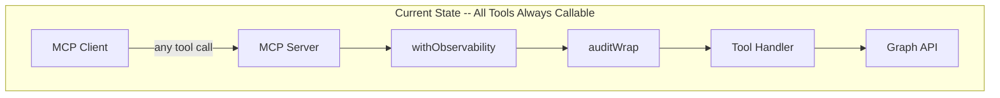
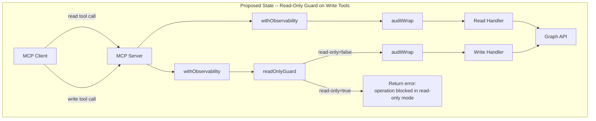
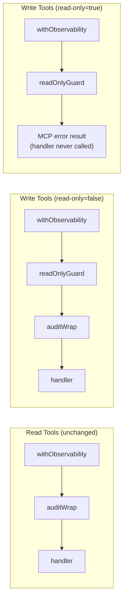
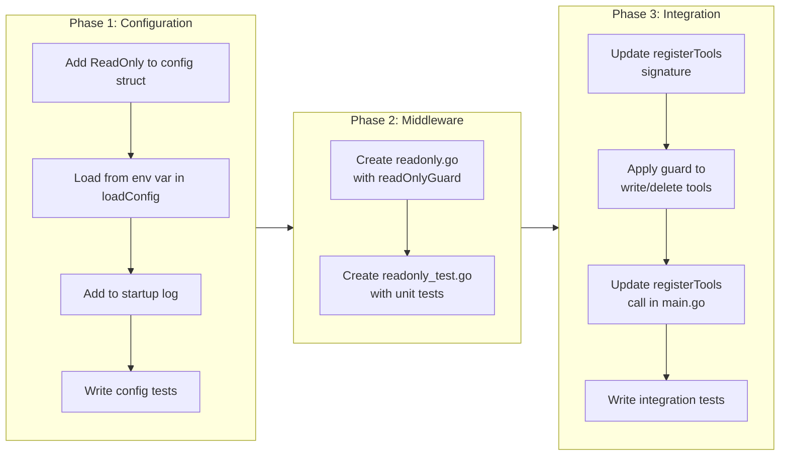

# Read-Only Mode Feature Toggle

## Change Summary

This CR introduces a read-only mode feature toggle to the Outlook Calendar MCP Server. Currently every registered tool -- both read and write -- is always callable. The desired future state is a server that, when the `OUTLOOK_MCP_READ_ONLY` environment variable is set to `"true"`, rejects all mutating operations (`create_event`, `update_event`, `delete_event`, `cancel_event`) with a clear error message returned to the MCP client. Read operations (`list_calendars`, `list_events`, `get_event`, `search_events`, `get_free_busy`) remain fully functional. All nine tools continue to be listed in the MCP tool catalog regardless of mode, but invoking a write tool in read-only mode returns an immediate error without calling the Graph API. Rejected invocations are logged with structured logging and recorded in the audit log.

## Motivation and Background

In enterprise and shared-assistant deployments, administrators need the ability to restrict the MCP server to read-only access. Use cases include:

* **Demonstration environments:** Showing calendar integration capabilities without risking modifications to real calendars.
* **Compliance-restricted users:** Some users or service accounts should only view calendars, never modify them.
* **Staged rollouts:** Deploying the server in read-only mode first to validate authentication and read flows before enabling writes.
* **Incident response:** Quickly disabling writes via environment variable without redeploying or modifying code.

The toggle follows the existing environment-variable-based configuration pattern established by all other server settings (e.g., `OUTLOOK_MCP_LOG_LEVEL`, `OUTLOOK_MCP_AUDIT_LOG_ENABLED`, `OUTLOOK_MCP_OTEL_ENABLED`).

## Change Drivers

* **Operational safety:** Prevent accidental calendar modifications in sensitive environments.
* **Configuration parity:** Other feature toggles (audit logging, OTEL, log sanitization) already follow the env-var pattern; read-only mode is a natural addition.
* **Enterprise readiness:** Read-only deployment modes are a standard requirement for enterprise calendar integrations.

## Current State

All nine MCP tools are unconditionally registered and callable. The `registerTools` function in `server.go` wires every tool handler with the full middleware chain (`withObservability` -> `auditWrap` -> handler). There is no mechanism to intercept or block tool invocations based on their operation type. The `config` struct has no `ReadOnly` field, and `loadConfig` does not read an `OUTLOOK_MCP_READ_ONLY` environment variable.

### Current State Diagram



## Proposed Change

Add a `ReadOnly` boolean field to the `config` struct, loaded from `OUTLOOK_MCP_READ_ONLY` (default: `"false"`). Implement a `readOnlyGuard` middleware function that wraps write tool handlers. When read-only mode is enabled, the guard returns an MCP tool error result immediately without calling the inner handler. When read-only mode is disabled, the guard passes through to the inner handler with zero overhead. The guard is inserted into the middleware chain in `registerTools` only for write/delete tools.

Tools continue to be registered in the MCP tool catalog regardless of mode. This ensures MCP clients can discover all capabilities and present appropriate guidance to users about which operations are available.

### Proposed State Diagram



### Middleware Chain Comparison



## Requirements

### Functional Requirements

1. The system **MUST** add a `ReadOnly` boolean field to the `config` struct, loaded from the `OUTLOOK_MCP_READ_ONLY` environment variable with a default value of `"false"`.
2. The system **MUST** treat the string values `"true"` and `"TRUE"` (case-insensitive) as enabling read-only mode; all other values (including empty) **MUST** disable it.
3. The system **MUST** implement a `readOnlyGuard` middleware function that accepts a tool name and a boolean indicating read-only mode, and wraps a `server.ToolHandlerFunc`.
4. When read-only mode is enabled, the `readOnlyGuard` **MUST** return `mcp.NewToolResultError` with the message: `"operation blocked: <tool_name> is not allowed in read-only mode"` without invoking the inner handler.
5. When read-only mode is disabled, the `readOnlyGuard` **MUST** pass the request through to the inner handler without modification.
6. The system **MUST** apply the `readOnlyGuard` middleware to all four write/delete tools: `create_event`, `update_event`, `delete_event`, and `cancel_event`.
7. The system **MUST NOT** apply the `readOnlyGuard` middleware to read tools: `list_calendars`, `list_events`, `get_event`, `search_events`, `get_free_busy`.
8. All nine tools **MUST** continue to be registered in the MCP server tool catalog regardless of read-only mode setting.
9. The system **MUST** log at `slog.Warn` level when a write tool invocation is blocked by read-only mode, including structured fields: `"tool"` (tool name), `"mode"` (`"read-only"`), and `"action"` (`"blocked"`).
10. The system **MUST** log at `slog.Info` level during startup when read-only mode is enabled, with the field `"read_only"` set to `true`.
11. The `readOnlyGuard` **MUST** be inserted between `withObservability` and `auditWrap` in the middleware chain so that blocked invocations are captured by observability metrics but the audit trail records the rejection.
12. The `registerTools` function signature **MUST** accept a `readOnly bool` parameter.

### Non-Functional Requirements

1. The `readOnlyGuard` middleware **MUST** add zero overhead when read-only mode is disabled -- the boolean check is the only additional operation.
2. The system **MUST** validate the `OUTLOOK_MCP_READ_ONLY` value during configuration validation (existing `validateConfig` function) to log a warning if the value is neither empty, `"true"`, nor `"false"`.
3. The system **MUST** include read-only mode status in the startup log line alongside other configuration values.

## Affected Components

* `main.go` -- new `ReadOnly` field in `config` struct, `loadConfig` reads `OUTLOOK_MCP_READ_ONLY`, startup log includes read-only status, `registerTools` call passes `cfg.ReadOnly`.
* `server.go` -- `registerTools` accepts `readOnly bool` parameter, applies `readOnlyGuard` to write/delete tool registrations.
* `readonly.go` (new file) -- `readOnlyGuard` middleware function.
* `readonly_test.go` (new file) -- unit tests for the `readOnlyGuard` middleware.
* `main_test.go` or `config_test.go` -- tests for config loading of the `ReadOnly` field.
* `server_test.go` (new file or existing) -- tests for `registerTools` with read-only mode enabled/disabled.

## Scope Boundaries

### In Scope

* `ReadOnly` field added to `config` struct with env var loading
* `readOnlyGuard` middleware function in a dedicated file
* Integration of guard into `registerTools` middleware chain for write/delete tools
* Startup logging of read-only mode status
* Structured warning log on blocked write tool invocations
* Unit tests for the guard middleware
* Unit tests for config loading of the new field
* Integration tests verifying write tools are blocked and read tools are unaffected

### Out of Scope ("Here, But Not Further")

* Per-tool granular access control (e.g., allow `create_event` but block `delete_event`) -- this CR is all-or-nothing for write operations
* Runtime toggling of read-only mode (requires server restart)
* Authentication scope downgrade (e.g., requesting `Calendars.Read` instead of `Calendars.ReadWrite`) -- the OAuth scope remains unchanged
* MCP tool catalog filtering (tools are always listed; only invocation is blocked)
* UI or client-side indicators of read-only mode (the MCP client discovers this through tool invocation errors)

## Impact Assessment

### User Impact

When read-only mode is enabled, users (via their MCP-connected AI assistant) receive a clear error message when attempting any write operation. The assistant can still list calendars, view events, search, and check free/busy status. The error message clearly identifies the restriction, allowing the assistant to communicate the limitation to the user. No existing read-only workflows are affected.

### Technical Impact

* The `registerTools` function gains one additional parameter (`readOnly bool`).
* Four tool registrations in `server.go` gain an additional middleware wrapper.
* One new source file (`readonly.go`) and one new test file (`readonly_test.go`) are added.
* The `config` struct gains one field; `loadConfig` gains one `getEnv` call.
* No changes to existing tool handler logic, Graph API calls, or error handling.

### Business Impact

Read-only mode enables safer enterprise deployments and demonstration environments, reducing the risk of accidental calendar modifications during evaluation or restricted-access scenarios.

## Implementation Approach

Implementation is divided into three sequential phases. Each phase is self-contained and can be verified independently.

### Phase 1: Configuration -- Add ReadOnly to config

**Goal:** Load and validate the `OUTLOOK_MCP_READ_ONLY` environment variable.

**Steps:**

1. **Add `ReadOnly` field to `config` struct** in `main.go`:
   - Add `ReadOnly bool` field with a doc comment explaining its purpose and the controlling environment variable.
   - Position it after the existing boolean fields (`LogSanitize`, `AuditLogEnabled`, `OTELEnabled`).

2. **Load value in `loadConfig`** in `main.go`:
   - Add: `cfg.ReadOnly = strings.EqualFold(getEnv("OUTLOOK_MCP_READ_ONLY", "false"), "true")`
   - This follows the exact pattern used by `cfg.OTELEnabled`.

3. **Add startup log** in `main()` in `main.go`:
   - Add `"read_only", cfg.ReadOnly` to the existing `slog.Info("server starting", ...)` call.

4. **Write config tests** in the existing config test file:
   - Test that `OUTLOOK_MCP_READ_ONLY=true` sets `ReadOnly` to `true`.
   - Test that `OUTLOOK_MCP_READ_ONLY=TRUE` sets `ReadOnly` to `true`.
   - Test that `OUTLOOK_MCP_READ_ONLY=false` sets `ReadOnly` to `false`.
   - Test that unset `OUTLOOK_MCP_READ_ONLY` defaults `ReadOnly` to `false`.

**Files modified:** `main.go`
**Files added:** none (tests go in existing test file)

### Phase 2: Middleware -- Implement readOnlyGuard

**Goal:** Create the `readOnlyGuard` middleware function in a dedicated file.

**Steps:**

1. **Create `readonly.go`** with package main:
   - Implement `readOnlyGuard(toolName string, readOnly bool, handler server.ToolHandlerFunc) server.ToolHandlerFunc`.
   - When `readOnly` is `false`, return the handler unchanged (zero overhead).
   - When `readOnly` is `true`, return a closure that:
     a. Logs at `slog.Warn` with fields `"tool"`, `"mode"`, `"action"`.
     b. Returns `mcp.NewToolResultError(fmt.Sprintf("operation blocked: %s is not allowed in read-only mode", toolName))` and `nil` error.
   - Include full Go doc comments on the function per project documentation standards.

2. **Create `readonly_test.go`** with tests:
   - `TestReadOnlyGuard_Enabled_BlocksHandler`: Verify the handler is never called and the error message matches.
   - `TestReadOnlyGuard_Disabled_PassesThrough`: Verify the handler is called and its result is returned.
   - `TestReadOnlyGuard_Enabled_ErrorMessageFormat`: Verify the error message contains the tool name.
   - `TestReadOnlyGuard_Disabled_ZeroOverhead`: Verify that when disabled, the returned function is the same reference as the input handler (or functionally equivalent).

**Files added:** `readonly.go`, `readonly_test.go`

### Phase 3: Integration -- Wire readOnlyGuard into registerTools

**Goal:** Connect the middleware to the tool registration chain and pass configuration through.

**Steps:**

1. **Update `registerTools` signature** in `server.go`:
   - Add `readOnly bool` parameter after the existing `tracer` parameter.
   - Update the function doc comment to describe the new parameter.

2. **Apply `readOnlyGuard` to write/delete tools** in `server.go`:
   - For `create_event`, `update_event`, `delete_event`, `cancel_event`: wrap the `auditWrap(...)` call with `readOnlyGuard(toolName, readOnly, auditWrap(...))`.
   - The resulting chain for write tools becomes: `withObservability(name, m, t, readOnlyGuard(name, readOnly, auditWrap(name, opType, handler)))`.
   - Read tools remain unchanged: `withObservability(name, m, t, auditWrap(name, opType, handler))`.

3. **Update `registerTools` call** in `main.go`:
   - Change `registerTools(s, graphClient, retryCfg, cfg.RequestTimeout, metrics, tracer)` to `registerTools(s, graphClient, retryCfg, cfg.RequestTimeout, metrics, tracer, cfg.ReadOnly)`.

4. **Write integration tests**:
   - Test that with `readOnly=true`, calling a write tool handler returns the expected blocked error.
   - Test that with `readOnly=true`, calling a read tool handler still works (passes through).
   - Test that with `readOnly=false`, all tools work as before.

**Files modified:** `server.go`, `main.go`

### Implementation Flow



## Test Strategy

### Tests to Add

| Test File | Test Name | Description | Inputs | Expected Output |
|-----------|-----------|-------------|--------|-----------------|
| `main_test.go` | `TestLoadConfig_ReadOnlyTrue` | Verifies ReadOnly is true when env var is "true" | `OUTLOOK_MCP_READ_ONLY=true` | `cfg.ReadOnly == true` |
| `main_test.go` | `TestLoadConfig_ReadOnlyTrueCaseInsensitive` | Verifies ReadOnly is true for "TRUE" | `OUTLOOK_MCP_READ_ONLY=TRUE` | `cfg.ReadOnly == true` |
| `main_test.go` | `TestLoadConfig_ReadOnlyFalse` | Verifies ReadOnly is false when env var is "false" | `OUTLOOK_MCP_READ_ONLY=false` | `cfg.ReadOnly == false` |
| `main_test.go` | `TestLoadConfig_ReadOnlyDefault` | Verifies ReadOnly defaults to false when unset | No env var set | `cfg.ReadOnly == false` |
| `readonly_test.go` | `TestReadOnlyGuard_Enabled_BlocksHandler` | Verifies handler is not called when read-only is true | `readOnly=true`, mock handler | Error result returned, handler not invoked |
| `readonly_test.go` | `TestReadOnlyGuard_Disabled_PassesThrough` | Verifies handler is called when read-only is false | `readOnly=false`, mock handler returning success | Handler result returned |
| `readonly_test.go` | `TestReadOnlyGuard_Enabled_ErrorMessageFormat` | Verifies error message contains tool name | `readOnly=true`, toolName="create_event" | Error text contains "create_event" and "read-only mode" |
| `readonly_test.go` | `TestReadOnlyGuard_Enabled_ErrorIsToolError` | Verifies the result has IsError=true | `readOnly=true` | `result.IsError == true` |
| `readonly_test.go` | `TestReadOnlyGuard_Disabled_NoOverhead` | Verifies disabled guard returns handler directly | `readOnly=false`, handler func | Returned func is same reference |
| `server_test.go` | `TestRegisterTools_ReadOnlyBlocksWrite` | Verifies write tool blocked in read-only mode | `readOnly=true`, call create_event handler | Error result with blocked message |
| `server_test.go` | `TestRegisterTools_ReadOnlyAllowsRead` | Verifies read tool works in read-only mode | `readOnly=true`, call list_calendars handler | Normal result (or mock pass-through) |
| `server_test.go` | `TestRegisterTools_WriteEnabledPassesThrough` | Verifies write tool works when read-only disabled | `readOnly=false`, call create_event handler | Normal handler result |

### Tests to Modify

| Test File | Test Name | Change Description |
|-----------|-----------|-------------------|
| Any existing test calling `registerTools` | Various | Add the new `readOnly` boolean parameter (set to `false` to preserve existing behavior) |

### Tests to Remove

Not applicable. No existing tests become redundant as a result of this CR.

## Acceptance Criteria

### AC-1: Read-only mode blocks create_event

```gherkin
Given the MCP server is running with OUTLOOK_MCP_READ_ONLY set to "true"
When the MCP client calls create_event with valid parameters
Then the server returns an MCP tool error result
  And the error message contains "create_event is not allowed in read-only mode"
  And the Graph API is NOT called
```

### AC-2: Read-only mode blocks update_event

```gherkin
Given the MCP server is running with OUTLOOK_MCP_READ_ONLY set to "true"
When the MCP client calls update_event with a valid event_id
Then the server returns an MCP tool error result
  And the error message contains "update_event is not allowed in read-only mode"
  And the Graph API is NOT called
```

### AC-3: Read-only mode blocks delete_event

```gherkin
Given the MCP server is running with OUTLOOK_MCP_READ_ONLY set to "true"
When the MCP client calls delete_event with a valid event_id
Then the server returns an MCP tool error result
  And the error message contains "delete_event is not allowed in read-only mode"
  And the Graph API is NOT called
```

### AC-4: Read-only mode blocks cancel_event

```gherkin
Given the MCP server is running with OUTLOOK_MCP_READ_ONLY set to "true"
When the MCP client calls cancel_event with a valid event_id
Then the server returns an MCP tool error result
  And the error message contains "cancel_event is not allowed in read-only mode"
  And the Graph API is NOT called
```

### AC-5: Read-only mode allows all read tools

```gherkin
Given the MCP server is running with OUTLOOK_MCP_READ_ONLY set to "true"
When the MCP client calls list_calendars, list_events, get_event, search_events, or get_free_busy
Then each tool executes normally and returns its expected result
  And the Graph API is called as usual
```

### AC-6: All tools remain listed in read-only mode

```gherkin
Given the MCP server is running with OUTLOOK_MCP_READ_ONLY set to "true"
When the MCP client requests the tool catalog
Then all nine tools are listed: list_calendars, list_events, get_event, search_events, get_free_busy, create_event, update_event, delete_event, cancel_event
```

### AC-7: Blocked invocations are logged

```gherkin
Given the MCP server is running with OUTLOOK_MCP_READ_ONLY set to "true"
When the MCP client calls any write tool (create_event, update_event, delete_event, cancel_event)
Then the server logs at Warn level
  And the log entry includes "tool" field with the tool name
  And the log entry includes "mode" field with value "read-only"
  And the log entry includes "action" field with value "blocked"
```

### AC-8: Startup log includes read-only status

```gherkin
Given OUTLOOK_MCP_READ_ONLY is set to "true"
When the MCP server starts
Then the startup log line includes "read_only" field set to true
```

### AC-9: Default behavior is unchanged

```gherkin
Given OUTLOOK_MCP_READ_ONLY is not set (or set to "false")
When the MCP server starts and tools are invoked
Then all nine tools execute normally with no read-only guard overhead
  And the startup log shows "read_only" field set to false
```

### AC-10: Blocked invocations are recorded by observability and guard logging

```gherkin
Given the MCP server is running with OUTLOOK_MCP_READ_ONLY set to "true"
  And audit logging is enabled
When the MCP client calls create_event
Then the readOnlyGuard emits a slog.Warn log with tool, mode, and action fields
  And the withObservability middleware captures the invocation in metrics
  And auditWrap does NOT execute because the guard blocks before it in the chain
```

## Quality Standards Compliance

### Build & Compilation

- [x] Code compiles/builds without errors
- [x] No new compiler warnings introduced

### Linting & Code Style

- [x] All linter checks pass with zero warnings/errors
- [x] Code follows project coding conventions and style guides
- [ ] Any linter exceptions are documented with justification

### Test Execution

- [x] All existing tests pass after implementation
- [x] All new tests pass
- [x] Test coverage meets project requirements for changed code

### Documentation

- [x] Inline code documentation updated where applicable
- [ ] API documentation updated for any API changes
- [ ] User-facing documentation updated if behavior changes

### Code Review

- [ ] Changes submitted via pull request
- [ ] PR title follows Conventional Commits format
- [ ] Code review completed and approved
- [ ] Changes squash-merged to maintain linear history

### Verification Commands

```bash
# Build verification
go build ./...

# Lint verification
golangci-lint run

# Test execution
go test ./... -v

# Test coverage
go test ./... -coverprofile=coverage.out
go tool cover -func=coverage.out
```

## Risks and Mitigation

### Risk 1: Existing tests break due to registerTools signature change

**Likelihood:** high
**Impact:** low
**Mitigation:** All existing callers of `registerTools` (production code in `main.go` and any test helpers) must be updated to pass the new `readOnly` parameter. Setting it to `false` preserves all existing behavior. This is a purely additive, backward-compatible change when `readOnly=false`.

### Risk 2: Middleware ordering causes audit entries to miss blocked invocations

**Likelihood:** medium
**Impact:** medium
**Mitigation:** The `readOnlyGuard` is placed between `withObservability` and `auditWrap` in the chain. However, since blocked invocations do not pass through `auditWrap`, the audit trail for blocked calls comes from `withObservability` (metrics) and the guard's own `slog.Warn` log. If audit coverage of blocked invocations is critical, an alternative ordering (guard after auditWrap) can be used, but this means `auditWrap` would always execute. The chosen ordering prioritizes not auditing calls that never reach the handler. The acceptance criteria (AC-10) clarifies the expected behavior.

### Risk 3: MCP client confusion when tools are listed but not callable

**Likelihood:** low
**Impact:** low
**Mitigation:** The error message from `readOnlyGuard` clearly states the tool is blocked due to read-only mode. MCP clients (AI assistants) can interpret this message and communicate the restriction to the user. Removing tools from the catalog would be more confusing, as the client would not know the capability exists at all.

## Dependencies

* **CR-0001 (Configuration):** Required for `config` struct and `loadConfig` pattern.
* **CR-0002 (Logging):** Required for `slog` structured logging used by the guard middleware.
* **CR-0004 (Server Bootstrap):** Required for `registerTools` function and MCP server instance.
* **CR-0008 (Create/Update Tools):** The tools that will be guarded in write mode.
* **CR-0009 (Delete/Cancel Tools):** The tools that will be guarded in delete mode.
* **CR-0015 (Audit Logging):** Required for `auditWrap` middleware that participates in the chain.
* **CR-0018 (Observability):** Required for `withObservability` middleware that participates in the chain.

## Estimated Effort

| Phase | Description | Estimate |
|-------|-------------|----------|
| Phase 1 | Configuration (ReadOnly field, loadConfig, startup log, tests) | 1 hour |
| Phase 2 | Middleware (readOnlyGuard function + tests) | 1.5 hours |
| Phase 3 | Integration (registerTools wiring, main.go update, integration tests) | 1.5 hours |
| **Total** | | **4 hours** |

## Decision Outcome

Chosen approach: "Middleware guard on write tools with env-var toggle", because it follows the established middleware composition pattern (`withObservability` -> `readOnlyGuard` -> `auditWrap` -> handler), requires minimal code changes (one new file, two modified files), adds zero overhead when disabled, and aligns with the existing env-var-based configuration model. Alternative approaches considered and rejected:

* **Conditional tool registration (don't register write tools):** Rejected because MCP clients would lose visibility into the server's full capabilities, and the tool catalog would differ between deployments, complicating client-side logic.
* **Guard inside each handler:** Rejected because it duplicates the read-only check across four handlers, violating DRY and creating maintenance risk if new write tools are added later.
* **Auth scope downgrade (Calendars.Read instead of Calendars.ReadWrite):** Rejected because it conflates authentication configuration with runtime access control, cannot be toggled without re-authentication, and is not a defense-in-depth layer (Graph API errors are less user-friendly than a local guard).

## Related Items

* CR-0001 -- Configuration pattern and `config` struct
* CR-0004 -- Server bootstrap and `registerTools` function
* CR-0008 -- Create and update event tools (guarded by this CR)
* CR-0009 -- Delete and cancel event tools (guarded by this CR)
* CR-0015 -- Audit logging middleware (`auditWrap`)
* CR-0018 -- Observability middleware (`withObservability`)
