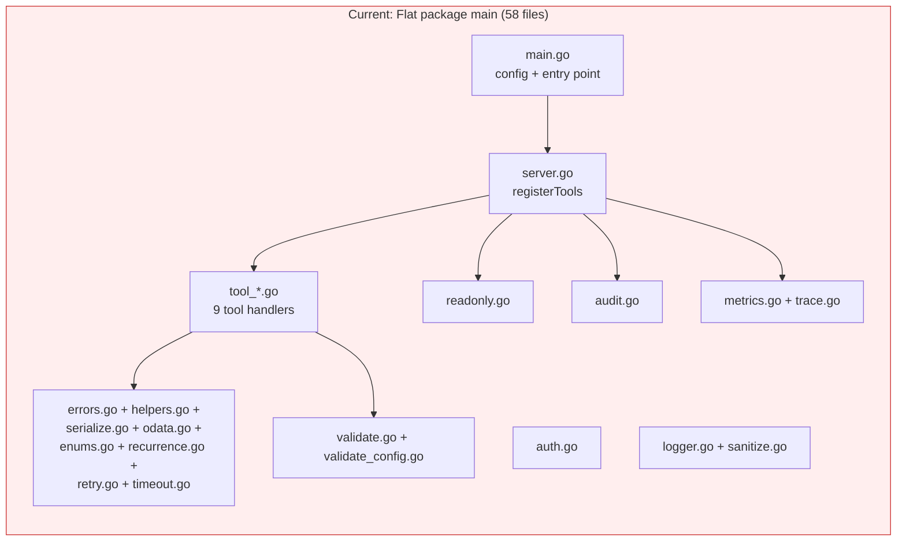
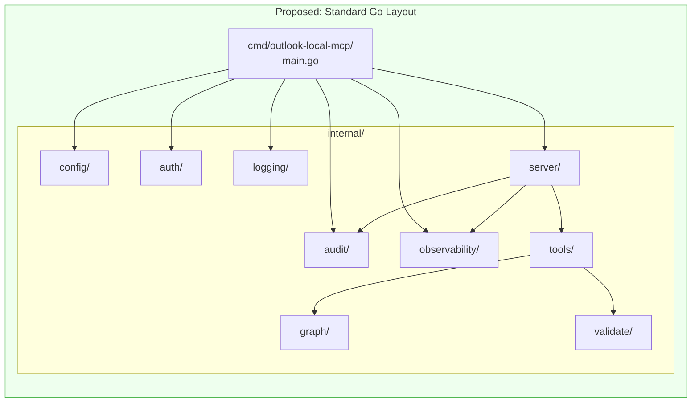
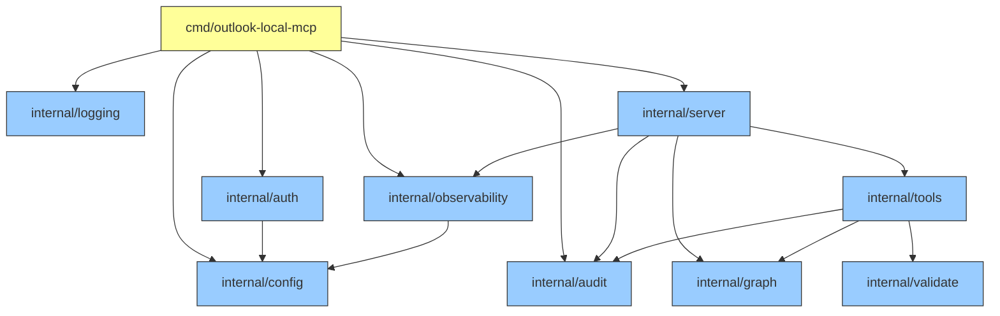
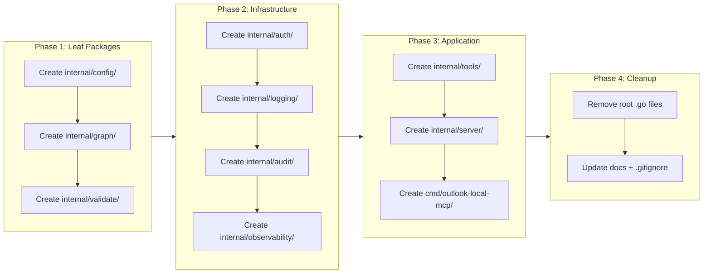

# Refactor to Go Standard Project Layout

## Change Summary

The Outlook Local MCP Server currently places all 58 Go files (29 source, 29 test) in a single flat `package main` in the repository root. This CR refactors the project to follow the Go standard project layout recommended at https://go.dev/doc/modules/layout, introducing a `cmd/outlook-local-mcp/` entry point and `internal/` packages organized by domain responsibility. The module path, binary name, and external behavior remain unchanged.

## Motivation and Background

When the project began (CR-0001), all code was placed in `package main` in the root directory. CR-0001 explicitly noted: "If the codebase grows, refactoring into packages can be done later." The codebase has since grown through 20 CRs to 12,322 lines across 58 files encompassing 9 distinct subsystems (config, auth, logging, audit, graph utilities, input validation, observability, middleware, and tool handlers). The flat layout now creates several concrete problems:

1. **No encapsulation**: Every function, type, and variable is visible to every other file. There is no compiler-enforced boundary between subsystems. A tool handler can directly call `initLogger` or mutate `auditEnabled` — the language provides no protection.

2. **Namespace pollution**: 29 source files declare approximately 100 package-level symbols (types, functions, variables) in a single namespace. Name collisions require prefixing (e.g., `auditEmailPattern` vs `emailRegex` for the same concept in different files).

3. **Test isolation**: All test files share the same `package main` scope. Test helpers, mock types, or test fixtures from one subsystem are visible to every other test file, creating implicit coupling.

4. **Discoverability**: A developer opening the repository sees 58 `.go` files with no grouping signal. Understanding which files form a subsystem requires reading file headers or knowing the naming convention (`tool_*.go` = handlers, but `validate.go` vs `validate_config.go` have unrelated responsibilities).

5. **Deviation from Go conventions**: The official Go module layout guide (https://go.dev/doc/modules/layout) recommends the "Server project" structure for applications like this: `cmd/` for entry points and `internal/` for implementation packages. Tools like `go doc`, IDE navigation, and dependency analysis work best with idiomatic package boundaries.

## Change Drivers

* Codebase has grown from 1 file (CR-0001) to 58 files across 9 subsystems — well past the "basic command" threshold
* No compiler-enforced boundaries between subsystems despite distinct responsibilities
* Duplicate symbol names across files (e.g., two separate email regex patterns in `sanitize.go` and `audit.go`)
* Official Go project layout guide explicitly recommends `cmd/` + `internal/` for server projects
* CR-0001 anticipated this refactoring: "A multi-package layout adds unnecessary complexity for a project of this size. If the codebase grows, refactoring into packages can be done later."

## Current State

All 58 Go files reside in the repository root, declaring `package main`:

```
outlook-mcp/
  go.mod
  go.sum
  main.go                    # Entry point + config struct + loadConfig
  server.go                  # registerTools
  signal.go                  # awaitShutdownSignal
  auth.go                    # Device code auth, token cache
  logger.go                  # initLogger
  sanitize.go                # sanitizingHandler for PII masking
  audit.go                   # Audit logging subsystem
  errors.go                  # formatGraphError
  helpers.go                 # safeStr, safeBool
  serialize.go               # serializeEvent
  odata.go                   # escapeOData
  enums.go                   # 7 enum parsers
  recurrence.go              # buildRecurrence
  retry.go                   # retryGraphCall, retryConfig
  timeout.go                 # withTimeout
  validate.go                # Input validation helpers
  validate_config.go         # validateConfig
  metrics.go                 # toolMetrics, initMetrics
  trace.go                   # initOTEL, withObservability
  readonly.go                # readOnlyGuard
  tool_list_calendars.go     # list_calendars handler
  tool_list_events.go        # list_events handler
  tool_get_event.go          # get_event handler
  tool_search_events.go      # search_events handler
  tool_get_free_busy.go      # get_free_busy handler
  tool_create_event.go       # create_event handler
  tool_update_event.go       # update_event handler
  tool_delete_event.go       # delete_event handler
  tool_cancel_event.go       # cancel_event handler
  *_test.go                  # 29 test files (one per source file)
```

### Current State Diagram



## Proposed Change

Restructure the repository to match the Go standard "Server project" layout. All implementation code moves into `internal/` packages organized by domain. The entry point moves to `cmd/outlook-local-mcp/main.go`. The module path (`github.com/desek/outlook-local-mcp`), binary name, environment variables, and runtime behavior remain identical.

### Proposed State Diagram



### Proposed Directory Structure

```
outlook-mcp/
  go.mod
  go.sum
  cmd/
    outlook-local-mcp/
      main.go                  # Entry point only: config load, subsystem init, lifecycle
  internal/
    config/
      config.go                # config struct, loadConfig, getEnv
      validate.go              # validateConfig, uuidRegex, valid maps
      config_test.go
      validate_test.go
    auth/
      auth.go                  # setupCredential, initCache, loadAuthRecord, saveAuthRecord
      auth_test.go
    logging/
      logger.go                # initLogger, parseLogLevel
      sanitize.go              # sanitizingHandler, maskEmail, sanitizeLogValue, redactGraphError
      logger_test.go
      sanitize_test.go
    audit/
      audit.go                 # AuditEntry, initAuditLog, emitAuditLog, auditWrap, maskAuditEmail
      audit_test.go
    graph/
      errors.go                # formatGraphError
      helpers.go               # safeStr, safeBool
      serialize.go             # serializeEvent
      odata.go                 # escapeOData
      enums.go                 # parseAttendeeType, parseImportance, parseSensitivity, etc.
      recurrence.go            # recurrenceInput types, buildRecurrence, buildPattern, buildRange
      retry.go                 # retryConfig, retryGraphCall, calculateBackoff, extractHTTPStatus
      timeout.go               # withTimeout, isTimeoutError, timeoutErrorMessage
      errors_test.go
      helpers_test.go
      serialize_test.go
      odata_test.go
      enums_test.go
      recurrence_test.go
      retry_test.go
      timeout_test.go
    validate/
      validate.go              # validateDatetime, validateTimezone, validateEmail, etc.
      validate_test.go
    observability/
      metrics.go               # toolMetrics, initMetrics, recordGraphAPICall, recordGraphAPIRetry
      trace.go                 # initOTEL, withObservability
      metrics_test.go
      trace_test.go
    server/
      server.go                # registerTools
      readonly.go              # readOnlyGuard
      signal.go                # awaitShutdownSignal
      server_test.go
      readonly_test.go
      signal_test.go
    tools/
      list_calendars.go        # listCalendarsTool, newHandleListCalendars, serializeCalendar
      list_events.go           # listEventsTool, newHandleListEvents
      get_event.go             # getEventTool, newHandleGetEvent
      search_events.go         # searchEventsTool, newHandleSearchEvents
      get_free_busy.go         # getFreeBusyTool, newHandleGetFreeBusy
      create_event.go          # newCreateEventTool, handleCreateEvent, parseAttendees
      update_event.go          # newUpdateEventTool, handleUpdateEvent
      delete_event.go          # newDeleteEventTool, handleDeleteEvent
      cancel_event.go          # newCancelEventTool, handleCancelEvent
      list_calendars_test.go
      list_events_test.go
      get_event_test.go
      search_events_test.go
      get_free_busy_test.go
      create_event_test.go
      update_event_test.go
      delete_event_test.go
      cancel_event_test.go
  docs/
    ...
```

### Package Dependency Graph

The following diagram shows the compile-time dependency flow. No circular dependencies exist.



## Requirements

### Functional Requirements

1. The project **MUST** place the application entry point in `cmd/outlook-local-mcp/main.go`, declaring `package main` with a `main()` function
2. The project **MUST** place all implementation code in `internal/` sub-packages, preventing external modules from importing implementation details
3. Each `internal/` sub-package **MUST** have a single, clearly defined responsibility corresponding to one subsystem
4. The `internal/` package structure **MUST** include at minimum these packages: `config`, `auth`, `logging`, `audit`, `graph`, `validate`, `observability`, `server`, `tools`
5. Each package **MUST** export only the symbols required by its consumers — unexported symbols **MUST** be used for internal implementation details
6. The package dependency graph **MUST** be acyclic — no circular imports are permitted
7. The `go install` command **MUST** produce the same binary name: `go install github.com/desek/outlook-local-mcp/cmd/outlook-local-mcp@latest`
8. All existing environment variables, configuration defaults, and runtime behavior **MUST** remain identical after the refactoring
9. The `go.mod` module path **MUST** remain `github.com/desek/outlook-local-mcp`
10. All existing tests **MUST** be migrated to their corresponding package directories and **MUST** continue to pass
11. Each `internal/` package **MUST** include a `doc.go` file (or package-level doc comment in the primary file) describing the package's purpose per the project documentation standards

### Non-Functional Requirements

1. The project **MUST** compile with `go build ./...` producing zero errors after the refactoring
2. All linter checks **MUST** pass with `golangci-lint run` after the refactoring
3. All tests **MUST** pass with `go test ./...` after the refactoring
4. The project **MUST** pass `go vet ./...` with zero warnings
5. The refactoring **MUST** not change the compiled binary's runtime behavior — it is a structure-only change
6. Import paths within the module **MUST** use the full module path (e.g., `github.com/desek/outlook-local-mcp/internal/config`)

## Affected Components

* `main.go` — split into `cmd/outlook-local-mcp/main.go` (entry point) and `internal/config/config.go` (config struct, loadConfig, getEnv)
* `validate_config.go` — moves to `internal/config/validate.go`
* `auth.go` — moves to `internal/auth/auth.go`; functions become exported
* `logger.go` — moves to `internal/logging/logger.go`; functions become exported
* `sanitize.go` — moves to `internal/logging/sanitize.go`; handler type becomes exported
* `audit.go` — moves to `internal/audit/audit.go`; functions become exported
* `errors.go`, `helpers.go`, `serialize.go`, `odata.go`, `enums.go`, `recurrence.go`, `retry.go`, `timeout.go` — move to `internal/graph/`; functions become exported
* `validate.go` — moves to `internal/validate/validate.go`; functions become exported
* `metrics.go`, `trace.go` — move to `internal/observability/`; types and functions become exported
* `server.go`, `readonly.go`, `signal.go` — move to `internal/server/`; functions become exported
* All `tool_*.go` files — move to `internal/tools/`; tool definitions and handler constructors become exported
* All `*_test.go` files — move alongside their corresponding source files in `internal/` packages
* `.gitignore` — update binary artifact paths
* `README.md`, `QUICKSTART.md` — update build/install instructions if present

## Scope Boundaries

### In Scope

* Moving all `.go` source and test files from the root to `cmd/` and `internal/` directories
* Creating package declarations and `doc.go` files for each new package
* Exporting symbols that cross package boundaries (renaming lowercase to uppercase initial)
* Updating all import paths within the module
* Updating `.gitignore` for new binary artifact location
* Verifying build, lint, vet, and test pass after migration
* Updating AGENTS.md and MEMORY.md to reflect the new structure

### Out of Scope ("Here, But Not Further")

* Refactoring any function logic, algorithms, or behavior — this is a structure-only change
* Adding new features or functionality
* Changing the module path in `go.mod`
* Changing environment variable names or default values
* Adding new packages beyond those corresponding to existing subsystems
* Creating a `pkg/` directory — all packages are internal-only
* Splitting tool handlers into individual sub-packages (e.g., `internal/tools/listcalendars/`) — deferred to future consideration
* CI/CD pipeline updates — addressed separately if needed
* Dockerfile updates — addressed by CR-0017 independently

## Alternative Approaches Considered

* **Keep flat `package main`**: Rejected. With 58 files and 12,000+ lines, the flat layout violates Go conventions and provides no encapsulation. The Go module layout guide explicitly recommends `internal/` packages for server projects of this complexity.
* **Use `pkg/` instead of `internal/`**: Rejected. The `pkg/` directory exposes packages for external import. This project is a standalone binary with no external consumers of its packages. `internal/` correctly enforces this boundary at the compiler level.
* **Fewer, larger packages** (e.g., merge graph + validate + tools into one package): Rejected. Combining unrelated subsystems would defeat the purpose of the refactoring and violate the Single Responsibility Principle.
* **More granular packages** (e.g., one package per tool handler): Rejected. Nine single-file packages for tool handlers adds directory overhead without meaningful encapsulation benefit since all handlers share the same interface and dependencies.

## Impact Assessment

### User Impact

Zero user impact. The binary name, environment variables, configuration defaults, and all runtime behavior remain identical. The `go install` path changes from `github.com/desek/outlook-local-mcp@latest` to `github.com/desek/outlook-local-mcp/cmd/outlook-local-mcp@latest`.

### Technical Impact

* **Breaking change for build commands**: `go build .` at the repository root will no longer produce a binary. The build command becomes `go build ./cmd/outlook-local-mcp/`. This is a one-time documentation update.
* **Import path changes**: All internal imports change from implicit same-package references to explicit `internal/` import paths. This is the bulk of the mechanical work.
* **Symbol visibility changes**: Approximately 80+ functions, types, and variables must be exported (capitalized) to cross package boundaries. Some symbols that are only used within their package remain unexported.
* **Test refactoring**: Tests that rely on accessing unexported symbols from other subsystems must be restructured. Tests that only test symbols within their own subsystem move unchanged.
* **Git history**: File moves will show as delete + create in Git. Using `git mv` where possible preserves some history tracking, but the package declaration changes mean files are effectively rewritten.

### Business Impact

No business impact. This is an internal code quality improvement that improves maintainability and aligns with Go community standards.

## Implementation Approach

The refactoring is executed in a strict sequence to maintain a compilable project at each step. Each phase produces a state that passes `go build ./...`.

### Implementation Flow



### Phase 1: Leaf Packages (No Internal Dependencies)

Create packages that depend only on external modules and the standard library:

1. **`internal/config/`**: Move `config` struct, `loadConfig`, `getEnv` from `main.go`. Move `validateConfig` from `validate_config.go`. Export: `Config`, `LoadConfig`, `GetEnv`, `ValidateConfig`.
2. **`internal/graph/`**: Move `errors.go`, `helpers.go`, `serialize.go`, `odata.go`, `enums.go`, `recurrence.go`, `retry.go`, `timeout.go`. Export all functions used by other packages: `FormatGraphError`, `SafeStr`, `SafeBool`, `SerializeEvent`, `EscapeOData`, `RetryConfig`, `RetryGraphCall`, `WithTimeout`, `IsTimeoutError`, `TimeoutErrorMessage`, `BuildRecurrence`, all enum parsers.
3. **`internal/validate/`**: Move `validate.go`. Export all validation functions: `ValidateDatetime`, `ValidateTimezone`, `ValidateEmail`, `ValidateStringLength`, `ValidateResourceID`, `ValidateImportance`, `ValidateSensitivity`, `ValidateShowAs`, `ValidateAttendeeType`.

### Phase 2: Infrastructure Packages

Create packages that depend on Phase 1 packages and/or external modules:

4. **`internal/auth/`**: Move `auth.go`. Export: `SetupCredential`. Depends on `internal/config` for the `Config` type.
5. **`internal/logging/`**: Move `logger.go` and `sanitize.go`. Export: `InitLogger`, `ParseLogLevel`, `SanitizingHandler`.
6. **`internal/audit/`**: Move `audit.go`. Export: `InitAuditLog`, `EmitAuditLog`, `AuditWrap`, `AuditEntry`.
7. **`internal/observability/`**: Move `metrics.go` and `trace.go`. Export: `ToolMetrics`, `InitMetrics`, `InitOTEL`, `WithObservability`, `RecordGraphAPICall`, `RecordGraphAPIRetry`.

### Phase 3: Application Packages

Create packages that wire everything together:

8. **`internal/tools/`**: Move all `tool_*.go` files. Export tool definition variables and handler constructor functions. Depends on `internal/graph` and `internal/validate`.
9. **`internal/server/`**: Move `server.go`, `readonly.go`, `signal.go`. Export: `RegisterTools`, `ReadOnlyGuard`, `AwaitShutdownSignal`. Depends on `internal/tools`, `internal/audit`, `internal/observability`, `internal/graph`.
10. **`cmd/outlook-local-mcp/main.go`**: Rewrite entry point to import and call into `internal/` packages. This file contains only the `main()` function and the startup lifecycle sequence.

### Phase 4: Cleanup

11. Remove all `.go` files from the repository root (they have been moved to `cmd/` and `internal/`)
12. Update `.gitignore` for new binary output path
13. Update `README.md`, `QUICKSTART.md`, and `AGENTS.md` to reflect new structure
14. Verify: `go build ./...`, `go vet ./...`, `golangci-lint run`, `go test ./...`

### Symbol Export Mapping

The following table lists key symbols that **MUST** be exported (capitalized) when moved to their new package:

| Current Symbol | Current File | New Package | New Symbol |
|---|---|---|---|
| `config` | `main.go` | `internal/config` | `Config` |
| `loadConfig` | `main.go` | `internal/config` | `LoadConfig` |
| `getEnv` | `main.go` | `internal/config` | `GetEnv` |
| `validateConfig` | `validate_config.go` | `internal/config` | `ValidateConfig` |
| `setupCredential` | `auth.go` | `internal/auth` | `SetupCredential` |
| `initCache` | `auth.go` | `internal/auth` | `InitCache` |
| `initLogger` | `logger.go` | `internal/logging` | `InitLogger` |
| `initAuditLog` | `audit.go` | `internal/audit` | `InitAuditLog` |
| `auditWrap` | `audit.go` | `internal/audit` | `AuditWrap` |
| `formatGraphError` | `errors.go` | `internal/graph` | `FormatGraphError` |
| `safeStr` | `helpers.go` | `internal/graph` | `SafeStr` |
| `safeBool` | `helpers.go` | `internal/graph` | `SafeBool` |
| `serializeEvent` | `serialize.go` | `internal/graph` | `SerializeEvent` |
| `escapeOData` | `odata.go` | `internal/graph` | `EscapeOData` |
| `retryConfig` | `retry.go` | `internal/graph` | `RetryConfig` |
| `retryGraphCall` | `retry.go` | `internal/graph` | `RetryGraphCall` |
| `withTimeout` | `timeout.go` | `internal/graph` | `WithTimeout` |
| `buildRecurrence` | `recurrence.go` | `internal/graph` | `BuildRecurrence` |
| `toolMetrics` | `metrics.go` | `internal/observability` | `ToolMetrics` |
| `initMetrics` | `metrics.go` | `internal/observability` | `InitMetrics` |
| `initOTEL` | `trace.go` | `internal/observability` | `InitOTEL` |
| `withObservability` | `trace.go` | `internal/observability` | `WithObservability` |
| `registerTools` | `server.go` | `internal/server` | `RegisterTools` |
| `readOnlyGuard` | `readonly.go` | `internal/server` | `ReadOnlyGuard` |
| `awaitShutdownSignal` | `signal.go` | `internal/server` | `AwaitShutdownSignal` |

## Test Strategy

### Tests to Add

| Test File | Test Name | Description | Inputs | Expected Output |
|-----------|-----------|-------------|--------|-----------------|
| `internal/config/config_test.go` | `TestConfigPackageExports` | Validates that Config struct fields and LoadConfig function are accessible from external packages | Import `internal/config`, call `config.LoadConfig()` | Returns populated `config.Config` struct |
| `cmd/outlook-local-mcp/main_test.go` | `TestMainImportsCompile` | Validates that cmd package can import all internal packages | Build `cmd/outlook-local-mcp/` | Compiles without errors |

### Tests to Modify

All 29 existing test files **MUST** be moved to their new package directories and updated:

| Test File | Test Name | Current Behavior | New Behavior | Reason for Change |
|-----------|-----------|------------------|--------------|-------------------|
| `main_test.go` → `internal/config/config_test.go` | `TestGetEnv*`, `TestLoadConfig*` | Tests `getEnv` and `loadConfig` in `package main` | Tests `GetEnv` and `LoadConfig` in `package config` | Function names capitalized; package declaration changes |
| `validate_config_test.go` → `internal/config/validate_test.go` | `TestValidateConfig*` | Tests `validateConfig` in `package main` | Tests `ValidateConfig` in `package config` | Package and function name changes |
| `auth_test.go` → `internal/auth/auth_test.go` | All auth tests | Tests unexported functions in `package main` | Tests exported functions in `package auth` | Package change; symbol capitalization |
| `logger_test.go` → `internal/logging/logger_test.go` | All logger tests | Tests `initLogger` in `package main` | Tests `InitLogger` in `package logging` | Package change; symbol capitalization |
| `sanitize_test.go` → `internal/logging/sanitize_test.go` | All sanitize tests | Tests in `package main` | Tests in `package logging` | Package change |
| `audit_test.go` → `internal/audit/audit_test.go` | All audit tests | Tests in `package main` | Tests in `package audit` | Package change |
| `errors_test.go` → `internal/graph/errors_test.go` | All error tests | Tests in `package main` | Tests in `package graph` | Package change |
| `helpers_test.go` → `internal/graph/helpers_test.go` | All helper tests | Tests in `package main` | Tests in `package graph` | Package change |
| `serialize_test.go` → `internal/graph/serialize_test.go` | All serialize tests | Tests in `package main` | Tests in `package graph` | Package change |
| `odata_test.go` → `internal/graph/odata_test.go` | All odata tests | Tests in `package main` | Tests in `package graph` | Package change |
| `enums_test.go` → `internal/graph/enums_test.go` | All enum tests | Tests in `package main` | Tests in `package graph` | Package change |
| `recurrence_test.go` → `internal/graph/recurrence_test.go` | All recurrence tests | Tests in `package main` | Tests in `package graph` | Package change |
| `retry_test.go` → `internal/graph/retry_test.go` | All retry tests | Tests in `package main` | Tests in `package graph` | Package change |
| `timeout_test.go` → `internal/graph/timeout_test.go` | All timeout tests | Tests in `package main` | Tests in `package graph` | Package change |
| `validate_test.go` → `internal/validate/validate_test.go` | All validate tests | Tests in `package main` | Tests in `package validate` | Package change |
| `metrics_test.go` → `internal/observability/metrics_test.go` | All metrics tests | Tests in `package main` | Tests in `package observability` | Package change |
| `trace_test.go` → `internal/observability/trace_test.go` | All trace tests | Tests in `package main` | Tests in `package observability` | Package change |
| `server_test.go` → `internal/server/server_test.go` | All server tests | Tests in `package main` | Tests in `package server` | Package change |
| `readonly_test.go` → `internal/server/readonly_test.go` | All readonly tests | Tests in `package main` | Tests in `package server` | Package change |
| `signal_test.go` → `internal/server/signal_test.go` | All signal tests | Tests in `package main` | Tests in `package server` | Package change |
| `tool_*_test.go` → `internal/tools/*_test.go` | All tool tests (9 files) | Tests in `package main` | Tests in `package tools` | Package change |

### Tests to Remove

| Test File | Test Name | Reason for Removal |
|-----------|-----------|-------------------|
| Root `*_test.go` files | All | Replaced by migrated tests in `internal/` and `cmd/` directories |

## Acceptance Criteria

### AC-1: Project compiles from cmd directory

```gherkin
Given all Go files have been moved to cmd/ and internal/ directories
  And no Go files remain in the repository root
When the developer runs "go build ./cmd/outlook-local-mcp/"
Then the build completes with exit code 0
  And a binary named "outlook-local-mcp" is produced
```

### AC-2: All tests pass in new locations

```gherkin
Given all test files have been moved to their corresponding internal/ packages
When the developer runs "go test ./..."
Then all tests pass with exit code 0
  And the test count is equal to or greater than the pre-refactoring count
```

### AC-3: No Go files remain in repository root

```gherkin
Given the refactoring is complete
When the developer runs "ls *.go" in the repository root
Then no files are found
  And all Go files reside under cmd/ or internal/
```

### AC-4: go install produces correct binary

```gherkin
Given the refactoring is complete
When the developer runs "go install github.com/desek/outlook-local-mcp/cmd/outlook-local-mcp@latest"
Then a binary named "outlook-local-mcp" is installed to $GOPATH/bin
```

### AC-5: No circular dependencies

```gherkin
Given all internal packages are defined
When the developer runs "go build ./..."
Then no import cycle errors are reported
  And the dependency graph flows: cmd → server → tools → graph/validate
```

### AC-6: Internal packages are not externally importable

```gherkin
Given all implementation code is under internal/
When an external module attempts to import "github.com/desek/outlook-local-mcp/internal/config"
Then the Go compiler rejects the import with "use of internal package not allowed"
```

### AC-7: Static analysis passes

```gherkin
Given the refactoring is complete
When the developer runs "go vet ./..."
Then the command completes with exit code 0 and zero warnings
```

### AC-8: Linter passes

```gherkin
Given the refactoring is complete
When the developer runs "golangci-lint run"
Then the command completes with zero errors and zero new warnings
```

### AC-9: Runtime behavior unchanged

```gherkin
Given the refactored binary is built
When the binary is started with the same environment variables as before
Then the server initializes identically (same log output, same tool registration, same auth flow)
  And all 9 MCP tools respond identically to the same requests
```

### AC-10: Each package has documentation

```gherkin
Given each internal/ sub-package has been created
When the developer runs "go doc ./internal/config"
Then a meaningful package description is displayed
  And the same is true for all 9 internal packages
```

## Quality Standards Compliance

### Build & Compilation

- [ ] Code compiles/builds without errors (`go build ./...`)
- [ ] No new compiler warnings introduced
- [ ] `go install ./cmd/outlook-local-mcp/` succeeds

### Linting & Code Style

- [ ] All linter checks pass with zero warnings/errors (`golangci-lint run`)
- [ ] Code follows Go conventions (exported names for cross-package symbols)
- [ ] Any linter exceptions are documented with justification

### Test Execution

- [ ] All existing tests pass after migration (`go test ./...`)
- [ ] Test count is equal to or greater than pre-refactoring count
- [ ] No tests were silently dropped during migration

### Documentation

- [ ] Each `internal/` package has a doc comment describing its purpose
- [ ] `README.md` updated with new build/install instructions
- [ ] `AGENTS.md` updated to reflect new project structure

### Code Review

- [ ] Changes submitted via pull request
- [ ] PR title follows Conventional Commits format: `refactor: restructure project to Go standard layout`
- [ ] Code review completed and approved
- [ ] Changes squash-merged to maintain linear history

### Verification Commands

```bash
# Build verification
go build ./...
go build ./cmd/outlook-local-mcp/

# Static analysis
go vet ./...

# Lint verification
golangci-lint run

# Test execution
go test ./...

# Verify no root Go files remain
ls *.go 2>/dev/null && echo "FAIL: Go files in root" || echo "PASS: root clean"

# Verify no import cycles
go build ./... 2>&1 | grep -c "import cycle" && echo "FAIL" || echo "PASS: no cycles"

# Module integrity
go mod tidy && git diff --exit-code go.mod go.sum
```

## Risks and Mitigation

### Risk 1: Test failures due to unexported symbol access across package boundaries

**Likelihood:** high
**Impact:** medium
**Mitigation:** During Phase 1-3, identify tests that access symbols now in a different package. For each, either: (a) export the symbol if it should be part of the package API, or (b) restructure the test to use only exported symbols. Tests that use `package main_test` (external test package) pattern are already isolated and may require fewer changes.

### Risk 2: Circular import dependencies between internal packages

**Likelihood:** medium
**Impact:** high
**Mitigation:** The proposed dependency graph has been verified to be acyclic. The key constraint is that `internal/tools` depends on `internal/graph` and `internal/validate`, but not vice versa. Similarly, `internal/server` depends on `internal/tools` but not the reverse. If a circular dependency is discovered during implementation, extract the shared types into a new leaf package (e.g., `internal/types`).

### Risk 3: Git history loss for moved files

**Likelihood:** high (certainty)
**Impact:** low
**Mitigation:** Use `git mv` where possible to preserve some history tracking. Document the file mapping in the PR description. The old history remains accessible via `git log --follow`. This is a one-time cost that is acceptable for the long-term structural improvement.

### Risk 4: Build/CI scripts break due to changed paths

**Likelihood:** medium
**Impact:** low
**Mitigation:** Update `.gitignore`, `README.md`, and any Makefile or CI configuration to use `./cmd/outlook-local-mcp/` as the build target. Search the repository for hardcoded references to the old root-level build.

## Dependencies

* No blocking dependencies. This CR can be implemented independently.
* This CR supersedes the architectural decision in CR-0001 that chose flat `package main`. The original CR anticipated this: "If the codebase grows, refactoring into packages can be done later."
* CRs that add new files after this CR is implemented **MUST** place them in the appropriate `internal/` package rather than the repository root.

## Estimated Effort

| Component | Effort |
|-----------|--------|
| Phase 1: Create leaf packages (config, graph, validate) + migrate tests | 3 hours |
| Phase 2: Create infrastructure packages (auth, logging, audit, observability) + migrate tests | 3 hours |
| Phase 3: Create application packages (tools, server) + create cmd entry point | 3 hours |
| Phase 4: Cleanup, documentation updates, verification | 2 hours |
| Fixing test failures and import issues discovered during migration | 2 hours |
| **Total** | **13 hours** |

## Decision Outcome

Chosen approach: "Go standard layout with `cmd/` entry point and 9 `internal/` packages organized by domain responsibility", because the project has grown to 58 files across 9 subsystems, the flat `package main` layout provides no encapsulation or compiler-enforced boundaries, and the Go module layout guide explicitly recommends this structure for server projects.

## Related Items

* Supersedes architectural decision in CR-0001 (flat `package main` layout)
* Go module layout guide: https://go.dev/doc/modules/layout
* All prior CRs (CR-0001 through CR-0020) contributed code to the flat layout being refactored
