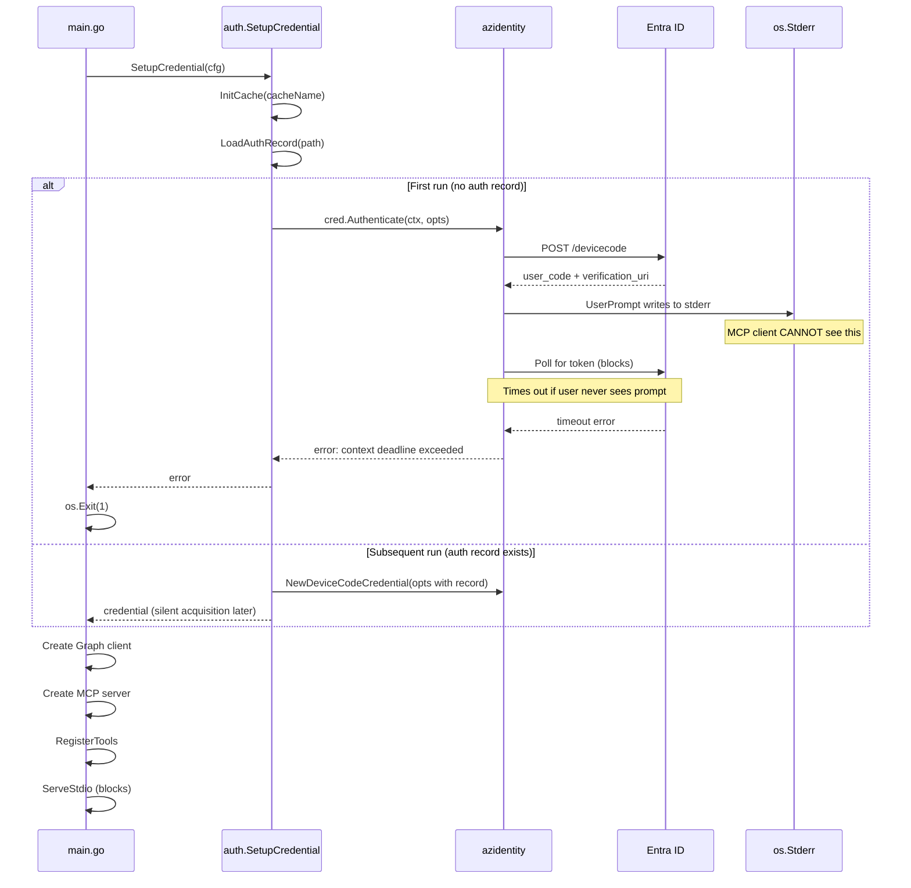
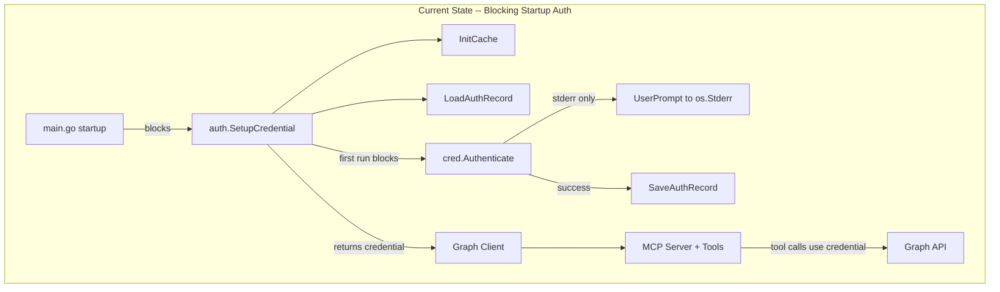
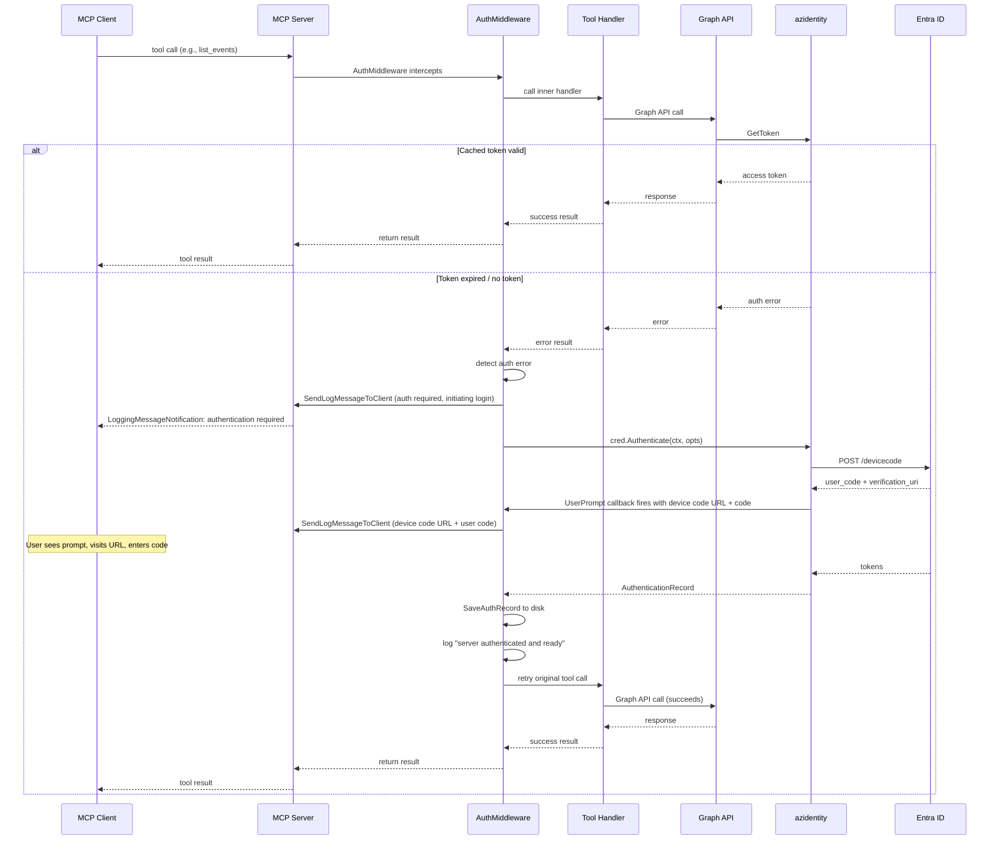
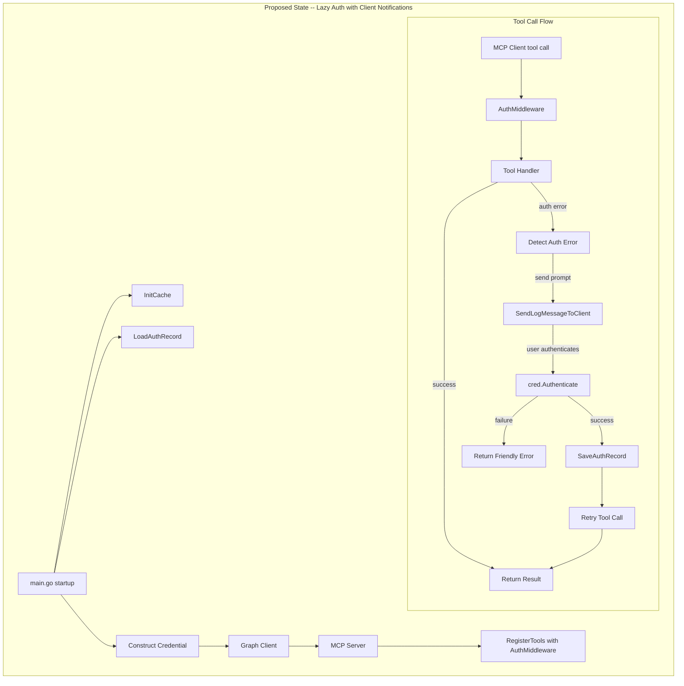
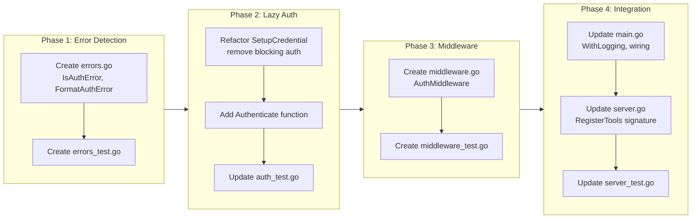

# Improved Authentication Flow

## Change Summary

The Outlook Local MCP Server's authentication flow currently blocks server startup on first run and produces opaque timeout errors when credentials expire during a session. This CR redesigns the authentication lifecycle to be lazy (triggered on first tool call rather than at startup), conversational (device code prompts are surfaced to the MCP client via `LoggingMessageNotification`), and resilient (expired credentials trigger re-authentication with user-friendly guidance instead of crashing). The server logs a clear "authenticated and ready" message upon successful authentication, and credentials persist across server restarts via the existing OS keychain token cache and authentication record.

## Motivation and Background

The current authentication design has three critical usability problems:

1. **Startup blocking:** On first run, `SetupCredential` calls `cred.Authenticate(ctx, nil)` synchronously during startup in `main.go` (line 73). The device code prompt is written to stderr, but the MCP client (an AI assistant) never sees it. The user is never asked to log in, resulting in a timeout:

   ```
   outlookCalendar - list_events (MCP)(start_datetime: "2026-03-09T00:00:00Z", end_datetime: "2026-03-15T23:59:59Z", max_results: 50)
   Error: DeviceCodeCredential: context deadline exceeded
   ```

2. **No client-visible prompts:** The `UserPrompt` callback writes to `os.Stderr`, which is invisible to the MCP client. The AI assistant cannot relay the device code URL and code to the user.

3. **No re-authentication path:** When a cached refresh token expires mid-session, the next Graph API call fails with a `DeviceCodeCredential` error. There is no mechanism to detect this, inform the user, and re-authenticate without restarting the server.

The MCP protocol supports server-to-client logging via `LoggingMessageNotification`, and the `mcp-go` SDK provides `MCPServer.SendLogMessageToClient(ctx, notification)` accessible from tool handlers via `server.ServerFromContext(ctx)`. This enables a conversational authentication experience where the server sends the device code prompt as a log message that the MCP client can display to the user.

## Change Drivers

* The initial tool call on an unauthenticated server times out silently, making the server appear broken.
* Device code prompts written to stderr are invisible to the MCP client and AI assistant.
* Expired refresh tokens cause opaque `DeviceCodeCredential: context deadline exceeded` errors with no recovery path.
* The `mcp-go` SDK supports `LoggingMessageNotification` for surfacing messages to the MCP client, but this capability is not utilized.
* The server does not log a "ready" message after successful authentication, leaving operators uncertain about server state.

## Current State

Authentication is performed synchronously during the 11-step startup lifecycle in `cmd/outlook-local-mcp/main.go`. The `auth.SetupCredential(cfg)` function (step 3-6) blocks until authentication completes or fails. On first run, the device code prompt is written to stderr. On subsequent runs, the cached refresh token is used silently. If the refresh token has expired, `GetToken` internally re-triggers the device code flow, but the prompt goes to stderr where the MCP client cannot see it, resulting in a timeout.

### Current Authentication Flow



### Current State Architecture



## Proposed Change

Redesign the authentication lifecycle with three key changes:

1. **Lazy authentication:** Remove the blocking `cred.Authenticate` call from startup. Instead, construct the credential and Graph client immediately (the credential does not require a token until first use). Authentication is triggered lazily when the first tool call invokes `GetToken` on the credential.

2. **Auth-aware middleware:** Introduce an `AuthMiddleware` that wraps all tool handlers. On each tool call, the middleware catches authentication errors from the inner handler. When an auth error is detected, the middleware:
   - Uses `server.ServerFromContext(ctx)` to get the `MCPServer` instance.
   - Sends a `LoggingMessageNotification` to the MCP client with the device code URL and code, providing actionable instructions.
   - Initiates an explicit `cred.Authenticate` call with the device code `UserPrompt` redirected to send `LoggingMessageNotification` messages.
   - On success, persists the new `AuthenticationRecord` and retries the original tool call.
   - On failure, returns a user-friendly error with troubleshooting guidance.

3. **Ready logging:** After the first successful authentication (whether at first tool call or silently via cached token), log an info message: `"server authenticated and ready to serve"`.

### Proposed Authentication Flow



### Proposed State Architecture



## Requirements

### Functional Requirements

1. The system **MUST** remove the blocking `cred.Authenticate(ctx, nil)` call from the startup sequence in `cmd/outlook-local-mcp/main.go`.
2. The system **MUST** construct the `DeviceCodeCredential` and `GraphServiceClient` during startup without requiring a valid token, relying on lazy token acquisition on first use.
3. The system **MUST** implement an `AuthMiddleware` function in `internal/auth/` that wraps tool handlers to intercept authentication errors and trigger re-authentication.
4. The `AuthMiddleware` **MUST** detect authentication errors by inspecting both the Go `error` return value and the `CallToolResult.Content` text returned from tool handlers for `DeviceCodeCredential` error patterns (e.g., `"DeviceCodeCredential"`, `"context deadline exceeded"`, `"authentication required"`, `"AADSTS"`, HTTP 401).
5. When an authentication error is detected, the `AuthMiddleware` **MUST** retrieve the `MCPServer` instance from the context using `server.ServerFromContext(ctx)` and send an initial `LoggingMessageNotification` at `LoggingLevelWarning` level to the MCP client indicating that authentication is required and the device code flow is being initiated.
6. The `AuthMiddleware` **MUST** configure the `UserPrompt` callback on the credential to send device code messages as `LoggingMessageNotification` messages via `MCPServer.SendLogMessageToClient` instead of writing to `os.Stderr`.
7. The `AuthMiddleware` **MUST** call `cred.Authenticate(ctx, &policy.TokenRequestOptions{Scopes: []string{"Calendars.ReadWrite"}})` when re-authentication is required.
8. On successful re-authentication, the `AuthMiddleware` **MUST** persist the new `AuthenticationRecord` to disk using `auth.SaveAuthRecord`.
9. On successful re-authentication, the `AuthMiddleware` **MUST** retry the original tool call exactly once.
10. On authentication failure, the `AuthMiddleware` **MUST** return an `mcp.NewToolResultError` with a user-friendly message that includes: (a) a description of the failure, (b) instructions to check network connectivity, (c) instructions to verify the device code was entered correctly, and (d) instructions to restart the server and try again.
11. The system **MUST** enable MCP logging capabilities by adding `server.WithLogging()` to the `server.NewMCPServer` call.
12. The system **MUST** log at `slog.Info` level with message `"server authenticated and ready to serve"` after the first successful token acquisition (whether silent or interactive).
13. The `UserPrompt` callback **MUST** continue to write to `os.Stderr` as a fallback when the `MCPServer` instance is not available in the context (e.g., during startup if `cred.Authenticate` is called outside a tool handler context).
14. The startup log line in `main.go` **MUST** include an `"auth_mode"` field indicating `"lazy"` to distinguish from the previous blocking mode.
15. The system **MUST** register the `AuthMiddleware` in the middleware chain for all nine tool handlers, positioned as the outermost wrapper (before `WithObservability`).

### Non-Functional Requirements

1. The system **MUST NOT** add more than 1 millisecond of latency to tool calls when authentication is valid and the cached token has not expired.
2. The system **MUST NOT** block the MCP stdio transport during authentication -- the device code flow polling occurs within the context of a single tool call.
3. The system **MUST NOT** store tokens, secrets, or credentials in log messages or `LoggingMessageNotification` data -- only the device code URL and user code (which are designed to be shared with the user).
4. The system **MUST** complete authentication error detection and `LoggingMessageNotification` dispatch within 1 second of receiving the auth error, excluding the time the user spends completing the device code flow.
5. The `AuthMiddleware` **MUST** be safe for concurrent use -- multiple simultaneous tool calls encountering auth errors **MUST** coordinate so that only one re-authentication attempt occurs at a time.
6. The system **MUST** preserve existing OS keychain token cache and authentication record persistence behavior -- credentials **MUST** persist across server restarts.

## Affected Components

* `internal/auth/auth.go` -- Refactor `SetupCredential` to remove blocking `cred.Authenticate` call; add `AuthMiddleware` function; add auth error detection helpers.
* `internal/auth/middleware.go` (new file) -- `AuthMiddleware` implementation with `LoggingMessageNotification` dispatch and re-authentication logic.
* `internal/auth/errors.go` (new file) -- Auth error detection predicates (`IsAuthError`, etc.).
* `cmd/outlook-local-mcp/main.go` -- Remove blocking auth from startup; add `server.WithLogging()` to MCP server creation; wire `AuthMiddleware` into tool registration; update startup log with `auth_mode`.
* `internal/server/server.go` -- Update `RegisterTools` to accept and apply `AuthMiddleware` wrapper.
* `internal/auth/errors_test.go` (new file) -- Tests for `IsAuthError` and `FormatAuthError`.
* `internal/auth/middleware_test.go` (new file) -- Tests for `AuthMiddleware`.
* `internal/auth/auth_test.go` -- Modify tests for `SetupCredential` (remove blocking auth expectation); add tests for `Authenticate` function.
* `internal/server/server_test.go` -- Update `RegisterTools` test calls with new `authMW` parameter; add `WithLogging` and middleware ordering tests.
* `go.mod` / `go.sum` -- No new dependencies expected (uses existing `mcp-go` and `azidentity` APIs).

## Scope Boundaries

### In Scope

* Removal of blocking `cred.Authenticate` from startup lifecycle.
* `AuthMiddleware` implementation with auth error detection, `LoggingMessageNotification` dispatch, re-authentication, record persistence, and retry.
* `UserPrompt` callback routed through `MCPServer.SendLogMessageToClient`.
* `server.WithLogging()` capability enablement.
* "Server authenticated and ready" log message.
* Concurrency guard ensuring single re-authentication at a time.
* Unit tests for `AuthMiddleware`, error detection, and `UserPrompt` routing.
* Integration tests verifying the full auth error -> notification -> retry flow.

### Out of Scope ("Here, But Not Further")

* Multi-account support -- only a single authenticated account is supported.
* Custom Entra ID app registration -- the Microsoft Office first-party client ID is used exclusively.
* Token refresh logic internals -- handled by `azidentity` library.
* MCP Elicitation API -- while `mcp-go` supports elicitation requests, `LoggingMessageNotification` is used because it is more widely supported by MCP clients. Elicitation may be considered in a future CR.
* Changes to the OS keychain cache initialization (`InitCache`) -- the existing implementation is retained.
* Changes to the `AuthenticationRecord` file format or storage location.
* Automatic server restart on persistent auth failure.
* OAuth scope changes -- `Calendars.ReadWrite` remains the sole scope.

## Impact Assessment

### User Impact

Users will experience a significantly improved first-run and re-authentication flow. Instead of an opaque timeout error, the MCP client (AI assistant) will receive a `LoggingMessageNotification` containing the device code URL and code, enabling it to directly instruct the user: "Please visit https://microsoft.com/devicelogin and enter code ABC123 to authenticate." After authentication completes, the tool call is automatically retried and the result returned. Subsequent sessions use cached tokens silently.

### Technical Impact

* The startup sequence is simplified: steps 3-6 (authentication) no longer block.
* A new middleware layer is added to the tool handler chain, but adds zero overhead when authentication is valid.
* The `RegisterTools` function gains an additional middleware parameter.
* The `MCPServer` is created with `server.WithLogging()`, which is additive and non-breaking.
* Existing tests for `auth.SetupCredential` that test the blocking first-run path will need modification.

### Business Impact

The improved authentication flow removes the primary barrier to first-time adoption. Users no longer need to understand stderr, device code flows, or manual authentication steps -- the AI assistant guides them through the process conversationally. This is critical for non-technical users and enterprise deployments.

## Implementation Approach

The implementation is structured in four sequential phases. Each phase is independently testable.

### Phase 1: Auth Error Detection

**Goal:** Create helper functions that identify authentication-related errors from Graph API responses.

**Steps:**

1. **Create `internal/auth/errors.go`** with:
   - `IsAuthError(err error) bool` -- returns true when the error indicates an authentication failure. Matches against patterns: `"DeviceCodeCredential"`, `"authentication required"`, `"context deadline exceeded"` (when from credential), `"AADSTS"` error codes, HTTP 401 status.
   - `FormatAuthError(err error) string` -- returns a user-friendly error message with troubleshooting guidance.

2. **Create `internal/auth/errors_test.go`** with tests for each error pattern.

### Phase 2: Refactor SetupCredential for Lazy Auth

**Goal:** Remove the blocking `cred.Authenticate` call from `SetupCredential` and return the credential immediately.

**Steps:**

1. **Modify `internal/auth/auth.go` `SetupCredential`:**
   - Remove the `isFirstRun` block that calls `cred.Authenticate(ctx, ...)`.
   - Remove the `SaveAuthRecord` call from within `SetupCredential`.
   - Return the credential immediately after construction.
   - Log `"credential constructed, authentication deferred to first tool call"` at info level.

2. **Add `Authenticate` exported function** in `internal/auth/auth.go`:
   - `Authenticate(ctx context.Context, cred *azidentity.DeviceCodeCredential, authRecordPath string) (azidentity.AuthenticationRecord, error)` -- wraps `cred.Authenticate` and `SaveAuthRecord` for use by the middleware.

3. **Update `internal/auth/auth_test.go`** -- modify or remove tests that depend on blocking first-run authentication in `SetupCredential`.

### Phase 3: AuthMiddleware Implementation

**Goal:** Implement the middleware that intercepts auth errors, sends client notifications, and triggers re-authentication.

**Steps:**

1. **Create `internal/auth/middleware.go`** with:
   - `AuthMiddleware(cred *azidentity.DeviceCodeCredential, authRecordPath string) func(server.ToolHandlerFunc) server.ToolHandlerFunc` -- returns a middleware factory that wraps tool handlers.
   - The middleware:
     a. Calls the inner handler.
     b. If the result is successful (no Go error and `CallToolResult.IsError` is false), returns it.
     c. If the Go error matches `IsAuthError` or the `CallToolResult` contains auth error text, sends a `LoggingMessageNotification` via `MCPServer.SendLogMessageToClient` indicating authentication is required.
     d. Calls `Authenticate` with a `UserPrompt` that routes through `SendLogMessageToClient`.
     e. On auth success, logs `"server authenticated and ready to serve"`, retries the inner handler once.
     f. On auth failure, returns `mcp.NewToolResultError` with troubleshooting guidance from `FormatAuthError`.
   - Include a `sync.Once` or `sync.Mutex` guard to prevent concurrent re-authentication attempts.
   - Track authentication state with an `authenticated` atomic boolean; log "ready" message only on first successful auth.

2. **Create `internal/auth/middleware_test.go`** with comprehensive tests.

### Phase 4: Integration Wiring

**Goal:** Wire the middleware into the server lifecycle and tool registration.

**Steps:**

1. **Update `cmd/outlook-local-mcp/main.go`:**
   - Remove the `isFirstRun` / `cred.Authenticate` path from `auth.SetupCredential` (already done in Phase 2).
   - Add `server.WithLogging()` to the `server.NewMCPServer` call.
   - Add `"auth_mode", "lazy"` to the startup log.
   - Construct `authMiddleware := auth.AuthMiddleware(cred, cfg.AuthRecordPath)`.
   - Pass `authMiddleware` to `RegisterTools`.

2. **Update `internal/server/server.go` `RegisterTools`:**
   - Add `authMW func(mcpserver.ToolHandlerFunc) mcpserver.ToolHandlerFunc` parameter.
   - Wrap each tool handler: `authMW(observability.WithObservability(...))`.
   - The middleware chain becomes: `authMW -> WithObservability -> ReadOnlyGuard (write tools) -> AuditWrap -> Handler`.

3. **Update `internal/server/server_test.go`** -- update `RegisterTools` test calls with the new parameter.

### Implementation Flow



## Test Strategy

### Tests to Add

| Test File | Test Name | Description | Inputs | Expected Output |
|-----------|-----------|-------------|--------|-----------------|
| `internal/auth/errors_test.go` | `TestIsAuthError_DeviceCodeCredential` | Detects DeviceCodeCredential errors | `fmt.Errorf("DeviceCodeCredential: context deadline exceeded")` | `true` |
| `internal/auth/errors_test.go` | `TestIsAuthError_AuthenticationRequired` | Detects authentication required errors | `fmt.Errorf("authentication required")` | `true` |
| `internal/auth/errors_test.go` | `TestIsAuthError_AADSTSError` | Detects Entra ID STS error codes | `fmt.Errorf("AADSTS70000: error")` | `true` |
| `internal/auth/errors_test.go` | `TestIsAuthError_HTTP401` | Detects HTTP 401 Unauthorized | OData error with 401 status | `true` |
| `internal/auth/errors_test.go` | `TestIsAuthError_NonAuthError` | Does not match non-auth errors | `fmt.Errorf("network timeout")` | `false` |
| `internal/auth/errors_test.go` | `TestIsAuthError_NilError` | Handles nil error | `nil` | `false` |
| `internal/auth/errors_test.go` | `TestFormatAuthError_IncludesTroubleshooting` | Formatted error includes guidance | Auth error | Message contains troubleshooting steps |
| `internal/auth/middleware_test.go` | `TestAuthMiddleware_SuccessPassthrough` | Passes through on successful handler | Handler returns success | Original result returned, no notification sent |
| `internal/auth/middleware_test.go` | `TestAuthMiddleware_AuthError_SendsNotification` | Sends LoggingMessageNotification on auth error | Handler returns auth error | Notification sent to client with device code info |
| `internal/auth/middleware_test.go` | `TestAuthMiddleware_AuthError_RetriesOnSuccess` | Retries tool call after successful re-auth | Handler fails first, succeeds after re-auth | Second call result returned |
| `internal/auth/middleware_test.go` | `TestAuthMiddleware_AuthError_ReturnsGuidance` | Returns user-friendly error on auth failure | Handler fails, re-auth also fails | Error result with troubleshooting guidance |
| `internal/auth/middleware_test.go` | `TestAuthMiddleware_NonAuthError_NoRetry` | Does not retry on non-auth errors | Handler returns non-auth error | Original error returned, no notification |
| `internal/auth/middleware_test.go` | `TestAuthMiddleware_ConcurrentAuthGuard` | Only one re-auth at a time | Multiple concurrent auth errors | Single Authenticate call, all get result |
| `internal/auth/middleware_test.go` | `TestAuthMiddleware_ReadyLogOnce` | Logs "ready" only once | Two successful auths | Log message emitted once |
| `internal/auth/middleware_test.go` | `TestAuthMiddleware_PersistsRecord` | Saves AuthenticationRecord on success | Successful re-auth | SaveAuthRecord called with correct path |
| `internal/auth/auth_test.go` | `TestSetupCredential_NoBlockingAuth` | SetupCredential returns immediately without blocking | Config with no auth record | Credential returned, no Authenticate call |
| `internal/auth/auth_test.go` | `TestAuthenticate_Success` | Authenticate function wraps cred.Authenticate | Mock credential | Record returned, saved to disk |
| `internal/auth/auth_test.go` | `TestAuthenticate_Failure` | Authenticate function returns error on failure | Mock credential that fails | Error returned |
| `internal/auth/auth_test.go` | `TestLoadAuthRecord_PersistsAcrossRestarts` | Auth record saved to disk can be loaded on restart | Save record, reload from same path | Loaded record matches saved record |
| `internal/server/server_test.go` | `TestRegisterTools_WithLoggingCapability` | MCP server is created with WithLogging() option | Server created with WithLogging | Server capabilities include logging |
| `internal/auth/middleware_test.go` | `TestAuthMiddleware_StderrFallback` | UserPrompt falls back to stderr when MCPServer is unavailable in context | Context without MCPServer | Message written to stderr, no error returned |
| `internal/server/server_test.go` | `TestRegisterTools_AuthMiddlewareOutermost` | AuthMiddleware is applied as outermost wrapper in handler chain | RegisterTools with authMW | authMW wraps WithObservability for each tool |

### Tests to Modify

| Test File | Test Name | Current Behavior | New Behavior | Reason for Change |
|-----------|-----------|------------------|--------------|-------------------|
| `internal/auth/auth_test.go` | `TestFirstRunDetection_ZeroValueRecord` | Tests zero-value record triggers first-run in SetupCredential | Tests zero-value record is detected but does not trigger blocking auth | SetupCredential no longer calls cred.Authenticate |
| `internal/auth/auth_test.go` | `TestUserPrompt_WritesToStderr` | Tests UserPrompt writes to stderr | Tests UserPrompt writes to stderr as fallback; add test for LoggingMessageNotification path | UserPrompt now routes through MCPServer when available |
| `internal/server/server_test.go` | Any tests calling `RegisterTools` | Pass existing parameters | Add `authMW` parameter (pass identity middleware for backward compatibility) | RegisterTools signature gains authMW parameter |

### Tests to Remove

Not applicable. No existing tests become fully redundant. Tests are modified rather than removed.

## Acceptance Criteria

### AC-1: Startup does not block on authentication

```gherkin
Given the server is starting for the first time (no auth record on disk)
When the startup lifecycle executes
Then the server completes startup without blocking for authentication
  And the MCP stdio transport begins accepting requests
  And the startup log includes "auth_mode" field set to "lazy"
```

### AC-2: First tool call triggers authentication via client notification

```gherkin
Given the server is running with no cached token or auth record
When the MCP client calls any tool (e.g., list_events)
Then the server sends an initial LoggingMessageNotification indicating authentication is required
  And the server initiates the device code flow via cred.Authenticate
  And the UserPrompt callback sends a second LoggingMessageNotification containing the device code URL and user code
  And the second notification instructs the user to visit the URL and enter the code
```

### AC-3: Successful authentication retries the tool call

```gherkin
Given the server has sent a device code prompt to the MCP client
  And the user completes the device code flow in their browser
When authentication succeeds
Then the server persists the AuthenticationRecord to disk
  And the server logs "server authenticated and ready to serve" at info level
  And the original tool call is retried automatically
  And the tool result is returned to the MCP client
```

### AC-4: Authentication failure returns user-friendly error

```gherkin
Given the server has sent a device code prompt to the MCP client
When the device code flow times out or the user cancels
Then the server returns an MCP tool error result
  And the error message describes the authentication failure
  And the error message includes troubleshooting steps
  And the error message suggests restarting the server and trying again
```

### AC-5: Subsequent tool calls with valid token do not trigger auth

```gherkin
Given the server has a valid cached access token
When the MCP client calls any tool
Then the tool handler executes immediately
  And no LoggingMessageNotification is sent
  And no re-authentication is triggered
  And the AuthMiddleware adds no more than 1 millisecond of latency
```

### AC-6: Expired token triggers re-authentication

```gherkin
Given the server had a valid token that has now expired
  And the refresh token has also expired
When the MCP client calls any tool
Then the AuthMiddleware detects the authentication error
  And the server sends a LoggingMessageNotification with the device code prompt
  And the re-authentication flow is triggered
```

### AC-7: Credentials persist across server restarts

```gherkin
Given the server has previously completed authentication
  And the AuthenticationRecord is saved to disk
  And the token cache is persisted in the OS keychain
When the server is restarted
Then the server loads the AuthenticationRecord from disk
  And the first tool call acquires a token silently via cached refresh token
  And no device code prompt is displayed
```

### AC-8: MCP server declares logging capability

```gherkin
Given the MCP server is initialized
When the server capabilities are declared to the MCP client
Then the capabilities include logging support
  And LoggingMessageNotification messages can be sent to connected clients
```

### AC-9: Concurrent tool calls during re-authentication

```gherkin
Given the server has an expired token
When multiple MCP tool calls arrive simultaneously
Then only one re-authentication attempt is initiated
  And all tool calls wait for the single re-authentication to complete
  And all tool calls receive their results after successful re-authentication
```

### AC-10: Stderr fallback for UserPrompt outside tool context

```gherkin
Given the UserPrompt callback is invoked outside of a tool handler context
  (e.g., the MCPServer instance is not available)
When the device code message needs to be displayed
Then the message is written to os.Stderr as a fallback
  And no error is returned from the UserPrompt callback
```

### AC-11: Non-auth errors are not intercepted

```gherkin
Given a tool handler returns a non-authentication error (e.g., Graph API 404, validation error)
When the AuthMiddleware processes the result
Then the original error is returned unchanged
  And no re-authentication is attempted
  And no LoggingMessageNotification is sent
```

### AC-12: AuthMiddleware is the outermost middleware in the handler chain

```gherkin
Given the RegisterTools function registers all nine tool handlers
When the middleware chain is constructed for each tool handler
Then the AuthMiddleware MUST be the outermost wrapper
  And the middleware chain order MUST be: AuthMiddleware -> WithObservability -> ReadOnlyGuard (write tools) -> AuditWrap -> Handler
```

## Quality Standards Compliance

### Build & Compilation

- [x] Code compiles/builds without errors
- [x] No new compiler warnings introduced

### Linting & Code Style

- [x] All linter checks pass with zero warnings/errors
- [x] Code follows project coding conventions and style guides
- [x] Any linter exceptions are documented with justification

### Test Execution

- [x] All existing tests pass after implementation
- [x] All new tests pass
- [x] Test coverage meets project requirements for changed code

### Documentation

- [x] Inline code documentation updated where applicable
- [x] API documentation updated for any API changes
- [x] User-facing documentation updated if behavior changes

### Code Review

- [x] Changes submitted via pull request
- [x] PR title follows Conventional Commits format
- [x] Code review completed and approved
- [x] Changes squash-merged to maintain linear history

### Verification Commands

```bash
# Build verification
go build ./cmd/outlook-local-mcp/

# Lint verification
golangci-lint run ./...

# Test execution
go test ./internal/auth/... ./internal/server/... -v -count=1

# Full test suite
go test ./... -v -count=1

# Test coverage for auth package
go test ./internal/auth/... -coverprofile=coverage.out
go tool cover -func=coverage.out
```

## Risks and Mitigation

### Risk 1: MCP client does not display LoggingMessageNotification

**Likelihood:** medium
**Impact:** medium
**Mitigation:** The `UserPrompt` callback maintains stderr as a fallback. If the MCP client does not render log messages, the device code prompt still appears in the server's stderr output. The error message returned on auth failure also includes the troubleshooting steps, so the user can find guidance even if the notification was not displayed.

### Risk 2: Concurrent re-authentication race condition

**Likelihood:** medium
**Impact:** high
**Mitigation:** A `sync.Mutex` guard in the `AuthMiddleware` ensures only one `cred.Authenticate` call proceeds at a time. Other tool calls encountering auth errors wait for the single re-authentication to complete and then retry. Unit tests verify this behavior with concurrent goroutines.

### Risk 3: Tool call timeout during re-authentication

**Likelihood:** medium
**Impact:** medium
**Mitigation:** The device code flow has a ~15-minute Entra ID timeout. If the MCP client has its own request timeout shorter than this, the tool call may time out before the user completes authentication. The error message instructs the user to try again, and the authentication state is not corrupted -- the next tool call will re-attempt. The middleware uses a separate context for the `cred.Authenticate` call that is not bound to the tool call's deadline.

### Risk 4: RegisterTools signature change breaks existing tests

**Likelihood:** high
**Impact:** low
**Mitigation:** All existing callers of `RegisterTools` must be updated to pass the new `authMW` parameter. An identity middleware (`func(h) { return h }`) can be passed in tests to preserve existing behavior. This is the same pattern used when `readOnly` was added in CR-0020.

### Risk 5: Lazy auth changes error surface for first tool call

**Likelihood:** low
**Impact:** low
**Mitigation:** The `AuthMiddleware` provides a better error surface than the current crash-on-startup behavior. First-time users get actionable instructions instead of a timeout error. The only regression scenario is if a user preferred to authenticate at startup rather than on first tool call, which can be addressed with a configuration option in a future CR.

### Risk 6: azidentity DeviceCodeCredential UserPrompt concurrency

**Likelihood:** low
**Impact:** medium
**Mitigation:** The `azidentity` `UserPrompt` callback is called synchronously by the credential during `Authenticate`. The middleware's `sync.Mutex` ensures only one `Authenticate` call is active, so the `UserPrompt` is called at most once at a time. The callback itself must be safe for use from any goroutine, which is satisfied by routing through `SendLogMessageToClient` (which is thread-safe per the `mcp-go` SDK).

## Dependencies

* **CR-0003 (Authentication):** The existing authentication subsystem being redesigned. All `InitCache`, `LoadAuthRecord`, and `SaveAuthRecord` functions are preserved.
* **CR-0004 (Server Bootstrap):** The `RegisterTools` function that will accept the new middleware parameter.
* **CR-0018 (Observability):** The `WithObservability` middleware that participates in the handler chain. `AuthMiddleware` wraps outside of it.
* **`github.com/mark3labs/mcp-go`:** Provides `server.ServerFromContext`, `MCPServer.SendLogMessageToClient`, `mcp.NewLoggingMessageNotification`, `server.WithLogging()`. No version change required -- these APIs are available in the current version.
* **`github.com/Azure/azure-sdk-for-go/sdk/azidentity`:** Provides `DeviceCodeCredential.Authenticate`, `DeviceCodeMessage`, `AuthenticationRecord`. No version change required.

## Estimated Effort

| Phase | Description | Estimate |
|-------|-------------|----------|
| Phase 1 | Auth error detection (`errors.go`, `errors_test.go`) | 2 hours |
| Phase 2 | Refactor SetupCredential for lazy auth | 2 hours |
| Phase 3 | AuthMiddleware implementation + tests | 4 hours |
| Phase 4 | Integration wiring (main.go, server.go, tests) | 3 hours |
| **Total** | | **11 hours** |

## Decision Outcome

Chosen approach: "Lazy authentication with AuthMiddleware and LoggingMessageNotification", because it solves all three usability problems (startup blocking, invisible prompts, no re-auth path) while leveraging existing MCP protocol capabilities (`LoggingMessageNotification`) and Azure SDK features (lazy `GetToken`, `Authenticate` for re-auth). The middleware pattern follows the established composition approach used by `WithObservability`, `ReadOnlyGuard`, and `AuditWrap`. Alternative approaches considered:

* **MCP Elicitation API:** While `mcp-go` supports `RequestElicitation` for interactive user prompts, `LoggingMessageNotification` is more widely supported across MCP clients and does not require the client to implement the elicitation capability. Elicitation can be added as an enhancement in a future CR.
* **Startup auth with background retry:** Keeping the blocking auth at startup but adding background re-try would still block first-run and would not surface prompts to the MCP client.
* **Auth status tool:** Adding a dedicated `auth_status` tool that the assistant calls first would require the assistant to learn a new protocol and adds complexity. The middleware approach is transparent.

## Related Items

* CR-0003 -- Original authentication implementation being redesigned
* CR-0004 -- Server bootstrap and `RegisterTools` function
* CR-0018 -- Observability middleware (chain ordering)
* CR-0020 -- Read-only mode (middleware composition pattern reference)

## More Information

### mcp-go Logging API Details

The `mcp-go` SDK provides the following APIs used by this CR:

* `server.WithLogging()` -- Server option to enable logging capabilities in the MCP capability negotiation.
* `server.ServerFromContext(ctx) *MCPServer` -- Retrieves the MCPServer instance from a tool handler's context.
* `MCPServer.SendLogMessageToClient(ctx, notification) error` -- Sends a `LoggingMessageNotification` to the client associated with the current context/session.
* `mcp.NewLoggingMessageNotification(level, logger, data) LoggingMessageNotification` -- Constructs a logging notification with the specified level, logger name, and data payload.
* `mcp.LoggingLevelWarning` -- The log level used for authentication prompts.

### Azure Identity Lazy Token Acquisition

The `azidentity.DeviceCodeCredential` does not require a token at construction time. Token acquisition is deferred until `GetToken` is called (which happens implicitly when the Graph SDK makes an API call). When `DisableAutomaticAuthentication` is false (the default), `GetToken` will automatically initiate the device code flow if no cached token is available. However, the `UserPrompt` callback configured at construction time is used, which in the current implementation writes to stderr. The middleware intercepts the resulting error and re-routes through `SendLogMessageToClient`.

### Middleware Chain Ordering

The complete middleware chain after this CR:

```
AuthMiddleware -> WithObservability -> ReadOnlyGuard (write tools only) -> AuditWrap -> Tool Handler
```

`AuthMiddleware` is outermost because authentication errors must be caught before observability metrics record the failure. After successful re-auth and retry, the retried call flows through the full chain including observability and audit.

<!--
## CR-0022 Review Summary

**Reviewer:** Agent 2 (CR Reviewer)
**Date:** 2026-03-14

### Findings: 9 total, 9 fixed

1. **Contradiction (Diagram):** Proposed sequence diagram showed MW sending "device code prompt" to client BEFORE calling cred.Authenticate. The device code URL/user code is only available inside the UserPrompt callback which fires during cred.Authenticate. Fixed: first notification now says "authentication required, initiating login"; second notification (inside UserPrompt callback) delivers the actual device code URL and user code.

2. **Contradiction (FR-5 vs Diagram):** FR-5 stated the initial LoggingMessageNotification contains "the device code URL and user code", but these are not available until the UserPrompt callback fires during cred.Authenticate. Fixed: FR-5 now specifies the initial notification indicates authentication is required and the device code flow is being initiated.

3. **Ambiguity (FR-4):** FR-4 said "inspecting errors returned from tool handlers" without specifying whether the Go error return or the CallToolResult content is checked. Tool handlers wrap Graph errors into CallToolResult with IsError=true, so both must be inspected. Fixed: FR-4 now explicitly requires inspecting both the Go error return value and CallToolResult.Content text.

4. **Ambiguity (Implementation Approach Phase 3):** Step 1b/1c was unclear about whether "error" refers to Go error or result content. Fixed: clarified that success means no Go error and IsError=false; auth error detection covers both Go error and CallToolResult text.

5. **Ambiguity (NFR-1):** "MUST not add measurable latency" is vague and untestable. Fixed: "MUST NOT add more than 1 millisecond of latency".

6. **Ambiguity (AC-5):** "no measurable latency is added" repeated the same vague language. Fixed: "AuthMiddleware adds no more than 1 millisecond of latency".

7. **Coverage gap (FR-15 missing AC):** FR-15 requires AuthMiddleware as the outermost middleware wrapper, but no AC verified this. Fixed: added AC-12 to verify middleware chain ordering.

8. **Coverage gap (AC-7, AC-8, AC-10 missing tests):** AC-7 (persistence across restarts), AC-8 (WithLogging capability), and AC-10 (stderr fallback) had no corresponding entries in the Test Strategy table. Fixed: added TestLoadAuthRecord_PersistsAcrossRestarts, TestRegisterTools_WithLoggingCapability, TestAuthMiddleware_StderrFallback, and TestRegisterTools_AuthMiddlewareOutermost.

9. **Scope gap (Affected Components):** Test files created or modified by the implementation were not listed. Fixed: added errors_test.go, middleware_test.go, auth_test.go, and server_test.go to Affected Components.

### Style fixes
- Converted "MUST not" to "MUST NOT" in NFR-2 and NFR-3 per RFC 2119 convention.

### Unresolvable items: 0
-->
