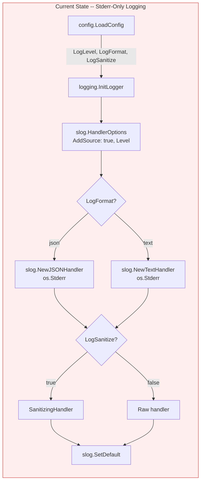
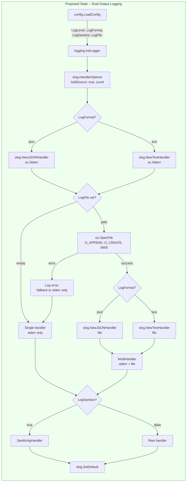
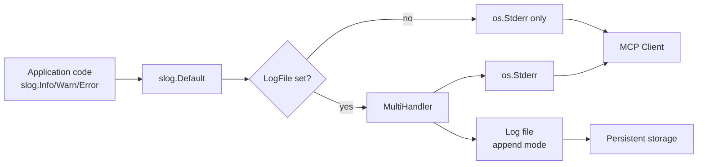
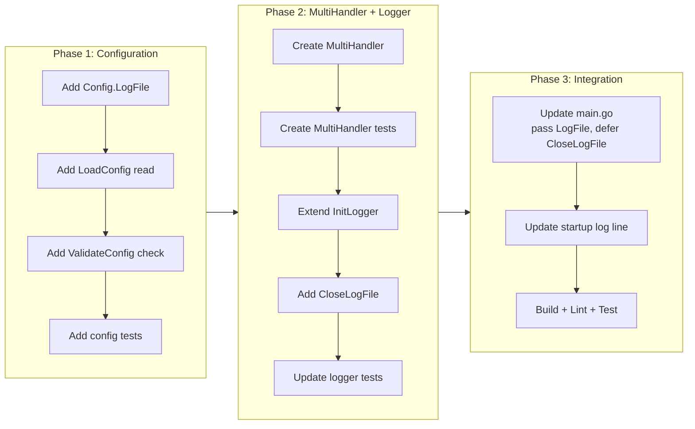

# File Logging

## Change Summary

The Outlook Local MCP Server currently writes all structured log output exclusively to `os.Stderr`. This CR adds an optional file logging capability that writes log output to a user-specified file path in addition to stderr. When enabled via the `OUTLOOK_MCP_LOG_FILE` environment variable, log records are written to both stderr (for MCP client consumption and real-time debugging) and the specified file (for persistent, post-hoc analysis). The feature is disabled by default and requires no changes to existing behavior when unconfigured.

## Motivation and Background

MCP servers communicate with their host over stdio, where stdout is reserved for JSON-RPC protocol traffic and stderr carries diagnostic logs. However, accessing stderr output from an MCP server is difficult in practice:

1. **MCP client log opacity:** When the server runs inside Claude Desktop or another MCP host, stderr output is captured by the host process. Accessing it requires navigating to host-specific log directories (e.g., `~/Library/Logs/Claude/mcp-server-*.log` on macOS), which varies by platform and client implementation. Some MCP clients do not persist stderr at all.

2. **OTEL infrastructure overhead:** The server supports OpenTelemetry export (CR-0018), but OTEL requires deploying and maintaining a collector, a backend (e.g., Jaeger, Grafana Tempo), and network connectivity between the server and the collector. For local development, single-user deployments, and troubleshooting, this infrastructure is excessive.

3. **No persistent log access:** When the MCP client terminates, stderr output is lost unless the client happened to capture it. There is no server-side mechanism to persist log output to a known, stable location that survives across sessions.

4. **Audit log precedent:** The audit subsystem (CR-0015) already supports optional file output via `OUTLOOK_MCP_AUDIT_LOG_PATH`, demonstrating user demand for file-based logging and providing an established pattern for file I/O in this codebase.

File logging provides a lightweight, zero-infrastructure alternative to OTEL for accessing log data. It complements (rather than replaces) both stderr and OTEL output.

## Change Drivers

* Stderr output from MCP servers is difficult to access and varies by MCP client implementation
* OTEL requires additional infrastructure (collector, backend) that is excessive for local development and single-user deployments
* No server-side mechanism persists log output across MCP sessions
* The audit subsystem already supports optional file output, establishing a pattern
* Users need a simple, reliable way to access server logs for debugging

## Current State

The `logging.InitLogger` function creates a single `slog.Handler` (JSON or text) targeting `os.Stderr`, optionally wraps it with `SanitizingHandler` for PII masking, and sets it as the process-wide default logger via `slog.SetDefault`. All log records flow to a single output destination: stderr.

The `config.Config` struct has no field for a log file path, and `config.LoadConfig` does not read any file-logging environment variable. The `config.ValidateConfig` function has no validation rules for log file paths.

### Current State Diagram



### Current Logging Data Flow


## Proposed Change

Extend the logging subsystem to support an optional secondary output destination: a log file. When `OUTLOOK_MCP_LOG_FILE` is set to a non-empty file path, `InitLogger` creates a multi-writer handler that sends every log record to both stderr and the specified file. The file is opened in append mode (`O_APPEND|O_CREATE|O_WRONLY`) with permissions `0600` (owner read/write only, for security since logs may contain sensitive operational data). If the file cannot be opened, the server logs an error to stderr and continues with stderr-only logging (graceful degradation).

The `SanitizingHandler` wrapper, when enabled, applies to both outputs equally -- both stderr and the file receive sanitized log records. The file handler uses the same format (JSON or text) and log level as the stderr handler.

A `CloseLogFile` function is provided and called during shutdown to flush and close the file handle cleanly.

### Proposed State Diagram



### Proposed Logging Data Flow



## Requirements

### Functional Requirements

1. The system **MUST** add a `LogFile` field to `config.Config` of type `string`, populated from the `OUTLOOK_MCP_LOG_FILE` environment variable, defaulting to empty string (disabled).
2. The system **MUST** extend `logging.InitLogger` to accept a log file path parameter. When the path is non-empty, log records **MUST** be written to both `os.Stderr` and the specified file.
3. The system **MUST** open the log file in append mode (`os.O_APPEND|os.O_CREATE|os.O_WRONLY`) with permissions `0600`.
4. The system **MUST** use the same log format (JSON or text) and log level for both the stderr handler and the file handler.
5. The system **MUST** apply the `SanitizingHandler` wrapper (when enabled) to both the stderr and file outputs uniformly -- both destinations receive identically sanitized log records.
6. The system **MUST** implement a `MultiHandler` type in `internal/logging/` that satisfies the `slog.Handler` interface and fans out each log record to two inner handlers.
7. The system **MUST** provide a `CloseLogFile` function in `internal/logging/` that flushes (`Sync`) and closes the log file handle. This function **MUST** be a no-op when file logging is not active.
8. The system **MUST** call `CloseLogFile` during the shutdown sequence in `cmd/outlook-local-mcp/main.go`, after `ServeStdio` returns and before the process exits.
9. When the log file cannot be opened (e.g., invalid path, permission denied), the system **MUST** log an error at `slog.Error` level to stderr and continue operation with stderr-only logging (graceful degradation).
10. When `OUTLOOK_MCP_LOG_FILE` is empty or unset, the system **MUST** behave identically to the current implementation -- no file is opened, no file handle is created, and `CloseLogFile` is a no-op.
11. The startup log line in `main.go` **MUST** include a `"log_file"` field indicating the configured log file path, or `"none"` when file logging is disabled.
12. The `config.ValidateConfig` function **MUST** validate the `LogFile` field: when non-empty, the parent directory **MUST** exist (warning only, same pattern as `AuthRecordPath`).

### Non-Functional Requirements

1. The `MultiHandler` **MUST** be safe for concurrent use from multiple goroutines, as required by the `slog.Handler` interface contract.
2. File logging **MUST NOT** add more than 1 millisecond of latency to log operations under normal conditions (local filesystem, not network-mounted).
3. The log file **MUST** be opened with permissions `0600` (owner read/write only) to prevent other users from reading potentially sensitive operational data.
4. If a write to the log file fails after initial open succeeds, the error **MUST** be logged to stderr (best-effort) and the failing record **MUST NOT** prevent the stderr handler from processing the same record.
5. The log file handle **MUST** be flushed (`Sync`) and closed during server shutdown to prevent data loss.
6. The feature **MUST** add zero overhead when `OUTLOOK_MCP_LOG_FILE` is empty -- no file handle, no `MultiHandler`, no additional allocations per log record.

## Affected Components

* `internal/config/config.go` -- Add `LogFile` field to `Config` struct; read `OUTLOOK_MCP_LOG_FILE` environment variable in `LoadConfig`.
* `internal/config/validate.go` -- Add parent directory existence check for `LogFile` (warning only).
* `internal/config/config_test.go` -- Add tests for `LogFile` default and custom values.
* `internal/config/validate_test.go` -- Add tests for `LogFile` validation.
* `internal/logging/logger.go` -- Extend `InitLogger` signature to accept log file path; implement file opening and `MultiHandler` composition; add `CloseLogFile` function.
* `internal/logging/multihandler.go` (new file) -- `MultiHandler` type implementing `slog.Handler` that fans out to two inner handlers.
* `internal/logging/multihandler_test.go` (new file) -- Tests for `MultiHandler`.
* `internal/logging/logger_test.go` -- Update existing `InitLogger` tests for new parameter; add file logging tests.
* `cmd/outlook-local-mcp/main.go` -- Pass `cfg.LogFile` to `logging.InitLogger`; add `defer logging.CloseLogFile()` to shutdown sequence; add `"log_file"` to startup log.

## Scope Boundaries

### In Scope

* `OUTLOOK_MCP_LOG_FILE` environment variable and `Config.LogFile` field.
* `MultiHandler` implementation for dual-output logging.
* File open, write, flush, and close lifecycle.
* `CloseLogFile` function and shutdown integration.
* Graceful degradation on file open failure.
* Config validation for log file parent directory.
* Unit tests for all new code.

### Out of Scope ("Here, But Not Further")

* Log file rotation -- the file grows unbounded. Users should use external log rotation tools (e.g., `logrotate`). Log rotation may be considered in a future CR.
* Maximum file size limits or automatic truncation.
* Separate log level or format for the file output -- both outputs share the same configuration.
* Separate sanitization settings per output -- both outputs share `LogSanitize`.
* Writing to network destinations (syslog, HTTP endpoints) -- file paths only.
* Changes to the audit log subsystem -- audit logging has its own file output path (`OUTLOOK_MCP_AUDIT_LOG_PATH`) and is independent.
* `~` (tilde) expansion for the log file path -- users must provide absolute or relative paths. This differs from `AuthRecordPath` which supports tilde expansion; adding tilde expansion to `LogFile` can be done in a future CR if requested.
* Changes to OTEL configuration or behavior.

## Impact Assessment

### User Impact

Users gain a simple, reliable way to access server logs without depending on MCP client behavior or OTEL infrastructure. Setting `OUTLOOK_MCP_LOG_FILE=/tmp/outlook-mcp.log` is sufficient to start persisting logs. Existing users who do not set the variable experience no change.

### Technical Impact

* `InitLogger` gains one additional parameter (the file path string). All callers must be updated.
* A new `MultiHandler` type is introduced in the `internal/logging` package.
* The shutdown sequence in `main.go` gains a `defer logging.CloseLogFile()` call.
* No new external dependencies are required -- only standard library `os`, `io`, and `log/slog`.

### Business Impact

Reduces support burden by giving users a straightforward debugging path. Eliminates the need to set up OTEL infrastructure for basic log access during development and troubleshooting.

## Implementation Approach

The implementation is structured in three sequential phases. Each phase is independently testable and produces a compilable project.

### Phase 1: Configuration

**Goal:** Add the `LogFile` configuration field and validation.

**Steps:**

1. **Update `internal/config/config.go`:**
   - Add `LogFile string` field to `Config` struct with doc comment explaining it is the optional filesystem path for log file output.
   - In `LoadConfig`, read `OUTLOOK_MCP_LOG_FILE` via `GetEnv("OUTLOOK_MCP_LOG_FILE", "")`.

2. **Update `internal/config/validate.go`:**
   - Add a parent directory existence check for `cfg.LogFile` when non-empty, following the same warning-only pattern used for `AuthRecordPath`. Log at `slog.Warn` level if the parent directory does not exist.

3. **Update `internal/config/config_test.go`:**
   - Add `TestLoadConfig_LogFileDefault` -- verify `LogFile` defaults to empty string.
   - Add `TestLoadConfig_LogFileCustom` -- verify `LogFile` reads from `OUTLOOK_MCP_LOG_FILE`.
   - Update `clearOutlookEnvVars` to include `OUTLOOK_MCP_LOG_FILE`.

4. **Update `internal/config/validate_test.go`:**
   - Add `TestValidateConfig_LogFileParentExists` -- verify no warning when parent exists.
   - Add `TestValidateConfig_LogFileParentMissing` -- verify warning logged when parent does not exist.
   - Add `TestValidateConfig_LogFileEmpty` -- verify no validation action when empty.

### Phase 2: MultiHandler and Logger Extension

**Goal:** Implement the `MultiHandler` and extend `InitLogger` to support file output.

**Steps:**

1. **Create `internal/logging/multihandler.go`:**
   - Define `MultiHandler` struct with two `slog.Handler` fields: `primary` and `secondary`.
   - Implement `Enabled(ctx, level)` -- returns true if either inner handler is enabled.
   - Implement `Handle(ctx, record)` -- calls `primary.Handle` and `secondary.Handle`. If the secondary handler returns an error, log a warning to the primary handler (stderr) and continue. The primary handler's error is returned.
   - Implement `WithAttrs(attrs)` -- returns a new `MultiHandler` with `WithAttrs` applied to both inner handlers.
   - Implement `WithGroup(name)` -- returns a new `MultiHandler` with `WithGroup` applied to both inner handlers.

2. **Create `internal/logging/multihandler_test.go`:**
   - `TestMultiHandler_BothReceiveRecords` -- verify both handlers receive the same log record.
   - `TestMultiHandler_Enabled_EitherTrue` -- verify Enabled returns true if either handler is enabled.
   - `TestMultiHandler_Enabled_BothFalse` -- verify Enabled returns false when both are disabled.
   - `TestMultiHandler_SecondaryError_PrimarySucceeds` -- verify primary continues when secondary fails.
   - `TestMultiHandler_WithAttrs_PropagatesBoth` -- verify WithAttrs applies to both handlers.
   - `TestMultiHandler_WithGroup_PropagatesBoth` -- verify WithGroup applies to both handlers.
   - `TestMultiHandler_ConcurrentSafety` -- verify concurrent Handle calls do not race.

3. **Update `internal/logging/logger.go`:**
   - Add a module-level `var logFile *os.File` to hold the file handle for shutdown.
   - Extend `InitLogger` signature to `InitLogger(levelStr, format string, sanitize bool, filePath string)`.
   - When `filePath` is non-empty:
     a. Open the file with `os.OpenFile(filePath, os.O_APPEND|os.O_CREATE|os.O_WRONLY, 0600)`.
     b. On success, create a second handler (same format, same options) targeting the file.
     c. Compose both handlers into a `MultiHandler`.
     d. Store the file handle in the module-level `logFile` variable.
     e. On failure, log `slog.Error("log file open failed", "path", filePath, "error", err)` to stderr and proceed with the stderr-only handler.
   - When `filePath` is empty, behavior is identical to current (no MultiHandler, no file handle).
   - Add `CloseLogFile()` function that flushes (`Sync`) and closes `logFile` if non-nil, then sets `logFile` to nil. Safe to call multiple times.

4. **Update `internal/logging/logger_test.go`:**
   - Update all existing `InitLogger` calls to include the new `filePath` parameter (pass `""` for backward compatibility).
   - Add `TestInitLogger_FileLogging_WritesToFile` -- create a temp file, init logger with file path, log a message, verify message appears in both stderr capture and file.
   - Add `TestInitLogger_FileLogging_JSONFormat` -- verify file output is valid JSON when format is "json".
   - Add `TestInitLogger_FileLogging_TextFormat` -- verify file output is key=value when format is "text".
   - Add `TestInitLogger_FileLogging_InvalidPath` -- verify error logged and stderr-only fallback when file cannot be opened.
   - Add `TestInitLogger_FileLogging_EmptyPath` -- verify no file opened, identical to current behavior.
   - Add `TestInitLogger_FileLogging_SanitizationApplied` -- verify PII is masked in file output when sanitize is true.
   - Add `TestCloseLogFile_NoFile` -- verify CloseLogFile is a no-op when no file is open.
   - Add `TestCloseLogFile_FlushesAndCloses` -- verify file is synced and closed.
   - Add `TestInitLogger_FileLogging_FilePermissions` -- create a new file via InitLogger, verify `os.Stat` reports mode `0600`.
   - Add `TestInitLogger_FileLogging_StartupLogField` -- init with file path, emit a log with `"log_file"` key, verify field appears in output.

### Phase 3: Integration Wiring

**Goal:** Wire file logging into the server lifecycle.

**Steps:**

1. **Update `cmd/outlook-local-mcp/main.go`:**
   - Update the `logging.InitLogger` call to pass `cfg.LogFile` as the fourth argument.
   - Add `defer logging.CloseLogFile()` immediately after the `InitLogger` call.
   - Update the startup log line to include `"log_file"` field: use `cfg.LogFile` if non-empty, otherwise `"none"`.

2. **Verify the full lifecycle:**
   - Build: `go build ./cmd/outlook-local-mcp/`
   - Lint: `golangci-lint run`
   - Test: `go test ./...`

### Implementation Flow



## Test Strategy

### Tests to Add

| Test File | Test Name | Description | Inputs | Expected Output |
|-----------|-----------|-------------|--------|-----------------|
| `internal/config/config_test.go` | `TestLoadConfig_LogFileDefault` | LogFile defaults to empty | No env var set | `cfg.LogFile == ""` |
| `internal/config/config_test.go` | `TestLoadConfig_LogFileCustom` | LogFile reads from env var | `OUTLOOK_MCP_LOG_FILE=/tmp/test.log` | `cfg.LogFile == "/tmp/test.log"` |
| `internal/config/validate_test.go` | `TestValidateConfig_LogFileParentExists` | No warning when parent dir exists | `LogFile="/tmp/test.log"` | No slog.Warn output |
| `internal/config/validate_test.go` | `TestValidateConfig_LogFileParentMissing` | Warning logged when parent dir missing | `LogFile="/nonexistent/dir/test.log"` | slog.Warn logged with path |
| `internal/config/validate_test.go` | `TestValidateConfig_LogFileEmpty` | No validation action when empty | `LogFile=""` | No warning, no error |
| `internal/logging/multihandler_test.go` | `TestMultiHandler_BothReceiveRecords` | Both handlers receive log record | Log a message | Both buffers contain message |
| `internal/logging/multihandler_test.go` | `TestMultiHandler_Enabled_EitherTrue` | Enabled returns true if either is enabled | Primary=info, Secondary=warn | Enabled(info) == true |
| `internal/logging/multihandler_test.go` | `TestMultiHandler_Enabled_BothFalse` | Enabled returns false when both disabled | Both=error | Enabled(debug) == false |
| `internal/logging/multihandler_test.go` | `TestMultiHandler_SecondaryError_PrimarySucceeds` | Primary succeeds when secondary fails | Secondary returns error | Primary record written, no panic |
| `internal/logging/multihandler_test.go` | `TestMultiHandler_WithAttrs_PropagatesBoth` | WithAttrs applies to both | Add attr, log | Both outputs contain attr |
| `internal/logging/multihandler_test.go` | `TestMultiHandler_WithGroup_PropagatesBoth` | WithGroup applies to both | Add group, log | Both outputs contain group |
| `internal/logging/multihandler_test.go` | `TestMultiHandler_ConcurrentSafety` | No data races under concurrent writes | 100 goroutines logging | No race detector failure |
| `internal/logging/logger_test.go` | `TestInitLogger_FileLogging_WritesToFile` | Log records appear in both stderr and file | Temp file path | Message in both outputs |
| `internal/logging/logger_test.go` | `TestInitLogger_FileLogging_JSONFormat` | File output is valid JSON | format="json" | JSON parseable |
| `internal/logging/logger_test.go` | `TestInitLogger_FileLogging_TextFormat` | File output is key=value | format="text" | Contains "level=" and "msg=" |
| `internal/logging/logger_test.go` | `TestInitLogger_FileLogging_InvalidPath` | Graceful degradation on invalid path | `/nonexistent/dir/log.json` | Error logged, stderr-only |
| `internal/logging/logger_test.go` | `TestInitLogger_FileLogging_EmptyPath` | No file opened when path empty | `""` | Identical to current behavior |
| `internal/logging/logger_test.go` | `TestInitLogger_FileLogging_SanitizationApplied` | PII masked in file output | sanitize=true, email in log | Email masked in file |
| `internal/logging/logger_test.go` | `TestCloseLogFile_NoFile` | CloseLogFile no-op when no file | No file logging configured | No error, no panic |
| `internal/logging/logger_test.go` | `TestCloseLogFile_FlushesAndCloses` | File synced and closed | Active file logging | File closed, subsequent write fails |
| `internal/logging/logger_test.go` | `TestInitLogger_FileLogging_FilePermissions` | Created file has 0600 permissions | Temp dir path for new file | `os.Stat` reports mode `0600` |
| `internal/logging/logger_test.go` | `TestInitLogger_FileLogging_StartupLogField` | Startup log includes "log_file" field | Init with file path, emit startup log | Log output contains `"log_file"` key with configured path |

### Tests to Modify

| Test File | Test Name | Current Behavior | New Behavior | Reason for Change |
|-----------|-----------|------------------|--------------|-------------------|
| `internal/logging/logger_test.go` | All `TestInitLogger*` | Call `InitLogger(level, format, sanitize)` with 3 params | Call `InitLogger(level, format, sanitize, "")` with 4 params | `InitLogger` signature gains `filePath` parameter |
| `internal/config/config_test.go` | `TestLoadConfigDefaults` | Does not check `LogFile` field | Asserts `cfg.LogFile == ""` | New field must have correct default |
| `internal/config/config_test.go` | `clearOutlookEnvVars` | Does not clear `OUTLOOK_MCP_LOG_FILE` | Includes `OUTLOOK_MCP_LOG_FILE` in cleared vars | Ensures clean test environment |

### Tests to Remove

Not applicable. No existing tests become redundant.

## Acceptance Criteria

### AC-1: File logging writes to both stderr and file

```gherkin
Given OUTLOOK_MCP_LOG_FILE is set to a valid file path
  And the server is started
When a log message is emitted at or above the configured log level
Then the log record appears in os.Stderr output
  And the same log record appears in the specified log file
  And the file content is valid for the configured format (JSON or text)
```

### AC-2: File logging disabled by default

```gherkin
Given OUTLOOK_MCP_LOG_FILE is not set or set to empty string
When the server starts
Then no log file is opened
  And no file handle is created
  And logging behavior is identical to the current implementation
  And CloseLogFile is a no-op
```

### AC-3: Graceful degradation on file open failure

```gherkin
Given OUTLOOK_MCP_LOG_FILE is set to a path that cannot be opened
  (e.g., parent directory does not exist, permission denied)
When the server starts and InitLogger is called
Then an error is logged to stderr describing the failure
  And the server continues with stderr-only logging
  And no further errors occur due to the missing file
```

### AC-4: Sanitization applies to file output

```gherkin
Given OUTLOOK_MCP_LOG_SANITIZE is true
  And OUTLOOK_MCP_LOG_FILE is set to a valid path
When a log message containing an email address is emitted
Then the email is masked in the stderr output
  And the email is masked identically in the file output
```

### AC-5: File is flushed and closed on shutdown

```gherkin
Given file logging is active
When the server shuts down (stdin closes or signal received)
Then CloseLogFile is called
  And the file handle is flushed (Sync)
  And the file handle is closed
  And all log records written before shutdown are persisted to disk
```

### AC-6: Startup log includes log file information

```gherkin
Given the server is starting
When the startup info log is emitted
Then the log record includes a "log_file" field
  And the field value is the configured file path when file logging is active
  And the field value is "none" when file logging is disabled
```

### AC-7: File permissions are restrictive

```gherkin
Given OUTLOOK_MCP_LOG_FILE is set to a path that does not yet exist
When the file is created by InitLogger
Then the file permissions are 0600 (owner read/write only)
```

### AC-8: Configuration validation warns on missing parent directory

```gherkin
Given OUTLOOK_MCP_LOG_FILE is set to a path whose parent directory does not exist
When ValidateConfig is called
Then a warning is logged at slog.Warn level mentioning the LogFile path
  And no validation error is returned (warning only)
```

### AC-9: MultiHandler handles secondary errors gracefully

```gherkin
Given file logging is active via MultiHandler
When the file handler fails to write a record (e.g., disk full)
Then the stderr handler still processes the record successfully
  And the error is reported to stderr (best-effort)
  And no panic or crash occurs
```

### AC-10: Zero overhead when disabled

```gherkin
Given OUTLOOK_MCP_LOG_FILE is empty or unset
When log records are emitted
Then no MultiHandler is in the handler chain
  And no file I/O occurs
  And no additional memory allocations occur per log record
  And logging latency is identical to the current implementation
```

## Quality Standards Compliance

### Build & Compilation

- [x] Code compiles/builds without errors
- [x] No new compiler warnings introduced

### Linting & Code Style

- [x] All linter checks pass with zero warnings/errors
- [x] Code follows project coding conventions and style guides
- [x] Any linter exceptions are documented with justification

### Test Execution

- [x] All existing tests pass after implementation
- [x] All new tests pass
- [x] Test coverage meets project requirements for changed code

### Documentation

- [x] Inline code documentation updated where applicable
- [x] API documentation updated for any API changes
- [x] User-facing documentation updated if behavior changes

### Code Review

- [ ] Changes submitted via pull request
- [ ] PR title follows Conventional Commits format
- [ ] Code review completed and approved
- [ ] Changes squash-merged to maintain linear history

### Verification Commands

```bash
# Build verification
go build ./cmd/outlook-local-mcp/

# Lint verification
golangci-lint run ./...

# Test execution
go test ./internal/logging/... ./internal/config/... -v -count=1

# Full test suite
go test ./... -v -count=1

# Test coverage for logging package
go test ./internal/logging/... -coverprofile=coverage.out
go tool cover -func=coverage.out

# Test race detector
go test ./internal/logging/... -race -count=1
```

## Risks and Mitigation

### Risk 1: Log file grows unbounded

**Likelihood:** high
**Impact:** medium
**Mitigation:** This CR explicitly defers log rotation to external tools (e.g., `logrotate`). The documentation should note that the log file grows without limit and recommend periodic rotation or cleanup. A future CR may add built-in rotation if demand warrants.

### Risk 2: File I/O latency impacts logging performance

**Likelihood:** low
**Impact:** low
**Mitigation:** The `slog` handlers use buffered I/O internally. The `MultiHandler` calls both handlers sequentially, so file I/O latency directly adds to log call duration. On local filesystems this is sub-millisecond. For network-mounted filesystems, latency could be higher, but this is explicitly out of scope (file paths only, not network destinations). If performance concerns arise, a future CR could add asynchronous file writing.

### Risk 3: InitLogger signature change breaks callers

**Likelihood:** high
**Impact:** low
**Mitigation:** There is exactly one caller of `InitLogger` in production code (`cmd/outlook-local-mcp/main.go`) and approximately 15 test calls in `internal/logging/logger_test.go`. All must be updated to pass the new `filePath` parameter. Passing `""` preserves existing behavior. This is a mechanical change with no risk of behavioral regression.

### Risk 4: File handle leak on crash

**Likelihood:** low
**Impact:** low
**Mitigation:** The `defer logging.CloseLogFile()` call in `main.go` handles normal shutdown. On abnormal termination (SIGKILL, panic), the OS reclaims file handles automatically. Data loss for the last few log records is possible but acceptable -- the `slog` handlers do not guarantee write durability per record without explicit fsync, and adding fsync per log record would significantly impact performance.

### Risk 5: Concurrent writes to file from MultiHandler

**Likelihood:** medium
**Impact:** medium
**Mitigation:** The `slog.Handler` interface contract requires implementations to be safe for concurrent use. The standard library `slog.JSONHandler` and `slog.TextHandler` are internally synchronized. The `MultiHandler` delegates to these handlers and does not introduce shared mutable state, so it inherits their concurrency safety. The `TestMultiHandler_ConcurrentSafety` test verifies this with the race detector.

## Dependencies

* **CR-0002 (Structured Logging):** The logging subsystem being extended. `InitLogger`, `SanitizingHandler`, and the `ParseLogLevel` function are preserved and extended.
* **CR-0013 (Configuration Validation):** The `ValidateConfig` function that gains the `LogFile` parent directory check.
* **CR-0015 (Audit Logging):** Provides the precedent pattern for file-based log output (`InitAuditLog`, `os.OpenFile` with append mode). The audit subsystem is independent and not modified by this CR.
* **No new external dependencies.** All implementation uses the Go standard library (`os`, `io`, `log/slog`).

## Estimated Effort

| Phase | Description | Estimate |
|-------|-------------|----------|
| Phase 1 | Configuration (`Config.LogFile`, validation, tests) | 1 hour |
| Phase 2 | MultiHandler + InitLogger extension + CloseLogFile + tests | 3 hours |
| Phase 3 | Integration wiring (main.go, startup log, shutdown) | 1 hour |
| **Total** | | **5 hours** |

## Decision Outcome

Chosen approach: "Dual-output via MultiHandler with graceful degradation", because it provides a simple, zero-dependency file logging capability that complements existing stderr and OTEL output. The `MultiHandler` pattern is idiomatic Go (`slog.Handler` composition) and adds zero overhead when file logging is disabled. Alternative approaches considered:

* **`io.MultiWriter` on a single handler:** Wrapping `os.Stderr` and the log file in an `io.MultiWriter` and passing it to a single `slog.Handler`. Rejected because error handling differs -- a write failure to the file would also fail the `io.MultiWriter.Write` call, preventing the record from reaching stderr. The `MultiHandler` approach allows independent error handling per destination.
* **Asynchronous file writer with channel buffer:** Writing file log records via a buffered channel consumed by a goroutine. Rejected as over-engineering for this use case. The synchronous approach is simpler, provides stronger durability guarantees (no lost records in the channel buffer on crash), and the latency cost on local filesystems is negligible.
* **Replacing `slog` with a third-party logging library:** Libraries like `zerolog` or `zap` have built-in multi-output support. Rejected because the project uses `log/slog` exclusively (established in CR-0002) and introducing a third-party logger would be a disruptive architectural change with no proportional benefit.

## Related Items

* CR-0002 -- Structured logging foundation being extended
* CR-0013 -- Configuration validation extended with LogFile check
* CR-0015 -- Audit logging file output pattern (precedent)
* CR-0018 -- Observability/OTEL (complementary, not replaced)

<!--
## CR-0023 Review Summary

**Reviewer:** Agent 2 (CR Reviewer)
**Date:** 2026-03-14

### Findings: 3 total

**Finding 1 (Diagram accuracy):** The Proposed Logging Data Flow diagram only showed the
file-logging-active path. When file logging is disabled (FR-10, AC-10), no MultiHandler
exists, and records flow directly to stderr. The diagram was incomplete.
- **Fix applied:** Added a conditional branch (`LogFile set?`) to the Proposed Logging
  Data Flow diagram showing both the MultiHandler path and the stderr-only path.

**Finding 2 (AC-test coverage gap):** AC-7 (file permissions are 0600) had no corresponding
test in the Test Strategy table. The existing `TestInitLogger_FileLogging_WritesToFile`
test creates a temp file but does not verify its permissions.
- **Fix applied:** Added `TestInitLogger_FileLogging_FilePermissions` to the Test Strategy
  table and to Phase 2 Step 4 in the Implementation Approach.

**Finding 3 (AC-test coverage gap):** AC-6 (startup log includes "log_file" field) had no
corresponding test in the Test Strategy table. The startup log line is wired in Phase 3
(main.go) but no test exercises it.
- **Fix applied:** Added `TestInitLogger_FileLogging_StartupLogField` to the Test Strategy
  table and to Phase 2 Step 4 in the Implementation Approach. Note: this test validates
  that log output contains the "log_file" key when file logging is configured; the actual
  main.go wiring is verified by the build + manual smoke test in Phase 3.

### Checks Passed (no fixes needed)

- **Internal contradictions:** All ACs are logically consistent with FRs and Implementation
  Approach. No conflicts found.
- **Ambiguity:** All requirements use MUST/MUST NOT/SHALL consistently. No vague language
  ("should", "may", "appropriate") found in requirement statements.
- **Requirement-AC coverage:** All 12 Functional Requirements have at least one AC. All 6
  Non-Functional Requirements are covered by ACs or are inherently verified by the test
  strategy (e.g., race detector for NFR-1, build verification for NFR-6).
- **Scope consistency:** All 9 Affected Components match files referenced in the
  Implementation Approach phases.

### Unresolvable Items

None. All findings were resolved by direct fixes to the CR.
-->
