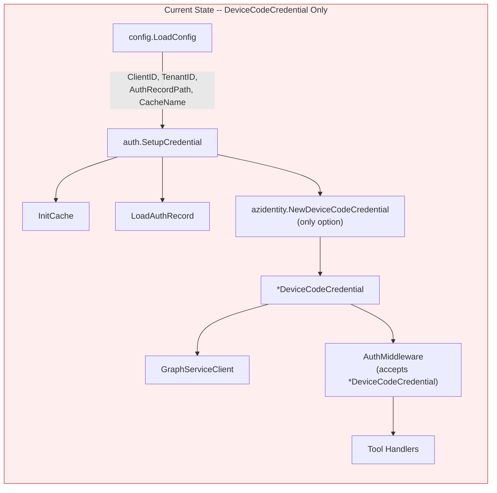
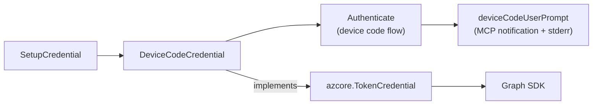
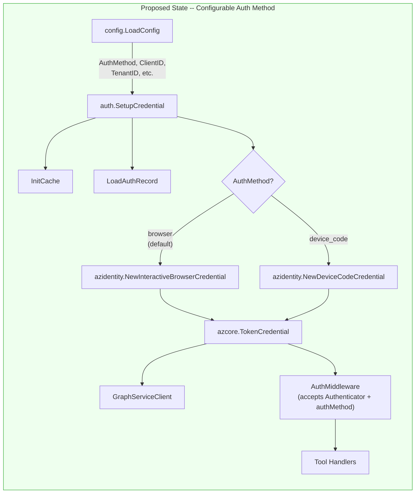
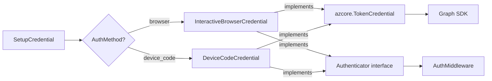
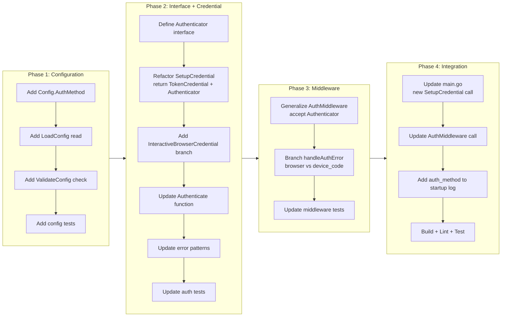

# Interactive Browser Authentication Default

## Change Summary

The Outlook Local MCP Server currently uses `azidentity.DeviceCodeCredential` as the sole authentication method. This CR changes the default authentication method to `azidentity.InteractiveBrowserCredential`, which opens the system browser for OAuth login, and introduces an `OUTLOOK_MCP_AUTH_METHOD` environment variable that allows users to switch back to device code authentication when needed. Device code auth is retained as an opt-in alternative because it works in headless environments where a browser is unavailable.

## Motivation and Background

The device code flow requires the user to visit a URL and enter a code manually -- a multi-step process that is cumbersome for desktop users who have a browser available. More critically, many organizations configure Conditional Access policies that block the device code flow entirely (Azure AD error `AADSTS50199: device code flow is blocked`), making the server unusable without any workaround.

The `InteractiveBrowserCredential` uses the OAuth 2.0 authorization code flow with PKCE, which opens the system browser directly to the Microsoft login page. This is the standard authentication experience users expect from desktop applications. It is also more resilient against organizational policies since the authorization code flow is the most widely permitted OAuth flow.

The research document at `docs/research/authentication-channels.md` confirms that `InteractiveBrowserCredential` is the only viable alternative to device code, and that both credentials support the same `Cache` + `AuthenticationRecord` persistence pattern already implemented in the codebase. The implementation effort is low because the two credential types share nearly identical configuration surfaces.

## Change Drivers

* Device code flow is blocked by Conditional Access policies in many enterprise Azure AD tenants (AADSTS50199), making the server unusable for those users.
* The device code flow requires a manual copy-paste of a code, which is a poor UX for desktop users with a browser available.
* Interactive browser auth is the standard desktop authentication experience and is the most widely permitted OAuth flow across organizations.
* Both credential types implement `azcore.TokenCredential` and support `Cache` + `AuthenticationRecord`, minimizing implementation complexity.
* The current `AuthMiddleware` is tightly coupled to `*azidentity.DeviceCodeCredential` -- it needs to be generalized to work with either credential type.

## Current State

The authentication subsystem is implemented in `internal/auth/auth.go` and `internal/auth/middleware.go`. The `SetupCredential` function constructs an `*azidentity.DeviceCodeCredential` exclusively, and the `AuthMiddleware` accepts `*azidentity.DeviceCodeCredential` as a concrete type rather than an interface. There is no configuration option to select an authentication method.

The `config.Config` struct has no `AuthMethod` field, and `config.LoadConfig` does not read any auth method environment variable. The `config.ValidateConfig` function has no validation rule for auth method values.

### Current State Diagram



### Current Authentication Type Flow



## Proposed Change

Introduce a configurable authentication method selection controlled by the `OUTLOOK_MCP_AUTH_METHOD` environment variable. The default value is `"browser"` (InteractiveBrowserCredential). Setting it to `"device_code"` preserves the current behavior.

The key changes are:

1. **Config extension:** Add `AuthMethod string` field to `config.Config`, populated from `OUTLOOK_MCP_AUTH_METHOD` with default `"browser"`.

2. **Credential factory:** Refactor `SetupCredential` to return `azcore.TokenCredential` (the interface both credentials implement) instead of `*azidentity.DeviceCodeCredential`. A branch on `cfg.AuthMethod` constructs either an `InteractiveBrowserCredential` or a `DeviceCodeCredential`.

3. **InteractiveBrowserCredential setup:** Configure the credential with the same `ClientID`, `TenantID`, `Cache`, and `AuthenticationRecord` fields. Set `RedirectURL` to `"http://localhost"` as required by the app registration for the authorization code flow with PKCE.

4. **Middleware generalization:** Change `AuthMiddleware` and the `Authenticate` function to accept `azcore.TokenCredential` instead of `*azidentity.DeviceCodeCredential`. Both credential types expose an `Authenticate` method with the same signature: `Authenticate(ctx, *policy.TokenRequestOptions) (AuthenticationRecord, error)`. Since this method is not part of the `azcore.TokenCredential` interface, introduce a local `Authenticator` interface that captures it, and use a type switch or interface assertion in the middleware.

5. **Auth error pattern updates:** Update `authErrorPatterns` in `errors.go` to also match `"InteractiveBrowserCredential"` error strings, ensuring the middleware detects auth errors from both credential types.

6. **UserPrompt removal for browser flow:** The `InteractiveBrowserCredential` does not have a `UserPrompt` callback -- it opens the browser directly. The `deviceCodeUserPrompt` function and the `deviceCodeMsgKey` channel mechanism are only used when device code auth is active. The middleware's `handleAuthError` method needs a branch: for browser auth, `Authenticate` opens the browser directly with no message channel; for device code, the existing channel-based prompt forwarding is preserved.

### Proposed State Diagram



### Proposed Authentication Type Flow



## Requirements

### Functional Requirements

1. The system **MUST** add an `AuthMethod` field to `config.Config` of type `string`, populated from the `OUTLOOK_MCP_AUTH_METHOD` environment variable, defaulting to `"browser"`.
2. The system **MUST** validate that `AuthMethod` is one of `"browser"` or `"device_code"` in `config.ValidateConfig`. Any other value **MUST** produce a validation error.
3. The `auth.SetupCredential` function **MUST** return `(azcore.TokenCredential, Authenticator, error)` instead of `(*azidentity.DeviceCodeCredential, error)`. The first return value is for the Graph SDK; the second is for the middleware.
4. When `AuthMethod` is `"browser"`, `SetupCredential` **MUST** construct an `azidentity.InteractiveBrowserCredential` with `ClientID`, `TenantID`, `Cache`, `AuthenticationRecord`, and `RedirectURL` set to `"http://localhost"`.
5. When `AuthMethod` is `"device_code"`, `SetupCredential` **MUST** construct an `azidentity.DeviceCodeCredential` with the same configuration as the current implementation (including the `deviceCodeUserPrompt` callback).
6. The system **MUST** define an `Authenticator` interface in `internal/auth/` with the method `Authenticate(ctx context.Context, opts *policy.TokenRequestOptions) (azidentity.AuthenticationRecord, error)` that both credential types satisfy.
7. The `auth.AuthMiddleware` function **MUST** accept `Authenticator` and an `authMethod string` parameter instead of `*azidentity.DeviceCodeCredential`. The middleware does not require `azcore.TokenCredential`; it only needs `Authenticator` for re-authentication.
8. The `auth.Authenticate` function **MUST** accept the `Authenticator` interface instead of `*azidentity.DeviceCodeCredential`.
9. The `authErrorPatterns` slice in `errors.go` **MUST** include `"InteractiveBrowserCredential"` in addition to the existing `"DeviceCodeCredential"` pattern. The `IsAuthError` function's `context.DeadlineExceeded` check **MUST** also match `"InteractiveBrowserCredential"` in addition to `"DeviceCodeCredential"`.
10. When `AuthMethod` is `"browser"` and re-authentication is triggered by the middleware, the middleware **MUST** call `Authenticate` on the `InteractiveBrowserCredential`, which opens the system browser directly. The middleware **MUST** send an MCP `LoggingMessageNotification` informing the user that a browser window will open for authentication.
11. When `AuthMethod` is `"device_code"` and re-authentication is triggered, the middleware **MUST** preserve the existing device code flow behavior: forwarding the device code message via MCP notification and the `deviceCodeMsgKey` channel mechanism.
12. The startup log line in `main.go` **MUST** include an `"auth_method"` field indicating the configured authentication method (`"browser"` or `"device_code"`).
13. The `handleAuthError` method in the middleware **MUST** differentiate between browser and device code re-authentication flows. For browser auth, the background goroutine calls `Authenticate` without waiting for a device code channel message. For device code auth, the existing channel-based prompt forwarding **MUST** be preserved.
14. The `authenticateFunc` type in `middleware.go` **MUST** be updated to accept the `Authenticator` interface instead of `*azidentity.DeviceCodeCredential`.
15. The `authMiddlewareState` struct **MUST** store the credential as the `Authenticator` interface instead of `*azidentity.DeviceCodeCredential`.
16. The `FormatAuthError` function in `errors.go` **MUST** provide credential-type-agnostic troubleshooting guidance. The current device-code-specific text ("Verify the device code was entered correctly at the URL provided") **MUST** be replaced with guidance applicable to both browser and device code flows.

### Non-Functional Requirements

1. The system **MUST NOT** add more than 1 millisecond of latency to tool calls when authentication is valid and the cached token has not expired.
2. The system **MUST NOT** introduce any new external Go module dependencies -- both `InteractiveBrowserCredential` and `azcore.TokenCredential` are already available in the existing `azidentity` and `azcore` dependencies.
3. The system **MUST** preserve existing OS keychain token cache and authentication record persistence behavior for both credential types -- credentials **MUST** persist across server restarts regardless of the selected auth method.
4. The system **MUST** be safe for concurrent use -- the `AuthMiddleware` concurrency guard **MUST** function identically for both credential types.
5. The `Authenticator` interface **MUST** be a small, focused interface (single method) following the Interface Segregation Principle.

## Affected Components

* `internal/config/config.go` -- Add `AuthMethod` field to `Config` struct; read `OUTLOOK_MCP_AUTH_METHOD` environment variable in `LoadConfig`.
* `internal/config/validate.go` -- Add validation for `AuthMethod` (must be `"browser"` or `"device_code"`).
* `internal/config/config_test.go` -- Add tests for `AuthMethod` default and custom values.
* `internal/config/validate_test.go` -- Add tests for `AuthMethod` validation.
* `internal/auth/auth.go` -- Change `SetupCredential` return type to `(azcore.TokenCredential, Authenticator, error)`; add `InteractiveBrowserCredential` construction branch; define `Authenticator` interface; update `Authenticate` function signature.
* `internal/auth/middleware.go` -- Change `AuthMiddleware` parameter from `*azidentity.DeviceCodeCredential` to `Authenticator` and add `authMethod string` parameter; update `authMiddlewareState` struct; update `authenticateFunc` type; update `handleAuthError` to branch on `authMethod`.
* `internal/auth/errors.go` -- Add `"InteractiveBrowserCredential"` to `authErrorPatterns`; update `IsAuthError` `DeadlineExceeded` check to match both credential type strings; generalize `FormatAuthError` troubleshooting text to be credential-type-agnostic.
* `internal/auth/auth_test.go` -- Update `SetupCredential` tests for new return type; add tests for browser credential construction; add tests for `Authenticator` interface compliance.
* `internal/auth/middleware_test.go` -- Update middleware tests to use `Authenticator` interface; add tests for browser auth re-authentication flow; add tests for device code auth re-authentication flow (preserved behavior).
* `internal/auth/errors_test.go` -- Add tests for `InteractiveBrowserCredential` error pattern detection, `DeadlineExceeded` with browser credential, and `FormatAuthError` credential-agnostic output.
* `cmd/outlook-local-mcp/main.go` -- Update `SetupCredential` call site to capture `(cred, authenticator, err)`; pass `authenticator` and `cfg.AuthMethod` to `AuthMiddleware`; add `"auth_method"` to startup log.
* `internal/server/server.go` -- No changes required (already accepts `func(mcpserver.ToolHandlerFunc) mcpserver.ToolHandlerFunc` for authMW).

## Scope Boundaries

### In Scope

* `OUTLOOK_MCP_AUTH_METHOD` environment variable and `Config.AuthMethod` field.
* `InteractiveBrowserCredential` construction with `Cache`, `AuthenticationRecord`, `RedirectURL`, `ClientID`, `TenantID`.
* `Authenticator` interface definition.
* Generalization of `SetupCredential` return type to `azcore.TokenCredential`.
* Generalization of `AuthMiddleware` and `Authenticate` to accept the `Authenticator` interface.
* Auth error pattern update for `InteractiveBrowserCredential` (including `authErrorPatterns`, `IsAuthError` `DeadlineExceeded` check, and `FormatAuthError` generalization).
* Middleware branching for browser vs. device code re-authentication flows.
* Startup log field for configured auth method.
* Config validation for `AuthMethod` values.
* Unit tests for all new and modified code.

### Out of Scope ("Here, But Not Further")

* Custom app registration guidance -- users must ensure their app registration has `http://localhost` as a redirect URI for browser auth. Documentation of app registration requirements is deferred.
* Custom redirect port configuration -- the redirect URL is fixed to `http://localhost`. A future CR may add `OUTLOOK_MCP_REDIRECT_PORT` if needed.
* `ChainedTokenCredential` or automatic fallback from browser to device code -- each method is selected explicitly, not chained.
* Multi-account support -- only a single authenticated account is supported.
* Changes to the OS keychain cache initialization (`InitCache`) -- the existing implementation is retained.
* Changes to the `AuthenticationRecord` file format, storage location, or persistence logic.
* Changes to OAuth scopes -- `Calendars.ReadWrite` remains the sole scope.
* Container/headless environment auto-detection -- users must explicitly set `OUTLOOK_MCP_AUTH_METHOD=device_code` for headless environments.
* MCP Elicitation API for authentication prompts.
* Removal of device code auth support -- it is retained as an opt-in alternative.

## Impact Assessment

### User Impact

Desktop users gain a significantly improved authentication experience. Instead of copying a device code and pasting it into a browser, they see a standard Microsoft login page open automatically. The change is transparent for users who do not set the environment variable -- they get browser auth by default. Enterprise users whose organizations block device code flow can now use the server without any workaround. Users in headless environments must set `OUTLOOK_MCP_AUTH_METHOD=device_code` to restore the previous behavior.

### Technical Impact

* The `SetupCredential` function return type changes from `(*azidentity.DeviceCodeCredential, error)` to `(azcore.TokenCredential, Authenticator, error)`. All callers must be updated.
* The `AuthMiddleware` function parameter changes from `*azidentity.DeviceCodeCredential` to `Authenticator` and adds an `authMethod string` parameter. The `authMiddlewareState` struct fields change accordingly.
* The `Authenticate` function parameter changes from `*azidentity.DeviceCodeCredential` to `Authenticator`.
* The `authenticateFunc` type changes from accepting `*azidentity.DeviceCodeCredential` to accepting `Authenticator`.
* The `main.go` `SetupCredential` call site changes to capture `(cred, authenticator, err)`. The `cred` variable becomes `azcore.TokenCredential` for the Graph SDK. The `authenticator` variable (type `Authenticator`) and `cfg.AuthMethod` are passed to `AuthMiddleware`.
* No new external dependencies are required.

### Business Impact

Removes the primary deployment barrier for enterprise users in organizations that block device code flow. Provides a more familiar authentication experience that reduces first-time setup friction.

## Implementation Approach

The implementation is structured in four sequential phases. Each phase is independently testable and produces a compilable project.

### Phase 1: Configuration

**Goal:** Add the `AuthMethod` configuration field and validation.

**Steps:**

1. **Update `internal/config/config.go`:**
   - Add `AuthMethod string` field to `Config` struct with doc comment explaining it controls the authentication credential type.
   - In `LoadConfig`, read `OUTLOOK_MCP_AUTH_METHOD` via `GetEnv("OUTLOOK_MCP_AUTH_METHOD", "browser")`.

2. **Update `internal/config/validate.go`:**
   - Add validation: `AuthMethod` must be `"browser"` or `"device_code"`. If not, append a validation error.

3. **Update `internal/config/config_test.go`:**
   - Add `TestLoadConfig_AuthMethodDefault` -- verify `AuthMethod` defaults to `"browser"`.
   - Add `TestLoadConfig_AuthMethodDeviceCode` -- verify `AuthMethod` reads `"device_code"` from env var.
   - Update `clearOutlookEnvVars` to include `OUTLOOK_MCP_AUTH_METHOD`.

4. **Update `internal/config/validate_test.go`:**
   - Add `TestValidateConfig_AuthMethodBrowser` -- verify `"browser"` passes validation.
   - Add `TestValidateConfig_AuthMethodDeviceCode` -- verify `"device_code"` passes validation.
   - Add `TestValidateConfig_AuthMethodInvalid` -- verify invalid value produces validation error.

### Phase 2: Authenticator Interface and SetupCredential Refactor

**Goal:** Define the `Authenticator` interface and refactor `SetupCredential` to support both credential types.

**Steps:**

1. **Update `internal/auth/auth.go`:**
   - Define the `Authenticator` interface:
     ```go
     type Authenticator interface {
         Authenticate(ctx context.Context, opts *policy.TokenRequestOptions) (azidentity.AuthenticationRecord, error)
     }
     ```
   - Change `SetupCredential` signature to return `(azcore.TokenCredential, Authenticator, error)`. Returning both `TokenCredential` (for Graph SDK) and `Authenticator` (for middleware) avoids unsafe type assertions in callers.
   - Add a branch on `cfg.AuthMethod`:
     - `"browser"`: construct `InteractiveBrowserCredential` with `ClientID`, `TenantID`, `Cache`, `AuthenticationRecord`, `RedirectURL: "http://localhost"`. Return it as both `TokenCredential` and `Authenticator`.
     - `"device_code"`: construct `DeviceCodeCredential` with existing options including `deviceCodeUserPrompt`. Return it as both `TokenCredential` and `Authenticator`.
   - Update `Authenticate` function to accept `Authenticator` instead of `*azidentity.DeviceCodeCredential`.

2. **Update `internal/auth/errors.go`:**
   - Add `"InteractiveBrowserCredential"` to the `authErrorPatterns` slice.
   - Update the `IsAuthError` `context.DeadlineExceeded` check to match both `"DeviceCodeCredential"` and `"InteractiveBrowserCredential"`.
   - Generalize `FormatAuthError` troubleshooting text to be credential-type-agnostic (remove device-code-specific wording).

3. **Update `internal/auth/auth_test.go`:**
   - Update existing `SetupCredential` tests to handle the new `(TokenCredential, Authenticator, error)` return signature.
   - Add `TestSetupCredential_BrowserMethod` -- verify browser credential is constructed when `AuthMethod` is `"browser"`.
   - Add `TestSetupCredential_DeviceCodeMethod` -- verify device code credential is constructed when `AuthMethod` is `"device_code"`.
   - Add `TestAuthenticator_InterfaceCompliance` -- verify both credential types satisfy the `Authenticator` interface.

4. **Update `internal/auth/errors_test.go`:**
   - Add `TestIsAuthError_InteractiveBrowserCredential` -- verify `InteractiveBrowserCredential` error pattern is detected.

### Phase 3: Middleware Generalization

**Goal:** Update `AuthMiddleware` and `handleAuthError` to work with both credential types via the `Authenticator` interface.

**Steps:**

1. **Update `internal/auth/middleware.go`:**
   - Change `authenticateFunc` type to `func(ctx context.Context, auth Authenticator, authRecordPath string) (azidentity.AuthenticationRecord, error)`.
   - Change `authMiddlewareState.cred` field type from `*azidentity.DeviceCodeCredential` to `Authenticator`.
   - Change `AuthMiddleware` function signature: replace `cred *azidentity.DeviceCodeCredential` parameter with `auth Authenticator`. Add an `authMethod string` parameter to control flow branching.
   - Add `authMethod string` field to `authMiddlewareState`.
   - Update `handleAuthError`:
     - For `authMethod == "browser"`: send MCP notification "Authentication required. A browser window will open for login.", then call `Authenticate` directly in the background goroutine without the `deviceCodeCh` channel. Wait for completion or timeout (the browser flow does not produce a device code message).
     - For `authMethod == "device_code"`: preserve the existing behavior with `deviceCodeCh` channel, MCP notification, and device code message forwarding.
   - Update "Authentication is still in progress" messages to be credential-type-aware: "Please complete the login in your browser" for browser auth vs. "Please complete the device code login in your browser" for device code auth.

2. **Update `internal/auth/middleware_test.go`:**
   - Update all existing tests to use the `Authenticator` interface and pass `authMethod` parameter.
   - Add `TestAuthMiddleware_BrowserAuth_SendsNotification` -- verify MCP notification sent for browser re-auth.
   - Add `TestAuthMiddleware_BrowserAuth_RetriesOnSuccess` -- verify tool call retried after successful browser re-auth.
   - Add `TestAuthMiddleware_BrowserAuth_ReturnsGuidance` -- verify user-friendly error on browser auth failure.
   - Add `TestAuthMiddleware_BrowserAuth_NoDeviceCodeChannel` -- verify no device code channel is used for browser auth flow.
   - Add `TestAuthMiddleware_DeviceCodeAuth_PreservedBehavior` -- verify existing device code flow behavior is unchanged.

### Phase 4: Integration Wiring

**Goal:** Wire the new auth method into the server lifecycle.

**Steps:**

1. **Update `cmd/outlook-local-mcp/main.go`:**
   - Update `SetupCredential` call to capture `(cred, authenticator, err)`.
   - Pass `cred` (as `azcore.TokenCredential`) to `GraphServiceClientWithCredentials`.
   - Pass `authenticator` and `cfg.AuthMethod` to `auth.AuthMiddleware`.
   - Add `"auth_method", cfg.AuthMethod` to the startup log line.

2. **Verify the full lifecycle:**
   - Build: `go build ./cmd/outlook-local-mcp/`
   - Lint: `golangci-lint run`
   - Test: `go test ./...`

### Implementation Flow



## Test Strategy

### Tests to Add

| Test File | Test Name | Description | Inputs | Expected Output |
|-----------|-----------|-------------|--------|-----------------|
| `internal/config/config_test.go` | `TestLoadConfig_AuthMethodDefault` | AuthMethod defaults to "browser" | No env var set | `cfg.AuthMethod == "browser"` |
| `internal/config/config_test.go` | `TestLoadConfig_AuthMethodDeviceCode` | AuthMethod reads "device_code" from env | `OUTLOOK_MCP_AUTH_METHOD=device_code` | `cfg.AuthMethod == "device_code"` |
| `internal/config/validate_test.go` | `TestValidateConfig_AuthMethodBrowser` | "browser" passes validation | `AuthMethod="browser"` | No validation error |
| `internal/config/validate_test.go` | `TestValidateConfig_AuthMethodDeviceCode` | "device_code" passes validation | `AuthMethod="device_code"` | No validation error |
| `internal/config/validate_test.go` | `TestValidateConfig_AuthMethodInvalid` | Invalid value produces error | `AuthMethod="oauth"` | Validation error containing "AuthMethod" |
| `internal/auth/auth_test.go` | `TestSetupCredential_BrowserMethod` | Browser credential constructed for "browser" | Config with `AuthMethod="browser"` | Non-nil TokenCredential + Authenticator |
| `internal/auth/auth_test.go` | `TestSetupCredential_DeviceCodeMethod` | Device code credential constructed for "device_code" | Config with `AuthMethod="device_code"` | Non-nil TokenCredential + Authenticator |
| `internal/auth/auth_test.go` | `TestAuthenticator_InterfaceCompliance` | Both credential types satisfy Authenticator | Both credential instances | Interface assertion succeeds |
| `internal/auth/errors_test.go` | `TestIsAuthError_InteractiveBrowserCredential` | Detects InteractiveBrowserCredential errors | `fmt.Errorf("InteractiveBrowserCredential: ...")` | `true` |
| `internal/auth/middleware_test.go` | `TestAuthMiddleware_BrowserAuth_SendsNotification` | MCP notification sent for browser re-auth | Handler returns auth error, authMethod="browser" | Notification sent with browser login message |
| `internal/auth/middleware_test.go` | `TestAuthMiddleware_BrowserAuth_RetriesOnSuccess` | Tool call retried after browser re-auth | Handler fails first, auth succeeds, authMethod="browser" | Second call result returned |
| `internal/auth/middleware_test.go` | `TestAuthMiddleware_BrowserAuth_ReturnsGuidance` | User-friendly error on browser auth failure | Handler fails, auth fails, authMethod="browser" | Error result with troubleshooting guidance |
| `internal/auth/middleware_test.go` | `TestAuthMiddleware_BrowserAuth_NoDeviceCodeChannel` | No device code channel used for browser flow | authMethod="browser" | No deviceCodeCh interaction |
| `internal/auth/middleware_test.go` | `TestAuthMiddleware_DeviceCodeAuth_PreservedBehavior` | Device code flow unchanged | authMethod="device_code" | Existing behavior preserved (channel, notification) |
| `internal/auth/middleware_test.go` | `TestAuthMiddleware_ConcurrentReauth_BothMethods` | Concurrent re-auth guard works for browser and device_code | Multiple simultaneous auth errors | Only one re-auth attempt initiated (AC-10) |
| `internal/auth/errors_test.go` | `TestIsAuthError_InteractiveBrowserCredential_DeadlineExceeded` | DeadlineExceeded with InteractiveBrowserCredential detected | `fmt.Errorf("InteractiveBrowserCredential: %w", context.DeadlineExceeded)` | `true` (AC-8, FR-9) |
| `internal/auth/errors_test.go` | `TestFormatAuthError_CredentialAgnostic` | FormatAuthError returns credential-agnostic guidance | Any auth error | No device-code-specific text in output (FR-16) |

**Note on AC-9, AC-11:** AC-9 (credential persistence across restarts) and AC-11 (no new dependencies) are verified via manual integration testing and build inspection respectively, not via unit tests.

### Tests to Modify

| Test File | Test Name | Current Behavior | New Behavior | Reason for Change |
|-----------|-----------|------------------|--------------|-------------------|
| `internal/auth/auth_test.go` | All `TestSetupCredential*` | Expect `*DeviceCodeCredential` return type | Expect `(azcore.TokenCredential, Authenticator, error)` return type | `SetupCredential` return type changes |
| `internal/auth/middleware_test.go` | All `TestAuthMiddleware*` | Pass `*DeviceCodeCredential` to `AuthMiddleware` | Pass `Authenticator` and `authMethod` to `AuthMiddleware` | `AuthMiddleware` signature changes |
| `internal/auth/middleware_test.go` | `authenticateFunc` mocks | Mock accepts `*DeviceCodeCredential` | Mock accepts `Authenticator` | `authenticateFunc` type changes |
| `internal/config/config_test.go` | `TestLoadConfigDefaults` | Does not check `AuthMethod` field | Asserts `cfg.AuthMethod == "browser"` | New field must have correct default |
| `internal/config/config_test.go` | `clearOutlookEnvVars` | Does not clear `OUTLOOK_MCP_AUTH_METHOD` | Includes `OUTLOOK_MCP_AUTH_METHOD` in cleared vars | Ensures clean test environment |

### Tests to Remove

Not applicable. No existing tests become redundant.

## Acceptance Criteria

### AC-1: Default authentication uses InteractiveBrowserCredential

```gherkin
Given OUTLOOK_MCP_AUTH_METHOD is not set or set to empty string
When the server starts and SetupCredential is called
Then an InteractiveBrowserCredential is constructed
  And the credential is configured with the app ClientID, TenantID, Cache, AuthenticationRecord, and RedirectURL "http://localhost"
  And the startup log includes "auth_method" field set to "browser"
```

### AC-2: Device code authentication available via environment variable

```gherkin
Given OUTLOOK_MCP_AUTH_METHOD is set to "device_code"
When the server starts and SetupCredential is called
Then a DeviceCodeCredential is constructed
  And the credential is configured with the existing deviceCodeUserPrompt callback
  And the startup log includes "auth_method" field set to "device_code"
```

### AC-3: Invalid auth method rejected at validation

```gherkin
Given OUTLOOK_MCP_AUTH_METHOD is set to an invalid value (e.g., "oauth", "certificate")
When ValidateConfig is called
Then a validation error is returned
  And the error message indicates AuthMethod must be "browser" or "device_code"
```

### AC-4: Browser re-authentication opens browser

```gherkin
Given the server is using InteractiveBrowserCredential (default)
  And the cached token has expired
When a tool call triggers re-authentication via the AuthMiddleware
Then the middleware sends an MCP LoggingMessageNotification informing the user a browser window will open
  And the middleware calls Authenticate on the InteractiveBrowserCredential
  And the system browser opens to the Microsoft login page
  And on successful authentication the tool call is retried
```

### AC-5: Device code re-authentication preserves existing behavior

```gherkin
Given the server is using DeviceCodeCredential (OUTLOOK_MCP_AUTH_METHOD=device_code)
  And the cached token has expired
When a tool call triggers re-authentication via the AuthMiddleware
Then the middleware sends an MCP LoggingMessageNotification with the device code URL and user code
  And the deviceCodeUserPrompt callback forwards the message via MCP notification
  And on successful authentication the tool call is retried
```

### AC-6: SetupCredential returns azcore.TokenCredential and Authenticator

```gherkin
Given SetupCredential is called with any valid Config
When the credential is constructed successfully
Then the first return value MUST satisfy the azcore.TokenCredential interface
  And the second return value MUST satisfy the Authenticator interface
  And the Graph SDK can use the returned TokenCredential
```

### AC-7: AuthMiddleware works with both credential types

```gherkin
Given the AuthMiddleware is constructed with an Authenticator
When a tool call returns a successful result
Then the result is passed through unchanged regardless of credential type
  And no re-authentication is triggered
  And the middleware adds no more than 1 millisecond of latency
```

### AC-8: Auth error detection covers both credential types

```gherkin
Given an error message contains "InteractiveBrowserCredential"
When IsAuthError is called with the error
Then it returns true
  And the middleware detects the error as auth-related
```

### AC-9: Credentials persist across server restarts for both methods

```gherkin
Given the server has previously completed authentication using either method
  And the AuthenticationRecord is saved to disk
  And the token cache is persisted in the OS keychain
When the server is restarted with the same auth method
Then the server loads the AuthenticationRecord from disk
  And the first tool call acquires a token silently via cached refresh token
  And no interactive authentication is required
```

### AC-10: Concurrent re-authentication guard works for both methods

```gherkin
Given the server has an expired token (either method)
When multiple MCP tool calls arrive simultaneously
Then only one re-authentication attempt is initiated
  And all tool calls wait for the single re-authentication to complete
  And all tool calls receive their results after successful re-authentication
```

### AC-11: No new external dependencies

```gherkin
Given the implementation uses InteractiveBrowserCredential
When go.mod is inspected
Then no new require directives have been added
  And the existing azidentity and azcore modules provide all needed types
```

## Quality Standards Compliance

### Build & Compilation

- [x] Code compiles/builds without errors
- [x] No new compiler warnings introduced

### Linting & Code Style

- [x] All linter checks pass with zero warnings/errors
- [x] Code follows project coding conventions and style guides
- [x] Any linter exceptions are documented with justification

### Test Execution

- [x] All existing tests pass after implementation
- [x] All new tests pass
- [x] Test coverage meets project requirements for changed code

### Documentation

- [x] Inline code documentation updated where applicable
- [x] API documentation updated for any API changes
- [x] User-facing documentation updated if behavior changes

### Code Review

- [ ] Changes submitted via pull request
- [ ] PR title follows Conventional Commits format
- [ ] Code review completed and approved
- [ ] Changes squash-merged to maintain linear history

### Verification Commands

```bash
# Build verification
go build ./cmd/outlook-local-mcp/

# Lint verification
golangci-lint run ./...

# Test execution
go test ./internal/auth/... ./internal/config/... -v -count=1

# Full test suite
go test ./... -v -count=1

# Test coverage for auth package
go test ./internal/auth/... -coverprofile=coverage.out
go tool cover -func=coverage.out

# Test race detector
go test ./internal/auth/... -race -count=1
```

## Risks and Mitigation

### Risk 1: App registration missing localhost redirect URI

**Likelihood:** high
**Impact:** high
**Mitigation:** The default client ID (`d3590ed6-52b3-4102-aeff-aad2292ab01c`) is the Microsoft Office first-party app, which already has `http://localhost` registered as a redirect URI. Users with custom client IDs must ensure their app registration includes this redirect URI. If the redirect URI is missing, Azure AD returns an error that the middleware surfaces as an auth failure with troubleshooting guidance. Documentation should note this requirement.

### Risk 2: Browser auth fails in headless environments

**Likelihood:** medium
**Impact:** medium
**Mitigation:** `InteractiveBrowserCredential` requires a GUI browser. In headless environments (SSH, containers, CI), browser auth will fail. The error message from `azidentity` will be caught by the middleware and returned with troubleshooting guidance. Users must set `OUTLOOK_MCP_AUTH_METHOD=device_code` for headless environments. This is documented as a known requirement rather than automatically detected, keeping the implementation simple.

### Risk 3: SetupCredential return type change breaks callers

**Likelihood:** high
**Impact:** low
**Mitigation:** There is exactly one caller of `SetupCredential` in production code (`cmd/outlook-local-mcp/main.go`) and a small number of test files. All must be updated to handle the new return type. The compiler will catch any missed updates. This is a mechanical change.

### Risk 4: Middleware type changes break existing tests

**Likelihood:** high
**Impact:** low
**Mitigation:** All existing middleware tests use mock functions matching `authenticateFunc`. The type change from `*DeviceCodeCredential` to `Authenticator` requires updating these mocks. Since the mock pattern is already well-established, the changes are straightforward. A mock struct satisfying `Authenticator` is trivial to implement.

### Risk 5: Browser popup is opaque to MCP agent

**Likelihood:** medium
**Impact:** low
**Mitigation:** Unlike the device code flow where the middleware can relay the login URL as a tool result, the browser flow opens a window that the MCP agent cannot see or interact with. The middleware sends a notification ("A browser window will open for login") so the agent can inform the user. The user completes login in the browser, and the tool call is retried automatically. This is the standard desktop OAuth experience.

### Risk 6: localhost port conflict

**Likelihood:** low
**Impact:** medium
**Mitigation:** `InteractiveBrowserCredential` starts a temporary localhost HTTP server to receive the OAuth redirect. If the port is already in use, the credential construction or authentication will fail. The `azidentity` library handles port selection internally (it tries ephemeral ports). If it fails, the error is caught by the middleware and surfaced to the user. Users can switch to device code auth as a fallback.

## Dependencies

* **CR-0003 (Authentication):** The original authentication subsystem being extended with a second credential type.
* **CR-0022 (Improved Authentication Flow):** The lazy auth middleware being generalized. The `AuthMiddleware`, `Authenticate`, `authenticateFunc`, and `authMiddlewareState` types from this CR are modified.
* **CR-0013 (Configuration Validation):** The `ValidateConfig` function that gains the `AuthMethod` check.
* **`github.com/Azure/azure-sdk-for-go/sdk/azidentity`:** Provides `InteractiveBrowserCredential`, `InteractiveBrowserCredentialOptions`, `DeviceCodeCredential`, `AuthenticationRecord`, `Cache`. No version change required -- `InteractiveBrowserCredential` is available in the current v1.13.1.
* **`github.com/Azure/azure-sdk-for-go/sdk/azcore`:** Provides `azcore.TokenCredential` interface and `policy.TokenRequestOptions`. No version change required.
* **`docs/research/authentication-channels.md`:** Research document confirming `InteractiveBrowserCredential` is the only viable alternative and documenting its characteristics.

## Estimated Effort

| Phase | Description | Estimate |
|-------|-------------|----------|
| Phase 1 | Configuration (`Config.AuthMethod`, validation, tests) | 1 hour |
| Phase 2 | Authenticator interface + SetupCredential refactor + error patterns + tests | 3 hours |
| Phase 3 | Middleware generalization + flow branching + tests | 4 hours |
| Phase 4 | Integration wiring (main.go, startup log, build verification) | 2 hours |
| **Total** | | **10 hours** |

## Decision Outcome

Chosen approach: "InteractiveBrowserCredential as default with device code as opt-in alternative", because it provides the best desktop UX for the majority of users while maintaining headless environment support. The authorization code flow with PKCE is more widely permitted by organizational Conditional Access policies than the device code flow, removing the primary deployment barrier for enterprise users. Both credential types share the same `Cache` + `AuthenticationRecord` persistence pattern, making the implementation a straightforward extension of the existing auth setup.

Alternative approaches considered:

* **Keep device code as default, add browser as opt-in:** This would avoid the breaking change for headless users but would not address the enterprise Conditional Access blocking issue for the majority of desktop users. Since MCP servers typically run on desktop machines with browsers, browser auth is the better default.
* **ChainedTokenCredential (try browser, fall back to device code):** Automatically trying browser auth and falling back to device code on failure. Rejected because `ChainedTokenCredential` does not support the `Authenticate` method needed by the middleware for explicit re-authentication, and automatic fallback makes error diagnosis difficult (users would not know which method was attempted).
* **Auto-detect headless environment:** Detecting whether a browser is available and choosing the credential type automatically. Rejected as over-engineering -- environment detection is unreliable (e.g., SSH with X11 forwarding), and the explicit environment variable is simple and predictable.

## Related Items

* CR-0003 -- Original authentication implementation
* CR-0022 -- Improved authentication flow (lazy auth, middleware, MCP notifications)
* CR-0013 -- Configuration validation
* `docs/research/authentication-channels.md` -- Research confirming InteractiveBrowserCredential viability

## More Information

### InteractiveBrowserCredential API

The `azidentity.InteractiveBrowserCredential` (v1.13.1) supports the following configuration via `InteractiveBrowserCredentialOptions`:

* `ClientID` -- The application client ID. When set, `RedirectURL` is required.
* `TenantID` -- The Azure AD tenant. Defaults to `"organizations"` if unset.
* `Cache` -- Persistent token cache (same `azidentity.Cache` type as DeviceCodeCredential).
* `AuthenticationRecord` -- Enables silent token acquisition from a previous authentication (same type).
* `RedirectURL` -- The OAuth redirect URI. Must be `http://localhost` (with optional port) and must match the app registration.
* `LoginHint` -- Optional pre-populated username for the login page.
* `DisableAutomaticAuthentication` -- When true, prevents automatic browser launch during `GetToken`.

The `Authenticate` method signature is identical to `DeviceCodeCredential`:
```go
func (c *InteractiveBrowserCredential) Authenticate(ctx context.Context, opts *policy.TokenRequestOptions) (AuthenticationRecord, error)
```

Both types implement `azcore.TokenCredential` (via the `GetToken` method), making them interchangeable for the Graph SDK.

### Authenticator Interface Design

The `Authenticator` interface captures the single method shared by both credential types that is needed by the middleware but is not part of `azcore.TokenCredential`:

```go
type Authenticator interface {
    Authenticate(ctx context.Context, opts *policy.TokenRequestOptions) (azidentity.AuthenticationRecord, error)
}
```

This follows the Interface Segregation Principle -- a small, focused interface with a single method. Both `*azidentity.DeviceCodeCredential` and `*azidentity.InteractiveBrowserCredential` satisfy this interface implicitly (structural typing).

### SetupCredential Dual Return Design

`SetupCredential` returns both `azcore.TokenCredential` and `Authenticator` because:

1. The Graph SDK requires `azcore.TokenCredential` for `NewGraphServiceClientWithCredentials`.
2. The `AuthMiddleware` requires `Authenticator` for explicit re-authentication.
3. While both concrete types satisfy both interfaces, returning the concrete type would force callers to type-assert, coupling them to implementation details.

Returning `(azcore.TokenCredential, Authenticator, error)` cleanly separates the two usage sites without type assertions.

<!--
## CR Review Summary (Agent 2, 2026-03-14)

**Findings: 8 total, 8 fixes applied, 0 unresolvable items.**

### Contradictions resolved (in favor of Implementation Approach):
1. FR-3 stated SetupCredential returns `(azcore.TokenCredential, error)` but Implementation Approach Phase 2 specifies `(azcore.TokenCredential, Authenticator, error)`. Fixed FR-3 to triple return.
2. FR-7 stated AuthMiddleware accepts `azcore.TokenCredential` and `Authenticator` but Implementation Approach Phase 3 specifies `Authenticator` + `authMethod string`. Fixed FR-7 to match.
3. Proposed State Diagram showed `TokenCredential + Authenticator` for AuthMiddleware. Fixed to `Authenticator + authMethod`.
4. Technical Impact section described single return and type assertion pattern. Fixed to match triple return design.

### Missing coverage added:
5. FR-9 only covered `authErrorPatterns` but `IsAuthError` also has a hardcoded `"DeviceCodeCredential"` in the `context.DeadlineExceeded` check (errors.go line 65). Added requirement to update this check. Updated Affected Components, Phase 2 steps, and In Scope list.
6. `FormatAuthError` contains device-code-specific troubleshooting text ("Verify the device code was entered correctly"). Added FR-16 requiring credential-agnostic text. Updated Affected Components and Phase 2 steps.
7. AC-9 (persistence), AC-10 (concurrent guard), AC-11 (no new deps) had no entries in the Test Strategy table. Added test entries for AC-10 and the new error checks. Added note that AC-9 and AC-11 are verified via manual/build inspection.
8. AC-6 referenced "the returned value" (singular) but SetupCredential returns two interface values. Fixed to specify "first return value" and "second return value".
-->

