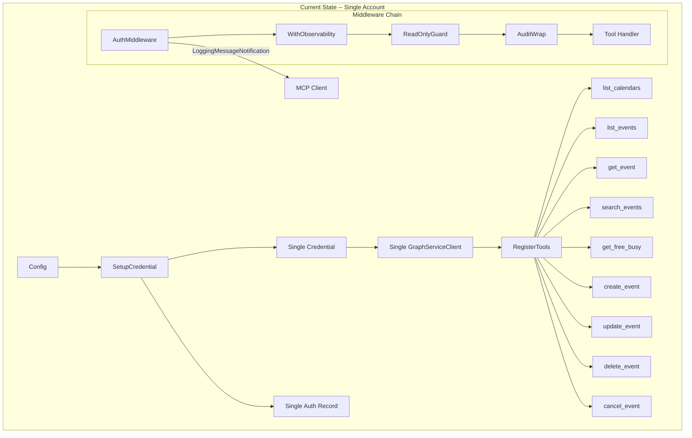
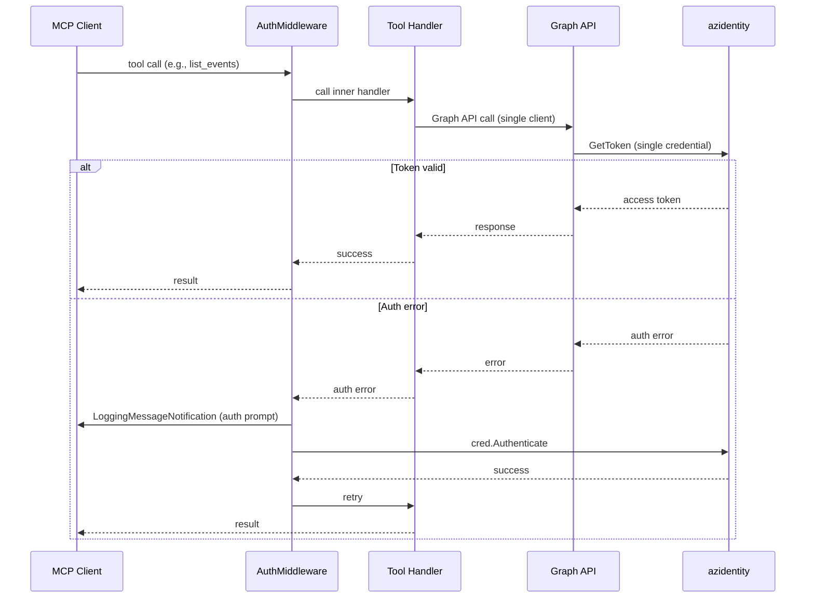
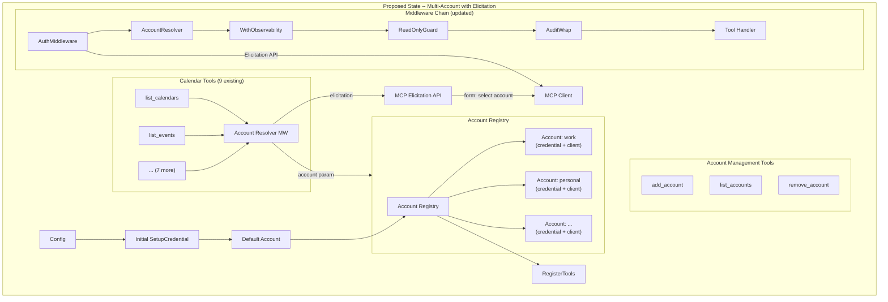
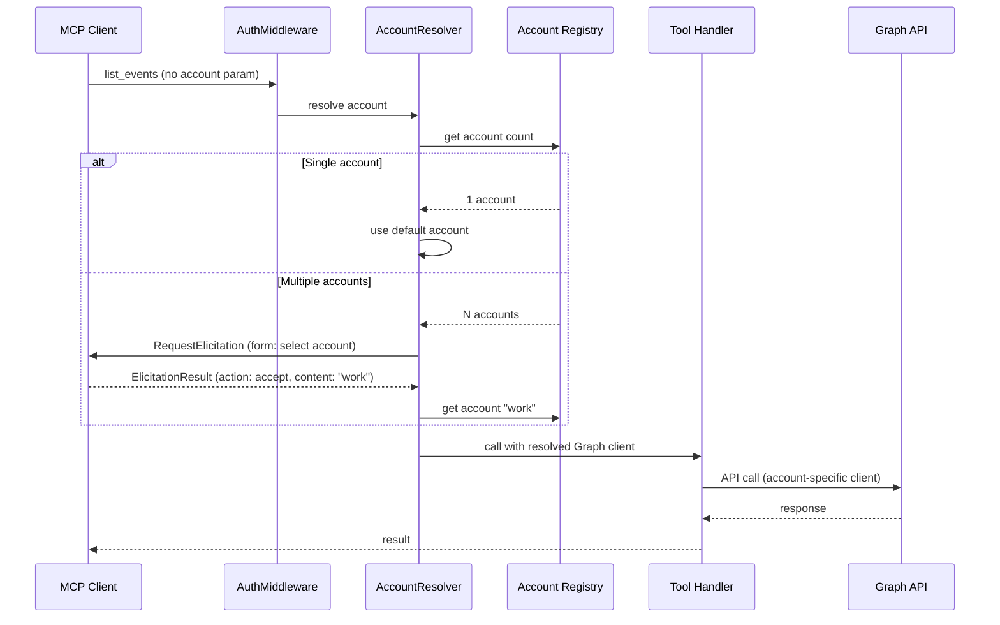
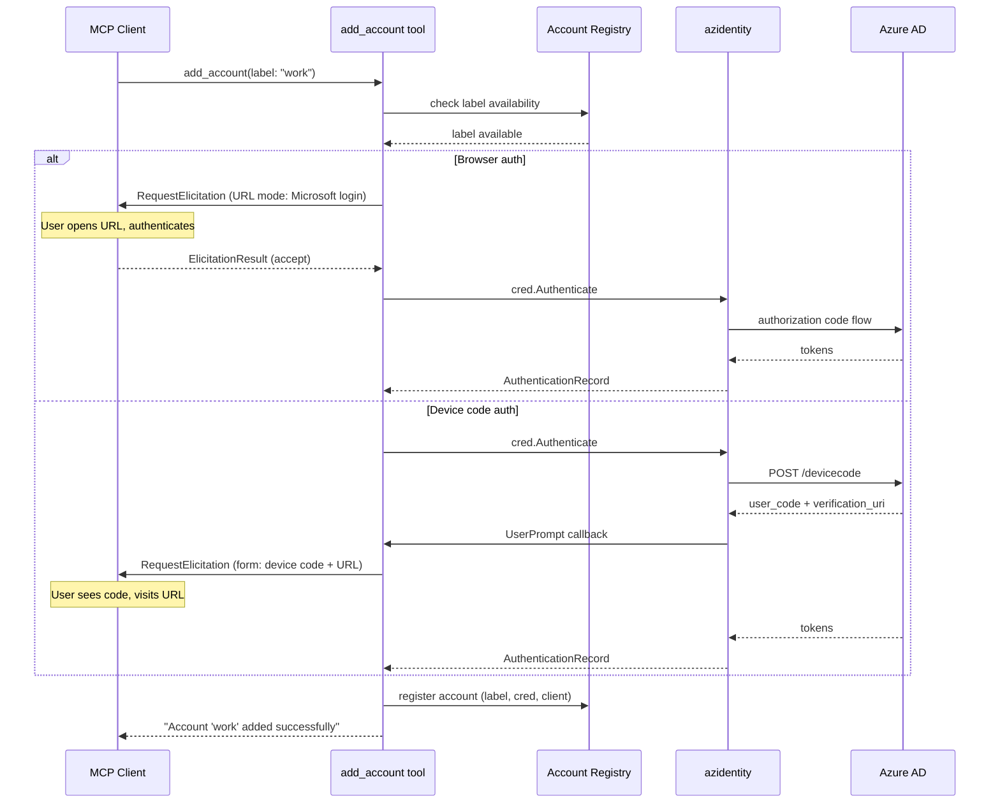
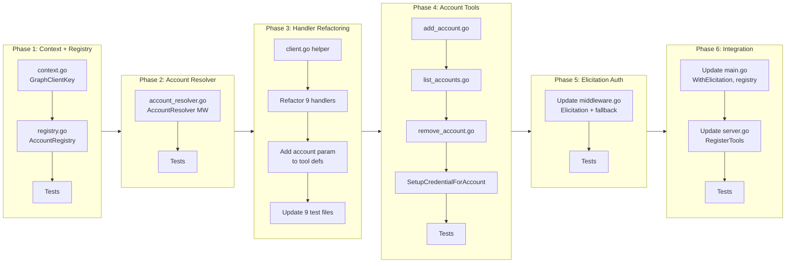

# Multi-Account Support with MCP Elicitation API

## Change Summary

The Outlook Local MCP Server currently operates with a single Microsoft account: one credential, one Graph client, one auth record, and one token cache partition -- all wired at startup and shared across every tool call. This CR adds the ability to authenticate and operate against multiple Microsoft accounts simultaneously, using the MCP Elicitation API for interactive account selection and authentication flows.

The change introduces an account registry that manages multiple authenticated accounts dynamically, new MCP tools for account management (add_account, list_accounts, remove_account), per-request account resolution via an optional "account" parameter on all existing tools, and replaces the current `LoggingMessageNotification`-based authentication prompts with the structured MCP Elicitation API (`RequestElicitation` in form and URL modes).

## Motivation and Background

Users who manage calendars across multiple Microsoft accounts (e.g., a personal account and one or more work accounts) must currently run separate server instances -- one per account. Each instance requires its own configuration, port, and MCP client integration. This is operationally burdensome and prevents cross-account calendar views (e.g., "show me all my meetings today across all accounts").

The MCP protocol now includes the Elicitation API, which allows servers to request structured user input via form-based or URL-based interactions. The `mcp-go` SDK (v0.45.0, already in use) supports `MCPServer.RequestElicitation` with form mode (JSON Schema) and URL mode. This provides a significantly better user experience than `LoggingMessageNotification` for interactive flows:

- **Form mode** presents a structured form to the user (e.g., account selection dropdown), returning typed data conforming to a JSON Schema.
- **URL mode** directs the user to a URL (e.g., Microsoft OAuth login page) and receives a completion signal, replacing the opaque device code flow with a direct browser interaction.

## Change Drivers

* Users managing multiple Microsoft accounts must run separate server instances, creating operational overhead.
* Cross-account calendar views (free/busy across accounts, unified event search) are impossible with a single-account architecture.
* The `LoggingMessageNotification` approach for authentication prompts (CR-0022) relies on MCP clients rendering log messages, which is inconsistent across clients.
* The MCP Elicitation API provides a protocol-level mechanism for interactive user prompts with structured responses, superseding the notification-based workaround.
* The `mcp-go` SDK already supports the Elicitation API, making adoption straightforward.

## Current State

The server initializes a single authentication credential during startup via `auth.SetupCredential(cfg)` in `cmd/outlook-local-mcp/main.go`. This produces one `azcore.TokenCredential` and one `Authenticator`, which are used to create a single `*msgraphsdk.GraphServiceClient`. This client is passed to all nine tool handlers via `internalserver.RegisterTools`, where each handler closes over the single client.

The `AuthMiddleware` (CR-0022, CR-0024) wraps all tool handlers to detect authentication errors and trigger re-authentication. It uses `LoggingMessageNotification` to surface device code prompts and browser authentication requests to the MCP client.

### Current State Architecture



### Current Authentication Flow



## Proposed Change

Introduce a multi-account architecture with four key additions:

1. **Account Registry** (`internal/auth/registry.go`) -- A thread-safe runtime registry managing multiple authenticated accounts. Each account entry holds an identifier (user-chosen label like "work" or "personal"), the account's credential, Graph client, auth record path, and cache partition name. Accounts can be added and removed dynamically without server restart.

2. **Account Management Tools** (`internal/tools/account_*.go`) -- Three new MCP tools:
   - `add_account`: Initiates authentication for a new account. Uses MCP Elicitation (URL mode for browser auth, form mode for device code) to guide the user through the login flow.
   - `list_accounts`: Lists all registered accounts with their labels and status.
   - `remove_account`: Removes an account from the registry and cleans up its resources.

3. **Account Resolution Middleware** (`internal/auth/account_resolver.go`) -- A new middleware that sits in the handler chain and resolves which account to use for each tool call. When an "account" parameter is provided, it selects that account. When omitted and multiple accounts exist, it uses MCP Elicitation (form mode) to present the available accounts and get the user's choice. When only one account exists, it is used automatically.

4. **Elicitation-Based Authentication** -- Replace `LoggingMessageNotification` in the auth middleware with MCP Elicitation API calls. For browser auth, use URL mode (`RequestURLElicitation`) to direct the user to the Microsoft login page. For device code auth, use form mode to display the device code and verification URL. Fall back to `LoggingMessageNotification` when the client does not support elicitation (indicated by `server.ErrElicitationNotSupported`).

### Proposed State Architecture



### Proposed Account Selection Flow



### Proposed Authentication Elicitation Flow



## Requirements

### Functional Requirements

1. The system **MUST** implement an `AccountRegistry` in `internal/auth/registry.go` that manages multiple authenticated account entries at runtime.
2. Each account entry in the registry **MUST** contain: a user-chosen label (string identifier), an `azcore.TokenCredential`, an `Authenticator`, a `*msgraphsdk.GraphServiceClient`, an auth record file path, and a token cache partition name.
3. The `AccountRegistry` **MUST** be safe for concurrent access from multiple tool handler goroutines.
4. The `AccountRegistry` **MUST** support adding, removing, listing, and looking up accounts by label.
5. Account labels **MUST** be unique within the registry. Adding an account with a duplicate label **MUST** return an error.
6. Account labels **MUST** be validated: non-empty, alphanumeric with hyphens and underscores only, maximum 64 characters.
7. The system **MUST** register the account created from the startup configuration as the default account in the registry with the label "default".
8. The system **MUST** implement an `add_account` MCP tool that creates a new authenticated account and registers it in the registry.
9. The `add_account` tool **MUST** accept a required `label` parameter (string) and optional `client_id`, `tenant_id`, and `auth_method` parameters. When optional parameters are omitted, the values from the server configuration **MUST** be used.
10. The `add_account` tool **MUST** use MCP Elicitation (URL mode via `RequestURLElicitation`) for browser authentication to direct the user to the Microsoft login page.
11. The `add_account` tool **MUST** use MCP Elicitation (form mode via `RequestElicitation`) for device code authentication to display the verification URL and user code.
12. The `add_account` tool **MUST** fall back to `LoggingMessageNotification` when the MCP client does not support elicitation (detected via `server.ErrElicitationNotSupported`).
13. The `add_account` tool **MUST** persist the new account's `AuthenticationRecord` to a separate file at `{auth_record_dir}/{label}_auth_record.json`.
14. The `add_account` tool **MUST** use a separate token cache partition named `{cache_name}-{label}` for each account.
15. The system **MUST** implement a `list_accounts` MCP tool that returns a JSON array of registered accounts, each containing the label and authentication status.
16. The system **MUST** implement a `remove_account` MCP tool that removes an account from the registry by label. The `remove_account` tool **MUST NOT** delete the account's auth record file from disk (the file enables faster re-authentication if the account is re-added later).
17. The `remove_account` tool **MUST NOT** allow removal of the "default" account.
18. The `remove_account` tool **MUST** accept a required `label` parameter.
19. All nine existing calendar tools **MUST** accept an optional `account` parameter (string) specifying which registered account to use.
20. When the `account` parameter is provided on a calendar tool call, the system **MUST** look up the account in the registry and use its Graph client. If the account is not found, the tool **MUST** return an error.
21. When the `account` parameter is omitted and only one account is registered, the system **MUST** use that account automatically.
22. When the `account` parameter is omitted and multiple accounts are registered, the system **MUST** use MCP Elicitation (form mode) to prompt the user to select an account.
23. The account selection elicitation **MUST** present a JSON Schema with an `account` property of type `string` with an `enum` containing the labels of all registered accounts.
24. When the user declines or cancels the account selection elicitation, the tool **MUST** return an error indicating that an account selection is required.
25. The system **MUST** implement an `AccountResolver` middleware in `internal/auth/account_resolver.go` that resolves the Graph client for each tool call based on the account parameter or elicitation result.
26. The `AccountResolver` middleware **MUST** inject both the resolved `*msgraphsdk.GraphServiceClient` and the resolved `Authenticator` into the context so that tool handlers and the `AuthMiddleware` can retrieve them.
27. Tool handlers **MUST** be refactored to retrieve the Graph client from the context instead of closing over a single client at registration time.
28. The `AuthMiddleware` **MUST** be updated to use MCP Elicitation (URL mode for browser, form mode for device code) instead of `LoggingMessageNotification` for re-authentication prompts. The `AuthMiddleware` **MUST** retrieve the resolved account's `Authenticator` and auth record path from context (injected by `AccountResolver`) for re-authentication, instead of closing over a single credential.
29. The `AuthMiddleware` **MUST** fall back to `LoggingMessageNotification` when the MCP client does not support elicitation.
30. The MCP server **MUST** be created with `server.WithElicitation()` to declare elicitation capability.
31. The system **MUST** store a `GraphClientKey` context key type and an `AuthenticatorKey` context key type in `internal/auth/context.go` for injecting and retrieving the Graph client and the resolved account's `Authenticator` and auth record path from context.

### Non-Functional Requirements

1. The `AccountResolver` middleware **MUST NOT** add more than 1 millisecond of latency to tool calls when a single account is registered (no elicitation needed).
2. The `AccountRegistry` **MUST** handle at least 10 concurrent accounts without degradation.
3. The system **MUST NOT** store tokens, secrets, or credentials in log messages, elicitation requests, tool results, or audit entries.
4. Each account's token cache **MUST** be isolated -- tokens from one account **MUST NOT** be accessible to another account's credential.
5. The system **MUST NOT** block the MCP stdio transport during account addition or elicitation -- all interactive flows **MUST** run within the context of a single tool call.
6. Auth record files for non-default accounts **MUST** be written with permissions 0600.
7. The system **MUST** preserve backward compatibility -- a server started without adding extra accounts **MUST** behave identically to the current single-account server.

## Affected Components

* `internal/auth/registry.go` (new) -- `AccountRegistry` implementation with `Add`, `Remove`, `Get`, `List`, `Count` methods.
* `internal/auth/registry_test.go` (new) -- Unit tests for `AccountRegistry`.
* `internal/auth/context.go` (new) -- `GraphClientKey` context key, `GraphClientFromContext`, `WithGraphClient` helpers; `AccountAuthKey` context key, `AccountAuth` struct, `AccountAuthFromContext`, `WithAccountAuth` helpers.
* `internal/auth/context_test.go` (new) -- Tests for context helpers (both Graph client and AccountAuth).
* `internal/auth/account_resolver.go` (new) -- `AccountResolver` middleware.
* `internal/auth/account_resolver_test.go` (new) -- Tests for `AccountResolver`.
* `internal/auth/middleware.go` -- Update `AuthMiddleware` to use Elicitation API with `LoggingMessageNotification` fallback.
* `internal/auth/middleware_test.go` -- Update tests for elicitation-based auth flow.
* `internal/auth/auth.go` -- Extract `SetupCredentialForAccount` function for creating per-account credentials.
* `internal/auth/auth_test.go` -- Update tests for `SetupCredentialForAccount`.
* `internal/tools/client.go` (new) -- `GraphClient(ctx)` helper that wraps `auth.GraphClientFromContext` for use by tool handlers.
* `internal/tools/client_test.go` (new) -- Tests for `GraphClient` helper.
* `internal/tools/add_account.go` (new) -- `add_account` tool definition and handler.
* `internal/tools/add_account_test.go` (new) -- Tests for `add_account`.
* `internal/tools/list_accounts.go` (new) -- `list_accounts` tool definition and handler.
* `internal/tools/list_accounts_test.go` (new) -- Tests for `list_accounts`.
* `internal/tools/remove_account.go` (new) -- `remove_account` tool definition and handler.
* `internal/tools/remove_account_test.go` (new) -- Tests for `remove_account`.
* `internal/tools/list_calendars.go` -- Add optional `account` parameter; retrieve Graph client from context.
* `internal/tools/list_events.go` -- Add optional `account` parameter; retrieve Graph client from context.
* `internal/tools/get_event.go` -- Add optional `account` parameter; retrieve Graph client from context.
* `internal/tools/search_events.go` -- Add optional `account` parameter; retrieve Graph client from context.
* `internal/tools/get_free_busy.go` -- Add optional `account` parameter; retrieve Graph client from context.
* `internal/tools/create_event.go` -- Add optional `account` parameter; retrieve Graph client from context.
* `internal/tools/update_event.go` -- Add optional `account` parameter; retrieve Graph client from context.
* `internal/tools/delete_event.go` -- Add optional `account` parameter; retrieve Graph client from context.
* `internal/tools/cancel_event.go` -- Add optional `account` parameter; retrieve Graph client from context.
* `internal/tools/*_test.go` (9 files) -- Update tool handler tests to inject Graph client via context.
* `internal/server/server.go` -- Update `RegisterTools` to accept `AccountRegistry` and wire `AccountResolver` middleware; register account management tools.
* `internal/server/server_test.go` -- Update tests for new `RegisterTools` signature and account tools registration.
* `cmd/outlook-local-mcp/main.go` -- Create `AccountRegistry`, register default account, add `server.WithElicitation()`, pass registry to `RegisterTools`.
* `internal/config/config.go` -- No changes (existing config provides defaults for new accounts).

## Scope Boundaries

### In Scope

* `AccountRegistry` with add, remove, list, get, count operations.
* Three new account management MCP tools: `add_account`, `list_accounts`, `remove_account`.
* Optional `account` parameter on all nine existing calendar tools.
* `AccountResolver` middleware for per-request account resolution.
* MCP Elicitation (form mode) for account selection when multiple accounts exist.
* MCP Elicitation (URL mode) for browser authentication in `add_account`.
* MCP Elicitation (form mode) for device code authentication in `add_account`.
* Elicitation-based re-authentication in `AuthMiddleware` with `LoggingMessageNotification` fallback.
* Tool handler refactoring to resolve Graph client from context.
* Per-account auth record persistence and token cache partitioning.
* `server.WithElicitation()` capability declaration.

### Out of Scope ("Here, But Not Further")

* Persisting the account registry across server restarts -- accounts beyond the default are session-scoped. Persistent multi-account configuration may be addressed in a future CR.
* Cross-account operations (e.g., unified event search across all accounts, cross-account free/busy aggregation) -- each tool call operates against a single resolved account.
* Custom OAuth app registrations per account -- all accounts use the same client ID from server configuration unless overridden via `add_account` parameters.
* Account-specific retry configuration or timeout settings -- all accounts share the server-wide retry and timeout configuration.
* Migration of existing single-account auth records -- the existing auth record continues to work as the "default" account.
* Changes to the OS keychain token cache initialization mechanism beyond partition naming.
* MCP Elicitation for non-authentication purposes beyond account selection.

## Impact Assessment

### User Impact

Users gain the ability to manage multiple Microsoft accounts within a single server instance. The workflow is:

1. Server starts with the existing configured account as "default".
2. User (via assistant) calls `add_account` to add additional accounts.
3. When calling calendar tools, the user can specify which account to use via the `account` parameter, or be prompted to select when multiple accounts exist.
4. Authentication for new accounts uses the Elicitation API, providing a more integrated experience in MCP clients that support it.

Users with a single account experience no change -- the system auto-selects the only registered account.

### Technical Impact

* **Tool handler signature change:** All nine tool handlers change from closing over a single `*msgraphsdk.GraphServiceClient` to retrieving it from context. This is a mechanical refactoring but affects every handler and its tests.
* **Middleware chain update:** The `AccountResolver` middleware is inserted between `AuthMiddleware` and `WithObservability` in the chain.
* **`RegisterTools` signature change:** Gains an `*auth.AccountRegistry` parameter, replacing the direct `*msgraphsdk.GraphServiceClient` parameter.
* **MCP server capabilities:** `server.WithElicitation()` is added to the server creation, which is additive and backward-compatible.
* **New dependency on elicitation:** The Elicitation API is used but with `LoggingMessageNotification` fallback, so clients without elicitation support continue to work.

### Business Impact

Multi-account support is a frequently requested feature for users managing both personal and work calendars. It removes the need for multiple server instances and enables cross-account workflows through the assistant. The Elicitation API integration provides a modern, protocol-native user experience.

## Implementation Approach

The implementation is structured in six sequential phases. Each phase is independently testable.

### Phase 1: Context Helpers and Account Registry

**Goal:** Create the foundational types for multi-account support.

**Steps:**

1. **Create `internal/auth/context.go`:**
   - Define `graphClientKeyType` (unexported struct) and `graphClientKey` (package-level var).
   - Implement `WithGraphClient(ctx context.Context, client *msgraphsdk.GraphServiceClient) context.Context` -- stores the client in context.
   - Implement `GraphClientFromContext(ctx context.Context) (*msgraphsdk.GraphServiceClient, bool)` -- retrieves the client from context.
   - Define `accountAuthKeyType` (unexported struct) and `accountAuthKey` (package-level var).
   - Define `AccountAuth` struct containing `Authenticator Authenticator`, `AuthRecordPath string`, and `AuthMethod string`.
   - Implement `WithAccountAuth(ctx context.Context, auth AccountAuth) context.Context` -- stores the account's authenticator details in context.
   - Implement `AccountAuthFromContext(ctx context.Context) (AccountAuth, bool)` -- retrieves the account's authenticator details from context.

2. **Create `internal/auth/context_test.go`:**
   - Test round-trip: store and retrieve a client.
   - Test missing key returns `false`.
   - Test nil context behavior.
   - Test round-trip: store and retrieve `AccountAuth`.
   - Test missing `AccountAuth` key returns `false`.

3. **Create `internal/auth/registry.go`:**
   - Define `AccountEntry` struct: `Label string`, `Credential azcore.TokenCredential`, `Authenticator Authenticator`, `Client *msgraphsdk.GraphServiceClient`, `AuthRecordPath string`, `CacheName string`.
   - Define `AccountRegistry` struct with `sync.RWMutex` and `map[string]*AccountEntry`.
   - Implement `NewAccountRegistry() *AccountRegistry`.
   - Implement `Add(entry *AccountEntry) error` -- validates label, checks uniqueness, stores entry.
   - Implement `Remove(label string) error` -- rejects "default", deletes entry.
   - Implement `Get(label string) (*AccountEntry, bool)` -- returns entry by label.
   - Implement `List() []*AccountEntry` -- returns all entries sorted by label.
   - Implement `Count() int` -- returns number of registered accounts.
   - Implement `Labels() []string` -- returns sorted list of all account labels.
   - Label validation: non-empty, matches `^[a-zA-Z0-9_-]{1,64}$`, reject duplicates.

4. **Create `internal/auth/registry_test.go`:**
   - Test `Add` with valid entry.
   - Test `Add` with duplicate label returns error.
   - Test `Add` with invalid label (empty, too long, special chars) returns error.
   - Test `Remove` of existing account.
   - Test `Remove` of "default" returns error.
   - Test `Remove` of non-existent account returns error.
   - Test `Get` existing and non-existent accounts.
   - Test `List` returns sorted entries.
   - Test `Count` correctness after add/remove.
   - Test `Labels` returns sorted labels.
   - Test concurrent access safety (multiple goroutines adding/removing).

### Phase 2: Account Resolver Middleware

**Goal:** Implement the middleware that resolves the correct Graph client for each tool call.

**Steps:**

1. **Create `internal/auth/account_resolver.go`:**
   - Implement `AccountResolver(registry *AccountRegistry) func(mcpserver.ToolHandlerFunc) mcpserver.ToolHandlerFunc`.
   - The middleware:
     a. Extracts the `account` parameter from `request.GetArguments()`.
     b. If `account` is provided: look up in registry. If found, inject client via `WithGraphClient`. If not found, return `mcp.NewToolResultError`.
     c. If `account` is omitted and `registry.Count() == 1`: use the single account.
     d. If `account` is omitted and `registry.Count() > 1`: call `mcpserver.ServerFromContext(ctx)` then `srv.RequestElicitation(ctx, elicitationRequest)` with form mode presenting the account labels as an enum.
     e. Handle elicitation result: on `accept`, use the selected account. On `decline`/`cancel`, return error. On `ErrElicitationNotSupported`, fall back to using the "default" account and log a warning.
     f. Inject the resolved client via `WithGraphClient(ctx, client)` and the resolved account's authenticator details via `WithAccountAuth(ctx, accountAuth)`, then call `next(ctx, request)`.

2. **Create `internal/auth/account_resolver_test.go`:**
   - Test single account: auto-selects without elicitation.
   - Test explicit `account` parameter selects correct account.
   - Test explicit `account` parameter with non-existent label returns error.
   - Test multiple accounts without `account` param triggers elicitation.
   - Test elicitation accept selects the chosen account.
   - Test elicitation decline returns error.
   - Test elicitation cancel returns error.
   - Test `ErrElicitationNotSupported` falls back to default account.
   - Test zero accounts returns error.

### Phase 3: Tool Handler Refactoring

**Goal:** Refactor all nine tool handlers to retrieve the Graph client from context instead of closure.

**Steps:**

1. **Create a helper function** `internal/tools/client.go`:
   - `GraphClient(ctx context.Context) (*msgraphsdk.GraphServiceClient, error)` -- wraps `auth.GraphClientFromContext`, returns error if not found.

2. **Refactor each tool handler** (9 files):
   - Change handler constructors from `NewHandleXxx(graphClient *msgraphsdk.GraphServiceClient, retryCfg, timeout)` to `NewHandleXxx(retryCfg graph.RetryConfig, timeout time.Duration)`.
   - At the start of each handler function, call `client, err := GraphClient(ctx)` to retrieve the Graph client from context.
   - If the client is not in context, return `mcp.NewToolResultError("no account selected")`.
   - Remove the `graphClient` parameter from all handler constructors.

3. **Add optional `account` parameter** to each tool definition:
   - For `var` tool definitions (e.g., `ListCalendarsTool`): convert to function form `NewListCalendarsTool()` or add the parameter inline.
   - For function tool definitions (e.g., `NewCreateEventTool()`): add `mcp.WithString("account", mcp.Description("Account label to use. If omitted with multiple accounts, you will be prompted to select."))`.

4. **Update `internal/tools/client.go` tests** (`internal/tools/client_test.go`):
   - Test `GraphClient` returns client from context.
   - Test `GraphClient` returns error when no client in context.

5. **Update all 9 tool handler test files:**
   - Inject the Graph client via `auth.WithGraphClient(ctx, mockClient)` instead of passing it to the constructor.
   - Verify handlers work correctly when client is in context.
   - Verify handlers return error when client is not in context.

### Phase 4: Account Management Tools

**Goal:** Implement the three account management tools.

**Steps:**

1. **Create `internal/tools/add_account.go`:**
   - `NewAddAccountTool()` tool definition with: required `label` parameter, optional `client_id`, `tenant_id`, `auth_method` parameters.
   - `HandleAddAccount(registry *auth.AccountRegistry, cfg config.Config)` handler:
     a. Validate label (format, uniqueness via `registry.Get`).
     b. Create credential via `auth.SetupCredentialForAccount(label, clientID, tenantID, authMethod, cacheNameBase)`.
     c. Perform authentication using elicitation:
        - Browser: use `RequestURLElicitation` with the Microsoft login URL.
        - Device code: start `cred.Authenticate` in background, capture device code via channel, present via `RequestElicitation` form mode.
     d. Create `*msgraphsdk.GraphServiceClient` with the new credential.
     e. Register in the registry via `registry.Add`.
     f. Return success message with account label.

2. **Create `internal/auth/auth.go` addition:**
   - `SetupCredentialForAccount(label, clientID, tenantID, authMethod, cacheNameBase string) (azcore.TokenCredential, Authenticator, string, error)` -- creates a credential with per-account cache partition (`{cacheNameBase}-{label}`) and auth record path (`{authRecordDir}/{label}_auth_record.json`). Returns credential, authenticator, auth record path, error.

3. **Create `internal/tools/list_accounts.go`:**
   - `NewListAccountsTool()` tool definition with no parameters, read-only annotation.
   - `HandleListAccounts(registry *auth.AccountRegistry)` handler:
     a. Call `registry.List()`.
     b. Serialize each entry to `{"label": "...", "authenticated": true/false}`.
     c. Return JSON array.

4. **Create `internal/tools/remove_account.go`:**
   - `NewRemoveAccountTool()` tool definition with required `label` parameter.
   - `HandleRemoveAccount(registry *auth.AccountRegistry)` handler:
     a. Call `registry.Remove(label)`.
     b. Return success or error message.

5. **Create test files** for all three tools.

### Phase 5: Elicitation-Based Authentication

**Goal:** Update `AuthMiddleware` to use MCP Elicitation instead of `LoggingMessageNotification`.

**Steps:**

1. **Update `internal/auth/middleware.go`:**
   - Refactor `AuthMiddleware` to retrieve the resolved account's `Authenticator` and auth record path from context via `AccountAuthFromContext(ctx)` instead of closing over a single credential. When the context contains an `AccountAuth`, use its `Authenticator` and `AuthRecordPath` for re-authentication. When no `AccountAuth` is in context (backward compatibility), fall back to the closure credential.
   - In `handleBrowserAuth`: replace `sendClientNotification` with `srv.RequestURLElicitation(ctx, session, elicitationID, loginURL, message)`. Fall back to `sendClientNotification` on `ErrElicitationNotSupported`.
   - In `handleDeviceCodeAuth`: replace `sendClientNotification` of device code with `srv.RequestElicitation(ctx, elicitationRequest)` using form mode to display the code and URL. Fall back to `sendClientNotification` on `ErrElicitationNotSupported`.
   - Add `server.ErrElicitationNotSupported` detection: when `RequestElicitation` returns this error, fall back to the existing `LoggingMessageNotification` path.

2. **Update `internal/auth/middleware_test.go`:**
   - Test elicitation-based browser auth flow.
   - Test elicitation-based device code auth flow.
   - Test fallback to `LoggingMessageNotification` when elicitation not supported.

### Phase 6: Integration Wiring

**Goal:** Wire everything together in the entry point and server registration.

**Steps:**

1. **Update `cmd/outlook-local-mcp/main.go`:**
   - Add `server.WithElicitation()` to `server.NewMCPServer()` call.
   - Create `AccountRegistry` after credential setup.
   - Register the startup credential as the "default" account entry.
   - Pass `registry` to `RegisterTools` instead of `graphClient`.

2. **Update `internal/server/server.go` `RegisterTools`:**
   - Change `graphClient *msgraphsdk.GraphServiceClient` parameter to `registry *auth.AccountRegistry`.
   - Create `accountResolverMW := auth.AccountResolver(registry)`.
   - Insert `accountResolverMW` in the middleware chain between `authMW` and `observability.WithObservability`.
   - New chain: `authMW -> accountResolverMW -> WithObservability -> ReadOnlyGuard -> AuditWrap -> Handler`.
   - Update tool handler calls to remove `graphClient` parameter.
   - Register the three account management tools.
   - Update tool count log from 9 to 12.

3. **Update `internal/server/server_test.go`:**
   - Update `RegisterTools` test calls with new parameter type.
   - Add tests for account management tool registration.
   - Verify middleware chain ordering with `AccountResolver`.

4. **Update `cmd/outlook-local-mcp/main.go` startup log:**
   - Add `"accounts", 1` to the startup log to indicate initial account count.

### Implementation Flow



## Test Strategy

### Tests to Add

| Test File | Test Name | Description | Inputs | Expected Output |
|-----------|-----------|-------------|--------|-----------------|
| `internal/auth/context_test.go` | `TestWithGraphClient_RoundTrip` | Stores and retrieves Graph client from context | Context with client | Client retrieved successfully |
| `internal/auth/context_test.go` | `TestGraphClientFromContext_Missing` | Returns false when no client in context | Empty context | `nil, false` |
| `internal/auth/context_test.go` | `TestWithAccountAuth_RoundTrip` | Stores and retrieves AccountAuth from context | Context with AccountAuth | AccountAuth retrieved successfully |
| `internal/auth/context_test.go` | `TestAccountAuthFromContext_Missing` | Returns false when no AccountAuth in context | Empty context | `zero-value, false` |
| `internal/auth/registry_test.go` | `TestAccountRegistry_Add_Valid` | Adds a valid account entry | Valid AccountEntry | No error, entry retrievable |
| `internal/auth/registry_test.go` | `TestAccountRegistry_Add_DuplicateLabel` | Rejects duplicate account label | Two entries with same label | Error on second add |
| `internal/auth/registry_test.go` | `TestAccountRegistry_Add_InvalidLabel` | Rejects invalid label formats | Empty, too long, special chars | Error for each |
| `internal/auth/registry_test.go` | `TestAccountRegistry_Remove_Existing` | Removes an existing account | Registered label | No error, entry gone |
| `internal/auth/registry_test.go` | `TestAccountRegistry_Remove_Default` | Rejects removal of default account | Label "default" | Error |
| `internal/auth/registry_test.go` | `TestAccountRegistry_Remove_NotFound` | Returns error for non-existent account | Unknown label | Error |
| `internal/auth/registry_test.go` | `TestAccountRegistry_Get` | Retrieves account by label | Registered label | Entry returned |
| `internal/auth/registry_test.go` | `TestAccountRegistry_List_Sorted` | Returns entries sorted by label | Multiple entries | Sorted slice |
| `internal/auth/registry_test.go` | `TestAccountRegistry_Count` | Returns correct count | Add/remove operations | Correct count after each |
| `internal/auth/registry_test.go` | `TestAccountRegistry_Labels` | Returns sorted label list | Multiple entries | Sorted string slice |
| `internal/auth/registry_test.go` | `TestAccountRegistry_ConcurrentAccess` | Safe under concurrent goroutines | Parallel add/remove/get | No race, no panic |
| `internal/auth/account_resolver_test.go` | `TestAccountResolver_SingleAccount` | Auto-selects when one account exists | Registry with 1 account | Client injected, handler called |
| `internal/auth/account_resolver_test.go` | `TestAccountResolver_ExplicitAccount` | Selects specified account | `account` param in request | Correct client injected |
| `internal/auth/account_resolver_test.go` | `TestAccountResolver_ExplicitAccount_NotFound` | Returns error for unknown account | Unknown `account` param | Tool error result |
| `internal/auth/account_resolver_test.go` | `TestAccountResolver_MultipleAccounts_Elicitation` | Triggers elicitation for selection | Registry with 2+ accounts, no param | Elicitation called, selected client used |
| `internal/auth/account_resolver_test.go` | `TestAccountResolver_Elicitation_Decline` | Returns error when user declines | Elicitation decline | Tool error result |
| `internal/auth/account_resolver_test.go` | `TestAccountResolver_Elicitation_Cancel` | Returns error when user cancels | Elicitation cancel | Tool error result |
| `internal/auth/account_resolver_test.go` | `TestAccountResolver_Elicitation_NotSupported` | Falls back to default on unsupported | `ErrElicitationNotSupported` | Default account used |
| `internal/auth/account_resolver_test.go` | `TestAccountResolver_ZeroAccounts` | Returns error when no accounts | Empty registry | Tool error result |
| `internal/tools/client_test.go` | `TestGraphClient_FromContext` | Retrieves client from context | Context with client | Client, no error |
| `internal/tools/client_test.go` | `TestGraphClient_Missing` | Returns error when no client | Empty context | Error |
| `internal/tools/add_account_test.go` | `TestAddAccount_BrowserAuth_Success` | Creates and registers new account via URL elicitation | Valid label, browser auth, mock auth | Success message, RequestURLElicitation called |
| `internal/tools/add_account_test.go` | `TestAddAccount_DeviceCode_Success` | Creates and registers new account via form elicitation | Valid label, device code auth, mock auth | Success message, RequestElicitation called with form mode |
| `internal/tools/add_account_test.go` | `TestAddAccount_DuplicateLabel` | Rejects duplicate label | Existing label | Error result |
| `internal/tools/add_account_test.go` | `TestAddAccount_InvalidLabel` | Rejects invalid label | Invalid label string | Error result |
| `internal/tools/add_account_test.go` | `TestAddAccount_AuthFailure` | Handles authentication failure | Mock auth failure | Error with guidance |
| `internal/tools/add_account_test.go` | `TestAddAccount_ElicitationFallback` | Falls back to notification | Elicitation not supported | Uses LoggingMessageNotification |
| `internal/tools/list_accounts_test.go` | `TestListAccounts_Empty` | Returns empty array for default only | Registry with 1 account | JSON array with 1 entry |
| `internal/tools/list_accounts_test.go` | `TestListAccounts_Multiple` | Returns all accounts | Registry with 3 accounts | JSON array with 3 entries |
| `internal/tools/remove_account_test.go` | `TestRemoveAccount_Success` | Removes registered account | Valid non-default label | Success message |
| `internal/tools/remove_account_test.go` | `TestRemoveAccount_Default` | Rejects removal of default | Label "default" | Error result |
| `internal/tools/remove_account_test.go` | `TestRemoveAccount_NotFound` | Returns error for unknown | Unknown label | Error result |
| `internal/auth/middleware_test.go` | `TestAuthMiddleware_Elicitation_BrowserAuth` | Uses URL elicitation for browser re-auth | Browser auth method | `RequestURLElicitation` called |
| `internal/auth/middleware_test.go` | `TestAuthMiddleware_Elicitation_DeviceCodeAuth` | Uses form elicitation for device code | Device code method | `RequestElicitation` called |
| `internal/auth/middleware_test.go` | `TestAuthMiddleware_Elicitation_Fallback` | Falls back to notification | Elicitation not supported | `LoggingMessageNotification` sent |
| `internal/server/server_test.go` | `TestRegisterTools_AccountManagementTools` | Registers 12 tools (9 + 3 account) | Registry param | 12 tools registered |
| `internal/server/server_test.go` | `TestRegisterTools_AccountResolverMiddleware` | AccountResolver is in middleware chain | Registry param | AccountResolver wraps handlers |
| `internal/server/server_test.go` | `TestRegisterTools_DefaultAccountAtStartup` | Default account is registered in registry at startup | Registry with "default" entry | Registry Count() == 1, Get("default") succeeds |
| `internal/server/server_test.go` | `TestRegisterTools_BackwardCompatSingleAccount` | Single-account server behaves identically to pre-CR-0025 | Registry with 1 account, no account param | Tool executes without elicitation |
| `internal/server/server_test.go` | `TestMCPServer_ElicitationCapability` | Server declares elicitation capability | Server created with WithElicitation() | Server capabilities include elicitation |
| `internal/auth/registry_test.go` | `TestAccountRegistry_CachePartitionIsolation` | Each account uses distinct cache partition name | Two accounts with different labels | Different CacheName values, no overlap |
| `internal/auth/middleware_test.go` | `TestAuthMiddleware_UsesAccountAuthFromContext` | AuthMiddleware re-authenticates using resolved account credential | Context with AccountAuth, auth error | Uses AccountAuth credential, not closure credential |

### Tests to Modify

| Test File | Test Name | Current Behavior | New Behavior | Reason for Change |
|-----------|-----------|------------------|--------------|-------------------|
| `internal/tools/list_calendars_test.go` | All tests | Pass `graphClient` to constructor | Inject client via `auth.WithGraphClient(ctx, client)` | Handler no longer closes over client |
| `internal/tools/list_events_test.go` | All tests | Pass `graphClient` to constructor | Inject client via `auth.WithGraphClient(ctx, client)` | Handler no longer closes over client |
| `internal/tools/get_event_test.go` | All tests | Pass `graphClient` to constructor | Inject client via `auth.WithGraphClient(ctx, client)` | Handler no longer closes over client |
| `internal/tools/search_events_test.go` | All tests | Pass `graphClient` to constructor | Inject client via `auth.WithGraphClient(ctx, client)` | Handler no longer closes over client |
| `internal/tools/get_free_busy_test.go` | All tests | Pass `graphClient` to constructor | Inject client via `auth.WithGraphClient(ctx, client)` | Handler no longer closes over client |
| `internal/tools/create_event_test.go` | All tests | Pass `graphClient` to constructor | Inject client via `auth.WithGraphClient(ctx, client)` | Handler no longer closes over client |
| `internal/tools/update_event_test.go` | All tests | Pass `graphClient` to constructor | Inject client via `auth.WithGraphClient(ctx, client)` | Handler no longer closes over client |
| `internal/tools/delete_event_test.go` | All tests | Pass `graphClient` to constructor | Inject client via `auth.WithGraphClient(ctx, client)` | Handler no longer closes over client |
| `internal/tools/cancel_event_test.go` | All tests | Pass `graphClient` to constructor | Inject client via `auth.WithGraphClient(ctx, client)` | Handler no longer closes over client |
| `internal/server/server_test.go` | All `RegisterTools` calls | Pass `*msgraphsdk.GraphServiceClient` | Pass `*auth.AccountRegistry` | `RegisterTools` signature changed |
| `internal/auth/middleware_test.go` | `TestAuthMiddleware_AuthError_SendsNotification` | Expects `LoggingMessageNotification` | Expects `RequestElicitation` with notification fallback | Auth flow uses elicitation first |
| `internal/auth/middleware_test.go` | All re-auth tests | Uses closure credential for re-auth | Retrieves `AccountAuth` from context for re-auth credential | AuthMiddleware now uses per-account credential from context |

### Tests to Remove

Not applicable. No existing tests become fully redundant. Tests are modified rather than removed.

## Acceptance Criteria

### AC-1: Default account is registered automatically at startup

```gherkin
Given the server is started with a valid configuration
When the startup lifecycle completes
Then the Account Registry contains exactly one account with label "default"
  And the "default" account uses the credential from SetupCredential
  And the startup log includes "accounts" field set to 1
```

### AC-2: add_account registers a new account via browser elicitation

```gherkin
Given the server is running with the "default" account
  And the MCP client supports elicitation
  And the configured auth method is "browser"
When the user calls add_account with label "work"
Then the server calls RequestURLElicitation with the Microsoft login URL
  And the server creates a new credential with a separate cache partition "outlook-local-mcp-work"
  And the server persists the auth record to "{auth_record_dir}/work_auth_record.json" with permissions 0600
  And the Account Registry contains 2 accounts: "default" and "work"
  And the tool returns a success message including the label "work"
```

### AC-2b: add_account registers a new account via device code elicitation

```gherkin
Given the server is running with the "default" account
  And the MCP client supports elicitation
  And the configured auth method is "device_code"
When the user calls add_account with label "personal"
Then the server calls RequestElicitation with form mode displaying the verification URL and user code
  And the server creates a new credential with a separate cache partition "outlook-local-mcp-personal"
  And the server persists the auth record to "{auth_record_dir}/personal_auth_record.json" with permissions 0600
  And the Account Registry contains 2 accounts: "default" and "personal"
  And the tool returns a success message including the label "personal"
```

### AC-3: add_account falls back to notification when elicitation is unsupported

```gherkin
Given the server is running
  And the MCP client does NOT support elicitation
When the user calls add_account with label "personal"
Then the server falls back to LoggingMessageNotification for authentication prompts
  And the account is still registered successfully after authentication
```

### AC-4: add_account rejects duplicate labels

```gherkin
Given the Account Registry contains an account with label "work"
When the user calls add_account with label "work"
Then the tool returns an error indicating the label is already in use
  And no new account is created
```

### AC-5: add_account rejects invalid labels

```gherkin
Given the server is running
When the user calls add_account with an invalid label (empty, special characters, >64 chars)
Then the tool returns a validation error describing the label requirements
  And no authentication flow is initiated
```

### AC-6: list_accounts returns all registered accounts

```gherkin
Given the Account Registry contains accounts "default", "work", and "personal"
When the user calls list_accounts
Then the tool returns a JSON array with 3 entries
  And each entry contains "label" and "authenticated" fields
  And entries are sorted by label
```

### AC-7: remove_account removes a non-default account

```gherkin
Given the Account Registry contains accounts "default" and "work"
When the user calls remove_account with label "work"
Then the account "work" is removed from the registry
  And the tool returns a success message
  And the Account Registry contains only "default"
```

### AC-8: remove_account rejects removal of default account

```gherkin
Given the Account Registry contains the "default" account
When the user calls remove_account with label "default"
Then the tool returns an error indicating the default account cannot be removed
  And the "default" account remains in the registry
```

### AC-9: Explicit account parameter selects the correct account

```gherkin
Given the Account Registry contains "default" and "work" accounts
When the user calls list_events with account="work"
Then the tool uses the "work" account's Graph client
  And the events are retrieved from the "work" account's calendar
```

### AC-10: Explicit account parameter with unknown label returns error

```gherkin
Given the Account Registry contains only the "default" account
When the user calls list_events with account="nonexistent"
Then the tool returns an error indicating account "nonexistent" is not found
```

### AC-11: Single account auto-selected without elicitation

```gherkin
Given the Account Registry contains only the "default" account
When the user calls any calendar tool without the account parameter
Then the "default" account is selected automatically
  And no elicitation is triggered
  And the AccountResolver adds no more than 1 millisecond of latency
```

### AC-12: Multiple accounts trigger elicitation for selection

```gherkin
Given the Account Registry contains "default" and "work" accounts
  And the MCP client supports elicitation
When the user calls list_events without the account parameter
Then the server calls RequestElicitation with form mode
  And the form schema includes an "account" property with enum ["default", "work"]
  And the user's selection is used to resolve the Graph client
```

### AC-13: Elicitation decline or cancel returns error

```gherkin
Given the Account Registry contains multiple accounts
  And the MCP client supports elicitation
When the user calls a calendar tool without the account parameter
  And the user declines or cancels the account selection elicitation
Then the tool returns an error indicating account selection is required
```

### AC-14: Elicitation unsupported falls back to default account

```gherkin
Given the Account Registry contains "default" and "work" accounts
  And the MCP client does NOT support elicitation
When the user calls list_events without the account parameter
Then the server falls back to using the "default" account
  And a warning is logged indicating elicitation is not supported
```

### AC-15: AuthMiddleware uses elicitation for re-authentication

```gherkin
Given the server is running with a valid account whose token has expired
  And the MCP client supports elicitation
When a tool call encounters an authentication error
Then the AuthMiddleware uses MCP Elicitation (URL mode for browser, form mode for device code) for re-authentication
  And falls back to LoggingMessageNotification if elicitation is not supported
```

### AC-16: Backward compatibility with single account

```gherkin
Given the server is started without calling add_account
When the user calls any of the 9 existing calendar tools without the account parameter
Then the server behaves identically to the pre-CR-0025 single-account behavior
  And no elicitation is triggered
  And no errors related to multi-account are returned
```

### AC-17: MCP server declares elicitation capability

```gherkin
Given the MCP server is initialized
When the server capabilities are declared to the MCP client
Then the capabilities include elicitation support
  And the server can call RequestElicitation and RequestURLElicitation
```

### AC-18: Middleware chain ordering

```gherkin
Given the RegisterTools function registers all tool handlers
When the middleware chain is constructed
Then the middleware order MUST be: AuthMiddleware -> AccountResolver -> WithObservability -> ReadOnlyGuard -> AuditWrap -> Handler
```

### AC-19: Per-account token cache isolation

```gherkin
Given accounts "default" and "work" are registered
Then the "default" account uses cache partition "outlook-local-mcp"
  And the "work" account uses cache partition "outlook-local-mcp-work"
  And tokens cached for one account are not accessible from the other
```

## Quality Standards Compliance

### Build & Compilation

- [x] Code compiles/builds without errors
- [x] No new compiler warnings introduced

### Linting & Code Style

- [x] All linter checks pass with zero warnings/errors
- [x] Code follows project coding conventions and style guides
- [x] Any linter exceptions are documented with justification

### Test Execution

- [x] All existing tests pass after implementation
- [x] All new tests pass
- [x] Test coverage meets project requirements for changed code

### Documentation

- [x] Inline code documentation updated where applicable
- [x] API documentation updated for any API changes
- [x] User-facing documentation updated if behavior changes

### Code Review

- [ ] Changes submitted via pull request
- [ ] PR title follows Conventional Commits format
- [ ] Code review completed and approved
- [ ] Changes squash-merged to maintain linear history

### Verification Commands

```bash
# Build verification
go build ./cmd/outlook-local-mcp/

# Lint verification
golangci-lint run ./...

# Test execution (all packages)
go test ./... -v -count=1

# Test execution (affected packages)
go test ./internal/auth/... ./internal/tools/... ./internal/server/... -v -count=1

# Test coverage for auth package
go test ./internal/auth/... -coverprofile=coverage.out
go tool cover -func=coverage.out
```

## Risks and Mitigation

### Risk 1: MCP client does not support elicitation

**Likelihood:** high
**Impact:** medium
**Mitigation:** Every elicitation call includes a fallback path. Account selection falls back to using the "default" account with a warning. Authentication falls back to `LoggingMessageNotification`. The `add_account` tool falls back to `LoggingMessageNotification` for authentication prompts. The server logs which path was taken so operators can diagnose client capability gaps.

### Risk 2: Tool handler refactoring introduces regressions

**Likelihood:** medium
**Impact:** high
**Mitigation:** The refactoring is mechanical (replace constructor parameter with context lookup). All 482+ existing tests are updated to inject the client via context. The Phase 3 implementation includes a helper function (`GraphClient`) that centralizes the context lookup, minimizing per-handler changes. Running the full test suite after each handler refactoring catches regressions early.

### Risk 3: RegisterTools signature change breaks tests

**Likelihood:** high
**Impact:** low
**Mitigation:** All callers of `RegisterTools` (main.go and server_test.go) are updated in Phase 6. Tests use a mock `AccountRegistry` with a single entry to preserve existing behavior. This is the same pattern used when `readOnly` and `authMW` parameters were added in previous CRs.

### Risk 4: Concurrent account addition and tool calls race

**Likelihood:** medium
**Impact:** medium
**Mitigation:** The `AccountRegistry` uses `sync.RWMutex` to serialize writes (add/remove) while allowing concurrent reads (get/list). Tool handlers hold only a read lock for the duration of account resolution, not for the entire Graph API call. The `AccountResolver` middleware resolves the account and injects the client before calling the inner handler, so the handler itself has no dependency on the registry.

### Risk 5: Token cache partition collision

**Likelihood:** low
**Impact:** high
**Mitigation:** Cache partition names follow a deterministic naming scheme: `{cache_name}-{label}`. Label uniqueness is enforced by the registry, ensuring cache partition names are also unique. The default account uses the base `cache_name` (no suffix) for backward compatibility.

### Risk 6: Authentication record file path collision

**Likelihood:** low
**Impact:** medium
**Mitigation:** Auth record paths follow a deterministic scheme: `{auth_record_dir}/{label}_auth_record.json`. Label uniqueness enforced by the registry prevents path collisions. The default account uses the original path from config for backward compatibility.

### Risk 7: mcp-go Elicitation API changes

**Likelihood:** low
**Impact:** medium
**Mitigation:** The CR is written against `mcp-go v0.45.0`, which supports `RequestElicitation`, `RequestURLElicitation`, `ElicitationResult`, `ElicitationResponseAction*` constants, and `server.WithElicitation()`. The implementation pins to the current API surface. If the API changes in future versions, the fallback to `LoggingMessageNotification` ensures the server remains functional.

## Dependencies

* **CR-0022 (Improved Authentication Flow):** The `AuthMiddleware` being extended with elicitation support. All existing middleware patterns (error detection, re-authentication, concurrency guard) are preserved.
* **CR-0024 (Interactive Browser Auth Default):** The browser authentication flow that will gain elicitation-based prompting.
* **CR-0003 (Authentication):** The foundational `InitCache`, `LoadAuthRecord`, `SaveAuthRecord` functions used for per-account credential management.
* **CR-0004 (Server Bootstrap):** The `RegisterTools` function whose signature changes to accept the registry.
* **CR-0018 (Observability):** The `WithObservability` middleware that participates in the updated handler chain.
* **`github.com/mark3labs/mcp-go` v0.45.0:** Provides `MCPServer.RequestElicitation`, `MCPServer.RequestURLElicitation`, `mcp.ElicitationRequest`, `mcp.ElicitationResult`, `mcp.ElicitationParams`, `mcp.ElicitationModeForm`, `mcp.ElicitationModeURL`, `mcp.ElicitationResponseActionAccept`, `mcp.ElicitationResponseActionDecline`, `mcp.ElicitationResponseActionCancel`, `server.WithElicitation()`, `server.ErrElicitationNotSupported`, `server.ClientSessionFromContext`. No version change required.
* **`github.com/Azure/azure-sdk-for-go/sdk/azidentity`:** Provides credential construction for per-account authentication. No version change required.
* **`github.com/microsoftgraph/msgraph-sdk-go`:** Provides `GraphServiceClient` creation for per-account Graph clients. No version change required.

## Estimated Effort

| Phase | Description | Estimate |
|-------|-------------|----------|
| Phase 1 | Context helpers and Account Registry | 3 hours |
| Phase 2 | Account Resolver middleware | 3 hours |
| Phase 3 | Tool handler refactoring (9 handlers + tests) | 6 hours |
| Phase 4 | Account management tools (3 tools + tests) | 5 hours |
| Phase 5 | Elicitation-based authentication | 4 hours |
| Phase 6 | Integration wiring (main.go, server.go, tests) | 3 hours |
| **Total** | | **24 hours** |

## Decision Outcome

Chosen approach: "Account registry with per-request resolution via MCP Elicitation API", because it provides a clean separation between account management (registry), account selection (resolver middleware with elicitation), and tool execution (handlers receive the resolved client via context). The Elicitation API provides a protocol-native, structured mechanism for interactive account selection and authentication that is superior to `LoggingMessageNotification`-based workarounds. The fallback to `LoggingMessageNotification` ensures compatibility with clients that do not support elicitation.

Alternative approaches considered:

* **Configuration-driven multi-account:** Define all accounts in environment variables at startup (e.g., `OUTLOOK_MCP_ACCOUNTS=work:clientid:tenantid,personal:clientid:tenantid`). Rejected because it requires a server restart to add or remove accounts and cannot handle interactive authentication at configuration time.
* **Separate tool namespaces per account:** Register `work_list_events`, `personal_list_events`, etc. Rejected because it creates tool explosion (9 tools x N accounts) and requires the assistant to learn account-specific tool names.
* **Account parameter without elicitation:** Always require the `account` parameter, never prompt. Rejected because it places the burden on the assistant to know which accounts exist and always specify one, degrading the user experience.

## Related Items

* CR-0022 -- Improved Authentication Flow (AuthMiddleware being extended)
* CR-0024 -- Interactive Browser Auth Default (browser auth with elicitation)
* CR-0003 -- Authentication (foundational auth functions)
* CR-0004 -- Server Bootstrap (RegisterTools)
* CR-0018 -- Observability Metrics (middleware chain)

## More Information

### mcp-go Elicitation API Reference

The `mcp-go` SDK (v0.45.0) provides the following Elicitation APIs used by this CR:

* `server.WithElicitation()` -- Server option to declare elicitation capability in MCP capability negotiation.
* `server.ClientSessionFromContext(ctx) ClientSession` -- Retrieves the client session from a tool handler context.
* `MCPServer.RequestElicitation(ctx context.Context, request mcp.ElicitationRequest) (*mcp.ElicitationResult, error)` -- Sends a form-mode elicitation request to the client. The session is extracted from context internally.
* `MCPServer.RequestURLElicitation(ctx context.Context, session ClientSession, elicitationID string, url string, message string) (*mcp.ElicitationResult, error)` -- Sends a URL-mode elicitation request for out-of-band interactions like OAuth.
* `MCPServer.SendElicitationComplete(ctx context.Context, session ClientSession, elicitationID string) error` -- Notifies the client that a URL-mode elicitation flow has completed.
* `server.ErrElicitationNotSupported` -- Returned by `RequestElicitation`/`RequestURLElicitation` when the client does not support elicitation. Used for fallback detection.

**ElicitationRequest structure:**
```go
mcp.ElicitationRequest{
    Params: mcp.ElicitationParams{
        Message:         "Select an account",
        Mode:            mcp.ElicitationModeForm, // or mcp.ElicitationModeURL
        RequestedSchema: any(map[string]any{...}),  // JSON Schema for form mode (type is any)
        ElicitationID:   "...",                    // for URL mode
        URL:             "...",                    // for URL mode
    },
}
```

**ElicitationResult structure:**
```go
type ElicitationResult struct {
    ElicitationResponse
}
type ElicitationResponse struct {
    Action  ElicitationResponseAction // accept, decline, cancel
    Content any                       // user's response data (form mode)
}
```

**Client capability declaration:**
```go
mcp.ClientCapabilities{
    Elicitation: &mcp.ElicitationCapability{
        Form: &struct{}{},
        URL:  &struct{}{},
    },
}
```

### Account Selection JSON Schema Example

The `AccountResolver` middleware presents the following JSON Schema when multiple accounts exist:

```json
{
  "type": "object",
  "properties": {
    "account": {
      "type": "string",
      "description": "Select the account to use for this operation",
      "enum": ["default", "work", "personal"]
    }
  },
  "required": ["account"]
}
```

### Middleware Chain After CR-0025

```
AuthMiddleware -> AccountResolver -> WithObservability -> ReadOnlyGuard (write tools only) -> AuditWrap -> Tool Handler
```

`AccountResolver` is placed after `AuthMiddleware` so that account resolution (including potential elicitation) occurs within the auth middleware's error handling scope. The `AuthMiddleware` retrieves the resolved account's credential from context (injected by `AccountResolver`) when re-authentication is needed. `AccountResolver` is placed before `WithObservability` so that account resolution latency is captured in the observability span.

### Per-Account File Layout

```
~/.outlook-local-mcp/
  auth_record.json              # Default account (unchanged)
  work_auth_record.json         # "work" account
  personal_auth_record.json     # "personal" account
```

Token cache partitions (OS keychain):
- `outlook-local-mcp` -- default account (unchanged)
- `outlook-local-mcp-work` -- "work" account
- `outlook-local-mcp-personal` -- "personal" account

<!--
## CR-0025 Review Summary

**Reviewer:** CR Reviewer Agent
**Date:** 2026-03-14

### Findings: 11 total, 11 fixes applied, 0 unresolvable

#### Contradictions Resolved (3)

1. **AuthMiddleware + AccountResolver ordering contradiction (CRITICAL):** The middleware chain
   places AuthMiddleware before AccountResolver, but AuthMiddleware closed over a single
   credential and had no way to know which account's credential to use for re-authentication.
   **Fix:** Updated FR-26 to inject both GraphClient and AccountAuth into context. Updated FR-28
   to require AuthMiddleware to retrieve the resolved account's Authenticator from context.
   Updated FR-31 to include AccountAuthKey context type. Updated Phase 1 (context.go),
   Phase 2 (AccountResolver), and Phase 5 (middleware.go) implementation steps accordingly.
   Fixed the middleware chain rationale in the "More Information" section.

2. **AC-2 was generic about elicitation mode:** FR-10 specifies URL mode for browser auth and
   FR-11 specifies form mode for device code auth, but AC-2 said only "via MCP Elicitation"
   without distinguishing. **Fix:** Split AC-2 into AC-2 (browser, URL mode) and AC-2b
   (device code, form mode) with specific elicitation method assertions.

3. **AC-13 only covered decline, not cancel:** FR-24 requires both decline and cancel to return
   error. **Fix:** Updated AC-13 title and Gherkin to cover both decline and cancel.

#### Ambiguity Resolved (2)

4. **remove_account file cleanup ambiguity:** FR-16 did not specify whether the auth record
   file is deleted on disk when an account is removed. **Fix:** Added explicit statement to
   FR-16 that remove_account MUST NOT delete the auth record file (enables faster re-auth
   if the account is re-added).

5. **AC-2 missing file permission assertion:** NFR-6 requires 0600 permissions for non-default
   auth record files but AC-2 did not assert this. **Fix:** Added "with permissions 0600" to
   both AC-2 and AC-2b.

#### Coverage Gaps Fixed (4)

6. **Missing Affected Components:** `internal/tools/client.go` and
   `internal/tools/client_test.go` (created in Phase 3) were not listed in Affected Components.
   **Fix:** Added both files to the Affected Components list.

7. **FR-11 had no AC:** Device code elicitation in add_account had no acceptance criterion.
   **Fix:** Added AC-2b covering device code authentication flow.

8. **ACs missing test entries:** AC-1 (default account at startup), AC-16 (backward compat),
   AC-17 (elicitation capability), AC-19 (cache isolation) had no corresponding test entries.
   **Fix:** Added 5 new test entries: TestRegisterTools_DefaultAccountAtStartup,
   TestRegisterTools_BackwardCompatSingleAccount, TestMCPServer_ElicitationCapability,
   TestAccountRegistry_CachePartitionIsolation, TestAuthMiddleware_UsesAccountAuthFromContext.

9. **Context helper tests incomplete:** New AccountAuth context helpers had no test entries.
   **Fix:** Added TestWithAccountAuth_RoundTrip and TestAccountAuthFromContext_Missing.

#### Minor Fixes (2)

10. **ElicitationParams.RequestedSchema type:** Example code showed `map[string]any{...}` but
    the actual type is `any`. **Fix:** Updated to `any(map[string]any{...})` with comment.

11. **Test entry renamed for clarity:** Renamed TestAddAccount_Success to
    TestAddAccount_BrowserAuth_Success and added TestAddAccount_DeviceCode_Success to match
    the split AC-2/AC-2b.
-->
