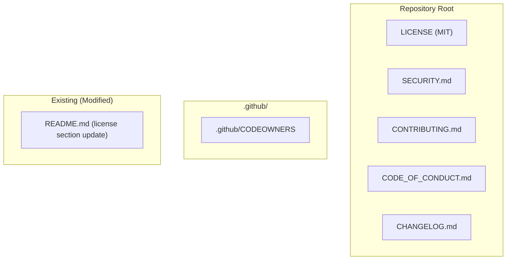
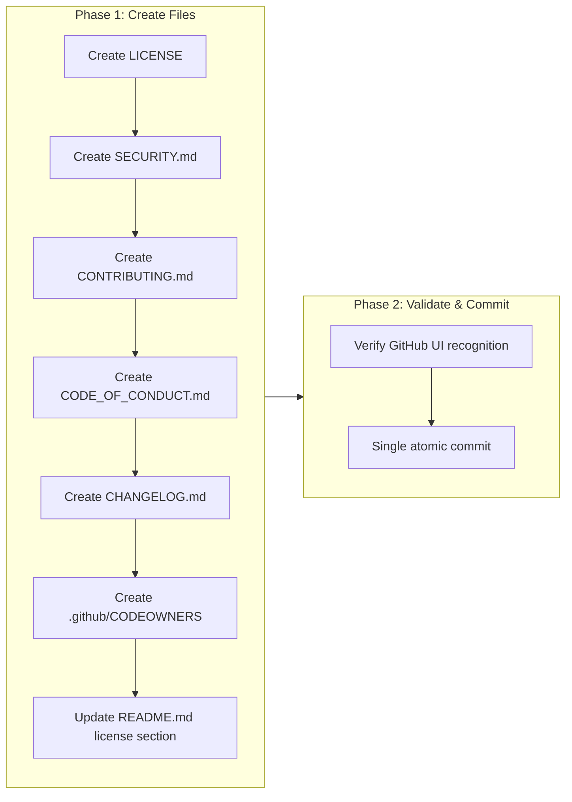

# Open Source Scaffolding: License, Community, and Governance Files

## Change Summary

Add the foundational open source project files required before making the repository public: MIT License, security vulnerability reporting policy, contribution guidelines, code of conduct, project changelog, and code ownership definitions. These files establish the legal framework, community standards, and contributor experience for the project as a public open source repository.

## Motivation and Background

The project is preparing for its first public release on GitHub. Currently, the repository lacks all standard open source scaffolding files. Without a license file, the code is legally "all rights reserved" regardless of public visibility -- no one can legally use, modify, or distribute it. Without community files, potential contributors have no guidance on how to participate, report vulnerabilities, or understand project governance.

These files **MUST** be committed early in the repository history so that:

1. The MIT License covers all subsequent commits from the moment it is added.
2. The security policy is in place before the codebase is exposed to public scrutiny.
3. Contributors encounter clear guidelines from their first interaction with the repository.
4. GitHub's UI features (Security tab, Contributing link, Code of Conduct badge) activate immediately upon publishing.

The project handles sensitive operations (OAuth tokens, Microsoft account credentials, calendar data), making the security policy particularly important to have in place before going public.

## Change Drivers

* The repository cannot be published without a license -- code without a license is not open source.
* GitHub surfaces `SECURITY.md`, `CONTRIBUTING.md`, and `CODE_OF_CONDUCT.md` in its UI; their absence signals an immature or abandoned project.
* The MIT License requires attribution, ensuring the author receives credit in derivative works.
* Security researchers need a clear channel for responsible disclosure before the code is publicly accessible.
* Early placement in Git history ensures maximum legal and governance coverage.

## Current State

The repository has no open source scaffolding files:

| File | Status |
|---|---|
| `LICENSE` | Missing. `README.md` line 491 says "TBD". |
| `SECURITY.md` | Missing. No vulnerability reporting process defined. |
| `CONTRIBUTING.md` | Missing. Contribution standards exist only in `CLAUDE.md` (aimed at AI agents, not human contributors). |
| `CODE_OF_CONDUCT.md` | Missing. No community behavior standards. |
| `CHANGELOG.md` | Missing at project root. Only agent skill changelogs exist under `.agents/skills/`. |
| `.github/CODEOWNERS` | Missing. No automated review assignment. |

GitHub CI workflows (`.github/workflows/ci.yml`, `.github/workflows/security.yml`, `.github/workflows/release.yml`) are already in place, but the surrounding community and legal files are absent.

## Proposed Change

Add six files to the repository and update `README.md` to reference the chosen license. All files **MUST** be committed together in a single commit to ensure atomic introduction of the open source foundation.

### File Inventory



### 1. LICENSE (MIT)

The MIT License, copyright `Daniel Grenemark`, year `2026`. The full standard MIT License text as published by the Open Source Initiative.

**Rationale for MIT over alternatives:**

| License | Attribution | Patent Grant | Copyleft | Ecosystem Fit |
|---|---|---|---|---|
| **MIT** | Yes | No | No | Matches mcp-go, kiota, msgraph-sdk-go |
| Apache 2.0 | Yes | Yes | No | Matches Azure SDK, OpenTelemetry |
| BSD 2-Clause | Yes | No | No | Less common in Go ecosystem |

MIT was chosen because it matches the majority of the project's direct dependencies, is the simplest permissive license, and satisfies the attribution requirement (credit to the author).

### 2. SECURITY.md

A security vulnerability reporting policy that:

- Directs reporters to use GitHub's private vulnerability reporting feature (preferred) or email as a fallback.
- Specifies the project maintainer's contact email for security reports.
- Sets a response time target: acknowledgment within 7 calendar days.
- Defines supported versions (latest release only, given the project's current maturity).
- Requests reporters avoid public disclosure until a fix is available.
- Clarifies scope: the MCP server itself, not Microsoft Graph API or Azure Identity SDK vulnerabilities.

### 3. CONTRIBUTING.md

Contribution guidelines that cover:

- How to report bugs and suggest features (GitHub Issues).
- Development setup: Go 1.24+, `golangci-lint`, build/test/lint commands.
- Code standards: reference to the project's existing conventions (Go doc comments, SOLID principles, project structure under `internal/`).
- Commit message format: Conventional Commits (already enforced per `CLAUDE.md`).
- Pull request process: fork, branch, squash merge, PR title format.
- Branch protection: no force pushes on protected branches, no direct commits to `main`.
- Quality gate: `go build ./... && golangci-lint run && go test ./...` **MUST** pass before submitting.

### 4. CODE_OF_CONDUCT.md

The Contributor Covenant v2.1 (the most widely adopted code of conduct in open source). Specifies:

- The project maintainer as the enforcement contact.
- Standard community behavior expectations.
- Enforcement guidelines for violations.

### 5. CHANGELOG.md

An initial project changelog following the [Keep a Changelog](https://keepachangelog.com/en/1.1.0/) format. The initial entry **MUST** document the current feature set as the baseline "Unreleased" section, providing a starting point for future release notes. Categories used: Added, Changed, Fixed, Removed, Security.

### 6. .github/CODEOWNERS

A CODEOWNERS file that assigns the project maintainer (`@desek`) as the default reviewer for all files. This ensures automatic review requests on all pull requests.

### 7. README.md Update

Replace the `## License` section (currently "TBD") with a reference to the MIT License and the `LICENSE` file.

## Requirements

### Functional Requirements

1. A `LICENSE` file **MUST** exist at the repository root containing the full MIT License text with copyright `2026 Daniel Grenemark`.
2. A `SECURITY.md` file **MUST** exist at the repository root describing the vulnerability reporting process.
3. A `CONTRIBUTING.md` file **MUST** exist at the repository root describing how to contribute to the project.
4. A `CODE_OF_CONDUCT.md` file **MUST** exist at the repository root containing the Contributor Covenant v2.1.
5. A `CHANGELOG.md` file **MUST** exist at the repository root following the Keep a Changelog format.
6. A `.github/CODEOWNERS` file **MUST** exist assigning the default reviewer for all files.
7. The `README.md` `## License` section **MUST** be updated to reference the MIT License instead of "TBD".
8. All six new files and the README update **MUST** be committed in a single atomic commit.

### Non-Functional Requirements

1. The commit **MUST** be placed as early as possible in the branch history to maximize license coverage of subsequent commits.
2. All files **MUST** use standard formats recognized by GitHub's UI (e.g., GitHub auto-detects `LICENSE`, `SECURITY.md`, `CODE_OF_CONDUCT.md`, `CONTRIBUTING.md`, `CODEOWNERS`).
3. The `SECURITY.md` **MUST NOT** expose private contact information beyond what the maintainer consents to publish.
4. The `CONTRIBUTING.md` **MUST** be consistent with the quality standards and conventions already defined in `CLAUDE.md`.
5. The `CHANGELOG.md` **MUST** use [Semantic Versioning](https://semver.org/) references for version numbers.

## Scope Boundaries

### In Scope

* Creating the six new files: `LICENSE`, `SECURITY.md`, `CONTRIBUTING.md`, `CODE_OF_CONDUCT.md`, `CHANGELOG.md`, `.github/CODEOWNERS`.
* Updating the `README.md` license section.
* Ensuring the commit is atomic and placed early in the branch.

### Out of Scope ("Here, But Not Further")

* GitHub Issue Templates (`.github/ISSUE_TEMPLATE/`) -- deferred to a future CR.
* Pull Request Template (`.github/PULL_REQUEST_TEMPLATE.md`) -- deferred to a future CR.
* GitHub Discussions enablement -- deferred to a future CR.
* `FUNDING.yml` or sponsorship configuration -- deferred to a future CR.
* CLA (Contributor License Agreement) automation -- not needed for MIT-licensed projects with DCO.
* Cleaning up or reorganizing internal governance docs (`docs/cr/`, `.agents/`) -- separate concern.
* Repository rename or transfer -- handled separately per CR-0026.
* Retroactively rewriting Git history to insert the license at the initial commit -- too destructive; the license applies from the commit it is introduced forward.

## Impact Assessment

### User Impact

No impact on existing users. The MCP server behavior is unchanged. Users who fork or redistribute the project gain legal clarity through the MIT License.

### Technical Impact

- **Zero code changes.** No Go source files are modified.
- **No build impact.** All new files are documentation/metadata only.
- **No test impact.** No test modifications required.
- **GitHub UI enhancement.** GitHub will display license badge, security policy link, contributing guidelines link, and code of conduct badge on the repository page.

### Business Impact

- Enables public release of the repository.
- Establishes legal protection for both the author and users.
- Signals project maturity and professionalism to potential contributors and adopters.

## Implementation Approach

This is a two-phase implementation with no code changes: file creation followed by validation and atomic commit.

### Implementation Flow



### File Content Specifications

#### LICENSE

Standard MIT License text from https://opensource.org/licenses/MIT:

```
MIT License

Copyright (c) 2026 Daniel Grenemark

Permission is hereby granted, free of charge, to any person obtaining a copy
of this software and associated documentation files (the "Software"), to deal
in the Software without restriction, including without limitation the rights
to use, copy, modify, merge, publish, distribute, sublicense, and/or sell
copies of the Software, and to permit persons to whom the Software is
furnished to do so, subject to the following conditions:

The above copyright notice and this permission notice shall be included in all
copies or substantial portions of the Software.

THE SOFTWARE IS PROVIDED "AS IS", WITHOUT WARRANTY OF ANY KIND, EXPRESS OR
IMPLIED, INCLUDING BUT NOT LIMITED TO THE WARRANTIES OF MERCHANTABILITY,
FITNESS FOR A PARTICULAR PURPOSE AND NONINFRINGEMENT. IN NO EVENT SHALL THE
AUTHORS OR COPYRIGHT HOLDERS BE LIABLE FOR ANY CLAIM, DAMAGES OR OTHER
LIABILITY, WHETHER IN AN ACTION OF CONTRACT, TORT OR OTHERWISE, ARISING FROM,
OUT OF OR IN CONNECTION WITH THE SOFTWARE OR THE USE OR OTHER DEALINGS IN THE
SOFTWARE.
```

#### SECURITY.md Structure

```
# Security Policy
## Supported Versions
## Reporting a Vulnerability
  - Preferred: GitHub private vulnerability reporting
  - Fallback: maintainer email
  - Response expectations
  - Disclosure policy
## Scope
  - In scope: outlook-local-mcp server code
  - Out of scope: Microsoft Graph API, Azure Identity SDK, OS keychain
```

#### CONTRIBUTING.md Structure

```
# Contributing to outlook-local-mcp
## Reporting Bugs
## Suggesting Features
## Development Setup
  - Prerequisites (Go 1.24+, golangci-lint)
  - Build, test, lint commands
## Code Standards
  - Project structure (internal/ packages)
  - Documentation (Go doc comments)
  - Design principles (reference to existing conventions)
## Submitting Changes
  - Fork and branch workflow
  - Conventional Commits format
  - Quality gate (build + lint + test)
  - Squash merge policy
```

#### CODE_OF_CONDUCT.md

Full text of the Contributor Covenant v2.1 with the project maintainer as the enforcement contact.

#### CHANGELOG.md Structure

```
# Changelog

All notable changes to this project will be documented in this file.

The format is based on [Keep a Changelog](https://keepachangelog.com/en/1.1.0/),
and this project adheres to [Semantic Versioning](https://semver.org/spec/v2.0.0.html).

## [Unreleased]

### Added
- (current feature set as baseline)
```

#### .github/CODEOWNERS

```
# Default owner for all files
* @desek
```

#### README.md License Section

Replace:

```markdown
## License

TBD
```

With:

```markdown
## License

This project is licensed under the [MIT License](LICENSE).
```

## Test Strategy

### Tests to Add

Not applicable. This CR introduces no code changes -- only documentation and metadata files.

### Tests to Modify

Not applicable. No existing behavior is changed.

### Tests to Remove

Not applicable. No tests become obsolete.

## Acceptance Criteria

### AC-1: LICENSE file exists and is recognized by GitHub

```gherkin
Given the repository is published on GitHub
When a user visits the repository page
Then GitHub displays an "MIT License" badge in the repository sidebar
  And the LICENSE file contains the full MIT License text with copyright "2026 Daniel Grenemark"
```

### AC-2: SECURITY.md is recognized by GitHub

```gherkin
Given the repository is published on GitHub
When a user navigates to the Security tab
Then GitHub displays the security policy from SECURITY.md
  And the policy describes how to report vulnerabilities via GitHub private reporting or email
```

### AC-3: CONTRIBUTING.md is recognized by GitHub

```gherkin
Given the repository is published on GitHub
When a user opens a new issue or pull request
Then GitHub displays a link to the contributing guidelines
  And CONTRIBUTING.md describes the development setup, code standards, and PR process
```

### AC-4: CODE_OF_CONDUCT.md is recognized by GitHub

```gherkin
Given the repository is published on GitHub
When a user views the repository's community profile
Then GitHub displays the code of conduct badge
  And CODE_OF_CONDUCT.md contains the Contributor Covenant v2.1 text
```

### AC-5: CHANGELOG.md exists at project root

```gherkin
Given the repository contains CHANGELOG.md at the root
When a user or tooling reads CHANGELOG.md
Then the file follows the Keep a Changelog format
  And it contains an [Unreleased] section documenting the current feature set
```

### AC-6: CODEOWNERS assigns default reviewer

```gherkin
Given the repository is published on GitHub
When a contributor opens a pull request modifying any file
Then GitHub automatically requests a review from @desek
```

### AC-7: README.md license section is updated

```gherkin
Given the README.md file exists
When a user reads the License section
Then it references the MIT License and links to the LICENSE file
  And it no longer contains "TBD"
```

### AC-8: All files are committed atomically

```gherkin
Given all six new files are created and README.md is updated
When the changes are committed
Then a single commit contains all seven file changes
  And the commit message follows the Conventional Commits format
```

### AC-9: SECURITY.md does not expose unauthorized private information

```gherkin
Given the SECURITY.md file exists at the repository root
When a reviewer inspects its content
Then it MUST NOT contain personal email addresses, phone numbers, or physical addresses beyond what the maintainer has explicitly approved for publication
  And it MUST direct reporters to GitHub's private vulnerability reporting as the primary channel
```

### AC-10: CONTRIBUTING.md is consistent with CLAUDE.md conventions

```gherkin
Given the CONTRIBUTING.md file exists at the repository root
When a reviewer compares it against CLAUDE.md
Then the commit message format MUST reference Conventional Commits
  And the quality gate MUST specify "go build ./... && golangci-lint run && go test ./..."
  And the merge strategy MUST specify squash merge only
  And the branch protection rules MUST prohibit force pushes on protected branches and direct commits to main
```

### AC-11: CHANGELOG.md uses Semantic Versioning

```gherkin
Given the CHANGELOG.md file exists at the repository root
When a reviewer inspects its content
Then all version references MUST conform to Semantic Versioning (MAJOR.MINOR.PATCH)
  And the file MUST contain a header referencing adherence to Semantic Versioning
```

## Quality Standards Compliance

### Build & Compilation

- [x] Code compiles/builds without errors (no code changes -- verify with `go build ./...`)
- [x] No new compiler warnings introduced

### Linting & Code Style

- [x] All linter checks pass with zero warnings/errors (no code changes -- verify with `golangci-lint run`)
- [x] Markdown files use consistent formatting

### Test Execution

- [x] All existing tests pass after implementation (`go test ./...`)
- [x] No test modifications required

### Documentation

- [x] README.md license section updated
- [x] All new files follow their respective standard formats

### Code Review

- [ ] Changes submitted via pull request
- [ ] PR title follows Conventional Commits format (e.g., `docs: add open source scaffolding files`)
- [ ] Code review completed and approved
- [ ] Changes squash-merged to maintain linear history

### Verification Commands

```bash
# Build verification (confirm no regressions)
go build ./...

# Lint verification (confirm no regressions)
golangci-lint run

# Test execution (confirm no regressions)
go test ./...

# Verify all files exist
test -f LICENSE && test -f SECURITY.md && test -f CONTRIBUTING.md && test -f CODE_OF_CONDUCT.md && test -f CHANGELOG.md && test -f .github/CODEOWNERS && echo "All files present"

# Verify README.md no longer contains "TBD" in license section
! grep -A1 "## License" README.md | grep -q "TBD" && echo "License section updated"

# Verify LICENSE contains MIT
grep -q "MIT License" LICENSE && echo "MIT License confirmed"

# Verify CODEOWNERS
grep -q "@desek" .github/CODEOWNERS && echo "CODEOWNERS configured"
```

## Risks and Mitigation

### Risk 1: License file not recognized by GitHub

**Likelihood:** Low
**Impact:** Medium
**Mitigation:** Use the exact standard MIT License text from the Open Source Initiative. GitHub's license detection (`licensee` gem) reliably identifies standard MIT text. Avoid any modifications to the license body.

### Risk 2: SECURITY.md exposes unwanted contact information

**Likelihood:** Low
**Impact:** Medium
**Mitigation:** Use GitHub's built-in private vulnerability reporting as the primary channel. Only include the maintainer's email if they explicitly consent. Review the file before committing.

### Risk 3: CONTRIBUTING.md diverges from CLAUDE.md conventions

**Likelihood:** Medium
**Impact:** Low
**Mitigation:** Derive all technical standards (commit format, quality gate, project structure) directly from the existing `CLAUDE.md` content. Reference `CLAUDE.md` as the authoritative source for detailed conventions rather than duplicating all details.

### Risk 4: CHANGELOG.md becomes stale

**Likelihood:** Medium
**Impact:** Low
**Mitigation:** The initial entry only documents the current baseline. Future CRs and PRs **MUST** update the changelog as part of their implementation. This can be enforced via PR review.

## Dependencies

* No blocking dependencies. All files are new additions with no prerequisite changes.
* CR-0026 (project rename) **MUST** be completed before this CR is implemented, since file content references the project name `outlook-local-mcp`.

## Estimated Effort

1-2 hours. All files use standard templates with project-specific customization. No code changes required.

## Decision Outcome

Chosen approach: "Single atomic commit with all six scaffolding files plus README update", because it ensures the license and governance files are introduced together as a coherent foundation, and placing them early in the branch history maximizes their coverage of subsequent commits.

## Related Items

* Related change request: CR-0026 (project rename -- must complete first so file content uses correct project name)
* External reference: [MIT License (OSI)](https://opensource.org/licenses/MIT)
* External reference: [Contributor Covenant v2.1](https://www.contributor-covenant.org/version/2/1/code_of_conduct/)
* External reference: [Keep a Changelog v1.1.0](https://keepachangelog.com/en/1.1.0/)
* External reference: [GitHub CODEOWNERS](https://docs.github.com/en/repositories/managing-your-repositorys-settings-and-features/customizing-your-repository/about-code-owners)
* External reference: [GitHub Security Policy](https://docs.github.com/en/code-security/getting-started/adding-a-security-policy-to-your-repository)

<!--
## CR Review Summary (2026-03-15)

### Findings: 4 | Fixes Applied: 4 | Unresolvable: 0

1. **Contradiction: Implementation Approach text vs. diagram** (line 198 vs. lines 202-216)
   - Text stated "single-phase implementation" but the Mermaid diagram showed two phases
     (Phase 1: Create Files, Phase 2: Validate & Commit).
   - Fix: Updated text to "two-phase implementation" to match the diagram (diagram is authoritative).

2. **Ambiguity: "best-effort" response time** (SECURITY.md description, line 100)
   - "best-effort acknowledgment within 7 days" used vague language.
   - Fix: Changed to "acknowledgment within 7 calendar days" with precise wording.

3. **Missing AC coverage for Non-Functional Requirements**
   - NFR3 (no private info in SECURITY.md): No AC exercised this. Fix: Added AC-9.
   - NFR4 (CONTRIBUTING.md consistent with CLAUDE.md): No AC exercised this. Fix: Added AC-10.
   - NFR5 (Semantic Versioning in CHANGELOG.md): No AC exercised this. Fix: Added AC-11.
   - NFR1 (early commit placement): Procedural constraint, verified at commit time. No AC
     added -- this is enforced by the implementation process, not testable post-hoc.

4. **Ambiguity: "where appropriate" in Risk 3 mitigation** (line 487)
   - Vague phrase in risk mitigation text.
   - Fix: Replaced with "for detailed conventions" to be precise.

### Items Verified (No Issues Found)
- All 8 Functional Requirements have corresponding ACs (AC-1 through AC-8).
- Test Strategy correctly states no tests are needed (documentation-only CR).
- File Inventory diagram matches requirements and scope.
- Scope boundaries are consistent with implementation approach.
- No contradictions between ACs and Functional Requirements.
-->
