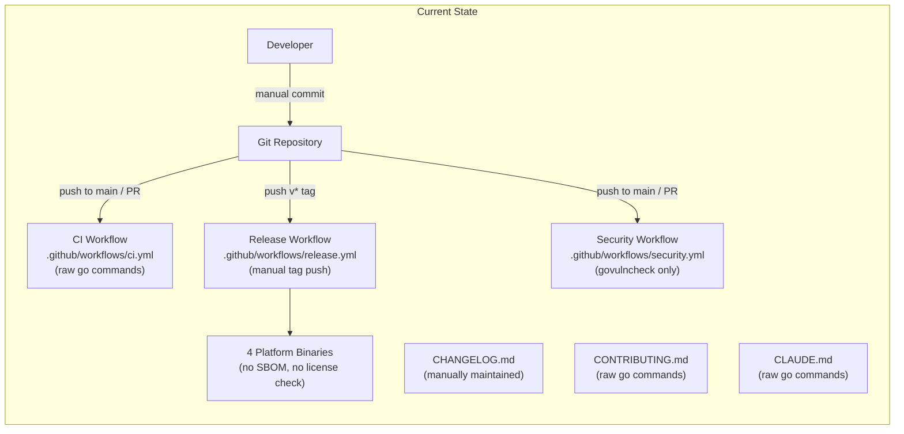
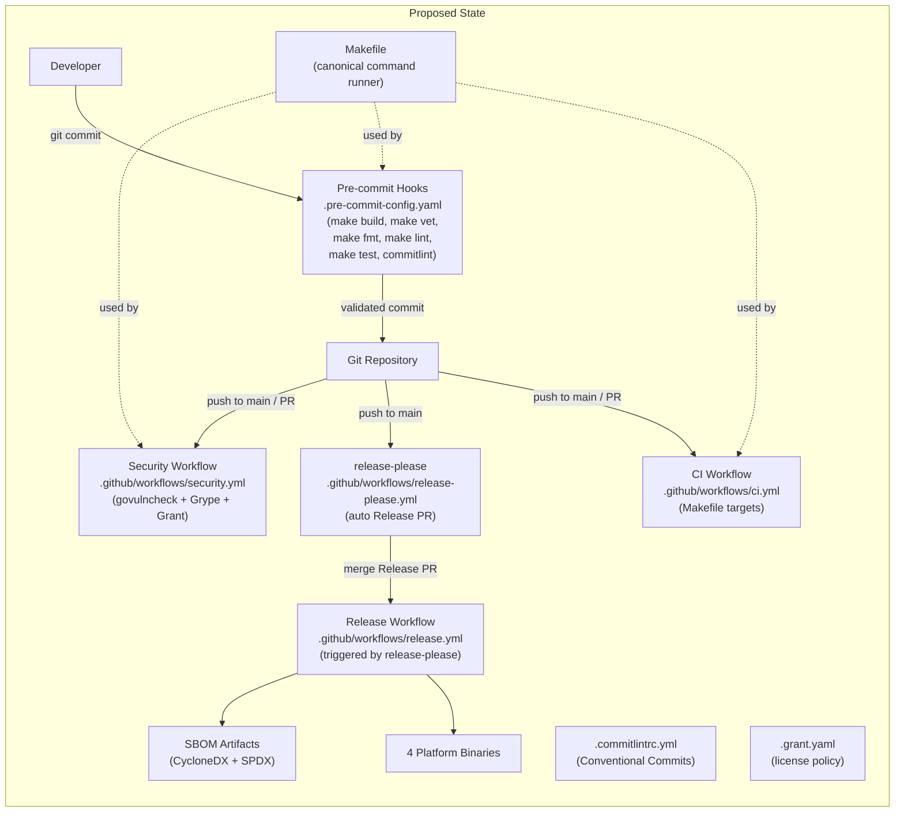
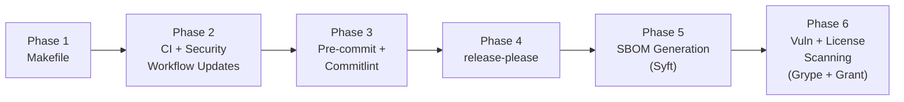

# Release Tooling and Quality Automation

## Change Summary

Introduce release-please for automated versioning and changelog generation, a pre-commit framework with commitlint for local quality enforcement, a Makefile as the canonical command runner for all build and quality targets, SBOM generation via Anchore Syft, and vulnerability/license scanning via Anchore Grype and Grant. These six components replace the manual tag-push release workflow, eliminate drift between local development and CI environments, and add supply chain security artifacts to every release.

## Motivation and Background

The project has grown from zero CI infrastructure (CR-0016) through open source scaffolding (CR-0027) to a point where multiple quality concerns converge:

1. **Release process is manual.** Tagging a release requires a developer to push a `v*` tag, manually update `CHANGELOG.md`, and hope the tag matches the changelog entry. Release-please automates this by creating Release PRs with version bumps and generated changelogs based on Conventional Commits merged to `main`.

2. **Conventional Commits are documented but not enforced.** Both `CLAUDE.md` and `CONTRIBUTING.md` specify the Conventional Commits format, but nothing prevents a malformed commit message from being pushed. A commitlint pre-commit hook catches violations at commit time before they reach CI.

3. **Quality commands are scattered.** The CI workflow (`.github/workflows/ci.yml`), `CONTRIBUTING.md`, and `CLAUDE.md` each independently specify `go build`, `go vet`, `golangci-lint run`, etc. If a command changes (e.g., adding `-race` to tests), it must be updated in three places. A Makefile centralizes these commands so CI, pre-commit hooks, and documentation all invoke the same targets.

4. **No software supply chain artifacts.** The release workflow produces platform binaries but no Software Bill of Materials (SBOM). Enterprise consumers and government procurement increasingly require SBOMs in CycloneDX and SPDX formats. Syft generates these from the compiled Go binary.

5. **No dependency vulnerability scanning beyond govulncheck.** The security workflow runs `govulncheck`, which checks Go's vulnerability database. Grype provides broader CVE coverage by scanning the SBOM against multiple vulnerability databases. Grant provides license compliance checking to ensure all dependencies are compatible with the project's MIT license.

CR-0016 explicitly rejected a Makefile due to project simplicity. This CR revisits that decision because the addition of pre-commit hooks, release-please, SBOM generation, and license scanning creates enough moving parts to justify centralized command definitions.

## Change Drivers

* **Manual release process is error-prone:** Version tags, changelog entries, and release notes must be synchronized manually. Release-please automates all three.
* **No commit message enforcement:** Conventional Commits are a documentation-only standard with no tooling to reject violations.
* **Command drift between CI and local development:** The same quality commands are defined in three places (CI workflow, CONTRIBUTING.md, CLAUDE.md) with no single source of truth.
* **No SBOM generation:** Enterprise and government consumers require SBOMs for compliance. The project produces none.
* **Limited vulnerability coverage:** `govulncheck` covers only Go's own vulnerability database. Grype provides broader CVE database coverage.
* **No license compliance checking:** The project is MIT-licensed but has no automated verification that all dependencies use compatible licenses.
* **CR-0016 Makefile rejection revisited:** The original rejection cited project simplicity. The project now has sufficient complexity (CI, security workflow, pre-commit hooks, release automation, SBOM generation) to justify a Makefile.

## Current State



| Component | Current State |
|---|---|
| Release workflow | `.github/workflows/release.yml` -- tag-push trigger, cross-compile 4 targets, `softprops/action-gh-release@v2` |
| CI workflow | `.github/workflows/ci.yml` -- raw `go build`, `go vet`, `gofmt`, `go mod tidy`, `golangci-lint`, `go test` |
| Security workflow | `.github/workflows/security.yml` -- `go mod verify`, `govulncheck` |
| Linter config | `.golangci.yml` -- v2 format, govet, errcheck, staticcheck, unused, ineffassign, gocritic, gofmt, goimports |
| Changelog | `CHANGELOG.md` -- Keep a Changelog format, manually maintained |
| Commit enforcement | None -- Conventional Commits documented in CLAUDE.md and CONTRIBUTING.md but not enforced |
| Pre-commit hooks | None |
| Makefile | None -- CR-0016 explicitly rejected |
| SBOM generation | None |
| Vulnerability scanning | `govulncheck` only (Go vulnerability database) |
| License scanning | None |
| Go module | `github.com/desek/outlook-local-mcp`, Go 1.24.0 |

## Proposed Change

Introduce six interconnected components that automate the release process, enforce quality at commit time, centralize build commands, and add supply chain security:



### Component Inventory

| # | Component | File(s) | Purpose |
|---|---|---|---|
| 1 | release-please | `.github/workflows/release-please.yml`, `release-please-config.json`, `.release-please-manifest.json` | Automated Release PRs with version bumps and changelog |
| 2 | Conventional commit enforcement | `.commitlintrc.yml` | Validate commit messages against Conventional Commits spec |
| 3 | Pre-commit framework | `.pre-commit-config.yaml` | Run quality checks at commit time |
| 4 | Makefile | `Makefile` | Canonical command runner for all build/quality targets |
| 5 | SBOM generation (Syft) | Integrated into release workflow and Makefile | CycloneDX + SPDX SBOMs from compiled binary |
| 6 | Vulnerability and license scanning (Grype + Grant) | `.grant.yaml`, integrated into security workflow and Makefile | CVE scanning + license compliance |

## Requirements

### Functional Requirements

#### release-please

1. A `.github/workflows/release-please.yml` workflow **MUST** exist that runs `googleapis/release-please-action@v4` on every push to `main`.
2. The release-please configuration **MUST** use `release-type: go` for Go module versioning.
3. A `release-please-config.json` file **MUST** exist at the repository root with the release-please configuration.
4. A `.release-please-manifest.json` file **MUST** exist at the repository root to track the current version, bootstrapped with `"."` set to `"0.0.0"` (pre-first-release).
5. The release-please workflow **MUST** output `release_created` and `tag_name` values usable by downstream jobs.
6. The existing `.github/workflows/release.yml` **MUST** be modified to trigger on `release: types: [published]` events (created by release-please) instead of `push: tags: ['v*']`.
7. The release workflow **MUST** continue to cross-compile binaries for `linux/amd64`, `darwin/amd64`, `darwin/arm64`, and `windows/amd64` and attach them to the GitHub Release created by release-please.
8. The existing manually maintained `CHANGELOG.md` content **MUST** be preserved. Release-please **MUST** prepend new entries above the existing content.
9. The `release-please-config.json` **MUST** include a top-level `bootstrap-sha` field set to the commit SHA of the merge commit that introduces release-please, so that only subsequent commits generate changelog entries.

#### Conventional Commit Enforcement

10. A `.commitlintrc.yml` file **MUST** exist at the repository root configuring commitlint to enforce the Conventional Commits specification.
11. The commitlint configuration **MUST** extend `@commitlint/config-conventional`.
12. The commitlint hook **MUST** reject commit messages that do not conform to the Conventional Commits format (`type[(scope)]: description`, where scope is optional).

#### Pre-commit Framework

13. A `.pre-commit-config.yaml` file **MUST** exist at the repository root defining pre-commit hooks.
14. The pre-commit configuration **MUST** include hooks that invoke the following Makefile targets: `make build`, `make vet`, `make fmt-check`, `make lint`, `make test`.
15. The pre-commit configuration **MUST** include a `commit-msg` hook that runs commitlint to validate commit messages.
16. `CONTRIBUTING.md` **MUST** be updated to document pre-commit hook installation (`pre-commit install --hook-type pre-commit --hook-type commit-msg`).

#### Makefile

17. A `Makefile` **MUST** exist at the repository root defining canonical targets for all quality and build commands.
18. The Makefile **MUST** define at minimum the following targets: `build`, `test`, `lint`, `fmt`, `fmt-check`, `vet`, `tidy`, `ci` (runs all quality checks), `sbom`, `vuln-scan`, `license-check`.
19. The `.github/workflows/ci.yml` **MUST** be updated to invoke Makefile targets instead of raw `go` / `golangci-lint` commands.
20. The `.github/workflows/security.yml` **MUST** be updated to invoke Makefile targets for vulnerability and license scanning.
21. `CONTRIBUTING.md` **MUST** be updated to reference Makefile targets instead of raw `go` commands.
22. `CLAUDE.md` quality standards verification commands **MUST** be updated to reference Makefile targets.

#### SBOM Generation (Syft)

23. The release workflow **MUST** generate SBOMs using Anchore Syft by scanning the compiled Go binary (not `go.mod`).
24. The release workflow **MUST** produce SBOMs in both CycloneDX JSON and SPDX JSON formats.
25. Both SBOM files **MUST** be attached as release assets alongside the platform binaries, named `outlook-local-mcp-<version>.cdx.json` (CycloneDX) and `outlook-local-mcp-<version>.spdx.json` (SPDX).
26. The Makefile **MUST** include a `sbom` target that generates SBOMs locally for developer use.

#### Vulnerability and License Scanning (Grype + Grant)

27. The `.github/workflows/security.yml` **MUST** be updated to run Anchore Grype after generating a CycloneDX SBOM.
28. Grype **MUST** consume the CycloneDX SBOM produced by Syft (using `sbom:` input prefix) and **MUST** fail the pipeline on `high` or `critical` severity findings (using `--fail-on high`).
29. The `.github/workflows/security.yml` **MUST** be updated to run Anchore Grant for license compliance checking.
30. Grant **MUST** consume the CycloneDX SBOM and evaluate it against the policy defined in `.grant.yaml`.
31. A `.grant.yaml` file **MUST** exist at the repository root defining the allowed license policy for the project.
32. The `.grant.yaml` **MUST** allow licenses compatible with MIT: `MIT*`, `Apache*`, `BSD*`, `ISC`, `CC0*`, `Unlicense`, `MPL*`, `WTFPL`, `0BSD`, `BlueOak-1.0.0`.
33. The `.grant.yaml` **MUST** set `require-license: true` to deny packages with no detected license.
34. Grant **MUST** fail the pipeline if a copyleft (e.g., GPL, AGPL, LGPL, EUPL, SSPL) or unknown license is detected.
35. The Makefile **MUST** include `vuln-scan` and `license-check` targets for local developer use.

### Non-Functional Requirements

1. The release-please workflow **MUST** use `permissions: contents: write, pull-requests: write` to create Release PRs.
2. The pre-commit hooks **MUST NOT** take longer than 60 seconds on the current codebase when run via `pre-commit run --all-files` on a machine meeting the prerequisites documented in CONTRIBUTING.md.
3. The Makefile **MUST** use `.PHONY` declarations for all targets to prevent conflicts with file names.
4. All new workflow files **MUST** use pinned action versions at major version tags (e.g., `@v4`).
5. The SBOM generation **MUST** scan the compiled binary, not source files, to capture the full dependency tree embedded by the Go linker.
6. Grype and Grant **MUST** be installable without root privileges in CI environments.
7. The pre-commit framework **MUST NOT** require any language runtimes beyond Go and Node.js (for commitlint).

## Affected Components

| File | Action | Description |
|---|---|---|
| `Makefile` | **New** | Canonical command runner |
| `.pre-commit-config.yaml` | **New** | Pre-commit hook definitions |
| `.commitlintrc.yml` | **New** | Commitlint configuration |
| `.github/workflows/release-please.yml` | **New** | Release-please automation |
| `release-please-config.json` | **New** | Release-please configuration |
| `.release-please-manifest.json` | **New** | Release-please version tracker |
| `.grant.yaml` | **New** | License compliance policy |
| `.github/workflows/ci.yml` | **Modified** | Switch to Makefile targets |
| `.github/workflows/release.yml` | **Modified** | Trigger on release event, add SBOM |
| `.github/workflows/security.yml` | **Modified** | Add Grype + Grant |
| `CONTRIBUTING.md` | **Modified** | Document pre-commit, Makefile targets |
| `CLAUDE.md` | **Modified** | Reference Makefile targets |
| `.gitignore` | **Modified** | Add SBOM and tool output patterns |

## Scope Boundaries

### In Scope

* release-please GitHub Action workflow and configuration files
* Conventional commit enforcement via commitlint pre-commit hook
* Pre-commit framework configuration with quality check hooks
* Makefile with canonical build, test, lint, SBOM, and scanning targets
* Modifying CI, release, and security workflows to use Makefile targets
* SBOM generation (CycloneDX + SPDX) via Syft in the release workflow
* Vulnerability scanning via Grype in the security workflow
* License compliance checking via Grant in the security workflow
* Updating CONTRIBUTING.md and CLAUDE.md to reference Makefile targets
* Updating .gitignore for new artifacts

### Out of Scope ("Here, But Not Further")

* GoReleaser adoption -- the existing cross-compilation approach is sufficient
* Container image SBOM generation -- the project is a CLI binary, not a container
* SBOM signing or attestation (e.g., Sigstore cosign) -- deferred to a future CR
* Renovate or Dependabot for dependency updates -- separate concern
* CodeQL or other SAST tools -- separate concern
* Coverage threshold enforcement -- coverage is uploaded as an artifact but no minimum is enforced (per CR-0016)
* GitHub branch protection rule changes -- manual admin action
* Pre-push hooks -- only pre-commit and commit-msg hooks are in scope
* Windows or macOS CI runners -- CI runs on ubuntu-latest only
* Commitlint CI check (GitHub Action) -- commit messages are validated locally via pre-commit; CI-level commitlint is out of scope
* Release notes customization beyond release-please defaults -- the default Conventional Commits-based format is sufficient

## Alternative Approaches Considered

### GoReleaser instead of Makefile + Syft

GoReleaser bundles cross-compilation, SBOM generation, and release creation into a single tool. Rejected because it introduces a large third-party dependency with its own configuration DSL, and the project already has a working cross-compilation setup. A Makefile + Syft provides the same capabilities with simpler, more transparent configuration.

### Husky instead of pre-commit framework

Husky is a popular Git hook manager in the JavaScript ecosystem. Rejected because it requires a `package.json` and Node.js project structure. The `pre-commit` framework supports polyglot repositories and has first-class support for running arbitrary local commands (which is how the Makefile targets are invoked).

### GitHub Actions commitlint check instead of pre-commit hook

Running commitlint as a CI check on PR titles. Rejected as the sole enforcement mechanism because it provides feedback only after pushing, not at commit time. The pre-commit hook catches violations immediately, shortening the feedback loop. A CI check could be added later as a complement but is out of scope for this CR.

### Trivy instead of Grype for vulnerability scanning

Trivy is an alternative vulnerability scanner that also supports SBOM consumption. Rejected because the project already uses the Anchore ecosystem for SBOM generation (Syft), and Grype integrates seamlessly with Syft-produced SBOMs. Using Grype + Syft + Grant maintains a consistent Anchore toolchain.

## Impact Assessment

### User Impact

No direct impact on MCP server functionality. Users who consume releases gain:
- Automated, consistent changelog entries in every GitHub Release
- CycloneDX and SPDX SBOMs for every release, enabling enterprise compliance workflows
- Assurance that all dependencies are vulnerability-scanned and license-compatible

### Technical Impact

- **CI workflow changes:** Steps switch from raw commands to Makefile targets. The pipeline stages remain identical; only the invocation changes.
- **Release workflow changes:** Trigger changes from tag-push to release-please event. Cross-compilation and binary attachment are preserved. SBOM generation is added.
- **Security workflow changes:** Grype and Grant are added alongside existing `govulncheck`. The existing `go mod verify` and `govulncheck` steps are preserved.
- **Developer workflow changes:** Contributors must install `pre-commit` and run `pre-commit install`. Quality checks run automatically at commit time. The Makefile provides a single entry point for all commands.
- **No Go source code changes.** This CR modifies only configuration, workflow, and documentation files.

### Business Impact

- Automated releases reduce release engineering overhead from manual tagging and changelog maintenance.
- SBOMs enable enterprise adoption by satisfying supply chain security requirements (e.g., US Executive Order 14028, EU Cyber Resilience Act).
- License scanning prevents accidental introduction of copyleft-licensed dependencies that would be incompatible with the MIT license.

## Implementation Approach

Implementation is divided into six sequential phases. Phases MUST be implemented in order because later phases depend on artifacts from earlier phases (e.g., the pre-commit hooks depend on the Makefile). Each phase produces a commit-ready set of changes, though full validation of the security workflow (Phase 2) requires the `.grant.yaml` file from Phase 6; the security workflow steps for Grype and Grant MUST NOT be expected to pass until Phase 6 is complete.



### Phase 1: Makefile

Create `Makefile` at the repository root with canonical targets for all build and quality commands.

**File: `Makefile`**

```makefile
.PHONY: build test lint fmt fmt-check vet tidy ci sbom vuln-scan license-check clean

BINARY_NAME := outlook-local-mcp
BUILD_DIR := .
CMD_PATH := ./cmd/outlook-local-mcp/

build:
	go build -o $(BUILD_DIR)/$(BINARY_NAME) $(CMD_PATH)

test:
	go test -race -coverprofile=coverage.out ./...

lint:
	golangci-lint run

fmt:
	gofmt -w .
	goimports -w .

fmt-check:
	@test -z "$$(gofmt -l .)" || (echo "Unformatted files:" && gofmt -l . && exit 1)

vet:
	go vet ./...

tidy:
	go mod tidy
	@git diff --exit-code go.mod go.sum || (echo "go.mod or go.sum not tidy" && exit 1)

ci: build vet fmt-check tidy lint test

sbom: build
	syft scan $(BUILD_DIR)/$(BINARY_NAME) -o cyclonedx-json=$(BINARY_NAME).cdx.json -o spdx-json=$(BINARY_NAME).spdx.json

vuln-scan: sbom
	grype sbom:$(BINARY_NAME).cdx.json --fail-on high

license-check: sbom
	grant check $(BINARY_NAME).cdx.json

clean:
	rm -f $(BUILD_DIR)/$(BINARY_NAME) coverage.out $(BINARY_NAME).cdx.json $(BINARY_NAME).spdx.json
```

**Verification:** Run `make ci` locally and confirm all targets pass.

### Phase 2: CI and Security Workflow Updates

Update `.github/workflows/ci.yml` and `.github/workflows/security.yml` to invoke Makefile targets. Update `CONTRIBUTING.md` and `CLAUDE.md` to reference Makefile targets.

**Step 2.1: Update `.github/workflows/ci.yml`**

Replace the individual `go build`, `go vet`, `gofmt`, `go mod tidy`, and `go test` steps with Makefile targets. The `golangci-lint-action` step is replaced by `make lint` (which invokes `golangci-lint run` directly). The `actions/setup-go` step remains for Go installation and caching. Add a step to install `golangci-lint`.

Updated workflow structure:

```yaml
name: CI
on:
  push:
    branches: [main]
  pull_request:
    branches: [main]

jobs:
  ci:
    runs-on: ubuntu-latest
    strategy:
      matrix:
        go-version: ['1.24.x']
      fail-fast: true
    steps:
      - uses: actions/checkout@v4
      - uses: actions/setup-go@v5
        with:
          go-version: ${{ matrix.go-version }}
          cache: true
      - name: Install golangci-lint
        uses: golangci/golangci-lint-action@v6
        with:
          install-only: true
      - name: Run CI checks
        run: make ci
      - name: Upload coverage
        uses: actions/upload-artifact@v4
        with:
          name: coverage
          path: coverage.out
```

**Step 2.2: Update `.github/workflows/security.yml`**

Add Syft, Grype, and Grant installation steps. Add `make vuln-scan` and `make license-check` targets. Preserve existing `go mod verify` and `govulncheck` steps.

Updated workflow structure:

```yaml
name: Security

on:
  push:
    branches: [main]
  pull_request:
    branches: [main]

jobs:
  security:
    runs-on: ubuntu-latest
    steps:
      - uses: actions/checkout@v4
      - uses: actions/setup-go@v5
        with:
          go-version: '1.24.x'
          cache: true
      - name: Verify modules
        run: go mod verify
      - name: Install govulncheck
        run: go install golang.org/x/vuln/cmd/govulncheck@latest
      - name: Run govulncheck
        run: govulncheck ./...
      - name: Install Syft
        uses: anchore/sbom-action/download-syft@v0
      - name: Install Grype
        uses: anchore/scan-action/download-grype@v4
      - name: Install Grant
        run: curl -sSfL https://get.anchore.io/grant | sh -s -- -b /usr/local/bin
      - name: Vulnerability scan
        run: make vuln-scan
      - name: License check
        run: make license-check
```

**Step 2.3: Update `CONTRIBUTING.md`**

Replace the Development Setup section to reference Makefile targets:

```markdown
### Build

```bash
make build
```

### Test

```bash
make test
```

### Lint

```bash
make lint
```

### Full Quality Check

```bash
make ci
```

### SBOM Generation

```bash
make sbom
```

### Vulnerability Scan

```bash
make vuln-scan
```

### License Check

```bash
make license-check
```
```

Also add a "Pre-commit Hooks" section (see Phase 3).

**Step 2.4: Update `CLAUDE.md`**

Update the "Quality Standards" verification commands section to reference Makefile targets:

```bash
make ci
```

**Verification:** Push a branch and confirm the CI workflow uses Makefile targets and passes.

### Phase 3: Pre-commit Framework and Commitlint

Install the pre-commit framework and commitlint configuration.

**Step 3.1: Create `.commitlintrc.yml`**

```yaml
extends:
  - "@commitlint/config-conventional"
```

**Step 3.2: Create `.pre-commit-config.yaml`**

```yaml
repos:
  - repo: local
    hooks:
      - id: make-build
        name: go build
        entry: make build
        language: system
        pass_filenames: false
        types: [go]
      - id: make-vet
        name: go vet
        entry: make vet
        language: system
        pass_filenames: false
        types: [go]
      - id: make-fmt-check
        name: gofmt check
        entry: make fmt-check
        language: system
        pass_filenames: false
        types: [go]
      - id: make-lint
        name: golangci-lint
        entry: make lint
        language: system
        pass_filenames: false
        types: [go]
      - id: make-test
        name: go test
        entry: make test
        language: system
        pass_filenames: false
        types: [go]
  - repo: https://github.com/alessandrojcm/commitlint-pre-commit-hook
    rev: v9.18.0
    hooks:
      - id: commitlint
        stages: [commit-msg]
        additional_dependencies: ["@commitlint/config-conventional"]
```

**Step 3.3: Update `CONTRIBUTING.md`**

Add the following section after "Development Setup > Prerequisites":

```markdown
### Pre-commit Hooks

This project uses [pre-commit](https://pre-commit.com/) to run quality checks before each commit.

#### Install pre-commit

```bash
# macOS
brew install pre-commit

# pip
pip install pre-commit
```

#### Enable hooks

```bash
pre-commit install --hook-type pre-commit --hook-type commit-msg
```

#### Run hooks manually

```bash
pre-commit run --all-files
```
```

**Step 3.4: Update `.gitignore`**

Add entries for SBOM and tool output:

```
# SBOM outputs
*.cdx.json
*.spdx.json

# Node modules (commitlint)
node_modules/
```

**Verification:** Run `pre-commit install --hook-type pre-commit --hook-type commit-msg` and make a test commit. Verify all hooks run and commitlint validates the commit message.

### Phase 4: release-please

Configure release-please to automate versioning and changelog generation.

**Step 4.1: Create `release-please-config.json`**

```json
{
  "$schema": "https://raw.githubusercontent.com/googleapis/release-please/main/schemas/config.json",
  "packages": {
    ".": {
      "release-type": "go",
      "changelog-path": "CHANGELOG.md",
      "bump-minor-pre-major": true,
      "bump-patch-for-minor-pre-major": true
    }
  }
}
```

Note: After the commit that introduces release-please is merged, add `"bootstrap-sha": "<merge-commit-sha>"` as a top-level field in `release-please-config.json` (not inside the `"."` package configuration) so that only subsequent commits generate changelog entries. This value is determined at merge time and cannot be set in advance.

**Step 4.2: Create `.release-please-manifest.json`**

```json
{
  ".": "0.0.0"
}
```

**Step 4.3: Create `.github/workflows/release-please.yml`**

```yaml
name: Release Please

on:
  push:
    branches: [main]

permissions:
  contents: write
  pull-requests: write

jobs:
  release-please:
    runs-on: ubuntu-latest
    steps:
      - uses: googleapis/release-please-action@v4
        id: release
        with:
          config-file: release-please-config.json
          manifest-file: .release-please-manifest.json
```

**Step 4.4: Update `.github/workflows/release.yml`**

Change the trigger from `push: tags: ['v*']` to `release: types: [published]` so it fires when release-please creates a GitHub Release. The build steps remain unchanged. Add the release tag to binary names.

Updated trigger:

```yaml
name: Release
on:
  release:
    types: [published]

permissions:
  contents: write
```

The `go build` steps and `softprops/action-gh-release@v2` step remain unchanged. The tag is available via `${{ github.event.release.tag_name }}`.

**Step 4.5: Preserve existing CHANGELOG.md**

No changes to the existing `CHANGELOG.md` content. Release-please will prepend new entries above the existing `## [Unreleased]` section when it creates its first Release PR.

**Verification:** Push to `main` and verify that release-please creates a Release PR with a version bump and changelog entry.

### Phase 5: SBOM Generation (Syft)

Integrate Syft into the release workflow to generate SBOMs from the compiled binary.

**Step 5.1: Update `.github/workflows/release.yml`**

After the binary build steps and before the release asset upload step, add Syft installation and SBOM generation:

```yaml
      - name: Install Syft
        uses: anchore/sbom-action/download-syft@v0
      - name: Generate SBOMs
        run: |
          syft scan outlook-local-mcp-linux-amd64 \
            -o cyclonedx-json=outlook-local-mcp-${{ github.event.release.tag_name }}.cdx.json \
            -o spdx-json=outlook-local-mcp-${{ github.event.release.tag_name }}.spdx.json
```

Update the `softprops/action-gh-release@v2` step to include the SBOM files in the release assets:

```yaml
      - name: Upload Release Assets
        uses: softprops/action-gh-release@v2
        with:
          files: |
            outlook-local-mcp-linux-amd64
            outlook-local-mcp-darwin-amd64
            outlook-local-mcp-darwin-arm64
            outlook-local-mcp-windows-amd64.exe
            outlook-local-mcp-${{ github.event.release.tag_name }}.cdx.json
            outlook-local-mcp-${{ github.event.release.tag_name }}.spdx.json
```

Note: The SBOM is generated from the `linux/amd64` binary. Since Go embeds dependency information at link time, the SBOM is identical regardless of which platform binary is scanned.

**Verification:** Trigger a test release and verify that both SBOM files are attached as release assets.

### Phase 6: Vulnerability and License Scanning (Grype + Grant)

Integrate Grype and Grant into the security workflow and Makefile.

**Step 6.1: Create `.grant.yaml`**

```yaml
require-license: true
require-known-license: false

allow:
  - MIT*
  - Apache*
  - BSD*
  - ISC
  - CC0*
  - Unlicense
  - MPL*
  - WTFPL
  - 0BSD
  - BlueOak-1.0.0

ignore-packages: []
```

**Step 6.2: Security workflow integration**

The security workflow updates are defined in Phase 2 (Step 2.2). The Grype and Grant steps consume the CycloneDX SBOM generated by the `make vuln-scan` and `make license-check` targets, which in turn depend on `make sbom`.

**Step 6.3: Verify scanning locally**

Run the following commands locally to verify scanning:

```bash
# Generate SBOM and scan for vulnerabilities
make vuln-scan

# Generate SBOM and check license compliance
make license-check
```

If Grype reports false positives or Grant flags a legitimate dependency, add `ignore-packages` entries to `.grant.yaml` or Grype ignore rules as needed. Document any suppressions with justification comments.

**Verification:** Run `make vuln-scan` and `make license-check` locally. Confirm Grype passes with no high/critical findings and Grant reports compliance.

## Test Strategy

### Tests to Add

This CR introduces no Go source code changes, so no Go unit tests are added. Validation is performed through integration verification:

| Verification | Method | Expected Result |
|---|---|---|
| Makefile targets | Run `make ci` locally | All targets pass (build, vet, fmt-check, tidy, lint, test) |
| Pre-commit hooks | Run `pre-commit run --all-files` | All hooks pass |
| Commitlint rejection | Attempt a commit with message "bad message" | Commit is rejected by commitlint |
| Commitlint acceptance | Attempt a commit with message "feat: test" | Commit is accepted |
| CI workflow with Makefile | Push branch, observe GitHub Actions | CI workflow passes using Makefile targets |
| release-please | Merge a PR to main | Release-please creates a Release PR |
| SBOM generation | Run `make sbom` locally | CycloneDX and SPDX JSON files are generated |
| Grype scan | Run `make vuln-scan` locally | Grype exits 0 (no high/critical vulnerabilities) |
| Grant check | Run `make license-check` locally | Grant exits 0 (all licenses allowed) |
| Release workflow | Merge a Release PR | Binaries + SBOMs attached to GitHub Release |
| CONTRIBUTING.md content | Inspect CONTRIBUTING.md | Documents pre-commit installation, hook enablement, and Makefile targets |
| CLAUDE.md content | Inspect CLAUDE.md Quality Standards section | Verification commands reference `make ci` instead of raw go commands |
| .grant.yaml content | Inspect `.grant.yaml` | Contains `require-license: true`, allows MIT-compatible licenses, does not allow GPL/AGPL/LGPL/EUPL/SSPL |
| Security workflow preserves govulncheck | Inspect `.github/workflows/security.yml` | Contains `go mod verify` and `govulncheck` steps before Grype and Grant steps |

### Tests to Modify

Not applicable. No existing tests require modification.

### Tests to Remove

Not applicable. No existing tests become redundant.

## Acceptance Criteria

### AC-1: Makefile exists with all required targets

```gherkin
Given the Makefile exists at the repository root
When a developer runs "make ci"
Then the following targets execute in order: build, vet, fmt-check, tidy, lint, test
  And all targets complete with exit code 0 on the current codebase
```

### AC-2: CI workflow uses Makefile targets

```gherkin
Given the .github/workflows/ci.yml has been updated
When the CI workflow runs on a pull request
Then it invokes "make ci" instead of individual go commands
  And the pipeline passes with the same quality gates as before
```

### AC-3: Pre-commit hooks run quality checks

```gherkin
Given a developer has installed pre-commit hooks
When the developer makes a commit that modifies Go files
Then the pre-commit hooks execute make build, make vet, make fmt-check, make lint, and make test
  And the commit proceeds only if all hooks pass
```

### AC-4: Commitlint rejects non-conventional commits

```gherkin
Given a developer has installed the commit-msg hook
When the developer attempts a commit with message "fixed stuff"
Then commitlint rejects the commit with an error describing the expected format
```

### AC-5: Commitlint accepts conventional commits

```gherkin
Given a developer has installed the commit-msg hook
When the developer attempts a commit with message "fix(auth): resolve token refresh race condition"
Then commitlint accepts the commit message
  And the commit proceeds
```

### AC-6: release-please creates Release PRs

```gherkin
Given the release-please workflow is configured
When a commit with a "feat:" or "fix:" prefix is merged to main
Then release-please creates or updates a Release PR
  And the PR includes a version bump and changelog entry
```

### AC-7: Release workflow triggers on release-please events

```gherkin
Given the release workflow triggers on "release: types: [published]"
When a Release PR created by release-please is merged
Then release-please creates a GitHub Release
  And the release workflow triggers and builds platform binaries
```

### AC-8: SBOMs are generated and attached to releases

```gherkin
Given the release workflow includes Syft SBOM generation
When a release is published
Then a CycloneDX JSON file and an SPDX JSON file are generated from the compiled binary
  And both files are attached as release assets alongside the platform binaries
```

### AC-9: Grype scans for vulnerabilities in CI

```gherkin
Given the security workflow includes Grype scanning
When the security workflow runs
Then Grype scans the CycloneDX SBOM for known vulnerabilities
  And the pipeline fails if any high or critical severity vulnerabilities are found
```

### AC-10: Grant checks license compliance in CI

```gherkin
Given the security workflow includes Grant checking
  And the .grant.yaml defines the allowed license policy
When the security workflow runs
Then Grant evaluates all dependency licenses against the policy
  And the pipeline fails if a copyleft or unknown license is detected
```

### AC-11: CONTRIBUTING.md documents pre-commit and Makefile

```gherkin
Given the CONTRIBUTING.md has been updated
When a contributor reads the Development Setup section
Then it documents pre-commit installation and hook enablement
  And it references Makefile targets for build, test, lint, and quality checks
```

### AC-12: CLAUDE.md references Makefile targets

```gherkin
Given the CLAUDE.md has been updated
When an agent reads the Quality Standards section
Then the verification commands reference Makefile targets
  And the example command is "make ci" instead of raw go commands
```

### AC-13: Existing changelog content is preserved

```gherkin
Given the CHANGELOG.md contains existing manually maintained entries
When release-please generates its first changelog entry
Then the existing entries remain intact below the new release-please entry
```

### AC-14: SBOM scans compiled binary, not source

```gherkin
Given the release workflow runs Syft
When Syft generates the SBOM
Then it scans the compiled Go binary (not go.mod or source files)
  And the SBOM captures the full dependency tree embedded by the Go linker
```

### AC-15: .grant.yaml allows MIT-compatible licenses only

```gherkin
Given the .grant.yaml file exists
When a reviewer inspects its content
Then it allows MIT, Apache, BSD, ISC, CC0, Unlicense, MPL, WTFPL, 0BSD, and BlueOak-1.0.0 licenses
  And it sets require-license to true
  And it does not allow GPL, AGPL, LGPL, EUPL, or SSPL licenses
```

### AC-16: Security workflow preserves existing govulncheck

```gherkin
Given the security workflow has been updated with Grype and Grant
When the security workflow runs
Then it continues to run "go mod verify" and "govulncheck" as before
  And the new Grype and Grant steps run after the existing steps
```

## Quality Standards Compliance

### Build & Compilation

- [x] Code compiles/builds without errors (`make build`)
- [x] No new compiler warnings introduced
- [x] All workflow YAML files are valid

### Linting & Code Style

- [x] All linter checks pass (`make lint`)
- [x] Makefile follows GNU Make conventions
- [x] Workflow files follow GitHub Actions YAML conventions

### Test Execution

- [x] All existing tests pass (`make test`)
- [x] Pre-commit hooks pass on current codebase (`pre-commit run --all-files`)

### Documentation

- [x] CONTRIBUTING.md updated with pre-commit and Makefile instructions
- [x] CLAUDE.md updated with Makefile target references

### Code Review

- [ ] Changes submitted via pull request
- [ ] PR title follows Conventional Commits format
- [ ] Code review completed and approved
- [ ] Changes squash-merged to maintain linear history

### Verification Commands

```bash
# Full quality check via Makefile
make ci

# Pre-commit hooks
pre-commit run --all-files

# SBOM generation
make sbom

# Vulnerability scan
make vuln-scan

# License check
make license-check

# Verify all new files exist
test -f Makefile && \
test -f .pre-commit-config.yaml && \
test -f .commitlintrc.yml && \
test -f .github/workflows/release-please.yml && \
test -f release-please-config.json && \
test -f .release-please-manifest.json && \
test -f .grant.yaml && \
echo "All files present"

# Verify CI workflow references Makefile
grep -q "make ci" .github/workflows/ci.yml && echo "CI uses Makefile"

# Verify security workflow includes Grype and Grant
grep -q "vuln-scan" .github/workflows/security.yml && \
grep -q "license-check" .github/workflows/security.yml && \
echo "Security workflow updated"

# Verify release workflow triggers on release event
grep -q "types: \[published\]" .github/workflows/release.yml && echo "Release trigger updated"
```

## Risks and Mitigation

### Risk 1: Grype reports false positive vulnerabilities

**Likelihood:** Medium
**Impact:** Medium -- blocks CI pipeline
**Mitigation:** Grype supports ignore rules in a `.grype.yaml` configuration file. If a false positive is identified, add an ignore rule with a justification comment. Review false positives periodically to remove stale suppressions.

### Risk 2: Grant flags a legitimate dependency license as unknown

**Likelihood:** Medium
**Impact:** Medium -- blocks CI pipeline
**Mitigation:** The `.grant.yaml` `ignore-packages` field allows exempting specific packages. If a dependency's license is legitimate but not detected by Grant, add it to `ignore-packages` with a comment explaining why.

### Risk 3: Pre-commit hooks slow down developer workflow

**Likelihood:** Low
**Impact:** Low
**Mitigation:** The current codebase compiles and tests in under 5 seconds. Pre-commit hooks run the same commands. If hooks become slow as the project grows, individual hooks can be disabled locally with `SKIP=make-test git commit` while CI continues to enforce all checks.

### Risk 4: release-please generates incorrect version bumps

**Likelihood:** Low
**Impact:** Medium
**Mitigation:** Release-please creates a PR for review before any version is published. The maintainer reviews the version bump and changelog before merging. The `bump-minor-pre-major` and `bump-patch-for-minor-pre-major` settings ensure pre-1.0.0 versions bump patch for `fix:` and minor for `feat:` commits, not major.

### Risk 5: Existing CHANGELOG.md content is overwritten by release-please

**Likelihood:** Low
**Impact:** High -- loss of project history
**Mitigation:** Release-please prepends new entries; it does not overwrite existing content. The `bootstrap-sha` configuration ensures only commits after the merge point generate entries. The existing `## [Unreleased]` section and its content will be preserved below new release entries.

### Risk 6: GITHUB_TOKEN limitations prevent release-please from triggering workflows

**Likelihood:** Medium
**Impact:** Medium -- release workflow does not trigger
**Mitigation:** When release-please creates a release using `GITHUB_TOKEN`, the `release.published` event may not trigger other workflows (GitHub limitation). If this occurs, configure a Personal Access Token (PAT) as a repository secret and use it in the release-please workflow. This is a known limitation documented by GitHub.

### Risk 7: commitlint pre-commit hook requires Node.js

**Likelihood:** Low
**Impact:** Low
**Mitigation:** Node.js is a common developer prerequisite. The `pre-commit` framework handles Node.js dependency installation automatically via the `additional_dependencies` field. Document the Node.js requirement in CONTRIBUTING.md prerequisites.

## Dependencies

* **CR-0016 (CI/CD Pipeline):** The CI and security workflows being modified were established by CR-0016. This CR modifies them in place.
* **CR-0027 (Open Source Scaffolding):** The CONTRIBUTING.md and CHANGELOG.md being modified were established by CR-0027.
* **pre-commit framework:** Must be installed by developers (`brew install pre-commit` or `pip install pre-commit`).
* **Node.js:** Required by commitlint (installed automatically by pre-commit framework).
* **Syft, Grype, Grant:** Installed in CI via official installation actions/scripts. Developers may optionally install them locally for `make sbom`, `make vuln-scan`, and `make license-check`.
* **golangci-lint:** Already a project dependency (CR-0016). Must be installed locally for `make lint`.

## Decision Outcome

Chosen approach: "Makefile as canonical command runner with release-please automation, pre-commit enforcement, and Anchore toolchain for supply chain security", because it eliminates command drift between CI and local development, automates the release lifecycle end-to-end, catches commit message and quality violations before they reach CI, and provides enterprise-grade supply chain security artifacts (SBOMs, vulnerability scans, license compliance) using a consistent Anchore toolchain. CR-0016's rejection of a Makefile is revisited and overturned due to the increased complexity introduced by pre-commit hooks, release-please, SBOM generation, and scanning tools.

## Related Items

* Prior CR: CR-0016 (CI/CD Pipeline -- established CI and release workflows, rejected Makefile)
* Prior CR: CR-0027 (Open Source Scaffolding -- established CONTRIBUTING.md, CHANGELOG.md)
* External reference: [release-please](https://github.com/googleapis/release-please)
* External reference: [release-please-action](https://github.com/googleapis/release-please-action)
* External reference: [commitlint](https://commitlint.js.org/)
* External reference: [pre-commit](https://pre-commit.com/)
* External reference: [Conventional Commits](https://www.conventionalcommits.org/)
* External reference: [Anchore Syft](https://github.com/anchore/syft)
* External reference: [Anchore Grype](https://github.com/anchore/grype)
* External reference: [Anchore Grant](https://github.com/anchore/grant)
* External reference: [US Executive Order 14028 (SBOM requirements)](https://www.nist.gov/itl/executive-order-14028-improving-nations-cybersecurity)

<!--
## CR Review Summary (2026-03-15)

### Findings: 5 | Fixes Applied: 5 | Unresolvable: 0

1. **Contradiction: `bootstrap-sha` field placement** (FR-9, line 128; Phase 4, line 603)
   - FR-9 and Phase 4 implementation note described `bootstrap-sha` as a package-level field
     inside the `"."` configuration. DeepWiki confirms it is a top-level field in
     `release-please-config.json`.
   - Fix: Updated FR-9 to specify "top-level `bootstrap-sha` field". Updated Phase 4 note to
     state the field goes at the top level, not inside the package configuration.

2. **Ambiguity: FR-12 implied scope is required** (line 134)
   - FR-12 stated commit messages must conform to `type(scope): description`, implying scope
     is mandatory. The Conventional Commits spec defines scope as optional.
   - Fix: Changed to `type[(scope)]: description, where scope is optional`.

3. **Ambiguity: NFR-2 "normal conditions"** (line 174)
   - "under normal conditions" is vague and not testable.
   - Fix: Replaced with "when run via `pre-commit run --all-files` on a machine meeting the
     prerequisites documented in CONTRIBUTING.md".

4. **Missing AC-test coverage** (Test Strategy table)
   - AC-11 (CONTRIBUTING.md documents pre-commit and Makefile): No test entry.
   - AC-12 (CLAUDE.md references Makefile targets): No test entry.
   - AC-15 (.grant.yaml allows MIT-compatible licenses only): No test entry.
   - AC-16 (Security workflow preserves govulncheck): No test entry.
   - Fix: Added four test entries to the Test Strategy table covering AC-11, AC-12, AC-15,
     and AC-16 with inspection-based verification methods.

5. **Contradiction: Phase independence claim vs. cross-phase dependency** (line 271)
   - The text stated "Each phase produces a commit-ready set of changes that can be validated
     independently." However, Phase 2 adds `make license-check` to the security workflow,
     which depends on `.grant.yaml` created in Phase 6. The security workflow cannot fully
     pass between Phase 2 and Phase 6.
   - Fix: Revised the phase introduction text to note that Grype and Grant steps in the
     security workflow MUST NOT be expected to pass until Phase 6 is complete.

### Items Verified (No Issues Found)
- Release workflow trigger (`release: types: [published]`) is consistent across FR-6,
  Phase 4.4, AC-7, and verification commands.
- Makefile target names are consistent between Phase 1 definition, FR-14/FR-18, pre-commit
  hook commands (Phase 3), CI workflow references (Phase 2), and documentation references.
- SBOM file naming is consistent: Makefile uses unversioned names for local use; release
  workflow uses versioned names (`outlook-local-mcp-<tag>.cdx.json`) for release assets.
  Grype consumes the CycloneDX SBOM in both contexts.
- `.grant.yaml` file name is consistent throughout (not `.grant.yml`).
- `.commitlintrc.yml` file name is consistent throughout.
- Affected Components list matches all files referenced in the Implementation Approach phases.
- Mermaid diagrams accurately represent the described component interactions and data flow.
- All 35 Functional Requirements have at least one corresponding AC.
- All 7 Non-Functional Requirements are testable after fixes.
- Phase ordering (P1->P2->P3->P4->P5->P6) correctly reflects dependencies.
- DeepWiki-verified: release-please `release-type: go` is correct; Syft CLI syntax and
  `anchore/sbom-action/download-syft` action are valid; Grype `sbom:` prefix and
  `--fail-on high` are correct; Grant uses Go `filepath.Match` glob patterns (not regex),
  so `MIT*`, `Apache*`, etc. are valid patterns.
-->
