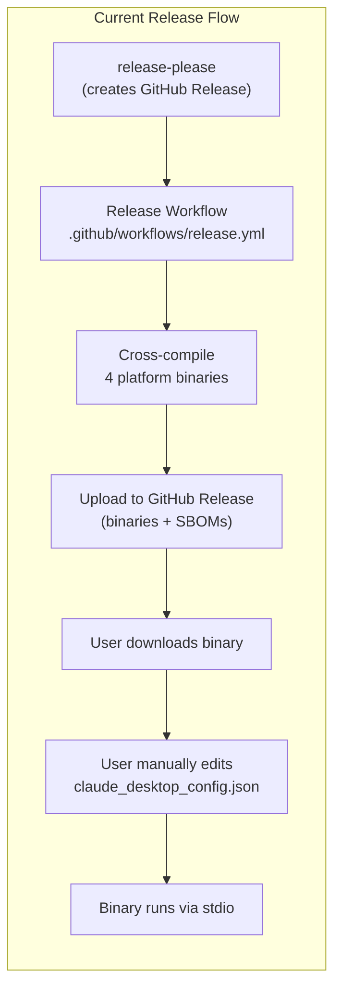
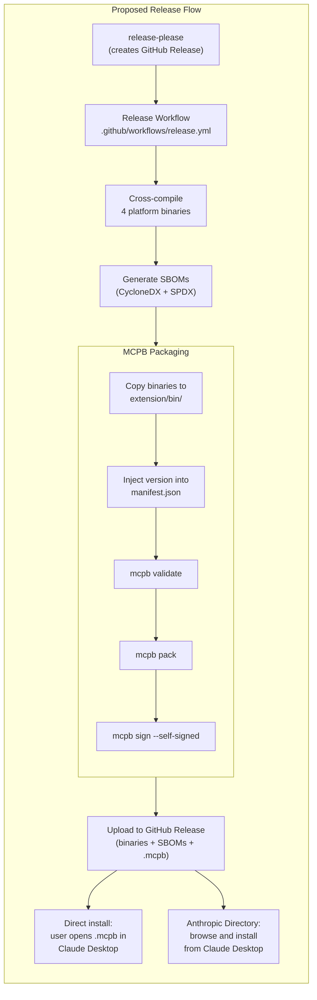
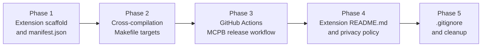

# MCPB Extension Packaging for Anthropic Directory

## Change Summary

Package the outlook-local-mcp Go binary as an MCPB extension bundle (`.mcpb`) ready for submission to the Anthropic Directory. This includes authoring a `manifest.json` declaring the binary server with per-platform binary paths, cross-compilation Makefile targets, a GitHub Actions release workflow that builds and uploads the `.mcpb` bundle, an extension `README.md` with usage examples, a privacy policy URL, and local build-and-pack automation via the Makefile.

## Motivation and Background

The project is a fully functional MCP server with 12 tools (9 calendar + 3 account management) that currently distributes platform binaries via GitHub Releases. Users must manually download the binary, make it executable, and configure `claude_desktop_config.json` with the correct path and environment variables. This manual setup is a significant adoption barrier.

MCPB (MCP Bundle) is Anthropic's packaging format for Claude Desktop extensions. An `.mcpb` bundle encapsulates the binary, manifest metadata, and user configuration schema into a single installable artifact. Users install it with one click from Claude Desktop's **Settings > Extensions** page, or discover it in the Anthropic Directory's "Browse extensions" catalog.

Packaging the project as an MCPB extension:

1. **Eliminates manual setup.** Users install a single `.mcpb` file instead of downloading a binary, editing JSON config, and setting environment variables. Claude Desktop handles binary placement and configuration prompts automatically.
2. **Enables Anthropic Directory distribution.** The project becomes discoverable in Claude Desktop's built-in extension directory, reaching users who would never find a GitHub repository.
3. **Standardizes user configuration.** The `user_config` schema in `manifest.json` provides a structured, validated UI for entering Microsoft Graph credentials, replacing error-prone manual environment variable configuration.
4. **Supports cross-platform delivery.** A single `.mcpb` bundle contains binaries for all supported platforms (darwin/arm64, darwin/x64, win32/x64), and Claude Desktop selects the correct one at install time.

The existing release workflow (CR-0028) already cross-compiles for darwin/amd64, darwin/arm64, linux/amd64, and windows/amd64. This CR builds on that foundation by adding the MCPB packaging step to the release pipeline.

## Current State



| Component | Current State |
|---|---|
| Distribution | GitHub Releases: raw platform binaries (4 targets) + SBOMs |
| Installation | Manual: download binary, chmod +x, edit `claude_desktop_config.json` |
| Configuration | Manual: set `OUTLOOK_MCP_CLIENT_ID`, `OUTLOOK_MCP_TENANT_ID`, etc. as environment variables |
| Discovery | GitHub repository only; not listed in any extension directory |
| MCPB packaging | None |
| Extension manifest | None |
| Extension README | None |
| Privacy policy | None |

## Proposed Change

Add MCPB extension packaging to the project: a `manifest.json` declaring the binary server, Makefile targets for cross-compilation and packing, a GitHub Actions workflow job that produces the `.mcpb` bundle on every release, an extension `README.md`, and a privacy policy URL.



### Component Inventory

| # | Component | File(s) | Purpose |
|---|---|---|---|
| 1 | Extension manifest | `extension/manifest.json` | Declares binary server, tools, platforms, user_config |
| 2 | Extension README | `extension/README.md` | Usage examples and documentation for extension users |
| 3 | Cross-compilation targets | `Makefile` (new targets) | Build binaries for all MCPB platforms |
| 4 | MCPB workflow job | `.github/workflows/release.yml` (modified) | Build, validate, pack, sign, upload `.mcpb` |
| 5 | Privacy policy | `PRIVACY.md` (new) | Privacy policy for Microsoft Graph API data access |
| 6 | Privacy policy reference | `extension/manifest.json` | URL to privacy policy in manifest |
| 7 | .gitignore updates | `.gitignore` (modified) | Exclude build artifacts and `.mcpb` bundles |

## Requirements

### Functional Requirements

#### Extension Manifest

1. An `extension/manifest.json` file **MUST** exist declaring the extension with `mcpb_version`, `name`, `version`, `display_name`, `description`, and `author` fields.
2. The manifest `server` section **MUST** specify `"transport": "stdio"` and `"type": "binary"` with per-platform binary paths under `bin/` for `darwin_arm64`, `darwin_x64`, and `win32_x64`.
3. The manifest `tools` array **MUST** list all 12 MCP tools with their names and descriptions: `list_calendars`, `list_events`, `get_event`, `search_events`, `get_free_busy`, `create_event`, `update_event`, `delete_event`, `cancel_event`, `add_account`, `remove_account`, `list_accounts`.
4. The manifest `compatibility.platforms` array **MUST** include `darwin_arm64`, `darwin_x64`, and `win32_x64`.
5. The manifest `user_config` section **MUST** declare configuration fields for `client_id` (string, optional, with default value description) and `tenant_id` (string, optional, with default value description).
6. The manifest **MUST** include a `privacy_policy_url` field pointing to a URL that describes the extension's data access patterns with Microsoft Graph API.
7. The manifest `version` field **MUST** be set to `"0.0.0"` in the repository; the release workflow **MUST** inject the actual release version at build time.

#### Cross-Compilation Makefile Targets

8. The Makefile **MUST** define a `build-mcpb-binaries` target that cross-compiles the Go binary for `darwin/arm64`, `darwin/amd64`, and `windows/amd64` with `CGO_ENABLED=0`, outputting binaries to `extension/bin/` with MCPB-compatible names (`outlook-local-mcp-darwin-arm64`, `outlook-local-mcp-darwin-x64`, `outlook-local-mcp-win32-x64.exe`).
9. The Makefile **MUST** define a `mcpb-pack` target that depends on `build-mcpb-binaries`, runs `mcpb validate extension/manifest.json`, and then runs `mcpb pack extension/` to produce the `.mcpb` bundle.
10. The Makefile **MUST** define a `mcpb-clean` target that removes the `extension/bin/` directory and any `.mcpb` files.

#### GitHub Actions Release Workflow

11. The `.github/workflows/release.yml` **MUST** be updated to include an MCPB packaging job that runs after the existing binary build steps.
12. The MCPB packaging job **MUST** install Node.js and the `@anthropic-ai/mcpb` CLI.
13. The MCPB packaging job **MUST** copy the cross-compiled binaries into `extension/bin/` with MCPB-compatible filenames.
14. The MCPB packaging job **MUST** inject the release version (from the release tag) into `extension/manifest.json` before packing.
15. The MCPB packaging job **MUST** run `mcpb validate extension/manifest.json` and fail the workflow if validation fails.
16. The MCPB packaging job **MUST** run `mcpb pack extension/` to produce the `.mcpb` bundle.
17. The MCPB packaging job **MUST** run `mcpb sign <bundle> --self-signed` for development releases.
18. The MCPB packaging job **MUST** upload the signed `.mcpb` bundle as a GitHub Release asset alongside the existing binaries and SBOMs.

#### Extension README

19. An `extension/README.md` file **MUST** exist containing at least 3 usage examples demonstrating different tool capabilities.
20. The extension README **MUST** document the required user configuration fields (`client_id`, `tenant_id`) and how to obtain them.
21. The extension README **MUST** describe what Microsoft Graph API scopes the extension requires (`Calendars.ReadWrite`).

#### Privacy Policy

22. A `PRIVACY.md` file **MUST** exist at the repository root describing what data the extension accesses via Microsoft Graph API and that all data processing occurs locally. The manifest `privacy_policy_url` field **MUST** reference this file.

### Non-Functional Requirements

1. The MCPB packaging workflow job **MUST** complete within 5 minutes on GitHub Actions `ubuntu-latest` runners.
2. The `.mcpb` bundle **MUST** contain only the three platform binaries, `manifest.json`, and `README.md` -- no source code, test files, or development artifacts.
3. The cross-compiled binaries **MUST** be built with `CGO_ENABLED=0` for static linking and maximum portability.
4. The Darwin (macOS) binaries inside the `.mcpb` bundle **MUST** have the executable permission bit set.
5. The `extension/` directory **MUST** be self-contained: `mcpb pack extension/` **MUST** succeed without referencing files outside that directory.
6. The MCPB CLI **MUST** be installed at a pinned version in the GitHub Actions workflow to ensure reproducible builds.

## Affected Components

| File | Action | Description |
|---|---|---|
| `extension/manifest.json` | **New** | MCPB extension manifest |
| `extension/README.md` | **New** | Extension README with usage examples |
| `PRIVACY.md` | **New** | Privacy policy for Microsoft Graph API data access |
| `Makefile` | **Modified** | Add `build-mcpb-binaries`, `mcpb-pack`, `mcpb-clean` targets |
| `.github/workflows/release.yml` | **Modified** | Add MCPB packaging job |
| `.gitignore` | **Modified** | Add `extension/bin/`, `*.mcpb` patterns |

## Scope Boundaries

### In Scope

* Creating the `extension/` directory with `manifest.json` and `README.md`
* Cross-compilation Makefile targets for MCPB platforms
* GitHub Actions workflow job for building, validating, packing, signing, and uploading the `.mcpb` bundle
* Self-signed bundle signing for development/testing
* Privacy policy content for Microsoft Graph API data access
* `.gitignore` updates for MCPB artifacts

### Out of Scope ("Here, But Not Further")

* Anthropic Directory submission -- the submission form is a manual step performed after the `.mcpb` bundle is verified
* Production code signing with a real certificate -- deferred until Anthropic Directory submission is accepted
* Linux platform support in the MCPB bundle -- Claude Desktop does not run on Linux; Linux binaries continue to be distributed via GitHub Releases only
* Extension icon (`icon.png`) -- deferred to a future CR; the extension works without an icon
* Automated MCPB testing in CI (installing the extension in Claude Desktop) -- no headless testing framework exists
* Microsoft Azure app registration guide -- the extension README documents the config fields but does not provide step-by-step Azure portal instructions
* Localization of the extension README or manifest descriptions

## Impact Assessment

### User Impact

Users gain a one-click installation path via Claude Desktop. Instead of downloading a binary, editing JSON configuration, and setting environment variables, users install a single `.mcpb` file and are prompted for their Microsoft Graph credentials through Claude Desktop's configuration UI. Existing users who prefer the raw binary approach are unaffected; GitHub Release assets continue to include platform binaries.

### Technical Impact

- **Release workflow changes:** A new MCPB packaging job is added after the existing build steps. The job installs Node.js and the `mcpb` CLI, assembles the extension, and uploads the `.mcpb` bundle. Existing binary and SBOM upload steps are unaffected.
- **Makefile changes:** Three new targets are added (`build-mcpb-binaries`, `mcpb-pack`, `mcpb-clean`). Existing targets are unaffected.
- **No Go source code changes.** The MCP server binary is unchanged.
- **New `extension/` directory:** Contains only packaging metadata (`manifest.json`, `README.md`). Build artifacts (`bin/`, `.mcpb`) are gitignored.

### Business Impact

- Enables distribution through the Anthropic Directory, significantly increasing the project's visibility and potential user base.
- Reduces support burden by eliminating manual installation and configuration steps.
- Privacy policy demonstrates transparency about Microsoft Graph API data access, building user trust.

## Implementation Approach

Implementation is divided into five sequential phases. Phases **MUST** be implemented in order because later phases depend on artifacts from earlier phases.



### Phase 1: Extension Scaffold and manifest.json

Create the `extension/` directory and author the MCPB manifest.

**Step 1.1: Create `extension/manifest.json`**

```json
{
  "mcpb_version": "0.1",
  "name": "outlook-local-mcp",
  "version": "0.0.0",
  "display_name": "Outlook Calendar for Claude",
  "description": "Manage Microsoft Outlook calendars and events directly from Claude. List calendars, create and search events, check availability, and manage multiple accounts -- all through natural language.",
  "author": {
    "name": "Daniel Grenemark"
  },
  "privacy_policy_url": "https://github.com/desek/outlook-local-mcp/blob/main/PRIVACY.md",
  "server": {
    "transport": "stdio",
    "type": "binary",
    "binary": {
      "path": {
        "darwin_arm64": "bin/outlook-local-mcp-darwin-arm64",
        "darwin_x64": "bin/outlook-local-mcp-darwin-x64",
        "win32_x64": "bin/outlook-local-mcp-win32-x64.exe"
      }
    }
  },
  "tools": [
    {
      "name": "list_calendars",
      "description": "List all calendars accessible to the authenticated user."
    },
    {
      "name": "list_events",
      "description": "List calendar events within a time range. Expands recurring events into individual occurrences."
    },
    {
      "name": "get_event",
      "description": "Get full details of a single calendar event by its ID."
    },
    {
      "name": "search_events",
      "description": "Search calendar events by subject text, importance, sensitivity, and other properties within a time range."
    },
    {
      "name": "get_free_busy",
      "description": "Get free/busy availability for a time range. Returns busy periods with start, end, status, and subject."
    },
    {
      "name": "create_event",
      "description": "Create a new calendar event. Supports attendees, Teams online meetings, recurrence, and all standard event properties."
    },
    {
      "name": "update_event",
      "description": "Update an existing calendar event. Only specified fields are changed (PATCH semantics)."
    },
    {
      "name": "delete_event",
      "description": "Delete a calendar event by ID. Organizer deletions send cancellation notices to attendees."
    },
    {
      "name": "cancel_event",
      "description": "Cancel a meeting and send a cancellation message to all attendees. Only the organizer can cancel."
    },
    {
      "name": "add_account",
      "description": "Add and authenticate a new Microsoft account with isolated token cache and auth record."
    },
    {
      "name": "remove_account",
      "description": "Remove a registered account. The default account cannot be removed."
    },
    {
      "name": "list_accounts",
      "description": "List all registered accounts and their authentication status."
    }
  ],
  "compatibility": {
    "platforms": ["darwin_arm64", "darwin_x64", "win32_x64"]
  },
  "user_config": {
    "client_id": {
      "type": "string",
      "title": "Microsoft Application (Client) ID",
      "description": "OAuth 2.0 client ID for Microsoft Graph API access. Leave empty to use the default Microsoft Office first-party client ID.",
      "required": false
    },
    "tenant_id": {
      "type": "string",
      "title": "Azure AD Tenant ID",
      "description": "Azure AD tenant identifier. Use 'common' for any account, 'organizations' for work/school, 'consumers' for personal, or a specific tenant GUID. Defaults to 'common'.",
      "required": false
    }
  }
}
```

**Verification:** Run `mcpb validate extension/manifest.json` (requires `mcpb` CLI installed locally). The command **MUST** exit with code 0.

### Phase 2: Cross-Compilation Makefile Targets

Add Makefile targets for building MCPB-compatible binaries.

**Step 2.1: Add targets to `Makefile`**

Add the following targets after the existing `clean` target:

```makefile
# MCPB extension packaging targets
EXTENSION_DIR := extension
EXTENSION_BIN := $(EXTENSION_DIR)/bin

build-mcpb-binaries:
	@mkdir -p $(EXTENSION_BIN)
	CGO_ENABLED=0 GOOS=darwin GOARCH=arm64 go build -o $(EXTENSION_BIN)/outlook-local-mcp-darwin-arm64 $(CMD_PATH)
	CGO_ENABLED=0 GOOS=darwin GOARCH=amd64 go build -o $(EXTENSION_BIN)/outlook-local-mcp-darwin-x64 $(CMD_PATH)
	CGO_ENABLED=0 GOOS=windows GOARCH=amd64 go build -o $(EXTENSION_BIN)/outlook-local-mcp-win32-x64.exe $(CMD_PATH)
	chmod +x $(EXTENSION_BIN)/outlook-local-mcp-darwin-arm64
	chmod +x $(EXTENSION_BIN)/outlook-local-mcp-darwin-x64

mcpb-pack: build-mcpb-binaries
	mcpb validate $(EXTENSION_DIR)/manifest.json
	mcpb pack $(EXTENSION_DIR)

mcpb-clean:
	rm -rf $(EXTENSION_BIN) *.mcpb
```

Update the `.PHONY` declaration to include the new targets:

```makefile
.PHONY: build test lint fmt fmt-check vet tidy ci sbom vuln-scan license-check clean build-mcpb-binaries mcpb-pack mcpb-clean
```

**Verification:** Run `make build-mcpb-binaries` and confirm three binaries are created in `extension/bin/`. Run `file extension/bin/*` to verify correct platform targets.

### Phase 3: GitHub Actions MCPB Release Workflow

Update the release workflow to include MCPB packaging.

**Step 3.1: Update `.github/workflows/release.yml`**

Add an MCPB packaging job after the existing steps. The job reuses the cross-compiled binaries from the existing build steps, copies them into the extension structure, injects the release version into `manifest.json`, validates, packs, signs, and uploads.

Add after the existing SBOM generation and before the Upload Release Assets step:

```yaml
      - name: Setup Node.js
        uses: actions/setup-node@v4
        with:
          node-version: '20'
      - name: Install mcpb CLI
        run: npm install -g @anthropic-ai/mcpb@0.1
      - name: Prepare MCPB extension
        run: |
          mkdir -p extension/bin
          cp outlook-local-mcp-darwin-arm64 extension/bin/outlook-local-mcp-darwin-arm64
          cp outlook-local-mcp-darwin-amd64 extension/bin/outlook-local-mcp-darwin-x64
          cp outlook-local-mcp-windows-amd64.exe extension/bin/outlook-local-mcp-win32-x64.exe
          chmod +x extension/bin/outlook-local-mcp-darwin-arm64
          chmod +x extension/bin/outlook-local-mcp-darwin-x64
      - name: Inject version into manifest
        run: |
          VERSION="${{ github.event.release.tag_name }}"
          VERSION="${VERSION#v}"
          jq --arg v "$VERSION" '.version = $v' extension/manifest.json > extension/manifest.tmp.json
          mv extension/manifest.tmp.json extension/manifest.json
      - name: Validate MCPB manifest
        run: mcpb validate extension/manifest.json
      - name: Pack MCPB bundle
        run: mcpb pack extension/
      - name: Sign MCPB bundle
        run: mcpb sign outlook-local-mcp.mcpb --self-signed
```

Update the Upload Release Assets step to include the `.mcpb` bundle:

```yaml
      - name: Upload Release Assets
        uses: softprops/action-gh-release@v2
        with:
          files: |
            outlook-local-mcp-linux-amd64
            outlook-local-mcp-darwin-amd64
            outlook-local-mcp-darwin-arm64
            outlook-local-mcp-windows-amd64.exe
            outlook-local-mcp-${{ github.event.release.tag_name }}.cdx.json
            outlook-local-mcp-${{ github.event.release.tag_name }}.spdx.json
            outlook-local-mcp.mcpb
```

**Verification:** Push a branch and verify the workflow syntax is valid. Full verification requires a release event trigger.

### Phase 4: Extension README.md and Privacy Policy

Create the extension README with usage examples and add privacy policy content.

**Step 4.1: Create `extension/README.md`**

The extension README **MUST** contain:

1. A brief description of the extension and its capabilities.
2. The required Microsoft Graph API scope (`Calendars.ReadWrite`).
3. Documentation of the `client_id` and `tenant_id` user configuration fields.
4. At least 3 usage examples demonstrating different tool categories:
   - **Example 1 (Read):** "Show me my calendar events for next week" -- demonstrates `list_events`.
   - **Example 2 (Write):** "Create a meeting with alice@example.com tomorrow at 2pm for 30 minutes about Q2 planning" -- demonstrates `create_event`.
   - **Example 3 (Search/Availability):** "Check if I'm free on Friday afternoon" -- demonstrates `get_free_busy`.
5. A privacy section explaining that all data processing occurs locally on the user's machine, the extension communicates directly with Microsoft Graph API using the user's own credentials, and no data is sent to any third-party server.

**Step 4.2: Privacy policy**

The `privacy_policy_url` in `manifest.json` points to `https://github.com/desek/outlook-local-mcp/blob/main/PRIVACY.md`. A `PRIVACY.md` file **MUST** be created at the repository root covering:

- What data is accessed (calendar events, free/busy status, account metadata via Microsoft Graph API).
- How data is processed (locally on the user's machine; no server-side processing).
- What credentials are stored (OAuth tokens in the OS keychain; auth record on disk).
- What third-party services are contacted (Microsoft Graph API only).
- That no data is collected, transmitted to, or stored on any server operated by the extension author.

**Verification:** Inspect `extension/README.md` for completeness. Verify `PRIVACY.md` exists at the repository root.

### Phase 5: .gitignore and Cleanup

Update `.gitignore` and verify the full packaging pipeline.

**Step 5.1: Update `.gitignore`**

Add the following entries:

```
# MCPB extension build artifacts
extension/bin/
*.mcpb
```

**Step 5.2: End-to-end verification**

Run the full local packaging pipeline:

```bash
# Build MCPB binaries and pack
make mcpb-pack

# Inspect the bundle
mcpb info outlook-local-mcp.mcpb

# Clean up
make mcpb-clean
```

**Verification:** `make mcpb-pack` completes successfully. `mcpb info` shows the correct manifest, 3 platform binaries, and README.

## Test Strategy

### Tests to Add

This CR introduces no Go source code changes. Validation is performed through integration verification:

| Verification | Method | Expected Result |
|---|---|---|
| Manifest validity | `mcpb validate extension/manifest.json` | Exits 0, no errors |
| Cross-compilation | `make build-mcpb-binaries` | Three binaries in `extension/bin/` |
| Binary architecture | `file extension/bin/*` | Correct platform for each binary |
| Bundle creation | `make mcpb-pack` | `.mcpb` file created in working directory |
| Bundle contents | `mcpb info outlook-local-mcp.mcpb` | Shows 12 tools, 3 platforms, correct version |
| Version injection | Inspect manifest after workflow injection step | `version` field matches release tag |
| Extension README | Inspect `extension/README.md` | Contains 3+ usage examples, config docs, privacy section |
| Privacy policy | Inspect `PRIVACY.md` | Covers data access, local processing, no third-party data sharing |
| User config fields | `jq '.user_config' extension/manifest.json` | Contains `client_id` and `tenant_id` of type string, both not required |
| MCPB clean | `make mcpb-pack && make mcpb-clean && ls extension/bin/ *.mcpb` | `extension/bin/` directory and `*.mcpb` files are removed |
| .gitignore coverage | `git status` after `make mcpb-pack` | `extension/bin/` and `*.mcpb` are ignored |
| Release workflow | Trigger test release | `.mcpb` bundle attached as release asset |
| Pinned CLI version | Inspect `.github/workflows/release.yml` mcpb install step | `npm install` specifies an explicit version, not a range or latest |

### Tests to Modify

Not applicable. No existing tests require modification.

### Tests to Remove

Not applicable. No existing tests become redundant.

## Acceptance Criteria

### AC-1: Extension manifest is valid

```gherkin
Given the file extension/manifest.json exists
When mcpb validate extension/manifest.json is executed
Then the command exits with code 0
  And no validation errors are reported
```

### AC-2: Manifest declares all 12 tools

```gherkin
Given the extension/manifest.json exists
When the tools array is inspected
Then it contains exactly 12 entries: list_calendars, list_events, get_event, search_events, get_free_busy, create_event, update_event, delete_event, cancel_event, add_account, remove_account, list_accounts
  And each entry has a name and description field
```

### AC-3: Manifest declares user_config for Microsoft Graph credentials

```gherkin
Given the extension/manifest.json exists
When the user_config section is inspected
Then it contains a client_id field of type string
  And it contains a tenant_id field of type string
  And both fields are marked as not required (they have defaults)
```

### AC-4: Cross-compilation produces correct binaries

```gherkin
Given the Makefile contains a build-mcpb-binaries target
When make build-mcpb-binaries is executed
Then extension/bin/outlook-local-mcp-darwin-arm64 exists and is an arm64 Mach-O binary
  And extension/bin/outlook-local-mcp-darwin-x64 exists and is an x86_64 Mach-O binary
  And extension/bin/outlook-local-mcp-win32-x64.exe exists and is a PE32+ executable
  And the Darwin binaries have the executable permission bit set
```

### AC-5: MCPB bundle is created successfully

```gherkin
Given the Makefile contains a mcpb-pack target
When make mcpb-pack is executed
Then a file matching outlook-local-mcp.mcpb is created
  And mcpb info reports the correct name, version, 12 tools, and 3 platforms
```

### AC-6: Release workflow uploads .mcpb bundle

```gherkin
Given the .github/workflows/release.yml includes MCPB packaging steps
When a GitHub Release is published
Then the workflow installs the mcpb CLI
  And the workflow injects the release version into manifest.json
  And the workflow runs mcpb validate, mcpb pack, and mcpb sign
  And the signed .mcpb bundle is uploaded as a release asset
```

### AC-7: Extension README contains usage examples

```gherkin
Given the file extension/README.md exists
When a reviewer inspects its content
Then it contains at least 3 usage examples covering read, write, and availability tools
  And it documents the client_id and tenant_id configuration fields
  And it states the required Microsoft Graph API scope (Calendars.ReadWrite)
```

### AC-8: Privacy policy exists and is referenced

```gherkin
Given the file PRIVACY.md exists at the repository root
When a reviewer inspects its content
Then it describes what data is accessed via Microsoft Graph API
  And it states that all data processing occurs locally
  And it states that no data is sent to third-party servers
  And the manifest privacy_policy_url references this file
```

### AC-9: .gitignore excludes MCPB artifacts

```gherkin
Given the .gitignore has been updated
When make mcpb-pack is executed and git status is run
Then extension/bin/ files are not shown as untracked
  And *.mcpb files are not shown as untracked
```

### AC-10: MCPB clean target removes artifacts

```gherkin
Given MCPB artifacts exist from a previous build
When make mcpb-clean is executed
Then the extension/bin/ directory is removed
  And all *.mcpb files are removed
```

### AC-11: Manifest version is injected at release time

```gherkin
Given the extension/manifest.json has version "0.0.0" in the repository
When the release workflow runs for tag v1.2.3
Then the manifest version is set to "1.2.3" before packing
  And the packed bundle contains the injected version
```

### AC-12: MCPB CLI is installed at a pinned version

```gherkin
Given the .github/workflows/release.yml includes the MCPB packaging steps
When the mcpb CLI install step is inspected
Then the npm install command MUST specify an explicit version (e.g., @anthropic-ai/mcpb@0.1)
  And the version MUST NOT use a range or "latest" tag
```

## Quality Standards Compliance

### Build & Compilation

- [x] Code compiles/builds without errors (`go build ./...`)
- [x] Cross-compilation produces valid binaries for all 3 platforms
- [x] No new compiler warnings introduced

### Linting & Code Style

- [x] All linter checks pass with zero warnings/errors (`golangci-lint run`)
- [x] JSON manifest is valid and well-formatted
- [x] Markdown files use consistent formatting

### Test Execution

- [x] All existing tests pass after implementation (`go test ./...`)
- [x] `mcpb validate extension/manifest.json` passes
- [x] `make mcpb-pack` completes successfully

### Documentation

- [x] Extension README contains usage examples and configuration documentation
- [x] Privacy policy covers data access and local processing
- [x] Makefile targets are documented in CONTRIBUTING.md or README

### Code Review

- [x] Changes submitted via pull request
- [x] PR title follows Conventional Commits format
- [ ] Code review completed and approved
- [ ] Changes squash-merged to maintain linear history

### Verification Commands

```bash
# Build verification
go build ./...

# Lint verification
golangci-lint run

# Test execution
go test ./...

# MCPB manifest validation
mcpb validate extension/manifest.json

# Cross-compilation
make build-mcpb-binaries
file extension/bin/*

# Full MCPB packaging
make mcpb-pack
mcpb info outlook-local-mcp.mcpb

# Cleanup
make mcpb-clean

# .gitignore verification
make mcpb-pack && git status
```

## Risks and Mitigation

### Risk 1: mcpb CLI is not yet publicly available or has breaking changes

**Likelihood:** Medium
**Impact:** High
**Mitigation:** Pin the `mcpb` CLI version in the GitHub Actions workflow. If the CLI is unavailable, the release workflow can be configured to skip the MCPB packaging job (the raw binaries and SBOMs are still uploaded). Monitor the `modelcontextprotocol/mcpb` repository for release announcements.

### Risk 2: Manifest schema changes between authoring and Anthropic Directory submission

**Likelihood:** Medium
**Impact:** Medium
**Mitigation:** The manifest uses `mcpb_version: "0.1"` which is the current specification. Run `mcpb validate` in CI to catch schema incompatibilities early. Update the manifest when the specification evolves.

### Risk 3: Self-signed bundles are rejected by Claude Desktop

**Likelihood:** Low
**Impact:** Medium
**Mitigation:** Self-signed bundles work for manual installation via "Install Extension...". Anthropic Directory submission may require a real certificate; this is documented as out of scope and deferred to a future CR.

### Risk 4: User configuration fields do not map correctly to environment variables

**Likelihood:** Medium
**Impact:** High
**Mitigation:** The `user_config` fields (`client_id`, `tenant_id`) map to environment variables (`OUTLOOK_MCP_CLIENT_ID`, `OUTLOOK_MCP_TENANT_ID`). The MCPB specification defines how `user_config` values are passed to the binary (as environment variables or command-line arguments). Verify the mapping during local testing with Claude Desktop.

### Risk 5: Privacy policy URL returns 404 before PRIVACY.md is merged to main

**Likelihood:** High
**Impact:** Low
**Mitigation:** The `privacy_policy_url` points to the `main` branch. The URL will resolve correctly once the PR implementing this CR is merged. During review, the URL can be verified by checking the file exists in the PR branch.

## Dependencies

* **CR-0028 (Release Tooling and Quality Automation):** The existing release workflow, Makefile, and cross-compilation steps introduced by CR-0028 are prerequisites. CR-0028 is completed.
* **External: `@anthropic-ai/mcpb` CLI:** The MCPB CLI must be installable via npm. The workflow step will fail if the package is not available on the npm registry.
* **External: Node.js 20+:** Required by the `mcpb` CLI, installed via `actions/setup-node@v4` in the workflow.

## Estimated Effort

4-6 hours. The implementation involves no Go source code changes -- only packaging metadata, Makefile targets, workflow configuration, and documentation.

## Decision Outcome

Chosen approach: "MCPB extension packaging with automated release workflow", because it provides a one-click installation experience for Claude Desktop users while maintaining the existing raw binary distribution path for users who prefer manual setup. The `extension/` directory keeps packaging concerns separate from the Go source code.

## Related Items

* Related change request: CR-0028 (Release Tooling and Quality Automation -- provides the release workflow foundation)
* Reference guide: `docs/reference/packaging-binary-mcp-server-as-mcpb.md`
* External reference: [MCPB CLI and specification](https://github.com/modelcontextprotocol/mcpb)
* External reference: [MCPB Manifest field reference](https://github.com/modelcontextprotocol/mcpb/blob/main/MANIFEST.md)
* External reference: [Anthropic Directory submission guide](https://support.claude.com/en/articles/12922832-local-mcp-server-submission-guide)

<!--
## CR-0029 Review Summary

**Reviewer:** Agent 2 (CR Reviewer)
**Date:** 2026-03-15

### Findings: 6 | Fixes applied: 6 | Unresolvable: 0

| # | Category | Finding | Fix Applied |
|---|----------|---------|-------------|
| 1 | Contradiction | FR-22 used "either/or" for privacy policy location, but Implementation Approach (Phase 4.2) requires both a PRIVACY.md file AND a manifest URL reference. | Rewrote FR-22 to require both: PRIVACY.md at repo root AND manifest privacy_policy_url referencing it. |
| 2 | Scope consistency | PRIVACY.md (created in Phase 4.2) was missing from both the Affected Components table and the Component Inventory table. | Added PRIVACY.md to Affected Components table and Component Inventory table. |
| 3 | Contradiction | NFR-6 requires a pinned mcpb CLI version, but the Phase 3 workflow snippet used `npm install -g @anthropic-ai/mcpb` without a version pin. | Added explicit version pin `@0.1` to the npm install command in the workflow snippet. |
| 4 | Requirement-AC coverage | NFR-6 (pinned CLI version) had no corresponding Acceptance Criterion. | Added AC-12: MCPB CLI is installed at a pinned version. |
| 5 | AC-test coverage | AC-3 (user_config fields) had no corresponding test entry in the Test Strategy table. | Added "User config fields" test entry using jq inspection. |
| 6 | AC-test coverage | AC-10 (mcpb-clean target) and AC-12 (pinned CLI version) had no corresponding test entries. | Added "MCPB clean" and "Pinned CLI version" test entries. |

### Items verified with no issues:
- All FRs use MUST/MUST NOT/SHALL (no ambiguous should/may/appropriate in normative sections)
- All 22 FRs have at least one corresponding AC
- All 12 ACs have at least one corresponding test entry (after fixes)
- Mermaid diagrams accurately reflect component interactions and data flow
- Phase sequence diagram matches Implementation Approach text
-->
