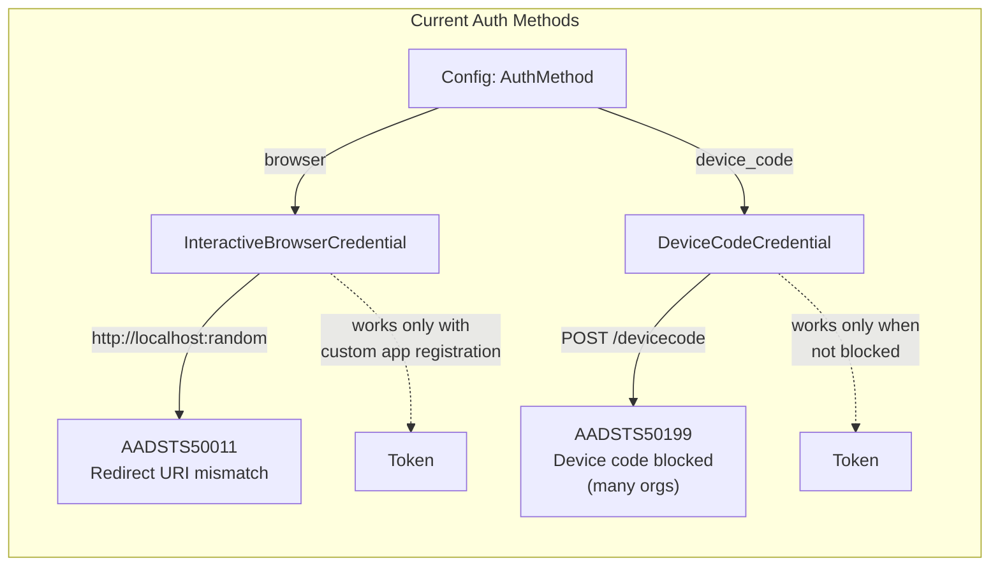
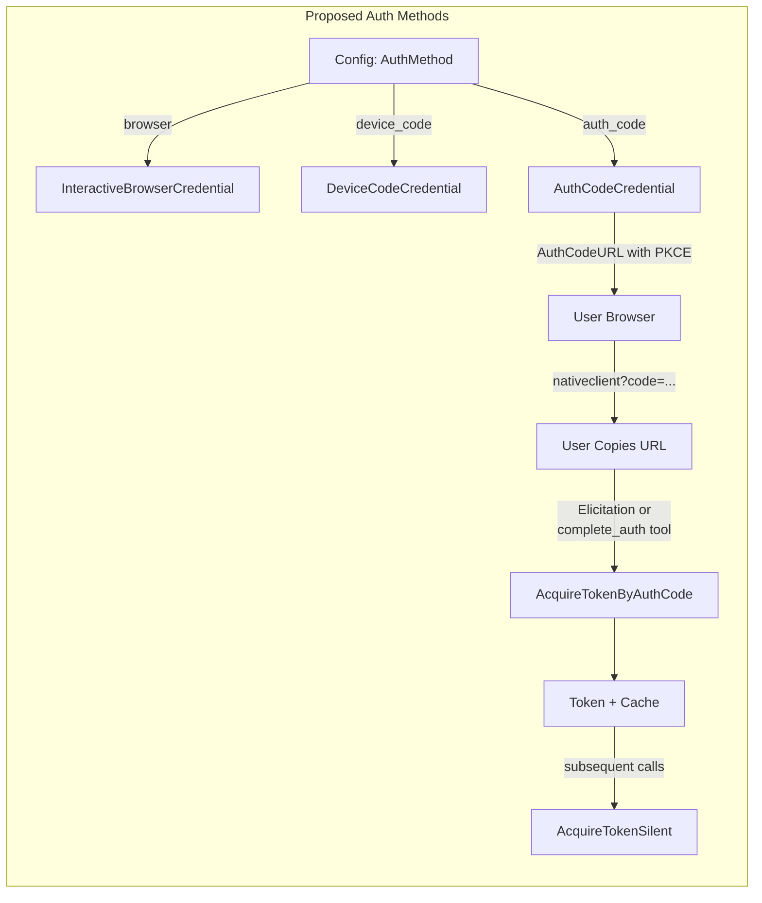
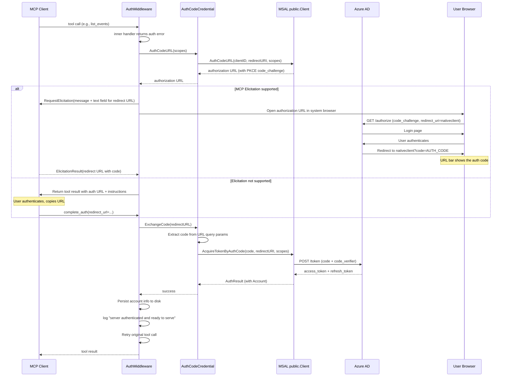
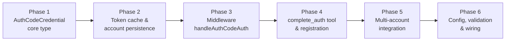

# Manual Authorization Code Flow Authentication

## Change Summary

Add a third authentication method (`auth_code`) that implements the OAuth 2.0 authorization code flow with PKCE using the `https://login.microsoftonline.com/common/oauth2/nativeclient` redirect URI. Unlike the existing `browser` method (which relies on a localhost listener that fails with the Microsoft Office first-party client ID) and `device_code` method (which many organizations block via Conditional Access policies), this method works universally: the user authenticates in their browser, and the authorization code is returned in the browser's address bar at the `nativeclient` redirect URI. The user pastes this URL back via MCP elicitation or a dedicated tool, and the server exchanges it for tokens using MSAL Go's `public.Client.AcquireTokenByAuthCode`.

The `auth_code` method integrates fully with the existing multi-account infrastructure (CR-0025): `SetupCredentialForAccount` supports `auth_code` for per-account credential construction, the `add_account` tool handles inline auth code authentication with elicitation, and the `AuthMiddleware` performs per-account re-authentication via `AccountAuthFromContext`.

## Motivation and Background

The project currently supports two authentication methods, both of which have significant limitations when using the Microsoft Office first-party client ID (`d3590ed6-52b3-4102-aeff-aad2292ab01c`):

1. **`browser` (InteractiveBrowserCredential):** Starts a local HTTP server on a random port and uses `http://localhost:<port>` as the redirect URI. The Microsoft Office app registration does not include `http://localhost` as a registered redirect URI, causing Azure AD to reject the request with `AADSTS50011: The redirect URI 'http://localhost:<port>' specified in the request does not match the redirect URIs configured for the application`.

2. **`device_code` (DeviceCodeCredential):** Works with the Microsoft Office client ID but is blocked by Conditional Access policies in many enterprise environments (`AADSTS50199: device code flow is blocked`). Organizations increasingly restrict device code flow due to phishing risks (RFC 8628 Section 5.5).

The Microsoft Office app registration **does** include `https://login.microsoftonline.com/common/oauth2/nativeclient` as a registered redirect URI. This URI is designed for native/desktop applications that cannot host a local HTTP server. When used with the authorization code flow with PKCE:

1. The user is redirected to the Microsoft login page in their browser.
2. After authentication, the browser navigates to `https://login.microsoftonline.com/common/oauth2/nativeclient?code=<AUTH_CODE>`.
3. The `nativeclient` endpoint renders a blank page; the authorization code is visible in the browser's address bar.
4. The user copies the URL and provides it back to the application.
5. The application extracts the authorization code and exchanges it for tokens via MSAL.

This is the same flow used by tools like the Azure CLI (`az login`), GNOME Evolution mail client, and Thunderbird for authenticating against Azure AD without a custom app registration.

### Why MSAL Go Directly?

The `azidentity` library does not provide a credential type for this flow. `InteractiveBrowserCredential` requires a localhost listener. `AuthorizationCodeCredential` is designed for confidential web clients and requires the auth code at construction time (not suitable for persistent sessions). MSAL Go's `public.Client` provides the necessary primitives:

- `AuthCodeURL`: constructs the authorization URL with PKCE code challenge.
- `AcquireTokenByAuthCode`: exchanges the authorization code for tokens.
- `AcquireTokenSilent`: acquires tokens from cache on subsequent calls.

## Current State



| Component | Current State |
|---|---|
| Auth methods | `browser` (default), `device_code` |
| `browser` redirect URI | `http://localhost` (fails with MS Office client ID) |
| `device_code` | Works but blocked by many Conditional Access policies |
| MSAL Go usage | Indirect via `azidentity` wrappers only |
| `nativeclient` redirect URI | Not used |
| Manual auth code flow | Not implemented |
| Multi-account `add_account` | Supports `browser` and `device_code` auth methods only |
| `SetupCredentialForAccount` | Delegates to `SetupCredential` which has `browser` and `device_code` cases |

## Proposed Change

Add an `auth_code` authentication method that uses MSAL Go's `public.Client` to implement the authorization code flow with PKCE and the `nativeclient` redirect URI.



### Authorization Code Flow Sequence



### Component Inventory

| # | Component | File(s) | Purpose |
|---|---|---|---|
| 1 | AuthCodeCredential | `internal/auth/authcode.go` | MSAL public client wrapper: AuthCodeURL, ExchangeCode, GetToken, Authenticate |
| 2 | Token cache bridge | `internal/auth/authcode.go` | OS keychain cache integration for MSAL public client |
| 3 | Account persistence | `internal/auth/authcode.go` | Persist/load MSAL account info for silent token acquisition |
| 4 | SetupCredential extension | `internal/auth/auth.go` | Add `auth_code` case to the auth method switch |
| 5 | Middleware auth_code handler | `internal/auth/middleware.go` | `handleAuthCodeAuth` method for elicitation-based code exchange |
| 6 | AuthCodeFlow interface | `internal/auth/authcode.go` | Interface for AuthCodeURL/ExchangeCode used by add_account and complete_auth without concrete type assertion |
| 7 | complete_auth tool | `internal/tools/complete_auth.go` | Fallback tool for clients without elicitation support; supports optional `account` parameter for multi-account |
| 8 | Tool registration | `internal/server/server.go` | Register `complete_auth` tool |
| 9 | Config documentation | `internal/config/config.go` | Document `auth_code` as valid AuthMethod value |
| 10 | Config validation | `internal/config/validate.go` | Add `auth_code` to valid auth method set |
| 11 | Multi-account credential setup | `internal/auth/auth.go` | `SetupCredentialForAccount` delegates to `SetupCredential` which gains the `auth_code` case |
| 12 | add_account auth_code flow | `internal/tools/add_account.go` | Add `auth_code` inline authentication branch with elicitation-based code exchange |
| 13 | Tests | `internal/auth/authcode_test.go`, `internal/auth/middleware_test.go`, `internal/tools/complete_auth_test.go`, `internal/tools/add_account_test.go` | Unit tests for all new and modified code |

## Requirements

### Functional Requirements

#### AuthCodeCredential

1. The system **MUST** implement an `AuthCodeCredential` struct in `internal/auth/authcode.go` that wraps MSAL Go's `public.Client`.
2. The `AuthCodeCredential` **MUST** implement the `azcore.TokenCredential` interface (`GetToken` method) so it can be used with the Microsoft Graph SDK.
3. The `AuthCodeCredential` **MUST** implement the `Authenticator` interface (`Authenticate` method) so it can be used with the existing `AuthMiddleware`.
4. The `AuthCodeCredential` **MUST** use `https://login.microsoftonline.com/common/oauth2/nativeclient` as the redirect URI for all authorization requests.
5. The `AuthCodeCredential` **MUST** use PKCE (Proof Key for Code Exchange) for all authorization code requests. MSAL Go's `AuthCodeURL` generates PKCE parameters automatically.
6. The `AuthCodeCredential` **MUST** provide an `AuthCodeURL(ctx context.Context, scopes []string) (string, error)` method that returns the authorization URL for the user to visit.
7. The `AuthCodeCredential` **MUST** provide an `ExchangeCode(ctx context.Context, redirectURL string, scopes []string) error` method that extracts the authorization code from the redirect URL query parameters and exchanges it for tokens via `AcquireTokenByAuthCode`.
8. The `ExchangeCode` method **MUST** validate that the redirect URL starts with `https://login.microsoftonline.com/common/oauth2/nativeclient` before extracting the code.
9. The `ExchangeCode` method **MUST** return a descriptive error if the redirect URL does not contain a `code` query parameter.
10. The `GetToken` method **MUST** first attempt `AcquireTokenSilent` using the cached account. If silent acquisition fails, it **MUST** return an error that the `AuthMiddleware` recognizes as an authentication error (triggering the interactive flow).
11. The `Authenticate` method **MUST** match the middleware's `authenticateFunc` signature exactly: `func(ctx context.Context, opts *policy.TokenRequestOptions) (azidentity.AuthenticationRecord, error)`. It **MUST** construct the auth URL, invoke a user prompt callback to obtain the redirect URL, exchange the code, and return an `azidentity.AuthenticationRecord`.

#### Token Cache Integration

12. The `AuthCodeCredential` **MUST** initialize a persistent token cache backed by the OS keychain, using the same cache partition name convention as existing credentials (`cfg.CacheName`).
13. The MSAL `public.Client` **MUST** be constructed with the persistent cache via `public.WithCache`, using the `cache.ExportReplace` interface from the `microsoft-authentication-extensions-for-go/cache` package.
14. Token cache persistence **MUST** use the same OS keychain mechanism (macOS Keychain, Linux libsecret, Windows DPAPI) as the existing `azidentity/cache`-based credentials.
15. The system **MUST** fall back to MSAL's default in-memory cache when the OS keychain backend returns an error during initialization (e.g., missing libsecret on Linux, Keychain access denied on macOS), and **MUST** log a warning when this fallback occurs.

#### Account Persistence

16. The `AuthCodeCredential` **MUST** persist the MSAL `public.Account` metadata to disk after successful authentication, in a JSON file at the configured `AuthRecordPath`.
17. The persisted account file **MUST** be created with permissions `0600` (owner read/write only) and the parent directory with permissions `0700`.
18. On startup, the `AuthCodeCredential` **MUST** load the persisted account metadata from disk to enable `AcquireTokenSilent` on subsequent runs.
19. If the persisted account file is missing or contains invalid JSON, the system **MUST** treat it as a first-run condition requiring interactive authentication.

#### Middleware Integration

20. The `AuthMiddleware` **MUST** handle the `auth_code` method via a new `handleAuthCodeAuth` method.
21. The `handleAuthCodeAuth` method **MUST** call `AuthCodeURL` on the credential to obtain the authorization URL.
22. The `handleAuthCodeAuth` method **MUST** attempt to open the authorization URL in the system browser using `pkg/browser`.
23. When MCP elicitation is supported, `handleAuthCodeAuth` **MUST** use `RequestElicitation` with a form containing:
    - A message explaining that the user should authenticate in their browser and paste the resulting URL.
    - A text input field (`redirect_url`) for the user to paste the `nativeclient` redirect URL.
24. When the elicitation response contains a valid redirect URL, the middleware **MUST** call `ExchangeCode` on the credential and retry the original tool call on success.
25. When MCP elicitation is **NOT** supported, the middleware **MUST** return a tool result containing the authorization URL and instructions to use the `complete_auth` tool with the redirect URL.

#### complete_auth Tool (Elicitation Fallback)

26. The system **MUST** register a `complete_auth` MCP tool that accepts a `redirect_url` string parameter.
27. The `complete_auth` tool **MUST** extract the authorization code from the provided redirect URL and call `ExchangeCode` on the credential.
28. The `complete_auth` tool **MUST** return a success message on successful token exchange, or a descriptive error if the URL is invalid or the exchange fails.
29. The `complete_auth` tool **MUST** only be active when `AuthMethod` is `auth_code`. It **MUST NOT** be registered for `browser` or `device_code` methods.

#### Configuration

30. The `OUTLOOK_MCP_AUTH_METHOD` environment variable **MUST** accept `auth_code` as a valid value in addition to the existing `browser` and `device_code` values.
31. The `auth_code` method **MUST** be the default authentication method. The `OUTLOOK_MCP_AUTH_METHOD` environment variable **MUST** default to `auth_code` when unset or empty.

#### Multi-Account Support

32. `SetupCredentialForAccount` **MUST** support `auth_code` as a valid `authMethod` parameter. When `authMethod` is `auth_code`, it **MUST** construct an `AuthCodeCredential` with per-account token cache partitioning (`{cacheNameBase}-{label}`) and a dedicated auth record path (`{label}_auth_record.json`).
33. The `add_account` tool **MUST** support `auth_code` as a valid value for the `auth_method` parameter.
34. When `add_account` is called with `auth_method: "auth_code"`, the tool **MUST** perform inline authentication using the auth code flow:
    - Call `AuthCodeURL` on the newly created `AuthCodeCredential` to obtain the authorization URL.
    - Open the URL in the system browser.
    - Attempt MCP elicitation with a `redirect_url` text field for the user to paste the nativeclient redirect URL.
    - If elicitation succeeds, call `ExchangeCode` with the provided URL to complete authentication.
    - If elicitation is not supported, return the authorization URL and instruct the user to use `complete_auth` with the redirect URL, then retry `add_account`.
35. The `add_account` tool **MUST** register the new account in the `AccountRegistry` only after successful token exchange. A failed or incomplete auth code flow **MUST NOT** leave a partially registered account.
36. The `AccountAuth` struct stored in context by `AccountResolver` **MUST** propagate the `auth_code` auth method value so that `AuthMiddleware.handleAuthError` dispatches to `handleAuthCodeAuth` for per-account re-authentication.
37. Per-account `AuthCodeCredential` instances created via `add_account` **MUST** use isolated MSAL `public.Client` instances with per-account cache partitions, ensuring that token caches do not collide between accounts.
38. The `complete_auth` tool **MUST** accept an optional `account` parameter. When provided, the tool **MUST** exchange the code using the `AuthCodeCredential` associated with the specified account label. When omitted, the default account's credential **MUST** be used.

### Non-Functional Requirements

1. The `GetToken` method **MUST** complete within 2 seconds when a valid cached token is available (silent acquisition path).
2. The `AuthCodeCredential` **MUST** be safe for concurrent use from multiple goroutines. MSAL Go's `public.Client` is thread-safe; the credential wrapper **MUST NOT** introduce data races.
3. The authorization code **MUST NOT** be logged, stored in audit logs, or included in MCP notifications. Only the authorization URL (which contains no secrets) may be displayed to the user.
4. The PKCE code verifier **MUST NOT** be exposed outside the MSAL library. MSAL Go manages PKCE internally.
5. The `complete_auth` tool **MUST** validate the redirect URL format before attempting code extraction. Malformed URLs **MUST** be rejected with a descriptive error, not passed to MSAL.
6. The persistent token cache **MUST** share the same OS keychain storage mechanism as existing credentials, so that clearing the keychain entry clears all auth methods uniformly.

## Affected Components

| File | Action | Description |
|---|---|---|
| `internal/auth/authcode.go` | **New** | AuthCodeCredential: MSAL public client wrapper, AuthCodeURL, ExchangeCode, GetToken, Authenticate, account persistence |
| `internal/auth/authcode_test.go` | **New** | Unit tests for AuthCodeCredential |
| `internal/auth/auth.go` | **Modified** | Add `auth_code` case to `SetupCredential` switch |
| `internal/auth/middleware.go` | **Modified** | Add `handleAuthCodeAuth` method |
| `internal/auth/middleware_test.go` | **Modified** | Add tests for `handleAuthCodeAuth` |
| `internal/tools/complete_auth.go` | **New** | `complete_auth` MCP tool handler |
| `internal/tools/complete_auth_test.go` | **New** | Unit tests for `complete_auth` tool |
| `internal/server/server.go` | **Modified** | Register `complete_auth` tool when auth method is `auth_code` |
| `internal/server/server_test.go` | **Modified** | Test `complete_auth` registration |
| `internal/config/config.go` | **Modified** | Document `auth_code` in AuthMethod field comment; change default from `"browser"` to `"auth_code"` in `LoadConfig` |
| `internal/config/validate.go` | **Modified** | Add `auth_code` to valid auth methods |
| `internal/config/config_test.go` | **Modified** | Update default AuthMethod expectation from `"browser"` to `"auth_code"` |
| `internal/config/validate_test.go` | **Modified** | Add test for `auth_code` validation |
| `internal/tools/add_account.go` | **Modified** | Add `auth_code` inline authentication branch in add_account handler |
| `internal/tools/add_account_test.go` | **Modified** | Add tests for `auth_code` flow in add_account |
| `go.mod` | **Modified** | Promote `microsoft-authentication-library-for-go` from indirect to direct dependency |

## Scope Boundaries

### In Scope

* `AuthCodeCredential` wrapping MSAL Go `public.Client` with `nativeclient` redirect URI.
* PKCE-based authorization code flow with `AuthCodeURL` and `AcquireTokenByAuthCode`.
* Silent token acquisition via `AcquireTokenSilent` for cached refresh tokens.
* OS keychain token cache integration for the MSAL public client.
* Account metadata persistence and loading for subsequent-run silent auth.
* Middleware `handleAuthCodeAuth` method with elicitation-based code exchange.
* `complete_auth` fallback tool for clients without elicitation support.
* Multi-account support: `SetupCredentialForAccount` with `auth_code`, `add_account` inline auth code flow, per-account `AuthCodeCredential` instances with isolated caches, `AccountAuth` propagation for per-account re-authentication.
* `complete_auth` tool `account` parameter for per-account code exchange.
* Configuration: `OUTLOOK_MCP_AUTH_METHOD=auth_code`.
* Unit tests for all new and modified code.

### Out of Scope ("Here, But Not Further")

* Custom Azure AD app registration -- the Microsoft Office first-party client ID is used.
* Refresh token rotation or custom token lifecycle management -- handled by MSAL internally.
* Removing or modifying the existing `browser` or `device_code` auth methods.
* Automated browser interaction (e.g., headless browser to extract the code automatically).
* The `urn:ietf:wg:oauth:2.0:oob` redirect URI -- deprecated by Microsoft; only `nativeclient` is used.

## Impact Assessment

### User Impact

**Breaking change:** The default authentication method changes from `browser` to `auth_code`. New installations and users who have not set `OUTLOOK_MCP_AUTH_METHOD` explicitly will use the auth code flow instead of the interactive browser flow. This is intentional because:

- The `browser` method fails with the default Microsoft Office client ID (`AADSTS50011`), so the previous default did not work out of the box.
- The `auth_code` method is the first default that works universally with the Microsoft Office client ID.

Users who previously set `OUTLOOK_MCP_AUTH_METHOD=browser` with a custom app registration are unaffected -- their explicit setting overrides the default. Users who relied on the `browser` default (which was broken with the default client ID) will now get a working auth flow.

The authentication experience is:

1. First tool call triggers authentication.
2. Browser opens to Microsoft login page.
3. User authenticates and is redirected to a blank page.
4. User copies the URL from the browser address bar.
5. User pastes the URL via the MCP client's elicitation prompt (or tells the AI assistant, which calls `complete_auth`).
6. Subsequent tool calls use cached tokens silently.

### Technical Impact

- **New direct dependency:** `github.com/AzureAD/microsoft-authentication-library-for-go` is promoted from indirect to direct. This is already in the dependency tree via `azidentity`.
- **New tool:** `complete_auth` is registered only when `auth_code` is the configured method. It does not appear for other auth methods.
- **Middleware expansion:** `handleAuthError` gains a third branch for `auth_code`, following the same pattern as `handleBrowserAuth` and `handleDeviceCodeAuth`. Per-account re-authentication works via `AccountAuthFromContext` with `AuthMethod: "auth_code"`.
- **Multi-account expansion:** `SetupCredentialForAccount` gains `auth_code` support via the existing delegation to `SetupCredential`. The `add_account` tool gains a third inline authentication branch. Per-account `AuthCodeCredential` instances use isolated MSAL `public.Client` instances with per-account cache partitions.
- **No changes to existing auth methods.** The `browser` and `device_code` code paths are untouched.

### Business Impact

- Unblocks users in enterprise environments where device code flow is disabled via Conditional Access.
- Resolves the `AADSTS50011` redirect URI mismatch error that prevents browser auth with the Microsoft Office client ID.
- Maintains the zero-app-registration value proposition: users do not need to create their own Azure AD app.

## Implementation Approach

Implementation is divided into six sequential phases. Phases **MUST** be implemented in order because later phases depend on artifacts from earlier phases.



### Phase 1: AuthCodeCredential Core Type

Create the `AuthCodeCredential` struct wrapping MSAL Go's `public.Client`.

**Step 1.1: Create `internal/auth/authcode.go`**

Define the `AuthCodeCredential` struct with fields for the MSAL `public.Client`, redirect URI, cached account, and a mutex for thread safety. Implement:

- `NewAuthCodeCredential(clientID, tenantID string, cacheAccessor cache.ExportReplace) (*AuthCodeCredential, error)` -- constructs the MSAL public client with `public.WithCache` and `public.WithAuthority`.
- `AuthCodeURL(ctx context.Context, scopes []string) (string, error)` -- delegates to `public.Client.AuthCodeURL` using the credential's stored clientID and redirectURI to produce the authorization URL with PKCE.
- `ExchangeCode(ctx context.Context, redirectURL string, scopes []string) error` -- parses the redirect URL, extracts the `code` query parameter, calls `public.Client.AcquireTokenByAuthCode`, and stores the resulting account.
- `GetToken(ctx context.Context, options policy.TokenRequestOptions) (azcore.AccessToken, error)` -- calls `AcquireTokenSilent` with the cached account; returns an auth error if silent acquisition fails.
- `Authenticate(ctx context.Context, opts *policy.TokenRequestOptions) (azidentity.AuthenticationRecord, error)` -- constructs the auth URL, invokes a user prompt callback (injected via context) to obtain the redirect URL, calls `ExchangeCode`, and returns an `AuthenticationRecord`-equivalent result.

**Verification:** Unit tests for `AuthCodeURL` (returns valid URL with correct parameters), `ExchangeCode` (extracts code, rejects invalid URLs), and `GetToken` (returns auth error when no cached account).

### Phase 2: Token Cache and Account Persistence

Integrate OS keychain caching and file-based account persistence.

**Step 2.1: Token cache bridge**

Use the `microsoft-authentication-extensions-for-go/cache` package to create a `cache.ExportReplace` accessor backed by the OS keychain. Pass this to the MSAL `public.Client` via `public.WithCache`. Handle the fallback to in-memory cache when the keychain is unavailable.

**Step 2.2: Account persistence**

Implement `saveAccount(path string, account public.Account) error` and `loadAccount(path string) (public.Account, error)` functions. The account is serialized as JSON with the same permission model as the existing `SaveAuthRecord`/`LoadAuthRecord` (file `0600`, directory `0700`).

**Verification:** Round-trip test: save account, load account, verify fields match. Test file permissions. Test missing/corrupt file handling.

### Phase 3: Middleware handleAuthCodeAuth

Add the `handleAuthCodeAuth` method to the `authMiddlewareState`.

**Step 3.1: Implement `handleAuthCodeAuth`**

The method:

1. Calls `AuthCodeURL` on the credential to get the authorization URL.
2. Opens the URL in the system browser via `pkg/browser`.
3. Attempts MCP elicitation with a form containing a `redirect_url` text field.
4. If elicitation succeeds and the response contains a valid URL, calls `ExchangeCode` and retries the tool call.
5. If elicitation is not supported, returns a tool result with the auth URL and instructions to use `complete_auth`.

**Step 3.2: Update `handleAuthError`**

Add an `auth_code` branch in `handleAuthError` that delegates to `handleAuthCodeAuth`.

**Verification:** Unit tests with mock elicitation and mock credential. Test elicitation path, fallback path, invalid URL handling, and successful retry.

### Phase 4: complete_auth Tool and Registration

Create the fallback tool for clients without elicitation support.

**Step 4.1: Create `internal/tools/complete_auth.go`**

Implement the `complete_auth` tool handler that:

1. Accepts a `redirect_url` string parameter.
2. Validates the URL format.
3. Calls `ExchangeCode` on the credential.
4. Returns success or error.

**Step 4.2: Update `internal/server/server.go`**

Register the `complete_auth` tool conditionally when `cfg.AuthMethod == "auth_code"`.

**Verification:** Unit tests for the tool handler with valid/invalid URLs. Test that the tool is not registered for other auth methods.

### Phase 5: Multi-Account Integration

Extend the multi-account infrastructure to support `auth_code`.

**Step 5.1: Verify `SetupCredentialForAccount` delegation**

`SetupCredentialForAccount` already delegates to `SetupCredential` after constructing a per-account `config.Config`. The `auth_code` case added to `SetupCredential` in Phase 6 (Step 6.2) automatically makes `SetupCredentialForAccount` work with `auth_code`. Verify this with a unit test.

**Step 5.2: Update `add_account` tool**

Add an `auth_code` branch to the inline authentication flow in `internal/tools/add_account.go`. The existing handler has branches for `browser` (URL mode elicitation → background auth) and `device_code` (capture device code → form mode elicitation). Add a third branch:

1. Call `AuthCodeURL` on the newly created `AuthCodeCredential` (obtained from the `AccountEntry.Authenticator` which is the `AuthCodeCredential`).
2. Open the URL in the system browser.
3. Attempt form mode elicitation with a `redirect_url` text field.
4. If elicitation succeeds and the response contains a valid URL, call `ExchangeCode` to complete authentication.
5. If elicitation is not supported, return the authorization URL and instructions to use `complete_auth` with the redirect URL, then retry `add_account`.
6. On success, create the Graph client and register the account in the `AccountRegistry`.

The `AuthCodeCredential` must be type-asserted from the `Authenticator` interface to access `AuthCodeURL` and `ExchangeCode`. Define an `AuthCodeFlow` interface to avoid a concrete type assertion:

```go
// AuthCodeFlow is the interface for credentials that support the manual
// authorization code flow. AuthCodeCredential implements this interface.
type AuthCodeFlow interface {
    AuthCodeURL(ctx context.Context, scopes []string) (string, error)
    ExchangeCode(ctx context.Context, redirectURL string, scopes []string) error
}
```

**Step 5.3: Update `complete_auth` tool with `account` parameter**

Add an optional `account` string parameter to the `complete_auth` tool. When provided, the tool looks up the specified account in the `AccountRegistry`, retrieves its `AuthCodeCredential`, and calls `ExchangeCode` on that credential. When omitted, the default account's credential is used.

**Step 5.4: Verify `AccountAuth` propagation**

The `AccountResolver` middleware already injects `AccountAuth{Authenticator, AuthRecordPath, AuthMethod}` into the context via `WithAccountAuth`. When `add_account` registers an account with `AuthMethod: "auth_code"`, the `AuthMiddleware.handleAuthError` reads this via `AccountAuthFromContext` and dispatches to `handleAuthCodeAuth`. Verify this with an integration test.

**Verification:** Unit tests for `add_account` with `auth_method: "auth_code"` (elicitation path and fallback path). Test `complete_auth` with `account` parameter. Test per-account re-authentication dispatch.

### Phase 6: Configuration, Validation, and Wiring

Wire everything together in the startup lifecycle.

**Step 6.1: Update config and validation**

Change the default value for `OUTLOOK_MCP_AUTH_METHOD` from `"browser"` to `"auth_code"` in `LoadConfig`. Add `auth_code` to the `AuthMethod` field documentation and validation. Update the `AuthMethod` field comment to reflect the new default.

**Step 6.2: Update `SetupCredential`**

Add the `auth_code` case to the switch in `SetupCredential`, constructing an `AuthCodeCredential` and returning it as both `azcore.TokenCredential` and `Authenticator`.

**Step 6.3: End-to-end verification**

```bash
# Default auth method test (auth_code is now the default)
go run ./cmd/outlook-local-mcp/
# Trigger a tool call, verify auth URL is presented, complete the flow.

# Explicit browser auth (backward compatibility)
OUTLOOK_MCP_AUTH_METHOD=browser go run ./cmd/outlook-local-mcp/

# Multi-account test
# After default auth, use add_account with auth_method: "auth_code"
# Verify per-account auth code flow and token isolation.
```

**Verification:** Build succeeds, all tests pass, lint clean, manual end-to-end test with `auth_code` method for both default and additional accounts.

## Test Strategy

### Tests to Add

| Test File | Test Name | Description | Inputs | Expected Output |
|-----------|-----------|-------------|--------|-----------------|
| `internal/auth/authcode_test.go` | `TestAuthCodeURL_ReturnsValidURL` | AuthCodeURL produces a valid authorization URL | clientID, scopes | URL contains client_id, redirect_uri, scope, code_challenge |
| `internal/auth/authcode_test.go` | `TestAuthCodeURL_IncludesPKCE` | AuthCodeURL includes PKCE code_challenge and code_challenge_method | clientID, scopes | URL contains `code_challenge` and `code_challenge_method=S256` |
| `internal/auth/authcode_test.go` | `TestExchangeCode_ValidURL` | ExchangeCode extracts code from valid nativeclient URL | `nativeclient?code=abc123` | Code extracted, AcquireTokenByAuthCode called with `abc123` |
| `internal/auth/authcode_test.go` | `TestExchangeCode_InvalidPrefix` | ExchangeCode rejects URLs not starting with nativeclient | `https://evil.com?code=abc` | Error: invalid redirect URL |
| `internal/auth/authcode_test.go` | `TestExchangeCode_MissingCode` | ExchangeCode rejects URLs without a code parameter | `nativeclient?state=xyz` | Error: no authorization code found |
| `internal/auth/authcode_test.go` | `TestExchangeCode_MalformedURL` | ExchangeCode rejects malformed URLs | `not-a-url` | Error: invalid redirect URL |
| `internal/auth/authcode_test.go` | `TestGetToken_SilentSuccess` | GetToken returns cached token via AcquireTokenSilent | Cached account with valid token | AccessToken returned |
| `internal/auth/authcode_test.go` | `TestGetToken_SilentFail_ReturnsAuthError` | GetToken returns auth error when silent acquisition fails | No cached account | Error recognized by IsAuthError |
| `internal/auth/authcode_test.go` | `TestSaveLoadAccount_RoundTrip` | Save and load account produces identical result | Valid account | Loaded account matches saved |
| `internal/auth/authcode_test.go` | `TestSaveAccount_FilePermissions` | Account file has 0600 permissions | Valid account | File mode 0600 |
| `internal/auth/authcode_test.go` | `TestLoadAccount_FileNotFound` | Missing file returns zero account | Non-existent path | Zero account, no error |
| `internal/auth/authcode_test.go` | `TestLoadAccount_InvalidJSON` | Corrupt file returns zero account | File with invalid JSON | Zero account, warning logged |
| `internal/auth/authcode_test.go` | `TestCacheFallback_NoKeychain` | Falls back to in-memory cache when keychain unavailable | No keychain | Warning logged, client constructed |
| `internal/auth/middleware_test.go` | `TestHandleAuthCodeAuth_ElicitationSuccess` | Full flow: auth URL presented, elicitation returns URL, code exchanged, retry | Mock elicitation returns valid URL | Tool call retried and succeeds |
| `internal/auth/middleware_test.go` | `TestHandleAuthCodeAuth_ElicitationNotSupported` | Fallback: returns auth URL with complete_auth instructions | Elicitation returns ErrElicitationNotSupported | Tool result contains auth URL and instructions |
| `internal/auth/middleware_test.go` | `TestHandleAuthCodeAuth_InvalidElicitationURL` | Elicitation returns invalid URL | Elicitation returns `https://evil.com` | Error result with guidance |
| `internal/auth/middleware_test.go` | `TestHandleAuthCodeAuth_ExchangeFailure` | Exchange fails after valid URL | MSAL returns error | Error result with troubleshooting |
| `internal/tools/complete_auth_test.go` | `TestCompleteAuth_ValidURL` | Accepts valid nativeclient URL and exchanges code | `nativeclient?code=abc` | Success message |
| `internal/tools/complete_auth_test.go` | `TestCompleteAuth_InvalidURL` | Rejects invalid redirect URL | `https://evil.com` | Error: invalid redirect URL |
| `internal/tools/complete_auth_test.go` | `TestCompleteAuth_MissingParam` | Rejects call without redirect_url | Empty params | Error: redirect_url required |
| `internal/server/server_test.go` | `TestRegisterTools_CompleteAuthRegistered` | complete_auth is registered when auth_code method | `AuthMethod: "auth_code"` | Tool registered |
| `internal/server/server_test.go` | `TestRegisterTools_CompleteAuthNotRegistered` | complete_auth is NOT registered for other methods | `AuthMethod: "browser"` | Tool not registered |
| `internal/config/validate_test.go` | `TestValidateConfig_AuthCodeMethod` | auth_code is accepted as valid auth method | `AuthMethod: "auth_code"` | No validation error |
| `internal/config/config_test.go` | `TestLoadConfig_DefaultAuthMethod` | Default auth method is auth_code when env var unset | `OUTLOOK_MCP_AUTH_METHOD` unset | `Config.AuthMethod == "auth_code"` |
| `internal/auth/authcode_test.go` | `TestNewAuthCodeCredential_PerAccountCache` | Per-account credentials use isolated cache partitions | Two credentials with different cache names | Separate MSAL clients, no cache collision |
| `internal/tools/add_account_test.go` | `TestAddAccount_AuthCode_ElicitationSuccess` | add_account completes auth code flow via elicitation | `auth_method: "auth_code"`, mock elicitation returns valid URL | Account registered with auth_code method |
| `internal/tools/add_account_test.go` | `TestAddAccount_AuthCode_ElicitationNotSupported` | add_account returns auth URL and complete_auth instructions | `auth_method: "auth_code"`, elicitation not supported | Tool result with auth URL and fallback instructions |
| `internal/tools/add_account_test.go` | `TestAddAccount_AuthCode_ExchangeFailure` | add_account does not register account on exchange failure | `auth_method: "auth_code"`, MSAL exchange fails | Error result, account NOT in registry |
| `internal/tools/complete_auth_test.go` | `TestCompleteAuth_WithAccountParam` | Exchanges code for specified account | `account: "work", redirect_url: nativeclient?code=abc` | Code exchanged on work account's credential |
| `internal/tools/complete_auth_test.go` | `TestCompleteAuth_UnknownAccount` | Rejects unknown account label | `account: "nonexistent"` | Error: account not found |
| `internal/auth/middleware_test.go` | `TestHandleAuthCodeAuth_PerAccountReauth` | Per-account re-auth dispatches to handleAuthCodeAuth | AccountAuth in context with AuthMethod "auth_code" | Auth code flow triggered on per-account credential |
| `internal/auth/authcode_test.go` | `TestCacheFallback_NoKeychain_Warning` | In-memory fallback logs a warning when OS keychain init fails | Keychain backend returns error | Warning logged, credential constructed successfully |
| `internal/auth/authcode_test.go` | `TestSaveAccount_DirectoryPermissions` | Parent directory created with 0700 permissions | Valid account, non-existent parent dir | Directory mode 0700 |
| `internal/auth/authcode_test.go` | `TestLoadAccount_InvalidJSON_Warning` | Corrupt account file logs warning and returns zero account | File with invalid JSON | Warning logged, zero account returned |
| `internal/auth/authcode_test.go` | `TestSetupCredentialForAccount_AuthCode` | SetupCredentialForAccount returns AuthCodeCredential for auth_code method | authMethod "auth_code", label "work" | Returns TokenCredential + Authenticator, cache partition "{base}-work" |
| `internal/auth/authcode_test.go` | `TestExchangeCode_AuthCodeNotLogged` | Authorization code value does not appear in log output during ExchangeCode | Valid nativeclient URL with code | Code value absent from captured log output |

### Tests to Modify

| Test File | Test Name | Current Behavior | New Behavior | Reason for Change |
|-----------|-----------|------------------|--------------|-------------------|
| `internal/auth/middleware_test.go` | Tests calling `AuthMiddleware` | Passes `authMethod` as `"browser"` or `"device_code"` | Add test variants with `"auth_code"` | New auth method in middleware |
| `internal/server/server_test.go` | Tests calling `RegisterTools` | Does not check for `complete_auth` tool | Verify conditional registration | New tool added conditionally |
| `internal/tools/add_account_test.go` | Existing `add_account` tests | Test browser and device_code flows only | Add `auth_code` flow variants | New auth method in add_account |
| `internal/config/config_test.go` | Tests checking default AuthMethod | Expects default `"browser"` | Expects default `"auth_code"` | Default changed from browser to auth_code |

### Tests to Remove

Not applicable. No existing tests become redundant.

## Acceptance Criteria

### AC-1: AuthCodeCredential constructs valid authorization URL

```gherkin
Given an AuthCodeCredential configured with the Microsoft Office client ID
When AuthCodeURL is called with scopes ["Calendars.ReadWrite"]
Then the returned URL contains the correct authorize endpoint
  And the URL contains client_id=d3590ed6-52b3-4102-aeff-aad2292ab01c
  And the URL contains redirect_uri=https://login.microsoftonline.com/common/oauth2/nativeclient
  And the URL contains response_type=code
  And the URL contains a code_challenge parameter (PKCE)
  And the URL contains code_challenge_method=S256
```

### AC-2: ExchangeCode extracts and exchanges authorization code

```gherkin
Given an AuthCodeCredential with PKCE state from a prior AuthCodeURL call
When ExchangeCode is called with "https://login.microsoftonline.com/common/oauth2/nativeclient?code=AUTH_CODE_123"
Then the authorization code "AUTH_CODE_123" is extracted from the URL
  And AcquireTokenByAuthCode is called with the code, redirect URI, and scopes
  And the resulting account is cached for silent token acquisition
```

### AC-3: ExchangeCode rejects invalid redirect URLs

```gherkin
Scenario: Wrong redirect URI prefix
Given an AuthCodeCredential
When ExchangeCode is called with a URL that does not start with "https://login.microsoftonline.com/common/oauth2/nativeclient"
Then an error is returned indicating the redirect URL is invalid
  And no token exchange is attempted

Scenario: Missing code query parameter
Given an AuthCodeCredential
When ExchangeCode is called with "https://login.microsoftonline.com/common/oauth2/nativeclient?state=xyz" (no code parameter)
Then an error is returned indicating no authorization code was found in the URL
  And no token exchange is attempted
```

### AC-4: Silent token acquisition on subsequent calls

```gherkin
Given an AuthCodeCredential that has previously exchanged an authorization code
  And the token cache contains a valid refresh token
When GetToken is called
Then AcquireTokenSilent succeeds using the cached account
  And a valid access token is returned
  And no user interaction is required
```

### AC-5: GetToken returns auth error when no cached token

```gherkin
Given an AuthCodeCredential with no cached account or expired tokens
When GetToken is called
Then AcquireTokenSilent fails
  And the returned error is recognized by IsAuthError
  And the AuthMiddleware triggers the interactive auth code flow
```

### AC-6: Middleware presents auth URL via elicitation

```gherkin
Given the auth method is "auth_code"
  And the MCP client supports elicitation
When a tool call encounters an authentication error
Then the middleware calls AuthCodeURL to obtain the authorization URL
  And the middleware opens the URL in the system browser
  And the middleware sends a RequestElicitation with a redirect_url text field
  And the elicitation message instructs the user to paste the URL from their browser
```

### AC-7: Middleware exchanges code from elicitation response

```gherkin
Given the middleware has sent an elicitation request
When the client responds with a valid nativeclient redirect URL containing a code
Then the middleware calls ExchangeCode with the redirect URL
  And the account metadata is persisted to disk
  And the original tool call is retried
  And the retried tool call returns successfully
```

### AC-8: Middleware falls back to complete_auth instructions

```gherkin
Given the auth method is "auth_code"
  And the MCP client does NOT support elicitation
When a tool call encounters an authentication error
Then the middleware returns a tool result containing:
  (a) the authorization URL for the user to visit
  (b) instructions to copy the redirect URL from the browser
  (c) instructions to use the complete_auth tool with the redirect URL
```

### AC-9: complete_auth tool exchanges code successfully

```gherkin
Given the complete_auth tool is registered
When called with redirect_url "https://login.microsoftonline.com/common/oauth2/nativeclient?code=VALID_CODE"
Then the authorization code is extracted and exchanged for tokens
  And a success message is returned
  And subsequent tool calls use the cached token silently
```

### AC-10: complete_auth tool rejects invalid URLs

```gherkin
Given the complete_auth tool is registered
When called with a redirect_url that does not start with the nativeclient URI
Then an error result is returned describing the expected URL format
  And no token exchange is attempted
```

### AC-11: complete_auth tool is only registered for auth_code method

```gherkin
Given the configuration has AuthMethod set to "browser" or "device_code"
When RegisterTools is called
Then the complete_auth tool is NOT registered
  And the tool list contains only the standard 12 tools (9 calendar + 3 account management)
```

### AC-12: Token cache persists across server restarts

```gherkin
Given the user has completed the auth_code flow
  And tokens are cached in the OS keychain
  And account metadata is saved to disk
When the server is restarted
Then the AuthCodeCredential loads the account metadata from disk
  And the first tool call acquires a token silently via AcquireTokenSilent
  And no user interaction is required
```

### AC-13: auth_code is the default authentication method

```gherkin
Given the environment variable OUTLOOK_MCP_AUTH_METHOD is not set
When LoadConfig is called
Then the Config.AuthMethod field defaults to "auth_code"
  And ValidateConfig returns no validation error
```

### AC-14: Authorization code is not logged or exposed

```gherkin
Given the auth_code flow is in progress
When the authorization code is extracted from the redirect URL
Then the code value MUST NOT appear in any log output
  And the code value MUST NOT appear in any MCP notification
  And the code value MUST NOT appear in any audit log entry
```

### AC-15: SetupCredentialForAccount supports auth_code

```gherkin
Given SetupCredentialForAccount is called with authMethod "auth_code"
  And a unique label "work"
When the credential is constructed
Then an AuthCodeCredential is returned (implementing both TokenCredential and Authenticator)
  And the MSAL public client uses cache partition "{cacheNameBase}-work"
  And the auth record path is "{authRecordDir}/work_auth_record.json"
  And the credential is isolated from other accounts' token caches
```

### AC-16: add_account tool supports auth_code via elicitation

```gherkin
Given the add_account tool is called with auth_method "auth_code" and label "work"
  And the MCP client supports elicitation
When the tool constructs the per-account AuthCodeCredential
Then the tool calls AuthCodeURL to obtain the authorization URL
  And the tool opens the URL in the system browser
  And the tool sends a RequestElicitation with a redirect_url text field
  And when the user provides a valid nativeclient URL, the tool exchanges the code
  And the tool creates a Graph client and registers the account in the AccountRegistry
  And the account is listed with label "work" and authenticated=true
```

### AC-17: add_account does not register on auth failure

```gherkin
Given the add_account tool is called with auth_method "auth_code" and label "work"
When the authorization code exchange fails (expired code, network error, etc.)
Then the account is NOT registered in the AccountRegistry
  And an error result is returned with troubleshooting guidance
  And the AccountRegistry count is unchanged
```

### AC-18: add_account auth_code fallback without elicitation

```gherkin
Given the add_account tool is called with auth_method "auth_code"
  And the MCP client does NOT support elicitation
When the tool constructs the authorization URL
Then the tool returns a tool result containing:
  (a) the authorization URL for the user to visit
  (b) instructions to copy the redirect URL from the browser
  (c) instructions to use complete_auth with the redirect URL and account label
  And the account is NOT yet registered in the AccountRegistry
```

### AC-19: complete_auth tool supports account parameter

```gherkin
Given the complete_auth tool is registered
  And an AuthCodeCredential for account "work" exists (from a prior add_account call)
When complete_auth is called with redirect_url and account "work"
Then the code is exchanged using the "work" account's AuthCodeCredential
  And the "work" account is fully authenticated
```

### AC-20: Per-account re-authentication uses auth_code flow

```gherkin
Given account "work" was added with auth_method "auth_code"
  And the account's cached token has expired
When a tool call with account "work" encounters an authentication error
Then the AccountResolver injects AccountAuth with AuthMethod "auth_code"
  And the AuthMiddleware dispatches to handleAuthCodeAuth
  And the re-authentication uses the "work" account's AuthCodeCredential
  And the "work" account's auth record path is used for persistence
```

### AC-21: Per-account token cache isolation

```gherkin
Given two accounts are registered:
  - "default" with auth_method "browser"
  - "work" with auth_method "auth_code"
When both accounts have cached tokens
Then each account's tokens are stored in separate OS keychain partitions
  And clearing "work" account's cache does not affect "default" account
  And each account's auth record is stored in a separate file
```

### AC-22: Token cache falls back to in-memory when OS keychain is unavailable

```gherkin
Given the OS keychain backend returns an error during initialization
When an AuthCodeCredential is constructed
Then the MSAL public.Client MUST be created with MSAL's default in-memory cache
  And a warning MUST be logged indicating the keychain is unavailable and in-memory cache is used
  And the auth code flow MUST still function correctly (tokens cached in memory only)
```

### AC-23: Account persistence file permissions

```gherkin
Given an AuthCodeCredential that has successfully exchanged an authorization code
When the account metadata is persisted to disk
Then the account file MUST have permissions 0600 (owner read/write only)
  And the parent directory MUST have permissions 0700 (owner read/write/execute only)
```

### AC-24: Missing or corrupt account file treated as first-run

```gherkin
Scenario: Account file does not exist
Given the configured AuthRecordPath does not exist on disk
When an AuthCodeCredential is constructed
Then the system MUST treat this as a first-run condition requiring interactive authentication
  And no error MUST be returned during credential construction

Scenario: Account file contains invalid JSON
Given the configured AuthRecordPath contains invalid JSON data
When an AuthCodeCredential is constructed
Then the system MUST treat this as a first-run condition requiring interactive authentication
  And a warning MUST be logged indicating the corrupt file
```

## Quality Standards Compliance

### Build & Compilation

- [x] Code compiles/builds without errors (`go build ./...`)
- [x] No new compiler warnings introduced

### Linting & Code Style

- [x] All linter checks pass with zero warnings/errors (`golangci-lint run`)
- [x] Code follows project coding conventions and style guides
- [x] Any linter exceptions are documented with justification

### Test Execution

- [x] All existing tests pass after implementation (`go test ./...`)
- [x] All new tests pass
- [x] Test coverage meets project requirements for changed code

### Documentation

- [x] Go doc comments on all new exported types, functions, and methods
- [x] Inline comments for non-obvious MSAL integration logic
- [x] Config field documentation updated for `auth_code`

### Code Review

- [ ] Changes submitted via pull request
- [ ] PR title follows Conventional Commits format
- [ ] Code review completed and approved
- [ ] Changes squash-merged to maintain linear history

### Verification Commands

```bash
# Build verification
go build ./...

# Lint verification
golangci-lint run

# Test execution
go test ./... -v -count=1

# Test coverage for auth package
go test ./internal/auth/... -coverprofile=coverage.out
go tool cover -func=coverage.out

# Full quality check
make ci

# Manual end-to-end test (auth_code is the default)
go run ./cmd/outlook-local-mcp/
```

## Risks and Mitigation

### Risk 1: MSAL Go public.Client cache integration with OS keychain

**Likelihood:** Medium
**Impact:** High
**Mitigation:** The `microsoft-authentication-extensions-for-go/cache` package (already an indirect dependency) provides `cache.ExportReplace` implementations for OS keychain storage. If the integration proves difficult, the fallback is MSAL's built-in in-memory cache with file-based persistence of the serialized cache blob (less secure but functional). Phase 2 is isolated specifically to address this risk early.

### Risk 2: PKCE state lost between AuthCodeURL and ExchangeCode

**Likelihood:** Low
**Impact:** High
**Mitigation:** MSAL Go's `public.Client` manages PKCE state internally. The `AuthCodeURL` call stores the code verifier in the client instance, and `AcquireTokenByAuthCode` retrieves it. As long as the same `public.Client` instance is used for both calls (which is guaranteed since `AuthCodeCredential` holds the client), PKCE state is preserved. Unit tests explicitly verify this round-trip.

### Risk 3: User pastes incorrect or expired URL

**Likelihood:** Medium
**Impact:** Low
**Mitigation:** `ExchangeCode` validates the URL prefix and presence of the `code` parameter. If the code has expired (typically 10 minutes), MSAL returns an error which the middleware surfaces as a user-friendly message with instructions to retry. The `complete_auth` tool provides the same validation.

### Risk 4: MCP elicitation not widely supported

**Likelihood:** High
**Impact:** Medium
**Mitigation:** The `complete_auth` fallback tool ensures the flow works even without elicitation. The AI assistant can instruct the user to paste the URL, then call `complete_auth` with it. This two-step flow is comparable to the existing device code flow UX.

### Risk 5: nativeclient redirect URI removed from Microsoft Office app registration

**Likelihood:** Very Low
**Impact:** Critical
**Mitigation:** The `nativeclient` redirect URI is used by the Azure CLI, GNOME Evolution, Thunderbird, and other widely deployed applications. Microsoft removing it would break substantial existing tooling. If removed, the mitigation is to require users to register their own Azure AD app (documented as out of scope for this CR but straightforward to implement).

### Risk 6: PKCE state not preserved across add_account elicitation round-trip

**Likelihood:** Low
**Impact:** High
**Mitigation:** The `AuthCodeCredential` holds the MSAL `public.Client` instance which stores PKCE state from the `AuthCodeURL` call. As long as the same credential instance is used for both `AuthCodeURL` and `ExchangeCode` within the `add_account` handler, PKCE state is preserved. The credential is created at the start of the handler and held in a local variable until registration completes. If the elicitation round-trip takes too long and the server restarts, PKCE state is lost -- but this is an edge case that simply requires the user to retry `add_account`.

### Risk 7: AcquireTokenSilent fails unexpectedly on cached account

**Likelihood:** Low
**Impact:** Medium
**Mitigation:** When `AcquireTokenSilent` fails, `GetToken` returns an error recognized by `IsAuthError`, which triggers the full interactive flow again. The user re-authenticates once and tokens are re-cached. This is the same resilience pattern used by the existing `browser` and `device_code` methods.

## Dependencies

* **CR-0022 (Improved Authentication Flow):** The `AuthMiddleware`, `handleAuthError` dispatch, and `Authenticator` interface that this CR extends.
* **CR-0024 (Interactive Browser Auth Default):** The `SetupCredential` switch on `AuthMethod` and the `authMethod` parameter in `AuthMiddleware`.
* **CR-0025 (Multi-Account Elicitation):** The elicitation infrastructure (`elicitFunc`, `urlElicitFunc`, `RequestElicitation`) reused by `handleAuthCodeAuth`.
* **`github.com/AzureAD/microsoft-authentication-library-for-go`:** Promoted from indirect to direct dependency. Provides `public.Client`, `public.AuthCodeURL`, `public.AcquireTokenByAuthCode`, `public.AcquireTokenSilent`.
* **`github.com/AzureAD/microsoft-authentication-extensions-for-go/cache`:** Already an indirect dependency. Provides `cache.ExportReplace` for OS keychain-backed MSAL token caching.
* **`github.com/pkg/browser`:** Already an indirect dependency. Used to open the authorization URL in the system browser.

## Estimated Effort

| Phase | Description | Estimate |
|-------|-------------|----------|
| Phase 1 | AuthCodeCredential core type | 4 hours |
| Phase 2 | Token cache and account persistence | 3 hours |
| Phase 3 | Middleware handleAuthCodeAuth | 4 hours |
| Phase 4 | complete_auth tool and registration | 2 hours |
| Phase 5 | Multi-account integration (SetupCredentialForAccount, add_account, complete_auth account param) | 4 hours |
| Phase 6 | Config, validation, and wiring | 2 hours |
| **Total** | | **19 hours** |

## Decision Outcome

Chosen approach: "Manual authorization code flow with MSAL Go public client and nativeclient redirect URI", because it is the only OAuth flow that satisfies all three constraints simultaneously:

1. **Works with the Microsoft Office first-party client ID** (no custom app registration).
2. **Not blocked by Conditional Access** (unlike device code flow).
3. **Does not require a localhost listener** (unlike interactive browser flow).

The UX trade-off (user must paste a URL) is acceptable because:

- It is a one-time action per session (subsequent calls use cached tokens).
- MCP elicitation automates the URL exchange when supported.
- The `complete_auth` tool provides a reliable fallback.
- The same pattern is used by Azure CLI and other established tools.

Alternative approaches considered:

* **Custom localhost port for browser auth:** Would require users to register their own Azure AD app with the specific port, contradicting the zero-setup goal.
* **Device code flow only:** Blocked by Conditional Access in many organizations.
* **WAM/SSO broker integration:** Requires native macOS/iOS SDK (MSAL Objective-C); not available in Go.
* **Headless browser automation:** Complex, fragile, and a security concern.

## Related Items

* CR-0003 -- Original device code authentication implementation
* CR-0022 -- Improved authentication flow (lazy auth, AuthMiddleware)
* CR-0024 -- Interactive browser authentication default
* CR-0025 -- Multi-account elicitation support
* External reference: [MSAL Go public client documentation](https://pkg.go.dev/github.com/AzureAD/microsoft-authentication-library-for-go/apps/public)
* External reference: [OAuth 2.0 Authorization Code Flow with PKCE](https://datatracker.ietf.org/doc/html/rfc7636)
* External reference: [Microsoft identity platform redirect URI restrictions](https://learn.microsoft.com/en-us/entra/identity-platform/reply-url)

<!--
## CR-0030 Review Summary

**Reviewer:** CR Reviewer Agent
**Date:** 2026-03-15

### Findings: 10 total, 10 fixes applied, 0 unresolvable

#### (a) Internal contradictions: 2 found, 2 fixed
1. **Phase 1 AuthCodeURL signature mismatch** (line 338): Phase 1 Step 1.1 defined
   `AuthCodeURL(ctx, clientID, redirectURI, scopes)` but FR-6 and the AuthCodeFlow
   interface define `AuthCodeURL(ctx, scopes)`. The credential stores clientID and
   redirectURI internally, so extra parameters are incorrect. Fixed: aligned Phase 1
   signature with FR-6.
2. **Phase 5 references wrong phase for SetupCredential** (line 404): Phase 5 Step 5.1
   stated "auth_code case added to SetupCredential in Phase 1" but the SetupCredential
   modification is in Phase 6 Step 6.2. Fixed: corrected reference to Phase 6.

#### (b) Ambiguity: 2 found, 2 fixed
3. **FR-11 "compatible with"** (line 174): Vague language replaced with exact signature
   specification: `func(ctx context.Context, opts *policy.TokenRequestOptions)
   (azidentity.AuthenticationRecord, error)`.
4. **FR-15 "unavailable"** (line 181): Vague condition replaced with specific failure
   scenarios: "OS keychain backend returns an error during initialization (e.g., missing
   libsecret on Linux, Keychain access denied on macOS)".

#### (c) Requirement-AC coverage gaps: 4 found, 4 fixed
5. **FR-9** (ExchangeCode error on missing code): AC-3 only covered wrong prefix. Fixed:
   expanded AC-3 with a second scenario for missing code query parameter.
6. **FR-15** (cache fallback to in-memory): No AC existed. Fixed: added AC-22.
7. **FR-17** (file permissions 0600/0700): No AC existed. Fixed: added AC-23.
8. **FR-19** (missing/invalid account file = first-run): No AC existed. Fixed: added AC-24.

#### (d) AC-test coverage gaps: 2 found, 2 fixed
9. **AC-14** (auth code not logged): No test in the strategy table. Fixed: added
   `TestExchangeCode_AuthCodeNotLogged`.
10. **AC-15** (SetupCredentialForAccount supports auth_code): Only per-account cache
    isolation was tested, not the SetupCredentialForAccount entry point. Fixed: added
    `TestSetupCredentialForAccount_AuthCode`. Also added tests for new AC-22
    (`TestCacheFallback_NoKeychain_Warning`), AC-23
    (`TestSaveAccount_DirectoryPermissions`), and AC-24
    (`TestLoadAccount_InvalidJSON_Warning`).

#### (e) Scope consistency: 0 issues
All files in the Affected Components table match the Implementation Approach phases.

#### (f) Diagram accuracy: 0 issues
All Mermaid diagrams accurately reflect the described component interactions and data flow.
-->
