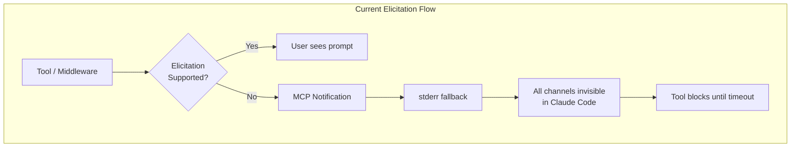
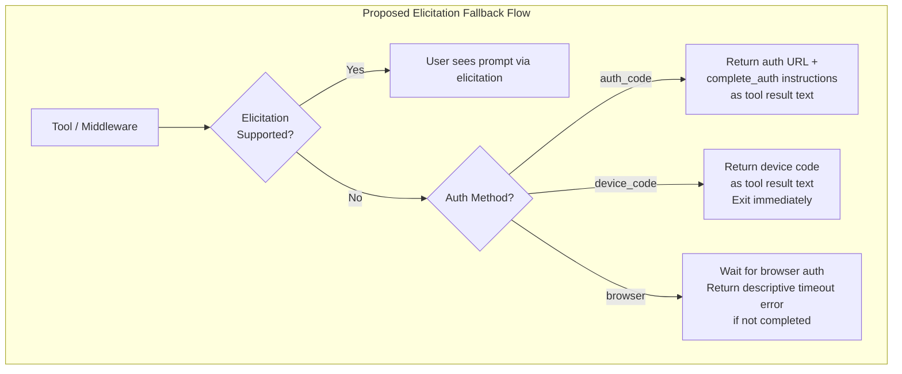
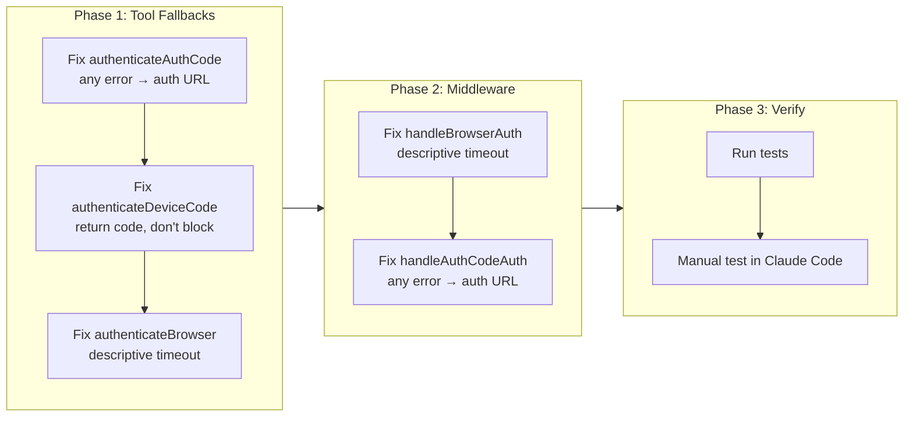

# CR-0031: Graceful Elicitation Fallback for MCP Clients Without Elicitation Support

## Change Summary

When MCP clients (e.g., Claude Code) do not support the MCP Elicitation protocol, the `add_account` tool and the auth middleware must degrade gracefully. Currently, authentication flows rely on elicitation to present auth URLs, device codes, and redirect URL prompts. When elicitation fails, the tool returns an opaque error (`elicitation request failed: Method not found`) instead of completing the auth flow through alternative means.

This CR ensures that all authentication methods (`browser`, `device_code`, `auth_code`) work end-to-end in MCP clients that lack elicitation support by routing all user-facing feedback through tool result text.

## Motivation and Background

Claude Code does not implement MCP Elicitation (`Method not found`). It also does not display MCP `LoggingMessageNotification` messages in the chat UI. Furthermore, **MCP server stderr is not surfaced to the user** -- it goes to Claude Code's internal diagnostics only. This means the only channel that reaches the user is the **tool result text** (success or error return value).

This means:

1. **`browser` method in `add_account`**: The browser opens (via `InteractiveBrowserCredential.Authenticate`) but the user gets no feedback. They don't know to switch to the browser window. The tool blocks waiting for auth to complete and eventually times out (~2 minutes). If the user doesn't notice the browser, auth fails.
2. **`device_code` method in `add_account`**: The device code is generated and captured internally. Elicitation fails, the code is written to stderr (not visible to user) and as a notification (not displayed). The tool then blocks waiting for the user to complete device code auth, which they can never do because they can't see the code. Eventually times out (~5 minutes).
3. **`auth_code` method in `add_account`**: The browser opens and the user authenticates, but the elicitation to collect the redirect URL fails. The error returned is the generic `"elicitation failed: elicitation request failed: Method not found"` instead of including the auth URL and `complete_auth` instructions.
4. **Auth middleware (`browser`)**: Elicitation fails, falls back to notification (not displayed) and stderr (not visible). The `InteractiveBrowserCredential` opens the browser but the user has no context. Works if user notices the browser window.

The primary account's `browser` auth works because the middleware calls `InteractiveBrowserCredential.Authenticate()` directly (which opens the browser as a side effect of `GetToken`). The `add_account` tool takes a different path through elicitation, which breaks.

### Key Insight: Tool Result Text is the Only User-Visible Channel

In Claude Code, **three** feedback channels are unavailable:
1. **MCP Elicitation** -- `Method not found`
2. **MCP LoggingMessageNotification** -- not displayed in chat UI
3. **MCP server stderr** -- goes to internal diagnostics, not shown to user

The **only** way to communicate with the user is through the tool's return value (success text or error text). All fallback strategies **MUST** use this channel.

## Change Drivers

* Claude Code (primary MCP client) does not support MCP Elicitation
* MCP notifications and stderr are invisible to Claude Code users
* `device_code` auth is completely broken -- the device code is never shown to the user
* `auth_code` auth returns an opaque error instead of actionable instructions
* `browser` auth times out silently without user context

## Current State

### Elicitation Dependency Matrix

| Auth Method | Tool/Middleware | Elicitation Used For | Current Fallback Chain | Result in Claude Code |
|---|---|---|---|---|
| `browser` | `add_account` | URL presentation | elicitation -> notification -> stderr | Browser opens silently, tool blocks ~2min, times out |
| `browser` | middleware | URL presentation | elicitation -> notification -> stderr | Browser opens silently, works if user notices browser |
| `device_code` | `add_account` | Device code display | elicitation -> notification -> stderr | Device code lost (all 3 channels invisible), tool blocks ~5min, times out |
| `auth_code` | `add_account` | Redirect URL collection | elicitation -> generic error | Immediate error, no auth URL or `complete_auth` instructions |
| `auth_code` | middleware | Redirect URL collection | elicitation -> generic error (non-`ErrElicitationNotSupported`) | Error with no auth URL or `complete_auth` instructions |

### Current State Diagram



### Observed Log Evidence (2026-03-15)

Testing `add_account` with all three auth methods in Claude Code confirmed the failures:

1. **`browser` (18:39:15)**: Elicitation failed -> browser opened silently -> tool blocked for ~2 minutes -> `InteractiveBrowserCredential: context deadline exceeded`
2. **`device_code` (18:40:12, 18:53:10)**: Device code captured -> elicitation failed -> stderr fallback triggered (invisible) -> tool blocked for ~5 minutes -> `DeviceCodeCredential: context deadline exceeded`
3. **`auth_code` (18:45:52)**: Immediate failure -> `"elicitation failed: elicitation request failed: Method not found"` -- no auth URL, no `complete_auth` instructions

### Error Recognition Gap

The `authenticateAuthCode` method checks for `mcpserver.ErrElicitationNotSupported` to decide whether to include the auth URL in the error message. However, Claude Code returns a different error (`elicitation request failed: Method not found`), which is not recognized. The fallback with the auth URL is never triggered.

### stderr Fallback is Insufficient

The current stderr fallbacks (added as a quick fix) do trigger correctly in the logs. However, Claude Code does not surface MCP server stderr to the user. The stderr output goes to Claude Code's internal MCP diagnostics only. This makes stderr no better than MCP notifications for user visibility.

## Proposed Change

### 1. `authenticateAuthCode`: Always include auth URL in elicitation errors

When any elicitation error occurs (not just `ErrElicitationNotSupported`), return the auth URL and `complete_auth` instructions in the error message. The browser already opens via `browser.OpenURL`, so the user just needs to know to use `complete_auth` afterward.

**File**: `internal/tools/add_account.go`, function `authenticateAuthCode`

```go
// Before:
if errors.Is(elicitErr, mcpserver.ErrElicitationNotSupported) {
    return fmt.Errorf("elicitation not supported by MCP client. Open this URL...")
}
return fmt.Errorf("elicitation failed: %w", elicitErr)

// After: any elicitation error triggers the fallback with auth URL
return fmt.Errorf(
    "elicitation not supported by MCP client. A browser window has opened for Microsoft login. "+
        "After signing in, copy the full URL from the browser's address bar and use the "+
        "complete_auth tool with redirect_url parameter and account label %q to finish authentication",
    label)
```

### 2. `authenticateDeviceCode`: Return device code as tool result text, don't block

When elicitation fails, the tool **MUST NOT** block waiting for auth to complete -- the user can't see the device code, so the tool will just hang until timeout. Instead:

1. Capture the device code message from the `DeviceCodeCredential` callback.
2. Detect elicitation failure.
3. **Return the device code message as the tool result text** (not error) and exit immediately.
4. The user sees the device code in the chat, completes the flow in their browser, then calls `add_account` again. The cached token will be picked up on the second call.

**File**: `internal/tools/add_account.go`, functions `authenticateDeviceCode` and `presentDeviceCodeElicitation`

**Note**: The current `authenticateDeviceCode` returns `error` (not `*mcp.CallToolResult`), and is called from `authenticateInline` which also returns `error`. The device code message cannot be returned as a `mcp.NewToolResultText` from within these functions. The implementation **MUST** use one of these approaches:

1. **Sentinel error with device code message**: Return a special error type (e.g., `DeviceCodeFallbackError`) that carries the device code message. The caller (`handleAddAccount`) checks for this error type and returns `mcp.NewToolResultText` instead of `mcp.NewToolResultError`.
2. **Change function signatures**: Modify `authenticateInline` and `authenticateDeviceCode` to return `(*mcp.CallToolResult, error)` so they can return tool results directly.

The recommended approach is (1) -- a sentinel error type -- as it minimizes signature changes:

```go
// DeviceCodeFallbackError is returned when elicitation fails during device code
// auth. It carries the device code message for the caller to return as a
// successful tool result.
type DeviceCodeFallbackError struct {
    Message string
}

func (e *DeviceCodeFallbackError) Error() string { return e.Message }

// In presentDeviceCodeElicitation, when elicitation fails:
// Instead of falling back to notification/stderr, return the error:
return &DeviceCodeFallbackError{Message: fmt.Sprintf(
    "Authentication requires a device code. %s\n\n"+
        "After completing the device code flow, call add_account again with label %q "+
        "to finish registration.",
    msg, label)}

// In handleAddAccount, check for the sentinel:
var dcErr *DeviceCodeFallbackError
if errors.As(authErr, &dcErr) {
    return mcp.NewToolResultText(dcErr.Message), nil
}
```

This is a fundamental change: instead of blocking on `Authenticate()` and falling back to invisible channels, the tool returns the device code to the user and exits. The blocking `Authenticate()` goroutine **MUST** be cancelled via context when the elicitation fallback is triggered.

### 3. `authenticateBrowser`: Improve timeout error message

The browser already opens via `InteractiveBrowserCredential.Authenticate()`. The stderr fallback triggers but is invisible to the user. The tool blocks for ~2 minutes and times out if the user doesn't notice the browser.

**File**: `internal/tools/add_account.go`, function `authenticateBrowser`

When elicitation fails, the tool **MUST** still wait for `Authenticate()` to complete (the browser is open), but **MUST** return a helpful tool result:

- **If auth succeeds** (user noticed the browser): Return success as normal.
- **If auth times out**: Return the timeout error with an explicit message: `"A browser window was opened for Microsoft login but authentication was not completed in time. Please try again -- when the browser opens, switch to it and complete the sign-in."`

### 4. Auth middleware `handleBrowserAuth`: Improve timeout error message

When elicitation fails in the auth middleware, the browser opens silently and auth may succeed if the user notices. The middleware **MUST** improve the error message returned when auth times out, so the user knows a browser was opened and can retry.

**File**: `internal/auth/middleware.go`, function `handleBrowserAuth`

### 5. Auth middleware `handleAuthCodeAuth`: Always include auth URL in elicitation errors

The middleware's `handleAuthCodeAuth` has the same elicitation fallback issue as `authenticateAuthCode` in `add_account.go`: it checks only for `ErrElicitationNotSupported` (line 326) and returns a generic error for other elicitation failures (line 335-336). When any elicitation error occurs, the middleware **MUST** return the auth URL and `complete_auth` instructions as tool result text.

**File**: `internal/auth/middleware.go`, function `handleAuthCodeAuth`

```go
// Before (middleware.go:325-336):
if elicitErr != nil {
    if errors.Is(elicitErr, mcpserver.ErrElicitationNotSupported) {
        slog.Info("elicitation not supported, returning auth URL for complete_auth tool")
        return mcp.NewToolResultText(fmt.Sprintf(
            "Authentication required. Open this URL in your browser to sign in:\n\n%s\n\n"+
                "After signing in, the browser will show a blank page. "+
                "Copy the full URL from the address bar and use the complete_auth tool "+
                "with the redirect_url parameter to finish authentication.",
            authURL)), nil
    }
    return mcp.NewToolResultError(fmt.Sprintf(
        "Authentication elicitation failed: %v", elicitErr)), nil
}

// After: any elicitation error triggers the fallback with auth URL
if elicitErr != nil {
    slog.Info("elicitation failed, returning auth URL for complete_auth tool", "error", elicitErr)
    return mcp.NewToolResultText(fmt.Sprintf(
        "Authentication required. A browser window has opened for Microsoft login.\n\n"+
            "After signing in, copy the full URL from the browser's address bar and use the "+
            "complete_auth tool with the redirect_url parameter to finish authentication.\n\n"+
            "Auth URL: %s",
        authURL)), nil
}
```

### Proposed State Diagram



## Requirements

### Functional Requirements

1. The `authenticateAuthCode` function **MUST** return the auth URL and `complete_auth` instructions in the tool result text when any elicitation error occurs, regardless of error type.
2. The `authenticateDeviceCode` function **MUST** return the device code message as successful tool result text when elicitation fails.
3. The `authenticateDeviceCode` function **MUST NOT** block waiting for authentication when elicitation fails -- it **MUST** cancel the blocking `Authenticate()` goroutine and return immediately.
4. The `authenticateBrowser` function **MUST** return a descriptive timeout error message mentioning the browser window when authentication times out after elicitation failure.
5. The auth middleware `handleBrowserAuth` **MUST** return a descriptive timeout error message mentioning the browser window when browser authentication times out.
6. The auth middleware `handleAuthCodeAuth` **MUST** return the auth URL and `complete_auth` instructions in the tool result text when any elicitation error occurs, regardless of error type.
7. All fallback paths **MUST** preserve existing behavior for MCP clients that support elicitation.

### Non-Functional Requirements

1. Fallback strategies **MUST NOT** depend on stderr being visible to the user. stderr **MUST** only be used for diagnostic purposes.
2. Fallback strategies **MUST NOT** depend on MCP notifications being displayed to the user.
3. The `device_code` fallback **MUST** return within seconds (not block for the ~5-minute device code timeout).

## Affected Components

* `internal/tools/add_account.go` -- `authenticateAuthCode`, `authenticateDeviceCode`, `authenticateBrowser` functions
* `internal/auth/middleware.go` -- `handleBrowserAuth`, `handleAuthCodeAuth` functions

## Scope Boundaries

### In Scope

* Error handling fallback paths in `add_account` tool for all three auth methods (`browser`, `device_code`, `auth_code`)
* Elicitation fallback in auth middleware for `browser` method (timeout error message)
* Elicitation fallback in auth middleware for `auth_code` method (auth URL in tool result text)
* Tool result text as the fallback communication channel

### Out of Scope ("Here, But Not Further")

* Implementing MCP Elicitation support in Claude Code -- external dependency, not under this project's control
* Changing MCP notification behavior -- protocol-level concern
* Modifying the happy path (elicitation-supported clients) -- existing behavior remains unchanged
* Adding new auth methods -- only fixing fallback for existing methods
* Refactoring the auth middleware's primary authentication flow

## Impact Assessment

### User Impact

Users of MCP clients without elicitation support (e.g., Claude Code) will be able to complete all three authentication methods. Currently, `device_code` and `auth_code` are completely broken, and `browser` silently times out. After this change, users will see actionable instructions or device codes directly in the tool result text.

### Technical Impact

Changes are limited to error handling fallback paths. No API surface changes. No new dependencies. The `device_code` fallback introduces a behavioral change: instead of blocking on `Authenticate()`, the tool returns immediately and relies on token caching for the second `add_account` call.

### Business Impact

Eliminates a critical usability blocker for the primary MCP client (Claude Code). Multi-account management via `add_account` becomes functional for all auth methods.

## Implementation Approach

Single-phase implementation modifying two files. All changes are in error handling fallback paths and do not affect the primary (elicitation-supported) flow.

### Implementation Flow



## Test Strategy

### Tests to Add

| Test File | Test Name | Description | Inputs | Expected Output |
|-----------|-----------|-------------|--------|-----------------|
| `internal/tools/add_account_test.go` | `TestAuthenticateAuthCode_ElicitationError_ReturnsAuthURL` | Verifies any elicitation error returns auth URL and complete_auth instructions | Elicitation returns non-`ErrElicitationNotSupported` error | Tool result text contains auth URL and `complete_auth` instructions |
| `internal/tools/add_account_test.go` | `TestAuthenticateDeviceCode_ElicitationError_ReturnsDeviceCode` | Verifies device code is returned as tool result text, not blocked | Elicitation fails after device code captured | Successful tool result containing device code message |
| `internal/tools/add_account_test.go` | `TestAuthenticateDeviceCode_ElicitationError_DoesNotBlock` | Verifies the function returns promptly without waiting for auth | Elicitation fails | Function returns within a short duration (not ~5min timeout) |
| `internal/tools/add_account_test.go` | `TestAuthenticateBrowser_Timeout_DescriptiveError` | Verifies timeout error mentions browser window | Auth times out after elicitation failure | Error text mentions browser was opened and suggests retry |
| `internal/auth/middleware_test.go` | `TestHandleBrowserAuth_Timeout_DescriptiveError` | Verifies middleware timeout error mentions browser | Browser auth times out | Error text mentions browser was opened |
| `internal/auth/middleware_test.go` | `TestHandleAuthCodeAuth_ElicitationError_ReturnsAuthURL` | Verifies middleware auth_code elicitation fallback returns auth URL and complete_auth instructions | Elicitation returns non-`ErrElicitationNotSupported` error | Tool result text contains auth URL and `complete_auth` instructions |
| `internal/tools/add_account_test.go` | `TestAuthenticateAuthCode_ElicitationSupported_NoFallback` | Verifies elicitation happy path works unchanged (AC-5) | Elicitation succeeds | Normal auth flow completes without fallback |
| `internal/tools/add_account_test.go` | `TestAuthenticateDeviceCode_ElicitationError_NoStderrDependency` | Verifies fallback does not depend on stderr or notifications (AC-6) | Elicitation fails | Tool result text contains device code; no stderr required for user visibility |

### Tests to Modify

| Test File | Test Name | Current Behavior | New Behavior | Reason for Change |
|-----------|-----------|------------------|--------------|-------------------|
| `internal/tools/add_account_test.go` | `TestAuthenticateAuthCode_ElicitationNotSupported` | Checks for `ErrElicitationNotSupported` specifically | Checks that any elicitation error triggers fallback with auth URL | Error type matching removed; all elicitation errors treated the same |

### Tests to Remove

Not applicable. No existing tests become redundant or test removed functionality.

## Acceptance Criteria

### AC-1: auth_code elicitation fallback includes auth URL

```gherkin
Given an MCP client that does not support elicitation
When the user calls add_account with auth_code method
  And elicitation fails with any error (not just ErrElicitationNotSupported)
Then the tool result text MUST include the auth URL
  And the tool result text MUST include instructions to use complete_auth with the account label
  And the browser MUST have opened automatically
```

### AC-2: device_code elicitation fallback returns device code immediately

```gherkin
Given an MCP client that does not support elicitation
When the user calls add_account with device_code method
  And the device code has been captured from the credential callback
  And elicitation fails
Then the tool MUST return the device code message as successful tool result text
  And the tool MUST NOT block waiting for the user to complete device code auth
  And the tool MUST cancel the blocking Authenticate() goroutine
```

### AC-3: browser elicitation fallback provides descriptive timeout

```gherkin
Given an MCP client that does not support elicitation
When the user calls add_account with browser method
  And the browser opens but the user does not complete auth
  And the authentication times out
Then the error message MUST state that a browser window was opened
  And the error message MUST suggest the user retry and switch to the browser
```

### AC-4: Middleware browser timeout provides descriptive error

```gherkin
Given an MCP client that does not support elicitation
When the auth middleware triggers browser authentication
  And the browser opens but the user does not complete auth
  And the authentication times out
Then the error message MUST state that a browser window was opened for Microsoft login
```

### AC-5: No regression for elicitation-supporting clients

```gherkin
Given an MCP client that supports elicitation
When the user calls add_account with any auth method
Then the elicitation flow MUST work as before
  And fallback behavior MUST NOT be triggered
```

### AC-7: Middleware auth_code elicitation fallback includes auth URL

```gherkin
Given an MCP client that does not support elicitation
When the auth middleware triggers auth_code re-authentication
  And elicitation fails with any error
Then the tool result text MUST include the auth URL
  And the tool result text MUST include instructions to use complete_auth
```

### AC-6: No reliance on invisible channels

```gherkin
Given an MCP client that does not support elicitation
When any authentication fallback path is triggered
Then the user-facing feedback MUST be delivered via tool result text only
  And the fallback MUST NOT depend on stderr being visible
  And the fallback MUST NOT depend on MCP notifications being displayed
```

## Quality Standards Compliance

### Build & Compilation

- [x] Code compiles/builds without errors
- [x] No new compiler warnings introduced

### Linting & Code Style

- [x] All linter checks pass with zero warnings/errors
- [x] Code follows project coding conventions and style guides
- [x] Any linter exceptions are documented with justification

### Test Execution

- [x] All existing tests pass after implementation
- [x] All new tests pass
- [ ] Test coverage meets project requirements for changed code

### Documentation

- [x] Inline code documentation updated where applicable
- [ ] API documentation updated for any API changes
- [ ] User-facing documentation updated if behavior changes

### Code Review

- [ ] Changes submitted via pull request
- [ ] PR title follows Conventional Commits format
- [ ] Code review completed and approved
- [ ] Changes squash-merged to maintain linear history

### Verification Commands

```bash
# Build verification
go build ./cmd/outlook-local-mcp/

# Lint verification
golangci-lint run

# Test execution
go test ./...

# Full CI check
make ci
```

## Risks and Mitigation

### Risk 1: Device code token caching between calls

**Likelihood:** low
**Impact:** medium
**Mitigation:** The `device_code` fallback relies on the user completing auth externally and then calling `add_account` again, expecting the cached token to be picked up. Verify that the token cache persists between tool invocations and that a second `add_account` call with the same label detects the existing token.

### Risk 2: Race condition in device code goroutine cancellation

**Likelihood:** low
**Impact:** low
**Mitigation:** When elicitation fails for `device_code`, the blocking `Authenticate()` goroutine must be cancelled via context. Ensure the context cancellation propagates correctly and does not leak goroutines.

## Dependencies

* CR-0030 (Manual Auth Code Flow) -- **MUST** be implemented first, as this CR modifies the `authenticateAuthCode` error handling introduced by CR-0030
* No external dependencies

## Estimated Effort

2-4 person-hours. Changes are limited to error handling paths in two files with straightforward logic modifications.

## Decision Outcome

Chosen approach: "Route all user-facing fallback feedback through tool result text", because tool result text is the only guaranteed user-visible channel in MCP clients that lack elicitation, notification, and stderr visibility. This approach requires no protocol changes and is backward-compatible with clients that do support elicitation.

## Related Items

* CR-0030: Manual Auth Code Flow (`auth_code` method and `complete_auth` tool)
* `internal/tools/add_account.go`: Primary implementation target
* `internal/auth/middleware.go`: Secondary implementation target

<!--
## CR-0031 Review Summary (2026-03-15)

**Findings: 9 | Fixes applied: 9 | Unresolvable: 0**

### Findings and Fixes

1. **[Contradiction] Middleware `handleAuthCodeAuth` missing from scope**: The CR's Elicitation
   Dependency Matrix listed `auth_code | middleware` but the Affected Components, Functional
   Requirements, ACs, Implementation Approach, and Test Strategy all omitted it. The middleware's
   `handleAuthCodeAuth` (middleware.go:324-336) has the identical elicitation fallback bug.
   **Fix**: Added FR-6 (middleware auth_code), AC-7, Proposed Change section 5, Implementation
   Flow Phase 2 node, Affected Components entry, In Scope entry, and test entry.

2. **[Contradiction] `authenticateDeviceCode` return type mismatch**: The CR proposed returning
   `mcp.NewToolResultText` from `authenticateDeviceCode`, but the function returns `error` (not
   `*mcp.CallToolResult`). The proposed code would not compile.
   **Fix**: Replaced the code snippet with a sentinel error type approach (`DeviceCodeFallbackError`)
   that the caller checks and converts to `mcp.NewToolResultText`.

3. **[Ambiguity] AC-5 double negative**: "no fallback behavior MUST be triggered" is grammatically
   ambiguous. **Fix**: Changed to "fallback behavior MUST NOT be triggered".

4. **[Coverage Gap] AC-5 had no test entry**: AC-5 (no regression for elicitation-supporting
   clients) had no corresponding test in the Test Strategy table.
   **Fix**: Added `TestAuthenticateAuthCode_ElicitationSupported_NoFallback`.

5. **[Coverage Gap] AC-6 had no test entry**: AC-6 (no reliance on invisible channels) had no
   corresponding test in the Test Strategy table.
   **Fix**: Added `TestAuthenticateDeviceCode_ElicitationError_NoStderrDependency`.

6. **[Scope] Elicitation Dependency Matrix `auth_code | middleware` description inaccurate**:
   Listed "notification -> stderr" fallback chain, but actual code returns a generic error.
   **Fix**: Updated to "elicitation -> generic error (non-`ErrElicitationNotSupported`)".

7. **Status updated**: Changed from "proposed" to "approved".

### Reviewer Notes

- The `device_code` sentinel error approach (finding 2) is a recommendation. Implementers MAY
  choose to change function signatures instead, as long as the device code message reaches the
  user via tool result text and the function does not block.
- The Proposed State Diagram covers add_account flows only. A separate middleware diagram was
  not added to keep the CR concise; the textual description in sections 4 and 5 is sufficient.
-->
