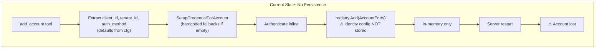
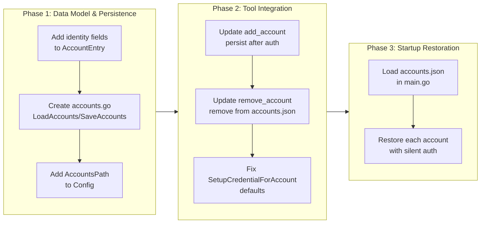

# CR-0032: Per-Account Identity Configuration (Client ID and Tenant ID)

## Change Summary

Enable full per-account configuration of `client_id` and `tenant_id` so that each account can authenticate against a different Entra ID tenant using a different app registration. Currently, the `add_account` tool accepts these parameters at creation time, but they are not persisted — on server restart, accounts are lost and must be re-added. This CR introduces persistent per-account identity configuration via a JSON accounts file, and restores accounts automatically on startup.

## Motivation and Background

Users may have multiple Microsoft 365 accounts across different organizations:

- **Account A**: `user@company-a.com` using client ID `aaaa-...` in tenant `tenant-a`
- **Account B**: `user@company-b.com` using client ID `bbbb-...` in tenant `tenant-b`

Each organization may have its own app registration with different permissions, redirect URIs, or conditional access policies. The server must support this without requiring all accounts to share the same client ID or tenant.

## Change Drivers

* Multi-tenant users need per-account app registrations with different client IDs and tenant IDs
* Accounts added via `add_account` are lost on server restart — identity configuration is not persisted
* `SetupCredentialForAccount` falls back to hardcoded values instead of server config defaults when `client_id` or `tenant_id` are empty
* The `AccountEntry` struct stores only runtime objects — no identity metadata is recorded for later reconstruction

## Current State

### AccountEntry (registry.go)

The `AccountEntry` struct stores only runtime objects (`Credential`, `Client`, `Authenticator`, `AuthRecordPath`, `CacheName`). The `client_id`, `tenant_id`, and `auth_method` used during credential creation are not recorded, making it impossible to reconstruct the account after a restart.

### add_account Tool (add_account.go)

The `handleAddAccount` function extracts optional parameters with config defaults (lines 169-171):

```go
clientID := request.GetString("client_id", cfg.ClientID)
tenantID := request.GetString("tenant_id", cfg.TenantID)
authMethod := request.GetString("auth_method", cfg.AuthMethod)
```

These values are passed to `SetupCredentialForAccount` but are not stored in the `AccountEntry` (lines 200-207). After authentication succeeds, the identity configuration is discarded.

### SetupCredentialForAccount (auth.go)

When `clientID` or `tenantID` are empty, the function falls back to hardcoded values (lines 363-371) rather than the server config defaults:

```go
if clientID == "" {
    clientID = "dd5fc5c5-eb9a-4f6f-97bd-1a9fecb277d3"
}
if tenantID == "" {
    tenantID = "common"
}
```

This creates an inconsistency: `handleAddAccount` defaults to `cfg.ClientID` before calling this function, but any other caller passing empty strings gets the hardcoded default instead.

### Startup (main.go)

On startup, only the primary account is restored from the global auth record (lines 80-110). There is no mechanism to discover or restore additional accounts that were added via `add_account` in previous sessions.

### remove_account Tool (remove_account.go)

The `HandleRemoveAccount` function removes the account from the in-memory registry only. There is no persistent state to clean up.

### Current State Diagram



## Proposed Change

### 1. Persistent Accounts Configuration File

Introduce `~/.outlook-local-mcp/accounts.json` to persist per-account identity configuration:

```json
{
  "accounts": [
    {
      "label": "redeploy",
      "client_id": "dd5fc5c5-eb9a-4f6f-97bd-1a9fecb277d3",
      "tenant_id": "common",
      "auth_method": "browser"
    },
    {
      "label": "contoso",
      "client_id": "eeee-eeee-eeee-eeee",
      "tenant_id": "contoso.onmicrosoft.com",
      "auth_method": "device_code"
    }
  ]
}
```

The file path is derived from the existing `AuthRecordPath` directory (same directory as per-account auth records).

### 2. Extend AccountEntry with Identity Metadata

Add identity configuration fields to `AccountEntry`:

```go
type AccountEntry struct {
    Label          string
    ClientID       string                          // NEW
    TenantID       string                          // NEW
    AuthMethod     string                          // NEW
    Credential     azcore.TokenCredential
    Authenticator  Authenticator
    Client         *msgraphsdk.GraphServiceClient
    AuthRecordPath string
    CacheName      string
}
```

### 3. Persist on add_account, Restore on Startup

- **On `add_account`**: After successful authentication and registry addition, append the account config to `accounts.json`.
- **On `remove_account`**: Remove the account entry from `accounts.json`.
- **On startup (`main.go`)**: Read `accounts.json`, call `SetupCredentialForAccount` for each entry, attempt silent token acquisition, and register in the registry. Accounts that fail silent auth are registered but flagged as needing re-authentication (handled by the existing auth middleware).

### 4. Fix SetupCredentialForAccount Defaults

`SetupCredentialForAccount` **MUST** use the server config defaults (passed as parameters) instead of hardcoded values when `client_id` or `tenant_id` are empty. This ensures consistency with the `add_account` parameter extraction in `handleAddAccount`.

### 5. Environment Variable Override

Add `OUTLOOK_MCP_ACCOUNTS_PATH` to override the default accounts file location.

### Proposed State Diagram

```mermaid
flowchart TD
    subgraph Proposed["Proposed State: Persistent Accounts"]
        AddTool["add_account tool"] --> Extract["Extract client_id, tenant_id, auth_method<br/>(defaults from cfg)"]
        Extract --> Setup["SetupCredentialForAccount<br/>(cfg defaults, not hardcoded)"]
        Setup --> Auth["Authenticate inline"]
        Auth --> Register["registry.Add(AccountEntry)<br/>✓ identity config stored"]
        Register --> Persist["SaveAccounts(accounts.json)"]
        Persist --> Restart["Server restart"]
        Restart --> Load["LoadAccounts(accounts.json)"]
        Load --> Restore["SetupCredentialForAccount<br/>per entry"]
        Restore --> Silent["Silent token acquisition<br/>(from per-account cache)"]
        Silent --> Ready["Account restored and ready"]
    end
```



## Requirements

### Functional Requirements

1. The `AccountEntry` struct **MUST** include `ClientID`, `TenantID`, and `AuthMethod` fields.
2. The `add_account` tool **MUST** populate identity fields in `AccountEntry` before registry addition.
3. The `add_account` tool **MUST** persist the account identity configuration to `accounts.json` after successful authentication and registry addition.
4. The `remove_account` tool **MUST** remove the account identity configuration from `accounts.json` when removing an account.
5. On startup, the server **MUST** read `accounts.json` and restore all previously added accounts using `SetupCredentialForAccount`.
6. Restored accounts **MUST** attempt silent token acquisition from the per-account cache. Accounts that fail silent auth **MUST** still be registered (the auth middleware handles re-authentication).
7. `SetupCredentialForAccount` **MUST** accept default values as parameters instead of using hardcoded fallbacks when `client_id` or `tenant_id` are empty.
8. The `OUTLOOK_MCP_ACCOUNTS_PATH` environment variable **MUST** override the default accounts file location.
9. The server **MUST** start normally when `accounts.json` does not exist (zero additional accounts).
10. The `accounts.json` file **MUST** use JSON format consistent with existing auth record files.

### Non-Functional Requirements

1. The accounts file read/write operations **MUST** be atomic to prevent corruption from concurrent access or crashes.
2. The accounts file **MUST NOT** store secrets (tokens, passwords). Only identity configuration metadata (label, client_id, tenant_id, auth_method) **MUST** be persisted.
3. Startup restoration **MUST NOT** block indefinitely — silent token acquisition **MUST** use a bounded timeout per account.

## Affected Components

* `internal/auth/registry.go` — `AccountEntry` struct (add identity fields)
* `internal/auth/accounts.go` — **NEW** file for `LoadAccounts`, `SaveAccounts`, `AddAccountConfig`, `RemoveAccountConfig`
* `internal/auth/auth.go` — fix `SetupCredentialForAccount` to use parameter-based defaults instead of hardcoded values
* `internal/tools/add_account.go` — persist identity config after auth; populate new `AccountEntry` fields
* `internal/tools/remove_account.go` — remove identity config from `accounts.json`
* `internal/config/config.go` — add `AccountsPath` field and `OUTLOOK_MCP_ACCOUNTS_PATH` env var
* `cmd/outlook-local-mcp/main.go` — restore accounts from `accounts.json` on startup

## Scope Boundaries

### In Scope

* Per-account identity metadata storage in `AccountEntry`
* JSON-based persistent accounts configuration file (`accounts.json`)
* Automatic persistence on `add_account` and cleanup on `remove_account`
* Startup restoration of persisted accounts via silent token acquisition
* Fix `SetupCredentialForAccount` to use passed defaults instead of hardcoded values
* Environment variable override for accounts file path

### Out of Scope ("Here, But Not Further")

* Migrating existing single-account configurations — no migration needed; absence of `accounts.json` preserves current behavior
* Encrypting the accounts file — the file contains only non-secret identity metadata (client_id, tenant_id, auth_method)
* UI for managing accounts — accounts are managed exclusively through the `add_account` and `remove_account` MCP tools
* Automatic re-authentication of restored accounts on startup — the auth middleware handles re-auth on first tool call
* Per-account permission scoping — all accounts use the same `Calendars.ReadWrite` scope

## Impact Assessment

### User Impact

Users who add multiple accounts via `add_account` will no longer need to re-add them after every server restart. Accounts persist across sessions and are silently restored from the per-account token cache. No user workflow changes are required — the `add_account` and `remove_account` tools behave identically from the user's perspective, with the addition of automatic persistence.

### Technical Impact

Additive change. No existing behavior is modified for single-account operation or servers without `accounts.json`. The `AccountEntry` struct gains three new string fields. A new file (`internal/auth/accounts.go`) provides the persistence layer. The `SetupCredentialForAccount` default handling changes from hardcoded values to parameter-based defaults, which aligns the function with how `handleAddAccount` already calls it (passing `cfg.ClientID`/`cfg.TenantID`).

### Business Impact

Eliminates friction for multi-account users who currently lose their account setup on every server restart. Enables real-world multi-tenant scenarios (consulting, MSP, multi-org users).

## Implementation Approach

Three-phase implementation: (1) data model and persistence layer, (2) tool integration, (3) startup restoration.

### Implementation Flow



## Test Strategy

### Tests to Add

| Test File | Test Name | Description | Inputs | Expected Output |
|-----------|-----------|-------------|--------|-----------------|
| `internal/auth/accounts_test.go` | `TestSaveAndLoadAccounts` | Round-trip save and load of accounts config | Two account entries with different identity configs | Loaded accounts match saved accounts |
| `internal/auth/accounts_test.go` | `TestLoadAccounts_FileNotExist` | Loading when no accounts file exists | Non-existent file path | Empty accounts list, no error |
| `internal/auth/accounts_test.go` | `TestAddAccountConfig` | Appending a new account to existing file | Existing file with 1 account, new account config | File contains 2 accounts |
| `internal/auth/accounts_test.go` | `TestRemoveAccountConfig` | Removing an account from existing file | Existing file with 2 accounts, label to remove | File contains 1 account |
| `internal/auth/accounts_test.go` | `TestRemoveAccountConfig_NotFound` | Removing a non-existent account label | Existing file, non-existent label | No error, file unchanged |
| `internal/auth/registry_test.go` | `TestAccountEntry_IdentityFields` | Verifying identity fields are stored in registry | AccountEntry with ClientID, TenantID, AuthMethod | Fields accessible after Add and Get |
| `internal/tools/add_account_test.go` | `TestHandleAddAccount_PersistsConfig` | Verifying add_account writes to accounts.json | Successful add_account call | accounts.json contains the new account |
| `internal/tools/remove_account_test.go` | `TestHandleRemoveAccount_CleansUpConfig` | Verifying remove_account removes from accounts.json | Successful remove_account call | accounts.json no longer contains the account |
| `internal/auth/accounts_test.go` | `TestRestoreAccounts_Success` | Verifying accounts are restored from accounts.json on startup | accounts.json with 2 entries, valid cached tokens | Both accounts registered in registry with non-nil Graph clients |
| `internal/auth/accounts_test.go` | `TestRestoreAccounts_SilentAuthFailure` | Verifying accounts with expired tokens are still registered | accounts.json with 1 entry, expired token with no refresh token | Account registered in registry (re-auth deferred to middleware) |
| `internal/config/config_test.go` | `TestLoadConfig_AccountsPathEnvVar` | Verifying OUTLOOK_MCP_ACCOUNTS_PATH env var overrides default | OUTLOOK_MCP_ACCOUNTS_PATH set to custom path | Config.AccountsPath equals the custom path |

### Tests to Modify

| Test File | Test Name | Current Behavior | New Behavior | Reason for Change |
|-----------|-----------|------------------|--------------|-------------------|
| `internal/tools/add_account_test.go` | `TestHandleAddAccount_Success` | Asserts AccountEntry has Label, Credential, Client | Also asserts AccountEntry has ClientID, TenantID, AuthMethod | New fields added to AccountEntry |
| `internal/auth/auth_test.go` | `TestSetupCredentialForAccount_Defaults` | Expects hardcoded default client ID when empty | Expects parameter-based defaults | Default handling changed |

### Tests to Remove

Not applicable. No existing tests become redundant or test removed functionality.

## Acceptance Criteria

### AC-1: Per-account identity stored in registry

```gherkin
Given an account is added via add_account with client_id "aaaa" and tenant_id "tenant-a"
When the account is retrieved from the registry
Then the AccountEntry MUST have ClientID "aaaa"
  And the AccountEntry MUST have TenantID "tenant-a"
  And the AccountEntry MUST have AuthMethod matching the value used during creation
```

### AC-2: Account config persisted on add_account

```gherkin
Given a server with an empty or non-existent accounts.json
When the user calls add_account with label "contoso" and client_id "bbbb"
  And authentication succeeds
Then accounts.json MUST contain an entry with label "contoso" and client_id "bbbb"
```

### AC-3: Account config removed on remove_account

```gherkin
Given accounts.json contains entries for "contoso" and "redeploy"
When the user calls remove_account with label "contoso"
Then accounts.json MUST no longer contain an entry with label "contoso"
  And accounts.json MUST still contain the entry for "redeploy"
```

### AC-4: Accounts restored on startup

```gherkin
Given accounts.json contains entries for "contoso" and "redeploy"
  And both accounts have valid cached tokens
When the server starts
Then the registry MUST contain entries for "contoso" and "redeploy"
  And each entry MUST have a non-nil Graph client
```

### AC-5: Startup tolerates missing accounts file

```gherkin
Given no accounts.json file exists
When the server starts
Then the server MUST start normally with only the default account
  And the server MUST NOT emit an error log entry about a missing accounts.json
```

### AC-6: Startup tolerates failed silent auth

```gherkin
Given accounts.json contains an entry for "expired-account"
  And the cached token for "expired-account" is expired with no refresh token
When the server starts
Then the account MUST still be registered in the registry
  And the auth middleware MUST handle re-authentication on first tool call
```

### AC-7: Defaults chain uses server config

```gherkin
Given the server is configured with client_id "xxxx" and tenant_id "org-tenant"
When add_account is called without specifying client_id or tenant_id
Then SetupCredentialForAccount MUST receive "xxxx" as client_id
  And SetupCredentialForAccount MUST receive "org-tenant" as tenant_id
  And hardcoded defaults MUST NOT be used
```

### AC-8: Environment variable overrides accounts file path

```gherkin
Given the environment variable OUTLOOK_MCP_ACCOUNTS_PATH is set to "/tmp/custom-accounts.json"
When the server starts and an account is added via add_account
Then the server MUST read from and write to "/tmp/custom-accounts.json"
  And the default accounts file path MUST NOT be used
```

## Quality Standards Compliance

### Build & Compilation

- [x] Code compiles/builds without errors
- [x] No new compiler warnings introduced

### Linting & Code Style

- [x] All linter checks pass with zero warnings/errors
- [x] Code follows project coding conventions and style guides
- [x] Any linter exceptions are documented with justification

### Test Execution

- [x] All existing tests pass after implementation
- [x] All new tests pass
- [x] Test coverage meets project requirements for changed code

### Documentation

- [x] Inline code documentation updated where applicable
- [ ] API documentation updated for any API changes
- [ ] User-facing documentation updated if behavior changes

### Code Review

- [x] Changes submitted via pull request
- [x] PR title follows Conventional Commits format
- [ ] Code review completed and approved
- [ ] Changes squash-merged to maintain linear history

### Verification Commands

```bash
# Build verification
go build ./cmd/outlook-local-mcp/

# Lint verification
golangci-lint run

# Test execution
go test ./...

# Full CI check
make ci
```

## Risks and Mitigation

### Risk 1: Concurrent access to accounts.json

**Likelihood:** low
**Impact:** medium
**Mitigation:** Use atomic write (write to temp file, then rename) to prevent corruption from crashes during write. Concurrent MCP tool calls that modify accounts are serialized by the registry mutex, so concurrent writes are unlikely but the atomic pattern provides defense-in-depth.

### Risk 2: Startup delay from many accounts with expired tokens

**Likelihood:** low
**Impact:** low
**Mitigation:** Apply a bounded per-account timeout (e.g., 5 seconds) for silent token acquisition on startup. Accounts that fail silent auth are still registered — the auth middleware handles re-authentication on first use. Log a warning for each account that requires re-authentication.

### Risk 3: accounts.json contains stale entries for removed app registrations

**Likelihood:** low
**Impact:** low
**Mitigation:** If `SetupCredentialForAccount` fails for a persisted account on startup (e.g., invalid client_id), log a warning and skip the account. Do not remove it from `accounts.json` automatically — the user may fix the app registration and restart.

## Dependencies

* CR-0030 (Manual Auth Code Flow) — **MUST** be implemented first, as the `auth_code` auth method and `SetupCredentialForAccount` were introduced/modified by CR-0030
* CR-0031 (Elicitation Fallback) — recommended before this CR, as restored accounts may need re-authentication through the fallback paths
* No external library dependencies

## Estimated Effort

4-6 person-hours. Phase 1 (data model + persistence) is straightforward JSON serialization. Phase 2 (tool integration) requires wiring persistence into existing handlers. Phase 3 (startup restoration) requires iterating over accounts and handling silent auth failures gracefully.

## Decision Outcome

Chosen approach: "JSON accounts file in the auth record directory", because it uses the same directory and format as existing per-account auth records, requires no new dependencies, and provides a simple file-based persistence mechanism that is easy to inspect and debug. The file stores only non-secret identity metadata, avoiding any security concerns about credential storage.

## Related Items

* CR-0025: Multi-Account Elicitation — introduced the `AccountRegistry` and `add_account`/`remove_account` tools
* CR-0030: Manual Auth Code Flow — introduced `auth_code` method and `SetupCredentialForAccount`
* CR-0031: Elicitation Fallback — ensures fallback auth paths work for restored accounts needing re-authentication
* `internal/auth/registry.go`: `AccountEntry` struct and `AccountRegistry`
* `internal/tools/add_account.go`: Primary tool integration target
* `cmd/outlook-local-mcp/main.go`: Startup restoration target

<!--
## CR Review Summary (2026-03-15)

**Reviewer**: CR Reviewer Agent
**Findings**: 6
**Fixes applied**: 6
**Unresolvable items**: 0

### Findings and Fixes

1. **SCOPE: Missing affected component** — `internal/auth/auth.go` is modified in Phase 2
   (fix `SetupCredentialForAccount` defaults) but was not listed in Affected Components.
   **Fix**: Added `internal/auth/auth.go` to the Affected Components list.

2. **AMBIGUITY: AC-4 vague language** — "functional Graph client" is not testable.
   **Fix**: Changed to "non-nil Graph client".

3. **AMBIGUITY: AC-5 awkward phrasing** — "no error MUST be logged" is grammatically
   ambiguous.
   **Fix**: Changed to "the server MUST NOT emit an error log entry about a missing
   accounts.json".

4. **COVERAGE: FR-8 has no AC** — Functional Requirement 8 (OUTLOOK_MCP_ACCOUNTS_PATH
   env var override) had no corresponding Acceptance Criterion.
   **Fix**: Added AC-8 covering the environment variable override behavior.

5. **COVERAGE: AC-4 has no test** — AC-4 (accounts restored on startup) had no
   corresponding entry in the Test Strategy table.
   **Fix**: Added `TestRestoreAccounts_Success` to the Tests to Add table.

6. **COVERAGE: AC-6 has no test** — AC-6 (startup tolerates failed silent auth) had no
   corresponding entry in the Test Strategy table.
   **Fix**: Added `TestRestoreAccounts_SilentAuthFailure` to the Tests to Add table.
   Also added `TestLoadConfig_AccountsPathEnvVar` for AC-8.
-->
