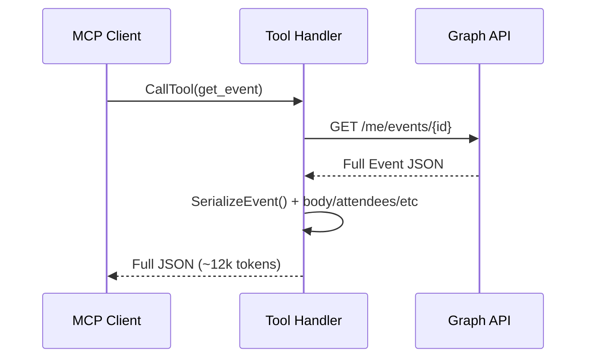
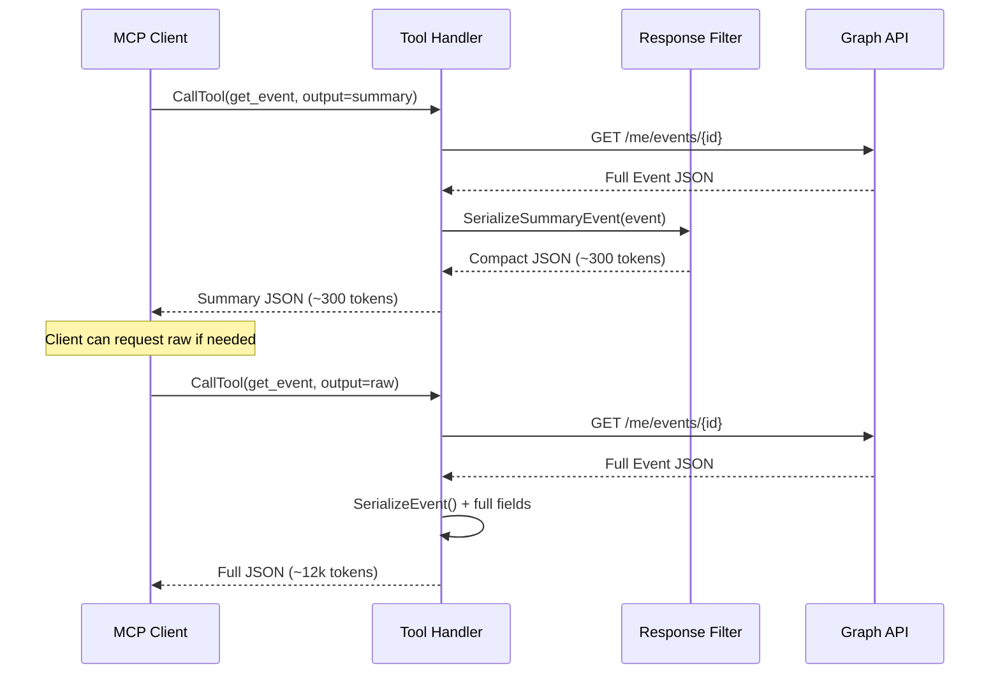
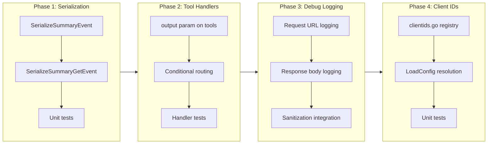

# MCP Server-Side Response Filtering and Well-Known Client IDs

## Change Summary

MCP tool responses currently return raw Graph API JSON, including full HTML email bodies, verbose metadata, and meeting details that consume excessive LLM context tokens. This CR introduces server-side response filtering that defaults to minimal, human-readable summaries with machine-addressable identifiers, while preserving a `raw` output mode for full Graph API data. Additionally, debug-level logging **MUST** include Graph API request/response payloads for troubleshooting.

This CR also introduces well-known client ID constants so that `OUTLOOK_MCP_CLIENT_ID` can be configured by friendly name (e.g., `outlook-desktop`, `teams-desktop`) instead of requiring users to look up and paste raw GUIDs.

## Motivation and Background

When an LLM-based MCP client (e.g., Claude Code) calls tools like `get_event`, the response can exceed 12,000 tokens for a single event due to HTML body content, Teams meeting boilerplate, SafeLinks URLs, and inline CSS. This rapidly exhausts the LLM's context window — a 6-event `list_events` followed by 6 `get_event` calls consumed ~42k tokens of a 200k context (21%) in a real session. The information density is extremely low: the LLM extracts maybe 200 tokens of useful data (subject, time, attendees, location) from 12,000 tokens of raw response.

A human looking at the same event in Outlook sees a concise summary: subject, time, location, attendees, and a short body preview. The MCP server should return similarly concise data by default, with identifiers that allow the client to request full details when needed.

## Change Drivers

* **Context window exhaustion**: A single `get_event` response can consume 6% of a 200k context window, making multi-event queries unsustainable.
* **Low information density**: HTML bodies with inline CSS, SafeLinks, Teams boilerplate contribute zero value to LLM reasoning.
* **Cost efficiency**: Larger context means higher API costs for the LLM consumer.
* **Debugging capability gap**: Graph API request/response data is not logged at any level, making it difficult to diagnose API issues.
* **Client ID usability**: Users must look up and copy raw GUIDs for `OUTLOOK_MCP_CLIENT_ID`. Well-known names improve configuration ergonomics.

## Current State

### MCP Response Behavior

All tool handlers serialize the full Graph API response into JSON and return it as `mcp.CallToolResult` text. There is no filtering, summarization, or output mode selection.

* `list_events` returns `SerializeEvent()` for each event — ~15 fields including `webLink`, all enum values, and online meeting URLs.
* `get_event` returns `SerializeEvent()` plus full `body` (HTML content), `bodyPreview`, `attendees`, `locations`, `recurrence`, `responseStatus`, `seriesMasterId`, `type`, `hasAttachments`, `createdDateTime`, `lastModifiedDateTime`.
* The HTML body often contains thousands of characters of Teams meeting invites, SafeLinks URLs, and CSS styling.

### Logging Behavior

Tool handlers log at three levels:
* `Debug`: tool invocation parameters (e.g., event_id, timezone).
* `Info`: tool completion with duration and count.
* `Error`: Graph API failures.

Graph API HTTP request/response payloads are never logged at any level.

### Current Response Flow



## Proposed Change

### 1. Response Output Modes

Introduce an `output` parameter on all read tools (`list_events`, `get_event`, `search_events`, `get_free_busy`, `list_calendars`, `list_accounts`) with two modes:

* **`summary`** (default): Returns a concise, human-readable representation of the data. Similar to what a user sees in Outlook's calendar view. Includes machine-readable identifiers (event IDs) so the client can request more detail if needed.
* **`raw`**: Returns the current full JSON response, unchanged from today's behavior.

### 2. Summary Format Design

The summary format for events **MUST** resemble what a human sees in Outlook:

**`list_events` summary** — compact per-event lines:
```json
[
  {
    "id": "AAMk...",
    "subject": "Weekly Sync",
    "start": "2026-03-16T09:30:00",
    "end": "2026-03-16T10:00:00",
    "location": "Conference Room A",
    "organizer": "Jane Smith",
    "showAs": "busy",
    "isOnlineMeeting": true
  }
]
```

Fields included in `list_events` summary: `id`, `subject`, `start` (dateTime only, no timeZone wrapper), `end` (dateTime only), `location` (display name string), `organizer` (name only string), `showAs`, `isOnlineMeeting`.

Fields excluded from `list_events` summary: `webLink`, `importance`, `sensitivity`, `categories`, `isCancelled`, `isAllDay`, `onlineMeetingUrl`, nested start/end timeZone.

**`get_event` summary** — adds attendees and body preview:
```json
{
  "id": "AAMk...",
  "subject": "Weekly Sync",
  "start": "2026-03-16T09:30:00",
  "end": "2026-03-16T10:00:00",
  "location": "Conference Room A",
  "organizer": "Jane Smith",
  "showAs": "busy",
  "isOnlineMeeting": true,
  "attendees": [
    {"name": "Alice Johnson", "response": "notResponded"},
    {"name": "Bob Williams", "response": "accepted"}
  ],
  "bodyPreview": "Round table discussion. Everyone shares updates...",
  "hasAttachments": false,
  "type": "occurrence"
}
```

Fields included in `get_event` summary: everything from `list_events` summary plus `attendees` (name + response only, no email/type), `bodyPreview` (plain text, not HTML body), `hasAttachments`, `type`.

Fields excluded from `get_event` summary: `body` (full HTML), `locations` (array), `recurrence`, `responseStatus`, `seriesMasterId`, `createdDateTime`, `lastModifiedDateTime`, `webLink`, `categories`, `importance`, `sensitivity`, attendee email/type.

**`search_events` summary** — uses the same format as `list_events` summary (compact per-event lines with 8 fields), since search results are calendar events.

**`get_free_busy`, `list_calendars`, `list_accounts` summary** — these tools already return compact responses (4, 7, and 2 fields respectively). The `summary` and `raw` output modes **MUST** return identical responses for these tools. The `output` parameter **MUST** still be accepted for API consistency but has no filtering effect.

### 3. Well-Known Client ID Constants

The `OUTLOOK_MCP_CLIENT_ID` environment variable currently accepts only raw UUIDs. This change adds a lookup table of well-known Microsoft 365 client application IDs so users can configure by friendly name instead.

**Constant registry** in `internal/config/clientids.go`:

| Friendly Name | Client ID | Application |
|---------------|-----------|-------------|
| `outlook-local-mcp` | `dd5fc5c5-eb9a-4f6f-97bd-1a9fecb277d3` | Outlook Local MCP (project default) |
| `teams-desktop` | `1fec8e78-bce4-4aaf-ab1b-5451cc387264` | Teams desktop & mobile |
| `teams-web` | `5e3ce6c0-2b1f-4285-8d4b-75ee78787346` | Teams web |
| `m365-web` | `4765445b-32c6-49b0-83e6-1d93765276ca` | Microsoft 365 web |
| `m365-desktop` | `0ec893e0-5785-4de6-99da-4ed124e5296c` | Microsoft 365 desktop |
| `m365-mobile` | `d3590ed6-52b3-4102-aeff-aad2292ab01c` | Microsoft 365 mobile |
| `outlook-desktop` | `d3590ed6-52b3-4102-aeff-aad2292ab01c` | Outlook desktop |
| `outlook-web` | `bc59ab01-8403-45c6-8796-ac3ef710b3e3` | Outlook web |
| `outlook-mobile` | `27922004-5251-4030-b22d-91ecd9a37ea4` | Outlook mobile |

**Resolution logic** in `LoadConfig`:

1. Read `OUTLOOK_MCP_CLIENT_ID` value.
2. If the value matches a key in the well-known registry (case-insensitive), resolve it to the corresponding UUID.
3. If the value looks like a UUID (contains hyphens or is 32+ hex chars), use it as-is.
4. If the value matches neither a well-known name nor a UUID pattern, log a warning listing valid well-known names and use the value as-is.

**Default behavior**: The default value remains `"outlook-local-mcp"` which resolves to `dd5fc5c5-eb9a-4f6f-97bd-1a9fecb277d3`. This is a non-breaking change since the current default is already this UUID.

### 4. Debug-Level Graph API Logging

When log level is `debug`, the Graph API HTTP request URL and response body **MUST** be logged. This enables troubleshooting Graph API interactions without needing external proxy tools.

### Proposed Response Flow



## Requirements

### Functional Requirements

1. All read tools **MUST** accept an `output` string parameter with values `"summary"` (default) and `"raw"`.
2. When `output` is `"summary"` or omitted, responses **MUST** return the minimal field set defined in the Summary Format Design section.
3. When `output` is `"raw"`, responses **MUST** return the current full serialization, identical to today's behavior.
4. The `list_events` summary **MUST** flatten `start` and `end` to dateTime strings (no timeZone wrapper object).
5. The `list_events` summary **MUST** flatten `organizer` to a name string (no email wrapper object).
6. The `list_events` summary **MUST** flatten `location` to a display name string.
7. The `get_event` summary **MUST** include `attendees` with only `name` and `response` fields (no `email`, no `type`).
8. The `get_event` summary **MUST** include `bodyPreview` (plain text) and **MUST NOT** include `body` (HTML content).
9. Invalid `output` parameter values **MUST** return a tool error: `"output must be 'summary' or 'raw'"`.
10. When log level is `debug`, Graph API request URLs **MUST** be logged before the call is made.
11. When log level is `debug`, Graph API response bodies **MUST** be logged after the call completes.
12. `OUTLOOK_MCP_CLIENT_ID` **MUST** accept well-known friendly names (e.g., `outlook-desktop`, `teams-web`) in addition to raw UUIDs.
13. Well-known name resolution **MUST** be case-insensitive.
14. When `OUTLOOK_MCP_CLIENT_ID` is set to an unrecognized non-UUID value, `LoadConfig` **MUST** log a warning listing valid well-known names and use the value as-is.
15. The well-known client ID registry **MUST** be defined as a package-level `map[string]string` in `internal/config/clientids.go`.
16. The default `OUTLOOK_MCP_CLIENT_ID` value **MUST** change from the raw UUID `dd5fc5c5-eb9a-4f6f-97bd-1a9fecb277d3` to the friendly name `outlook-local-mcp` (which resolves to the same UUID).

### Non-Functional Requirements

1. The summary serialization **MUST NOT** increase latency beyond 1ms per event compared to the current serialization.
2. The `output` parameter **MUST NOT** be added to write tools (`create_event`, `update_event`, `delete_event`, `cancel_event`).
3. Debug-level Graph API logging **MUST** respect the existing `LogSanitize` configuration for PII masking.

## Affected Components

* `internal/graph/serialize.go` — new `SerializeSummaryEvent` function
* `internal/tools/list_events.go` — `output` parameter, conditional serialization
* `internal/tools/get_event.go` — `output` parameter, conditional serialization
* `internal/tools/search_events.go` — `output` parameter, conditional serialization
* `internal/tools/get_free_busy.go` — `output` parameter, conditional serialization
* `internal/tools/list_calendars.go` — `output` parameter, conditional serialization
* `internal/tools/list_accounts.go` — `output` parameter, conditional serialization
* `internal/tools/client.go` — shared `output` mode helper for read tools
* `internal/graph/` — Graph API request/response debug logging middleware or helper
* `internal/config/clientids.go` — new file: well-known client ID registry
* `internal/config/config.go` — `LoadConfig` resolves friendly names to UUIDs via registry

## Scope Boundaries

### In Scope

* New `output` parameter on all read tools
* `SerializeSummaryEvent` and `SerializeSummaryGetEvent` functions in `internal/graph/serialize.go`
* Conditional serialization path in each read tool handler
* Debug-level Graph API request/response logging
* Unit tests for new serialization functions
* Updated tool handler tests for output mode routing
* Well-known client ID registry in `internal/config/clientids.go`
* Friendly name resolution in `LoadConfig`
* Unit tests for client ID resolution

### Out of Scope ("Here, But Not Further")

* Configurable field selection (e.g., `$select`-like parameter for MCP clients) — deferred to future CR
* Response compression or streaming — not applicable to MCP protocol
* Write tool response modification — write tool responses are already minimal
* Graph API logging at levels other than debug
* Changes to the `LogSanitize` handler itself — existing PII masking is sufficient
* Runtime client ID switching — client ID is resolved once at startup
* Adding new well-known client IDs beyond the initial set — can be added in future CRs

## Implementation Approach

### Phase 1: Summary Serialization Functions

Add `SerializeSummaryEvent` and `SerializeSummaryGetEvent` to `internal/graph/serialize.go`. These are pure functions that take `models.Eventable` and return `map[string]any` with the minimal field set.

### Phase 2: Tool Handler Integration

Add the `output` parameter to all read tool definitions and route to summary/raw serialization based on the parameter value. Extract the output mode check into a shared helper in `internal/tools/client.go` to avoid duplication.

### Phase 3: Graph API Debug Logging

Add debug-level logging of Graph API request URLs and response bodies. This can be implemented as a logging wrapper around the Graph SDK calls in each tool handler, or via a shared helper that wraps the `RetryGraphCall` function.

### Phase 4: Well-Known Client ID Constants

Create `internal/config/clientids.go` with the well-known registry map. Update `LoadConfig` in `internal/config/config.go` to resolve the `ClientID` value through the registry after reading from the environment variable. Change the default value from the raw UUID to `"outlook-local-mcp"`.

### Implementation Flow



## Test Strategy

### Tests to Add

| Test File | Test Name | Description | Inputs | Expected Output |
|-----------|-----------|-------------|--------|-----------------|
| `internal/graph/serialize_test.go` | `TestSerializeSummaryEvent` | Summary serialization returns minimal field set | Mock Eventable with all fields | Map with 8 keys, flattened start/end/organizer/location |
| `internal/graph/serialize_test.go` | `TestSerializeSummaryEvent_NilFields` | Summary handles nil fields gracefully | Mock Eventable with nil fields | Map with safe defaults, no panic |
| `internal/graph/serialize_test.go` | `TestSerializeSummaryGetEvent` | Get-event summary includes attendees + bodyPreview | Mock Eventable with attendees | Map with 12 keys, attendees have name+response only |
| `internal/graph/serialize_test.go` | `TestSerializeSummaryGetEvent_AttendeeSummary` | Attendee summary strips email and type | Mock attendees with all fields | Only name and response in output |
| `internal/tools/list_events_test.go` | `TestListEvents_OutputSummary` | Default output returns summary format | No output param or output=summary | Summary JSON response |
| `internal/tools/list_events_test.go` | `TestListEvents_OutputRaw` | Raw output returns full format | output=raw | Full JSON response (current behavior) |
| `internal/tools/list_events_test.go` | `TestListEvents_OutputInvalid` | Invalid output value returns error | output=verbose | Tool error message |
| `internal/tools/get_event_test.go` | `TestGetEvent_OutputSummary` | Default output returns summary format | No output param | Summary JSON with attendees + bodyPreview |
| `internal/tools/get_event_test.go` | `TestGetEvent_OutputRaw` | Raw output returns full format | output=raw | Full JSON response (current behavior) |
| `internal/config/clientids_test.go` | `TestResolveClientID_WellKnownName` | Friendly name resolves to UUID | `"outlook-desktop"` | `"d3590ed6-52b3-4102-aeff-aad2292ab01c"` |
| `internal/config/clientids_test.go` | `TestResolveClientID_CaseInsensitive` | Resolution is case-insensitive | `"Teams-Desktop"` | `"1fec8e78-bce4-4aaf-ab1b-5451cc387264"` |
| `internal/config/clientids_test.go` | `TestResolveClientID_RawUUID` | Raw UUID passes through unchanged | `"dd5fc5c5-eb9a-4f6f-97bd-1a9fecb277d3"` | `"dd5fc5c5-eb9a-4f6f-97bd-1a9fecb277d3"` |
| `internal/config/clientids_test.go` | `TestResolveClientID_UnknownName` | Unknown non-UUID value passes through with warning | `"my-custom-app"` | `"my-custom-app"` (with logged warning) |
| `internal/config/clientids_test.go` | `TestResolveClientID_Default` | Default resolves correctly | `"outlook-local-mcp"` | `"dd5fc5c5-eb9a-4f6f-97bd-1a9fecb277d3"` |
| `internal/graph/debug_log_test.go` | `TestDebugLogRequestURL` | Debug-level logging includes request URL | Graph call at debug level | Request URL logged before call |
| `internal/graph/debug_log_test.go` | `TestDebugLogResponseBody` | Debug-level logging includes response body | Graph call at debug level | Response body logged after call |

### Tests to Modify

| Test File | Test Name | Current Behavior | New Behavior | Reason for Change |
|-----------|-----------|------------------|--------------|-------------------|
| `internal/tools/list_events_test.go` | `TestListEventsSuccess` | Asserts full field set in response | Asserts summary field set (default mode) | Default output mode is now summary |
| `internal/tools/get_event_test.go` | `TestGetEventSuccess` | Asserts full field set in response | Asserts summary field set (default mode) | Default output mode is now summary |
| `internal/config/config_test.go` | `TestLoadConfigDefaults` | Asserts default ClientID is raw UUID | Asserts default ClientID resolves from `"outlook-local-mcp"` to UUID | Default changed from raw UUID to friendly name |

### Tests to Remove

Not applicable — no tests become redundant from this change.

## Acceptance Criteria

### AC-1: Default summary output for list_events

```gherkin
Given an MCP client calls list_events without an output parameter
When the tool returns successfully
Then the response contains events with only: id, subject, start (string), end (string), location (string), organizer (string), showAs, isOnlineMeeting
  And start and end are plain dateTime strings without timeZone wrapper
  And organizer is a plain name string without email wrapper
```

### AC-2: Default summary output for get_event

```gherkin
Given an MCP client calls get_event without an output parameter
When the tool returns successfully
Then the response contains the summary fields plus: attendees (name+response), bodyPreview, hasAttachments, type
  And attendees do not include email or type fields
  And body (HTML) is not present in the response
```

### AC-3: Raw output mode

```gherkin
Given an MCP client calls any read tool with output=raw
When the tool returns successfully
Then the response is identical to the current full serialization behavior
  And all fields including body, webLink, categories, etc. are present
```

### AC-4: Invalid output parameter

```gherkin
Given an MCP client calls a read tool with output=verbose
When the tool processes the request
Then the tool returns an error: "output must be 'summary' or 'raw'"
```

### AC-5: Debug-level Graph API request logging

```gherkin
Given the log level is set to debug
When a tool handler makes a Graph API call
Then the request URL is logged at debug level before the call
  And the response body is logged at debug level after the call
```

### AC-6: Well-known client ID by friendly name

```gherkin
Given OUTLOOK_MCP_CLIENT_ID is set to "outlook-desktop"
When LoadConfig resolves the client ID
Then Config.ClientID is "d3590ed6-52b3-4102-aeff-aad2292ab01c"
```

### AC-7: Well-known client ID case insensitive

```gherkin
Given OUTLOOK_MCP_CLIENT_ID is set to "Teams-Web"
When LoadConfig resolves the client ID
Then Config.ClientID is "5e3ce6c0-2b1f-4285-8d4b-75ee78787346"
```

### AC-8: Raw UUID passthrough

```gherkin
Given OUTLOOK_MCP_CLIENT_ID is set to "dd5fc5c5-eb9a-4f6f-97bd-1a9fecb277d3"
When LoadConfig resolves the client ID
Then Config.ClientID is "dd5fc5c5-eb9a-4f6f-97bd-1a9fecb277d3" unchanged
```

### AC-9: Default client ID uses friendly name

```gherkin
Given OUTLOOK_MCP_CLIENT_ID is not set
When LoadConfig resolves the client ID
Then the default value "outlook-local-mcp" resolves to "dd5fc5c5-eb9a-4f6f-97bd-1a9fecb277d3"
  And the resolved UUID is identical to the previous default behavior
```

### AC-10: Unrecognized non-UUID client ID warning

```gherkin
Given OUTLOOK_MCP_CLIENT_ID is set to "my-custom-app"
When LoadConfig resolves the client ID
Then Config.ClientID is "my-custom-app" unchanged
  And a warning is logged listing the valid well-known names
```

### AC-11: Summary token reduction

```gherkin
Given a get_event call for an event with HTML body and Teams meeting content
When the default summary output is returned
Then the response size is at least 80% smaller than the raw output for the same event
```

## Quality Standards Compliance

### Build & Compilation

- [x] Code compiles/builds without errors
- [x] No new compiler warnings introduced

### Linting & Code Style

- [x] All linter checks pass with zero warnings/errors
- [x] Code follows project coding conventions and style guides
- [x] Any linter exceptions are documented with justification

### Test Execution

- [x] All existing tests pass after implementation
- [x] All new tests pass
- [x] Test coverage meets project requirements for changed code

### Documentation

- [x] Inline code documentation updated where applicable
- [x] API documentation updated for any API changes
- [x] User-facing documentation updated if behavior changes

### Code Review

- [ ] Changes submitted via pull request
- [ ] PR title follows Conventional Commits format
- [ ] Code review completed and approved
- [ ] Changes squash-merged to maintain linear history

### Verification Commands

```bash
# Build verification
go build ./cmd/outlook-local-mcp/

# Lint verification
golangci-lint run

# Test execution
go test ./...

# Full CI check
make ci
```

## Risks and Mitigation

### Risk 1: Summary format missing fields that LLM clients need

**Likelihood:** medium
**Impact:** medium
**Mitigation:** The `raw` output mode preserves full backward compatibility. If specific fields are commonly needed, they can be added to the summary format in a follow-up without breaking changes.

### Risk 2: Debug-level Graph API logging exposes sensitive data

**Likelihood:** medium
**Impact:** high
**Mitigation:** Debug logging **MUST** respect the existing `LogSanitize` configuration. When sanitization is enabled (the default), PII in request/response data is masked by the existing `SanitizingHandler`.

### Risk 3: Breaking existing MCP client integrations

**Likelihood:** low
**Impact:** high
**Mitigation:** The change only affects the default output shape, not the tool schema. Clients that depend on specific fields can set `output=raw` to get the current behavior. The `output` parameter is optional with a default value.

## Dependencies

* No external dependencies. All changes are internal to the MCP server.

## Decision Outcome

Chosen approach: "server-side response filtering with summary/raw output modes and well-known client ID constants", because it provides immediate token savings for the common case (LLM clients) while preserving full data access via the raw mode, and improves configuration ergonomics by letting users specify client IDs by name. The implementation is additive (new serialization functions + optional parameter + lookup table) with minimal risk to existing functionality.

## Related Items

* Related to context window management for LLM-based MCP clients
* Builds on existing `SerializeEvent` in `internal/graph/serialize.go`

<!--
## CR Review Summary (2026-03-15)

**Findings: 5 | Fixes applied: 5 | Unresolvable: 0**

### Contradiction Fixes
- **C-1**: Resolution Logic step 4 said "return a configuration error" for unrecognized non-UUID values, contradicting FR-14 which says "log a warning and use as-is." Fixed step 4 to match FR-14 (the authoritative requirement).

### Ambiguity Fixes
- **A-1**: Summary Format Design only defined formats for `list_events` and `get_event`, leaving `search_events`, `get_free_busy`, `list_calendars`, and `list_accounts` undefined. Added clarifying text: `search_events` uses `list_events` summary format; the other three tools already return compact data so summary and raw are identical.

### Requirement-AC Coverage Fixes
- **RC-1**: FR-14 (unrecognized non-UUID warning) had no corresponding AC. Added AC-10 (renumbered old AC-10 to AC-11).

### AC-Test Coverage Fixes
- **TC-1**: AC-5 (debug-level Graph API logging) had no test entries. Added `TestDebugLogRequestURL` and `TestDebugLogResponseBody` in `internal/graph/debug_log_test.go`.

### Scope Consistency Fixes
- **SC-1**: `internal/tools/client.go` was referenced in Phase 2 Implementation Approach as the location for the shared output mode helper but was missing from Affected Components. Added it.
-->
