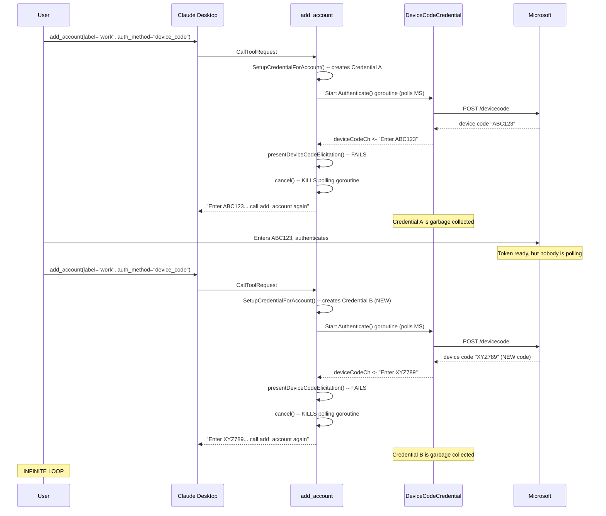
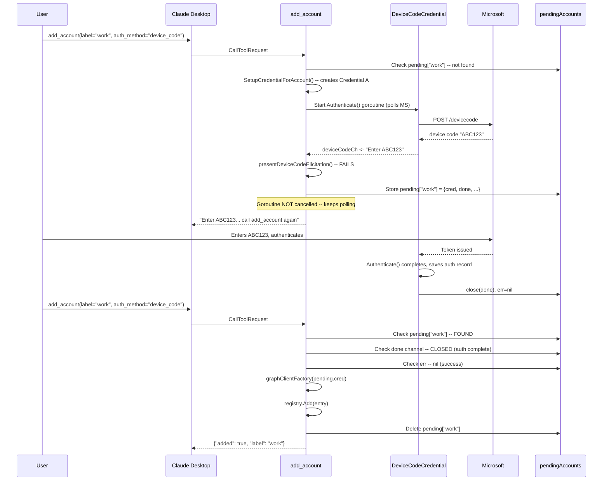
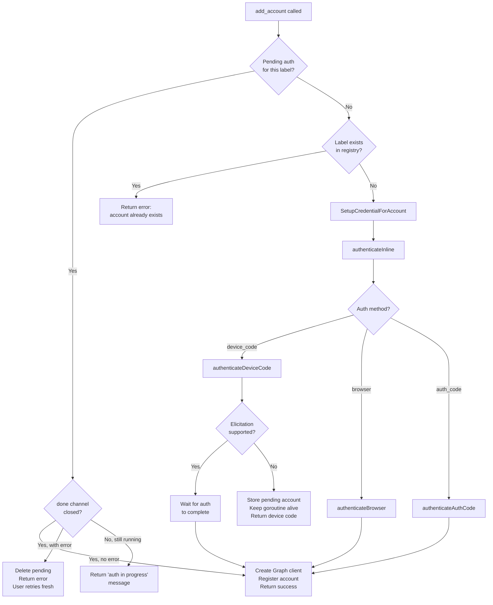

# Device Code add_account Authentication Loop

## Change Summary

Fix a bug where calling `add_account` with `auth_method: "device_code"` in MCP clients without elicitation support (e.g., Claude Desktop) enters an infinite loop: each call generates a new device code, instructs the user to authenticate and call again, but the next call creates a brand new credential that discards the completed authentication, generating yet another device code.

The fix introduces a pending account store in the `add_account` handler that keeps the in-progress authentication goroutine alive between tool calls, allowing the second `add_account` call to pick up the completed authentication instead of starting fresh.

## Motivation and Background

CR-0031 (Graceful Elicitation Fallback) correctly identified that when elicitation fails for `device_code` auth, the tool should return the device code as tool result text and exit immediately rather than blocking. The implementation cancels the authentication goroutine and returns a `DeviceCodeFallbackError` with the message:

> "After completing the device code flow, call add_account again with label 'livearena' to finish registration."

However, this instruction is architecturally impossible to fulfill. The credential, authenticator, and authentication goroutine are all destroyed when the function returns, so there is nothing for the second call to "finish."

### Root Cause Analysis

**First `add_account` call** (label: "livearena", auth_method: "device_code"):

1. `handleAddAccount` checks `registry.Get("livearena")` -- not found, proceeds.
2. `SetupCredentialForAccount` creates a new `DeviceCodeCredential` with cache name `{base}-livearena` and auth record path `{dir}/livearena_auth_record.json`.
3. `authenticateDeviceCode` starts a background goroutine calling `Authenticate()`, which initiates the device code flow with Microsoft and **polls** for completion (`add_account.go:474`).
4. Microsoft returns the device code immediately. The `deviceCodeUserPrompt` callback fires, sending the code to the channel.
5. `presentDeviceCodeElicitation` tries MCP elicitation -- **fails** (Claude Desktop does not support it).
6. **`cancel()` is called** (`add_account.go:485`) -- this kills the polling goroutine before the user has entered the code.
7. Returns `DeviceCodeFallbackError` with the device code message.
8. The account is **never registered** in the registry (line 219 is never reached).
9. The credential and authenticator exist only as local variables -- they are **garbage collected**.

**User completes the device code flow in browser** -- but nobody is polling Microsoft's token endpoint. The token is **never fetched** and **never cached** in the OS keychain.

**Second `add_account` call** (same label and auth_method):

1. `registry.Get("livearena")` -- still not found (was never registered).
2. `SetupCredentialForAccount` creates a **brand new** `DeviceCodeCredential` -- same cache name, but the cache is empty (token was never fetched by the cancelled goroutine).
3. No auth record on disk (was never saved because `Authenticate()` was cancelled).
4. `authenticateDeviceCode` starts a fresh device code flow -- **new device code generated**.
5. **Loop repeats.**

### Contrast with Auth Middleware

The auth middleware's `handleDeviceCodeAuth` (`middleware.go:503-572`) correctly handles this scenario by:

1. **Keeping the goroutine alive** -- it runs on `context.Background()`, never cancelled.
2. **Storing pending state** in `authMiddlewareState` -- `pendingAuth`, `pendingDone`, `pendingErr` survive between tool calls.
3. **Checking pending state** at middleware entry (`middleware.go:160-175`) -- subsequent tool calls detect the completed auth and retry.

The `add_account` handler lacks all three of these properties.

## Change Drivers

* **Critical bug**: `device_code` auth via `add_account` is completely broken in Claude Desktop (the primary MCP client for the MCPB extension).
* **User-reported**: Authenticated during testing but the authentication loop was observed directly.
* **CR-0034 regression**: CR-0034 changed the default auth method to `device_code`, making this the default path for all new users.

## Current State

### Authentication State Lifecycle (Broken)



### Three Destroyed Properties

| Property | Current Behavior | Required Behavior |
|---|---|---|
| Polling goroutine | Cancelled via `cancel()` at `add_account.go:485` | Must remain alive until auth completes or times out |
| Credential/Authenticator | Local variables, GC'd after return | Must persist between `add_account` calls |
| Auth record | Never saved (goroutine cancelled before completion) | Saved when `Authenticate()` completes successfully |

## Proposed Change

### Design: Pending Account Store

Introduce a `pendingAccounts` map in `addAccountState` that stores in-progress authentication state between tool calls. This mirrors the middleware's `pendingAuth`/`pendingDone`/`pendingErr` pattern but is keyed by account label to support concurrent pending auths for different accounts.

```go
// pendingAccount holds the in-progress authentication state for a device_code
// add_account call where elicitation failed. The authentication goroutine
// continues running in the background. The next add_account call with the
// same label checks this state instead of creating a new credential.
type pendingAccount struct {
    cred           azcore.TokenCredential
    authenticator  auth.Authenticator
    authRecordPath string
    cacheName      string
    clientID       string
    tenantID       string
    authMethod     string
    done           chan struct{}   // closed when auth goroutine completes
    err            error          // auth result, valid after done is closed
}
```

### Proposed Flow



### Implementation Detail

#### 1. Add pending state to `addAccountState`

**File**: `internal/tools/add_account.go`

Add a `pendingAccounts` map and mutex to `addAccountState`:

```go
type addAccountState struct {
    authenticate func(ctx context.Context, auth auth.Authenticator, authRecordPath string) (azidentity.AuthenticationRecord, error)
    urlElicit    func(ctx context.Context, elicitationID, url, message string) (*mcp.ElicitationResult, error)
    elicit       func(ctx context.Context, request mcp.ElicitationRequest) (*mcp.ElicitationResult, error)

    pendingMu    sync.Mutex
    pending      map[string]*pendingAccount
}
```

Initialize in `defaultAddAccountState`:

```go
func defaultAddAccountState() *addAccountState {
    return &addAccountState{
        authenticate: auth.Authenticate,
        urlElicit:    defaultAddAccountURLElicit,
        elicit:       defaultAddAccountElicit,
        pending:      make(map[string]*pendingAccount),
    }
}
```

#### 2. Check pending state at handler entry

**File**: `internal/tools/add_account.go`, in `handleAddAccount` closure

Before the `registry.Get(label)` uniqueness check, check for a pending account:

```go
// Check if there is a pending authentication for this label.
if entry, result := s.checkPending(label, logger); result != nil {
    // Pending auth resolved (completed or still in progress).
    if entry != nil {
        // Auth completed successfully -- register the account.
        client, err := graphClientFactory(entry.cred)
        if err != nil { ... }
        if err := registry.Add(&auth.AccountEntry{...}); err != nil { ... }
        if err := auth.AddAccountConfig(...); err != nil { ... }
        return successResult(label)
    }
    // Still in progress or failed -- result contains the message.
    return result, nil
}
```

#### 3. Implement `checkPending`

**File**: `internal/tools/add_account.go`

```go
// checkPending checks whether a pending authentication exists for the given
// label. Returns:
//   - (entry, nil): auth completed successfully, entry is ready to register
//   - (nil, result): auth still in progress or failed, result is the tool response
//   - (nil, nil): no pending auth for this label, proceed normally
func (s *addAccountState) checkPending(label string, logger *slog.Logger) (*pendingAccount, *mcp.CallToolResult) {
    s.pendingMu.Lock()
    defer s.pendingMu.Unlock()

    p, exists := s.pending[label]
    if !exists {
        return nil, nil
    }

    select {
    case <-p.done:
        // Auth goroutine completed.
        delete(s.pending, label)
        if p.err != nil {
            logger.Warn("pending authentication failed", "label", label, "error", p.err)
            return nil, mcp.NewToolResultError(fmt.Sprintf(
                "Previous authentication for account %q failed: %s. "+
                    "Please try add_account again.", label, p.err))
        }
        return p, nil

    default:
        // Auth still in progress.
        return nil, mcp.NewToolResultText(fmt.Sprintf(
            "Authentication for account %q is still in progress. "+
                "Please complete the device code login in your browser, "+
                "then call add_account again with label %q.", label, label))
    }
}
```

#### 4. Store pending state instead of cancelling

**File**: `internal/tools/add_account.go`, in `authenticateDeviceCode`

Replace the `cancel()` + `DeviceCodeFallbackError` path with pending store:

```go
case msg := <-deviceCodeCh:
    logger.Info("device code prompt captured, presenting to client")
    if elicitErr := s.presentDeviceCodeElicitation(ctx, msg, label, logger); elicitErr != nil {
        // Elicitation failed. DO NOT cancel the auth goroutine.
        // Store the pending state so the next add_account call can pick it up.
        s.storePending(label, &pendingAccount{
            cred:           cred,       // passed as new parameter
            authenticator:  authenticator, // passed as new parameter
            authRecordPath: authRecordPath,
            cacheName:      cacheName,   // passed as new parameter
            clientID:       clientID,    // passed as new parameter
            tenantID:       tenantID,    // passed as new parameter
            authMethod:     authMethod,  // passed as new parameter
            done:           done,
        })
        // Wire up error capture (goroutine writes to pending.err on completion).
        return elicitErr
    }
```

Note: The `authenticateDeviceCode` function signature needs additional parameters (`cred`, `cacheName`, `clientID`, `tenantID`) or access to a struct that holds them. The cleanest approach is to pass a `*pendingAccount` (minus `done` and `err`) into `authenticateDeviceCode` so it can store it directly.

**Important**: The `defer cancel()` at line 463 must be removed or made conditional. When storing a pending account, the `authCtx` must NOT be cancelled. Move the cancel to only execute when the goroutine is not stored as pending (i.e., on the success/elicitation-supported path and the timeout path).

#### 5. Wire auth error into pending state

The background goroutine must write its error to the pending account's `err` field. This can be done by closing over a pointer:

```go
p := &pendingAccount{...}
p.done = make(chan struct{})
go func() {
    defer close(p.done)
    _, p.err = s.authenticate(authCtx, authenticator, authRecordPath)
}()
```

#### 6. Add timeout cleanup for abandoned pending accounts

Pending accounts that are never picked up (user abandons the flow) should not leak goroutines indefinitely. The `authCtx` should have the existing 300-second timeout. When the goroutine times out, `p.err` captures the timeout error, and the next `checkPending` call cleans it up. If no subsequent call ever comes, the goroutine exits naturally when the timeout fires and the `pendingAccount` entry is eventually GC'd when the server shuts down.

This is acceptable because:
- The 300-second timeout already exists (`add_account.go:462`).
- Pending accounts are lightweight (a few pointers and a channel).
- The server process is long-lived but restarts periodically.

No explicit cleanup goroutine is needed.

### Proposed State Diagram



## Requirements

### Functional Requirements

1. When `add_account` is called with `device_code` auth and elicitation fails, the authentication goroutine **MUST** continue polling Microsoft's token endpoint in the background.
2. The credential, authenticator, and authentication state **MUST** be stored in a pending account map keyed by label, surviving between tool calls.
3. When `add_account` is called again with a label that has a pending authentication, the handler **MUST** check the pending state first:
   - If the goroutine completed successfully: create the Graph client, register the account, return success.
   - If the goroutine completed with an error: clean up the pending entry, return the error with instructions to retry.
   - If the goroutine is still running: return a message that auth is in progress.
4. The `cancel()` call at `add_account.go:485` **MUST** be removed for the pending account path. The goroutine must not be cancelled when the tool returns the device code fallback.
5. The `defer cancel()` at `add_account.go:463` **MUST** be made conditional: it must only cancel when the goroutine is not stored as a pending account.
6. Pending accounts **MUST** have a bounded lifetime via the existing 300-second context timeout. No goroutine leak is acceptable.
7. When a pending account's goroutine completes successfully, the auth record **MUST** be persisted to disk (this already happens inside `auth.Authenticate`).

### Non-Functional Requirements

1. The pending account store **MUST** be thread-safe (protected by a mutex), as `add_account` may be called concurrently.
2. The pending account store **MUST NOT** grow unboundedly. Entries are removed on successful registration, on error, or when the goroutine times out and the next check cleans them up.
3. The fix **MUST NOT** change behavior for MCP clients that support elicitation (the elicitation-supported path is unchanged).
4. The fix **MUST NOT** change behavior for `browser` or `auth_code` auth methods.

## Affected Components

| File | Functions | Change Type |
|---|---|---|
| `internal/tools/add_account.go` | `addAccountState` struct | Add `pendingMu`, `pending` fields |
| `internal/tools/add_account.go` | `defaultAddAccountState` | Initialize `pending` map |
| `internal/tools/add_account.go` | `handleAddAccount` closure | Add `checkPending` call at entry |
| `internal/tools/add_account.go` | `authenticateDeviceCode` | Remove `cancel()`, store pending, pass credential info |
| `internal/tools/add_account.go` | New: `checkPending` | Check/resolve pending auth |
| `internal/tools/add_account.go` | New: `storePending` | Store pending auth entry |
| `internal/tools/add_account.go` | New: `pendingAccount` struct | Pending auth state |

## Scope Boundaries

### In Scope

* Fixing the device code authentication loop in `add_account` when elicitation is not supported
* Adding pending account state management to `addAccountState`
* Modifying `authenticateDeviceCode` to keep the goroutine alive
* Modifying `handleAddAccount` to check pending state before creating new credentials

### Out of Scope ("Here, But Not Further")

* Changing `browser` or `auth_code` auth flows -- they work correctly (browser opens directly, auth_code uses `complete_auth` tool)
* Modifying the auth middleware -- it already handles pending state correctly
* Adding pending state for the middleware's device code flow -- already works
* Implementing MCP elicitation in Claude Desktop -- external dependency
* Refactoring `authenticateDeviceCode` signature beyond what is minimally needed

## Impact Assessment

### User Impact

Users of Claude Desktop (and any MCP client without elicitation) will be able to successfully add accounts using `device_code` auth. The current experience is completely broken (infinite loop). After this fix, the flow becomes:

1. Call `add_account` -- receive device code.
2. Complete device code flow in browser.
3. Call `add_account` again -- account registered successfully.

### Technical Impact

Changes are confined to `internal/tools/add_account.go`. The `pendingAccount` struct and map are private to the package. No API surface changes. No new dependencies. The auth middleware is unchanged.

### Business Impact

Unblocks `device_code` auth for the MCPB extension's primary distribution channel (Claude Desktop). Since CR-0034 made `device_code` the default auth method, this bug affects every new user.

## Test Strategy

### Tests to Add

| Test File | Test Name | Description | Inputs | Expected Output |
|---|---|---|---|---|
| `add_account_test.go` | `TestDeviceCode_PendingAuth_CompletedSuccessfully` | Second `add_account` call picks up completed pending auth and registers account | 1st call: elicitation fails, auth goroutine stored. 2nd call: goroutine completed. | 2nd call returns success JSON with `"added": true` |
| `add_account_test.go` | `TestDeviceCode_PendingAuth_StillInProgress` | Second call while auth is still running returns in-progress message | 1st call: elicitation fails. 2nd call: goroutine still running. | 2nd call returns text "still in progress" |
| `add_account_test.go` | `TestDeviceCode_PendingAuth_Failed` | Second call after auth failure cleans up pending and returns error | 1st call: elicitation fails. Auth goroutine fails. 2nd call. | 2nd call returns error with failure reason |
| `add_account_test.go` | `TestDeviceCode_PendingAuth_GoroutineNotCancelled` | Verify auth goroutine continues running after elicitation failure | Elicitation fails | `authenticate` function is still running (not cancelled) |
| `add_account_test.go` | `TestDeviceCode_PendingAuth_ThirdCallAfterFailure` | Third call after pending failure starts fresh (no stale pending) | 1st: fails elicitation. 2nd: pending failed. 3rd: fresh attempt. | 3rd call creates new credential and auth flow |
| `add_account_test.go` | `TestDeviceCode_ElicitationSupported_NoPendingState` | Elicitation-supported path does not create pending entries | Elicitation succeeds | No entries in pending map |
| `add_account_test.go` | `TestBrowserAuth_NoPendingState` | Browser auth path does not create pending entries | Browser auth succeeds | No entries in pending map, account registered |
| `add_account_test.go` | `TestAuthCodeAuth_NoPendingState` | Auth code path does not create pending entries | Auth code auth succeeds | No entries in pending map, account registered |
| `add_account_test.go` | `TestDeviceCode_PendingAuth_Timeout` | Pending auth goroutine exits after 300s context timeout | Elicitation fails, no user action within timeout | Pending entry has timeout error, next call cleans up and allows fresh retry |

### Tests to Modify

| Test File | Test Name | Current Behavior | New Behavior | Reason |
|---|---|---|---|---|
| `add_account_test.go` | `TestAuthenticateDeviceCode_ElicitationError_ReturnsDeviceCode` | Verifies `DeviceCodeFallbackError` returned and goroutine cancelled | Verifies `DeviceCodeFallbackError` returned and pending state stored | Goroutine is no longer cancelled |
| `add_account_test.go` | `TestAuthenticateDeviceCode_ElicitationError_DoesNotBlock` | Verifies function returns promptly | Same assertion, but also verify pending state exists | Pending store is the mechanism for non-blocking return |

## Acceptance Criteria

### AC-1: Second add_account call completes registration

```gherkin
Given an MCP client that does not support elicitation
  And the user called add_account with device_code auth
  And the tool returned a device code message
  And the user completed the device code flow in their browser
When the user calls add_account again with the same label
Then the account MUST be registered in the registry
  And the tool MUST return a success result with "added": true
  And the pending account entry MUST be removed
```

### AC-2: Auth goroutine survives between calls

```gherkin
Given an MCP client that does not support elicitation
When the user calls add_account with device_code auth
  And elicitation fails
Then the Authenticate() goroutine MUST NOT be cancelled
  And the goroutine MUST continue polling Microsoft's token endpoint
  And the credential MUST be stored in the pending accounts map
```

### AC-3: In-progress message for premature second call

```gherkin
Given a pending authentication that has not yet completed
When the user calls add_account with the same label
Then the tool MUST return a text result indicating auth is still in progress
  And the tool MUST NOT create a new credential
  And the tool MUST NOT start a new device code flow
```

### AC-4: Failed pending auth allows retry

```gherkin
Given a pending authentication that failed (e.g., timeout)
When the user calls add_account with the same label
Then the pending entry MUST be cleaned up
  And the tool MUST return an error with the failure reason
  And a subsequent add_account call MUST start a fresh authentication
```

### AC-5: No regression for elicitation-supporting clients

```gherkin
Given an MCP client that supports elicitation
When the user calls add_account with device_code auth
Then the elicitation flow MUST work as before
  And no pending account entry MUST be created
  And the account MUST be registered inline within the single call
```

### AC-6: No regression for browser and auth_code methods

```gherkin
Given any MCP client
When the user calls add_account with browser or auth_code auth
Then the behavior MUST be unchanged from before this fix
  And no pending account entries MUST be created
```

### AC-7: Bounded goroutine lifetime

```gherkin
Given a pending authentication stored in the pending map
When 300 seconds elapse without the user completing the device code flow
Then the Authenticate() goroutine MUST exit (context timeout)
  And the pending entry's error MUST reflect the timeout
  And the next add_account call MUST clean up the entry and allow a fresh retry
```

## Quality Standards Compliance

### Build & Compilation

- [x] Code compiles/builds without errors
- [x] No new compiler warnings introduced

### Linting & Code Style

- [x] All linter checks pass with zero warnings/errors
- [x] Code follows project coding conventions and style guides
- [ ] Any linter exceptions are documented with justification

### Test Execution

- [x] All existing tests pass after implementation
- [x] All new tests pass
- [x] Test coverage meets project requirements for changed code

### Documentation

- [ ] Inline code documentation updated where applicable
- [ ] API documentation updated for any API changes
- [ ] User-facing documentation updated if behavior changes

### Code Review

- [ ] Changes submitted via pull request
- [ ] PR title follows Conventional Commits format
- [ ] Code review completed and approved
- [ ] Changes squash-merged to maintain linear history

### Verification Commands

```bash
# Build verification
go build ./cmd/outlook-local-mcp/

# Lint verification
golangci-lint run

# Test execution
go test ./...

# Full CI check
make ci
```

## Risks and Mitigation

### Risk 1: Goroutine leak if server restarts during pending auth

**Likelihood:** low
**Impact:** low
**Mitigation:** The 300-second context timeout ensures goroutines exit naturally. On server restart, all pending state is lost (in-memory only), and the user simply starts fresh. This is acceptable since the user must call `add_account` again anyway.

### Risk 2: Race between checkPending and storePending

**Likelihood:** low
**Impact:** low
**Mitigation:** Both operations are protected by `pendingMu`. The mutex is held for short durations (map lookup, channel select, map delete). No risk of deadlock since no nested locking is needed.

### Risk 3: User calls add_account with different parameters for the same label

**Likelihood:** low
**Impact:** low
**Mitigation:** The pending account stores the original parameters (clientID, tenantID, authMethod). The second call uses the stored credential regardless of any new parameters. This is acceptable: the user already authenticated with the original parameters. If they want different parameters, they should use a different label.

## Dependencies

* CR-0031 (Graceful Elicitation Fallback) -- **prerequisite**, introduced the `DeviceCodeFallbackError` pattern this CR modifies
* CR-0034 (MVP Release Finalization) -- made `device_code` the default, exposing this bug to all users

## Related Items

* CR-0025: Multi-Account Support with MCP Elicitation API (introduced `add_account`)
* CR-0031: Graceful Elicitation Fallback (introduced the broken `cancel()` + fallback pattern)
* CR-0034: MVP Release Finalization (changed default to `device_code`)
* `internal/tools/add_account.go`: sole implementation target
* `internal/auth/middleware.go`: reference for correct pending state pattern (no changes needed)

<!--
## CR-0035 Review Summary

**Reviewer**: CR Reviewer Agent
**Date**: 2026-03-16

### Checks Performed

| Check | Result |
|---|---|
| A. Internal contradictions | PASS — All ACs are consistent with FRs and Implementation Approach |
| B. Ambiguity | PASS — All requirements and ACs use MUST/MUST NOT. "should"/"may" uses are confined to background/rationale sections only |
| C. Requirement-AC coverage | PASS — All 7 FRs have corresponding ACs. FR-5 (conditional defer cancel) is implicitly exercised by AC-2 |
| D. AC-test coverage | FIXED — AC-6 (no regression for browser/auth_code) and AC-7 (bounded goroutine lifetime) had no corresponding tests |
| E. Scope consistency | PASS — Affected Components matches Implementation Approach (both target only add_account.go) |
| F. Diagram accuracy | PASS — All three Mermaid diagrams accurately reflect described flows |
| G. Line number accuracy | PASS — All line references verified against source: 462, 463, 474, 485, 219, middleware.go:503-572, middleware.go:160-175 |

### Findings: 2
### Fixes Applied: 1

1. **AC-6/AC-7 missing test coverage** (FIXED): Added 3 test entries to the Test Strategy table:
   - `TestBrowserAuth_NoPendingState` — covers AC-6 for browser auth
   - `TestAuthCodeAuth_NoPendingState` — covers AC-6 for auth_code auth
   - `TestDeviceCode_PendingAuth_Timeout` — covers AC-7 for 300s timeout cleanup

### Unresolvable Items: 0
-->
