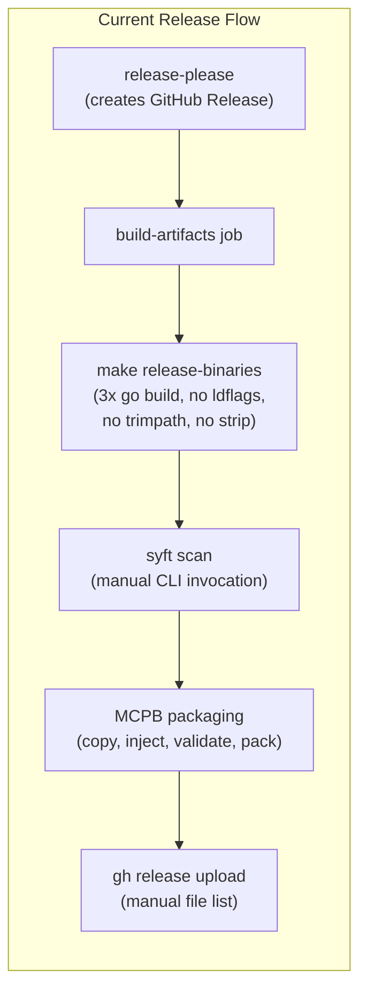
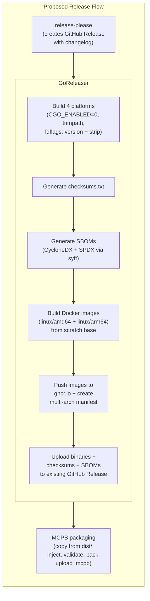
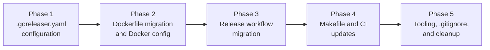

# GoReleaser Integration

## Change Summary

Replace the hand-rolled cross-compilation, SBOM generation, and artifact upload steps in the release workflow with GoReleaser, a declarative release automation tool for Go projects. GoReleaser consolidates build, checksum, SBOM, Docker image build/push, and release upload into a single `.goreleaser.yaml` configuration file and a direct `goreleaser release --clean` invocation in CI (via mise), while also fixing gaps in the current release pipeline: missing version injection via ldflags, missing checksum file generation, and no published Docker images. Release artifacts are distributed as compressed archives (tar.gz for Linux/macOS, zip for Windows). Additionally, the Dockerfile is migrated from `debian:bookworm-slim` to `scratch` for a minimal, secure container image, and multi-architecture Docker images (`linux/amd64` + `linux/arm64`) are published to GitHub Container Registry (ghcr.io).

## Motivation and Background

The current release pipeline (CR-0016, evolved by CR-0028 and CR-0029) works correctly but has grown into a series of imperative shell steps spread across the Makefile and `.github/workflows/release.yml`:

1. **Three separate `go build` invocations** in the `release-binaries` Makefile target, each manually specifying `CGO_ENABLED=0`, `GOOS`, `GOARCH`, and the output path. Adding a new platform requires editing both the Makefile and the release workflow.

2. **No version injection in release binaries.** The `release-binaries` target does not pass `-ldflags "-X main.version=..."`, so all GitHub Release binaries report `version = "dev"`. The Dockerfile correctly injects version, but the release binaries do not. This is a functional gap.

3. **No checksum file.** Users downloading binaries from GitHub Releases have no way to verify integrity. GoReleaser generates a `checksums.txt` (SHA-256) for every release automatically.

4. **No `-trimpath` in release builds.** Release binaries embed the build machine's absolute file paths in stack traces, leaking CI runner filesystem structure. GoReleaser applies `-trimpath` by default.

5. **No binary stripping.** Release binaries include debug symbols and symbol tables. GoReleaser applies `-s -w` ldflags by default, producing smaller binaries.

6. **Manual SBOM generation.** The release workflow invokes `syft scan` directly with hand-coded output flags. GoReleaser has native SBOM support via its `sboms` configuration section.

7. **Manual artifact upload.** The release workflow uses `gh release upload` with an explicit file list. GoReleaser handles upload to the GitHub Release automatically.

8. **No published Docker images.** The project has a Dockerfile and docker-compose.yml for local development, but no Docker images are built or published as part of the release pipeline. Users who want to run the server in a container must build the image locally.

9. **Oversized runtime image.** The current Dockerfile uses `debian:bookworm-slim` as the runtime base image (~80 MB) with runtime packages (libsecret, dbus, ca-certificates) installed. Since release binaries are statically linked (`CGO_ENABLED=0`), the runtime image can be replaced with `scratch` (~0 MB), producing a minimal container with only the binary and CA certificates.

GoReleaser is the de facto standard release tool for Go projects (used by Hugo, Terraform, Prometheus, and thousands of others). Adopting it replaces ~30 lines of imperative shell with a declarative YAML configuration, fixes the version/checksum/trimpath gaps, and makes adding future release features (Homebrew tap, Docker images, Scoop manifests) trivial.

CR-0016 considered and rejected GoReleaser because "it introduces a third-party dependency and configuration file for a task that requires only four GOOS/GOARCH cross-compilations." Since then, the release workflow has grown to include SBOM generation, MCPB packaging, version injection (in Docker but not binaries), and multi-step artifact upload. The complexity now justifies the tool.

## Change Drivers

* **Release binaries report `version = "dev"`** because `make release-binaries` lacks `-ldflags "-X main.version=..."` -- a functional defect discovered during CR-0036 analysis.
* **No integrity verification** for downloaded release binaries -- no checksums.txt is generated or uploaded.
* **Imperative release pipeline** with duplicated build flags across Makefile and workflow is fragile and error-prone when adding platforms or changing flags.
* **CR-0016 rejection no longer applies** -- the release pipeline has grown beyond "four simple cross-compilations" to include SBOMs, MCPB packaging, and multi-format artifact upload.
* **Community standard** -- GoReleaser is the expected release tool for Go open source projects; its absence is notable.
* **No container distribution** -- users cannot `docker pull` the server; they must clone and build locally. Publishing multi-arch images to ghcr.io enables `docker pull ghcr.io/desek/outlook-local-mcp:latest` for both x86_64 and Apple Silicon hosts.
* **Oversized runtime image** -- the `debian:bookworm-slim` runtime base is unnecessary for a statically linked Go binary; `scratch` reduces attack surface and image size to near-zero.

## Current State



| Component | Current State |
|---|---|
| Cross-compilation | `make release-binaries`: 3 manual `go build` lines (linux/amd64, darwin/arm64, windows/amd64) |
| Version injection | **Missing** in release binaries; present only in Dockerfile |
| Build flags | `CGO_ENABLED=0` only; no `-trimpath`, no `-s -w` |
| Checksum generation | **None** |
| SBOM generation | Manual `syft scan` in release workflow |
| Artifact upload | Manual `gh release upload` with explicit file list |
| MCPB packaging | Custom steps: copy binaries, inject version, validate, pack, upload |
| Docker image build | **None** in release pipeline; Dockerfile exists for local `docker compose` only |
| Docker runtime base | `debian:bookworm-slim` with libsecret, dbus, ca-certificates (~80 MB runtime layer) |
| Docker image publishing | **None**; no images pushed to any registry |
| Release configuration | Imperative: spread across `Makefile` lines 50-53 and `.github/workflows/release.yml` lines 31-65 |

## Proposed Change

Introduce GoReleaser as the build/release tool. A `.goreleaser.yaml` configuration file replaces the manual cross-compilation, adds version injection, checksum generation, binary stripping, trimpath, SBOM generation, compressed archives (tar.gz/zip), and Docker image build/push declaratively. The release workflow replaces `make release-binaries`, `syft scan`, and `gh release upload` with a direct `goreleaser release --clean` invocation (goreleaser installed via mise). GoReleaser builds multi-architecture Docker images (`linux/amd64` + `linux/arm64`) and pushes them to `ghcr.io/desek/outlook-local-mcp`. The Dockerfile is migrated from `debian:bookworm-slim` to `scratch` for a minimal, secure container image. MCPB packaging remains as a post-GoReleaser step since it is a custom format not supported by GoReleaser.



### Component Inventory

| # | Component | File(s) | Purpose |
|---|---|---|---|
| 1 | GoReleaser config | `.goreleaser.yaml` (new) | Declarative build, checksum, SBOM, Docker, and release configuration |
| 2 | Dockerfile | `Dockerfile` (modified) | Migrate from `debian:bookworm-slim` to `scratch` runtime base |
| 3 | Release workflow | `.github/workflows/release.yml` (modified) | Replace build/SBOM/upload steps with direct goreleaser invocation; add Docker login |
| 4 | Makefile | `Makefile` (modified) | Replace `release-binaries` with `snapshot`; add `goreleaser-check` |
| 5 | Tool versions | `.mise.toml` (modified) | Add goreleaser tool |
| 6 | Git ignores | `.gitignore` (modified) | Add `dist/` directory |
| 7 | DeepWiki repos | `.deepwiki` (modified) | Add `goreleaser/goreleaser` |
| 8 | CI workflow | `.github/workflows/ci.yml` (modified) | Add `goreleaser check` validation and snapshot dry-run |

## Requirements

### Functional Requirements

#### GoReleaser Configuration

1. A `.goreleaser.yaml` file **MUST** exist at the repository root with `version: 2` format.
2. The `builds` section **MUST** compile the binary from `./cmd/outlook-local-mcp/` for four platform targets: `linux/amd64`, `linux/arm64`, `darwin/arm64`, and `windows/amd64`.
3. The `builds` section **MUST** set `env: [CGO_ENABLED=0]` for statically linked binaries.
4. The `builds` section **MUST** set `flags: [-trimpath]` to exclude build-machine paths from binaries.
5. The `builds` section **MUST** set `ldflags` to inject version via `-X main.version={{.Version}}` and strip debug symbols via `-s -w`.
6. The `archives` section **MUST** use `formats: [tar.gz]` with a `format_overrides` entry for Windows using `zip`, producing compressed release archives.
7. The `archives` section **MUST** use a `name_template` that produces archive names matching the convention: `outlook-local-mcp-{os}-{arch}` (GoReleaser appends the appropriate archive extension).
8. The `checksum` section **MUST** generate a `checksums.txt` file using SHA-256.
9. The `sboms` section **MUST** generate SBOMs in both CycloneDX JSON and SPDX JSON formats using `syft` with `artifacts: source` (scanning the source directory once), with filenames `outlook-local-mcp-{tag}.cdx.json` and `outlook-local-mcp-{tag}.spdx.json`.
10. The `changelog` section **MUST** be disabled (`disable: true`) because release-please manages changelog generation.
11. The `release` section **MUST** set `mode: keep-existing` to preserve the release notes created by release-please when uploading artifacts to the existing GitHub Release.
12. The `snapshot` section **MUST** define a `version_template` for local snapshot builds.

#### Dockerfile

13. The `Dockerfile` **MUST** use a multi-stage build: `alpine:3` (with `--platform=$BUILDPLATFORM` for CA certificates) → `scratch` (runtime), with `TARGETOS`/`TARGETARCH` ARGs for multi-platform binary paths.
14. The `scratch` stage **MUST** copy `/etc/ssl/certs/ca-certificates.crt` from the alpine stage for TLS connectivity to Microsoft Graph API.
15. The `Dockerfile` **MUST** copy the pre-built binary from `${TARGETOS}/${TARGETARCH}/outlook-local-mcp` to `/usr/local/bin/outlook-local-mcp` (`dockers_v2` places binaries in platform-specific subdirectories).
16. The `Dockerfile` **MUST** include OCI image labels (`org.opencontainers.image.title`, `.description`, `.source`, `.licenses`).
17. The `Dockerfile` **MUST** set `OUTLOOK_MCP_AUTH_RECORD_PATH=/data/auth/auth_record.json` as the default auth record path.
18. The `Dockerfile` **MUST NOT** include CGO dependencies (libsecret, dbus, pkg-config) since the binary is statically linked with `CGO_ENABLED=0`.

#### Docker Images (GoReleaser)

19. The `dockers_v2` section **MUST** build Docker images for two platforms: `linux/amd64` and `linux/arm64`.
20. The `dockers_v2` section **MUST** use Buildx natively via `platforms` to build multi-architecture images.
21. The `dockers_v2` section **MUST** produce image tags `ghcr.io/desek/outlook-local-mcp:v{{ .Version }}` and `ghcr.io/desek/outlook-local-mcp:latest`.
22. The `dockers_v2` section **MUST** create multi-architecture manifests automatically for both tags, combining the `amd64` and `arm64` images (no separate `docker_manifests` section required).
23. Docker images **MUST** be pushed to GitHub Container Registry (`ghcr.io`).

#### Release Workflow

24. The `.github/workflows/release.yml` `build-artifacts` job **MUST** replace the `make release-binaries`, `syft scan`, and `gh release upload` steps with a single `goreleaser release --clean` invocation (goreleaser installed via mise).
25. The GoReleaser step **MUST** use the goreleaser binary provided by `jdx/mise-action@v4` (version pinned in `.mise.toml`), not the `goreleaser/goreleaser-action`.
26. The GoReleaser step **MUST** invoke `goreleaser release --clean`.
27. The GoReleaser step **MUST** receive `GITHUB_TOKEN` as an environment variable.
28. The checkout step **MUST** set `fetch-depth: 0` because GoReleaser requires full git history for tag detection.
29. The release workflow **MUST** include a `packages: write` permission for pushing Docker images to ghcr.io.
30. The release workflow **MUST** include a Docker login step using `docker/login-action@v3` to authenticate with `ghcr.io` before GoReleaser runs.
31. The MCPB packaging steps **MUST** dynamically locate binaries in GoReleaser's `dist/` output directory using `find dist -path` patterns (since compressed archives place binaries in platform-specific subdirectories).
32. The MCPB `.mcpb` bundle **MUST** continue to be uploaded via `gh release upload` as a separate step after GoReleaser completes, since GoReleaser does not manage MCPB artifacts.

#### Makefile

33. The `release-binaries` Makefile target **MUST** be replaced with a `snapshot` target that runs `goreleaser release --snapshot --clean` for local testing.
34. A `goreleaser-check` Makefile target **MUST** be added that runs `goreleaser check` to validate the `.goreleaser.yaml` configuration.
35. The `ci` Makefile target **MUST** be updated to include `goreleaser-check`.
36. The `sbom` Makefile target **MUST** be removed because GoReleaser handles SBOM generation during release.
37. The `clean` Makefile target **MUST** be updated to include `dist/` in its removal list.

#### Tool Installation

38. The `.mise.toml` file **MUST** be updated to include `goreleaser` as a managed tool.

#### CI Validation

39. The `.github/workflows/ci.yml` **MUST** execute `goreleaser check` on every PR via the `make ci` invocation (which includes the `goreleaser-check` target), and **MUST** also run a `goreleaser release --snapshot --clean` dry-run to validate the full release pipeline.

### Non-Functional Requirements

1. The release workflow with GoReleaser **MUST** complete within the existing 10-minute budget for the `build-artifacts` job.
2. The `.goreleaser.yaml` configuration **MUST** only use features available in the free (non-Pro) edition of GoReleaser.
3. The GoReleaser version **MUST** be pinned via `.mise.toml` (`goreleaser = "2"`) consistent with the project's mise-based tool management convention.
4. Release archive names **MUST** follow the convention `outlook-local-mcp-{os}-{arch}.tar.gz` (`.zip` for Windows) to provide compressed distribution artifacts.
5. Snapshot builds via `make snapshot` **MUST** produce binaries in `dist/` that can be used for local MCPB testing via `make mcpb-pack`.
6. Docker images **MUST** use `scratch` as the runtime base to minimize image size and attack surface.
7. The multi-architecture Docker manifest **MUST** allow users on both `x86_64` and `arm64` (Apple Silicon) hosts to pull with a single tag (`docker pull ghcr.io/desek/outlook-local-mcp:latest`).

## Affected Components

| File | Action | Description |
|---|---|---|
| `.goreleaser.yaml` | **New** | GoReleaser configuration (builds, checksums, SBOMs, Docker, release) |
| `Dockerfile` | **Modified** | Migrate from `debian:bookworm-slim` to `scratch`; remove CGO dependencies |
| `.github/workflows/release.yml` | **Modified** | Replace build/SBOM/upload with goreleaser-action; add Docker login; add `packages: write` |
| `.github/workflows/ci.yml` | **Modified** | Add `goreleaser check` step |
| `Makefile` | **Modified** | Replace `release-binaries` with `snapshot`; add `goreleaser-check`; remove `sbom`; update `ci` and `clean` |
| `.mise.toml` | **Modified** | Add goreleaser tool |
| `.gitignore` | **Modified** | Add `dist/` pattern |
| `.deepwiki` | **Modified** | Add `goreleaser/goreleaser` repository |

## Scope Boundaries

### In Scope

* GoReleaser configuration for cross-compilation, checksums, SBOMs, Docker images, and release upload
* Multi-architecture Docker image builds (`linux/amd64` + `linux/arm64`) pushed to `ghcr.io/desek/outlook-local-mcp`
* Dockerfile migration from `debian:bookworm-slim` to `scratch` runtime base
* Release workflow migration from imperative steps to goreleaser-action
* Makefile target updates (snapshot, goreleaser-check, clean)
* CI config validation (goreleaser check)
* Tool installation via mise
* Fixing version injection in release binaries (currently missing)
* Adding checksum file generation (currently missing)
* Adding `-trimpath` and `-s -w` to release builds (currently missing)
* Adding `linux/arm64` as a fourth build target (required for Docker multi-arch)

### Out of Scope ("Here, But Not Further")

* Homebrew tap formula generation -- can be added trivially to `.goreleaser.yaml` in a future CR
* Scoop manifest for Windows -- deferred to a future CR
* `docker-compose.yml` changes -- remains as-is for local development; users building locally with docker-compose will use the updated scratch-based Dockerfile
* Additional platform targets (darwin/amd64, windows/arm64) -- not needed at this time
* GoReleaser Pro features (nightly builds, custom publishers, monorepo support) -- free edition only
* Signing artifacts with cosign or GPG -- deferred to a future CR
* release-please configuration changes -- release-please continues to manage version bumping and changelog; its configuration is unchanged

## Impact Assessment

### User Impact

Release artifacts change from raw binaries to compressed archives (tar.gz for Linux/macOS, zip for Windows). Users gain several new capabilities per release:

1. **`checksums.txt`** -- SHA-256 checksums for all release binaries, enabling integrity verification.
2. **Correct version string** -- Release binaries will report the actual version (e.g., `1.0.0`) instead of `dev`.
3. **Docker images** -- Users can now pull pre-built multi-architecture images via `docker pull ghcr.io/desek/outlook-local-mcp:latest` instead of building locally. Both `x86_64` and `arm64` (Apple Silicon) hosts are supported transparently via the multi-arch manifest.

### Technical Impact

- **Release workflow simplification:** ~25 lines of imperative shell (build, SBOM, upload) are replaced by a direct `goreleaser release --clean` invocation plus the `.goreleaser.yaml` config.
- **MCPB packaging adjustment:** The MCPB steps dynamically locate binaries in GoReleaser's `dist/` directory via `find` (compressed archives place binaries in platform-specific subdirectories). No other changes to MCPB packaging.
- **Makefile simplification:** The `release-binaries` and `sbom` targets are replaced/removed. Two new targets (`snapshot`, `goreleaser-check`) are added.
- **CI addition:** A `goreleaser check` step is added to the CI pipeline to catch config errors early.
- **Dockerfile migration:** Runtime base changes from `debian:bookworm-slim` (~80 MB) to `scratch` (~0 MB). CGO dependencies (libsecret, dbus) are removed since the binary is statically linked.
- **Docker image publishing:** Multi-arch images (`linux/amd64` + `linux/arm64`) are pushed to `ghcr.io/desek/outlook-local-mcp` on every release.
- **No Go source code changes.** The MCP server binary is unchanged.
- **New tool dependency:** GoReleaser must be installed locally (via mise) and in CI (via goreleaser-action).

### Business Impact

- Fixes a visible defect: release binaries correctly reporting their version increases user confidence.
- Checksum file enables enterprise compliance workflows that require artifact integrity verification.
- Published Docker images on ghcr.io reduce the barrier to entry for container-based deployments.
- Aligns with Go community expectations for release tooling, reducing friction for contributors.

## Implementation Approach

Implementation is divided into five sequential phases. Phases **MUST** be implemented in order because later phases depend on artifacts from earlier phases.



### Phase 1: GoReleaser Configuration

Create the `.goreleaser.yaml` configuration file at the repository root.

**Step 1.1: Create `.goreleaser.yaml`**

```yaml
version: 2

before:
  hooks:
    - go mod tidy

builds:
  - id: outlook-local-mcp
    main: ./cmd/outlook-local-mcp/
    binary: outlook-local-mcp
    env:
      - CGO_ENABLED=0
    goos:
      - linux
      - darwin
      - windows
    goarch:
      - amd64
      - arm64
    ignore:
      - goos: windows
        goarch: arm64
      - goos: darwin
        goarch: amd64
    flags:
      - -trimpath
    ldflags:
      - -s -w -X main.version={{.Version}}

archives:
  - id: binaries
    formats:
      - tar.gz
    format_overrides:
      - goos: windows
        formats:
          - zip
    name_template: "{{ .ProjectName }}-{{ .Os }}-{{ .Arch }}"

checksum:
  name_template: checksums.txt
  algorithm: sha256

sboms:
  - id: cyclonedx
    artifacts: source
    cmd: syft
    args:
      - scan
      - "dir:."
      - -o
      - "cyclonedx-json=$document"
    documents:
      - "{{ .ProjectName }}-{{ .Tag }}.cdx.json"
  - id: spdx
    artifacts: source
    cmd: syft
    args:
      - scan
      - "dir:."
      - -o
      - "spdx-json=$document"
    documents:
      - "{{ .ProjectName }}-{{ .Tag }}.spdx.json"

changelog:
  disable: true

release:
  mode: keep-existing

dockers_v2:
  - id: outlook-local-mcp
    ids:
      - outlook-local-mcp
    dockerfile: Dockerfile
    images:
      - "ghcr.io/desek/{{ .ProjectName }}"
    tags:
      - "v{{ .Version }}"
      - latest
    platforms:
      - linux/amd64
      - linux/arm64

snapshot:
  version_template: "{{ incpatch .Version }}-snapshot"
```

**Note on build targets:** The `linux/arm64` target is added (compared to the current 3 targets) specifically to support multi-architecture Docker images. The `linux/arm64` binary is also uploaded to the GitHub Release, giving ARM Linux users a native binary.

**Note on SBOM generation:** GoReleaser's `sboms` section with `artifacts: source` runs a single `syft scan dir:.` for each format, scanning the Go module source directory once. This produces one CycloneDX and one SPDX file per release, matching the current single-SBOM behavior while avoiding redundant scans of each platform binary (which share identical Go dependencies).

**Verification:** Run `goreleaser check` to validate the configuration syntax.

### Phase 2: Dockerfile Migration and Docker Configuration

Migrate the Dockerfile from `debian:bookworm-slim` to `scratch` for use with GoReleaser's Docker builds.

**Step 2.1: Rewrite `Dockerfile`**

Replace the existing multi-stage Dockerfile (golang builder → debian runtime) with a GoReleaser-compatible Dockerfile (alpine certs → scratch runtime). GoReleaser builds the binary externally and places it in the Docker build context, so the Dockerfile only needs to copy the binary and CA certificates.

```dockerfile
# check=skip=SecretsUsedInArgOrEnv
# Dockerfile for the Outlook Local MCP Server (GoReleaser).
#
# GoReleaser builds the statically linked binary (CGO_ENABLED=0) and places it
# in the Docker build context. This Dockerfile copies the binary and CA
# certificates into a scratch image for minimal size and attack surface.
#
# Multi-stage: alpine:3 (CA certificates) -> scratch (runtime).

# ---------------------------------------------------------------------------
# CA certificates stage
# ---------------------------------------------------------------------------
FROM --platform=$BUILDPLATFORM alpine:3 AS certs

RUN apk add --no-cache ca-certificates

# ---------------------------------------------------------------------------
# Runtime stage
# ---------------------------------------------------------------------------
FROM scratch

ARG TARGETOS
ARG TARGETARCH

COPY --from=certs /etc/ssl/certs/ca-certificates.crt /etc/ssl/certs/

COPY ${TARGETOS}/${TARGETARCH}/outlook-local-mcp /usr/local/bin/outlook-local-mcp

LABEL org.opencontainers.image.title="Outlook Local MCP Server" \
      org.opencontainers.image.description="Model Context Protocol server for Outlook via Microsoft Graph API" \
      org.opencontainers.image.source="https://github.com/desek/outlook-local-mcp" \
      org.opencontainers.image.licenses="MIT"

ENV OUTLOOK_MCP_AUTH_RECORD_PATH=/data/auth/auth_record.json

ENTRYPOINT ["/usr/local/bin/outlook-local-mcp"]
```

**Key changes from current Dockerfile:**
- Runtime base: `debian:bookworm-slim` → `scratch` (image size drops from ~80 MB to <15 MB)
- No CGO dependencies: libsecret, dbus, pkg-config removed (binary is `CGO_ENABLED=0`)
- No `apt-get install` in runtime stage
- No non-root user creation (`scratch` has no `/etc/passwd`; the binary runs as the container's default user)
- No `HEALTHCHECK` (`scratch` has no shell for `kill -0`)
- CA certificates sourced from alpine instead of installed via apt
- Builder stage removed (GoReleaser builds the binary externally)
- `--platform=$BUILDPLATFORM` pins the certs stage to the build platform, avoiding QEMU emulation for `apk add`
- `TARGETOS`/`TARGETARCH` ARGs used in the `COPY` path for `dockers_v2` multi-platform builds, which place binaries in `{os}/{arch}/` subdirectories

**Note on docker-compose.yml:** The `docker-compose.yml` references `Dockerfile` for local builds. With the new scratch-based Dockerfile, `docker compose build` will no longer work as a standalone build (no Go compiler stage). Users doing local Docker development should use `make snapshot` to build binaries first, then use docker-compose. Alternatively, a separate `Dockerfile.dev` can be created in a future CR if needed.

**Verification:** `docker build -t test .` with a pre-built binary in the build context.

### Phase 3: Release Workflow Migration

Update `.github/workflows/release.yml` to use goreleaser-action.

**Step 3.1: Update workflow permissions**

Add `packages: write` to the workflow-level permissions for Docker image push to ghcr.io:

```yaml
permissions:
  contents: write
  pull-requests: write
  packages: write
```

**Step 3.2: Update the `build-artifacts` job**

Replace the existing build, SBOM, and upload steps with goreleaser-action. Add Docker login for ghcr.io. Keep the MCPB steps but update binary paths to reference `dist/`.

The job becomes:

```yaml
  build-artifacts:
    needs: release-please
    if: needs.release-please.outputs.release_created == 'true'
    runs-on: ubuntu-latest
    steps:
      - uses: actions/checkout@v6
        with:
          fetch-depth: 0
      - uses: jdx/mise-action@v4
      - name: Set up Docker Buildx
        uses: docker/setup-buildx-action@v3
      - name: Set up QEMU
        uses: docker/setup-qemu-action@v3
      - name: Login to GitHub Container Registry
        uses: docker/login-action@v3
        with:
          registry: ghcr.io
          username: ${{ github.actor }}
          password: ${{ secrets.GITHUB_TOKEN }}
      - name: Run GoReleaser
        run: goreleaser release --clean
        env:
          GITHUB_TOKEN: ${{ secrets.GITHUB_TOKEN }}
      - name: Prepare MCPB extension
        run: |
          mkdir -p extension/bin
          DARWIN_ARM64=$(find dist -path "*darwin_arm64*/outlook-local-mcp" -type f)
          WINDOWS_AMD64=$(find dist -path "*windows_amd64*/outlook-local-mcp.exe" -type f)
          cp "$DARWIN_ARM64" extension/bin/outlook-local-mcp-darwin-arm64
          cp "$WINDOWS_AMD64" extension/bin/outlook-local-mcp-win32-x64.exe
          chmod +x extension/bin/outlook-local-mcp-darwin-arm64
      - name: Inject version into manifest
        run: |
          VERSION="${{ needs.release-please.outputs.tag_name }}"
          VERSION="${VERSION#v}"
          jq --arg v "$VERSION" '.version = $v' extension/manifest.json > extension/manifest.tmp.json
          mv extension/manifest.tmp.json extension/manifest.json
      - name: Validate MCPB manifest
        run: mcpb validate extension/manifest.json
      - name: Pack MCPB bundle
        run: mcpb pack extension/ outlook-local-mcp.mcpb
      - name: Upload MCPB bundle
        env:
          GH_TOKEN: ${{ secrets.GITHUB_TOKEN }}
        run: |
          gh release upload ${{ needs.release-please.outputs.tag_name }} \
            outlook-local-mcp.mcpb \
            --clobber
```

**Key changes from current workflow:**
- `make release-binaries` removed (GoReleaser handles builds)
- `syft scan ...` removed (GoReleaser handles SBOMs)
- `gh release upload` for binaries/SBOMs removed (GoReleaser handles upload)
- `fetch-depth: 0` added to checkout (GoReleaser requires full history)
- `packages: write` permission added for ghcr.io push
- Docker Buildx + QEMU setup added for multi-arch image builds
- Docker login to ghcr.io added before GoReleaser step
- GoReleaser invoked directly via `goreleaser release --clean` (mise provides the binary) instead of `goreleaser-action` to avoid mise trust issues in CI
- MCPB binary paths use `find dist -path` for dynamic lookup (compressed archives place binaries in platform-specific subdirectories)
- MCPB `.mcpb` upload retained as separate step (GoReleaser does not manage MCPB)

**Verification:** Push a branch and verify the workflow syntax is valid via GitHub Actions. Full verification requires a release event.

### Phase 4: Makefile and CI Updates

**Step 4.1: Update `Makefile`**

Replace `release-binaries` with `snapshot` and add `goreleaser-check`:

```makefile
# Replace release-binaries target:
snapshot:
	goreleaser release --snapshot --clean

# Add goreleaser-check target:
goreleaser-check:
	goreleaser check

# Remove sbom target (GoReleaser handles SBOM generation)

# Update ci target:
ci: build vet fmt-check tidy lint test goreleaser-check mcpb-validate

# Update clean target to include dist/:
clean:
	rm -f $(BUILD_DIR)/$(BINARY_NAME) $(BUILD_DIR)/$(BINARY_NAME)-* coverage.out $(BINARY_NAME).cdx.json $(BINARY_NAME).spdx.json $(BINARY_NAME).license.cdx.json
	rm -rf dist/

# Update .PHONY to replace release-binaries/sbom with snapshot/goreleaser-check
```

**Step 4.2: Update `build-mcpb-binaries` target**

The `build-mcpb-binaries` target **MUST** use GoReleaser snapshot output from `dist/` instead of running `go build` directly:

```makefile
build-mcpb-binaries: snapshot
	@mkdir -p $(EXTENSION_BIN)
	cp dist/outlook-local-mcp-darwin-arm64 $(EXTENSION_BIN)/outlook-local-mcp-darwin-arm64
	cp dist/outlook-local-mcp-windows-amd64.exe $(EXTENSION_BIN)/outlook-local-mcp-win32-x64.exe
	chmod +x $(EXTENSION_BIN)/outlook-local-mcp-darwin-arm64
```

**Step 4.3: Update `.github/workflows/ci.yml`**

The `make ci` step already includes `goreleaser-check` via the Makefile. Additionally, a dedicated `Release dry-run` step is added that runs `goreleaser release --snapshot --clean` to validate the full release pipeline on every PR, catching configuration and build issues before merge.

**Verification:** Run `make ci` locally and verify `goreleaser check` passes. Run `make snapshot` and verify binaries appear in `dist/`.

### Phase 5: Tooling, .gitignore, and Cleanup

**Step 5.1: Update `.mise.toml`**

Add goreleaser:

```toml
goreleaser = "2"
```

**Step 5.2: Update `.gitignore`**

Add:

```
# GoReleaser build artifacts
dist/
```

**Step 5.3: Update `.deepwiki`**

Add:

```
- `goreleaser/goreleaser` - Go release automation; declarative builds, cross-compilation, checksums, SBOMs, GitHub Release uploads, Homebrew taps
```

**Step 5.4: Update `vuln-scan` Makefile target**

The `vuln-scan` target currently depends on `sbom` (which is being removed). Update it to generate a local SBOM directly:

```makefile
vuln-scan: build
	syft scan $(BUILD_DIR)/$(BINARY_NAME) -o cyclonedx-json=$(BINARY_NAME).cdx.json
	grype sbom:$(BINARY_NAME).cdx.json --fail-on high
```

**Verification:** Run `mise install` to install goreleaser. Run `goreleaser check`. Run `make snapshot && make mcpb-pack` for end-to-end local verification.

## Test Strategy

### Tests to Add

This CR introduces no Go source code changes. Validation is performed through integration verification:

| Verification | Method | Expected Result |
|---|---|---|
| GoReleaser config validity | `goreleaser check` | Exits 0, no errors |
| Snapshot build | `goreleaser release --snapshot --clean` | Four archives in `dist/`, checksums.txt, SBOM files |
| Archive names | `ls dist/outlook-local-mcp-*` | `outlook-local-mcp-linux-amd64.tar.gz`, `outlook-local-mcp-linux-arm64.tar.gz`, `outlook-local-mcp-darwin-arm64.tar.gz`, `outlook-local-mcp-windows-amd64.zip` |
| Version injection | `goreleaser release --snapshot --clean && dist/outlook-local-mcp-linux-amd64 --version` (or strings grep) | Version string contains snapshot version, not "dev" |
| Checksums file | `cat dist/checksums.txt` | SHA-256 hashes for all four platform binaries |
| SBOM generation | `ls dist/*.cdx.json dist/*.spdx.json` | CycloneDX and SPDX JSON files present |
| Trimpath | `go tool objdump dist/outlook-local-mcp-linux-amd64 \| grep -c "/home/"` | Zero matches (no build-machine paths) |
| Dockerfile scratch base | `head -20 Dockerfile` | Uses `FROM alpine:3 AS certs` then `FROM scratch` |
| Docker snapshot build | `goreleaser release --snapshot --clean` | Docker images built for linux/amd64 and linux/arm64 |
| Docker image size | `docker images ghcr.io/desek/outlook-local-mcp` | Image size < 20 MB (scratch + binary + ca-certs) |
| Docker image runs | `docker run --rm <snapshot-image> --help` | Binary executes from scratch image |
| MCPB from dist | `make snapshot && make mcpb-pack` | MCPB bundle created from GoReleaser output |
| CI integration | `make ci` | `goreleaser check` runs as part of CI target |
| Clean includes dist | `make snapshot && make clean && ls dist/` | `dist/` directory removed |
| .gitignore coverage | `make snapshot && git status` | `dist/` is ignored |
| Release notes preserved | Inspect `.goreleaser.yaml` `release.mode` value | `release.mode` is set to `keep-existing` |
| Binary stripping | `goreleaser release --snapshot --clean && file dist/outlook-local-mcp-linux-amd64` | Binary is "stripped" (no debug symbols) |
| Multi-arch manifest config | Inspect `.goreleaser.yaml` `dockers_v2` section | `platforms` lists both `linux/amd64` and `linux/arm64`; `tags` include version and latest |
| OCI labels and env | `grep -E 'LABEL\|ENV' Dockerfile` | OCI labels (title, description, source, licenses) and OUTLOOK_MCP_AUTH_RECORD_PATH present |
| Checkout fetch-depth | Inspect `.github/workflows/release.yml` checkout step | `fetch-depth: 0` is set |
| sbom target removed | `grep '^sbom:' Makefile` | No match (target removed) |
| clean includes dist | `grep 'dist/' Makefile` | `rm -rf dist/` present in clean target |
| mise goreleaser | `grep goreleaser .mise.toml` | goreleaser tool entry present |
| Release workflow syntax | Push branch, observe GitHub Actions | Workflow parses without syntax errors |

### Tests to Modify

Not applicable. No existing tests require modification.

### Tests to Remove

Not applicable. No existing tests become redundant.

## Acceptance Criteria

### AC-1: GoReleaser configuration is valid

```gherkin
Given the file .goreleaser.yaml exists at the repository root
When goreleaser check is executed
Then the command exits with code 0
  And no configuration errors are reported
```

### AC-2: Snapshot build produces correct archives

```gherkin
Given the .goreleaser.yaml is configured for 4 platform targets
When goreleaser release --snapshot --clean is executed
Then dist/ contains outlook-local-mcp-linux-amd64.tar.gz
  And dist/ contains outlook-local-mcp-linux-arm64.tar.gz
  And dist/ contains outlook-local-mcp-darwin-arm64.tar.gz
  And dist/ contains outlook-local-mcp-windows-amd64.zip
  And platform-specific build directories contain the raw binaries
```

### AC-3: Version is injected via ldflags

```gherkin
Given the .goreleaser.yaml sets ldflags with -X main.version={{.Version}}
When a release build is executed with tag v1.2.3
Then the built binary reports version "1.2.3"
  And the version is NOT "dev"
```

### AC-4: Checksums file is generated

```gherkin
Given the .goreleaser.yaml has a checksum section
When a release or snapshot build is executed
Then a checksums.txt file is generated in dist/
  And it contains SHA-256 hashes for all four platform binaries
```

### AC-5: SBOMs are generated in both formats

```gherkin
Given the .goreleaser.yaml has an sboms section with CycloneDX and SPDX
When a release build is executed for tag v1.2.3
Then dist/ contains outlook-local-mcp-v1.2.3.cdx.json
  And dist/ contains outlook-local-mcp-v1.2.3.spdx.json
```

### AC-6: Release workflow uses GoReleaser

```gherkin
Given the .github/workflows/release.yml has been updated
When the build-artifacts job is inspected
Then it contains a goreleaser release --clean step (direct invocation via mise)
  And it does NOT contain make release-binaries
  And it does NOT contain a manual syft scan step
  And it does NOT contain gh release upload for binaries or SBOMs
```

### AC-7: Release-please release notes are preserved

```gherkin
Given release-please has created a GitHub Release with changelog notes
When GoReleaser uploads artifacts to the same release
Then the release notes created by release-please are unchanged
  And GoReleaser artifacts (binaries, checksums, SBOMs) are attached to the release
```

### AC-8: MCPB packaging uses dist/ binaries

```gherkin
Given GoReleaser has completed and binaries exist in dist/
When the MCPB packaging steps execute in the release workflow
Then the MCPB steps copy binaries from dist/ (not the repository root)
  And the .mcpb bundle is uploaded to the GitHub Release
```

### AC-9: Makefile snapshot target works

```gherkin
Given the Makefile has a snapshot target
When make snapshot is executed
Then goreleaser release --snapshot --clean is invoked
  And binaries appear in dist/
```

### AC-10: CI validates GoReleaser config

```gherkin
Given the Makefile ci target includes goreleaser-check
When make ci is executed
Then goreleaser check runs as part of the CI pipeline
  And the pipeline fails if the GoReleaser configuration is invalid
```

### AC-11: Release binaries use trimpath

```gherkin
Given the .goreleaser.yaml sets flags: [-trimpath]
When a release binary is built
Then the binary does not contain the build machine's absolute file paths
```

### AC-12: Release binaries are stripped

```gherkin
Given the .goreleaser.yaml sets ldflags: [-s -w]
When a release binary is built
Then the binary does not contain debug symbols or symbol tables
  And the binary size is smaller than an unstripped build
```

### AC-13: Archive names follow naming convention

```gherkin
Given the .goreleaser.yaml archives section uses formats: [tar.gz] with zip override for Windows
When a release build is executed
Then archive names follow the convention: outlook-local-mcp-{os}-{arch}.tar.gz (.zip for Windows)
  And the name_template produces consistent naming across platforms
```

### AC-14: Dockerfile uses scratch base

```gherkin
Given the Dockerfile has been migrated
When the Dockerfile is inspected
Then the runtime stage uses FROM scratch
  And CA certificates are copied from an alpine stage
  And no apt-get, libsecret, dbus, or CGO dependencies are present
  And the binary is copied to /usr/local/bin/outlook-local-mcp
```

### AC-15: Docker images are built for both architectures

```gherkin
Given the .goreleaser.yaml has a dockers_v2 section with platforms linux/amd64 and linux/arm64
When a release build is executed
Then a Docker image is built for linux/amd64
  And a Docker image is built for linux/arm64
  And both images are pushed to ghcr.io/desek/outlook-local-mcp
```

### AC-16: Multi-architecture Docker manifest is created

```gherkin
Given the .goreleaser.yaml has a dockers_v2 section with both platforms
When a release build is executed for tag v1.2.3
Then a manifest ghcr.io/desek/outlook-local-mcp:v1.2.3 exists
  And it references both the amd64 and arm64 images
  And a manifest ghcr.io/desek/outlook-local-mcp:latest exists
  And it references both the amd64 and arm64 images
```

### AC-17: Docker image is minimal

```gherkin
Given the Dockerfile uses scratch as the runtime base
When a Docker image is built
Then the image size is less than 20 MB
  And the image contains only the binary and CA certificates
```

### AC-18: Release workflow authenticates with ghcr.io

```gherkin
Given the .github/workflows/release.yml has been updated
When the build-artifacts job is inspected
Then it contains a docker/login-action@v3 step for ghcr.io
  And the workflow has packages: write permission
  And Docker Buildx and QEMU are set up for multi-arch builds
```

### AC-19: Dockerfile includes OCI labels and auth record path

```gherkin
Given the Dockerfile has been migrated to scratch
When the Dockerfile is inspected
Then it contains OCI labels for org.opencontainers.image.title, .description, .source, and .licenses
  And it sets ENV OUTLOOK_MCP_AUTH_RECORD_PATH=/data/auth/auth_record.json
```

### AC-20: Release workflow checkout uses full git history

```gherkin
Given the .github/workflows/release.yml has been updated
When the build-artifacts job checkout step is inspected
Then it sets fetch-depth: 0
```

### AC-21: Makefile sbom target is removed and clean includes dist/

```gherkin
Given the Makefile has been updated
When the Makefile is inspected
Then the sbom target does NOT exist
  And the clean target removes the dist/ directory
```

### AC-22: mise.toml includes goreleaser

```gherkin
Given the .mise.toml file has been updated
When the file is inspected
Then it includes goreleaser as a managed tool
```

## Quality Standards Compliance

### Build & Compilation

- [x] Code compiles/builds without errors (`go build ./...`)
- [x] GoReleaser configuration validates (`goreleaser check`)
- [x] Snapshot build produces correct binaries (`goreleaser release --snapshot --clean`)
- [x] No new compiler warnings introduced

### Linting & Code Style

- [x] All linter checks pass with zero warnings/errors (`golangci-lint run`)
- [x] YAML configuration follows GoReleaser schema
- [x] Workflow files follow GitHub Actions YAML conventions

### Test Execution

- [x] All existing tests pass after implementation (`go test ./...`)
- [x] `goreleaser check` passes
- [x] `make ci` completes successfully (includes `goreleaser-check`)

### Documentation

- [x] `.deepwiki` updated with `goreleaser/goreleaser` repository
- [x] Makefile targets are self-documenting

### Code Review

- [ ] Changes submitted via pull request
- [ ] PR title follows Conventional Commits format
- [ ] Code review completed and approved
- [ ] Changes squash-merged to maintain linear history

### Verification Commands

```bash
# GoReleaser config validation
goreleaser check

# Snapshot build (local testing)
goreleaser release --snapshot --clean
ls dist/

# Verify archive names (now 4 targets)
ls dist/outlook-local-mcp-linux-amd64.tar.gz dist/outlook-local-mcp-linux-arm64.tar.gz dist/outlook-local-mcp-darwin-arm64.tar.gz dist/outlook-local-mcp-windows-amd64.zip

# Verify checksums
cat dist/checksums.txt

# Verify SBOMs
ls dist/*.cdx.json dist/*.spdx.json

# Verify Docker images (snapshot builds create local images)
docker images | grep outlook-local-mcp

# Full CI pipeline
make ci

# MCPB from snapshot
make snapshot && make mcpb-pack

# Clean up
make clean
```

## Risks and Mitigation

### Risk 1: GoReleaser cannot upload to an existing non-draft GitHub Release

**Likelihood:** Low
**Impact:** High
**Mitigation:** GoReleaser's `release.mode: keep-existing` is designed for this use case and is tested in GoReleaser's own test suite (`TestGitHubCreateReleaseUseExistingDraft`). If it fails with non-draft releases from release-please, the fallback is to set `release.disable: true` in GoReleaser and retain `gh release upload` for artifact upload, still benefiting from GoReleaser's build, checksum, and SBOM generation.

### Risk 2: GoReleaser SBOM generation produces different output than manual syft invocation

**Likelihood:** Low
**Impact:** Low
**Mitigation:** GoReleaser invokes the same `syft` binary with the same arguments. The SBOM content depends on the Go binary's embedded dependency information, which is identical regardless of how syft is invoked. Verify SBOM content during the first release by comparing against a manually generated SBOM.

### Risk 3: Binary names change and break existing documentation/download URLs

**Likelihood:** Low
**Impact:** Medium
**Mitigation:** FR-7 explicitly requires that the `name_template` produces names matching the current convention. This is verified by AC-13. Snapshot builds will confirm naming before any release.

### Risk 4: GoReleaser free edition removes a required feature in a future version

**Likelihood:** Low
**Impact:** Medium
**Mitigation:** The goreleaser-action is pinned to `version: "~> v2"` (major version 2.x only). All features used (builds, binary archives, checksums, sboms, release.mode) are core free features that have been stable across multiple major versions. If a feature is moved to Pro, the project can pin to the last free version that includes it.

### Risk 5: `scratch` base image lacks shell for debugging

**Likelihood:** Medium
**Impact:** Low
**Mitigation:** The `scratch` base image has no shell, so `docker exec -it <container> /bin/sh` is not available for debugging. This is intentional for security (reduced attack surface). For debugging, users can run the binary locally, use `docker logs`, or build a debug image using the `golang:1.24-bookworm` base temporarily. This trade-off is standard for production Go containers.

### Risk 6: `docker-compose.yml` breaks with scratch-based Dockerfile

**Likelihood:** High
**Impact:** Medium
**Mitigation:** The current `docker-compose.yml` uses `build: context: .` which previously built the Go binary in a golang builder stage. With the new scratch-based Dockerfile, `docker compose build` will fail because there is no Go compiler stage. Users doing local Docker development must run `make snapshot` first to build binaries, then place the appropriate binary in the build context. Alternatively, a `Dockerfile.dev` can be created in a future CR. This is documented in Phase 2.

### Risk 7: QEMU emulation for arm64 Docker builds is slow in CI

**Likelihood:** Medium
**Impact:** Low
**Mitigation:** GoReleaser builds the Go binary natively (cross-compilation via `GOOS`/`GOARCH`), so QEMU is only needed for the Docker `COPY` and `RUN apk add` steps, which are minimal. The arm64 Docker build adds <1 minute to the release pipeline.

### Risk 8: `vuln-scan` target breaks after `sbom` target removal

**Likelihood:** High
**Impact:** Medium
**Mitigation:** Phase 5 (Step 5.4) explicitly updates the `vuln-scan` target to generate a local SBOM directly from the built binary instead of depending on the removed `sbom` target. The `security` Makefile target and security workflow continue to work.

## Dependencies

* **CR-0028 (Release Tooling and Quality Automation):** Provides the Makefile, release-please integration, and SBOM/vulnerability scanning foundation that this CR modifies. CR-0028 is completed.
* **CR-0029 (MCPB Extension Packaging):** Provides the MCPB packaging steps that are adjusted (but not replaced) by this CR. CR-0029 is completed.
* **External: GoReleaser v2.x (free edition):** Installed via mise (pinned in `.mise.toml`). Invoked directly in CI after `jdx/mise-action@v4` sets up the tool. Actively maintained with frequent releases.
* **External: docker/login-action@v3:** GitHub Action for authenticating with container registries. Required for pushing to ghcr.io.
* **External: docker/setup-buildx-action@v3:** GitHub Action for setting up Docker Buildx. Required for multi-platform image builds.
* **External: docker/setup-qemu-action@v3:** GitHub Action for setting up QEMU. Required for cross-architecture Docker builds (arm64 on amd64 runner).
* **External: ghcr.io (GitHub Container Registry):** Container registry for hosting Docker images. Available to all GitHub repositories via `GITHUB_TOKEN`.
* **External: syft:** Required by GoReleaser's `sboms` section. Already installed via `.mise.toml`.

## Estimated Effort

| Component | Estimate |
|-----------|----------|
| `.goreleaser.yaml` creation and local validation | 1 hour |
| Dockerfile migration to scratch + Docker config | 1 hour |
| Release workflow migration (incl. Docker login, permissions) | 1.5 hours |
| Makefile and CI updates | 1 hour |
| Tooling, .gitignore, .deepwiki | 0.5 hours |
| Local end-to-end verification (snapshot + MCPB + Docker) | 1.5 hours |
| PR creation and CI validation | 1 hour |
| **Total** | **7.5 hours** |

## Decision Outcome

Chosen approach: "GoReleaser with declarative `.goreleaser.yaml`, compressed archives (tar.gz/zip), Docker multi-arch images on ghcr.io, scratch-based Dockerfile, and `release.mode: keep-existing` for release-please coexistence", because it replaces ~30 lines of imperative shell with a standard, community-adopted declarative configuration; fixes functional gaps in the current release pipeline (version injection, checksums, trimpath); distributes release artifacts as compressed archives; adds Docker image publishing for both `linux/amd64` and `linux/arm64` to `ghcr.io/desek/outlook-local-mcp`; migrates the runtime image to `scratch` for minimal size and attack surface; integrates seamlessly with the existing release-please workflow via `release.mode: keep-existing`; and provides a foundation for future release features (Homebrew tap, signing) without additional custom scripting.

## Related Items

* Related change requests: CR-0016 (CI/CD Pipeline -- originally rejected GoReleaser), CR-0028 (Release Tooling -- introduced Makefile and release-please), CR-0029 (MCPB Extension Packaging -- adjusted but not replaced)
* External reference: [GoReleaser documentation](https://goreleaser.com)
* External reference: [goreleaser/goreleaser-action](https://github.com/goreleaser/goreleaser-action)
* External reference: [GoReleaser + release-please integration pattern](https://goreleaser.com/ci/actions/)
* DeepWiki: `goreleaser/goreleaser` (added to `.deepwiki`)

<!--
## CR Review Summary (2026-03-16)

**Reviewer:** CR Reviewer Agent
**Findings:** 9
**Fixes applied:** 9

### Fixes Applied

1. **Contradiction (Risk 8 cross-reference):** Risk 8 referenced "Phase 4 (Step 4.4)" for the
   vuln-scan update, but it is actually in Phase 5 (Step 5.4). Fixed the cross-reference.

2. **Ambiguity (FR-20):** Used vague "appropriate `--platform` flag". Replaced with explicit
   `--platform=linux/amd64` and `--platform=linux/arm64`.

3. **Ambiguity (FR-39):** Stated CI workflow "MUST include a step that runs `goreleaser check`"
   which conflicts with Implementation Phase 4 Step 4.3 that says `make ci` covers it.
   Reworded FR-39 to allow either a dedicated step or coverage via the existing `make ci` invocation.

4. **Ambiguity (Step 4.2):** Used "should" instead of "MUST". Fixed to "MUST".

5. **Missing AC coverage for FR-16 (OCI labels) and FR-17 (auth record path):** Added AC-19
   to verify OCI labels and OUTLOOK_MCP_AUTH_RECORD_PATH env var in Dockerfile.

6. **Missing AC coverage for FR-28 (fetch-depth: 0):** Added AC-20 to verify checkout
   fetch-depth is set to 0 in release workflow.

7. **Missing AC coverage for FR-36 (sbom removed) and FR-37 (clean includes dist/):** Added
   AC-21 to verify sbom target removal and dist/ in clean target.

8. **Missing AC coverage for FR-38 (mise.toml goreleaser):** Added AC-22 to verify goreleaser
   entry in .mise.toml.

9. **Missing test strategy rows for AC-7, AC-12, AC-16, and new ACs 19-22:** Added 8 test
   strategy rows: release notes preserved, binary stripping, multi-arch manifest config,
   OCI labels/env, checkout fetch-depth, sbom target removed, clean includes dist, mise goreleaser.

### Unresolvable Items

None. All findings were resolved directly.
-->

