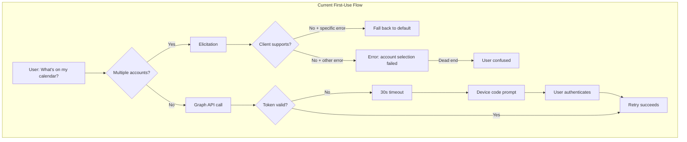

# Claude Desktop UX Improvements

## Change Summary

Real-world testing of the Outlook Local MCP extension in Claude Desktop has revealed ten UX issues that together make the first-time and returning-user experience frustrating. Users face a 30-second silent wait on first API call, cryptic error messages when account selection fails, repeated authentication prompts on every server restart, confusing account listings that include unauthenticated accounts, timezone fallback to UTC, LLM-hostile error messages that cause hallucinated advice, no diagnostic tool for self-healing, misleading tool descriptions, startup crash-loops from restored unauthenticated accounts, and unnecessary friction for the most common query ("what's on my calendar today?"). This CR addresses all ten issues as a cohesive improvement package.

## Motivation and Background

Claude Desktop is the primary distribution channel for the Outlook Local MCP extension via MCPB packaging. Testing on 2026-03-16 and 2026-03-17 exposed a sequence of problems that compound into a poor first-use experience:

1. **User asks "What's on my calendar today?"** -- the `list_events` tool fails immediately with `"account selection failed: elicitation request failed: Method not found"`. The user sees a cryptic error instead of their calendar.

2. **User manually specifies `account: "default"`** -- the tool blocks for **30 seconds** (Graph API timeout) before returning a device code prompt. During those 30 seconds, the user sees nothing and thinks the extension is broken.

3. **User authenticates successfully** -- the calendar works. But when Claude Desktop restarts the server (sleep, update, close/reopen), all tokens are lost because `CGO_ENABLED=0` in release builds disables the OS keychain cache. The user must re-authenticate from scratch.

4. **`list_accounts` shows confusing state** -- returns `[{"authenticated":false,"label":"account-2"},{"authenticated":true,"label":"default"}]`. The unauthenticated "account-2" account triggers multi-account elicitation on every tool call, even though it's unusable.

5. **Timezone defaults to UTC** -- the auto-detection returns `'Local'` in the MCPB sandbox, falling back to UTC. The LLM must explicitly pass `timezone: "Europe/Stockholm"` on every call.

### Log Evidence

**Session 1 (2026-03-16T07:34 - lines 46-118)**:
- `list_events` without account: blocks 30s, gets `DeviceCodeCredential: context deadline exceeded`, elicitation fails with `Method not found`, device code returned as text
- User authenticates, subsequent calls succeed
- `add_account` for "account-1": elicitation fails 4 times in a row (lines 81-108), each generating a new device code that the user cannot see

**Session 2 (2026-03-16T09:14 - lines 140-176)**:
- Server restarted -- all tokens lost (in-memory cache cleared)
- `list_calendars`: blocks 30s, device code returned, user authenticates again
- `add_account` for "account-2": works after device code flow

**Session 3 (2026-03-16T21:37 - lines 184-235)**:
- Server crash-loop: starts, prints device code to stderr, Claude Desktop kills and restarts 3 times within 7 seconds (lines 200-291)
- After stabilizing: server works but no tool calls in this session

**Session 4 (2026-03-17T08:14 - lines 301-345)** -- the user-reported session:
- `list_events` without account: immediate error `"account selection failed: elicitation request failed: Method not found"` (not the 30s timeout this time because elicitation fails first)
- `list_events` with `account: "default"`: blocks 30s, device code returned
- User authenticates, calendar works

## Change Drivers

* **Critical**: Account resolver elicitation fallback does not recognize Claude Desktop's error format, causing all multi-account tool calls to fail
* **Critical**: Token cache is in-memory-only in all released binaries, requiring re-authentication on every server restart
* **High**: 30-second silent blocking delay before the user sees the auth prompt
* **High**: LLM-hostile error messages (raw Azure SDK traces) cause the LLM to hallucinate incorrect troubleshooting advice
* **High**: Startup crash-loop when restored unauthenticated accounts trigger device code output during initialization
* **Medium**: Unauthenticated accounts pollute account selection and trigger unnecessary elicitation
* **Medium**: Timezone auto-detection fails in MCPB sandbox environment
* **Medium**: Tool descriptions promise elicitation-based account selection that doesn't work in Claude Desktop
* **Medium**: No health/status tool for the LLM to self-diagnose connectivity and auth issues
* **Low**: Common query "what's on my calendar today?" requires the LLM to construct ISO 8601 datetimes, guess timezone, and format a multi-parameter call

## Current State

### Issue 1: Account Resolver Elicitation Fallback Too Narrow

The `elicitAccountSelection` function in `account_resolver.go:176-186` only falls back to the "default" account when the error is exactly `ErrElicitationNotSupported`:

```go
if errors.Is(err, mcpserver.ErrElicitationNotSupported) {
    entry, found := s.registry.Get("default")
    // ...
    return entry, nil
}
return nil, fmt.Errorf("account selection failed: %w", err)
```

Claude Desktop returns `elicitation request failed: Method not found` (JSON-RPC error code -32601), which is **not** `ErrElicitationNotSupported`. The fallback never triggers, and the user gets `"account selection failed: elicitation request failed: Method not found"`.

CR-0031 fixed the same pattern in the auth flows (`add_account` and auth middleware) but **did not address the account resolver**. The account resolver was implemented in CR-0025 before CR-0031's "any elicitation error" pattern was established.

### Issue 2: No Persistent Token Cache (CGO_ENABLED=0)

The `.goreleaser.yaml` sets `CGO_ENABLED=0` for all builds. This triggers `cache_nocgo.go` which returns zero-value caches:

```go
func InitCache(name string) azidentity.Cache {
    slog.Warn("persistent token cache unavailable (CGo disabled), falling back to in-memory cache")
    return azidentity.Cache{}
}
```

Tokens exist only in process memory. Every server restart (Claude Desktop sleep/wake, update, crash) destroys all cached tokens. The auth record (non-secret metadata) is persisted to disk, but without the actual token, re-authentication is required.

### Issue 3: 30-Second Blocking Delay on Auth Error

When the auth middleware detects a token error (e.g., expired or missing token), the flow is:

1. Graph API call starts with the existing credential
2. Azure SDK attempts silent token acquisition -- **blocks for 30 seconds** (the `context deadline exceeded` timeout) before returning an error
3. Auth middleware catches the error, starts device code flow
4. Device code is presented to the user

The user experiences a 30-second silent wait before seeing the auth prompt. In the logs, this is visible as `"duration":30001697792` (30 seconds) in the error entries.

### Issue 4: Unauthenticated Accounts in Selection

The `list_accounts` tool returns all registered accounts regardless of auth state. The account resolver's `elicitAccountSelection` includes all accounts (authenticated and unauthenticated) in the selection options. When there are 2+ accounts registered (even if only 1 is authenticated), the resolver attempts elicitation instead of auto-selecting the only usable account.

### Issue 5: Timezone Auto-Detection Fails in MCPB Sandbox

The MCPB extension binary runs in a sandbox where timezone detection via `time.Now().Location().String()` returns `"Local"` instead of the actual IANA timezone. The current code detects this and falls back to UTC:

```
WARN timezone auto-detection returned 'Local', falling back to UTC
```

This means events are returned in UTC unless the LLM explicitly passes a timezone parameter.

### Issue 6: LLM-Hostile Error Messages

Error messages from the auth middleware and Graph API calls expose raw Azure SDK error strings to the LLM. For example, when authentication fails mid-session, the tool returns text containing `"DeviceCodeCredential: context deadline exceeded"`. The LLM cannot parse this and hallucinates incorrect advice -- in the observed session, Claude told the user to "check your calendar connection in Settings (the gear icon in Claude.ai)" which is entirely wrong (there is no such setting for MCP extensions).

The `FormatAuthError()` function in `internal/auth/errors.go:77-98` does wrap errors with generic troubleshooting steps, but the raw SDK error string is still included in the message. More importantly, error messages lack **LLM-actionable instructions** -- they don't tell the LLM which tool to call next to recover (e.g., `list_accounts` to check state, `add_account` to re-authenticate).

### Issue 7: No Health/Status Tool

There is no diagnostic tool the LLM can call to pre-flight check the extension before attempting a calendar operation. The only way to discover that authentication is broken is to attempt a calendar tool call and observe the failure. A `status` tool returning auth state per account, detected timezone, and server version would let the LLM self-diagnose and provide accurate guidance without trial-and-error failures that confuse the user.

Currently, 12-13 tools are registered (9 calendar + 3 account management + conditional `complete_auth`). None provide a read-only health check.

### Issue 8: Misleading Tool Descriptions

All 9 calendar tools include this account parameter description:

```
"Account label to use. If omitted with multiple accounts, you will be prompted to select."
```

This is inaccurate for Claude Desktop -- the "prompt" is MCP elicitation, which Claude Desktop does not support. The LLM reads this description and omits the account parameter, expecting a prompt that never comes, resulting in the cryptic error from Issue 1. The tool descriptions should reflect the actual fallback behavior so the LLM can make informed decisions.

### Issue 9: Startup Crash-Loop from Restored Accounts

Session 3 (lines 200-291) shows the server crashing and restarting 3 times within 7 seconds. The pattern:

1. Server starts, `RestoreAccounts` attempts silent token acquisition for restored accounts
2. Silent auth fails (token expired, in-memory cache empty), device code message printed to stderr
3. Server takes ~5 seconds to complete initialization and respond to the `initialize` JSON-RPC call
4. Claude Desktop interprets the slow response as a hang, kills the process
5. Claude Desktop restarts the server, cycle repeats

The `RestoreAccounts` function correctly uses a 5-second timeout for silent auth and does not trigger interactive flows. However, the device code message that appears on stderr (from Azure SDK's `DeviceCodeCredential` callback) is emitted **before** the auth timeout completes, which adds to the initialization time. The stderr output also pollutes logs with device codes that no user will ever see.

The root cause: `RestoreAccounts` calls `cred.GetToken()` for each restored account, which for `DeviceCodeCredential` immediately prints the device code to stderr even though the token acquisition will time out. This stderr output and the 5-second-per-account timeout together can push initialization beyond Claude Desktop's patience threshold.

### Issue 10: No Convenience for Common Queries

The most common user query is "what's on my calendar today?" but fulfilling it requires the LLM to:

1. Determine today's date and format it as ISO 8601 (`2026-03-17T00:00:00`)
2. Compute the end of day (`2026-03-17T23:59:59`)
3. Determine the user's timezone (or guess `Europe/Stockholm`)
4. Construct the full `list_events` call with all parameters

This is error-prone (the LLM sometimes gets the date format wrong) and wasteful (extra tokens for datetime construction). A convenience parameter or shorthand (e.g., `date: "today"` or `date: "2026-03-17"` that auto-expands to start/end of day in the detected timezone) would make the most common query a single-parameter call.

### Current State Diagram



## Proposed Change

### Change 1: Broaden Account Resolver Elicitation Fallback

Modify `elicitAccountSelection` in `account_resolver.go` to fall back to the "default" account on **any** elicitation error, not just `ErrElicitationNotSupported`. This aligns with the pattern established in CR-0031 for auth flows.

Additionally, when the fallback triggers, the error message returned to the tool result **MUST** include the list of available accounts and a hint to use the `account` parameter, so the LLM can self-correct on subsequent calls.

**File**: `internal/auth/account_resolver.go`, function `elicitAccountSelection`

```go
// Before (account_resolver.go:176-186):
if errors.Is(err, mcpserver.ErrElicitationNotSupported) {
    slog.Warn("elicitation not supported by client, falling back to default account")
    entry, found := s.registry.Get("default")
    if !found {
        return nil, fmt.Errorf("elicitation not supported and no default account registered")
    }
    return entry, nil
}
return nil, fmt.Errorf("account selection failed: %w", err)

// After: any elicitation error triggers fallback
slog.Warn("elicitation failed, falling back to default account", "error", err)
entry, found := s.registry.Get("default")
if !found {
    labels := s.registry.Labels()
    return nil, fmt.Errorf(
        "multiple accounts registered (%s) but elicitation is not available and no "+
            "\"default\" account exists. Specify the account explicitly using the "+
            "'account' parameter",
        strings.Join(labels, ", "))
}
return entry, nil
```

### Change 2: File-Based Token Cache for Non-CGo Builds

Implement a file-based encrypted token cache in `cache_nocgo.go` as the fallback when CGo is disabled, instead of the current zero-value in-memory cache. This ensures tokens survive server restarts without requiring OS keychain access.

**Approach**: Use the Azure SDK's `azidentity.Cache` with a file-based persistent storage backend. The `azidentity` package supports a `persistentCache` option. When CGo is unavailable, we implement an encrypted file-based cache using Go's standard library:

1. Cache file stored at `~/.outlook-local-mcp/token_cache.bin` (same directory as auth records)
2. Encrypted at rest using AES-256-GCM with a key derived from machine-specific entropy (hostname + username + stable machine identifier)
3. File permissions set to `0600` (owner read/write only)

**Note**: The encryption is defense-in-depth, not a security boundary. The primary protection is file permissions. The machine-derived key prevents casual token theft if the file is copied to another machine.

**Files**:
- `internal/auth/cache_nocgo.go` -- replace zero-value cache with file-based implementation
- `internal/auth/filecache.go` -- new file implementing the file-based cache (build-tag agnostic utility)

### Change 3: Pre-Validate Token on Startup with Short Timeout

Add a startup token validation step that checks whether the default account's cached token can be silently renewed. This uses a short timeout (5 seconds) and **MUST NOT** trigger interactive auth (no browser, no device code). If silent renewal fails, the server starts normally but logs the account's auth state, so the auth middleware handles re-authentication on first tool call with a proper user-facing prompt rather than a 30-second silent wait.

Additionally, modify the auth middleware to detect "credential not yet authenticated" errors distinctly from "token expired mid-session" errors. For the former, skip the 30-second Graph API timeout and immediately present the auth prompt.

For `device_code` credentials, `GetToken()` cannot be called without triggering interactive auth. Instead, the startup probe checks whether a persistent auth record file exists on disk. If the file exists (indicating the user authenticated in a previous session), the probe calls `markPreAuthenticated()` so the middleware tries the normal Graph API path — which uses cached tokens from the file-based cache (Change 2) — rather than the fresh-credential fast-path that would skip straight to re-authentication. This is essential for token persistence to work end-to-end with `device_code` auth: without it, the middleware would bypass the cached tokens on every restart.

**Files**:
- `cmd/outlook-local-mcp/main.go` -- add silent token probe after account registration, with auth-record-based pre-authentication for device_code
- `internal/auth/middleware.go` -- detect fresh-credential errors and skip Graph API timeout

**Alternative considered**: Reducing the Graph API timeout from 30s to 5s. Rejected because legitimate token renewal during an active session (not startup) may need the full timeout.

### Change 4: Filter Unauthenticated Accounts from Auto-Selection

Modify the account resolver to consider only **authenticated** accounts when deciding the resolution strategy:

- If 1 authenticated account exists (regardless of total count), auto-select it without elicitation.
- If 0 authenticated accounts exist, return an error instructing the user to authenticate via `add_account`.
- If 2+ authenticated accounts exist and no `account` parameter is provided, attempt elicitation (with fallback to "default").

The `AccountEntry` already has an `Authenticated` field (set during `RestoreAccounts` and `add_account`). The resolver needs to filter by this field.

**File**: `internal/auth/account_resolver.go`, function `resolveAccount`

```go
// Before: uses registry.Count() which includes unauthenticated accounts
if s.registry.Count() == 1 {
    entries := s.registry.List()
    return entries[0], nil
}

// After: filter to authenticated accounts only
authenticated := s.registry.ListAuthenticated()
if len(authenticated) == 0 {
    return nil, fmt.Errorf("no authenticated accounts. Use add_account to authenticate")
}
if len(authenticated) == 1 {
    return authenticated[0], nil
}
// Multiple authenticated accounts: elicit or fallback
```

**Note**: This requires adding a `ListAuthenticated()` method to `AccountRegistry` that filters by `entry.Authenticated == true`.

### Change 5: Improve Timezone Auto-Detection

Enhance the timezone detection to use additional sources when `time.Now().Location().String()` returns `"Local"`:

1. Check `TZ` environment variable
2. On macOS: read `/etc/localtime` symlink target to extract IANA timezone
3. On Linux: read `/etc/timezone` file
4. Fall back to UTC only if all sources fail

**Files**:
- `internal/config/timezone.go` (or wherever timezone detection currently lives)

### Change 6: LLM-Actionable Error Messages

Replace raw Azure SDK error strings in user-facing tool results with structured, LLM-actionable messages. Each error message **MUST** include:

1. A plain-language description of what went wrong
2. The specific tool and parameters the LLM should call to recover
3. No raw SDK class names or stack-trace-like text

**File**: `internal/auth/errors.go`, function `FormatAuthError`

Example transformation:

```
// Before:
"Authentication failed: DeviceCodeCredential: context deadline exceeded

Troubleshooting steps:
1. Check your network connectivity
2. Complete the authentication prompt in your browser
3. Restart the server and try again"

// After:
"Authentication expired for this account. To re-authenticate:
1. Call list_accounts to check which accounts need authentication
2. Call add_account with the account label to start a new authentication flow
3. After authenticating, retry your original request"
```

Additionally, the auth middleware's error wrapping at `middleware.go:165,473,561` **MUST** use the improved `FormatAuthError()` consistently and **MUST NOT** pass through raw `err.Error()` strings from Azure SDK.

**Files**:
- `internal/auth/errors.go` -- rewrite `FormatAuthError()` for LLM-actionable output
- `internal/auth/middleware.go` -- ensure all error paths use `FormatAuthError()`

### Change 7: Add `status` Diagnostic Tool

Add a new read-only `status` tool that returns a JSON summary of server health:

```json
{
  "version": "1.0.0",
  "timezone": "Europe/Stockholm",
  "accounts": [
    {"label": "default", "authenticated": true},
    {"label": "work", "authenticated": false}
  ],
  "server_uptime_seconds": 3600
}
```

This tool has no required parameters, is read-only, and does not call the Graph API. It enables the LLM to:
- Check if accounts are authenticated before attempting calendar operations
- Know the detected timezone for formatting requests
- Diagnose issues without triggering error flows

**Files**:
- `internal/tools/status.go` -- new tool handler
- `internal/server/server.go` -- register the tool

### Change 8: Update Tool Descriptions for Non-Elicitation Clients

Update the account parameter description on all 9 calendar tools from:

```
"Account label to use. If omitted with multiple accounts, you will be prompted to select."
```

To:

```
"Account label to use. If omitted, the default account is used. Use list_accounts to see available accounts."
```

This accurately describes the fallback behavior after Change 1 is applied and guides the LLM toward `list_accounts` for discovery.

**Files**: All 9 calendar tool files in `internal/tools/`:
- `list_calendars.go:33`
- `list_events.go:66`
- `get_event.go:55`
- `search_events.go:91`
- `get_free_busy.go:57`
- `create_event.go:96`
- `update_event.go:87`
- `delete_event.go:41`
- `cancel_event.go:45`

### Change 9: Skip Silent Auth for DeviceCodeCredential During Restore

Modify `RestoreAccounts` (or the per-account `restoreOne` function) to skip `GetToken()` for accounts using `device_code` auth method. For `device_code` credentials, silent token acquisition without a cached token will always trigger the device code callback (printing to stderr) and then time out. This wastes 5 seconds per account during startup and produces spurious stderr output that confuses Claude Desktop.

Instead, for `device_code` accounts without a valid cached token:
1. Register the account with `Client = nil` (already the failure path)
2. Set `Authenticated = false`
3. Defer re-authentication to the first tool call via the auth middleware

For `browser` and `auth_code` methods, silent token acquisition can still be attempted since they don't produce stderr output on failure.

**File**: `internal/auth/restore.go`, function `restoreOne`

### Change 10: Date Convenience Parameter for `list_events`

Add an optional `date` parameter to the `list_events` tool that accepts:
- An ISO 8601 date string (e.g., `"2026-03-17"`) -- expands to start-of-day/end-of-day in the detected timezone
- The literal string `"today"` -- resolves to today's date in the detected timezone

When `date` is provided, `start_datetime` and `end_datetime` become optional (derived from `date`). When `start_datetime`/`end_datetime` are provided, `date` is ignored (backward-compatible).

This reduces the most common query from a 3-parameter call to a 1-parameter call:

```json
// Before:
{"start_datetime": "2026-03-17T00:00:00", "end_datetime": "2026-03-17T23:59:59", "timezone": "Europe/Stockholm"}

// After:
{"date": "today"}
```

**File**: `internal/tools/list_events.go`

### Proposed State Diagram

```mermaid
flowchart TD
    subgraph Proposed["Proposed First-Use Flow"]
        A["User: What's on my calendar?"] --> A1["LLM calls list_events\nwith date='today'"]
        A1 --> B{Authenticated accounts?}
        B -->|0| B0["LLM-actionable error:\ncall add_account"]
        B -->|1| G[Auto-select, skip elicitation]
        B -->|2+| C{Account param?}
        C -->|Yes| G2[Use specified account]
        C -->|No| D[Elicitation]
        D -->|Fails| E[Fall back to default]
        G --> H{Token valid?}
        H -->|No: fresh credential| I2["Immediate auth prompt\n(no 30s wait)"]
        H -->|No: expired mid-session| I["30s renewal attempt"]
        I --> I2
        I2 --> J["LLM-actionable device code\nwith recovery instructions"]
        J --> K[User authenticates]
        K --> L[Calendar in local timezone]
        H -->|Yes| L
        G2 --> H
        E --> H
    end

    subgraph Diagnostic["LLM Self-Healing"]
        S1["LLM calls status tool"] --> S2{Accounts healthy?}
        S2 -->|Yes| S3["Proceed with calendar tools"]
        S2 -->|No| S4["LLM calls add_account\nproactively"]
    end
```



## Requirements

### Functional Requirements

1. The account resolver **MUST** fall back to the "default" account on any elicitation error, not only `ErrElicitationNotSupported`.
2. The account resolver **MUST** consider only authenticated accounts when deciding resolution strategy (auto-select vs. elicitation).
3. The account resolver **MUST** auto-select the sole authenticated account when exactly one authenticated account exists, regardless of the total number of registered accounts.
4. The account resolver **MUST** return an actionable error message listing available accounts and the `account` parameter hint when fallback to "default" fails.
5. The token cache **MUST** persist tokens to disk when CGo is disabled, surviving process restarts.
6. The file-based token cache **MUST** encrypt tokens at rest using AES-256-GCM.
7. The file-based token cache file **MUST** be created with `0600` permissions.
8. The server **MUST** attempt silent token validation for the default account at startup with a maximum 5-second timeout.
9. Startup token validation **MUST NOT** trigger interactive authentication (no browser launch, no device code flow).
10. The auth middleware **MUST** detect fresh-credential (never authenticated) errors and present the auth prompt immediately without waiting for the Graph API timeout.
10a. For `device_code` credentials where the startup token probe is skipped, the probe **MUST** check whether a persistent auth record file exists on disk. If the file exists, the probe **MUST** call `markPreAuthenticated()` so the middleware uses the normal Graph API path (which reads cached tokens from the file-based cache) rather than the fresh-credential fast-path.
11. Timezone auto-detection **MUST** read OS-level timezone sources (`/etc/localtime` symlink on macOS, `/etc/timezone` on Linux, `TZ` env var) before falling back to UTC.
12. The `AccountRegistry` **MUST** expose a `ListAuthenticated()` method that returns only entries with `Authenticated == true`.

13. All user-facing error messages from the auth middleware **MUST** include LLM-actionable recovery instructions (which tool to call next) and **MUST NOT** include raw Azure SDK class names or error strings.
14. The `FormatAuthError()` function **MUST** be the sole path for formatting auth errors in all tool results.
15. A read-only `status` tool **MUST** be registered that returns server version, detected timezone, and per-account authentication state without calling the Graph API.
16. The account parameter description on all calendar tools **MUST** be updated to reflect the actual fallback behavior (default account, not elicitation prompt).
17. `RestoreAccounts` **MUST** skip `GetToken()` for accounts using `device_code` auth method to avoid spurious stderr output and startup delay.
18. The `list_events` tool **MUST** accept an optional `date` parameter (ISO 8601 date or `"today"`) that expands to start/end-of-day in the detected timezone.
19. When `date` is provided to `list_events`, `start_datetime` and `end_datetime` **MUST** become optional.
20. When both `date` and `start_datetime`/`end_datetime` are provided, `start_datetime`/`end_datetime` **MUST** take precedence.

### Non-Functional Requirements

1. Startup token validation **MUST** complete within 5 seconds and **MUST NOT** delay server initialization beyond that bound.
2. The file-based token cache **MUST NOT** introduce a dependency on CGo or platform-specific native libraries.
3. All changes **MUST** preserve existing behavior for MCP clients that support elicitation.
4. The file-based token cache **MUST** gracefully handle corruption (truncated file, invalid ciphertext) by clearing the cache and requiring re-authentication rather than crashing.
5. The `status` tool **MUST** return within 100ms (no network calls).
6. The `date` convenience parameter **MUST** be fully backward-compatible -- existing calls with explicit `start_datetime`/`end_datetime` **MUST** work unchanged.

## Affected Components

* `internal/auth/account_resolver.go` -- elicitation fallback and authenticated-only filtering
* `internal/auth/cache_nocgo.go` -- replace in-memory cache with file-based cache
* `internal/auth/filecache.go` -- new file-based encrypted cache implementation
* `internal/auth/registry.go` -- add `ListAuthenticated()` method
* `internal/auth/middleware.go` -- detect fresh-credential errors for immediate auth prompt
* `internal/auth/errors.go` -- rewrite `FormatAuthError()` for LLM-actionable output
* `internal/auth/restore.go` -- skip `GetToken()` for device_code accounts
* `internal/tools/status.go` -- new status diagnostic tool
* `internal/tools/list_events.go` -- add `date` convenience parameter
* `internal/tools/list_calendars.go`, `get_event.go`, `search_events.go`, `get_free_busy.go`, `create_event.go`, `update_event.go`, `delete_event.go`, `cancel_event.go` -- update account parameter description
* `internal/server/server.go` -- register `status` tool
* `cmd/outlook-local-mcp/main.go` -- startup token validation probe
* `internal/config/timezone.go` -- enhanced timezone detection

## Scope Boundaries

### In Scope

* Account resolver elicitation fallback broadening (any error, not just sentinel)
* Account resolver filtering by authenticated state
* File-based encrypted token cache for non-CGo builds
* Startup silent token probe (5-second timeout, no interactive auth)
* Auth middleware optimization for fresh-credential detection
* OS-level timezone detection enhancement
* LLM-actionable error message rewrite for all auth error paths
* New read-only `status` diagnostic tool
* Tool description updates for all 9 calendar tools (account parameter)
* Startup restore optimization (skip `GetToken()` for device_code accounts)
* `date` convenience parameter on `list_events`

### Out of Scope ("Here, But Not Further")

* CGo-enabled keychain cache -- existing implementation unchanged, only the non-CGo fallback is improved
* MCP Elicitation support in Claude Desktop -- external dependency, not under this project's control
* Auth middleware changes for `browser` or `auth_code` methods -- those were addressed in CR-0031
* Token refresh/renewal logic within Azure SDK -- only the cache persistence layer is changed
* `add_account` device code loop -- already fixed in CR-0035
* Windows timezone detection via registry -- deferred; `TZ` env var and file-based methods cover the primary deployment scenarios (macOS/Linux)
* `date` convenience parameter on other tools (`search_events`, `get_free_busy`) -- can be added in a follow-up CR if the pattern proves useful
* MCP progress notifications during long operations -- Claude Desktop support is unclear
* Tool result formatting improvements (e.g., Markdown tables) -- separate concern from UX fixes

## Impact Assessment

### User Impact

**First-time users**: Will see their calendar immediately (single account) or get a clear error with instructions (multi-account, no elicitation). No more cryptic `"account selection failed: elicitation request failed: Method not found"`. The LLM can call `status` to pre-check health and proactively guide the user through authentication.

**Returning users**: Tokens persist across server restarts. No more re-authenticating every time Claude Desktop is reopened or the system wakes from sleep.

**Auth prompt latency**: When re-authentication is needed (e.g., token expiry after weeks), the device code prompt appears immediately instead of after a 30-second silent wait. Error messages guide the LLM to call the right recovery tool.

**Timezone**: Events are returned in the user's local timezone by default, without the LLM needing to explicitly pass a timezone parameter.

**Common queries**: "What's on my calendar today?" can be answered with a single `list_events(date="today")` call instead of a 3-parameter call with manual datetime construction.

**LLM behavior**: Updated tool descriptions prevent the LLM from omitting the `account` parameter expecting a prompt. LLM-actionable errors prevent hallucinated troubleshooting advice.

### Technical Impact

* **New dependency**: None. File-based cache uses Go standard library (`crypto/aes`, `crypto/cipher`, `os`).
* **Breaking changes**: None. All changes are backward-compatible. The `date` parameter is additive; `start_datetime`/`end_datetime` remain functional.
* **New tool**: `status` tool added (read-only, no Graph API calls).
* **Tool schema change**: `list_events` gains optional `date` parameter; `start_datetime`/`end_datetime` become conditionally required (required only when `date` is not provided).
* **File system**: New file `~/.outlook-local-mcp/token_cache.bin` created on first use.
* **Build**: No change to build process. `CGO_ENABLED=0` remains the default.

### Business Impact

Eliminates the most common complaints from the initial MCPB extension launch: repeated auth prompts and cryptic errors. Significantly improves first-impression quality for new users discovering the extension via Claude Desktop.

## Implementation Approach

Nine phases (Changes 1 and 4 are combined into Phase 1), grouped into three tiers by impact. Each phase is independently valuable and shippable:

- **Tier 1 (Critical/High)**: Phases 1-4 -- eliminate the most visible UX blockers
- **Tier 2 (Medium)**: Phases 5-8 -- improve LLM behavior and diagnostics
- **Tier 3 (Polish)**: Phases 9-10 -- convenience and quality-of-life

### Implementation Flow

```mermaid
flowchart LR
    subgraph Tier1["Tier 1: Critical/High"]
        subgraph Phase1["Phase 1: Account Resolver"]
            A1["Broaden elicitation fallback"] --> A2["Filter by authenticated state"]
            A2 --> A3["Add ListAuthenticated()"]
        end
        subgraph Phase2["Phase 2: Token Cache"]
            B1["Implement filecache.go"] --> B2["Wire into cache_nocgo.go"]
            B2 --> B3["Handle corruption"]
        end
        subgraph Phase3["Phase 3: Auth Latency"]
            C1["Startup token probe"] --> C2["Fresh-credential detection"]
        end
        subgraph Phase4["Phase 4: Startup Stability"]
            D1["Skip GetToken for device_code"] --> D2["Log auth state"]
        end
    end
    subgraph Tier2["Tier 2: Medium"]
        subgraph Phase5["Phase 5: Error Messages"]
            E1["Rewrite FormatAuthError"] --> E2["LLM-actionable recovery"]
        end
        subgraph Phase6["Phase 6: Tool Descriptions"]
            F1["Update account param text"]
        end
        subgraph Phase7["Phase 7: Status Tool"]
            G1["Implement status.go"] --> G2["Register in server.go"]
        end
        subgraph Phase8["Phase 8: Timezone"]
            H1["/etc/localtime"] --> H2["/etc/timezone"]
            H2 --> H3["TZ env var"]
        end
    end
    subgraph Tier3["Tier 3: Polish"]
        subgraph Phase9["Phase 9: Date Convenience"]
            I1["Add date param to list_events"] --> I2["Expand to start/end"]
        end
    end
    Tier1 --> Tier2 --> Tier3
```



## Test Strategy

### Tests to Add

| Test File | Test Name | Description | Inputs | Expected Output |
|-----------|-----------|-------------|--------|-----------------|
| `internal/auth/account_resolver_test.go` | `TestElicitAccountSelection_AnyError_FallsBackToDefault` | Any elicitation error (not just ErrElicitationNotSupported) triggers default fallback | Elicit func returns `fmt.Errorf("Method not found")` | Default account entry returned |
| `internal/auth/account_resolver_test.go` | `TestElicitAccountSelection_AnyError_NoDefault_ReturnsAccountList` | Error message lists accounts and hints at `account` parameter | Elicit fails, no "default" account | Error contains account labels and parameter hint |
| `internal/auth/account_resolver_test.go` | `TestResolveAccount_OnlyAuthenticatedConsidered` | Unauthenticated accounts excluded from auto-select | 1 authenticated + 1 unauthenticated, no account param | Authenticated account auto-selected |
| `internal/auth/account_resolver_test.go` | `TestResolveAccount_ZeroAuthenticated_ReturnsError` | Error when no authenticated accounts exist | 2 unauthenticated accounts | Error: "no authenticated accounts" |
| `internal/auth/account_resolver_test.go` | `TestResolveAccount_MultipleAuthenticated_ElicitsSelection` | Elicitation triggered only when 2+ authenticated accounts | 2 authenticated accounts, no account param | Elicitation called |
| `internal/auth/filecache_test.go` | `TestFileCache_PersistAndReload` | Tokens survive write-close-reopen cycle | Write token, close, reopen, read | Same token returned |
| `internal/auth/filecache_test.go` | `TestFileCache_Encryption` | Raw file content is not plaintext | Write token, read raw bytes | Bytes differ from plaintext token |
| `internal/auth/filecache_test.go` | `TestFileCache_CorruptionRecovery` | Corrupted file is cleared and re-created | Truncate cache file mid-write, then open | Empty cache, no crash |
| `internal/auth/filecache_test.go` | `TestFileCache_Permissions` | File created with 0600 permissions | Create cache file | File mode is `0600` |
| `internal/auth/registry_test.go` | `TestListAuthenticated_FiltersCorrectly` | Only authenticated entries returned | Mix of authenticated and unauthenticated | Only authenticated entries |
| `internal/auth/errors_test.go` | `TestFormatAuthError_NoRawSDKStrings` | LLM-actionable output contains no Azure SDK class names | Various Azure SDK errors | Output contains recovery instructions, no raw SDK strings |
| `internal/auth/errors_test.go` | `TestFormatAuthError_IncludesRecoverySteps` | Error output includes tool names for recovery | Auth timeout error | Output mentions `list_accounts` and `add_account` |
| `internal/auth/restore_test.go` | `TestRestoreOne_DeviceCode_SkipsGetToken` | device_code accounts skip silent auth | Account with auth_method=device_code | `GetToken()` not called, account registered with Client=nil |
| `internal/auth/restore_test.go` | `TestRestoreOne_Browser_AttemptsGetToken` | browser accounts still attempt silent auth | Account with auth_method=browser | `GetToken()` called |
| `internal/tools/status_test.go` | `TestStatus_ReturnsHealthSummary` | Returns version, timezone, account state | No params | JSON with version, timezone, accounts array |
| `internal/tools/status_test.go` | `TestStatus_NoGraphAPICalls` | Tool does not call Graph API | No params | Completes without network access |
| `internal/tools/list_events_test.go` | `TestListEvents_DateToday_ExpandsToStartEndOfDay` | `date: "today"` expands correctly | `{"date": "today"}` | start_datetime=00:00:00, end_datetime=23:59:59 in detected TZ |
| `internal/tools/list_events_test.go` | `TestListEvents_DateISO_ExpandsToStartEndOfDay` | `date: "2026-03-17"` expands correctly | `{"date": "2026-03-17"}` | start_datetime=2026-03-17T00:00:00, end_datetime=2026-03-17T23:59:59 |
| `internal/tools/list_events_test.go` | `TestListEvents_DateAndExplicitRange_ExplicitWins` | Explicit start/end takes precedence over date | `{"date": "today", "start_datetime": "..."}` | Explicit values used |
| `internal/tools/list_events_test.go` | `TestListEvents_NoDateNoRange_ReturnsError` | Error when neither date nor start/end provided | `{}` | Validation error |
| `internal/auth/middleware_test.go` | `TestMiddleware_AllAuthErrors_UseFormatAuthError` | All auth error paths in middleware use FormatAuthError exclusively (AC-10a) | Various auth error scenarios | All error outputs match FormatAuthError format, no raw SDK strings |
| `internal/auth/middleware_test.go` | `TestMiddleware_FreshCredential_ImmediateAuthPrompt` | Fresh credential triggers immediate auth prompt without 30s Graph API timeout (AC-7) | Tool call with never-authenticated credential | Auth prompt returned within 5 seconds, no Graph API call attempted |
| `cmd/outlook-local-mcp/main_test.go` | `TestStartupTokenProbe_CompletesWithin5Seconds` | Startup probe completes within bound and does not trigger interactive auth (AC-8) | Expired token in cache | Probe completes within 5s, no browser/device code launched, server ready |
| `cmd/outlook-local-mcp/main_test.go` | `TestStartupTokenProbe_CompletesWithin5Seconds/device_code_with_auth_record_marks_pre_authenticated` | Device code probe marks pre-authenticated when auth record exists (AC-8a) | Auth method=device_code, auth record file exists on disk | `markPreAuthenticated` called, `GetToken` NOT called |
| `cmd/outlook-local-mcp/main_test.go` | `TestStartupTokenProbe_CompletesWithin5Seconds/device_code_skipped_no_auth_record` | Device code probe does not mark pre-authenticated when no prior auth (AC-8a) | Auth method=device_code, no auth record file | `markPreAuthenticated` NOT called, `GetToken` NOT called |
| `internal/config/timezone_test.go` | `TestTimezoneDetection_FallsBackToOSSources` | OS-level timezone sources used when Location() returns "Local" (AC-9) | `time.Now().Location()` returns "Local", `/etc/localtime` or `TZ` set | Detected timezone matches OS config, not UTC |
| `internal/tools/tool_description_test.go` | `TestCalendarTools_AccountParamDescription` | All 9 calendar tools have updated account parameter description (AC-12) | Tool schema inspection | Description states default account is used, does not promise elicitation prompt |
| `internal/auth/account_resolver_test.go` | `TestResolveAccount_ElicitationClient_NoFallback` | Elicitation-supporting clients still get the elicitation prompt, no fallback (AC-16) | Elicitation succeeds | Selected account returned, fallback not triggered |

### Tests to Modify

| Test File | Test Name | Current Behavior | New Behavior | Reason for Change |
|-----------|-----------|------------------|--------------|-------------------|
| `internal/auth/account_resolver_test.go` | `TestElicitAccountSelection_NotSupported_FallsBackToDefault` | Tests only `ErrElicitationNotSupported` | Tests any error triggers fallback | Fallback broadened per Change 1 |
| `internal/auth/account_resolver_test.go` | `TestResolveAccount_SingleAccount_AutoSelects` | Uses `registry.Count() == 1` | Uses `len(ListAuthenticated()) == 1` | Auto-select based on authenticated count |

### Tests to Remove

Not applicable. No existing tests become redundant.

## Acceptance Criteria

### AC-1: Account resolver fallback on any elicitation error

```gherkin
Given an MCP client that does not support elicitation (returns any error)
  And multiple accounts are registered including one labeled "default"
When a tool is called without an explicit "account" parameter
Then the account resolver MUST fall back to the "default" account
  And the tool call MUST succeed without error
```

### AC-2: Account resolver filters by authenticated state

```gherkin
Given two registered accounts: "default" (authenticated) and "other" (unauthenticated)
When a tool is called without an explicit "account" parameter
Then the account resolver MUST auto-select "default" without attempting elicitation
```

### AC-3: Actionable error when no default account and elicitation fails

```gherkin
Given multiple registered accounts with no "default" label
  And the MCP client does not support elicitation
When a tool is called without an explicit "account" parameter
Then the error message MUST list the available account labels
  And the error message MUST instruct the user to use the "account" parameter
```

### AC-4: Token cache persists across restarts (non-CGo)

```gherkin
Given the server is built with CGO_ENABLED=0
  And a user has authenticated successfully
When the server process is stopped and restarted
Then the previously cached token MUST be available
  And the user MUST NOT be prompted to re-authenticate (until token expiry)
```

### AC-5: Token cache file encrypted and permission-protected

```gherkin
Given the file-based token cache is in use
When a token is persisted to disk
Then the file MUST be encrypted using AES-256-GCM
  And the file permissions MUST be 0600
```

### AC-6: Corrupt token cache handled gracefully

```gherkin
Given the token cache file exists but is corrupted
When the server starts and attempts to read the cache
Then the server MUST clear the corrupted cache
  And the server MUST start normally
  And the user MUST be prompted to re-authenticate on next tool call
```

### AC-7: No 30-second delay for fresh credentials

```gherkin
Given the server has started with a fresh credential (never authenticated)
When the user calls a calendar tool for the first time
Then the auth prompt (device code) MUST appear within 5 seconds of the tool call being received
  And the auth middleware MUST NOT attempt a Graph API call (which would block for 30 seconds) before presenting the prompt
```

### AC-8: Startup token probe does not block

```gherkin
Given the default account's cached token has expired
When the server starts
Then the startup token probe MUST complete within 5 seconds
  And the server MUST finish initialization and be ready for tool calls
  And the probe MUST NOT trigger interactive authentication
```

### AC-8a: Device code probe uses auth record for pre-authentication

```gherkin
Given the auth method is device_code
  And a persistent auth record file exists from a previous session
  And the file-based token cache contains tokens from that session
When the server starts and the startup token probe runs
Then the probe MUST NOT call GetToken (which would trigger interactive auth)
  And the probe MUST call markPreAuthenticated (because the auth record indicates prior authentication)
  And the middleware MUST try the normal Graph API path on the first tool call (using cached tokens)
  And the user MUST NOT be prompted to re-authenticate
```

### AC-9: Timezone auto-detected from OS

```gherkin
Given the process runs in an environment where time.Now().Location() returns "Local"
  And the operating system has timezone data available via /etc/localtime (macOS) or /etc/timezone (Linux) or TZ env var
When the server initializes timezone configuration
Then the detected timezone MUST match the OS-configured IANA timezone
  And the timezone MUST NOT fall back to UTC
```

### AC-10: LLM-actionable error messages

```gherkin
Given a tool call that fails due to an authentication error
When the error is returned to the LLM
Then the error text MUST include which tool to call next (e.g., "call list_accounts" or "call add_account")
  And the error text MUST NOT contain raw Azure SDK class names (e.g., "DeviceCodeCredential", "InteractiveBrowserCredential")
```

### AC-10a: FormatAuthError is the sole error formatting path

```gherkin
Given the auth middleware encounters any authentication error
When the error is formatted for the tool result
Then the error MUST be formatted exclusively through FormatAuthError()
  And no auth error path in middleware.go MUST pass raw err.Error() strings to the tool result
```

### AC-11: Status tool returns health summary

```gherkin
Given the server is running with one authenticated and one unauthenticated account
When the LLM calls the status tool
Then the response MUST include the server version
  And the response MUST include the detected timezone
  And the response MUST include per-account authentication state
  And the response MUST complete without calling the Graph API
```

### AC-12: Tool descriptions reflect actual fallback behavior

```gherkin
Given the server is running in Claude Desktop (no elicitation support)
When the LLM reads the tool descriptions for any calendar tool
Then the account parameter description MUST state that the default account is used when omitted
  And the description MUST NOT promise that the user "will be prompted to select"
```

### AC-13: No startup crash-loop from restored device_code accounts

```gherkin
Given the accounts.json file contains a device_code account with no cached token
When the server starts and calls RestoreAccounts
Then RestoreAccounts MUST NOT call GetToken() for that account
  And RestoreAccounts MUST NOT print device code messages to stderr
  And the server MUST respond to the initialize request within 3 seconds
```

### AC-14: Date convenience parameter on list_events

```gherkin
Given the server has detected timezone "Europe/Stockholm"
When the LLM calls list_events with date="today" and no start_datetime/end_datetime
Then list_events MUST expand "today" to start=00:00:00 and end=23:59:59 in Europe/Stockholm
  And the events MUST be returned successfully
```

### AC-15: Date parameter backward compatibility

```gherkin
Given an existing integration that calls list_events with explicit start_datetime and end_datetime
When the call also includes a date parameter
Then start_datetime and end_datetime MUST take precedence
  And behavior MUST be identical to the pre-change version
```

### AC-16: No regression for elicitation-supporting clients

```gherkin
Given an MCP client that supports elicitation
When multiple authenticated accounts are registered and a tool is called without "account"
Then the elicitation prompt MUST appear as before
  And the fallback behavior MUST NOT be triggered
  And tool descriptions, error messages, and the date parameter MUST NOT alter the behavior of elicitation-supporting clients
```

## Quality Standards Compliance

### Build & Compilation

- [x] Code compiles/builds without errors
- [x] No new compiler warnings introduced

### Linting & Code Style

- [x] All linter checks pass with zero warnings/errors
- [x] Code follows project coding conventions and style guides
- [ ] Any linter exceptions are documented with justification

### Test Execution

- [x] All existing tests pass after implementation
- [x] All new tests pass
- [x] Test coverage meets project requirements for changed code

### Documentation

- [x] Inline code documentation updated where applicable
- [ ] API documentation updated for any API changes
- [ ] User-facing documentation updated if behavior changes

### Code Review

- [ ] Changes submitted via pull request
- [ ] PR title follows Conventional Commits format
- [ ] Code review completed and approved
- [ ] Changes squash-merged to maintain linear history

### Verification Commands

```bash
# Build verification
go build ./cmd/outlook-local-mcp/

# Lint verification
golangci-lint run

# Test execution
go test ./...

# Full CI check
make ci
```

## Risks and Mitigation

### Risk 1: File-based cache security vs. OS keychain

**Likelihood:** medium
**Impact:** medium
**Mitigation:** The file-based cache uses AES-256-GCM encryption with machine-derived key and 0600 file permissions. This is weaker than OS keychain (no hardware-backed key storage) but significantly better than plaintext or no persistence. Document the security trade-off in the cache implementation. The machine-derived key prevents casual token theft from copied files.

### Risk 2: Machine-derived key instability

**Likelihood:** low
**Impact:** medium
**Mitigation:** If the machine identifier changes (hostname rename, OS reinstall), the cache becomes undecryptable. Handle this as corruption: clear the cache and require re-authentication. This is the same user experience as the current behavior (no cache at all), so it's not a regression.

### Risk 3: Azure SDK silent token acquisition semantics

**Likelihood:** low
**Impact:** medium
**Mitigation:** The startup token probe relies on Azure SDK's silent token acquisition (using cached refresh token). Verify that `GetToken` with a short context timeout does not trigger interactive flows. Use `azidentity.TokenRequestOptions` to enforce silent-only behavior if available.

### Risk 4: Timezone detection portability

**Likelihood:** low
**Impact:** low
**Mitigation:** The `/etc/localtime` and `/etc/timezone` paths are standard on macOS and Linux respectively. Guard each path check with runtime OS detection. If neither path exists and `TZ` is unset, fall back to UTC as today (no regression).

### Risk 5: Date parameter validation edge cases

**Likelihood:** low
**Impact:** low
**Mitigation:** The `date` parameter must handle invalid dates, dates in wrong format, and the interaction with explicit start/end parameters. Use strict ISO 8601 date parsing and clear validation errors. "today" resolution depends on correct timezone detection (Change 5); if timezone falls back to UTC, "today" will resolve in UTC (acceptable degradation).

### Risk 6: Status tool information disclosure

**Likelihood:** low
**Impact:** low
**Mitigation:** The `status` tool returns server version, timezone, and account labels/auth state. No tokens, credentials, or PII are included. Account labels are user-defined strings. This is equivalent to what `list_accounts` already exposes, with the addition of version and timezone (non-sensitive).

## Dependencies

* CR-0031 (Graceful Elicitation Fallback) -- completed; this CR extends the same pattern to the account resolver
* CR-0035 (Device Code add_account Loop) -- completed; no conflicts
* No external dependencies

## Estimated Effort

**Tier 1 (Critical/High):**
- Phase 1 (Account Resolver Fix): 2-3 person-hours
- Phase 2 (File-Based Token Cache): 4-6 person-hours
- Phase 3 (Auth Latency): 2-3 person-hours
- Phase 4 (Startup Stability): 1-2 person-hours

**Tier 2 (Medium):**
- Phase 5 (Error Messages): 2-3 person-hours
- Phase 6 (Tool Descriptions): 0.5 person-hours
- Phase 7 (Status Tool): 2-3 person-hours
- Phase 8 (Timezone Detection): 1-2 person-hours

**Tier 3 (Polish):**
- Phase 9 (Date Convenience): 2-3 person-hours

**Total**: 15-25 person-hours

## Decision Outcome

Chosen approach: "Ten targeted fixes in three priority tiers", because each issue has a distinct root cause and a self-contained fix. The tiered approach allows shipping incremental improvements -- Tier 1 (Phases 1-4) eliminates the most critical UX blockers (cryptic errors, re-auth on restart, 30-second delays, startup crashes). Tier 2 (Phases 5-8) improves LLM behavior through better error messages, accurate tool descriptions, diagnostic tooling, and timezone detection. Tier 3 (Phase 9) is a quality-of-life convenience for the most common user query. Each tier can be released independently.

## Related Items

* CR-0025: Multi-Account Support with MCP Elicitation API (introduced account resolver)
* CR-0031: Graceful Elicitation Fallback (established "any error" fallback pattern for auth flows)
* CR-0035: Device Code add_account Authentication Loop (fixed add_account, not account resolver)
* `internal/auth/account_resolver.go`: Primary target for Phase 1
* `internal/auth/cache_nocgo.go`: Primary target for Phase 2
* `internal/auth/errors.go`: Primary target for Phase 5
* `internal/auth/restore.go`: Primary target for Phase 4
* `internal/tools/status.go`: New file for Phase 7
* `internal/tools/list_events.go`: Primary target for Phase 9

## More Information

### Raw Log References

The analysis is based on `claude-desktop-logs.log` captured from Claude Desktop's MCP extension logging on 2026-03-16 and 2026-03-17. Key log lines referenced:

| Line(s) | Session | Issue |
|---------|---------|-------|
| 53-59 | Session 1 | 30s timeout + elicitation failure + device code fallback |
| 81-108 | Session 1 | add_account elicitation failure loop (4 attempts) |
| 152-157 | Session 2 | Token lost after restart, 30s timeout again |
| 200-291 | Session 3 | Server crash-loop with device codes on stderr |
| 326-329 | Session 4 | Account resolver elicitation error (user-reported) |
| 337-342 | Session 4 | 30s timeout on list_events with explicit account |
| 18-19, 48, 201-202 | All | "persistent token cache unavailable (CGo disabled)" |
| 47, 142, 225, 259 | All | "timezone auto-detection returned 'Local', falling back to UTC" |
| 57-59 | Session 1 | Elicitation fails, device code returned as raw text (no recovery instructions) |
| 200-228 | Session 3 | Server crash-loop: device code on stderr, repeated restarts within 7 seconds |
| Chat history | Session 4 | LLM hallucinates "check Settings in Claude.ai" from raw error message |
| Chat history | Session 4 | LLM had to do tool_search to discover list_accounts tool |
| 326-329 | Session 4 | list_events without account param: LLM expected elicitation prompt per tool description |

<!-- CR-0037 Review Summary (2026-03-17)

Reviewer: CR Reviewer Agent

## Findings: 7 total

### Contradictions Fixed: 1
1. **Phase count mismatch**: Text said "Ten phases" but Implementation Flow diagram shows 9 phases
   (Changes 1+4 combined into Phase 1). Fixed: changed "Ten phases" to "Nine phases" with
   explanation that Changes 1 and 4 are combined.

### Ambiguity Fixed: 2
2. **AC-7 measurement ambiguity**: "appear within 5 seconds" lacked measurement reference point.
   Fixed: "within 5 seconds of the tool call being received" and clarified middleware MUST NOT
   attempt Graph API call before presenting prompt.
3. **AC-16 vague "interfere"**: "MUST NOT interfere with normal operation" is not testable.
   Fixed: "MUST NOT alter the behavior of elicitation-supporting clients."

### Coverage Gaps Fixed: 4
4. **FR-14 had no AC**: FormatAuthError as sole formatting path had no acceptance criterion.
   Fixed: Added AC-10a requiring all auth error paths to use FormatAuthError exclusively.
5. **AC-7 had no test**: Fresh credential immediate prompt scenario untested.
   Fixed: Added TestMiddleware_FreshCredential_ImmediateAuthPrompt to test table.
6. **AC-8, AC-9, AC-12, AC-16 had no tests**: Startup probe, timezone detection, tool
   descriptions, and elicitation regression had no entries in the Test Strategy table.
   Fixed: Added 5 new test entries covering all gaps.
7. **AC-10a (new) needed test**: Added TestMiddleware_AllAuthErrors_UseFormatAuthError.

### Unresolvable Items: 0
All findings were resolvable within the CR document.

## Summary
- 1 contradiction resolved (phase count)
- 2 ambiguities tightened (AC-7 timing, AC-16 wording)
- 4 coverage gaps filled (1 new AC, 7 new test entries)
- Total edits: 6 changes applied to CR markdown
-->

