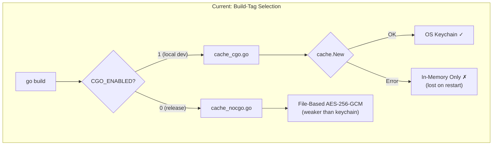
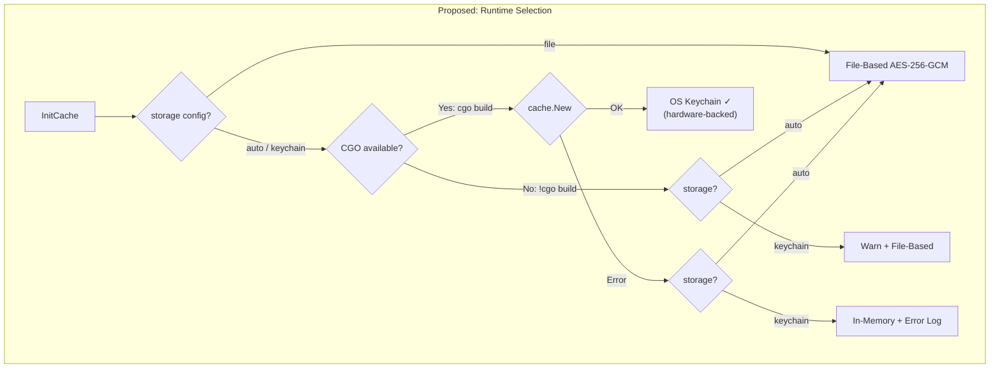
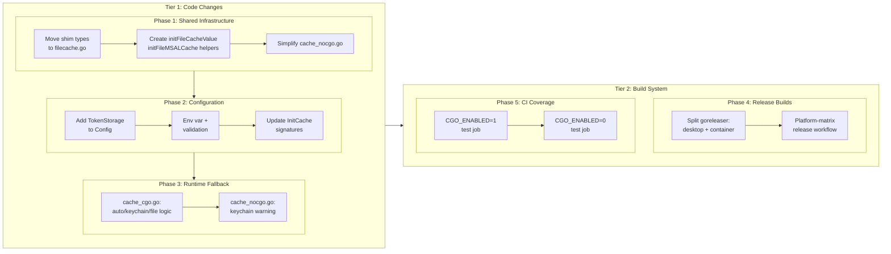

# CGO-Enabled Builds with Runtime Keychain Fallback

## Change Summary

All release builds currently use `CGO_ENABLED=0`, which excludes OS keychain integration at compile time and relies on a file-based AES-256-GCM encrypted cache (CR-0037 Phase 2). This CR enables CGO for all desktop platform release builds, adds runtime detection of keychain availability with automatic fallback to the file-based cache, and introduces a configurable `token_storage` option so users can explicitly select their preferred storage backend. Docker container builds remain `CGO_ENABLED=0`.

## Motivation and Background

The OS keychain (macOS Keychain, Linux libsecret, Windows DPAPI) provides significantly stronger token security than file-based encryption:

- **Hardware-backed**: macOS Keychain uses the Secure Enclave on Apple Silicon; keys never leave hardware-protected storage
- **Process isolation**: The OS enforces per-process access control — other processes cannot read keychain entries without explicit user permission
- **Login-protected**: Tokens are protected by the user's login credentials and biometrics

The current file-based cache (CR-0037 Phase 2) is a practical compromise but has known limitations:

- The encryption key is derived from `hostname + username + machine_id` using SHA-256 — deterministic and reproducible by any process running as the same user
- File permissions (0600) are the real protection; the encryption is defense-in-depth only
- No process isolation — any malware running as the same user can derive the key and decrypt tokens

Enabling CGO in release builds closes this security gap for desktop users while maintaining the file-based cache as a fallback for environments where the keychain is unavailable (headless servers, containers, sandboxes).

## Change Drivers

* **Security**: File-based AES-256-GCM cache provides weaker protection than OS keychain (no process isolation, deterministic key derivation)
* **Parity**: Local development builds already use CGO/keychain by default; release builds should match
* **Flexibility**: Some deployment environments (containers, CI runners, headless Linux) lack a keychain and need explicit file-based storage
* **Robustness**: Runtime fallback ensures the application never fails due to keychain unavailability

## Current State

### Token Cache Architecture

The cache implementation uses Go build tags to select between two mutually exclusive implementations:

**`cache_cgo.go` (`//go:build cgo`)**:
- Uses `azidentity/cache.New()` for OS keychain access
- Falls back to `azidentity.Cache{}` (in-memory only) when keychain is unavailable at runtime
- Used in local development builds (Go defaults to `CGO_ENABLED=1`)

**`cache_nocgo.go` (`//go:build !cgo`)**:
- Uses file-based AES-256-GCM encrypted cache at `~/.outlook-local-mcp/`
- Constructs `azidentity.Cache` via an `unsafe.Pointer` shim that mirrors the internal Azure SDK struct layout
- Used in all release builds (`CGO_ENABLED=0` in `.goreleaser.yaml`)

**`filecache.go` (no build tag)**:
- `encryptedFileAccessor` implementing Read/Write/Delete with AES-256-GCM encryption
- Machine-derived key from `hostname + username + machine_id`
- Available in both CGO and non-CGO builds

### Build System

- **GoReleaser** (`.goreleaser.yaml`): `CGO_ENABLED=0` hardcoded for all targets
- **Release workflow** (`.github/workflows/release.yml`): Single `ubuntu-latest` runner cross-compiles all platforms
- **Docker** (`Dockerfile`): `FROM scratch` base image — no C libraries, no keychain
- **Targets**: linux/amd64, linux/arm64, darwin/arm64, windows/amd64

### Configuration

The `Config` struct has `CacheName` (partition name, default `"outlook-local-mcp"`) but no option to select the storage backend. `InitCache(name string)` and `InitMSALCache(name string)` accept only the cache name; the storage backend is determined entirely by build tag at compile time.

### Current Flow

```
Compile-time build tag selection:
  CGO_ENABLED=1 → cache_cgo.go → OS keychain (or in-memory on failure)
  CGO_ENABLED=0 → cache_nocgo.go → file-based AES-256-GCM
```

### Problems

1. **Release builds lack keychain security**: All distributed binaries use file-based cache, even on platforms where the keychain is available and provides superior protection
2. **CGO builds lack file-based fallback**: When the OS keychain fails at runtime, `cache_cgo.go` falls back to in-memory (ephemeral, lost on restart) instead of file-based (persistent)
3. **No user control**: The storage backend is a compile-time decision; users cannot override it
4. **Single-runner limitation**: `CGO_ENABLED=0` exists because GoReleaser cross-compiles all platforms from one `ubuntu-latest` runner — CGO requires platform-native C toolchains

### Current State Diagram



## Proposed Change

### Change 1: Shared File-Based Cache Helpers

Move the `unsafe.Pointer` shim types (`cacheImplShim`, `cacheShim`) from `cache_nocgo.go` to `filecache.go` (no build tag). Add shared helper functions that both `cache_cgo.go` and `cache_nocgo.go` can use:

```go
// filecache.go (no build tag) — new helpers

// initFileCacheValue constructs an azidentity.Cache backed by encrypted files.
func initFileCacheValue(name string) (azidentity.Cache, error) { ... }

// initFileMSALCache constructs an msalcache.ExportReplace backed by encrypted files.
func initFileMSALCache(name string) (msalcache.ExportReplace, error) { ... }
```

`cache_nocgo.go` is simplified to delegate to these helpers. `cache_cgo.go` gains access to them for its fallback path.

**Files**:
- `internal/auth/filecache.go` — add shim types and shared helper functions
- `internal/auth/cache_nocgo.go` — simplify to delegate to shared helpers

### Change 2: Token Storage Configuration

Add a `TokenStorage` configuration field:

| Value | Behavior |
|-------|----------|
| `auto` (default) | Try OS keychain first; fall back to file-based on failure. In non-CGO builds, file-based is used directly. |
| `keychain` | OS keychain only. Returns in-memory cache with an error log if keychain is unavailable. In non-CGO builds, falls back to file-based with a warning. |
| `file` | File-based AES-256-GCM only. Skips keychain even when available. |

**Environment variable**: `OUTLOOK_MCP_TOKEN_STORAGE`

**Signature changes**:
```go
// Before:
func InitCache(name string) azidentity.Cache
func InitMSALCache(name string) msalcache.ExportReplace

// After:
func InitCache(name, storage string) azidentity.Cache
func InitMSALCache(name, storage string) msalcache.ExportReplace
```

**Files**:
- `internal/config/config.go` — add `TokenStorage` field, env var loading, validation
- `internal/auth/auth.go` — pass `cfg.TokenStorage` to `InitCache` and `InitMSALCache`

### Change 3: CGO Cache Runtime Fallback

Modify `cache_cgo.go` to implement the `auto` fallback chain:

```go
// cache_cgo.go — InitCache after changes
func InitCache(name, storage string) azidentity.Cache {
    if storage == "file" {
        slog.Info("token storage explicitly set to file-based", "name", name)
        return initFileCacheOrWarn(name)
    }

    c, err := cache.New(&cache.Options{Name: name})
    if err != nil {
        if storage == "keychain" {
            slog.Error("OS keychain unavailable and token_storage=keychain",
                "error", err)
            return azidentity.Cache{}
        }
        // storage == "auto": fall back to file-based
        slog.Warn("OS keychain unavailable, falling back to file-based cache",
            "error", err)
        return initFileCacheOrWarn(name)
    }

    slog.Info("persistent token cache initialized (OS keychain)", "name", name)
    return c
}
```

Modify `cache_nocgo.go` to handle the `storage` parameter:

```go
// cache_nocgo.go — InitCache after changes
func InitCache(name, storage string) azidentity.Cache {
    if storage == "keychain" {
        slog.Warn("token_storage=keychain requested but CGo is disabled; "+
            "falling back to file-based cache", "name", name)
    }
    c, err := initFileCacheValue(name)
    if err != nil {
        slog.Warn("file-based token cache unavailable, falling back to in-memory cache",
            "error", err)
        return azidentity.Cache{}
    }
    return c
}
```

Same pattern applied to `InitMSALCache`.

**Files**:
- `internal/auth/cache_cgo.go` — add `storage` parameter, implement runtime fallback
- `internal/auth/cache_nocgo.go` — add `storage` parameter, warn on `keychain` request

### Change 4: CGO-Enabled Release Builds

Replace the single-runner cross-compilation with a platform-matrix build. Each desktop platform builds on its native runner with `CGO_ENABLED=1`. Docker container builds remain `CGO_ENABLED=0` on `ubuntu-latest`.

**Platform matrix**:

| Runner | GOOS | GOARCH | C Compiler | Keychain Dependency |
|--------|------|--------|------------|---------------------|
| `macos-latest` | darwin | arm64 | default (clang) | Security.framework (built-in) |
| `ubuntu-latest` | linux | amd64 | gcc | libsecret-1-dev |
| `ubuntu-latest` | linux | arm64 | aarch64-linux-gnu-gcc | libsecret-1-dev:arm64 |
| `windows-latest` | windows | amd64 | default (MSVC/mingw) | DPAPI (built-in) |

**GoReleaser split**: Two build IDs in `.goreleaser.yaml`:

```yaml
builds:
  - id: desktop
    env: [CGO_ENABLED=1]
    # Per-platform via matrix runners
    ...

  - id: container
    env: [CGO_ENABLED=0]
    goos: [linux]
    goarch: [amd64, arm64]
    # Cross-compiled on ubuntu-latest for Docker
    ...

dockers_v2:
  - ids: [container]
    # Docker images use static CGO_ENABLED=0 binaries
    ...
```

**Release workflow**: Changes from a single job to a matrix of platform-native jobs, with a final aggregation job that creates the GitHub release:

```yaml
jobs:
  build-desktop:
    strategy:
      matrix:
        include:
          - {os: macos-latest, goos: darwin, goarch: arm64}
          - {os: ubuntu-latest, goos: linux, goarch: amd64, deps: "libsecret-1-dev"}
          - {os: ubuntu-latest, goos: linux, goarch: arm64, cc: "aarch64-linux-gnu-gcc", deps: "gcc-aarch64-linux-gnu libsecret-1-dev:arm64"}
          - {os: windows-latest, goos: windows, goarch: amd64}
    runs-on: ${{ matrix.os }}
    steps:
      - # Install C dependencies if needed
      - # Build with CGO_ENABLED=1

  build-container:
    runs-on: ubuntu-latest
    steps:
      - # Build with CGO_ENABLED=0 for Docker images

  release:
    needs: [build-desktop, build-container]
    steps:
      - # Aggregate artifacts, checksums, SBOMs
      - # Create GitHub release
      - # Pack and upload MCPB bundle
```

**Files**:
- `.goreleaser.yaml` — split into `desktop` and `container` build IDs
- `.github/workflows/release.yml` — platform-matrix build with aggregation

### Change 5: CI Test Coverage for Both Build Modes

Add CI test jobs that verify both CGO and non-CGO cache paths:

```yaml
# ci.yml additions
jobs:
  test-cgo:
    runs-on: ubuntu-latest
    steps:
      - # apt install libsecret-1-dev
      - # CGO_ENABLED=1 go test ./internal/auth/...

  test-nocgo:
    runs-on: ubuntu-latest
    steps:
      - # CGO_ENABLED=0 go test ./internal/auth/...
```

**File**: `.github/workflows/ci.yml`

### Proposed State Diagram



## Requirements

### Functional Requirements

1. `InitCache` and `InitMSALCache` **MUST** accept a `storage` parameter controlling the backend selection.
2. When `storage` is `auto` and CGO is enabled, `InitCache` **MUST** attempt OS keychain first and fall back to file-based AES-256-GCM on any keychain error.
3. When `storage` is `file`, `InitCache` **MUST** use file-based storage without attempting the keychain, regardless of CGO availability.
4. When `storage` is `keychain` in a CGO-enabled build and the OS keychain is unavailable at runtime, `InitCache` **MUST** log an error and return a zero-value (in-memory) cache — it **MUST NOT** fall back to file-based.
5. In non-CGO builds, the `keychain` storage value **MUST** be treated as a degraded request: a warning **MUST** be logged and file-based storage **MUST** be used.
6. The `Config` struct **MUST** include a `TokenStorage` field populated from the `OUTLOOK_MCP_TOKEN_STORAGE` environment variable with default value `auto`.
7. Valid values for `TokenStorage` **MUST** be `auto`, `keychain`, and `file`. Invalid values **MUST** cause a configuration validation error.
8. The `unsafe.Pointer` shim types (`cacheImplShim`, `cacheShim`) **MUST** reside in a file without build tag restrictions, accessible to both CGO and non-CGO builds.
9. Shared helpers `initFileCacheValue` and `initFileMSALCache` **MUST** be defined in a file without build tags.
10. Release builds for desktop platforms (darwin/arm64, linux/amd64, linux/arm64, windows/amd64) **MUST** use `CGO_ENABLED=1`.
11. Docker container builds **MUST** continue using `CGO_ENABLED=0`.
12. The release workflow **MUST** build desktop binaries on platform-native runners.
13. Linux release builds **MUST** install `libsecret-1-dev` as a build dependency.
14. CI **MUST** run tests under both `CGO_ENABLED=1` and `CGO_ENABLED=0`.

### Non-Functional Requirements

1. The runtime fallback from keychain to file-based **MUST** complete within 1 second (no long timeouts on keychain initialization).
2. All existing tests **MUST** pass under both `CGO_ENABLED=1` and `CGO_ENABLED=0`.
3. The file-based fallback in CGO builds **MUST** produce cache files compatible with the existing `cache_nocgo.go` format (same encryption, same paths).
4. Release build time **MUST NOT** exceed 3x the current build time (matrix parallelism should offset per-platform overhead).
5. The `status` diagnostic tool (CR-0037 Change 7) **MUST** report the active token storage backend (`keychain`, `file`, or `memory`).

## Affected Components

* `internal/auth/filecache.go` — add shim types and shared helper functions
* `internal/auth/cache_cgo.go` — add `storage` parameter, implement runtime fallback to file-based
* `internal/auth/cache_nocgo.go` — add `storage` parameter, delegate to shared helpers, warn on `keychain`
* `internal/auth/auth.go` — pass `cfg.TokenStorage` to `InitCache` and `InitMSALCache`
* `internal/config/config.go` — add `TokenStorage` field, env var, validation
* `.goreleaser.yaml` — split into `desktop` (CGO) and `container` (no-CGO) build IDs
* `.github/workflows/release.yml` — platform-matrix build with aggregation job
* `.github/workflows/ci.yml` — add CGO and non-CGO test jobs

## Scope Boundaries

### In Scope

* Shared file-based cache infrastructure (move shim types, create helpers)
* `TokenStorage` configuration option (`auto` | `keychain` | `file`)
* Runtime keychain-to-file fallback in CGO builds
* CGO-enabled release builds with platform-native runners
* Docker build separation (keep `CGO_ENABLED=0`)
* CI test coverage for both build modes

### Out of Scope ("Here, But Not Further")

* Changing the file-based encryption algorithm or key derivation — current AES-256-GCM with machine-derived key is unchanged
* Adding new platform targets — darwin/amd64 remains excluded, windows/arm64 remains excluded
* OS keychain access without CGO — not possible with current Azure SDK dependencies
* Token migration between storage backends — re-authentication is acceptable when switching
* Hardware security module (HSM) or external secret manager integration
* Dockerfile base image change — `scratch` is kept for container builds

## Impact Assessment

### User Impact

**Desktop users (MCPB, manual install)**: Tokens stored in OS keychain by default with hardware-backed security on macOS. Automatic fallback to file-based if keychain is unavailable. Users can explicitly choose file-based storage via `OUTLOOK_MCP_TOKEN_STORAGE=file`.

**Container/server users**: No change. Docker images continue to use `CGO_ENABLED=0` static binaries with file-based cache.

**Local development**: No behavior change (already CGO-enabled). The runtime fallback improves resilience when developing on machines with keychain issues.

### Technical Impact

* **New config option**: `OUTLOOK_MCP_TOKEN_STORAGE` environment variable (default: `auto`)
* **Signature change**: `InitCache` and `InitMSALCache` gain a `storage` parameter — all call sites updated
* **Build infrastructure**: Release workflow changes from single-runner to multi-runner matrix
* **Binary characteristics**: CGO-enabled desktop binaries dynamically link against C libraries; container binaries remain fully static
* **Docker image**: Unchanged (`scratch` base, `CGO_ENABLED=0` binary)

### Security Impact

* **Positive**: Desktop users gain OS-level keychain protection (process isolation, hardware-backed keys on macOS)
* **Neutral**: File-based fallback provides identical security to current release builds
* **Consideration**: CGO-enabled binaries include C code execution paths (the keychain libraries). Mitigated by using well-maintained, widely-used libraries from Microsoft's Azure SDK.

## Implementation Approach

Five phases in two tiers. Tier 1 is independently shippable and improves the CGO fallback behavior for local development builds immediately, without requiring build system changes.

- **Tier 1 (Code)**: Phases 1–3 — shared infrastructure, configuration, runtime fallback
- **Tier 2 (Build)**: Phases 4–5 — CGO-enabled releases and CI coverage

### Implementation Flow



## Test Strategy

### Tests to Add

| Test File | Test Name | Description | Inputs | Expected Output |
|-----------|-----------|-------------|--------|-----------------|
| `internal/auth/filecache_test.go` | `TestInitFileCacheValue_ReturnsUsableCache` | Shared helper constructs a functional `azidentity.Cache` | Cache name | Non-zero `azidentity.Cache` returned |
| `internal/auth/filecache_test.go` | `TestInitFileMSALCache_ReturnsUsableAccessor` | Shared helper constructs a functional MSAL cache accessor | Cache name | Non-nil `msalcache.ExportReplace` returned |
| `internal/auth/cache_cgo_test.go` | `TestInitCache_Auto_KeychainFailure_FallsBackToFile` | Keychain error triggers file-based fallback | `storage="auto"`, keychain unavailable | File-based cache returned, warning logged |
| `internal/auth/cache_cgo_test.go` | `TestInitCache_File_SkipsKeychain` | `storage=file` uses file-based directly | `storage="file"` | File-based cache returned, keychain not attempted |
| `internal/auth/cache_cgo_test.go` | `TestInitCache_Keychain_NoFallbackOnError` | `storage=keychain` does not fall back to file | `storage="keychain"`, keychain unavailable | Zero-value cache returned, error logged |
| `internal/auth/cache_cgo_test.go` | `TestInitMSALCache_Auto_KeychainFailure_FallsBackToFile` | Same as above for MSAL cache path | `storage="auto"`, keychain unavailable | File-based MSAL accessor returned |
| `internal/auth/cache_nocgo_test.go` | `TestInitCache_KeychainRequested_WarnsAndUsesFile` | Non-CGO build warns when `keychain` requested | `storage="keychain"` | File-based cache returned, warning logged |
| `internal/auth/cache_nocgo_test.go` | `TestInitCache_Auto_UsesFile` | Non-CGO build uses file-based for `auto` | `storage="auto"` | File-based cache returned |
| `internal/config/config_test.go` | `TestTokenStorage_DefaultAuto` | Default value is `auto` | No env var | `cfg.TokenStorage == "auto"` |
| `internal/config/config_test.go` | `TestTokenStorage_EnvVar` | `OUTLOOK_MCP_TOKEN_STORAGE` is respected | Env var set to `file` | `cfg.TokenStorage == "file"` |
| `internal/config/config_test.go` | `TestTokenStorage_InvalidValue_ValidationError` | Invalid value causes validation error | Env var set to `invalid` | Validation error returned |
| `internal/auth/filecache_test.go` | `TestFileCacheCompatibility_ExistingCacheReadable` | Cache files written by current `cache_nocgo.go` remain readable after upgrade (AC-12) | Pre-existing encrypted cache file | Tokens decrypted successfully without re-auth |
| (workflow) | `build-desktop` matrix | Desktop binaries built with CGO_ENABLED=1 on native runners (AC-7) | Release tag push | All 4 platform binaries produced with CGO |
| (workflow) | `build-container` job | Docker images built with CGO_ENABLED=0, scratch base (AC-8) | Release tag push | Static binary in scratch image |
| (workflow) | `test-cgo` + `test-nocgo` CI jobs | CI runs tests under both CGO modes (AC-10) | PR push | Both test jobs pass |
| (existing suite) | All existing auth/account tests | No regression for elicitation-supporting clients (AC-13) | Any token_storage value | All existing tests pass unchanged |
| `internal/config/config_test.go` | `TestTokenStorage_DefaultAuto` | Backward compatibility: no env var defaults to auto, existing cache files accessible (AC-11, via AC-6 + AC-12) | No env var set | `cfg.TokenStorage == "auto"` |

### Tests to Modify

| Test File | Test Name | Current Behavior | New Behavior | Reason |
|-----------|-----------|------------------|--------------|--------|
| `internal/auth/cache_nocgo_test.go` | `TestFileCacheShimLayout` | Tests shim in `cache_nocgo.go` | Move to `filecache_test.go` | Shim types move to `filecache.go` |
| `internal/auth/auth_test.go` | Tests calling `InitCache` / `InitMSALCache` | Call with `(name)` | Call with `(name, storage)` | Signature change |

### Tests to Remove

Not applicable. No existing tests become redundant.

## Acceptance Criteria

### AC-1: Runtime fallback from keychain to file-based

```gherkin
Given a CGO-enabled build with token_storage=auto
  And the OS keychain is unavailable at runtime
When InitCache is called
Then it MUST fall back to the file-based AES-256-GCM cache
  And it MUST log a warning about keychain unavailability
  And the returned cache MUST persist tokens to disk
```

### AC-2: Explicit file-based storage

```gherkin
Given a CGO-enabled build with token_storage=file
When InitCache is called
Then it MUST use file-based storage without attempting the OS keychain
  And it MUST log that file-based storage was selected
```

### AC-3: Explicit keychain-only storage

```gherkin
Given a CGO-enabled build with token_storage=keychain
  And the OS keychain is unavailable at runtime
When InitCache is called
Then it MUST log an error about keychain unavailability
  And it MUST NOT fall back to file-based storage
  And it MUST return a zero-value (in-memory) cache
```

### AC-4: Non-CGO build with keychain requested

```gherkin
Given a non-CGO build with token_storage=keychain
When InitCache is called
Then it MUST log a warning that keychain requires CGO
  And it MUST use file-based storage as fallback
```

### AC-5: Configuration validation

```gherkin
Given OUTLOOK_MCP_TOKEN_STORAGE is set to an invalid value (not auto, keychain, or file)
When the configuration is loaded and validated
Then a validation error MUST be returned listing the valid options
```

### AC-6: Default configuration

```gherkin
Given OUTLOOK_MCP_TOKEN_STORAGE is not set
When the configuration is loaded
Then TokenStorage MUST default to "auto"
```

### AC-7: CGO-enabled release binaries

```gherkin
Given the release workflow runs for a new version tag
When desktop binaries are built (darwin/arm64, linux/amd64, linux/arm64, windows/amd64)
Then each binary MUST be compiled with CGO_ENABLED=1
  And each binary MUST be built on a platform-native runner
  And Linux builds MUST install libsecret-1-dev as a build dependency
```

### AC-8: Docker images remain static

```gherkin
Given the release workflow runs for a new version tag
When Docker images are built
Then the binaries inside Docker images MUST be compiled with CGO_ENABLED=0
  And the Docker base image MUST remain scratch
```

### AC-9: Shared shim accessible to both builds

```gherkin
Given the cacheImplShim and cacheShim types in filecache.go
When compiling with CGO_ENABLED=1 or CGO_ENABLED=0
Then both types MUST compile without errors
  And initFileCacheValue MUST be callable from both cache_cgo.go and cache_nocgo.go
```

### AC-10: CI tests both build modes

```gherkin
Given the CI workflow runs on a pull request
When tests execute
Then tests MUST run with CGO_ENABLED=1 verifying keychain and fallback paths
  And tests MUST run with CGO_ENABLED=0 verifying file-based paths
```

### AC-11: Backward compatibility

```gherkin
Given an existing deployment with no OUTLOOK_MCP_TOKEN_STORAGE set
When the server starts with the new version
Then it MUST behave as if token_storage=auto
  And existing file-based cached tokens MUST remain accessible
  And no user action MUST be required
```

### AC-12: Cache file format compatibility

```gherkin
Given tokens cached by the current cache_nocgo.go implementation
When the server is upgraded to the new version with CGO-enabled build and token_storage=file
Then the existing cache files MUST be readable and decryptable
  And no re-authentication MUST be required
```

### AC-13: No regression for elicitation-supporting clients

```gherkin
Given an MCP client that supports elicitation
When using a CGO-enabled build with any token_storage value
Then all existing authentication and account resolution behavior MUST be unchanged
```

## Quality Standards Compliance

### Build & Compilation

- [x] Code compiles/builds without errors with `CGO_ENABLED=1`
- [x] Code compiles/builds without errors with `CGO_ENABLED=0`
- [x] No new compiler warnings introduced

### Linting & Code Style

- [x] All linter checks pass with zero warnings/errors
- [x] Code follows project coding conventions and style guides
- [x] Any linter exceptions are documented with justification

### Test Execution

- [x] All existing tests pass with `CGO_ENABLED=1`
- [x] All existing tests pass with `CGO_ENABLED=0`
- [x] All new tests pass
- [x] Test coverage meets project requirements for changed code

### Documentation

- [x] Configuration documentation updated for `token_storage` option
- [x] Inline code documentation updated for changed functions

### Code Review

- [ ] Changes submitted via pull request
- [ ] PR title follows Conventional Commits format
- [ ] Code review completed and approved
- [ ] Changes squash-merged to maintain linear history

### Verification Commands

```bash
# Build verification (both modes)
CGO_ENABLED=1 go build ./cmd/outlook-local-mcp/
CGO_ENABLED=0 go build ./cmd/outlook-local-mcp/

# Test verification (both modes)
CGO_ENABLED=1 go test ./...
CGO_ENABLED=0 go test ./...

# Lint verification
golangci-lint run

# Full CI check
make ci
```

## Risks and Mitigation

### Risk 1: Platform-specific CI runner costs

**Likelihood**: certain
**Impact**: low
**Mitigation**: macOS and Windows runners on GitHub Actions cost more per minute than Linux runners. Release builds are infrequent (tagged releases only). The incremental cost is marginal for a project of this scale.

### Risk 2: Linux libsecret runtime availability

**Likelihood**: medium
**Impact**: low
**Mitigation**: The `auto` runtime fallback (Change 3) ensures CGO-enabled Linux binaries work even without libsecret or D-Bus. Users on headless Linux systems get file-based storage automatically and transparently.

### Risk 3: unsafe.Pointer shim breakage on Azure SDK update

**Likelihood**: low
**Impact**: high
**Mitigation**: The existing `TestFileCacheShimLayout` test verifies the shim matches the internal Azure SDK struct layout. This test fails on SDK updates that change the internal layout, providing early detection. The shim mirrors a stable internal API. Pin the Azure SDK version in `go.mod` and test before upgrading.

### Risk 4: Dynamic linking in Linux release binaries

**Likelihood**: certain
**Impact**: low
**Mitigation**: CGO-enabled Linux binaries dynamically link against libc and libsecret, reducing portability across distributions. Mitigated by: (1) building on Ubuntu LTS for broad glibc compatibility, (2) the `auto` fallback gracefully degrades to file-based if libsecret is missing at runtime, (3) Docker images remain fully static.

### Risk 5: GoReleaser matrix complexity

**Likelihood**: medium
**Impact**: medium
**Mitigation**: Splitting from single-runner to multi-runner introduces complexity in artifact aggregation, checksum generation, and release creation. Mitigate by using GoReleaser's `prebuilt` builder support or GitHub Actions artifact upload/download for cross-job coordination. Test the matrix workflow with `--snapshot` before first release.

### Risk 6: Windows CGO toolchain

**Likelihood**: low
**Impact**: medium
**Mitigation**: Windows CGO builds require either MSVC or MinGW. `windows-latest` runners include MSVC. If DPAPI access requires specific Windows SDK components, install them in the workflow. The Go toolchain on Windows supports both gcc (MinGW) and MSVC as C compilers.

## Dependencies

* CR-0037 Phase 2 (file-based token cache) — **completed** (`a13bff2` on `dev/cc-swarm`). This CR builds on the `filecache.go` and `cache_nocgo.go` infrastructure from CR-0037.
* No external dependencies beyond existing Azure SDK packages.

## Estimated Effort

**Tier 1 (Code):**
- Phase 1 (Shared Infrastructure): 2–3 person-hours
- Phase 2 (Configuration): 1–2 person-hours
- Phase 3 (Runtime Fallback): 2–3 person-hours

**Tier 2 (Build):**
- Phase 4 (Release Builds): 4–6 person-hours
- Phase 5 (CI Coverage): 1–2 person-hours

**Total**: 10–16 person-hours

## Decision Outcome

Chosen approach: "CGO-enabled builds with runtime fallback and configurable storage", because it provides the strongest security posture for desktop users (OS keychain with hardware-backed protection) while maintaining full backward compatibility (file-based fallback for containers and headless environments). The `token_storage` configuration option gives users explicit control for environments where the default behavior is not desired. The two-tier implementation allows shipping the code-level runtime fallback immediately (Tier 1 — improves local dev builds today) while the build system changes for CGO-enabled releases (Tier 2) follow independently.

## Related Items

* CR-0037: Claude Desktop UX Improvements — Phase 2 established the file-based encrypted token cache that this CR promotes to a runtime fallback
* `internal/auth/cache_cgo.go`: OS keychain cache, primary target for runtime fallback
* `internal/auth/cache_nocgo.go`: File-based cache, refactored to use shared helpers
* `internal/auth/filecache.go`: Encryption utilities, gains shim types and shared helpers
* `internal/config/config.go`: Configuration loading, gains `TokenStorage` field
* `.goreleaser.yaml`: Release build configuration, split into desktop and container builds
* `.github/workflows/release.yml`: Release pipeline, gains platform-matrix build

<!--
## CR Review Summary (2026-03-19)

**Findings: 5 | Fixes applied: 5 | Unresolvable: 0**

### Findings and Fixes

1. **Contradiction: FR-4 scope ambiguity (fixed)**
   FR-4 stated "when storage is keychain and the OS keychain is unavailable" without
   specifying CGO vs non-CGO context. In non-CGO builds the keychain is inherently
   unavailable, making FR-4 conflict with FR-5 (which says non-CGO+keychain MUST warn
   and use file-based). Resolved by scoping FR-4 explicitly to CGO-enabled builds,
   matching the Implementation Approach (Change 3 code samples).

2. **Ambiguity: NFR-5 used "SHOULD" and conditional "if ... is implemented" (fixed)**
   Changed "If the status diagnostic tool ... is implemented, it SHOULD report" to
   "The status diagnostic tool ... MUST report". The status tool exists (CR-0037 Change 7)
   and the CR requires deterministic language.

3. **Coverage gap: FR-13 had no AC (fixed)**
   FR-13 requires Linux builds install libsecret-1-dev. AC-7 only mentioned CGO_ENABLED=1
   and platform-native runners. Added libsecret-1-dev build dependency assertion to AC-7.

4. **AC-test gaps: AC-7, AC-8, AC-10, AC-12, AC-13 had no Test Strategy entries (fixed)**
   Added workflow-level verification entries for AC-7 (build-desktop matrix), AC-8
   (build-container job), and AC-10 (test-cgo + test-nocgo CI jobs). Added
   TestFileCacheCompatibility_ExistingCacheReadable for AC-12. Added existing-suite
   reference for AC-13. Added backward-compatibility cross-reference for AC-11.

5. **AC-11 lacked explicit test mapping (fixed)**
   AC-11 (backward compatibility) is covered by the combination of AC-6 (default auto)
   and AC-12 (file format compatibility). Added cross-reference entry in Test Strategy.
-->
