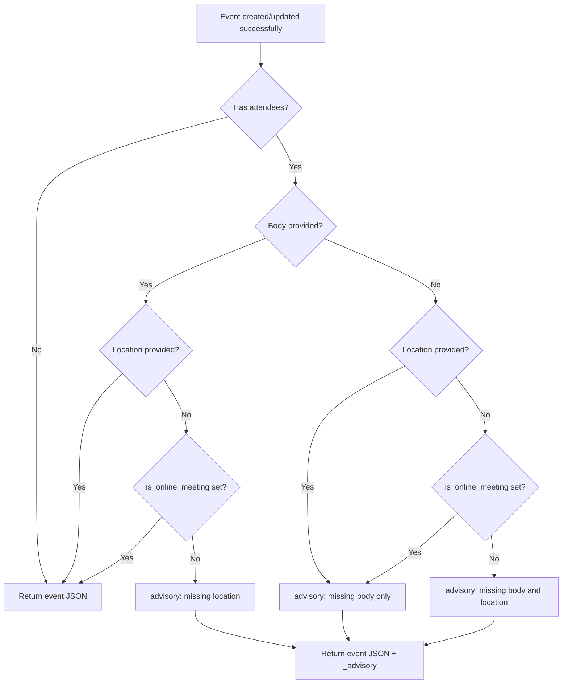
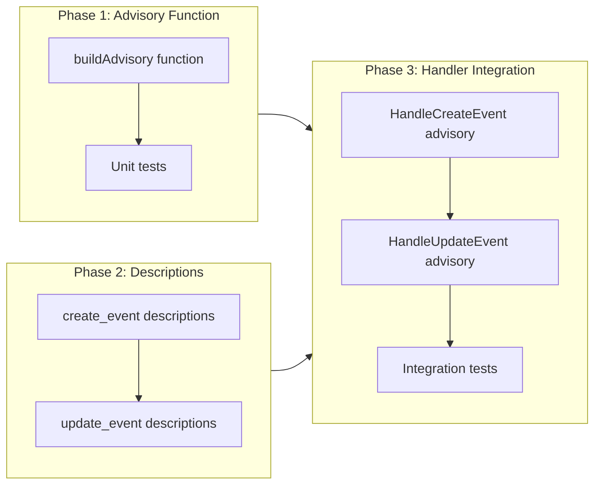

# Event Quality Guardrails for Attendee Events

## Change Summary

When an LLM-based MCP client creates or updates a calendar event that includes attendees, it frequently omits the event body (agenda/description) and location. The attendees receive a bare invitation with only a subject and time -- no context on what the meeting is about or where it takes place. This CR enhances `create_event` and `update_event` tool descriptions with LLM-oriented guidance that instructs the model to collect or suggest a body and location before submitting events with attendees. It also adds a server-side warning in the tool response when attendees are present but body or location is missing, giving the LLM a second chance to suggest an update.

## Motivation and Background

In real-world usage, an LLM assistant asked to "schedule a meeting with Alice tomorrow at 2pm" will call `create_event` with just a subject, time, and attendee list. Alice receives an Outlook invitation that says "Meeting" at 2:00 PM with no description, no agenda, and no location. This is the calendar equivalent of sending a blank email -- technically functional but poor etiquette that reflects badly on the organizer.

The root cause is that the LLM has no guidance telling it that body and location are *expected* for meetings with attendees. The current tool descriptions treat `body` and `location` as generic optional fields with no contextual importance. Since MCP tool descriptions are the primary mechanism for steering LLM behavior, enriching them with meeting-quality guidance is the most effective and least invasive fix.

A secondary issue is that even if the LLM skips body/location, the server silently creates the event without any feedback. Adding a post-creation advisory in the response gives the LLM an opportunity to follow up with the user: "The meeting was created, but it has no description or location -- would you like me to add those?"

## Change Drivers

* **Poor attendee experience**: Invitations without body or location are unhelpful and unprofessional.
* **LLM default behavior**: Without explicit guidance, LLMs minimize parameters and skip optional fields.
* **No feedback loop**: The server returns success with no indication that the event is incomplete.
* **Tool descriptions as LLM instructions**: MCP tool descriptions are the primary steering mechanism -- they should encode meeting quality expectations.

## Current State

### Tool Descriptions

The `create_event` tool description is:

> "Create a new calendar event. Supports attendees (sends invitations automatically), Teams online meetings, recurrence, and all standard event properties."

The `body` parameter description is:

> "Event body content (HTML or plain text)"

The `location` parameter description is:

> "Location display name"

None of these descriptions mention that body and location are important when attendees are present. The LLM has no signal that a meeting invitation without context is a poor outcome.

### Tool Response

The `HandleCreateEvent` and `HandleUpdateEvent` handlers return the created/updated event JSON on success. There is no advisory or warning mechanism for missing fields.

## Proposed Change

### 1. Enhanced Tool Descriptions

Update the main `create_event` tool description to include LLM-oriented guidance about meeting quality:

```
Create a new calendar event. Supports attendees (sends invitations
automatically), Teams online meetings, recurrence, and all standard
event properties.

IMPORTANT: When attendees are included, always provide a body
(agenda or description) and location so recipients understand the
purpose and place of the meeting. Ask the user for these details
or suggest appropriate values before creating the event.
```

Update the `body` parameter description:

```
Event body content (HTML or plain text). Strongly recommended when
attendees are invited -- include the meeting agenda, purpose, or
discussion topics. Attendees receive this in their invitation.
```

Update the `location` parameter description:

```
Location display name (e.g. room name, office, or "Microsoft Teams").
Strongly recommended when attendees are invited. If an online meeting
is enabled, you may use "Microsoft Teams" or omit this.
```

Apply equivalent changes to the `update_event` tool descriptions.

### 2. Response Advisory for Missing Fields

After a successful `create_event` or `update_event` call, if the event has attendees but is missing body or location (and `is_online_meeting` is not set for location), append an advisory note to the response JSON. The advisory is a new `_advisory` field in the serialized response:

```json
{
  "id": "AAMk...",
  "subject": "Team Sync",
  "start": "2026-04-15T09:00:00",
  "_advisory": "This event has attendees but no description. Consider updating the event with a body describing the meeting purpose."
}
```

The `_advisory` field is:
- Only present when attendees are non-empty AND (body is empty OR location is empty without online meeting).
- A plain-text string designed for LLM consumption.
- Prefixed with `_` to signal it is metadata, not a Graph API field.
- Never present on events without attendees.

### Proposed Response Flow



## Requirements

### Functional Requirements

1. The `create_event` tool description **MUST** instruct the LLM to provide body and location when attendees are included, and to ask the user for these details or suggest appropriate values.
2. The `update_event` tool description **MUST** instruct the LLM to provide body and location when attendees are included in the update, and to ask the user for these details or suggest appropriate values.
3. The `body` parameter description on both tools **MUST** indicate that it is strongly recommended when attendees are invited and that attendees receive it in their invitation.
4. The `location` parameter description on both tools **MUST** indicate that it is strongly recommended when attendees are invited, and that "Microsoft Teams" is acceptable when an online meeting is enabled.
5. The `HandleCreateEvent` handler **MUST** append an `_advisory` string to the response when the created event has attendees but is missing body content.
6. The `HandleCreateEvent` handler **MUST** append an `_advisory` string to the response when the created event has attendees but is missing location and `is_online_meeting` is not set.
7. The `HandleUpdateEvent` handler **MUST** append an `_advisory` string to the response when the `attendees` parameter was provided in the request and is non-empty, but body or location is missing (using the same logic as create). The advisory **MUST NOT** trigger when the `attendees` parameter is absent from the request.
8. The `_advisory` field **MUST NOT** be present when the event has no attendees.
9. The `_advisory` message **MUST** be a plain-text string that names the missing field(s) and instructs the LLM to offer the user the option to add them.

### Non-Functional Requirements

1. The advisory logic **MUST** be implemented as a standalone function (e.g., `buildAdvisory`) to keep handler complexity minimal.
2. The advisory logic **MUST NOT** make any additional Graph API calls -- it operates only on the request parameters already available in the handler.
3. All new and modified code **MUST** include Go doc comments per project documentation standards.
4. All existing tests **MUST** continue to pass after the changes.

## Affected Components

| Component | Change |
|-----------|--------|
| `internal/tools/create_event.go` | Updated tool description, body/location parameter descriptions, advisory logic after successful creation |
| `internal/tools/update_event.go` | Updated tool description, body/location parameter descriptions, advisory logic after successful update |
| `internal/tools/advisory.go` (new) | `buildAdvisory` function that evaluates request params and returns an advisory string or empty |
| `internal/tools/advisory_test.go` (new) | Unit tests for `buildAdvisory` |
| `internal/tools/create_event_test.go` | Additional test cases verifying advisory presence/absence |
| `internal/tools/update_event_test.go` | Additional test cases verifying advisory presence/absence |

## Scope Boundaries

### In Scope

* Enhanced tool descriptions for `create_event` and `update_event` (main description, `body`, and `location` parameters)
* Advisory logic using the existing `is_online_meeting` parameter on both `create_event` and `update_event`
* `buildAdvisory` function that checks attendees, body, location, and is_online_meeting
* Injecting `_advisory` into the response JSON for create and update handlers
* Unit tests for all new logic

### Out of Scope ("Here, But Not Further")

* Blocking event creation when body/location is missing -- the server **MUST NOT** reject valid requests; the advisory is informational only
* MCP elicitation to interactively prompt for body/location -- this would require client-side elicitation support (not universally available)
* Modifying `get_event`, `list_events`, or other read tools -- they are not involved in event creation quality
* Enforcing body/location on events without attendees -- personal events without descriptions are normal
* Changing the `cancel_event` or `delete_event` tools

## Impact Assessment

### User Impact

Users will notice that the LLM assistant proactively asks for meeting descriptions and locations before creating events with attendees, resulting in higher-quality calendar invitations. If the LLM skips the prompt (e.g., in autonomous mode), the post-creation advisory gives it a natural follow-up: "I created the meeting, but it doesn't have a description yet -- would you like me to add one?"

### Technical Impact

Minimal. The changes are limited to string constants (tool descriptions) and a small advisory function. No new dependencies, no API changes, no middleware modifications. The `_advisory` field is additive and does not affect existing response parsing.

### Business Impact

Reduces the "clumsy assistant" perception where the AI creates bare-bones meeting invitations. Improves the professional quality of events created through the MCP server, which directly affects how users perceive the tool's value.

## Implementation Approach

### Phase 1: Advisory Function

Create `internal/tools/advisory.go` with a `buildAdvisory` function:

```go
func buildAdvisory(hasAttendees, hasBody, hasLocation, isOnlineMeeting bool) string
```

Returns an advisory string describing what is missing, or empty string if nothing is missing or there are no attendees.

Unit tests in `internal/tools/advisory_test.go` covering all combinations.

### Phase 2: Tool Description Updates

Update `NewCreateEventTool()` and `NewUpdateEventTool()`:
- Main tool description: add attendee quality guidance paragraph.
- `body` parameter description: add "strongly recommended when attendees are invited" text.
- `location` parameter description: add "strongly recommended when attendees are invited" text.

### Phase 3: Handler Integration

Modify `HandleCreateEvent` to:
1. After successful creation, evaluate advisory conditions from the request args.
2. If advisory is non-empty, inject `_advisory` into the serialized response map before marshaling.

Modify `HandleUpdateEvent` with the same logic, but only when the `attendees` parameter was provided in the request (since we cannot know the existing attendee state without an extra API call, which is out of scope).

Update existing tests to verify advisory presence/absence.

### Implementation Flow



## Test Strategy

### Tests to Add

| Test File | Test Name | Description | Inputs | Expected Output |
|-----------|-----------|-------------|--------|-----------------|
| `advisory_test.go` | `TestBuildAdvisory_NoAttendees` | No advisory when no attendees | `hasAttendees=false` | Empty string |
| `advisory_test.go` | `TestBuildAdvisory_AttendeesWithBodyAndLocation` | No advisory when all fields present | `hasAttendees=true, hasBody=true, hasLocation=true` | Empty string |
| `advisory_test.go` | `TestBuildAdvisory_AttendeesNoBody` | Advisory mentions missing body | `hasAttendees=true, hasBody=false, hasLocation=true` | Non-empty, contains "description" or "body" |
| `advisory_test.go` | `TestBuildAdvisory_AttendeesNoLocation` | Advisory mentions missing location | `hasAttendees=true, hasBody=true, hasLocation=false, isOnlineMeeting=false` | Non-empty, contains "location" |
| `advisory_test.go` | `TestBuildAdvisory_AttendeesNoLocationOnlineMeeting` | No location advisory when online meeting | `hasAttendees=true, hasBody=true, hasLocation=false, isOnlineMeeting=true` | Empty string |
| `advisory_test.go` | `TestBuildAdvisory_AttendeesNoBothFields` | Advisory mentions both missing | `hasAttendees=true, hasBody=false, hasLocation=false, isOnlineMeeting=false` | Non-empty, contains "description" and "location" |
| `create_event_test.go` | `TestCreateEvent_AdvisoryPresent` | Advisory in response when attendees but no body | Create with attendees, no body | Response JSON contains `_advisory` |
| `create_event_test.go` | `TestCreateEvent_NoAdvisoryWithoutAttendees` | No advisory when no attendees | Create without attendees, no body | Response JSON does NOT contain `_advisory` |
| `update_event_test.go` | `TestUpdateEvent_AdvisoryWhenAddingAttendees` | Advisory when attendees added without body | Update with attendees param, no body | Response JSON contains `_advisory` |
| `create_event_test.go` | `TestCreateEvent_NoAdvisoryOnlineMeetingCoversLocation` | No advisory when is_online_meeting covers location | Create with attendees, body, is_online_meeting=true, no location | Response JSON does NOT contain `_advisory` |
| `create_event_test.go` | `TestCreateEvent_NoAdvisoryAllFieldsPresent` | No advisory when all fields present | Create with attendees, body, and location | Response JSON does NOT contain `_advisory` |
| `update_event_test.go` | `TestUpdateEvent_IsOnlineMeetingParam` | is_online_meeting parameter accepted | Update with `is_online_meeting=true` | No validation error, parameter processed |

### Tests to Modify

| Test File | Test Name | Change |
|-----------|-----------|--------|
| `tool_description_test.go` | (new test) `TestCreateEvent_DescriptionContainsAttendeeGuidance` | Verify tool description contains attendee quality guidance text |
| `tool_description_test.go` | (new test) `TestUpdateEvent_DescriptionContainsAttendeeGuidance` | Verify tool description contains attendee quality guidance text |

### Tests to Remove

Not applicable -- no existing tests need removal.

## Acceptance Criteria

### AC-1: LLM sees attendee guidance in tool descriptions

```gherkin
Given the MCP server is running
When the client discovers the create_event tool
Then the tool description MUST contain guidance to provide body and location when attendees are included
  And the body parameter description MUST mention it is strongly recommended for attendee events
  And the location parameter description MUST mention it is strongly recommended for attendee events

When the client discovers the update_event tool
Then the tool description MUST contain guidance to provide body and location when attendees are included
  And the body parameter description MUST mention it is strongly recommended for attendee events
  And the location parameter description MUST mention it is strongly recommended for attendee events
```

### AC-2: Advisory on create with attendees but no body

```gherkin
Given the MCP server is running and authenticated
When create_event is called with subject, time, and attendees, but no body
Then the event is created successfully (not rejected)
  And the response JSON contains an "_advisory" field mentioning the missing description
```

### AC-3: Advisory on create with attendees but no location (no online meeting)

```gherkin
Given the MCP server is running and authenticated
When create_event is called with subject, time, attendees, and body, but no location and is_online_meeting is not set
Then the event is created successfully
  And the response JSON contains an "_advisory" field mentioning the missing location
```

### AC-4: No advisory when online meeting covers location

```gherkin
Given the MCP server is running and authenticated
When create_event is called with attendees, body, is_online_meeting=true, but no location
Then the event is created successfully
  And the response JSON does NOT contain an "_advisory" field
```

### AC-5: No advisory without attendees

```gherkin
Given the MCP server is running and authenticated
When create_event is called with subject and time only (no attendees)
Then the event is created successfully
  And the response JSON does NOT contain an "_advisory" field
```

### AC-6: No advisory when all fields present

```gherkin
Given the MCP server is running and authenticated
When create_event is called with subject, time, attendees, body, and location
Then the event is created successfully
  And the response JSON does NOT contain an "_advisory" field
```

### AC-7: Advisory on update when adding attendees without body

```gherkin
Given the MCP server is running and an event exists
When update_event is called with an attendees parameter but no body parameter
Then the event is updated successfully
  And the response JSON contains an "_advisory" field mentioning the missing description
```

## Quality Standards Compliance

### Build & Compilation

- [x] Code compiles/builds without errors
- [x] No new compiler warnings introduced

### Linting & Code Style

- [x] All linter checks pass with zero warnings/errors
- [x] Code follows project coding conventions and style guides
- [ ] Any linter exceptions are documented with justification

### Test Execution

- [x] All existing tests pass after implementation
- [x] All new tests pass
- [x] Test coverage meets project requirements for changed code

### Documentation

- [x] Inline code documentation updated where applicable
- [x] Tool descriptions updated with attendee quality guidance
- [x] User-facing documentation updated if behavior changes

### Code Review

- [ ] Changes submitted via pull request
- [ ] PR title follows Conventional Commits format
- [ ] Code review completed and approved
- [ ] Changes squash-merged to maintain linear history

### Verification Commands

```bash
# Build verification
go build ./...

# Lint verification
golangci-lint run

# Test execution
go test ./... -v

# Full CI check
make ci
```

## Risks and Mitigation

### Risk 1: LLM ignores tool description guidance

**Likelihood:** medium
**Impact:** low
**Mitigation:** The post-creation advisory serves as a fallback. Even if the LLM doesn't ask upfront, it will see the advisory in the response and can offer to update the event. The two mechanisms (description guidance + response advisory) are defense-in-depth.

### Risk 2: Advisory field breaks existing client parsers

**Likelihood:** low
**Impact:** low
**Mitigation:** The `_advisory` field is additive. JSON parsers with `omitempty` or unknown-field tolerance (which is standard) will ignore it. The underscore prefix signals it is metadata. MCP clients that parse the text content are LLMs, which handle extra fields naturally.

### Risk 3: Tool descriptions become too long

**Likelihood:** low
**Impact:** low
**Mitigation:** The added guidance is ~30 words in the main description and ~15 words per parameter. MCP tool descriptions are designed for LLM consumption and this length is well within normal bounds.

### Risk 4: Advisory is misleading on update_event

**Likelihood:** medium
**Impact:** low
**Mitigation:** On `update_event`, the advisory only triggers when the `attendees` parameter is explicitly provided in the request. If only other fields are updated, no advisory is shown -- we cannot know whether the existing event already has a body/location without an extra API call, which is out of scope.

## Dependencies

* CR-0008 (Create & Update Event Tools) -- provides the existing `create_event` and `update_event` handlers being modified
* CR-0033 (MCP Response Filtering) -- established the response serialization pattern used by tool handlers

## Estimated Effort

| Phase | Description | Estimate |
|-------|-------------|----------|
| Phase 1 | `buildAdvisory` function + unit tests | 1 hour |
| Phase 2 | Tool description updates (create + update) | 30 minutes |
| Phase 3 | Handler integration + integration tests | 2 hours |
| **Total** | | **3.5 hours** |

## Decision Outcome

Chosen approach: "Tool description guidance + post-creation advisory", because MCP tool descriptions are the primary mechanism for steering LLM behavior and require zero client-side changes. The post-creation advisory provides a fallback for cases where the LLM skips the upfront prompt. This approach is non-breaking (events are never rejected), requires no new dependencies, and works with all MCP clients regardless of elicitation support.

Alternatives considered:
- **MCP elicitation for body/location**: Would provide the best UX but requires client-side elicitation support, which is not universally available (CR-0031 established the fallback pattern for this exact reason).
- **Required parameters when attendees present**: Would break the API contract and reject valid Graph API requests. The Graph API does not require body or location, so the MCP server should not either.
- **Separate "create_meeting" tool**: Would fragment the tool surface and create confusion about when to use each tool. A single `create_event` with smart guidance is simpler.

## Related Items

* CR-0008 -- Create & Update Event Tools (base implementation being enhanced)
* CR-0033 -- MCP Response Filtering (response serialization patterns)
* CR-0037 -- Claude Desktop UX Improvements (broader UX improvement initiative)

<!--
## CR-0039 Review Summary

**Reviewer:** CR Reviewer Agent
**Date:** 2026-03-19

### Findings: 8 total, 8 fixed, 0 unresolvable

1. **Contradiction (fixed):** Affected Components listed `is_online_meeting` as being added to `update_event.go`, but it already exists in the codebase. Removed the inaccurate "Added `is_online_meeting` parameter" text.

2. **Contradiction (fixed):** In-Scope section claimed `is_online_meeting` was being added to `update_event`. Corrected to reflect it already exists and the advisory logic uses it.

3. **Contradiction (fixed):** FR-7 had contradictory phrasing "has attendees and the `attendees` parameter was provided" -- redundant and confusing. Clarified per Implementation Approach: advisory triggers only when `attendees` parameter is present in the request and is non-empty.

4. **Ambiguity (fixed):** FR-2 used vague "equivalent guidance" without specifying what it means. Replaced with the same precise language used in FR-1.

5. **Ambiguity (fixed):** FR-9 used vague "suggesting the user be asked about adding the missing fields." Replaced with precise testable wording: "names the missing field(s) and instructs the LLM to offer the user the option to add them."

6. **Diagram accuracy (fixed):** Mermaid flowchart had redundant nodes E and G both checking `is_online_meeting`. Restructured so `Location provided?` and `is_online_meeting set?` are checked in sequence without overlap.

7. **AC-test coverage gap (fixed):** AC-4 (no advisory when online meeting covers location) had no corresponding test in the Test Strategy table. Added `TestCreateEvent_NoAdvisoryOnlineMeetingCoversLocation`.

8. **AC-test coverage gap (fixed):** AC-6 (no advisory when all fields present) had no integration-level test. Added `TestCreateEvent_NoAdvisoryAllFieldsPresent`.

### AC-1 expansion
AC-1 was expanded to explicitly cover both `create_event` and `update_event` tool descriptions, ensuring FR-1 through FR-4 all have direct AC coverage.
-->
