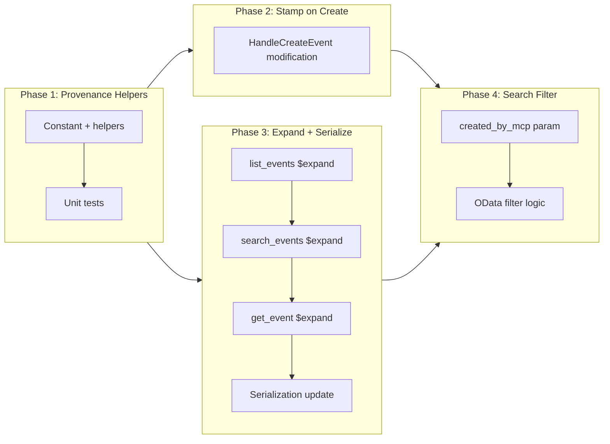

# MCP Event Provenance Tagging

## Change Summary

Tag every calendar event created by the MCP server with a hidden single-value extended property so that MCP-created events can be reliably identified and queried through the Graph API without any visible footprint in the Outlook UI.

## Motivation and Background

When the MCP server creates calendar events on behalf of an LLM assistant, there is no way to distinguish those events from events created manually in Outlook, by other apps, or by other integrations. This makes it impossible to:

- **Audit**: Determine which events on a calendar were created by the MCP.
- **Query**: List or search only MCP-created events (e.g., "show me all events the assistant created this week").
- **Clean up**: Identify and bulk-delete events that were created by the assistant during testing or by mistake.
- **Debug**: Trace an event back to the MCP server when investigating issues.

Microsoft Graph API supports **single-value extended properties** (MAPI named properties) that are invisible in the Outlook UI but fully queryable via `$filter` and `$expand`. This is the standard mechanism for applications to stamp hidden metadata on mailbox items without polluting the user-visible fields.

## Change Drivers

* **No provenance tracking**: MCP-created events are indistinguishable from manually created events.
* **Audit and compliance**: Users and administrators may need to know which events were created programmatically.
* **LLM self-awareness**: The assistant cannot answer "which events did I create?" without a tagging mechanism.
* **Testing and cleanup**: Developers testing the MCP need a reliable way to find and remove test events.

## Current State

### Event Creation

`HandleCreateEvent` in `internal/tools/create_event.go` constructs a `models.Event`, sets all user-provided fields, and calls `POST /me/events`. No metadata is stamped on the event.

### Event Querying

`list_events` and `search_events` use `$select` to retrieve standard event fields. Neither tool requests extended properties via `$expand`.

### Graph SDK Support

The `msgraph-sdk-go` models package supports single-value extended properties via `SetSingleValueExtendedProperties()` on `models.Eventable`. The CalendarView and events endpoints support `$expand=singleValueExtendedProperties($filter=...)` and `$filter=singleValueExtendedProperties/Any(...)`.

## Proposed Change

### 1. Define a Configurable Provenance Extended Property

Define a single-value extended property using a GUID namespace unique to this application and a configurable property name:

- **Property ID**: `String {GUID} Name <provenance_tag>`
- **Default provenance tag**: `com.github.desek.outlook-local-mcp.created`
- **Value**: `"true"`

The default property name follows the reverse domain DNS convention recommended by Microsoft for open extensions, ensuring global uniqueness and clear provenance. The GUID is application-specific and avoids collision with other apps that may use extended properties.

The property name is configurable via the `OUTLOOK_MCP_PROVENANCE_TAG` environment variable. This allows organizations to use their own namespace (e.g., `com.contoso.calendar-agent.created`) or disable provenance tagging entirely by setting the value to empty. When empty, no extended property is stamped and no `$expand` is added to read queries.

> **Note**: The exact GUID will be finalized during implementation. It should be a dedicated UUID generated for this purpose, defined as a constant.

### 2. Stamp on Event Creation

In `HandleCreateEvent`, after constructing the `models.Event` and before calling the Graph API, set the extended property:

```go
// provenancePropertyID is built once at startup from cfg.ProvenanceTag
prop := models.NewSingleValueLegacyExtendedProperty()
prop.SetId(&provenancePropertyID)
val := "true"
prop.SetValue(&val)
event.SetSingleValueExtendedProperties(
    []models.SingleValueLegacyExtendedPropertyable{prop},
)
```

This block is skipped entirely when `cfg.ProvenanceTag` is empty (provenance disabled).

This is included in the same `POST` request -- no additional API call.

### 3. Expose in Serialization

When serializing events (in `SerializeEvent`, `SerializeSummaryEvent`, `SerializeSummaryGetEvent`), check for the provenance extended property and include a `"createdByMcp": true` boolean in the response map when present. This field is omitted (not `false`) when the property is absent, keeping responses compact.

### 4. Expand Extended Property on Reads

Add the provenance property to the `$expand` clause on `list_events`, `search_events`, and `get_event` so the property is returned when present:

```
$expand=singleValueExtendedProperties($filter=id eq 'String {GUID} Name <configured_tag>')
```

This clause is omitted entirely when provenance tagging is disabled.

### 5. Add `created_by_mcp` Filter to `search_events`

Add an optional `created_by_mcp` boolean parameter to the `search_events` tool. When set to `true`, add an OData filter:

```
singleValueExtendedProperties/Any(ep: ep/id eq 'String {GUID} Name <configured_tag>' and ep/value eq 'true')
```

This enables queries like "find all events I created this week" with server-side filtering.

## Requirements

### Functional Requirements

1. Every event created via `HandleCreateEvent` **MUST** include a single-value extended property with the provenance property ID and value `"true"`, unless provenance tagging is disabled.
2. The provenance property name **MUST** be configurable via the `OUTLOOK_MCP_PROVENANCE_TAG` environment variable, with a default of `com.github.desek.outlook-local-mcp.created`.
3. When `OUTLOOK_MCP_PROVENANCE_TAG` is set to an empty string, provenance tagging **MUST** be completely disabled: no extended property is stamped on create, no `$expand` is added to reads, and the `created_by_mcp` filter parameter is not available on `search_events`.
4. The provenance property ID (combining the GUID and the configured tag name) **MUST** be constructed once at startup and passed to tool handlers, not recomputed per request.
5. The `get_event` handler **MUST** request the provenance extended property via `$expand` and include `"createdByMcp": true` in the response when present.
6. The `list_events` handler **MUST** request the provenance extended property via `$expand` and include `"createdByMcp": true` in the serialized response for events that have it.
7. The `search_events` handler **MUST** request the provenance extended property via `$expand` and include `"createdByMcp": true` in the serialized response for events that have it.
8. The `search_events` tool **MUST** accept an optional `created_by_mcp` boolean parameter that filters results to only MCP-created events using a server-side OData filter.
9. The provenance property **MUST NOT** be visible in the Outlook UI (enforced by the nature of single-value extended properties).
10. The provenance property **MUST NOT** be set on `update_event` calls -- it is write-once at creation time.

### Non-Functional Requirements

1. The provenance property **MUST** be set in the same `POST` request as event creation -- no additional API call.
2. The GUID used in the property ID **MUST** be a dedicated UUID constant, not reused from other contexts.
3. The full property ID **MUST** be constructed once at startup from the configured tag name, not on every request.
4. All new and modified code **MUST** include Go doc comments per project documentation standards.
5. All existing tests **MUST** continue to pass after the changes.

## Affected Components

| Component | Change |
|-----------|--------|
| `internal/config/config.go` | Add `ProvenanceTag` field, load from `OUTLOOK_MCP_PROVENANCE_TAG` with default |
| `internal/graph/provenance.go` (new) | Provenance property ID builder from configured tag name, GUID constant, helper to create the extended property, helper to check for provenance in an event |
| `internal/graph/provenance_test.go` (new) | Unit tests for provenance helpers |
| `internal/graph/serialize.go` | Add `createdByMcp` field to serialized output when provenance property is present |
| `internal/tools/create_event.go` | Set provenance extended property before POST (when enabled) |
| `internal/tools/list_events.go` | Add `$expand` for provenance property (when enabled) |
| `internal/tools/search_events.go` | Add `$expand` for provenance property (when enabled), add `created_by_mcp` filter parameter |
| `internal/tools/get_event.go` | Add `$expand` for provenance property (when enabled) |

## Scope Boundaries

### In Scope

* Configurable provenance tag name via `OUTLOOK_MCP_PROVENANCE_TAG` with default value
* Disabling provenance tagging when tag is set to empty string
* Defining the provenance extended property GUID constant and builder
* Stamping the property on `create_event`
* Expanding and serializing the property on `get_event`, `list_events`, and `search_events`
* Adding `created_by_mcp` filter parameter to `search_events`
* Unit tests for all new logic

### Out of Scope ("Here, But Not Further")

* Stamping provenance on `update_event` -- provenance tracks creation origin, not modification
* Adding provenance to `free_busy` or `list_calendars` -- these tools don't deal with individual events the MCP created
* Custom provenance values (e.g., encoding the LLM model or session ID) -- the initial implementation uses a simple boolean; richer metadata can be added later if needed
* Migrating existing MCP-created events to include the provenance property -- only newly created events will be tagged
* Removing or modifying the provenance property via any tool -- it is immutable after creation

## Impact Assessment

### User Impact

Users can ask the LLM assistant "show me events you created" or "delete all events the assistant made today" and get accurate results. The tagging is invisible in Outlook -- events look identical to manually created ones.

### Technical Impact

Minimal. Single-value extended properties are a first-class Graph API feature. The `$expand` clause adds a small amount of data to read responses (only the single property, only when present). The `POST` payload for create is marginally larger. No new dependencies.

### Business Impact

Enables provenance tracking and audit capabilities, which are important for enterprise adoption where administrators need visibility into programmatic calendar modifications.

## Implementation Approach

### Phase 1: Configuration and Provenance Helpers

Add `ProvenanceTag` field to `Config` struct in `internal/config/config.go`:
- Environment variable: `OUTLOOK_MCP_PROVENANCE_TAG`
- Default: `com.github.desek.outlook-local-mcp.created`
- Empty string disables provenance tagging entirely.

Create `internal/graph/provenance.go`:
- `ProvenanceGUID` constant with the dedicated UUID for the property set.
- `BuildProvenancePropertyID(tagName string) string` function that constructs the full property ID string from the configured tag name.
- `NewProvenanceProperty(propertyID string)` function that returns a configured `SingleValueLegacyExtendedPropertyable`.
- `HasProvenanceTag(event models.Eventable, propertyID string) bool` function that checks if the provenance property is present on an event.
- `ProvenanceExpandFilter(propertyID string) string` function that returns the `$expand` filter string.

Unit tests in `internal/graph/provenance_test.go`.

### Phase 2: Stamp on Create

Modify `HandleCreateEvent` to call `event.SetSingleValueExtendedProperties()` with the provenance property before the Graph API POST call.

### Phase 3: Expand and Serialize on Reads

- Update `$expand` in `list_events`, `search_events`, and `get_event` request configurations.
- Update `SerializeEvent`, `SerializeSummaryEvent`, and `SerializeSummaryGetEvent` to call `HasProvenanceTag()` and include `"createdByMcp": true` when present.

### Phase 4: Search Filter

Add `created_by_mcp` boolean parameter to `NewSearchEventsTool()`. In `HandleSearchEvents`, when the parameter is `true`, append the extended property OData filter to the `$filter` clause.

### Implementation Flow



## Test Strategy

### Tests to Add

| Test File | Test Name | Description |
|-----------|-----------|-------------|
| `provenance_test.go` | `TestBuildProvenancePropertyID` | Constructs correct property ID from tag name |
| `provenance_test.go` | `TestBuildProvenancePropertyID_CustomTag` | Constructs correct property ID with custom tag name |
| `provenance_test.go` | `TestNewProvenanceProperty` | Returns property with correct ID and value |
| `provenance_test.go` | `TestHasProvenanceTag_Present` | Returns true when property exists on event |
| `provenance_test.go` | `TestHasProvenanceTag_Absent` | Returns false when no extended properties |
| `provenance_test.go` | `TestHasProvenanceTag_OtherProperty` | Returns false when different extended property exists |
| `config_test.go` | `TestLoadConfig_ProvenanceTagDefault` | Default tag is `com.github.desek.outlook-local-mcp.created` |
| `config_test.go` | `TestLoadConfig_ProvenanceTagCustom` | Custom tag from env var |
| `config_test.go` | `TestLoadConfig_ProvenanceTagEmpty` | Empty string disables tagging |
| `serialize_test.go` | `TestSerializeEvent_CreatedByMcp` | `createdByMcp: true` present when provenance tag set |
| `serialize_test.go` | `TestSerializeEvent_NoMcpTag` | `createdByMcp` absent when no provenance tag |
| `create_event_test.go` | `TestCreateEvent_SetsProvenanceProperty` | Created event includes extended property in request |
| `search_events_test.go` | `TestSearchEvents_CreatedByMcpFilter` | OData filter includes extended property clause |
| `get_event_test.go` | `TestGetEvent_CreatedByMcpInResponse` | `createdByMcp: true` present in get_event response when provenance tag set (AC-2) |
| `list_events_test.go` | `TestListEvents_CreatedByMcpInResponse` | `createdByMcp: true` present in list_events response when provenance tag set (AC-3) |
| `search_events_test.go` | `TestSearchEvents_CreatedByMcpInResponse` | `createdByMcp: true` present in search_events response when provenance tag set (AC-9) |
| `update_event_test.go` | `TestUpdateEvent_NoProvenanceProperty` | PATCH request MUST NOT include singleValueExtendedProperties (AC-10) |
| `create_event_test.go` | `TestCreateEvent_ProvenanceDisabled` | No extended property when provenance tagging disabled (AC-7) |

### Tests to Modify

| Test File | Test Name | Change |
|-----------|-----------|--------|
| `create_event_test.go` | Existing create tests | Verify provenance property is present in POST body |

### Tests to Remove

Not applicable.

## Acceptance Criteria

### AC-1: Event tagged on creation

```gherkin
Given the MCP server is running and authenticated
When create_event is called with any valid parameters
Then the POST request to Graph API includes a singleValueExtendedProperties array
  And the array contains a property with the provenance property ID
  And the property value is "true"
```

### AC-2: Tag visible on get_event

```gherkin
Given an event was created via the MCP server
When get_event is called for that event
Then the response JSON contains "createdByMcp": true
```

### AC-3: Tag visible on list_events

```gherkin
Given an event was created via the MCP server
When list_events is called for a time range containing that event
Then the event in the response contains "createdByMcp": true
```

### AC-4: Tag absent for non-MCP events

```gherkin
Given an event was created manually in Outlook (not via MCP)
When get_event is called for that event
Then the response JSON does NOT contain the "createdByMcp" field
```

### AC-5: Search filter by provenance

```gherkin
Given a mix of MCP-created and manually-created events exist
When search_events is called with created_by_mcp=true
Then only MCP-created events are returned
```

### AC-6: Custom provenance tag name

```gherkin
Given OUTLOOK_MCP_PROVENANCE_TAG is set to "com.contoso.my-agent.created"
When create_event is called with any valid parameters
Then the POST request to Graph API includes a singleValueExtendedProperties array
  And the property ID contains "Name com.contoso.my-agent.created"
  And the property value is "true"
```

### AC-7: Provenance tagging disabled

```gherkin
Given OUTLOOK_MCP_PROVENANCE_TAG is set to ""
When create_event is called with any valid parameters
Then the POST request to Graph API does NOT include singleValueExtendedProperties
  And get_event responses do NOT contain "createdByMcp"
  And the search_events tool does NOT accept a created_by_mcp parameter
```

### AC-8: No UI visibility

```gherkin
Given an event was created via the MCP server with the provenance tag
When the event is viewed in Outlook (desktop, web, or mobile)
Then no additional fields, labels, or indicators are visible compared to a normal event
```

### AC-9: Tag visible on search_events

```gherkin
Given an event was created via the MCP server
When search_events is called for a time range containing that event
Then the event in the response contains "createdByMcp": true
```

### AC-10: Provenance not set on update_event

```gherkin
Given an event exists on the calendar
When update_event is called to modify that event
Then the PATCH request to Graph API MUST NOT include singleValueExtendedProperties
```

## Quality Standards Compliance

### Build & Compilation

- [x] Code compiles/builds without errors
- [x] No new compiler warnings introduced

### Linting & Code Style

- [x] All linter checks pass with zero warnings/errors
- [x] Code follows project coding conventions and style guides
- [x] Any linter exceptions are documented with justification

### Test Execution

- [x] All existing tests pass after implementation
- [x] All new tests pass
- [x] Test coverage meets project requirements for changed code

### Documentation

- [x] Inline code documentation updated where applicable
- [x] User-facing documentation updated if behavior changes

### Code Review

- [ ] Changes submitted via pull request
- [ ] PR title follows Conventional Commits format
- [ ] Code review completed and approved
- [ ] Changes squash-merged to maintain linear history

### Verification Commands

```bash
# Build verification
go build ./...

# Lint verification
golangci-lint run

# Test execution
go test ./... -v

# Full CI check
make ci
```

## Risks and Mitigation

### Risk 1: Extended property not returned on reads

**Likelihood:** low
**Impact:** medium
**Mitigation:** The `$expand` clause with the property ID filter is the documented Graph API mechanism for retrieving extended properties. This is well-supported across all event endpoints. Integration testing during implementation will confirm.

### Risk 2: Property ID GUID collision

**Likelihood:** very low
**Impact:** low
**Mitigation:** The GUID is a dedicated UUID generated specifically for this application. The namespace `{GUID} + Name` combination is unique. No known Microsoft or third-party apps use the same combination.

### Risk 3: OData filter complexity on search_events

**Likelihood:** low
**Impact:** low
**Mitigation:** The extended property filter is ANDed with existing filters. The CalendarView endpoint supports this composition. If the filter becomes too complex for a single query, the provenance filter can fall back to client-side filtering (same pattern as the categories filter in search_events).

### Risk 4: Performance impact of $expand on list_events

**Likelihood:** low
**Impact:** low
**Mitigation:** The `$expand` retrieves a single extended property per event, adding minimal payload. The Graph API is optimized for extended property expansion. If measurable impact is observed, the `$expand` can be made conditional (only when the client requests it).

## Dependencies

* CR-0008 (Create & Update Event Tools) -- provides the `create_event` handler being modified
* CR-0006 (Read-Only Tools) -- provides `list_events`, `get_event`, `search_events` handlers being modified

## Estimated Effort

| Phase | Description | Estimate |
|-------|-------------|----------|
| Phase 1 | Provenance constant + helpers + tests | 1 hour |
| Phase 2 | Stamp on create_event | 30 minutes |
| Phase 3 | $expand on reads + serialization update | 2 hours |
| Phase 4 | search_events filter parameter | 1 hour |
| **Total** | | **4.5 hours** |

## Decision Outcome

Chosen approach: **Single-value extended properties**, because they are the standard Graph API mechanism for hidden application metadata on mailbox items. They are invisible in the Outlook UI, queryable via OData `$filter`, expandable via `$expand`, and can be set in the same POST request as event creation with zero additional API calls.

Alternatives considered:
- **Open extensions**: Simpler data model but not filterable via `$filter` on CalendarView endpoints, which would require client-side filtering for the "find MCP events" use case. Less efficient at scale.
- **Schema extensions**: Require Entra ID app-level schema registration and admin consent. Adds operational complexity and deployment prerequisites that don't align with the project's local-first design.
- **Categories**: Visible in the Outlook UI (colored labels), which violates the "hidden" requirement. Users may also delete or modify categories.
- **Body footer/watermark**: Visible to attendees in meeting invitations. Fragile -- can be removed by editing the event. Not queryable.

## Related Items

* CR-0008 -- Create & Update Event Tools (create_event handler being modified)
* CR-0006 -- Read-Only Tools (list_events, get_event, search_events handlers being modified)
* CR-0039 -- Event Quality Guardrails (concurrent event quality improvement)

<!--
## CR-0040 Review Summary (2026-03-19)

**Findings: 5 | Fixes applied: 5 | Unresolvable: 0**

### Findings and Fixes

1. **Coverage gap: FR-7 (search_events createdByMcp field) had no AC.**
   FR-7 requires search_events to include "createdByMcp": true in responses.
   AC-5 only tests the created_by_mcp filter parameter, not the field in the response.
   Fix: Added AC-9 (Tag visible on search_events).

2. **Coverage gap: FR-10 (provenance not set on update_event) had no AC.**
   FR-10 requires provenance MUST NOT be set on update_event calls.
   No AC exercised this requirement.
   Fix: Added AC-10 (Provenance not set on update_event).

3. **Test gap: AC-2 (get_event returns createdByMcp) had no test.**
   Fix: Added TestGetEvent_CreatedByMcpInResponse to test strategy.

4. **Test gap: AC-3 (list_events returns createdByMcp) had no test.**
   Fix: Added TestListEvents_CreatedByMcpInResponse to test strategy.

5. **Test gaps: New ACs (AC-9, AC-10) and AC-7 handler behavior had no tests.**
   Fix: Added TestSearchEvents_CreatedByMcpInResponse (AC-9),
   TestUpdateEvent_NoProvenanceProperty (AC-10), and
   TestCreateEvent_ProvenanceDisabled (AC-7) to test strategy.

### Checks Passed (no issues)

- Internal contradictions: All ACs are consistent with FRs and Implementation Approach.
- Ambiguity: All requirements use MUST/MUST NOT. No vague language found.
- Scope consistency: Affected Components table matches all files in Implementation Approach phases.
- Diagram accuracy: Mermaid flowchart correctly shows Phase1 -> Phase2, Phase1 -> Phase3,
  Phase2 -> Phase4, Phase3 -> Phase4 dependency structure.
-->
