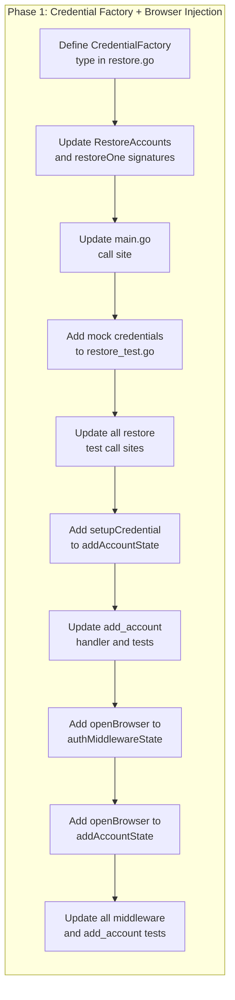

# Test Isolation: Eliminate Real Azure Credentials from Unit Tests

## Change Summary

Running `go test ./...` opens **16 browser tabs** per invocation from three independent sources: (1) `restore_test.go` constructs real credentials and calls `GetToken()` (4 tabs), (2) `middleware_test.go` exercises the auth_code re-authentication path which calls `browser.OpenURL()` (6 tabs), and (3) `add_account_test.go` exercises auth_code inline authentication which also calls `browser.OpenURL()` (6 tabs). This CR introduces three injection patterns — `CredentialFactory` for credential construction, `setupCredential` for add_account credential setup, and `openBrowser` for browser URL opening — allowing tests to inject mocks and eliminating all browser-opening side effects from the test suite.

## Motivation and Background

Running `go test ./...` currently opens **16 browser tabs** per invocation from three sources. The first source (4 tabs) is `restoreOne()`, which hardcodes a call to `SetupCredentialForAccount` and then calls `GetToken()` on the real credential. The Azure SDK:

1. Starts a localhost HTTP server for the OAuth redirect
2. Calls `browser.OpenURL()` to open the Azure AD login page
3. Waits for user interaction (bounded by the 5-second `silentAuthTimeout`)

The timeout cancels the context, but the browser tab is already opened. The `GetToken()` call always fails in test environments (no cached tokens), so these browser opens are entirely redundant — they produce no useful test signal and create an annoying developer experience.

A secondary issue exists in `internal/tools/add_account.go`, which also hardcodes `auth.SetupCredentialForAccount`. Its tests already work around this by mocking at the `authenticate` function level, but the real credential is still constructed unnecessarily. Adding a `setupCredential` field to `addAccountState` completes the isolation pattern.

The second and third sources (12 tabs total) are the `handleAuthCodeAuth` method in `middleware.go` and the `authenticateAuthCode` method in `add_account.go`. Both call `browser.OpenURL(authURL)` directly. When middleware and add_account tests exercise the auth_code flow, mock credentials return test authorization URLs, but `browser.OpenURL` is hardcoded and actually opens the system browser. Six `TestHandleAuthCodeAuth_*` tests in `middleware_test.go` and six auth_code tests in `add_account_test.go` each open one tab.

## Change Drivers

* **Developer experience**: 16 browser tabs open on every `go test` run, disrupting workflow
* **Test correctness**: Tests that trigger real Azure SDK flows are testing Azure SDK behavior, not application logic
* **CI reliability**: Browser-opening tests are environment-dependent and can behave unpredictably in headless CI runners
* **Consistency**: `GraphClientFactory` already demonstrates the injection pattern; `CredentialFactory` follows the same design

## Current State

### Account Restoration Flow

`restoreOne()` in `restore.go` hardcodes `SetupCredentialForAccount` (line 130):

```go
func restoreOne(
    acct AccountConfig,
    cacheNameBase string,
    authRecordDir string,
    registry *AccountRegistry,
    clientFactory GraphClientFactory,
) bool {
    cred, authenticator, authRecordPath, cacheName, err := SetupCredentialForAccount(
        acct.Label, acct.ClientID, acct.TenantID, acct.AuthMethod,
        cacheNameBase, authRecordDir,
    )
    // ... then calls cred.GetToken() for non-device_code accounts
}
```

`RestoreAccounts` accepts a `GraphClientFactory` for the Graph client (already injectable) but not for credential construction.

### Add Account Handler

`addAccountState.handleAddAccount()` in `add_account.go` hardcodes `auth.SetupCredentialForAccount` (line 258):

```go
cred, authenticator, authRecordPath, cacheName, err := auth.SetupCredentialForAccount(
    label, clientID, tenantID, authMethod, cfg.CacheName, authRecordDir,
)
```

Tests work around this by mocking `state.authenticate`, which intercepts before `GetToken()` is called on the real credential. The real credential is still constructed but never invoked.

### Affected Tests (Browser Tabs Opened)

| Test | File | Browser Accounts | Tabs Opened |
|------|------|-----------------|-------------|
| `TestRestoreAccounts_Success` | `restore_test.go:27` | 1 ("work") | 1 |
| `TestRestoreAccounts_SilentAuthFailure` | `restore_test.go:84` | 1 ("expired") | 1 |
| `TestRestoreAccounts_DuplicateLabel` | `restore_test.go:167` | 1 ("work") | 1 |
| `TestRestoreOne_Browser_AttemptsGetToken` | `restore_test.go:303` | 1 ("br-attempt") | 1 |
| **Total** | | | **4 tabs per `go test` run** |

### Tests That Call browser.OpenURL via Auth Code Flow (Tabs Opened)

| Test | File | Tabs Opened |
|------|------|-------------|
| `TestHandleAuthCodeAuth_ElicitationSuccess` | `middleware_test.go` | 1 |
| `TestHandleAuthCodeAuth_ElicitationNotSupported` | `middleware_test.go` | 1 |
| `TestHandleAuthCodeAuth_InvalidElicitationURL` | `middleware_test.go` | 1 |
| `TestHandleAuthCodeAuth_ExchangeFailure` | `middleware_test.go` | 1 |
| `TestHandleAuthCodeAuth_ElicitationDecline` | `middleware_test.go` | 1 |
| `TestHandleAuthCodeAuth_ElicitationError_ReturnsAuthURL` | `middleware_test.go` | 1 |
| `TestAddAccount_AuthCode_ElicitationSuccess` | `add_account_test.go` | 1 |
| `TestAddAccount_AuthCode_ElicitationNotSupported` | `add_account_test.go` | 1 |
| `TestAddAccount_AuthCode_ExchangeFailure` | `add_account_test.go` | 1 |
| `TestAuthenticateAuthCode_ElicitationError_ReturnsAuthURL` | `add_account_test.go` | 1 |
| `TestAuthenticateAuthCode_ElicitationSupported_NoFallback` | `add_account_test.go` | 1 |
| `TestAuthCodeAuth_NoPendingState` | `add_account_test.go` | 1 |
| **Total** | | **12 tabs per `go test` run** |

### Tests That Construct Real Credentials Without Triggering Browser

These tests construct real credentials via `SetupCredential` or `NewInteractiveBrowserCredential` but never call `GetToken()` or `Authenticate()`. They are safe (no browser opens) but represent unnecessary Azure SDK coupling for what are structural/type-assertion tests:

| Test | File | Purpose |
|------|------|---------|
| `TestSetupCredential_BrowserMethod` | `auth_test.go:294` | Verifies non-nil return |
| `TestSetupCredential_BrowserMethod_CredentialType` | `auth_test.go:383` | Type assertion |
| `TestAuthenticator_InterfaceCompliance` | `auth_test.go:343` | Interface satisfaction |
| `TestSetupCredentialForAccount_BrowserMethod` | `auth_test.go:477` | Verifies non-nil return + paths |
| `TestAddAccount_BrowserAuth_Success` | `add_account_test.go:271` | Full handler path (mock `authenticate` intercepts) |

These are **not in scope** for this CR — they don't cause browser opens and are valid integration-level tests for `SetupCredential`.

### Good Existing Patterns

The codebase already demonstrates proper test isolation:

* **`GraphClientFactory`** in `restore.go` — injectable factory for Graph clients, used by `fakeGraphClient()` in tests
* **`mockTokenCredential`** in `main_test.go` — configurable mock for `azcore.TokenCredential`
* **`addAccountState.authenticate`** — injectable function field, mocked in all `add_account_test.go` tests
* **`trackingAuthenticator`** in `middleware_test.go` — mock `Authenticator` implementation

## Proposed Change

### Change 1: CredentialFactory Type and RestoreAccounts Injection

Add a `CredentialFactory` function type to `restore.go` and thread it through `RestoreAccounts` → `restoreOne`:

```go
// CredentialFactory creates a credential and authenticator for an account.
// This type alias allows test injection of mock credentials.
type CredentialFactory func(
    label, clientID, tenantID, authMethod, cacheNameBase, authRecordDir string,
) (azcore.TokenCredential, Authenticator, string, string, error)
```

Update `RestoreAccounts` signature:

```go
// Before:
func RestoreAccounts(accountsPath, cacheNameBase, authRecordDir string,
    registry *AccountRegistry, clientFactory GraphClientFactory) (int, int)

// After:
func RestoreAccounts(accountsPath, cacheNameBase, authRecordDir string,
    registry *AccountRegistry, credFactory CredentialFactory,
    clientFactory GraphClientFactory) (int, int)
```

Update `restoreOne` to use the injected factory:

```go
func restoreOne(
    acct AccountConfig,
    cacheNameBase string,
    authRecordDir string,
    registry *AccountRegistry,
    credFactory CredentialFactory,
    clientFactory GraphClientFactory,
) bool {
    cred, authenticator, authRecordPath, cacheName, err := credFactory(
        acct.Label, acct.ClientID, acct.TenantID, acct.AuthMethod,
        cacheNameBase, authRecordDir,
    )
    // ...
}
```

**Files**: `internal/auth/restore.go`

### Change 2: Update Production Call Sites

Update `main.go` (the only production caller of `RestoreAccounts`) to pass `SetupCredentialForAccount` as the `CredentialFactory`:

```go
// Before:
restored, total := auth.RestoreAccounts(
    cfg.AccountsPath, cfg.CacheName, authRecordDir,
    registry, auth.DefaultGraphClientFactory,
)

// After:
restored, total := auth.RestoreAccounts(
    cfg.AccountsPath, cfg.CacheName, authRecordDir,
    registry, auth.SetupCredentialForAccount, auth.DefaultGraphClientFactory,
)
```

**Files**: `cmd/outlook-local-mcp/main.go`

### Change 3: Mock Credential Factory in Tests

Create a `fakeCredentialFactory` in `restore_test.go` that returns mock credentials:

```go
// mockCredential implements azcore.TokenCredential for testing.
// GetToken always returns an error (simulating no cached tokens).
type mockCredential struct{}

func (m *mockCredential) GetToken(_ context.Context, _ policy.TokenRequestOptions) (azcore.AccessToken, error) {
    return azcore.AccessToken{}, fmt.Errorf("no cached token")
}

// mockAuthenticator implements Authenticator for testing.
type mockAuthenticator struct{}

func (m *mockAuthenticator) Authenticate(_ context.Context, _ *policy.TokenRequestOptions) (azidentity.AuthenticationRecord, error) {
    return azidentity.AuthenticationRecord{}, fmt.Errorf("mock: not authenticated")
}

// fakeCredentialFactory returns mock credentials that never open a browser.
func fakeCredentialFactory(label, clientID, tenantID, authMethod, cacheNameBase, authRecordDir string) (
    azcore.TokenCredential, Authenticator, string, string, error,
) {
    cacheName := cacheNameBase + "-" + label
    authRecordPath := filepath.Join(authRecordDir, label+"_auth_record.json")
    return &mockCredential{}, &mockAuthenticator{}, authRecordPath, cacheName, nil
}
```

Update all restore tests to use `fakeCredentialFactory` instead of relying on `SetupCredentialForAccount`.

**Files**: `internal/auth/restore_test.go`

### Change 4: Add setupCredential to addAccountState

Add a `setupCredential` field to `addAccountState` for consistency:

```go
type addAccountState struct {
    // setupCredential creates per-account credentials. Defaults to
    // auth.SetupCredentialForAccount; tests inject a mock.
    setupCredential func(label, clientID, tenantID, authMethod, cacheName, authRecordDir string) (
        azcore.TokenCredential, auth.Authenticator, string, string, error)

    // authenticate performs authentication and persists the auth record.
    authenticate func(ctx context.Context, auth auth.Authenticator, authRecordPath string) (azidentity.AuthenticationRecord, error)
    // ... existing fields
}
```

Replace the hardcoded `auth.SetupCredentialForAccount` call in `handleAddAccount` with `s.setupCredential(...)`. Production initialization sets the field to `auth.SetupCredentialForAccount`.

**Files**: `internal/tools/add_account.go`

### Change 5: Inject openBrowser in authMiddlewareState and addAccountState

Add an `openBrowser` function field to both `authMiddlewareState` (middleware.go) and `addAccountState` (add_account.go). Both structs' `handleAuthCodeAuth` / `authenticateAuthCode` methods call `browser.OpenURL(authURL)` directly, which opens the system browser during auth_code flow tests.

Replace hardcoded `browser.OpenURL(authURL)` with `s.openBrowser(authURL)` in both locations. Production initialization sets the field to `browser.OpenURL`. All test `authMiddlewareState` and `addAccountState` instances set `openBrowser` to a no-op: `func(_ string) error { return nil }`.

**Files**: `internal/auth/middleware.go`, `internal/auth/middleware_test.go`, `internal/tools/add_account.go`, `internal/tools/add_account_test.go`

## Requirements

### Functional Requirements

1. `RestoreAccounts` **MUST** accept a `CredentialFactory` parameter for credential construction.
2. `restoreOne` **MUST** use the injected `CredentialFactory` instead of calling `SetupCredentialForAccount` directly.
3. Production code **MUST** pass `SetupCredentialForAccount` as the `CredentialFactory`.
4. All restore tests **MUST** use mock credentials that do not interact with Azure SDK authentication flows.
5. `addAccountState` **MUST** include a `setupCredential` field, defaulting to `auth.SetupCredentialForAccount` in production.
6. The `handleAddAccount` function **MUST** use `s.setupCredential(...)` instead of calling `auth.SetupCredentialForAccount` directly.
7. `authMiddlewareState` **MUST** include an `openBrowser` field, defaulting to `browser.OpenURL` in production.
8. `addAccountState` **MUST** include an `openBrowser` field, defaulting to `browser.OpenURL` in production.
9. The `handleAuthCodeAuth` method **MUST** use `s.openBrowser(...)` instead of calling `browser.OpenURL` directly.
10. The `authenticateAuthCode` method **MUST** use `s.openBrowser(...)` instead of calling `browser.OpenURL` directly.
11. Running `go test ./...` **MUST NOT** open any browser tabs or trigger any external authentication flows.

### Non-Functional Requirements

1. The mock credentials in restore tests **MUST** preserve the existing test semantics (silent auth fails, account registered with `Client=nil`, `Credential` non-nil, `Authenticator` non-nil).
2. All existing acceptance criteria from prior CRs (restore logic, device_code skip, browser attempt path) **MUST** remain verifiable through the updated tests.
3. The `CredentialFactory` type **MUST** have the same signature as `SetupCredentialForAccount` to allow direct assignment.

## Affected Components

| File | Change |
|------|--------|
| `internal/auth/restore.go` | Add `CredentialFactory` type; update `RestoreAccounts` and `restoreOne` signatures |
| `internal/auth/restore_test.go` | Add mock credentials and `fakeCredentialFactory`; update all test call sites |
| `cmd/outlook-local-mcp/main.go` | Pass `auth.SetupCredentialForAccount` as `CredentialFactory` argument |
| `internal/tools/add_account.go` | Add `setupCredential` and `openBrowser` fields to `addAccountState`; use them in `handleAddAccount` and `authenticateAuthCode` |
| `internal/tools/add_account_test.go` | Set `setupCredential` and `openBrowser` fields in test `addAccountState` instances |
| `internal/auth/middleware.go` | Add `openBrowser` field to `authMiddlewareState`; use it in `handleAuthCodeAuth` |
| `internal/auth/middleware_test.go` | Set `openBrowser` to no-op in all test `authMiddlewareState` instances |

## Scope Boundaries

### In Scope

* `CredentialFactory` type and injection in `restore.go` / `restoreOne`
* Mock credential factory in `restore_test.go`
* `setupCredential` field in `addAccountState`
* `openBrowser` field in `authMiddlewareState` and `addAccountState`
* Updating all production and test call sites

### Out of Scope

* Modifying `SetupCredential` or `SetupCredentialForAccount` implementation
* Changing tests in `auth_test.go` that construct real credentials but don't call `GetToken()` (safe, no browser opens)
* Modifying the Azure SDK credential types or their behavior
* Changing the `silentAuthTimeout` value
* Adding build tags or environment-variable guards to skip tests

## Impact Assessment

### User Impact

None. This is an internal test infrastructure change. No behavior change for end users.

### Technical Impact

* **Signature change**: `RestoreAccounts` gains a `CredentialFactory` parameter — all call sites updated (1 production, 8 tests)
* **New type**: `CredentialFactory` function type in `internal/auth/restore.go`
* **New field**: `setupCredential` on `addAccountState` in `internal/tools/add_account.go`
* **New field**: `openBrowser` on `authMiddlewareState` in `internal/auth/middleware.go` and `addAccountState` in `internal/tools/add_account.go`
* **Test mocks**: New `mockCredential`, `restoreMockAuthenticator`, and `fakeCredentialFactory` in `restore_test.go`; no-op `openBrowser` in all middleware and add_account test instances

### Developer Experience Impact

* **Positive**: `go test ./...` no longer opens browser tabs
* **Positive**: Tests run faster (no 5-second timeout waiting for browser auth)
* **Positive**: Tests are deterministic and CI-friendly (no external dependencies)

## Implementation Approach

Single phase — all changes are tightly coupled and should ship together.

### Implementation Flow



## Test Strategy

### Tests to Add

| Test File | Test Name | Description | Inputs | Expected Output |
|-----------|-----------|-------------|--------|-----------------|
| `internal/auth/restore_test.go` | (existing tests rewritten) | Verify restore logic with mock credentials — no browser opens | Mock `CredentialFactory` returning `mockCredential` | Same assertions pass; zero browser tabs opened |

### Tests to Modify

| Test File | Test Name | Current Behavior | New Behavior | Reason |
|-----------|-----------|------------------|--------------|--------|
| `internal/auth/restore_test.go` | `TestRestoreAccounts_Success` | Creates real `InteractiveBrowserCredential`, opens browser | Uses `fakeCredentialFactory`, no browser | Eliminate browser side effect |
| `internal/auth/restore_test.go` | `TestRestoreAccounts_SilentAuthFailure` | Creates real credential, opens browser | Uses `fakeCredentialFactory`, no browser | Eliminate browser side effect |
| `internal/auth/restore_test.go` | `TestRestoreAccounts_DuplicateLabel` | Creates real credential, opens browser | Uses `fakeCredentialFactory`, no browser | Eliminate browser side effect |
| `internal/auth/restore_test.go` | `TestRestoreOne_Browser_AttemptsGetToken` | Creates real credential, opens browser | Uses `fakeCredentialFactory`, mock `GetToken` returns error | Eliminate browser side effect; test still verifies browser accounts attempt silent auth |
| `internal/auth/restore_test.go` | `TestRestoreAccounts_IdentityFieldsPreserved` | Creates real `DeviceCodeCredential` (safe, skips `GetToken`) | Uses `fakeCredentialFactory` | Consistency with other restore tests |
| `internal/auth/restore_test.go` | `TestRestoreOne_DeviceCode_SkipsGetToken` | Creates real `DeviceCodeCredential` (safe, skips `GetToken`) | Uses `fakeCredentialFactory` | Consistency with other restore tests |
| `internal/tools/add_account_test.go` | All tests constructing `addAccountState` | No `setupCredential` field set | Set `setupCredential` to mock factory | Complete injection pattern |

### Tests to Remove

Not applicable. No tests become redundant.

## Acceptance Criteria

### AC-1: No browser tabs during test runs

```gherkin
Given the full test suite
When `go test ./...` is executed
Then zero browser tabs MUST be opened
  And the test suite MUST NOT make any external HTTP requests to Azure AD endpoints
```

### AC-2: Restore tests preserve semantics

```gherkin
Given mock credentials that return errors from GetToken
When RestoreAccounts is called with fakeCredentialFactory
Then browser accounts MUST still attempt silent auth (GetToken called on mock)
  And device_code accounts MUST still skip GetToken
  And all accounts MUST be registered in the registry with the correct fields
  And accounts with failed silent auth MUST have Client=nil
```

### AC-3: Production behavior unchanged

```gherkin
Given the production binary
When the server starts and RestoreAccounts is called
Then SetupCredentialForAccount MUST be used as the CredentialFactory
  And silent token acquisition MUST use real Azure SDK credentials
  And behavior MUST be identical to the current implementation
```

### AC-4: CredentialFactory type compatibility

```gherkin
Given the CredentialFactory type definition
When SetupCredentialForAccount is assigned to a CredentialFactory variable
Then compilation MUST succeed without type conversion
```

### AC-5: addAccountState injection

```gherkin
Given an addAccountState with setupCredential set to a mock
When handleAddAccount is invoked
Then the mock setupCredential MUST be called instead of auth.SetupCredentialForAccount
```

### AC-6: openBrowser injection prevents real browser opens

```gherkin
Given an authMiddlewareState or addAccountState with openBrowser set to a no-op
When handleAuthCodeAuth or authenticateAuthCode is invoked during tests
Then the system browser MUST NOT be opened
  And the no-op openBrowser MUST be called instead of browser.OpenURL
```

## Quality Standards Compliance

### Build & Compilation

- [x] Code compiles/builds without errors (`go build ./cmd/outlook-local-mcp/`)
- [x] No new compiler warnings introduced

### Linting & Code Style

- [x] All linter checks pass with zero warnings/errors
- [x] Code follows project coding conventions and style guides

### Test Execution

- [x] All existing tests pass (`go test ./...`)
- [x] No browser tabs opened during test execution
- [x] Test coverage meets project requirements for changed code

### Documentation

- [x] Inline code documentation updated for changed functions and new types

### Code Review

- [ ] Changes submitted via pull request
- [ ] PR title follows Conventional Commits format
- [ ] Code review completed and approved
- [ ] Changes squash-merged to maintain linear history

### Verification Commands

```bash
# Build verification
go build ./cmd/outlook-local-mcp/

# Test verification — confirm no browser tabs open
go test ./internal/auth/... -v -count=1
go test ./internal/tools/... -v -count=1
go test ./... -count=1

# Lint verification
golangci-lint run

# Full CI check
make ci
```

## Risks and Mitigation

### Risk 1: Mock credentials diverge from real credential behavior

**Likelihood**: low
**Impact**: medium
**Mitigation**: The mock `GetToken()` returns an error, which is the same behavior as a real credential without cached tokens. The restore logic being tested is the registration/skip branching, not Azure SDK token acquisition. The existing `TestSetupCredential_*` tests in `auth_test.go` continue to verify real credential construction.

### Risk 2: Signature change breaks external callers

**Likelihood**: very low
**Impact**: low
**Mitigation**: `RestoreAccounts` is in `internal/auth` — it has no external callers outside this module. The only production call site is `main.go`.

## Dependencies

* No dependencies on other CRs.
* No external dependencies beyond existing packages.

## Estimated Effort

* Phase 1 (all changes): 1–2 person-hours

## Decision Outcome

Chosen approach: "CredentialFactory injection", because it follows the existing `GraphClientFactory` pattern already established in the codebase, requires minimal code changes, and completely eliminates the browser-opening side effect from tests. The alternative of using build tags or environment variables to skip tests was rejected because it hides the problem rather than fixing it and reduces test coverage in CI.

## Related Items

* `internal/auth/restore.go`: Primary target — `CredentialFactory` injection
* `internal/auth/restore_test.go`: Primary beneficiary — mock credentials
* `internal/tools/add_account.go`: Secondary target — `setupCredential` field
* `GraphClientFactory` in `restore.go`: Existing pattern this CR follows
* CR-0032: Per-account identity config — established `SetupCredentialForAccount`
* CR-0037: Claude Desktop UX improvements — established device_code `GetToken` skip

<!--
## CR Review Summary (2026-03-19)

**Reviewer**: CR Reviewer Agent
**Findings**: 3 issues found, 2 fixes applied, 1 advisory noted.

### Fixes Applied

1. **Inaccurate code snippet (Change 2 — main.go Before/After)**:
   The "Before" snippet used `accountsPath` and `graphFactory` but the actual
   source uses `cfg.AccountsPath` and `auth.DefaultGraphClientFactory`. The
   "After" snippet had the same errors. Both snippets corrected to match the
   actual main.go source code.

2. **Ambiguous AC-1 wording**:
   "zero external HTTP requests MUST be made to Azure AD endpoints" was
   grammatically ambiguous — it could be parsed as requiring requests rather
   than prohibiting them. Reworded to: "the test suite MUST NOT make any
   external HTTP requests to Azure AD endpoints."

### Advisory (No Fix Needed)

3. **AC-3 and AC-4 have no explicit test entries in Test Strategy**:
   AC-3 (production passes SetupCredentialForAccount) and AC-4 (type
   compatibility without conversion) are compile-time assertions verified by
   the build step rather than unit tests. The "Build & Compilation" quality
   checklist covers them. No action required, but noted for completeness.

### Verification Results

- All Functional Requirements (FR-1 through FR-7) have corresponding ACs.
- All ACs with testable runtime behavior have Test Strategy entries.
- Affected Components list matches Implementation Approach file references.
- Mermaid diagram accurately reflects the single-phase implementation flow.
- All Current State code snippets match actual source files.
- All line number references in test tables are accurate.
- No contradictions found between requirements, ACs, and implementation approach.
- No vague language ("should", "may", "appropriate") in requirements or ACs.
-->
