# UX Polish: Tool Ergonomics and LLM Interaction Quality

## Change Summary

Real-world usage of the Outlook Local MCP extension in Claude Desktop and Claude Code reveals ten ergonomic friction points in how the LLM interacts with calendar tools. Users face excessive required parameters on event creation, inability to use natural date references, raw ISO 8601 timestamps in every response, no way to RSVP to meeting invitations, inconsistent convenience parameters across read tools, prefix-only subject search, no quick reschedule, JSON-only output, a broken `output` parameter on `list_accounts`, and terse error messages without recovery hints. This CR addresses all ten issues as a cohesive tool ergonomics improvement package.

## Motivation and Background

CR-0037 addressed critical first-use UX blockers (authentication failures, token persistence, startup crashes). With those resolved, the remaining friction is in the **tool interaction layer** -- how the LLM constructs tool calls and interprets responses. Every unnecessary parameter, missing convenience shorthand, or unformatted timestamp adds tokens, increases error probability, and slows the user's experience.

Observed patterns from real usage:

1. **"Schedule a meeting at 3pm tomorrow"** -- the LLM must provide 5 required parameters to `create_event` (subject, start_datetime, start_timezone, end_datetime, end_timezone). It frequently gets the timezone wrong or omits the end time, causing validation errors and retry loops.

2. **"What's on my calendar tomorrow?"** -- the `date` convenience param only accepts `"today"` or ISO 8601 dates. The LLM must compute tomorrow's date, which introduces timezone-aware date math errors.

3. **Every `list_events` response** contains timestamps like `"2026-03-19T14:00:00.0000000"` that the LLM must parse and reformat for the user, burning tokens and occasionally producing formatting errors.

4. **"Accept the standup meeting"** -- there is no tool to RSVP. The user cannot accept, tentatively accept, or decline meeting invitations through the MCP server.

5. **`search_events` and `get_free_busy` lack the `date` shorthand** that `list_events` has, forcing the LLM to compute full datetime ranges for the same day-based queries.

6. **"Find my budget meeting"** uses `startsWith(subject, 'budget')` in OData, missing events like "Q2 Budget Review". The substring fallback only triggers on HTTP 500, not by default.

7. **"Move the 1:1 to Thursday"** requires `update_event` with 4 datetime/timezone params. The LLM must fetch the event, compute the duration, build the new end time, and supply both timezones.

8. **All tool responses are JSON** -- the LLM must parse and format every response. A pre-formatted text mode would let it pass through directly.

9. **`list_accounts` accepts an `output` parameter** but the handler ignores it -- "summary" and "raw" produce identical output.

10. **Error messages like `"start_datetime is required"` are terse** -- the LLM retries with guesses instead of self-correcting, because the error doesn't hint at the `date` alternative or provide examples.

## Change Drivers

* **High**: `create_event` requires 5 mandatory params for a simple meeting -- timezone and end time should have smart defaults
* **High**: No relative date support beyond `"today"` -- the most common queries use "tomorrow", "this week", "next week"
* **Medium-High**: Raw ISO 8601 timestamps in every response burn tokens and cause formatting errors
* **Medium**: No RSVP tool -- accepting/declining meetings is a fundamental calendar operation
* **Medium**: Inconsistent `date` convenience param -- only on `list_events`, not on `search_events` or `get_free_busy`
* **Medium**: `search_events` prefix-only matching misses common substring queries
* **Medium**: No reschedule convenience -- moving a meeting requires 4 params plus duration math
* **Low-Medium**: JSON-only output -- a text mode would reduce LLM processing
* **Low**: `list_accounts` broken `output` param -- validates but ignores
* **Low**: Terse error messages lack recovery hints

## Current State

### Issue 1: `create_event` Requires 5 Mandatory Parameters

The `create_event` tool (`create_event.go:37-107`) requires: `subject`, `start_datetime`, `start_timezone`, `end_datetime`, `end_timezone`. The server already has a `DefaultTimezone` in config (`config.go:38`) and passes it to `list_events` for `date` expansion (`server.go:66`), but `create_event` and `update_event` do not use it. There is no duration inference -- the LLM must always compute the end time.

### Issue 2: No Relative Date Support Beyond `"today"`

The `expandDateParam` function (`list_events.go:324-346`) accepts only `"today"` or `YYYY-MM-DD`:

```go
if dateParam == "today" {
    now := time.Now().In(loc)
    date = time.Date(now.Year(), now.Month(), now.Day(), 0, 0, 0, 0, loc)
} else {
    parsed, err := time.Parse("2006-01-02", dateParam)
    // ...
}
```

No support for `"tomorrow"`, `"this_week"`, or `"next_week"`. These are deterministic date computations that would eliminate LLM date math for the most common queries.

### Issue 3: Raw ISO 8601 Timestamps in Summary Output

`SerializeSummaryEvent` (`serialize.go:169-207`) returns:

```json
{"id": "...", "subject": "Team Sync", "start": "2026-03-19T14:00:00.0000000", "end": "2026-03-19T15:00:00.0000000", ...}
```

The LLM must parse `"2026-03-19T14:00:00.0000000"` and reformat it to "Wed Mar 19, 2:00 PM" for the user. This parsing happens on every event in every response, burning tokens and occasionally producing formatting errors (wrong timezone, missing AM/PM).

### Issue 4: No RSVP / Respond to Event Tool

The Microsoft Graph API supports event responses via dedicated endpoints:
- `POST /me/events/{id}/accept`
- `POST /me/events/{id}/tentativelyAccept`
- `POST /me/events/{id}/decline`

Each accepts an optional `Comment` (string) and `SendResponse` (boolean) in the request body. There is no MCP tool exposing these endpoints. Users cannot accept, tentatively accept, or decline meeting invitations.

### Issue 5: Inconsistent `date` Convenience Parameter

`list_events` has the `date` param (`list_events.go:47-49`), but `search_events` (`search_events.go:47-97`) and `get_free_busy` (`get_free_busy.go:38-63`) require explicit `start_datetime`/`end_datetime`. The `expandDateParam` function is already extracted and reusable, but is not wired into these tools.

### Issue 6: `search_events` Prefix-Only Subject Matching

The OData filter uses `startsWith(subject, query)` (`search_events.go:245`):

```go
filters = append(filters, fmt.Sprintf("startsWith(subject,'%s')", graph.EscapeOData(query)))
```

This only matches events whose subject begins with the query text. "Find my budget meeting" would match "Budget Review" but miss "Q2 Budget Review Planning". The client-side `strings.Contains` fallback (`search_events.go:294-302`) only triggers on HTTP 500 (the null-subject bug), not as the default behavior.

### Issue 7: No Reschedule Convenience

Rescheduling an event requires `update_event` with `event_id`, `start_datetime`, `start_timezone`, `end_datetime`, `end_timezone`. The LLM must:
1. Call `get_event` to retrieve the current start/end times
2. Compute the original duration
3. Build the new end time from the new start + original duration
4. Supply both timezones

This is 2 tool calls and timezone-aware duration math -- a common source of errors.

### Issue 8: JSON-Only Output for All Tools

Every tool returns raw JSON via `mcp.NewToolResultText(string(jsonBytes))`. The LLM must parse the JSON and format it as human-readable text for the user. For list operations returning 10+ events, this is significant token overhead.

### Issue 9: `list_accounts` Broken `output` Parameter

`NewListAccountsTool` (`list_accounts.go:23-31`) declares an `output` parameter:

```go
mcp.WithString("output",
    mcp.Description("Output mode: 'summary' (default) or 'raw' for full Graph API response."),
),
```

But `HandleListAccounts` (`list_accounts.go:45-73`) only validates the parameter and ignores it -- the response format is identical regardless of the value. The `output` parameter is meaningless here since `list_accounts` doesn't call the Graph API (it reads from the in-memory registry), so "raw Graph API response" doesn't apply.

### Issue 10: Terse Error Messages Without Recovery Hints

Error messages from tool handlers are technically accurate but lack recovery guidance:

```
"start_datetime is required (or provide 'date' parameter)"
"end_datetime is required (or provide 'date' parameter)"
"missing required parameter: subject"
```

The `date` hint on datetime errors is helpful but most other errors lack similar guidance. For example, an invalid timezone returns `"invalid timezone: 'EST'; use IANA format (e.g. America/New_York)"` -- this is good. But `"missing required parameter: subject"` gives no context about what a good subject looks like or that the user should provide one.

## Proposed Change

### Change 1: Smart Defaults for `create_event` Timezone and End Time

Make `start_timezone`, `end_timezone`, and `end_datetime` optional on `create_event`:

- **`start_timezone` / `end_timezone`**: Default to `config.DefaultTimezone` when omitted. The handler already receives the config indirectly via the server registration; thread `defaultTimezone` through as a handler parameter (same pattern as `NewHandleListEvents`).
- **`end_datetime`**: When omitted, default to `start_datetime + 30 minutes`. For all-day events (`is_all_day=true`), default to `start_datetime + 24 hours`.

This reduces the typical `create_event` call from 5 required params to 2 (`subject` + `start_datetime`).

On `update_event`, `start_timezone` and `end_timezone` remain optional (they already are) but gain the same default from config when `start_datetime` or `end_datetime` is provided without a corresponding timezone.

**Files**:
- `internal/tools/create_event.go` -- make timezone/end params optional, add defaultTimezone parameter to handler constructor
- `internal/tools/update_event.go` -- default timezone from config when datetime provided without timezone
- `internal/server/server.go` -- pass `cfg.DefaultTimezone` to create/update handler constructors

### Change 2: Relative Date Support in `expandDateParam`

Extend `expandDateParam` (`list_events.go:324-346`) to accept:
- `"tomorrow"` -- resolves to tomorrow's date in the configured timezone
- `"this_week"` -- resolves to Monday through Sunday of the current week
- `"next_week"` -- resolves to Monday through Sunday of the following week

The function already handles `"today"` and ISO 8601 dates. The new shorthands are deterministic date computations with no ambiguity.

Update the `date` parameter description on all tools that use it (currently `list_events`, and after Change 5, also `search_events` and `get_free_busy`).

**File**: `internal/tools/list_events.go`, function `expandDateParam`

### Change 3: Human-Readable `displayTime` in Summary Output

Add a `displayTime` field to summary serialization that pre-formats the event's start and end into a human-readable string. Example:

```json
{
  "id": "...",
  "subject": "Team Sync",
  "start": "2026-03-19T14:00:00.0000000",
  "end": "2026-03-19T15:00:00.0000000",
  "displayTime": "Wed Mar 19, 2:00 PM - 3:00 PM"
}
```

The `displayTime` field is:
- Only present in `summary` output mode (not `raw`).
- Formatted using the event's timezone from the `start` object (when available) or UTC.
- Uses `Mon Jan 2, 3:04 PM` Go format for single-day events; includes the date range for multi-day events.
- All-day events render as `"Wed Mar 19 (all day)"`.

**Files**:
- `internal/graph/serialize.go` -- add `displayTime` to `SerializeSummaryEvent` and `SerializeSummaryGetEvent`
- `internal/graph/format.go` (new) -- `FormatDisplayTime(start, end, isAllDay)` helper

### Change 4: Add `respond_event` Tool

Add a new write tool that wraps the Graph API event response endpoints:

```go
mcp.NewTool("respond_event",
    mcp.WithDescription(
        "Respond to a meeting invitation: accept, tentatively accept, or decline. "+
            "Sends a response to the organizer. Only applicable to events where you "+
            "are an attendee, not the organizer.",
    ),
    mcp.WithString("event_id", mcp.Required(),
        mcp.Description("The unique identifier of the event to respond to."),
    ),
    mcp.WithString("response", mcp.Required(),
        mcp.Description("Response type: 'accept', 'tentative', or 'decline'."),
    ),
    mcp.WithString("comment",
        mcp.Description("Optional message to the organizer explaining your response."),
    ),
    mcp.WithBoolean("send_response",
        mcp.Description("Whether to send the response to the organizer. Defaults to true."),
    ),
    mcp.WithString("account",
        mcp.Description("Account label to use. If omitted, the default account is used. Use list_accounts to see available accounts."),
    ),
)
```

The handler routes to the appropriate Graph API endpoint based on the `response` parameter:
- `"accept"` -> `POST /me/events/{id}/accept`
- `"tentative"` -> `POST /me/events/{id}/tentativelyAccept`
- `"decline"` -> `POST /me/events/{id}/decline`

Each endpoint accepts a request body with `Comment` (string) and `SendResponse` (boolean).

**Files**:
- `internal/tools/respond_event.go` (new) -- tool definition and handler
- `internal/server/server.go` -- register the tool as a write tool via `wrapWrite`

### Change 5: Add `date` Convenience Parameter to `search_events` and `get_free_busy`

Reuse `expandDateParam` in `search_events` and `get_free_busy` with the same semantics as `list_events`:
- When `date` is provided and `start_datetime`/`end_datetime` are omitted, expand to start/end-of-day.
- When both are provided, explicit datetimes take precedence.
- `search_events` retains its existing default of "next 30 days from now" when neither `date` nor `start_datetime`/`end_datetime` is provided.
- `get_free_busy` keeps both as required unless `date` is provided (in which case they become optional).

Thread `defaultTimezone` through the handler constructors for `search_events` and `get_free_busy` (same pattern as Change 1).

**Files**:
- `internal/tools/search_events.go` -- add `date` param, use `expandDateParam`, add `defaultTimezone` to handler
- `internal/tools/get_free_busy.go` -- add `date` param, use `expandDateParam`, add `defaultTimezone` to handler
- `internal/server/server.go` -- pass `cfg.DefaultTimezone` to search/free-busy handler constructors

### Change 6: Default to Client-Side Substring Matching in `search_events`

Replace the `startsWith` OData filter with **always** using client-side `strings.Contains` for the `query` parameter. The current flow:

1. Try `startsWith(subject, query)` as OData filter
2. On HTTP 500, fall back to client-side `strings.Contains`

The proposed flow:

1. Execute CalendarView without subject filter (only use OData for importance, sensitivity, etc.)
2. Apply `strings.Contains(strings.ToLower(subject), strings.ToLower(query))` client-side on all results

This is simpler, more predictable, and matches user expectations (substring, not prefix). The performance impact is negligible because CalendarView already returns a bounded set (default 25, max 100 events) and `max_results` is applied after client-side filtering.

**File**: `internal/tools/search_events.go` -- remove `startsWith` from OData filters, always apply client-side substring matching

### Change 7: Add `reschedule_event` Convenience Tool

Add a new write tool that combines `get_event` + `update_event` into a single atomic operation:

```go
mcp.NewTool("reschedule_event",
    mcp.WithDescription(
        "Move an event to a new time, preserving its original duration. "+
            "Only the new start time is required; the end time is computed automatically. "+
            "Sends update notifications to attendees if applicable.",
    ),
    mcp.WithString("event_id", mcp.Required(),
        mcp.Description("The unique identifier of the event to reschedule."),
    ),
    mcp.WithString("new_start_datetime", mcp.Required(),
        mcp.Description("New start time in ISO 8601 without offset, e.g. 2026-04-17T14:00:00"),
    ),
    mcp.WithString("new_start_timezone",
        mcp.Description("IANA timezone for the new start time. Defaults to the server's configured timezone."),
    ),
    mcp.WithString("account",
        mcp.Description("Account label to use. If omitted, the default account is used. Use list_accounts to see available accounts."),
    ),
)
```

The handler:
1. Calls `GET /me/events/{id}` to retrieve the current start/end.
2. Computes the original duration from `end - start`.
3. Computes `new_end = new_start + duration`.
4. Calls `PATCH /me/events/{id}` with the new start/end.
5. Returns the updated event.

**Files**:
- `internal/tools/reschedule_event.go` (new) -- tool definition and handler
- `internal/server/server.go` -- register the tool as a write tool via `wrapWrite`

### Change 8: Add Plain-Text Output Mode for Read Tools

Extend the `output` parameter on read tools to accept `"text"` in addition to `"summary"` and `"raw"`:

- `"summary"` (default): compact JSON with flattened fields (current behavior).
- `"raw"`: full Graph API response JSON (current behavior).
- `"text"`: pre-formatted plain text suitable for direct display to the user.

Example `text` output for `list_events`:

```
Today's Events (Wed Mar 19, 2026):

1. Team Sync
   2:00 PM - 3:00 PM | Conference Room A | Busy
   Organizer: Alice Smith

2. 1:1 with Bob
   4:00 PM - 4:30 PM | Microsoft Teams | Busy
   Organizer: Bob Jones

3 events total.
```

The text formatter is a new function that takes the serialized event list and produces a single string. The LLM can pass this through to the user without any additional formatting.

Apply to: `list_events`, `search_events`, `get_event`, `list_calendars`, `get_free_busy`.

**Files**:
- `internal/tools/output.go` -- extend `ValidateOutputMode` to accept `"text"`
- `internal/tools/text_format.go` (new) -- `FormatEventsText`, `FormatCalendarsText`, `FormatFreeBusyText`, `FormatEventDetailText` functions
- `internal/tools/list_events.go`, `search_events.go`, `get_event.go`, `list_calendars.go`, `get_free_busy.go` -- add `text` output branch

### Change 9: Remove `output` Parameter from `list_accounts`

Remove the `output` parameter from `list_accounts` since it is meaningless -- the tool reads from the in-memory registry, not the Graph API, so there is no "raw Graph API response" to return.

**File**: `internal/tools/list_accounts.go` -- remove `output` param from tool definition, remove `ValidateOutputMode` call from handler

### Change 10: Enriched Error Messages with Recovery Hints

Add contextual recovery hints to common validation errors in tool handlers. The pattern is to append a `Tip:` line to error messages where a common correction exists:

```go
// Before:
return mcp.NewToolResultError("missing required parameter: subject"), nil

// After:
return mcp.NewToolResultError(
    "missing required parameter: subject. " +
    "Tip: Ask the user what they'd like to name the event."), nil
```

Apply to the most frequent error paths:
- Missing `start_datetime` without `date`: hint about `date` param (already done in `list_events`)
- Missing `subject`: hint to ask the user
- Invalid timezone: hint with example (already done in `validate.go`)
- Missing `event_id` on get/update/delete: hint to use `list_events` or `search_events` to find it
- Missing `response` on `respond_event`: list valid values

**Files**:
- `internal/tools/create_event.go` -- enrich `subject` error
- `internal/tools/get_event.go`, `update_event.go`, `delete_event.go`, `cancel_event.go` -- enrich `event_id` error
- `internal/tools/respond_event.go` -- enrich `response` error

## Requirements

### Functional Requirements

1. The `create_event` tool **MUST** accept `start_timezone` and `end_timezone` as optional parameters, defaulting to `config.DefaultTimezone` when omitted.
2. The `create_event` tool **MUST** accept `end_datetime` as optional, defaulting to `start_datetime + 30 minutes` when omitted (or `+ 24 hours` when `is_all_day=true`).
3. The `expandDateParam` function **MUST** accept `"tomorrow"`, `"this_week"`, and `"next_week"` in addition to `"today"` and ISO 8601 dates.
4. `"tomorrow"` **MUST** resolve to tomorrow's date in the configured timezone.
5. `"this_week"` **MUST** resolve to Monday 00:00:00 through Sunday 23:59:59 of the current ISO week in the configured timezone.
6. `"next_week"` **MUST** resolve to Monday 00:00:00 through Sunday 23:59:59 of the following ISO week in the configured timezone.
7. The summary serialization **MUST** include a `displayTime` field with a human-readable formatted time string for each event.
8. The `displayTime` field **MUST** use the event's timezone from the start object; all-day events **MUST** render with `"(all day)"` instead of clock times.
9. A new `respond_event` write tool **MUST** be registered that accepts `event_id`, `response` (`"accept"`, `"tentative"`, `"decline"`), optional `comment`, optional `send_response` (default true), and optional `account`.
10. The `respond_event` tool **MUST** route to the correct Graph API endpoint: `/accept`, `/tentativelyAccept`, or `/decline`.
11. The `search_events` tool **MUST** accept an optional `date` parameter with the same semantics as `list_events`.
12. The `get_free_busy` tool **MUST** accept an optional `date` parameter; when provided, `start_datetime` and `end_datetime` become optional.
13. The `search_events` tool **MUST** use client-side case-insensitive substring matching for the `query` parameter instead of OData `startsWith`.
14. The OData `startsWith` filter for subject **MUST** be removed from the `search_events` filter builder.
15. A new `reschedule_event` write tool **MUST** be registered that accepts `event_id`, `new_start_datetime`, optional `new_start_timezone` (defaults to config), and optional `account`.
16. The `reschedule_event` handler **MUST** retrieve the existing event's duration and compute `new_end = new_start + duration`.
17. The `output` parameter on read tools **MUST** accept `"text"` as a valid value in addition to `"summary"` and `"raw"`.
18. The `"text"` output mode **MUST** return a pre-formatted plain-text string with numbered event listings, human-readable times, and summary totals.
19. The `output` parameter **MUST** be removed from the `list_accounts` tool definition and handler.
20. Validation error messages for missing `event_id` **MUST** include a hint to use `list_events` or `search_events` to find the ID.
21. The validation error for missing `subject` on `create_event` **MUST** include a hint to ask the user for the event name.

### Non-Functional Requirements

1. All changes **MUST** be fully backward-compatible -- existing tool calls with explicit parameters **MUST** produce identical behavior.
2. The `displayTime` formatting **MUST NOT** make additional Graph API calls -- it operates only on data already present in the serialized event.
3. The `reschedule_event` handler **MUST** complete in at most 2 Graph API calls (GET + PATCH).
4. The `text` output formatter **MUST NOT** introduce new external dependencies.
5. The `respond_event` tool **MUST** be guarded by `ReadOnlyGuard` (registered via `wrapWrite`).
6. The `reschedule_event` tool **MUST** be guarded by `ReadOnlyGuard` (registered via `wrapWrite`).
7. All new and modified code **MUST** include Go doc comments per project documentation standards.
8. All existing tests **MUST** continue to pass after the changes.

## Affected Components

| Component | Change |
|-----------|--------|
| `internal/tools/create_event.go` | Make timezone/end optional, add `defaultTimezone` param, enriched error hints |
| `internal/tools/update_event.go` | Default timezone from config when datetime provided without timezone, enriched `event_id` error hint |
| `internal/tools/list_events.go` | Extend `expandDateParam` with `"tomorrow"`, `"this_week"`, `"next_week"` |
| `internal/tools/search_events.go` | Add `date` param, remove `startsWith`, always use client-side substring matching, add `defaultTimezone` |
| `internal/tools/get_free_busy.go` | Add `date` param, add `defaultTimezone` to handler |
| `internal/tools/get_event.go` | Enriched `event_id` error hint |
| `internal/tools/delete_event.go` | Enriched `event_id` error hint |
| `internal/tools/cancel_event.go` | Enriched `event_id` error hint |
| `internal/tools/respond_event.go` (new) | RSVP tool: accept/tentative/decline, enriched `response` error hint |
| `internal/tools/reschedule_event.go` (new) | Reschedule tool: preserves duration |
| `internal/tools/list_calendars.go` | Add `text` output branch |
| `internal/tools/output.go` | Extend `ValidateOutputMode` to accept `"text"` |
| `internal/tools/text_format.go` (new) | Plain-text formatters for events, calendars, free/busy |
| `internal/tools/list_accounts.go` | Remove `output` parameter |
| `internal/graph/serialize.go` | Add `displayTime` to summary serialization |
| `internal/graph/format.go` (new) | `FormatDisplayTime` helper |
| `internal/server/server.go` | Register `respond_event` and `reschedule_event`, pass `defaultTimezone` to more handlers |

## Scope Boundaries

### In Scope

* Smart defaults for `create_event` timezone and end time
* Relative date shorthands (`"tomorrow"`, `"this_week"`, `"next_week"`) in `expandDateParam`
* `displayTime` field in summary serialization
* New `respond_event` tool (accept/tentative/decline)
* `date` convenience parameter on `search_events` and `get_free_busy`
* Client-side substring matching for `search_events` query
* New `reschedule_event` convenience tool
* `"text"` output mode for read tools
* Remove broken `output` parameter from `list_accounts`
* Enriched validation error messages with recovery hints

### Out of Scope ("Here, But Not Further")

* Natural language date parsing ("next Tuesday", "in 2 hours") -- these require NLP and are better handled by the LLM before calling the tool
* Relative dates beyond `"next_week"` (e.g., "this_month") -- can be added in a follow-up if the pattern proves useful
* Recurring event RSVP for individual occurrences -- the Graph API supports this but adds significant complexity; defer to a follow-up CR
* Batch operations (accept all pending invitations) -- separate concern
* `text` output for `status` and account management tools -- these have simple enough output that JSON is fine
* Markdown output mode -- `"text"` is plain text; Markdown formatting can be a follow-up
* `update_event` timezone defaulting for the current event's timezone (would require an extra GET call) -- only default from config

## Impact Assessment

### User Impact

**Event creation**: "Schedule a meeting at 3pm tomorrow" becomes a 2-parameter call (`subject` + `start_datetime`) instead of 5. The LLM no longer needs to supply timezones or compute end times for typical meetings.

**Date queries**: "What's on my calendar tomorrow?" / "Show me next week's events" work naturally with `date: "tomorrow"` / `date: "next_week"` across all read tools.

**Response formatting**: The `displayTime` field and `text` output mode reduce the LLM's formatting burden. Users see cleaner, faster responses.

**Meeting responses**: Users can accept, decline, or tentatively accept meeting invitations through natural conversation.

**Search accuracy**: "Find my budget meeting" now matches any event containing "budget" in the subject, not just events starting with "budget".

**Rescheduling**: "Move the 1:1 to Thursday at 3pm" becomes a single tool call instead of GET + compute + UPDATE.

### Technical Impact

* **New tools**: `respond_event` (1 Graph API call), `reschedule_event` (2 Graph API calls)
* **New files**: 4 new files (`respond_event.go`, `reschedule_event.go`, `text_format.go`, `format.go`)
* **Breaking changes**: None. All parameter changes are additive (new optional params with defaults matching current required behavior). Removing `output` from `list_accounts` is non-breaking since the parameter was ignored.
* **Tool count**: Increases from 13-14 to 15-16 tools (adding `respond_event` and `reschedule_event`)
* **search_events behavior change**: Substring matching instead of prefix. This is a behavior change but strictly more permissive (matches a superset of the previous results).

### Business Impact

Reduces the "clumsy assistant" perception where simple calendar tasks require multiple retries due to parameter complexity or missing capabilities. Closes the feature gap on RSVP -- a fundamental calendar operation that competitors support.

## Implementation Approach

Ten changes organized into four tiers by impact, with eight phases (some changes are combined). Each phase is independently shippable.

### Implementation Flow

```mermaid
flowchart LR
    subgraph Tier1["Tier 1: Parameter Ergonomics"]
        subgraph Phase1["Phase 1: create_event Defaults"]
            A1["Optional timezone + end time"]
            A2["Thread defaultTimezone"]
        end
        subgraph Phase2["Phase 2: Relative Dates"]
            B1["expandDateParam extensions"]
            B2["date param on search + free/busy"]
        end
    end
    subgraph Tier2["Tier 2: New Capabilities"]
        subgraph Phase3["Phase 3: respond_event"]
            C1["Tool + handler"]
            C2["Register via wrapWrite"]
        end
        subgraph Phase4["Phase 4: reschedule_event"]
            D1["Tool + handler"]
            D2["Duration computation"]
        end
    end
    subgraph Tier3["Tier 3: Output Quality"]
        subgraph Phase5["Phase 5: displayTime"]
            E1["FormatDisplayTime helper"]
            E2["Wire into summary serialization"]
        end
        subgraph Phase6["Phase 6: Text Output"]
            F1["ValidateOutputMode extension"]
            F2["Text formatters"]
            F3["Wire into read tools"]
        end
    end
    subgraph Tier4["Tier 4: Polish"]
        subgraph Phase7["Phase 7: Search + Errors"]
            G1["Client-side substring"]
            G2["Enriched error hints"]
        end
        subgraph Phase8["Phase 8: Cleanup"]
            H1["Remove list_accounts output param"]
        end
    end
    Tier1 --> Tier2 --> Tier3 --> Tier4
```



## Test Strategy

### Tests to Add

| Test File | Test Name | Description | Inputs | Expected Output |
|-----------|-----------|-------------|--------|-----------------|
| `create_event_test.go` | `TestCreateEvent_TimezoneDefaults` | Timezone defaults to config when omitted | No `start_timezone`/`end_timezone` | Event created with `DefaultTimezone` |
| `create_event_test.go` | `TestCreateEvent_EndTimeDefaults30Min` | End time defaults to start + 30min | No `end_datetime` | End = start + 30 minutes |
| `create_event_test.go` | `TestCreateEvent_EndTimeDefaultsAllDay` | End time defaults to start + 24h for all-day | `is_all_day=true`, no `end_datetime` | End = start + 24 hours |
| `create_event_test.go` | `TestCreateEvent_ExplicitOverridesDefaults` | Explicit tz/end takes precedence | All 5 params provided | Explicit values used |
| `list_events_test.go` | `TestExpandDateParam_Tomorrow` | `"tomorrow"` resolves correctly | `"tomorrow"` | Next day start/end |
| `list_events_test.go` | `TestExpandDateParam_ThisWeek` | `"this_week"` resolves to Mon-Sun | `"this_week"` | Monday 00:00 to Sunday 23:59 |
| `list_events_test.go` | `TestExpandDateParam_NextWeek` | `"next_week"` resolves to next Mon-Sun | `"next_week"` | Next Monday 00:00 to next Sunday 23:59 |
| `list_events_test.go` | `TestExpandDateParam_Invalid` | Invalid date string returns error | `"yesterday"` | Error |
| `serialize_test.go` | `TestSerializeSummaryEvent_DisplayTime` | `displayTime` field present in summary | Event with start/end | Map contains `displayTime` with formatted string |
| `serialize_test.go` | `TestSerializeSummaryEvent_DisplayTime_AllDay` | All-day event shows "(all day)" | All-day event | `displayTime` contains "(all day)" |
| `format_test.go` | `TestFormatDisplayTime_SameDay` | Same-day event formatting | Start/end same day | `"Wed Mar 19, 2:00 PM - 3:00 PM"` |
| `format_test.go` | `TestFormatDisplayTime_MultiDay` | Multi-day event formatting | Start/end different days | Includes both dates |
| `respond_event_test.go` | `TestRespondEvent_Accept` | Accept routes to /accept endpoint | `response: "accept"` | Graph client `/accept` called |
| `respond_event_test.go` | `TestRespondEvent_Tentative` | Tentative routes to /tentativelyAccept | `response: "tentative"` | Graph client `/tentativelyAccept` called |
| `respond_event_test.go` | `TestRespondEvent_Decline` | Decline routes to /decline endpoint | `response: "decline"` | Graph client `/decline` called |
| `respond_event_test.go` | `TestRespondEvent_InvalidResponse` | Invalid response value rejected | `response: "maybe"` | Validation error |
| `respond_event_test.go` | `TestRespondEvent_WithComment` | Comment passed to request body | `comment: "Running late"` | RequestBody includes comment |
| `respond_event_test.go` | `TestRespondEvent_SendResponseFalse` | SendResponse=false suppresses notification | `send_response: false` | RequestBody SendResponse=false |
| `reschedule_event_test.go` | `TestRescheduleEvent_PreservesDuration` | Duration preserved from original event | 1-hour event moved | New end = new start + 1 hour |
| `reschedule_event_test.go` | `TestRescheduleEvent_DefaultTimezone` | Timezone defaults from config | No `new_start_timezone` | Uses `DefaultTimezone` |
| `reschedule_event_test.go` | `TestRescheduleEvent_EventNotFound` | 404 from GET returns error | Invalid event_id | Error message with hint |
| `search_events_test.go` | `TestSearchEvents_DateParam` | `date` param expands correctly | `date: "today"` | CalendarView called with start/end of day |
| `search_events_test.go` | `TestSearchEvents_SubstringMatch` | Substring matching, not prefix | `query: "budget"`, event: "Q2 Budget Review" | Event included in results |
| `get_free_busy_test.go` | `TestGetFreeBusy_DateParam` | `date` param expands correctly | `date: "tomorrow"` | CalendarView called with tomorrow's start/end |
| `output_test.go` | `TestValidateOutputMode_Text` | `"text"` accepted as valid mode | `"text"` | Returns `"text"`, no error |
| `text_format_test.go` | `TestFormatEventsText_MultipleEvents` | Text output for event list | 3 events | Numbered list with formatted times |
| `text_format_test.go` | `TestFormatEventsText_Empty` | Text output for empty list | 0 events | "No events found." |
| `text_format_test.go` | `TestFormatFreeBusyText` | Text output for busy periods | 2 busy periods | Formatted busy period list |
| `list_accounts_test.go` | `TestListAccounts_NoOutputParam` | Tool schema has no `output` param | Tool definition | No `output` in properties |
| `list_events_test.go` | `TestExpandDateParam_NextWeek` | `"next_week"` resolves to next Mon-Sun | `"next_week"` | Next Monday 00:00 to next Sunday 23:59 |
| `get_event_test.go` | `TestGetEvent_MissingEventId_HintMessage` | Missing event_id error includes recovery hint | No `event_id` | Error contains "Use list_events or search_events to find the event ID" |
| `create_event_test.go` | `TestCreateEvent_MissingSubject_HintMessage` | Missing subject error includes recovery hint | No `subject` | Error contains hint to ask user for event name |

### Tests to Modify

| Test File | Test Name | Current Behavior | New Behavior | Reason |
|-----------|-----------|------------------|--------------|--------|
| `create_event_test.go` | `TestCreateEvent_MissingStartTimezone` | Returns error | Creates event with default TZ | Timezone now optional |
| `create_event_test.go` | `TestCreateEvent_MissingEndDatetime` | Returns error | Creates event with start+30min | End datetime now optional |
| `search_events_test.go` | `TestSearchEvents_QueryFilter` | Verifies `startsWith` in OData filter | Verifies no subject filter in OData, client-side substring applied | Changed to client-side matching |
| `list_accounts_test.go` | `TestListAccounts_OutputParam` | Validates output param | Test removed or updated | Param removed |

### Tests to Remove

| Test File | Test Name | Reason |
|-----------|-----------|--------|
| `search_events_test.go` | `TestSearchEvents_StartsWithFallback` | HTTP 500 fallback logic removed -- substring matching is always client-side |

## Acceptance Criteria

### AC-1: create_event with 2 parameters

```gherkin
Given the server is configured with DefaultTimezone "Europe/Stockholm"
When the LLM calls create_event with only subject="Team Sync" and start_datetime="2026-03-20T14:00:00"
Then the event is created successfully
  And the start_timezone is "Europe/Stockholm"
  And the end_timezone is "Europe/Stockholm"
  And the end_datetime is "2026-03-20T14:30:00" (30 minutes after start)
```

### AC-2: create_event explicit params take precedence

```gherkin
Given the server is configured with DefaultTimezone "Europe/Stockholm"
When the LLM calls create_event with start_timezone="America/New_York" and end_datetime="2026-03-20T16:00:00"
Then the event uses the explicitly provided values
  And the DefaultTimezone is NOT applied to start_timezone
  And the end_datetime is NOT overridden with start+30min
```

### AC-3: Relative date "tomorrow"

```gherkin
Given the server is configured with DefaultTimezone "Europe/Stockholm"
  And today is 2026-03-19
When the LLM calls list_events with date="tomorrow"
Then list_events expands to start=2026-03-20T00:00:00, end=2026-03-20T23:59:59 in Europe/Stockholm
  And events for March 20 are returned
```

### AC-4: Relative date "this_week"

```gherkin
Given the server is configured with DefaultTimezone "Europe/Stockholm"
  And today is Thursday 2026-03-19
When the LLM calls list_events with date="this_week"
Then list_events expands to start=2026-03-16T00:00:00 (Monday), end=2026-03-22T23:59:59 (Sunday)
  And events for the entire week are returned
```

### AC-5: displayTime in summary output

```gherkin
Given an event with start="2026-03-19T14:00:00" and end="2026-03-19T15:00:00" in Europe/Stockholm
When the LLM calls list_events with output="summary" (or default)
Then the event JSON includes a displayTime field
  And displayTime MUST equal "Wed Mar 19, 2:00 PM - 3:00 PM"
```

### AC-6: displayTime for all-day events

```gherkin
Given an all-day event on 2026-03-19
When the LLM calls list_events with output="summary"
Then the displayTime contains "(all day)"
```

### AC-7: respond_event accept

```gherkin
Given the user is an attendee on event "ABC123"
When the LLM calls respond_event with event_id="ABC123" and response="accept"
Then the Graph API POST /me/events/ABC123/accept is called
  And a success response is returned
```

### AC-8: respond_event with comment

```gherkin
Given the user is an attendee on event "ABC123"
When the LLM calls respond_event with event_id="ABC123", response="decline", comment="Out of office"
Then the Graph API POST /me/events/ABC123/decline is called with Comment="Out of office"
```

### AC-9: search_events with date param

```gherkin
Given the server is running
When the LLM calls search_events with date="today" and query="standup"
Then search_events expands date to today's start/end in the configured timezone
  And events matching "standup" in subject (case-insensitive substring) are returned
```

### AC-10: search_events substring matching

```gherkin
Given an event with subject "Q2 Budget Review Planning"
When the LLM calls search_events with query="budget"
Then the event is included in results (substring match, not prefix-only)
```

### AC-11: get_free_busy with date param

```gherkin
Given the server is running
When the LLM calls get_free_busy with date="tomorrow"
Then get_free_busy expands to tomorrow's start/end
  And busy periods for that day are returned
```

### AC-12: reschedule_event preserves duration

```gherkin
Given an event from 2:00 PM to 3:00 PM (1 hour duration)
When the LLM calls reschedule_event with event_id and new_start_datetime="2026-03-20T16:00:00"
Then the event is updated to 4:00 PM - 5:00 PM (1 hour preserved)
  And the timezone defaults to config when new_start_timezone is omitted
```

### AC-13: text output mode

```gherkin
Given the server has 3 events today
When the LLM calls list_events with date="today" and output="text"
Then the response is a pre-formatted plain text string
  And the text contains a numbered list of events with human-readable times
  And the text ends with a total count
```

### AC-14: list_accounts no output param

```gherkin
Given the server is running
When the MCP client discovers the list_accounts tool
Then the tool schema does NOT include an "output" parameter
```

### AC-15: Enriched error messages

```gherkin
Given the LLM calls get_event without an event_id
When the validation error is returned
Then the error message MUST include the text "Use list_events or search_events to find the event ID"
```

### AC-16: Backward compatibility

```gherkin
Given an existing integration that calls create_event with all 5 required params
When the call is made after these changes
Then behavior is identical to the pre-change version
  And no defaults are applied when explicit values are provided
```

### AC-17: Relative date "next_week"

```gherkin
Given the server is configured with DefaultTimezone "Europe/Stockholm"
  And today is Thursday 2026-03-19
When the LLM calls list_events with date="next_week"
Then list_events expands to start=2026-03-23T00:00:00 (Monday), end=2026-03-29T23:59:59 (Sunday)
  And events for the following week are returned
```

### AC-18: Enriched error for missing subject

```gherkin
Given the LLM calls create_event without a subject
When the validation error is returned
Then the error message MUST include a hint to ask the user for the event name
```

## Quality Standards Compliance

### Build & Compilation

- [x] Code compiles/builds without errors
- [x] No new compiler warnings introduced

### Linting & Code Style

- [x] All linter checks pass with zero warnings/errors
- [x] Code follows project coding conventions and style guides
- [x] Any linter exceptions are documented with justification

### Test Execution

- [x] All existing tests pass after implementation
- [x] All new tests pass
- [x] Test coverage meets project requirements for changed code

### Documentation

- [x] Inline code documentation updated where applicable
- [x] Tool descriptions updated for new/modified tools
- [x] User-facing documentation updated if behavior changes

### Code Review

- [ ] Changes submitted via pull request
- [ ] PR title follows Conventional Commits format
- [ ] Code review completed and approved
- [ ] Changes squash-merged to maintain linear history

### Verification Commands

```bash
# Build verification
go build ./cmd/outlook-local-mcp/

# Lint verification
golangci-lint run

# Test execution
go test ./...

# Full CI check
make ci
```

## Risks and Mitigation

### Risk 1: Default end time creates unexpected short meetings

**Likelihood:** medium
**Impact:** low
**Mitigation:** 30 minutes is the standard default in Outlook, Google Calendar, and Apple Calendar. The tool description documents the default. Explicit `end_datetime` always overrides.

### Risk 2: Relative date "this_week" ambiguity (Monday vs. Sunday start)

**Likelihood:** low
**Impact:** low
**Mitigation:** Use ISO 8601 week definition (Monday start). Document this in the parameter description. Users in regions with Sunday-start weeks will see Monday-Sunday ranges, which is acceptable for calendar queries (they get the full week either way).

### Risk 3: displayTime timezone mismatch

**Likelihood:** low
**Impact:** medium
**Mitigation:** The `displayTime` is formatted using the timezone from the event's `start` object (set via the `Prefer: outlook.timezone` header). If no timezone header is sent, the Graph API returns times in the event's stored timezone. The formatting is best-effort and always accompanied by the raw ISO timestamp for precision.

### Risk 4: reschedule_event race condition

**Likelihood:** low
**Impact:** low
**Mitigation:** The GET + PATCH is not atomic. If the event is modified between the two calls, the PATCH uses stale duration. This is acceptable for a convenience tool -- the alternative is requiring the user to provide the new end time explicitly, which defeats the purpose.

### Risk 5: Client-side substring matching performance

**Likelihood:** low
**Impact:** low
**Mitigation:** The CalendarView endpoint already returns a bounded set (max 100 events per request, capped by `max_results`). Client-side `strings.Contains` on 100 strings is negligible. The OData filters for importance, sensitivity, etc. still reduce the server-side result set.

### Risk 6: respond_event on organizer's own event

**Likelihood:** medium
**Impact:** low
**Mitigation:** The Graph API returns an error when the organizer tries to accept/decline their own event. The tool description states "Only applicable to events where you are an attendee, not the organizer." The error from Graph API is surfaced via `RedactGraphError` as with other tools.

### Risk 7: Text output mode maintenance burden

**Likelihood:** medium
**Impact:** low
**Mitigation:** The text formatters are standalone functions with no coupling to the Graph SDK types -- they operate on `map[string]any` from the serialization layer. Changes to the serialization layer (new fields) don't break text formatting; they just aren't included until the formatter is updated.

## Dependencies

* CR-0037 (Claude Desktop UX Improvements) -- completed; this CR builds on the `date` convenience parameter and `status` tool introduced there
* CR-0039 (Event Quality Guardrails) -- completed; the advisory pattern on `create_event`/`update_event` is preserved
* CR-0033 (MCP Response Filtering) -- completed; the `output` parameter pattern is extended
* No external dependencies

## Estimated Effort

| Phase | Description | Estimate |
|-------|-------------|----------|
| Phase 1 | `create_event` smart defaults | 3-4 hours |
| Phase 2 | Relative dates + `date` param on search/free-busy | 2-3 hours |
| Phase 3 | `respond_event` tool | 3-4 hours |
| Phase 4 | `reschedule_event` tool | 3-4 hours |
| Phase 5 | `displayTime` in summary | 2-3 hours |
| Phase 6 | Text output mode | 4-5 hours |
| Phase 7 | Search substring + error hints | 2-3 hours |
| Phase 8 | Remove `list_accounts` output param | 0.5 hours |
| **Total** | | **20-27 hours** |

## Decision Outcome

Chosen approach: "Ten targeted ergonomic improvements in four tiers", because each issue has a distinct root cause and a self-contained fix. The tiered approach (Parameter Ergonomics -> New Capabilities -> Output Quality -> Polish) allows shipping incremental improvements. The most impactful changes (reducing `create_event` from 5 to 2 required params, relative dates) are in Tier 1 and can ship independently.

Alternatives considered:
- **Single "smart" tool that infers everything**: A monolithic `calendar` tool that interprets natural language. Rejected because it pushes NLP complexity into the server instead of leveraging the LLM's strengths. The LLM is excellent at parameter extraction; the server should make parameters easy to fill.
- **Prompt engineering only**: Rely on MCP tool descriptions to guide the LLM past the friction. Rejected because descriptions cannot fix missing capabilities (RSVP, reschedule) or inherent parameter complexity (5 required params).
- **Breaking API changes**: Remove the old required params entirely. Rejected because existing integrations would break.

## Related Items

* CR-0037 -- Claude Desktop UX Improvements (first-use UX blockers, introduced `date` param and `status` tool)
* CR-0039 -- Event Quality Guardrails (advisory pattern on create/update)
* CR-0033 -- MCP Response Filtering (output parameter pattern)
* CR-0006 -- Read-Only Calendar Tools (list_events, get_event, list_calendars)
* CR-0007 -- Search and Free/Busy Tools (search_events, get_free_busy)
* CR-0008 -- Create and Update Event Tools (create_event, update_event)
* CR-0009 -- Delete and Cancel Event Tools (delete_event, cancel_event)
* `internal/tools/list_events.go:324` -- `expandDateParam` function to extend
* `internal/graph/serialize.go:169` -- `SerializeSummaryEvent` to add `displayTime`
* `internal/tools/output.go` -- `ValidateOutputMode` to extend
* Microsoft Graph API: [Event: accept](https://learn.microsoft.com/en-us/graph/api/event-accept), [Event: tentativelyAccept](https://learn.microsoft.com/en-us/graph/api/event-tentativelyaccept), [Event: decline](https://learn.microsoft.com/en-us/graph/api/event-decline)

<!--
## CR Review Summary (2026-03-19)

**Findings: 12 total, 12 fixed, 0 unresolvable.**

### Check 1: Internal Contradictions (1 finding)
1. AC-4 stated "today is Wednesday 2026-03-19" but 2026-03-19 is a Thursday. Fixed to "Thursday".

### Check 2: Ambiguity (3 findings)
2. AC-5 used vague "like" phrasing for displayTime expected value. Fixed to "MUST equal" with exact string.
3. AC-12 used "if not specified" instead of precise parameter reference. Fixed to "when new_start_timezone is omitted".
4. AC-15 used vague "like" phrasing for error hint. Fixed to "MUST include the text".

### Check 3: Requirement-AC Coverage (2 findings)
5. FR-6 ("next_week" resolution) had no AC. Added AC-17.
6. FR-21 (subject error hint) had no AC. Added AC-18.

### Check 4: AC-Test Coverage (3 findings)
7. AC-15 (enriched event_id error) had no test. Added TestGetEvent_MissingEventId_HintMessage.
8. AC-17 (next_week) had no test. Added TestExpandDateParam_NextWeek.
9. AC-18 (subject error hint) had no test. Added TestCreateEvent_MissingSubject_HintMessage.

### Check 5: Scope Consistency (3 findings)
10. Phase 6 references list_calendars.go for text output branch but it was missing from Affected Components. Added.
11. update_event.go Affected Components description omitted error hint work from Phase 7. Updated description.
12. respond_event.go Affected Components description omitted error hint work from Phase 7. Updated description.

### Check 6: Diagram Accuracy (0 findings)
Mermaid flowchart matches the described tiers, phases, and dependencies. No issues.
-->
