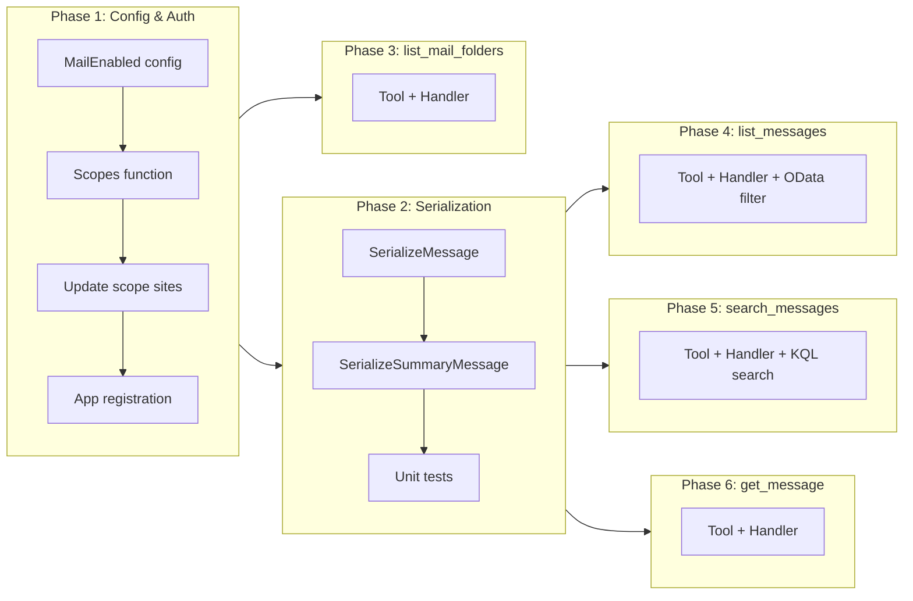

# Mail Read & Event-Email Correlation

## Change Summary

Add read-only email access via Microsoft Graph Mail API to enable finding email conversations related to calendar events. Introduces four new MCP tools (`list_mail_folders`, `list_messages`, `search_messages`, `get_message`) behind an opt-in feature flag, with a new `Mail.Read` OAuth scope requested only when the feature is enabled.

## Motivation and Background

Calendar events rarely exist in isolation. Before a meeting, there are email threads discussing the agenda, logistics, or pre-reads. After a meeting, there are follow-up emails with action items, notes, or decisions. Currently, the MCP server provides rich calendar access but no way to surface the email conversations that surround those events.

An LLM assistant with access to both calendar and email can:

- **Prepare for meetings**: "What emails have been exchanged about tomorrow's design review?" — search messages by the event subject and participants.
- **Recover context**: "What was discussed leading up to the Q1 planning session?" — find the email thread that preceded the calendar event.
- **Track follow-ups**: "Were there any follow-up emails after last week's sprint retro?" — search sent items for messages matching the event subject in the days following the event.
- **Correlate threads**: "Show me the full email conversation about the budget meeting" — find a message by subject, then retrieve all messages in the same `conversationId`.

The Microsoft Graph Mail API provides all the building blocks: KQL full-text search via `$search`, OData filtering by `conversationId`/`sender`/`receivedDateTime`, and individual message retrieval with full body content.

## Change Drivers

* **Incomplete context**: Calendar events without their surrounding email threads give the assistant an incomplete picture of what was discussed, decided, or requested.
* **Manual context gathering**: Users currently have to switch to Outlook, manually search for related emails, and paste content into the chat — a workflow the MCP server should automate.
* **Agentic workflows**: LLM agents performing meeting preparation, minutes summarization, or action-item tracking need access to both event metadata and related email content.
* **Conversation threading**: Microsoft Graph's `conversationId` field on messages enables grouping related emails into threads, which is essential for reconstructing multi-message discussions about a single event.

## Current State

### Calendar Tools

The MCP server provides 9 calendar tools (`list_events`, `get_event`, `search_events`, `create_event`, `update_event`, `delete_event`, `cancel_event`, `list_calendars`, `get_free_busy`) plus 3 account management tools and a status tool. Calendar events include fields like `subject`, `organizer`, `attendees`, `start`/`end` times, and `body` — all of which can be used as search criteria for related emails.

### Email Access

None. The server has no email reading capability. The OAuth scope `Mail.Read` is not requested, and no mail-related tools exist.

### Authentication & Scopes

The `calendarScope` constant (`Calendars.ReadWrite`) in `internal/auth/auth.go` is the sole OAuth scope. It is passed to the credential during authentication and to `NewGraphServiceClientWithCredentials` during Graph client initialization. The app registration (`infra/app-registration.json`) declares `Calendars.ReadWrite` and `User.Read` as required resource access.

### Graph SDK Support

The `msgraph-sdk-go` provides full request builders for the Mail API:
- `Me().Messages().Get()` with `$filter`, `$search`, `$select`, `$orderby`, `$top`
- `Me().Messages().ByMessageId().Get()` with `$select`, `$expand`
- `Me().MailFolders().Get()` with `$select`, `$top`
- `Me().MailFolders().ByMailFolderId().Messages().Get()` with full OData query support
- Page iteration via `msgraphcore.NewPageIterator[models.Messageable]`

## Proposed Change

### 1. Opt-In Feature Flag

Add a `MailEnabled` boolean configuration field, controlled by `OUTLOOK_MCP_MAIL_ENABLED` (default: `false`). When disabled, no mail tools are registered, `Mail.Read` is not requested during authentication, and the mail feature has zero impact on the existing calendar-only workflow.

This opt-in approach is deliberate: `Mail.Read` is a significant permission that grants access to the user's entire mailbox. Users must explicitly enable it.

### 2. Conditional OAuth Scope

When `MailEnabled` is `true`, add `Mail.Read` to the scopes array passed during authentication and Graph client initialization. The existing `calendarScope` constant remains unchanged; a new `mailScope` constant (`Mail.Read`) is added alongside it. A new `Scopes(cfg)` function builds the scopes slice based on configuration.

The app registration (`infra/app-registration.json`) is updated to declare `Mail.Read` as an additional required resource access entry, so admin consent flows (when applicable) include the mail permission.

### 3. Mail Tools

Four new read-only MCP tools, following the same patterns as existing calendar tools (context-based Graph client, retry config, timeout, middleware chain, summary/raw output modes):

#### `list_mail_folders`

Lists the user's mail folders (Inbox, Sent Items, Drafts, etc.) with display name, unread count, and total count. Lightweight discovery tool.

**Endpoint**: `GET /me/mailFolders`
**Parameters**: `account` (optional), `max_results` (optional, default 25)

#### `list_messages`

Lists messages in a specific mail folder or across all folders, with OData `$filter` support for date ranges and conversation threading. This is the primary tool for retrieving conversation threads by `conversationId`.

**Endpoint**: `GET /me/messages` or `GET /me/mailFolders/{id}/messages`
**Parameters**: `folder_id` (optional), `start_datetime` (optional), `end_datetime` (optional), `from` (optional), `conversation_id` (optional), `max_results` (optional, default 25, max 100), `timezone` (optional), `account` (optional), `output` (optional)

#### `search_messages`

Full-text search across messages using Microsoft Graph's KQL `$search` syntax. This is the primary tool for finding emails related to a calendar event by subject, participants, or content.

**Endpoint**: `GET /me/messages?$search="..."`
**Parameters**: `query` (required — KQL search string, e.g., `subject:"Design Review" from:alice@contoso.com`), `folder_id` (optional — restrict search to a specific folder), `max_results` (optional, default 25, max 100), `account` (optional), `output` (optional)

The tool description will include KQL syntax guidance so the LLM can construct effective queries:
- `subject:"exact phrase"` — match subject
- `from:user@domain.com` — match sender
- `to:user@domain.com` — match recipient
- `participants:user@domain.com` — match any sender/recipient
- `received>=2026-03-01` — date range
- `hasAttachments:true` — filter by attachments
- Combine with AND/OR: `subject:"Sprint" AND from:alice@contoso.com`

#### `get_message`

Retrieves full details of a single message by ID, including the complete body content (HTML and/or text), all recipients, internet message headers, and attachment metadata.

**Endpoint**: `GET /me/messages/{id}`
**Parameters**: `message_id` (required), `account` (optional), `output` (optional)

### 4. Message Serialization

New serialization functions in `internal/graph/` following the same pattern as `SerializeEvent`:

- `SerializeMessage(msg models.Messageable) map[string]any` — full message fields for `get_message`
- `SerializeSummaryMessage(msg models.Messageable) map[string]any` — summary fields for `list_messages` and `search_messages`
- `ToSummaryMessageMap(full map[string]any) map[string]any` — convert full to summary (same pattern as `ToSummaryEventMap`)

**Summary fields**: `id`, `subject`, `bodyPreview`, `from`, `toRecipients`, `receivedDateTime`, `importance`, `isRead`, `hasAttachments`, `conversationId`, `webLink`, `categories`, `flag`

**Full fields** (in addition to summary): `body`, `ccRecipients`, `bccRecipients`, `sentDateTime`, `conversationIndex`, `internetMessageId`, `parentFolderId`, `replyTo`, `internetMessageHeaders`

### 5. Event-Email Correlation Workflow

No specialized correlation tool is needed. The LLM naturally composes existing calendar and mail tools:

1. `get_event` or `list_events` → obtain event subject, organizer, attendees, time range
2. `search_messages` with KQL → `subject:"<event subject>" participants:<organizer email>`
3. `list_messages` with `conversation_id` filter → retrieve the full thread
4. `get_message` → read specific messages in detail

This compositional approach is more flexible than a hardcoded correlation tool and handles edge cases (partial subject matches, forwarded threads, pre-meeting vs. post-meeting emails) that the LLM can reason about.

## Requirements

### Functional Requirements

1. A new `MailEnabled` boolean configuration field **MUST** be added, controlled by `OUTLOOK_MCP_MAIL_ENABLED` environment variable, defaulting to `false`.
2. When `MailEnabled` is `false`, no mail tools **MUST** be registered and `Mail.Read` **MUST NOT** be requested as an OAuth scope.
3. When `MailEnabled` is `true`, the OAuth scope `Mail.Read` **MUST** be included in the scopes array for authentication and Graph client initialization.
4. The `list_mail_folders` tool **MUST** return folder display name, ID, unread item count, and total item count.
5. The `list_messages` tool **MUST** support filtering by `folder_id`, `start_datetime`, `end_datetime`, `from`, and `conversation_id`.
6. The `list_messages` tool **MUST** use OData `$filter` for server-side filtering of date range (`receivedDateTime`), sender (`from/emailAddress/address`), and conversation ID (`conversationId`).
7. The `search_messages` tool **MUST** use Microsoft Graph's `$search` parameter with KQL syntax for full-text search.
8. The `search_messages` tool **MUST** accept an optional `folder_id` parameter to restrict search scope to a specific mail folder.
9. The `get_message` tool **MUST** return the complete message body (HTML content), all recipient fields, internet message headers, and attachment metadata.
10. All mail tools **MUST** support the `account` parameter for multi-account scenarios, using the same `AccountResolver` middleware as calendar tools.
11. The `list_messages`, `search_messages`, and `get_message` tools **MUST** support the `output` parameter with `summary` (default) and `raw` modes, following the same pattern as calendar tools. The `list_mail_folders` tool does not require `output` because it returns only folder metadata.
12. All mail tools **MUST** be annotated as read-only (`ReadOnlyHintAnnotation(true)`).
13. The `list_messages` and `search_messages` tools **MUST** support pagination with `max_results` (default 25, max 100).
14. Message serialization **MUST** include `conversationId` in both summary and full output to enable conversation threading.
15. The app registration (`infra/app-registration.json`) **MUST** be updated to include `Mail.Read` as a required delegated permission.

### Non-Functional Requirements

1. The `Mail.Read` scope **MUST** only be requested when `MailEnabled` is `true` — existing calendar-only users **MUST NOT** be prompted for mail consent.
2. All new tools **MUST** use the existing retry, timeout, audit, and observability middleware chains.
3. All new and modified code **MUST** include Go doc comments per project documentation standards.
4. All existing tests **MUST** continue to pass after the changes.
5. Message body content **MUST** be sanitized by the existing log sanitization system (PII masking) when included in log output.
6. The `search_messages` tool description **MUST** include KQL syntax guidance to enable the LLM to construct effective queries without external documentation.

## Affected Components

| Component | Change |
|-----------|--------|
| `internal/config/config.go` | Add `MailEnabled` field, load from `OUTLOOK_MCP_MAIL_ENABLED` with default `false` |
| `internal/auth/auth.go` | Add `mailScope` constant, add `Scopes(cfg)` function that returns `[]string` based on `MailEnabled` |
| `internal/auth/auth.go` | Update `calendarScope` usage sites to use `Scopes(cfg)` |
| `cmd/outlook-local-mcp/main.go` | Pass `Scopes(cfg)` to credential and Graph client initialization |
| `internal/tools/add_account.go` | Pass `Scopes(cfg)` to Graph client initialization and auth code URL/exchange |
| `internal/tools/complete_auth.go` | Pass `Scopes(cfg)` to `ExchangeCode` call |
| `internal/auth/middleware.go` | Pass scopes from config to `AuthCodeURL` and `ExchangeCode` calls |
| `internal/auth/restore.go` | Pass scopes to `NewGraphServiceClientWithCredentials` and startup token probe |
| `internal/graph/mail_serialize.go` (new) | `SerializeMessage`, `SerializeSummaryMessage`, `ToSummaryMessageMap` |
| `internal/graph/mail_serialize_test.go` (new) | Unit tests for message serialization |
| `internal/tools/list_mail_folders.go` (new) | `NewListMailFoldersTool`, `NewHandleListMailFolders` |
| `internal/tools/list_mail_folders_test.go` (new) | Unit tests for list_mail_folders |
| `internal/tools/list_messages.go` (new) | `NewListMessagesTool`, `NewHandleListMessages` |
| `internal/tools/list_messages_test.go` (new) | Unit tests for list_messages |
| `internal/tools/search_messages.go` (new) | `NewSearchMessagesTool`, `NewHandleSearchMessages` |
| `internal/tools/search_messages_test.go` (new) | Unit tests for search_messages |
| `internal/tools/get_message.go` (new) | `NewGetMessageTool`, `NewHandleGetMessage` |
| `internal/tools/get_message_test.go` (new) | Unit tests for get_message |
| `internal/server/server.go` | Conditionally register mail tools when `cfg.MailEnabled` is `true` |
| `infra/app-registration.json` | Add `Mail.Read` delegated permission |

## Scope Boundaries

### In Scope

* `MailEnabled` opt-in feature flag with `false` default
* Conditional `Mail.Read` OAuth scope when mail is enabled
* `list_mail_folders` tool for folder discovery
* `list_messages` tool with OData `$filter` support (date range, sender, conversation ID, folder)
* `search_messages` tool with KQL `$search` support and KQL syntax guidance in description
* `get_message` tool with full body, headers, and attachment metadata
* Message serialization with summary and full output modes
* App registration update for `Mail.Read` permission
* Unit tests for all new logic

### Out of Scope ("Here, But Not Further")

* **Send/reply/forward**: This CR is read-only. No `Mail.Send`, `Mail.ReadWrite`, or any write operations on messages.
* **Attachment download**: The `get_message` response includes attachment metadata (name, size, content type) but not attachment content. Downloading attachment bytes would require a separate tool and potentially large data transfer.
* **Mail search result ranking/relevance scoring**: The Graph API's `$search` handles relevance ranking internally. No client-side re-ranking is implemented.
* **Specialized event-email correlation tool**: The LLM composes `search_messages` with calendar tools naturally. A hardcoded correlation tool would be less flexible and harder to maintain.
* **Mail folder create/update/delete**: Only listing folders is in scope.
* **Message flags/categories modification**: Read-only access only.
* **Delta sync / incremental message retrieval**: Full fetch per request; delta sync is a future optimization.
* **Shared mailbox / delegated mailbox access**: Only the authenticated user's mailbox (`/me/messages`).
* **Mail provenance tagging**: No extended properties on messages. This CR is read-only.

## Impact Assessment

### User Impact

Users who enable mail access can ask the LLM to find emails related to their calendar events. The feature is entirely opt-in — users who don't set `OUTLOOK_MCP_MAIL_ENABLED=true` see no change in behavior, no additional consent prompts, and no new tools.

### Technical Impact

Moderate. Four new tool files follow established patterns. The auth scope change is conditional. The Graph client already supports the Mail API endpoints — no new SDK dependencies. The main risk is the auth scope change requiring re-consent for existing users who enable mail.

### Security Impact

`Mail.Read` grants read access to the user's entire mailbox. This is a significant permission:
- **Mitigated by opt-in**: Default `false` means no user gets mail access without explicit configuration.
- **Mitigated by read-only**: No `Mail.Send` or `Mail.ReadWrite` — the server cannot send, modify, or delete emails.
- **Mitigated by existing PII sanitization**: Message body content in logs is sanitized by the existing `SanitizingHandler`.
- **Mitigated by audit logging**: All mail tool invocations are captured in the audit log.

### Business Impact

Significantly enhances the assistant's ability to prepare for meetings and provide context about calendar events. This is a key differentiator for agentic calendar management.

## Implementation Approach

### Phase 1: Configuration & Auth Scopes

1. Add `MailEnabled` field to `Config` struct in `internal/config/config.go`.
2. Add `mailScope` constant (`Mail.Read`) in `internal/auth/auth.go`.
3. Add `Scopes(cfg config.Config) []string` function that returns `[]string{"Calendars.ReadWrite"}` when `MailEnabled` is `false`, and `[]string{"Calendars.ReadWrite", "Mail.Read"}` when `true`.
4. Update all sites that pass scopes (credential authentication, Graph client init, auth code URL, token exchange, account restoration, startup token probe) to use `Scopes(cfg)` instead of hardcoded `[]string{"Calendars.ReadWrite"}`.
5. Update `infra/app-registration.json` to include `Mail.Read` (`570282fd-fa5c-430d-a7fd-fc8dc98a9dca`).

### Phase 2: Message Serialization

Create `internal/graph/mail_serialize.go`:
- `SerializeMessage(msg models.Messageable) map[string]any` — full fields
- `SerializeSummaryMessage(msg models.Messageable) map[string]any` — summary fields
- `ToSummaryMessageMap(full map[string]any) map[string]any` — full-to-summary conversion
- Helper functions for serializing `Recipientable`, `EmailAddressable`

Unit tests in `internal/graph/mail_serialize_test.go`.

### Phase 3: list_mail_folders Tool

Create `internal/tools/list_mail_folders.go`:
- `NewListMailFoldersTool()` — tool definition
- `NewHandleListMailFolders(retryCfg, timeout)` — handler using `Me().MailFolders().Get()`

Register in `server.go` inside a `if cfg.MailEnabled { ... }` block.

### Phase 4: list_messages Tool

Create `internal/tools/list_messages.go`:
- `NewListMessagesTool()` — tool definition with `folder_id`, `start_datetime`, `end_datetime`, `from`, `conversation_id`, `max_results`, `timezone`, `account`, `output` parameters
- `NewHandleListMessages(retryCfg, timeout)` — handler using `Me().Messages().Get()` or `Me().MailFolders().ByMailFolderId().Messages().Get()` with OData `$filter`

OData filter construction:
- `receivedDateTime ge <start> and receivedDateTime le <end>` for date range
- `from/emailAddress/address eq '<email>'` for sender
- `conversationId eq '<id>'` for conversation threading

### Phase 5: search_messages Tool

Create `internal/tools/search_messages.go`:
- `NewSearchMessagesTool()` — tool definition with `query` (required), `folder_id`, `max_results`, `account`, `output` parameters. Tool description includes KQL syntax reference.
- `NewHandleSearchMessages(retryCfg, timeout)` — handler using `Me().Messages().Get()` with `$search` parameter, or `Me().MailFolders().ByMailFolderId().Messages().Get()` when `folder_id` is specified.

**Important Graph API constraint**: `$search` and `$filter` cannot be combined on the messages endpoint. When `$search` is used, `$orderby` is also restricted (results are ranked by relevance). The tool description must document this.

### Phase 6: get_message Tool

Create `internal/tools/get_message.go`:
- `NewGetMessageTool()` — tool definition with `message_id` (required), `account`, `output` parameters
- `NewHandleGetMessage(retryCfg, timeout)` — handler using `Me().Messages().ByMessageId().Get()` with full `$select`

### Implementation Flow



## Test Strategy

### Tests to Add

| Test File | Test Name | Description |
|-----------|-----------|-------------|
| `config_test.go` | `TestLoadConfig_MailEnabledDefault` | Default is `false` |
| `config_test.go` | `TestLoadConfig_MailEnabledTrue` | Set to `true` via env var |
| `auth_test.go` | `TestScopes_CalendarOnly` | Returns `["Calendars.ReadWrite"]` when mail disabled |
| `auth_test.go` | `TestScopes_WithMail` | Returns `["Calendars.ReadWrite", "Mail.Read"]` when mail enabled |
| `mail_serialize_test.go` | `TestSerializeMessage_Full` | Full message serialization with all fields |
| `mail_serialize_test.go` | `TestSerializeMessage_NilFields` | Handles nil pointers safely |
| `mail_serialize_test.go` | `TestSerializeSummaryMessage` | Summary output excludes body, headers |
| `mail_serialize_test.go` | `TestToSummaryMessageMap` | Full-to-summary conversion |
| `mail_serialize_test.go` | `TestSerializeRecipients` | Serializes recipient lists correctly |
| `list_mail_folders_test.go` | `TestListMailFolders_Success` | Returns folder list with expected fields |
| `list_mail_folders_test.go` | `TestListMailFolders_NoClient` | Returns error when no Graph client in context |
| `list_messages_test.go` | `TestListMessages_DefaultFolder` | Lists from all messages when no folder_id |
| `list_messages_test.go` | `TestListMessages_SpecificFolder` | Lists from specified folder |
| `list_messages_test.go` | `TestListMessages_DateRangeFilter` | OData filter includes receivedDateTime |
| `list_messages_test.go` | `TestListMessages_ConversationIdFilter` | OData filter includes conversationId |
| `list_messages_test.go` | `TestListMessages_FromFilter` | OData filter includes from/emailAddress/address |
| `list_messages_test.go` | `TestListMessages_CombinedFilters` | Multiple filters ANDed together |
| `search_messages_test.go` | `TestSearchMessages_BasicQuery` | $search parameter set correctly |
| `search_messages_test.go` | `TestSearchMessages_WithFolderId` | Uses folder-scoped endpoint |
| `search_messages_test.go` | `TestSearchMessages_MaxResults` | Respects max_results limit |
| `search_messages_test.go` | `TestSearchMessages_NoQuery` | Returns error when query is empty |
| `get_message_test.go` | `TestGetMessage_Success` | Returns full message with body and headers |
| `get_message_test.go` | `TestGetMessage_NoMessageId` | Returns error when message_id missing |
| `get_message_test.go` | `TestGetMessage_NotFound` | Returns error for non-existent message |
| `server_test.go` | `TestRegisterTools_MailDisabled` | Mail tools not registered when MailEnabled=false |
| `server_test.go` | `TestRegisterTools_MailEnabled` | Mail tools registered when MailEnabled=true |
| `server_test.go` | `TestRegisterTools_MailToolsReadOnly` | All mail tools have ReadOnlyHintAnnotation set to true |
| `list_messages_test.go` | `TestListMessages_MaxResultsClamped` | max_results exceeding 100 is clamped to 100 |
| `search_messages_test.go` | `TestSearchMessages_MaxResultsClamped` | max_results exceeding 100 is clamped to 100 |

### Tests to Modify

| Test File | Test Name | Change |
|-----------|-----------|--------|
| `server_test.go` | Existing tool count assertions | Update expected tool count when mail is enabled vs disabled |

### Tests to Remove

Not applicable.

## Acceptance Criteria

### AC-1: Mail disabled by default

```gherkin
Given the MCP server is started without OUTLOOK_MCP_MAIL_ENABLED set
When the tool list is retrieved
Then no mail tools (list_mail_folders, list_messages, search_messages, get_message) MUST be present
  And the OAuth scopes MUST NOT include Mail.Read
```

### AC-2: Mail enabled via configuration

```gherkin
Given OUTLOOK_MCP_MAIL_ENABLED is set to "true"
When the MCP server starts and authenticates
Then the OAuth scopes MUST include "Mail.Read"
  And the tools list_mail_folders, list_messages, search_messages, and get_message MUST be registered
```

### AC-3: List mail folders

```gherkin
Given the MCP server is running with mail enabled and authenticated
When list_mail_folders is called
Then the response MUST contain a JSON array of folders
  And each folder MUST include id, displayName, unreadItemCount, and totalItemCount
```

### AC-4: Search messages by subject

```gherkin
Given the user has emails with subject containing "Design Review"
When search_messages is called with query 'subject:"Design Review"'
Then the response MUST contain matching messages
  And each message MUST include id, subject, bodyPreview, from, toRecipients, receivedDateTime, conversationId
```

### AC-5: Search messages by participant

```gherkin
Given the user has emails from alice@contoso.com
When search_messages is called with query "from:alice@contoso.com"
Then the response MUST contain messages sent by alice@contoso.com
```

### AC-6: List messages by conversation ID

```gherkin
Given a message with conversationId "AAQkAGI2..." exists
When list_messages is called with conversation_id="AAQkAGI2..."
Then the response MUST contain all messages in that conversation thread
  And messages MUST be ordered by receivedDateTime ascending
```

### AC-7: List messages with date range

```gherkin
Given messages exist within and outside a date range
When list_messages is called with start_datetime and end_datetime
Then only messages with receivedDateTime within the range MUST be returned
```

### AC-8: Get full message content

```gherkin
Given a message exists with ID "abc123"
When get_message is called with message_id="abc123"
Then the response MUST contain the full message body (HTML content)
  And the response MUST contain internetMessageHeaders
  And the response MUST contain all recipient fields (to, cc, bcc)
  And the response MUST contain attachment metadata
```

### AC-9: List messages in specific folder

```gherkin
Given the user has messages in a folder with a known ID
When list_messages is called with folder_id set to that folder's ID
Then only messages from that folder MUST be returned
```

### AC-10: Search restricted to folder

```gherkin
Given messages exist across multiple folders
When search_messages is called with query and folder_id
Then only messages matching the query within the specified folder MUST be returned
```

### AC-11: Multi-account support

```gherkin
Given multiple accounts are configured with mail enabled
When search_messages is called with account="work"
Then the search MUST be performed against the "work" account's mailbox
```

### AC-12: Output modes

```gherkin
Given messages exist matching a search query
When search_messages is called with output="raw"
Then the response MUST contain full serialized message fields
When search_messages is called with output="summary" (or omitted)
Then the response MUST contain only summary fields
```

### AC-13: Event-email correlation workflow

```gherkin
Given a calendar event "Q1 Planning" with organizer alice@contoso.com exists
  And emails with subject containing "Q1 Planning" from alice@contoso.com exist
When get_event is called to obtain the event details
  And search_messages is called with query 'subject:"Q1 Planning" from:alice@contoso.com'
Then the search MUST return the related email messages
  And each message MUST include conversationId for thread retrieval
```

### AC-14: Read-only annotation on all mail tools

```gherkin
Given mail is enabled
When any mail tool (list_mail_folders, list_messages, search_messages, get_message) is registered
Then each tool MUST have ReadOnlyHintAnnotation set to true
```

### AC-15: Pagination with max_results

```gherkin
Given messages exist in the mailbox
When list_messages is called with max_results=5
Then at most 5 messages are returned
When search_messages is called with max_results=10
Then at most 10 messages are returned
When list_messages or search_messages is called with max_results exceeding 100
Then the value MUST be clamped to 100
```

### AC-16: App registration includes Mail.Read

```gherkin
Given the app registration file infra/app-registration.json
Then it MUST include Mail.Read (570282fd-fa5c-430d-a7fd-fc8dc98a9dca) as a required delegated permission
```

### AC-17: Existing calendar functionality unaffected

```gherkin
Given the MCP server is running with OUTLOOK_MCP_MAIL_ENABLED unset (default false)
When any calendar tool (list_events, get_event, search_events, etc.) is called
Then it MUST behave identically to before this change
  And no mail-related scopes or tools MUST be present
```

## Quality Standards Compliance

### Build & Compilation

- [x] Code compiles/builds without errors
- [ ] No new compiler warnings introduced

### Linting & Code Style

- [x] All linter checks pass with zero warnings/errors
- [ ] Code follows project coding conventions and style guides
- [ ] Any linter exceptions are documented with justification

### Test Execution

- [x] All existing tests pass after implementation
- [x] All new tests pass
- [ ] Test coverage meets project requirements for changed code

### Documentation

- [x] Inline code documentation updated where applicable
- [x] User-facing documentation updated if behavior changes

### Code Review

- [ ] Changes submitted via pull request
- [ ] PR title follows Conventional Commits format
- [ ] Code review completed and approved
- [ ] Changes squash-merged to maintain linear history

### Verification Commands

```bash
# Build verification
go build ./...

# Lint verification
golangci-lint run

# Test execution
go test ./... -v

# Full CI check
make ci
```

## Risks and Mitigation

### Risk 1: Permission escalation concern

**Likelihood:** medium
**Impact:** high
**Mitigation:** `Mail.Read` is opt-in via `OUTLOOK_MCP_MAIL_ENABLED=true` with a `false` default. The app registration declares the permission, but the runtime only requests it when the feature is enabled. The tool description and documentation clearly state what the permission grants. Read-only access only — no `Mail.Send` or `Mail.ReadWrite`.

### Risk 2: Re-consent required for existing users

**Likelihood:** high (for users enabling mail)
**Impact:** low
**Mitigation:** When a user enables mail, the next authentication will request the `Mail.Read` scope, triggering an incremental consent prompt. This is expected behavior and documented. Existing calendar-only users are not affected.

### Risk 3: KQL $search and $filter incompatibility

**Likelihood:** certain (known Graph API constraint)
**Impact:** low
**Mitigation:** The `search_messages` tool uses `$search` only (no `$filter`). The `list_messages` tool uses `$filter` only (no `$search`). The tool descriptions clearly document this separation. The LLM can compose both tools for complex queries.

### Risk 4: Large message bodies in responses

**Likelihood:** medium
**Impact:** medium
**Mitigation:** `get_message` returns full body only when explicitly called for a specific message ID. `list_messages` and `search_messages` return `bodyPreview` (up to 255 characters) in summary mode. The LLM should be guided to use summary mode for listing and only retrieve full bodies when needed.

### Risk 5: $search returning relevance-ranked (not chronological) results

**Likelihood:** certain (by design)
**Impact:** low
**Mitigation:** The Graph API's `$search` returns results ranked by relevance, not `receivedDateTime`. The `$orderby` parameter is ignored when `$search` is used. This is documented in the tool description. For chronological listing, users should use `list_messages` with `$filter` instead.

### Risk 6: Rate limiting from mail + calendar combined usage

**Likelihood:** low
**Impact:** low
**Mitigation:** Mail tools use the same retry and timeout middleware as calendar tools. Microsoft Graph applies per-user rate limits across all endpoints. The existing exponential backoff and retry logic handles 429 responses.

## Dependencies

* CR-0006 (Read-Only Tools) — tool patterns, serialization, middleware chain
* CR-0003 (Authentication) — auth scope management
* CR-0025 (Multi-Account) — AccountResolver middleware, account parameter pattern
* CR-0033 (MCP Response Filtering) — output mode (summary/raw) pattern

## Estimated Effort

| Phase | Description | Estimate |
|-------|-------------|----------|
| Phase 1 | Configuration, auth scopes, app registration | 2 hours |
| Phase 2 | Message serialization + tests | 2 hours |
| Phase 3 | list_mail_folders tool + tests | 1 hour |
| Phase 4 | list_messages tool + OData filter + tests | 3 hours |
| Phase 5 | search_messages tool + KQL + tests | 2 hours |
| Phase 6 | get_message tool + tests | 1.5 hours |
| **Total** | | **11.5 hours** |

## Decision Outcome

Chosen approach: **Four composable mail tools with opt-in feature flag**, because:

1. **Composability over specialization**: Four focused tools (list folders, list messages, search messages, get message) can be composed by the LLM to handle any email-event correlation scenario. A single "find related emails" tool would be rigid and unable to handle edge cases.
2. **Opt-in over default-on**: `Mail.Read` is a significant permission. Requiring explicit opt-in respects user privacy and avoids unexpected consent prompts for calendar-only users.
3. **Read-only scope**: `Mail.Read` (not `Mail.ReadWrite`) ensures the server cannot modify or send emails, minimizing the security surface.
4. **KQL for search, OData for filtering**: Using `$search` for free-text discovery and `$filter` for structured queries (date range, conversation ID, sender) aligns with the Graph API's design constraints and maximizes query effectiveness.

Alternatives considered:
- **Single `find_event_emails` tool**: Would hardcode a correlation algorithm (match on subject + participants + time window). Less flexible — can't handle partial matches, forwarded threads, or pre-meeting emails with different subjects. The LLM is better at reasoning about which queries to run.
- **Default-on mail access**: Rejected due to the sensitivity of `Mail.Read`. Users must opt in.
- **Mail.ReadBasic scope**: Only provides metadata (no body content). Insufficient for the use case — users need to read email content to understand meeting context.
- **Delta sync for message caching**: Over-engineering for the initial implementation. Direct API queries are sufficient for the compositional workflow.

## Related Items

* CR-0006 — Read-Only Tools (tool patterns and middleware chain reused)
* CR-0003 — Authentication (auth scope management extended)
* CR-0025 — Multi-Account Elicitation (account parameter pattern reused)
* CR-0033 — MCP Response Filtering (summary/raw output mode reused)
* CR-0040 — MCP Event Provenance Tagging (extended property pattern for reference)

<!--
## CR Review Summary (2026-03-20)

**Findings: 8 | Fixes applied: 8 | Unresolvable: 0**

### Contradictions resolved (1)
1. FR-11 stated "All mail tools MUST support the output parameter" but the Proposed Change
   section defines list_mail_folders without an output parameter. Resolved in favor of the
   Implementation Approach: FR-11 now scopes the output requirement to list_messages,
   search_messages, and get_message only, with an explicit note that list_mail_folders
   returns only folder metadata and does not require output modes.

### Missing AC coverage added (3)
2. FR-12 (read-only annotations) had no AC. Added AC-14: Read-only annotation on all mail tools.
3. FR-13 (pagination max_results) had no AC. Added AC-15: Pagination with max_results, including
   clamping behavior for values exceeding 100.
4. FR-15 (app registration update) had no AC. Added AC-16: App registration includes Mail.Read.
   Former AC-14 renumbered to AC-17.

### Missing test coverage added (3)
5. AC-14 (read-only annotations): added TestRegisterTools_MailToolsReadOnly.
6. AC-15 (pagination clamping): added TestListMessages_MaxResultsClamped and
   TestSearchMessages_MaxResultsClamped.

### Ambiguity fixes (14 ACs)
7. All Gherkin Then-clauses in AC-1 through AC-17 updated to use MUST/MUST NOT instead of
   bare declarative statements. AC-8 also added missing "attachment metadata" assertion to
   fully match FR-9. AC-6 clarified sort order as "ascending". AC-13 removed reference to
   "the LLM" as the actor in When-clauses.

### Scope consistency fixes (1)
8. Affected Components table was missing three files with hardcoded scope references:
   internal/auth/middleware.go, internal/auth/restore.go, internal/tools/complete_auth.go.
   Added all three with descriptions of required changes.

### Diagram fix (1)
   Removed spurious Phase3 -> Phase4 dependency (list_mail_folders does not depend on
   list_messages). Changed Phase2 -> Phase3 to Phase1 -> Phase3 since list_mail_folders
   depends on config/auth (Phase 1) but not message serialization (Phase 2).
-->
