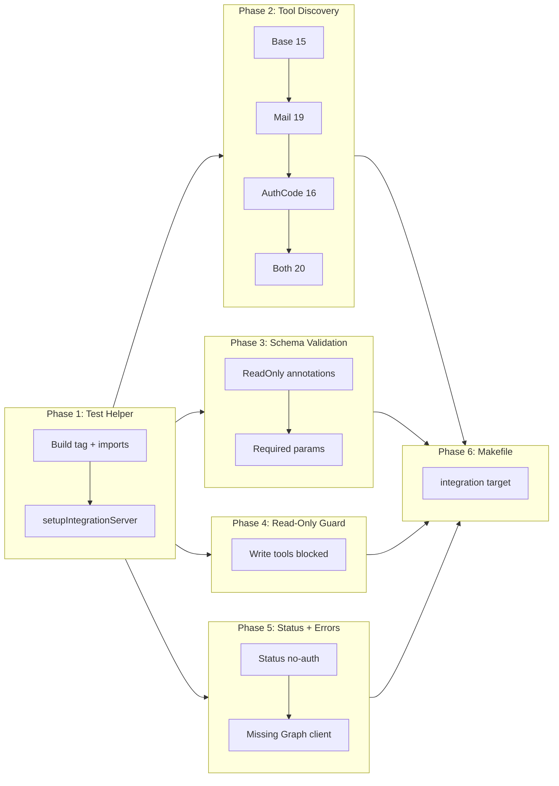

# MCP Protocol Integration Tests

## Change Summary

Add a new layer of Go-native integration tests that exercise the MCP server at the protocol level using `mcp-go`'s `client.NewInProcessClient`. Unlike existing unit tests (which test individual tool handlers with mocked Graph clients), these tests validate the full MCP protocol stack: tool discovery via `tools/list`, schema correctness, middleware chain execution, error propagation, read-only mode blocking, conditional tool registration (mail, auth_code), and multi-account resolution. No real Graph API calls are made -- auth middleware is bypassed and mock Graph clients are injected via context.

## Motivation and Background

The project currently has two layers of testing:

1. **Unit tests per tool** (`internal/tools/*_test.go`): Each tool handler is tested with a mock Graph HTTP server via `newTestGraphClient`. These validate individual handler logic, parameter parsing, and Graph API request construction.
2. **Server registration tests** (`internal/server/server_test.go`): These verify tool registration, read-only guard behavior, and account management through raw `HandleMessage` JSON-RPC calls.

Neither layer validates the full MCP protocol lifecycle as a real client would experience it. Specifically:

- **Tool discovery**: `tools/list` returns the correct number of tools with expected names, descriptions, parameter schemas, and annotations. Today this is only partially tested via `s.ListTools()` (an internal API), not through the MCP protocol `tools/list` method.
- **Schema correctness**: Required parameters, parameter types, enum constraints, and annotation values (`ReadOnlyHint`, `DestructiveHint`, `IdempotentHint`) are not validated end-to-end.
- **Middleware chain**: The full chain (auth -> accountResolver -> observability -> ReadOnlyGuard -> audit -> handler) is exercised per-tool in registration tests via raw JSON, but never through a proper MCP client that handles protocol negotiation, initialization, and typed responses.
- **Error propagation**: How tool errors, missing Graph clients, and validation failures propagate through the protocol to the client is not tested at the MCP response level.
- **Conditional registration**: Mail tools and `complete_auth` are tested for presence/absence, but not through `tools/list` protocol responses that a real client would receive.

The `mcp-go` library (already a dependency at `v0.45.0`) provides `client.NewInProcessClient(server)` which creates an in-memory MCP client that calls directly into the server -- no stdio pipes, no serialization overhead, no network. This enables fast, deterministic integration tests that validate the protocol contract between client and server.

## Change Drivers

* **Protocol contract gap**: Unit tests validate handler behavior; server tests validate registration. Neither validates the MCP protocol contract (initialize -> tools/list -> tools/call -> response) as a client experiences it.
* **Schema drift risk**: Tool parameter schemas are defined in code and not validated against a specification. A typo in a parameter name or a missing `Required` annotation would be invisible to existing tests.
* **Middleware integration risk**: The middleware chain has grown to 5 layers. Subtle ordering bugs or missing middleware in the chain would only be caught by end-to-end protocol tests.
* **Regression prevention**: As new tools are added (CR-0042, CR-0043), integration tests provide a safety net that the overall tool catalog remains correct.
* **Confidence for refactoring**: Protocol-level tests enable safe refactoring of `RegisterTools`, middleware, and tool definitions by validating the external contract.

## Current State

### Existing Test Infrastructure

`internal/tools/test_helpers_test.go` provides `newTestGraphClient(t, handler)` which creates a `GraphServiceClient` backed by an `httptest.Server` with URL rewriting. This is used by all tool handler tests.

`internal/server/server_test.go` provides `identityMW` (no-op auth middleware), `testRegistry()` (single default account), and `testConfig()`. Tests call `s.HandleMessage(ctx, json.RawMessage(msg))` directly with raw JSON-RPC strings and manually assert on the response types.

### mcp-go Test Utilities

The `mcp-go` library provides two approaches for in-process testing:

1. **`client.NewInProcessClient(server *server.MCPServer) (*Client, error)`**: Creates a client that communicates directly with the server via `transport.NewInProcessTransport`. The client must call `Initialize()` before use.

2. **`mcptest.NewServer(t, ...tools)`**: Creates a test server with its own `MCPServer`, starts it with stdio pipes, initializes a client, and registers `t.Cleanup` for teardown. This approach creates a fresh `MCPServer` internally, which means tools registered via `RegisterTools` on an external server instance cannot be tested through it.

For this CR, `client.NewInProcessClient` is the correct approach because we need to test the exact `MCPServer` instance configured by `RegisterTools`, with all middleware, conditional tools, and configuration applied.

### Tool Count

With the current codebase:
- **Base calendar tools**: 11 (list_calendars, list_events, get_event, create_event, update_event, search_events, get_free_busy, delete_event, cancel_event, respond_event, reschedule_event)
- **Account management**: 3 (add_account, list_accounts, remove_account)
- **Status**: 1 (status)
- **Mail tools** (when enabled): 4 (list_mail_folders, list_messages, search_messages, get_message)
- **Auth code** (when auth_code method): 1 (complete_auth)
- **Total base**: 15 | **With mail**: 19 | **With auth_code**: 16/20

## Proposed Change

### 1. Integration Test File

Create `internal/server/integration_test.go` with the build tag `//go:build integration` so these tests are excluded from the default `go test ./...` run. They require more setup (constructing the full server with all middleware) and validate integration-level behavior, not unit-level behavior.

The tests use `client.NewInProcessClient` to create an MCP client connected to the fully configured `MCPServer` and exercise the protocol lifecycle: `Initialize` -> `ListTools` -> `CallTool`.

### 2. Test Helper: Server Factory

A shared test helper function constructs the MCP server with `RegisterTools` and returns both the server and a connected, initialized `client.Client`:

```go
func setupIntegrationServer(t *testing.T, cfg config.Config, readOnly bool, cred auth.Authenticator) *client.Client {
    t.Helper()

    s := mcpserver.NewMCPServer("integration-test", "0.0.1",
        mcpserver.WithToolCapabilities(false),
        mcpserver.WithRecovery(),
    )

    meter := noop.NewMeterProvider().Meter("test")
    m, _ := observability.InitMetrics(meter)
    tracer := tracenoop.NewTracerProvider().Tracer("test")

    audit.InitAuditLog(false, "")

    registry := testRegistry()
    RegisterTools(s, graph.RetryConfig{}, 30*time.Second, m, tracer, readOnly, identityMW, registry, cfg, cred)

    c, err := client.NewInProcessClient(s)
    if err != nil {
        t.Fatalf("NewInProcessClient: %v", err)
    }
    t.Cleanup(func() { c.Close() })

    ctx := context.Background()
    initReq := mcp.InitializeRequest{}
    initReq.Params.ProtocolVersion = mcp.LATEST_PROTOCOL_VERSION
    initReq.Params.ClientInfo = mcp.Implementation{Name: "test-client", Version: "0.0.1"}
    if _, err := c.Initialize(ctx, initReq); err != nil {
        t.Fatalf("Initialize: %v", err)
    }
    return c
}
```

### 3. Test Categories

The integration tests cover five categories:

**A. Tool Discovery** -- Validate `tools/list` returns the correct tool count and names for each configuration variant (base, +mail, +auth_code, +both).

**B. Schema Validation** -- For each tool, verify that required parameters are marked as required, parameter types are correct, and annotations (`ReadOnlyHint`) are set.

**C. Read-Only Guard** -- Call every write tool via the MCP client with `readOnly=true` and verify the response is an `IsError=true` `CallToolResult` with "read-only mode" in the text.

**D. Status Tool (No Auth)** -- Call `status` via the MCP client (which bypasses auth middleware) and verify a valid JSON response with version and uptime fields.

**E. Error Propagation** -- Call a calendar tool (e.g., `list_calendars`) with no Graph client in context and verify the error propagates correctly through the protocol as a `CallToolResult` with `IsError=true`.

### 4. Build Tag and Makefile Target

The `//go:build integration` tag ensures `go test ./...` does not run these tests by default. A new Makefile target enables explicit execution:

```makefile
.PHONY: integration
integration:
	go test -tags=integration ./internal/server/ -v -run TestIntegration
```

## Requirements

### Functional Requirements

1. A new test file `internal/server/integration_test.go` **MUST** be created with the build tag `//go:build integration`.
2. The tests **MUST** use `client.NewInProcessClient` from `github.com/mark3labs/mcp-go/client` to create an in-process MCP client.
3. The client **MUST** call `Initialize` with `mcp.LATEST_PROTOCOL_VERSION` before any other operations.
4. A tool discovery test **MUST** call `ListTools` via the MCP client and verify the response contains exactly 15 tools when mail is disabled and auth method is not `auth_code`.
5. A tool discovery test **MUST** verify exactly 19 tools when `MailEnabled` is `true` (15 base + 4 mail).
6. A tool discovery test **MUST** verify exactly 16 tools when `AuthMethod` is `auth_code` (15 base + 1 complete_auth).
7. A tool discovery test **MUST** verify exactly 20 tools when both `MailEnabled` is `true` and `AuthMethod` is `auth_code`.
8. A schema validation test **MUST** verify that all read-only tools in the `ListTools` response have `ReadOnlyHint` set to `true` in their annotations.
9. A schema validation test **MUST** verify that write tools (`create_event`, `update_event`, `delete_event`, `cancel_event`, `respond_event`, `reschedule_event`) do NOT have `ReadOnlyHint` set to `true`.
10. A schema validation test **MUST** verify that `create_event` has `subject`, `start`, and `end` as required parameters in its input schema.
11. A schema validation test **MUST** verify that `get_event` has `event_id` as a required parameter.
12. A schema validation test **MUST** verify that `search_messages` has `query` as a required parameter.
13. A schema validation test **MUST** verify that `get_message` has `message_id` as a required parameter.
14. A read-only guard test **MUST** call each write tool (`create_event`, `update_event`, `delete_event`, `cancel_event`, `respond_event`, `reschedule_event`) through the MCP client with `readOnly=true` and verify `IsError=true` with "read-only mode" in the error text.
15. A status tool test **MUST** call `status` through the MCP client and verify the response contains `"version"` and `"uptime"` fields in the JSON output.
16. An error propagation test **MUST** call `list_calendars` through the MCP client (with no Graph client in context) and verify the response is a `CallToolResult` with `IsError=true`.
17. The Makefile **MUST** include an `integration` target that runs `go test -tags=integration ./internal/server/ -v -run TestIntegration`.
18. All mail-related schema tests **MUST** only run against a server configured with `MailEnabled=true`.
19. The GitHub Actions CI workflow (`.github/workflows/ci.yml`) **MUST** include a step or job that runs integration tests via `make integration`.
20. Integration tests **MUST** be runnable locally with `make integration` without any external credentials, network access, or environment variable configuration.

### Non-Functional Requirements

1. Integration tests **MUST NOT** make any real Graph API calls.
2. Integration tests **MUST** use the `//go:build integration` build tag to exclude them from the default `go test ./...` run.
3. Integration tests **MUST** complete within 10 seconds total (no network, no I/O).
4. All new test code **MUST** include Go doc comments per project documentation standards.
5. All existing tests **MUST** continue to pass after the changes.
6. The tests **MUST** not introduce any new Go module dependencies beyond what is already in `go.mod`.

## Affected Components

| Component | Change |
|-----------|--------|
| `internal/server/integration_test.go` (new) | Integration test file with `//go:build integration` tag, server factory helper, and all integration test functions |
| `Makefile` | Add `integration` target for running integration tests with the build tag |
| `.github/workflows/ci.yml` | Add integration test step to the CI job (runs `make integration`) |

## Scope Boundaries

### In Scope

* Integration test file with `//go:build integration` build tag
* `client.NewInProcessClient` usage for in-process protocol testing
* Tool discovery tests (tool count per configuration variant)
* Schema validation tests (required params, annotations)
* Read-only guard tests via MCP protocol
* Status tool test (no auth required)
* Error propagation test (missing Graph client)
* Makefile target for running integration tests

### Out of Scope ("Here, But Not Further")

* **Real Graph API calls**: All tests use mock infrastructure. No Graph credentials or network access.
* **`mcptest.NewServer` usage**: This creates its own internal `MCPServer`, which cannot be used to test our `RegisterTools` configuration. `client.NewInProcessClient` is used instead.
* **Handler logic validation**: Tool handler behavior (correct Graph API calls, response serialization) is covered by existing unit tests. Integration tests validate the protocol layer, not handler internals.
* **Elicitation testing**: The multi-account elicitation flow requires a client that supports `SamplingHandler`, which is beyond the scope of protocol-level tool tests.
* **Performance benchmarking**: Tests validate correctness, not performance.
* **Stdio-based external process testing**: Starting the compiled binary as a subprocess and testing over stdin/stdout. Appropriate for end-to-end smoke tests but out of scope for protocol integration tests.

## Impact Assessment

### User Impact

None. This CR adds tests only; no user-facing behavior changes.

### Technical Impact

Positive. Integration tests provide a safety net for the MCP protocol contract, enabling confident refactoring of `RegisterTools`, middleware chain, and tool definitions. The `//go:build integration` tag ensures no impact on the default test run time.

### Business Impact

Improved software quality and reduced regression risk. Integration tests catch protocol-level issues that unit tests miss, reducing the likelihood of shipping broken tool discovery or schema definitions.

## Implementation Approach

### Phase 1: Test Helper and Server Factory

Create `internal/server/integration_test.go` with the `//go:build integration` tag and the `setupIntegrationServer` helper function that:

1. Creates an `MCPServer` with `WithToolCapabilities(false)` and `WithRecovery()`.
2. Initializes noop metrics and tracer.
3. Calls `RegisterTools` with the provided config, readOnly flag, and credential.
4. Creates an in-process client via `client.NewInProcessClient(server)`.
5. Calls `client.Initialize()` to complete the MCP handshake.
6. Registers `t.Cleanup` for client teardown.

```go
//go:build integration

package server

import (
    "context"
    "testing"
    "time"

    "github.com/desek/outlook-local-mcp/internal/audit"
    "github.com/desek/outlook-local-mcp/internal/auth"
    "github.com/desek/outlook-local-mcp/internal/config"
    "github.com/desek/outlook-local-mcp/internal/graph"
    "github.com/desek/outlook-local-mcp/internal/observability"
    "github.com/mark3labs/mcp-go/client"
    "github.com/mark3labs/mcp-go/mcp"
    mcpserver "github.com/mark3labs/mcp-go/server"
    "go.opentelemetry.io/otel/metric/noop"
    tracenoop "go.opentelemetry.io/otel/trace/noop"
)

func setupIntegrationServer(t *testing.T, cfg config.Config, readOnly bool, cred auth.Authenticator) *client.Client {
    t.Helper()

    s := mcpserver.NewMCPServer("integration-test", "0.0.1",
        mcpserver.WithToolCapabilities(false),
        mcpserver.WithRecovery(),
    )

    meter := noop.NewMeterProvider().Meter("test")
    m, err := observability.InitMetrics(meter)
    if err != nil {
        t.Fatalf("InitMetrics: %v", err)
    }
    tracer := tracenoop.NewTracerProvider().Tracer("test")
    audit.InitAuditLog(false, "")

    registry := testRegistry()
    RegisterTools(s, graph.RetryConfig{}, 30*time.Second, m, tracer, readOnly, identityMW, registry, cfg, cred)

    c, err := client.NewInProcessClient(s)
    if err != nil {
        t.Fatalf("NewInProcessClient: %v", err)
    }
    t.Cleanup(func() { _ = c.Close() })

    ctx := context.Background()
    var initReq mcp.InitializeRequest
    initReq.Params.ProtocolVersion = mcp.LATEST_PROTOCOL_VERSION
    initReq.Params.ClientInfo = mcp.Implementation{Name: "test-client", Version: "0.0.1"}
    if _, err := c.Initialize(ctx, initReq); err != nil {
        t.Fatalf("Initialize: %v", err)
    }
    return c
}
```

### Phase 2: Tool Discovery Tests

Test `ListTools` response for each configuration variant:

```go
func TestIntegration_ToolDiscovery_BaseConfig(t *testing.T) {
    c := setupIntegrationServer(t, testConfig(), false, nil)
    result, err := c.ListTools(context.Background(), mcp.ListToolsRequest{})
    if err != nil {
        t.Fatalf("ListTools: %v", err)
    }
    if len(result.Tools) != 15 {
        t.Errorf("expected 15 tools, got %d", len(result.Tools))
    }
}
```

Extract tool names into a `map[string]mcp.Tool` for subsequent schema assertions.

### Phase 3: Schema Validation Tests

For each tool in the `ListTools` response, validate:

- `ReadOnlyHint` annotation on read tools (list_calendars, list_events, get_event, search_events, get_free_busy, list_accounts, status, and mail tools when enabled).
- `ReadOnlyHint` absent or false on write tools (create_event, update_event, delete_event, cancel_event, respond_event, reschedule_event).
- Required parameters in `InputSchema.Required` array for key tools.

```go
func TestIntegration_Schema_CreateEventRequiredParams(t *testing.T) {
    c := setupIntegrationServer(t, testConfig(), false, nil)
    result, err := c.ListTools(context.Background(), mcp.ListToolsRequest{})
    if err != nil {
        t.Fatalf("ListTools: %v", err)
    }
    for _, tool := range result.Tools {
        if tool.Name == "create_event" {
            required := tool.InputSchema.Required
            for _, param := range []string{"subject", "start", "end"} {
                if !contains(required, param) {
                    t.Errorf("create_event missing required param %q", param)
                }
            }
            return
        }
    }
    t.Fatal("create_event not found in tools list")
}
```

### Phase 4: Read-Only Guard and Error Tests

Call write tools via `client.CallTool` with a `readOnly=true` server and verify the response:

```go
func TestIntegration_ReadOnlyGuard_BlocksWriteTools(t *testing.T) {
    c := setupIntegrationServer(t, testConfig(), true, nil)
    writeTools := []string{
        "create_event", "update_event", "delete_event",
        "cancel_event", "respond_event", "reschedule_event",
    }
    for _, name := range writeTools {
        t.Run(name, func(t *testing.T) {
            req := mcp.CallToolRequest{}
            req.Params.Name = name
            req.Params.Arguments = map[string]any{}
            result, err := c.CallTool(context.Background(), req)
            if err != nil {
                t.Fatalf("CallTool(%s): %v", name, err)
            }
            if !result.IsError {
                t.Errorf("%s should be blocked in read-only mode", name)
            }
        })
    }
}
```

### Phase 5: Status and Error Propagation Tests

Call `status` and `list_calendars` through the client:

```go
func TestIntegration_StatusTool_NoAuth(t *testing.T) {
    c := setupIntegrationServer(t, testConfig(), false, nil)
    req := mcp.CallToolRequest{}
    req.Params.Name = "status"
    req.Params.Arguments = map[string]any{}
    result, err := c.CallTool(context.Background(), req)
    if err != nil {
        t.Fatalf("CallTool(status): %v", err)
    }
    if result.IsError {
        t.Error("status should not return an error")
    }
    // Verify JSON contains "version" and "uptime" fields.
}
```

### Phase 6: Makefile Target

Add the `integration` target to the Makefile:

```makefile
.PHONY: integration
integration:
	go test -tags=integration ./internal/server/ -v -run TestIntegration
```

### Implementation Flow



## Test Strategy

### Tests to Add

| Test File | Test Name | Description |
|-----------|-----------|-------------|
| `integration_test.go` | `TestIntegration_ToolDiscovery_BaseConfig` | ListTools returns exactly 15 tools with base config (mail disabled, browser auth) |
| `integration_test.go` | `TestIntegration_ToolDiscovery_MailEnabled` | ListTools returns exactly 19 tools when MailEnabled=true |
| `integration_test.go` | `TestIntegration_ToolDiscovery_AuthCode` | ListTools returns exactly 16 tools when AuthMethod=auth_code |
| `integration_test.go` | `TestIntegration_ToolDiscovery_MailAndAuthCode` | ListTools returns exactly 20 tools when both mail and auth_code are enabled |
| `integration_test.go` | `TestIntegration_ToolDiscovery_MailToolNames` | ListTools includes list_mail_folders, list_messages, search_messages, get_message when mail enabled |
| `integration_test.go` | `TestIntegration_ToolDiscovery_CompleteAuthPresent` | ListTools includes complete_auth when AuthMethod=auth_code |
| `integration_test.go` | `TestIntegration_ToolDiscovery_CompleteAuthAbsent` | ListTools does NOT include complete_auth when AuthMethod=browser |
| `integration_test.go` | `TestIntegration_Schema_ReadOnlyAnnotations` | All read-only tools have ReadOnlyHint=true in ListTools response |
| `integration_test.go` | `TestIntegration_Schema_WriteToolsNotReadOnly` | Write tools (create, update, delete, cancel, respond, reschedule) do not have ReadOnlyHint=true |
| `integration_test.go` | `TestIntegration_Schema_CreateEventRequired` | create_event has subject, start, end in InputSchema.Required |
| `integration_test.go` | `TestIntegration_Schema_GetEventRequired` | get_event has event_id in InputSchema.Required |
| `integration_test.go` | `TestIntegration_Schema_SearchMessagesRequired` | search_messages has query in InputSchema.Required (mail enabled) |
| `integration_test.go` | `TestIntegration_Schema_GetMessageRequired` | get_message has message_id in InputSchema.Required (mail enabled) |
| `integration_test.go` | `TestIntegration_Schema_DeleteEventRequired` | delete_event has event_id in InputSchema.Required |
| `integration_test.go` | `TestIntegration_Schema_RemoveAccountRequired` | remove_account has label in InputSchema.Required |
| `integration_test.go` | `TestIntegration_ReadOnlyGuard_BlocksWriteTools` | All 6 write tools return IsError=true with "read-only mode" when readOnly=true |
| `integration_test.go` | `TestIntegration_ReadOnlyGuard_AllowsReadTools` | Read tools (list_calendars, status) are NOT blocked in read-only mode |
| `integration_test.go` | `TestIntegration_StatusTool_ReturnsHealth` | CallTool(status) returns valid JSON with version and uptime fields |
| `integration_test.go` | `TestIntegration_ErrorPropagation_NoGraphClient` | CallTool(list_calendars) with nil Graph client returns IsError=true |
| `integration_test.go` | `TestIntegration_ErrorPropagation_NotReadOnlyMessage` | Error from nil Graph client does NOT contain "read-only mode" text |

### Tests to Modify

| Test File | Test Name | Change |
|-----------|-----------|--------|
| Not applicable | | |

### Tests to Remove

Not applicable.

## Acceptance Criteria

### AC-1: Integration tests excluded from default run

```gherkin
Given the integration test file has the //go:build integration tag
When go test ./... is executed without -tags=integration
Then the integration tests MUST NOT be compiled or executed
```

### AC-2: Tool count -- base configuration

```gherkin
Given the MCP server is configured with MailEnabled=false and AuthMethod=browser
When a client calls ListTools via the MCP protocol
Then the response MUST contain exactly 15 tools
```

### AC-3: Tool count -- mail enabled

```gherkin
Given the MCP server is configured with MailEnabled=true and AuthMethod=browser
When a client calls ListTools via the MCP protocol
Then the response MUST contain exactly 19 tools
  And the tool names MUST include list_mail_folders, list_messages, search_messages, and get_message
```

### AC-4: Tool count -- auth_code method

```gherkin
Given the MCP server is configured with MailEnabled=false and AuthMethod=auth_code
When a client calls ListTools via the MCP protocol
Then the response MUST contain exactly 16 tools
  And the tool names MUST include complete_auth
```

### AC-5: Tool count -- mail and auth_code combined

```gherkin
Given the MCP server is configured with MailEnabled=true and AuthMethod=auth_code
When a client calls ListTools via the MCP protocol
Then the response MUST contain exactly 20 tools
```

### AC-6: Read-only annotations on read tools

```gherkin
Given the MCP server is configured and the client calls ListTools
When the response tools are inspected
Then the following tools MUST have ReadOnlyHint set to true in their annotations:
  list_calendars, list_events, get_event, search_events, get_free_busy,
  list_accounts, status
```

### AC-7: Write tools have no read-only annotation

```gherkin
Given the MCP server is configured and the client calls ListTools
When the response tools are inspected
Then the following tools MUST NOT have ReadOnlyHint set to true:
  create_event, update_event, delete_event, cancel_event, respond_event, reschedule_event
```

### AC-8: Required parameters validated via protocol

```gherkin
Given the MCP server is configured and the client calls ListTools
When the create_event tool schema is inspected
Then InputSchema.Required MUST contain "subject", "start", and "end"
When the get_event tool schema is inspected
Then InputSchema.Required MUST contain "event_id"
When the delete_event tool schema is inspected
Then InputSchema.Required MUST contain "event_id"
```

### AC-9: Read-only guard blocks write tools via protocol

```gherkin
Given the MCP server is configured with readOnly=true
When the client calls CallTool for create_event, update_event, delete_event, cancel_event, respond_event, or reschedule_event
Then each response MUST have IsError=true
  And the error text MUST contain "read-only mode"
```

### AC-10: Read-only guard allows read tools

```gherkin
Given the MCP server is configured with readOnly=true
When the client calls CallTool for list_calendars or status
Then the response MUST NOT have an error containing "read-only mode"
```

### AC-11: Status tool responds without auth

```gherkin
Given the MCP server is configured with identityMW (no-op auth)
When the client calls CallTool for status with no arguments
Then the response MUST have IsError=false
  And the response text MUST contain "version"
  And the response text MUST contain "uptime"
```

### AC-12: Error propagation for missing Graph client

```gherkin
Given the MCP server is configured with a registry entry that has nil Graph client
When the client calls CallTool for list_calendars
Then the response MUST have IsError=true
  And the error text MUST NOT contain "read-only mode"
```

### AC-13: Makefile integration target

```gherkin
Given the Makefile in the project root
Then it MUST contain an "integration" target
  And the target MUST execute go test with -tags=integration flag
  And the target MUST target ./internal/server/ package
```

### AC-14: Mail tool schemas validated via protocol

```gherkin
Given the MCP server is configured with MailEnabled=true
When the client calls ListTools
Then search_messages InputSchema.Required MUST contain "query"
  And get_message InputSchema.Required MUST contain "message_id"
  And list_mail_folders, list_messages, search_messages, get_message MUST have ReadOnlyHint=true
```

### AC-15: No new dependencies

```gherkin
Given the changes in this CR
When go.mod is inspected
Then no new module dependencies MUST have been added
  And the existing mcp-go v0.45.0 dependency MUST be used
```

### AC-16: GitHub Actions CI runs integration tests

```gherkin
Given the CI workflow in .github/workflows/ci.yml
Then it MUST include a step that runs make integration
  And the step MUST execute on every pull request
  And the step MUST pass without any credentials or network access
```

### AC-17: Local execution requires no configuration

```gherkin
Given a clean checkout of the repository
When make integration is run
Then integration tests MUST compile and execute without any environment variables
  And integration tests MUST complete without network access
  And the exit code MUST be 0 when all tests pass
```

## Quality Standards Compliance

### Build & Compilation

- [x] Code compiles/builds without errors
- [x] No new compiler warnings introduced

### Linting & Code Style

- [x] All linter checks pass with zero warnings/errors
- [x] Code follows project coding conventions and style guides
- [x] Any linter exceptions are documented with justification

### Test Execution

- [x] All existing tests pass after implementation
- [x] All new tests pass
- [x] Test coverage meets project requirements for changed code

### Documentation

- [x] Inline code documentation updated where applicable
- [x] User-facing documentation updated if behavior changes

### Code Review

- [ ] Changes submitted via pull request
- [ ] PR title follows Conventional Commits format
- [ ] Code review completed and approved
- [ ] Changes squash-merged to maintain linear history

### Verification Commands

```bash
# Build verification
go build ./...

# Lint verification
golangci-lint run

# Default test execution (integration tests excluded)
go test ./... -v

# Integration test execution
go test -tags=integration ./internal/server/ -v -run TestIntegration

# Full CI check
make ci
```

## Risks and Mitigation

### Risk 1: InProcessClient API changes in future mcp-go versions

**Likelihood:** low
**Impact:** medium
**Mitigation:** The `client.NewInProcessClient` API is stable in `v0.45.0` and follows the standard `client.Client` interface. Tests pin to the existing dependency version. If the API changes in a future upgrade, the compiler will catch breaking changes at build time.

### Risk 2: Protocol initialization requirements change

**Likelihood:** low
**Impact:** low
**Mitigation:** The `Initialize` call uses `mcp.LATEST_PROTOCOL_VERSION`, which tracks the latest protocol version supported by the library. If the protocol evolves, the constant updates automatically.

### Risk 3: Test flakiness from shared audit log state

**Likelihood:** low
**Impact:** low
**Mitigation:** Each test calls `audit.InitAuditLog(false, "")` to disable audit logging (matching the pattern in existing server tests). The `setupIntegrationServer` helper centralizes this to prevent omission.

### Risk 4: Tool count drift as new tools are added

**Likelihood:** medium
**Impact:** low
**Mitigation:** Tool count tests will fail when new tools are added, which is the intended behavior -- they serve as a regression gate. The failure message clearly indicates the expected vs. actual count, making it trivial to update.

## Dependencies

* CR-0004 (Server Bootstrap) -- `RegisterTools` function being tested
* CR-0020 (Read-Only Mode) -- `ReadOnlyGuard` behavior validated
* CR-0025 (Multi-Account) -- account management tools in tool catalog
* CR-0030 (Auth Code Flow) -- conditional `complete_auth` tool registration
* CR-0037 (Claude Desktop UX) -- `status` tool behavior validated
* CR-0042 (UX Polish) -- `respond_event`, `reschedule_event` in tool catalog
* CR-0043 (Mail Read) -- conditional mail tool registration

## Estimated Effort

| Phase | Description | Estimate |
|-------|-------------|----------|
| Phase 1 | Test helper and server factory | 30 minutes |
| Phase 2 | Tool discovery tests (4 variants) | 1 hour |
| Phase 3 | Schema validation tests | 1.5 hours |
| Phase 4 | Read-only guard tests | 30 minutes |
| Phase 5 | Status and error propagation tests | 30 minutes |
| Phase 6 | Makefile target | 15 minutes |
| **Total** | | **4.25 hours** |

## Decision Outcome

Chosen approach: **`client.NewInProcessClient` with `//go:build integration` tag**, because:

1. **Tests the real server**: Unlike `mcptest.NewServer` (which creates its own internal `MCPServer`), `NewInProcessClient` connects to the exact server instance configured by `RegisterTools`. This tests the real middleware chain, conditional tool registration, and configuration-driven behavior.
2. **No I/O overhead**: In-process transport avoids stdio pipes, serialization, and process management. Tests run in milliseconds.
3. **Typed client API**: The `client.Client` provides typed methods (`ListTools`, `CallTool`) that return structured responses, eliminating manual JSON parsing in tests.
4. **Build tag isolation**: The `//go:build integration` tag keeps these tests out of the default `go test ./...` run, avoiding impact on CI speed for unit tests while enabling explicit integration test execution.
5. **No new dependencies**: `client.NewInProcessClient` is part of the existing `mcp-go v0.45.0` dependency.

Alternatives considered:
- **`mcptest.NewServer`**: Creates its own `MCPServer` and registers tools directly on it. Cannot test our `RegisterTools` function, middleware chain, or configuration-driven conditional registration. Useful for testing individual tools in isolation, but not for protocol-level integration testing of the full server.
- **Raw `HandleMessage` testing**: Already used in existing server tests. Works but requires manual JSON construction and response type assertion. The typed `client.Client` API is more ergonomic and validates the full protocol handshake (initialize, tool listing, tool calling).
- **Stdio-based testing**: Starting the server as a subprocess and communicating via stdin/stdout. Adds process management complexity, is slower, and harder to inject test configuration. Appropriate for end-to-end smoke tests but overkill for protocol validation.
- **HTTP-based testing**: Using `mcpserver.NewStreamableHTTPServer` with `httptest.Server`. Adds HTTP transport complexity without additional protocol coverage over in-process testing.

## Related Items

* CR-0004 -- Server Bootstrap (RegisterTools function)
* CR-0020 -- Read-Only Mode (ReadOnlyGuard middleware)
* CR-0025 -- Multi-Account Elicitation (account management tools)
* CR-0030 -- Manual Auth Code Flow (conditional complete_auth tool)
* CR-0037 -- Claude Desktop UX Improvements (status tool)
* CR-0042 -- UX Polish & Tool Ergonomics (respond_event, reschedule_event)
* CR-0043 -- Mail Read & Event-Email Correlation (conditional mail tools)
