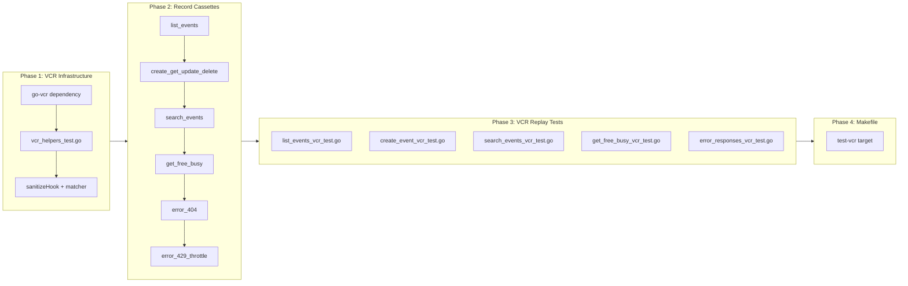

# VCR HTTP Replay Tests

## Change Summary

Introduce `github.com/dnaeon/go-vcr/v4` for recording and replaying real Microsoft Graph API HTTP interactions as deterministic test cassettes. This bridges the gap between existing unit tests (fully mocked JSON via `httptest.Server`) and live E2E tests (real API calls every run), providing a middle-ground integration test layer that runs offline in CI with realistic request/response data.

## Motivation and Background

The current test suite relies on `httptest.Server` handlers that return hand-crafted JSON responses (see `internal/tools/test_helpers_test.go` and `internal/tools/list_events_test.go`). These tests are fast and deterministic, but the mock responses are simplified approximations of real Graph API payloads. Differences between the mocked JSON and actual Graph API responses can mask serialization bugs, missing fields, or unexpected response structures.

Running live integration tests against the real Graph API is impractical for CI: it requires valid OAuth credentials, creates real calendar events, is slow due to network latency, and is subject to rate limiting and transient failures. There is no middle ground.

VCR (Video Cassette Recorder) testing solves this by recording real HTTP interactions once, sanitizing them, and replaying them deterministically in subsequent test runs. The `go-vcr` library intercepts HTTP traffic at the `http.RoundTripper` level, recording request/response pairs to YAML "cassette" files. Once recorded and committed, these cassettes replay without any network access, OAuth tokens, or live API dependency.

## Change Drivers

* **Mock fidelity gap**: Hand-crafted JSON mocks may drift from actual Graph API response shapes over time (e.g., new fields added by Microsoft, different null/absent field behavior, pagination structures).
* **Serialization confidence**: The `SerializeEvent`, `SerializeSummaryEvent`, and message serialization functions are tested against simplified mocks, not real Graph API payloads with all their nuances.
* **Retry and error handling**: The retry logic in `internal/graph/retry.go` handles HTTP 429 and 503 responses, but the existing tests cannot exercise this with realistic Graph API error payloads including `Retry-After` headers and OData error bodies.
* **CI reproducibility**: VCR cassettes provide deterministic, offline, reproducible integration tests that run in CI without credentials.
* **Regression detection**: When the Graph API changes behavior, re-recording cassettes surfaces the differences as test failures or cassette diffs.

## Current State

### Unit Test Infrastructure

Tests in `internal/tools/` use `newTestGraphClient(t, handler)` from `test_helpers_test.go`, which creates an `httptest.Server` and a `GraphServiceClient` backed by a `testTransport` that rewrites `https://graph.microsoft.com` URLs to the local server. Mock handlers return hand-crafted JSON for specific scenarios.

### Test Transport Pattern

The `testTransport` struct implements `http.RoundTripper` and rewrites the request URL scheme and host to target the local `httptest.Server`. This pattern is directly compatible with `go-vcr`, which also operates at the `http.RoundTripper` level.

### Test Coverage

Existing tests cover tool registration, parameter validation, handler construction, output modes (summary/raw), and specific business logic (provenance tagging, date expansion, advisories). All Graph API interactions use mocked JSON responses.

### Retry Logic

`RetryGraphCall` in `internal/graph/retry.go` handles HTTP 429, 503, and 504 with exponential backoff and Retry-After header support. This logic is tested with unit tests but not with realistic Graph API error responses.

## Proposed Change

### 1. Add `go-vcr` Dependency

Add `github.com/dnaeon/go-vcr/v4` to `go.mod`. This is a test-only dependency.

### 2. VCR Test Helper

Create a `newVCRGraphClient` helper that creates a `GraphServiceClient` backed by the `go-vcr` recorder's transport. This helper integrates with the existing `testTransport` URL-rewriting pattern so that requests targeting `https://graph.microsoft.com` are intercepted by the recorder.

```go
// newVCRGraphClient creates a GraphServiceClient backed by a go-vcr recorder.
// In ModeRecordOnce, real HTTP requests are made and recorded to the cassette.
// In ModeReplayOnly, requests are matched against the cassette without network access.
func newVCRGraphClient(t *testing.T, cassette string, mode recorder.Mode) (*msgraphsdk.GraphServiceClient, *recorder.Recorder) {
    t.Helper()

    rec, err := recorder.NewWithOptions(&recorder.Options{
        CassetteName:       filepath.Join("testdata", "cassettes", cassette),
        Mode:               mode,
        SkipRequestLatency: true,
    })
    if err != nil {
        t.Fatalf("create vcr recorder: %v", err)
    }

    rec.AddHook(sanitizeHook, recorder.BeforeSaveHook)
    rec.SetMatcher(graphRequestMatcher)

    httpClient := &http.Client{Transport: rec}

    auth := &kiotaauth.AnonymousAuthenticationProvider{}
    adapter, err := msgraphsdk.NewGraphRequestAdapterWithParseNodeFactoryAndSerializationWriterFactoryAndHttpClient(
        auth, nil, nil, httpClient,
    )
    if err != nil {
        t.Fatalf("create vcr adapter: %v", err)
    }

    client := msgraphsdk.NewGraphServiceClient(adapter)
    return client, rec
}
```

### 3. Sanitization Hook

A `BeforeSaveHook` strips sensitive data from recorded interactions before they are saved to cassette files. This ensures cassettes are safe to commit to the repository.

```go
// sanitizeHook removes OAuth tokens, authorization headers, and PII from
// recorded HTTP interactions before saving to cassette files.
func sanitizeHook(i *cassette.Interaction) error {
    // Strip Authorization header.
    i.Request.Headers.Del("Authorization")

    // Strip OAuth tokens from request body (token refresh requests).
    if strings.Contains(i.Request.URL, "oauth2/v2.0/token") {
        i.Request.Body = "[REDACTED]"
        i.Response.Body = "[REDACTED]"
    }

    // Redact email addresses in response bodies.
    i.Response.Body = redactEmails(i.Response.Body)

    // Strip Set-Cookie headers.
    i.Response.Headers.Del("Set-Cookie")

    return nil
}
```

### 4. Request Matcher

A custom request matcher that matches on HTTP method and URL path (ignoring host and query parameter ordering) to handle minor variations between recording and replay.

### 5. Build Tag Separation

All VCR test files use the `//go:build vcr` build tag. This separates VCR tests from regular unit tests because:
- Cassette files may not exist on first clone (before recording).
- VCR tests test different concerns (realistic payloads) than unit tests (logic correctness).
- CI can run VCR tests as a separate step.

### 6. Cassette Files

Cassette YAML files stored in `internal/tools/testdata/cassettes/` and committed to the repository after sanitization.

### 7. Makefile Target

Add `make test-vcr` to run VCR tests separately from the standard test suite.

## Requirements

### Functional Requirements

1. A `newVCRGraphClient` helper function **MUST** be provided that creates a `GraphServiceClient` backed by a `go-vcr` recorder, supporting both `ModeRecordOnce` and `ModeReplayOnly`.
2. A `BeforeSaveHook` **MUST** strip `Authorization` headers, OAuth token request/response bodies, and email addresses from recorded cassette interactions before saving.
3. The `BeforeSaveHook` **MUST** strip `Set-Cookie` response headers from recorded interactions.
4. A custom request matcher **MUST** match on HTTP method and URL path, tolerating query parameter ordering differences.
5. VCR test files **MUST** use the `//go:build vcr` build tag to separate them from regular unit tests.
6. Cassette files **MUST** be stored in `internal/tools/testdata/cassettes/` and committed to the repository.
7. The following cassettes **MUST** be provided, each covering the stated scenario:
   - `list_events`: list events for a date range, verifying realistic response structure and field population.
   - `create_get_update_delete`: full event lifecycle (create an event, get it by ID, update it, delete it), verifying request/response fidelity at each step.
   - `search_events`: search by subject, verifying KQL `$search` interaction with the Graph API.
   - `get_free_busy`: free/busy schedule request, verifying the `getSchedule` action response structure.
   - `error_404`: request for a non-existent event ID, capturing the Graph API 404 OData error response.
   - `error_429_throttle`: a throttled request with `Retry-After` header, verifying the retry logic handles realistic 429 responses.
8. VCR tests in replay mode **MUST** run without network access, OAuth tokens, or any live API dependency.
9. A `make test-vcr` target **MUST** run `go test -tags=vcr ./internal/tools/...`.
10. The GitHub Actions CI workflow (`.github/workflows/ci.yml`) **MUST** include a step or job that runs VCR tests via `make test-vcr`.
11. VCR tests in replay mode **MUST** be runnable locally with `make test-vcr` without any credentials, API keys, or environment variable configuration -- only the committed cassette files are needed.

### Non-Functional Requirements

1. VCR tests **MUST NOT** be included in the default `go test ./...` or `make test` execution.
2. Cassette files **MUST NOT** contain OAuth tokens, authorization headers, or unsanitized PII after the `BeforeSaveHook` is applied.
3. All new and modified code **MUST** include Go doc comments per project documentation standards.
4. All existing tests **MUST** continue to pass after the changes.
5. The `go-vcr` dependency **MUST** be a test-only dependency (imported only in `_test.go` files).

## Affected Components

| Component | Change |
|-----------|--------|
| `go.mod` | Add `github.com/dnaeon/go-vcr/v4` dependency |
| `internal/tools/vcr_helpers_test.go` (new) | `newVCRGraphClient`, `sanitizeHook`, `graphRequestMatcher`, `redactEmails` helper |
| `internal/tools/list_events_vcr_test.go` (new) | VCR replay test for `list_events` using `list_events` cassette |
| `internal/tools/create_event_vcr_test.go` (new) | VCR replay test for create/get/update/delete lifecycle using `create_get_update_delete` cassette |
| `internal/tools/search_events_vcr_test.go` (new) | VCR replay test for `search_events` using `search_events` cassette |
| `internal/tools/get_free_busy_vcr_test.go` (new) | VCR replay test for `get_free_busy` using `get_free_busy` cassette |
| `internal/tools/error_responses_vcr_test.go` (new) | VCR replay tests for 404 and 429 error responses using `error_404` and `error_429_throttle` cassettes |
| `internal/tools/testdata/cassettes/list_events.yaml` (new) | Recorded cassette for list_events |
| `internal/tools/testdata/cassettes/create_get_update_delete.yaml` (new) | Recorded cassette for event lifecycle |
| `internal/tools/testdata/cassettes/search_events.yaml` (new) | Recorded cassette for search_events |
| `internal/tools/testdata/cassettes/get_free_busy.yaml` (new) | Recorded cassette for get_free_busy |
| `internal/tools/testdata/cassettes/error_404.yaml` (new) | Recorded cassette for 404 response |
| `internal/tools/testdata/cassettes/error_429_throttle.yaml` (new) | Recorded cassette for 429 throttle response |
| `Makefile` | Add `test-vcr` target |
| `.github/workflows/ci.yml` | Add VCR test step to the CI job (runs `make test-vcr`) |

## Scope Boundaries

### In Scope

* Adding `go-vcr` dependency
* VCR test helper (`newVCRGraphClient`) with sanitization hook and custom matcher
* VCR replay tests for calendar tool handlers (list, create lifecycle, search, free/busy)
* VCR replay tests for error responses (404, 429)
* `//go:build vcr` build tag separation
* Cassette recording, sanitization, and storage in `testdata/cassettes/`
* `make test-vcr` Makefile target

### Out of Scope ("Here, But Not Further")

* **VCR tests for mail tools**: Mail tools (CR-0043) can add VCR cassettes in a follow-up CR. This CR covers calendar tools only.
* **VCR tests for account management tools**: `add_account`, `remove_account`, `list_accounts` involve auth flows that are not suitable for VCR recording.
* **Automated cassette re-recording**: A mechanism to periodically re-record cassettes (e.g., a CI job with live credentials) is a future enhancement.
* **Replacing existing unit tests**: VCR tests complement, not replace, the existing `httptest.Server`-based unit tests. Both serve different purposes.
* **Recording infrastructure (credential management for recording)**: How and where live credentials are stored for cassette recording is out of scope. Developers record locally with their own credentials.

## Impact Assessment

### User Impact

None. This change only affects the test suite. No runtime behavior changes.

### Technical Impact

Low. A new test-only dependency is added. New test files are isolated behind a build tag and do not affect the default test suite. Cassette YAML files add repository size (~10-50 KB per cassette).

### Business Impact

Improved test confidence. VCR tests catch serialization drift and Graph API response structure changes that hand-crafted mocks cannot detect.

## Implementation Approach

### Phase 1: VCR Test Infrastructure

1. Add `github.com/dnaeon/go-vcr/v4` to `go.mod`.
2. Create `internal/tools/vcr_helpers_test.go` with:
   - `newVCRGraphClient(t, cassette, mode)` helper
   - `sanitizeHook(i *cassette.Interaction) error`
   - `graphRequestMatcher(r *http.Request, i cassette.Request) bool`
   - `redactEmails(body string) string`
3. All functions in this file use `//go:build vcr`.

### Phase 2: Record Cassettes

Record cassettes by running VCR tests in `ModeRecordOnce` with live credentials. Each cassette captures one specific scenario:

1. `list_events.yaml` — `GET /me/calendarView` with `startDateTime`/`endDateTime` and `$select`/`$expand`.
2. `create_get_update_delete.yaml` — `POST /me/events`, `GET /me/events/{id}`, `PATCH /me/events/{id}`, `DELETE /me/events/{id}`.
3. `search_events.yaml` — `GET /me/calendarView` with `$search` parameter.
4. `get_free_busy.yaml` — `POST /me/calendar/getSchedule` action.
5. `error_404.yaml` — `GET /me/events/{nonexistent-id}` returning 404 OData error.
6. `error_429_throttle.yaml` — Synthetically constructed cassette with 429 status and `Retry-After: 1` header (recording a real 429 is non-deterministic; a hand-crafted cassette with realistic OData error body is acceptable here).

### Phase 3: VCR Replay Tests

Create VCR test files that load cassettes in `ModeReplayOnly` and exercise tool handlers:

1. `list_events_vcr_test.go` — Call `HandleListEvents` against the `list_events` cassette, verify event count, field population, and summary/raw output modes.
2. `create_event_vcr_test.go` — Call `HandleCreateEvent`, `HandleGetEvent`, `HandleUpdateEvent`, `HandleDeleteEvent` sequentially against the `create_get_update_delete` cassette.
3. `search_events_vcr_test.go` — Call `HandleSearchEvents` against the `search_events` cassette, verify search results.
4. `get_free_busy_vcr_test.go` — Call `HandleGetFreeBusy` against the `get_free_busy` cassette, verify schedule response structure.
5. `error_responses_vcr_test.go` — Call handlers against `error_404` and `error_429_throttle` cassettes, verify error handling and retry behavior.

### Phase 4: Makefile and Documentation

1. Add `test-vcr` target to `Makefile`.
2. Update inline code comments explaining the record-once workflow.

### Record-Once Workflow

The intended workflow for recording and maintaining cassettes:

1. **Record**: Developer runs VCR tests in `ModeRecordOnce` with valid OAuth credentials configured locally. The `go-vcr` recorder makes real HTTP requests and saves interactions to YAML cassette files.
2. **Sanitize**: The `BeforeSaveHook` automatically strips tokens, auth headers, and PII before writing the cassette file.
3. **Review**: Developer reviews the cassette YAML to verify sanitization is complete and no sensitive data remains.
4. **Commit**: Sanitized cassette files are committed to the repository alongside the VCR test code.
5. **Replay**: CI and other developers run `make test-vcr`, which uses `ModeReplayOnly`. Requests are matched against the cassette and responses are replayed without network access.
6. **Re-record**: When the Graph API changes behavior or new test scenarios are added, the developer deletes the stale cassette and re-records it.

### Integration with Existing `newTestGraphClient`

The existing `newTestGraphClient` in `test_helpers_test.go` uses `testTransport` to rewrite URLs from `https://graph.microsoft.com` to the local `httptest.Server`. The VCR helper takes a different approach: `go-vcr`'s recorder acts as the `http.RoundTripper` directly, intercepting requests at the transport level before they reach the network. In record mode, it forwards to the real Graph API endpoint; in replay mode, it matches against the cassette. The two approaches coexist without conflict — `newTestGraphClient` is for unit tests with hand-crafted handlers, `newVCRGraphClient` is for integration tests with recorded cassettes.

### Sample VCR Test

```go
//go:build vcr

package tools

import (
    "context"
    "encoding/json"
    "testing"
    "time"

    "github.com/desek/outlook-local-mcp/internal/auth"
    "github.com/desek/outlook-local-mcp/internal/graph"
    "github.com/dnaeon/go-vcr/v4/pkg/recorder"
    "github.com/mark3labs/mcp-go/mcp"
)

func TestVCR_ListEvents_RealisticPayload(t *testing.T) {
    client, rec := newVCRGraphClient(t, "list_events", recorder.ModeReplayOnly)
    defer rec.Stop()

    handler := NewHandleListEvents(graph.RetryConfig{}, 30*time.Second, "UTC", "")
    req := mcp.CallToolRequest{}
    req.Params.Arguments = map[string]any{
        "start_datetime": "2026-03-20T00:00:00Z",
        "end_datetime":   "2026-03-21T00:00:00Z",
    }

    ctx := auth.WithGraphClient(context.Background(), client)
    result, err := handler(ctx, req)
    if err != nil {
        t.Fatalf("unexpected error: %v", err)
    }
    if result.IsError {
        t.Fatalf("expected success, got error: %v", result.Content[0].(mcp.TextContent).Text)
    }

    var events []map[string]any
    text := result.Content[0].(mcp.TextContent).Text
    if err := json.Unmarshal([]byte(text), &events); err != nil {
        t.Fatalf("failed to parse response: %v", err)
    }
    if len(events) == 0 {
        t.Fatal("expected at least one event from cassette")
    }

    // Verify realistic fields are populated (not just the minimal set from mocks).
    event := events[0]
    for _, field := range []string{"id", "subject", "start", "end"} {
        if _, ok := event[field]; !ok {
            t.Errorf("expected field %q in event response", field)
        }
    }
}
```

### Implementation Flow



## Test Strategy

### Tests to Add

| Test File | Test Name | Description |
|-----------|-----------|-------------|
| `vcr_helpers_test.go` | `TestSanitizeHook_StripsAuthHeader` | Verifies Authorization header is removed from recorded interaction |
| `vcr_helpers_test.go` | `TestSanitizeHook_RedactsOAuthTokenBody` | Verifies OAuth token request/response bodies are redacted |
| `vcr_helpers_test.go` | `TestSanitizeHook_RedactsEmails` | Verifies email addresses in response bodies are redacted |
| `vcr_helpers_test.go` | `TestSanitizeHook_StripsSetCookie` | Verifies Set-Cookie headers are removed |
| `vcr_helpers_test.go` | `TestGraphRequestMatcher_MethodAndPath` | Verifies matching on HTTP method and URL path |
| `vcr_helpers_test.go` | `TestGraphRequestMatcher_QueryOrderIndependent` | Verifies query parameter order does not affect matching |
| `list_events_vcr_test.go` | `TestVCR_ListEvents_RealisticPayload` | Replays list_events cassette, verifies event structure |
| `list_events_vcr_test.go` | `TestVCR_ListEvents_SummaryMode` | Replays cassette with output=summary, verifies flattened fields |
| `list_events_vcr_test.go` | `TestVCR_ListEvents_RawMode` | Replays cassette with output=raw, verifies full nested structure |
| `create_event_vcr_test.go` | `TestVCR_CreateEvent_Lifecycle` | Replays create/get/update/delete cassette, verifies each step |
| `search_events_vcr_test.go` | `TestVCR_SearchEvents_BySubject` | Replays search_events cassette, verifies search results |
| `get_free_busy_vcr_test.go` | `TestVCR_GetFreeBusy_ScheduleResponse` | Replays get_free_busy cassette, verifies schedule structure |
| `error_responses_vcr_test.go` | `TestVCR_Error404_NonExistentEvent` | Replays error_404 cassette, verifies error handling |
| `error_responses_vcr_test.go` | `TestVCR_Error429_RetryAfterHandled` | Replays error_429_throttle cassette, verifies retry logic with realistic 429 response |

### Tests to Modify

Not applicable.

### Tests to Remove

Not applicable.

## Acceptance Criteria

### AC-1: VCR helper creates functional Graph client

```gherkin
Given a recorded cassette file exists in testdata/cassettes/
When newVCRGraphClient is called with ModeReplayOnly
Then it MUST return a functional GraphServiceClient that replays recorded responses
  And no network requests MUST be made
```

### AC-2: Sanitization removes auth headers

```gherkin
Given a cassette interaction contains an Authorization header
When the BeforeSaveHook processes the interaction
Then the Authorization header MUST be absent from the saved cassette
```

### AC-3: Sanitization removes OAuth tokens

```gherkin
Given a cassette interaction is an OAuth token request/response
When the BeforeSaveHook processes the interaction
Then the request and response bodies MUST be replaced with "[REDACTED]"
```

### AC-4: Sanitization removes email PII

```gherkin
Given a cassette response body contains email addresses
When the BeforeSaveHook processes the interaction
Then email addresses MUST be replaced with redacted placeholders
```

### AC-5: Sanitization removes Set-Cookie headers

```gherkin
Given a cassette interaction response contains Set-Cookie headers
When the BeforeSaveHook processes the interaction
Then the Set-Cookie headers MUST be absent from the saved cassette
```

### AC-6: Build tag isolation

```gherkin
Given VCR test files use the //go:build vcr tag
When go test ./... is run without -tags=vcr
Then VCR tests MUST NOT be compiled or executed
  And all existing unit tests MUST pass unchanged
```

### AC-7: list_events cassette replay

```gherkin
Given the list_events cassette is present
When the VCR list_events test runs in ModeReplayOnly
Then it MUST successfully parse the replayed response
  And the events MUST contain realistic field population (id, subject, start, end, organizer, location)
```

### AC-8: Event lifecycle cassette replay

```gherkin
Given the create_get_update_delete cassette is present
When the VCR lifecycle test runs in ModeReplayOnly
Then create_event MUST return a valid event with an ID
  And get_event MUST return the same event by ID
  And update_event MUST succeed
  And delete_event MUST succeed
```

### AC-9: Error 404 cassette replay

```gherkin
Given the error_404 cassette is present
When a get_event handler is called with a non-existent event ID
Then the handler MUST return a tool error
  And the error MUST contain the Graph API OData error information
```

### AC-10: Error 429 cassette replay

```gherkin
Given the error_429_throttle cassette is present
When a handler is called and receives a 429 response with Retry-After header
Then the retry logic in RetryGraphCall MUST handle the 429 response
  And the Retry-After value MUST be respected
```

### AC-11: Makefile target

```gherkin
Given the Makefile contains a test-vcr target
When make test-vcr is executed
Then it MUST run go test -tags=vcr ./internal/tools/...
```

### AC-12: Cassettes committed and sanitized

```gherkin
Given cassette YAML files exist in internal/tools/testdata/cassettes/
When the files are inspected
Then they MUST NOT contain Authorization header values
  And they MUST NOT contain OAuth access or refresh tokens
  And they MUST NOT contain unsanitized email addresses
```

### AC-13: Request matcher tolerates query parameter ordering

```gherkin
Given a recorded request has query parameters in a specific order
When a replay request sends the same parameters in a different order
Then the matcher MUST still match the request to the recorded interaction
```

### AC-14: GitHub Actions CI runs VCR tests

```gherkin
Given the CI workflow in .github/workflows/ci.yml
Then it MUST include a step that runs make test-vcr
  And the step MUST execute on every pull request
  And the step MUST pass without any credentials or network access
  And the step MUST rely only on committed cassette files in testdata/cassettes/
```

### AC-15: Local execution requires only committed cassettes

```gherkin
Given a clean checkout of the repository with cassette files present
When make test-vcr is run
Then VCR tests MUST compile and execute without any environment variables or credentials
  And VCR tests MUST complete without network access
  And the exit code MUST be 0 when all cassettes are present and tests pass
```

## Quality Standards Compliance

### Build & Compilation

- [x] Code compiles/builds without errors
- [x] No new compiler warnings introduced

### Linting & Code Style

- [x] All linter checks pass with zero warnings/errors
- [x] Code follows project coding conventions and style guides
- [x] Any linter exceptions are documented with justification

### Test Execution

- [x] All existing tests pass after implementation
- [x] All new tests pass
- [x] Test coverage meets project requirements for changed code

### Documentation

- [x] Inline code documentation updated where applicable
- [x] User-facing documentation updated if behavior changes

### Code Review

- [ ] Changes submitted via pull request
- [ ] PR title follows Conventional Commits format
- [ ] Code review completed and approved
- [ ] Changes squash-merged to maintain linear history

### Verification Commands

```bash
# Build verification
go build ./...

# Lint verification
golangci-lint run

# Standard test execution (VCR tests excluded)
go test ./... -v

# VCR test execution
make test-vcr

# Full CI check
make ci
```

## Risks and Mitigation

### Risk 1: Cassette staleness (Graph API changes)

**Likelihood:** medium
**Impact:** medium
**Mitigation:** Cassettes capture a point-in-time snapshot of Graph API behavior. When Microsoft changes response structures, VCR tests will fail because the handler expectations (field names, structure) no longer match the stale cassette data. This is actually a feature: the failure alerts developers that the API has changed. Mitigation: periodically re-record cassettes (quarterly or when Graph SDK is updated). Document the re-recording process in inline code comments.

### Risk 2: Cassette recording requires live credentials

**Likelihood:** certain
**Impact:** low
**Mitigation:** Recording cassettes requires a developer to have valid OAuth credentials and a test calendar with events. This is a one-time setup per cassette. The `ModeRecordOnce` mode only records when the cassette file does not exist; subsequent runs replay from the existing file. Only one developer needs to record; the committed cassettes are used by everyone.

### Risk 3: Sensitive data leaking into committed cassettes

**Likelihood:** low (with mitigation)
**Impact:** high
**Mitigation:** The `BeforeSaveHook` automatically strips Authorization headers, OAuth token bodies, and email addresses. Additionally, developers must review cassette YAML before committing. The `.gitignore` should not exclude `testdata/cassettes/` (they must be committed), but a pre-commit review step is recommended.

### Risk 4: go-vcr request matching brittleness

**Likelihood:** medium
**Impact:** low
**Mitigation:** The custom `graphRequestMatcher` matches on HTTP method and URL path only, ignoring query parameter ordering and non-deterministic headers. This is more lenient than the default matcher. If matching issues arise, the matcher can be further relaxed (e.g., ignoring specific headers or normalizing query parameters).

### Risk 5: Repository size growth from cassette files

**Likelihood:** low
**Impact:** low
**Mitigation:** Each cassette YAML file is approximately 5-50 KB depending on the response payload size. Six cassettes add at most ~300 KB to the repository. YAML compresses well in git packfiles. If growth becomes a concern, large response bodies can be trimmed to the minimum fields needed for test assertions.

### Risk 6: Retry test with 429 cassette non-determinism

**Likelihood:** low
**Impact:** low
**Mitigation:** Recording a real 429 response is non-deterministic (it requires triggering rate limiting). The `error_429_throttle` cassette is hand-crafted with a realistic OData error body and `Retry-After: 1` header, based on documented Graph API 429 response format. This is explicitly noted in the cassette file and test comments.

## Dependencies

* CR-0006 (Read-Only Tools) -- tool handlers being tested with VCR cassettes
* CR-0008 (Create & Update Event Tools) -- create/update/delete handlers in the lifecycle cassette
* CR-0040 (MCP Event Provenance Tagging) -- provenance property may appear in recorded responses

## Estimated Effort

| Phase | Description | Estimate |
|-------|-------------|----------|
| Phase 1 | VCR infrastructure (dependency, helper, sanitizer, matcher) | 2 hours |
| Phase 2 | Record and sanitize cassettes (requires live credentials) | 3 hours |
| Phase 3 | VCR replay tests (6 test files) | 3 hours |
| Phase 4 | Makefile target | 15 minutes |
| **Total** | | **8.25 hours** |

## Decision Outcome

Chosen approach: **`go-vcr` with `ModeRecordOnce` / `ModeReplayOnly` and build tag isolation**, because:

1. **Transport-level interception**: `go-vcr` operates at the `http.RoundTripper` level, which is the same abstraction layer as the existing `testTransport`. It integrates cleanly with the Microsoft Graph SDK's HTTP client without modifying application code.
2. **Record-once workflow**: Cassettes are recorded once with real credentials and replayed indefinitely. This avoids the need for live credentials in CI while still testing against real API responses.
3. **Build tag isolation**: The `//go:build vcr` tag ensures VCR tests never interfere with the existing fast unit test suite. Teams can adopt VCR tests incrementally.
4. **Sanitization hooks**: `BeforeSaveHook` provides a clean mechanism to strip sensitive data before cassette files are written, making them safe to commit.

Alternatives considered:
- **`httpreplay` (Google)**: Focused on Google Cloud APIs, not a general-purpose VCR library. Less flexible hook system.
- **`govcr`**: Older library with less active maintenance than `go-vcr/v4`. Lacks the structured hook system (`BeforeSaveHook`).
- **Custom recording middleware**: Building a bespoke HTTP recording layer adds maintenance burden and duplicates what `go-vcr` already provides.
- **Contract testing with Pact**: Overkill for a single-consumer scenario (this MCP server is the only consumer of Graph API). Pact is designed for multi-service contract verification.
- **Snapshot testing of JSON responses**: Would test serialization output but not the full HTTP interaction cycle (headers, status codes, error bodies, retry behavior).

## Related Items

* CR-0006 -- Read-Only Tools (tool handlers being tested)
* CR-0008 -- Create & Update Event Tools (create/update/delete handlers being tested)
* CR-0040 -- MCP Event Provenance Tagging (provenance property in recorded responses)
* CR-0043 -- Mail Read & Event-Email Correlation (future VCR cassettes for mail tools)
