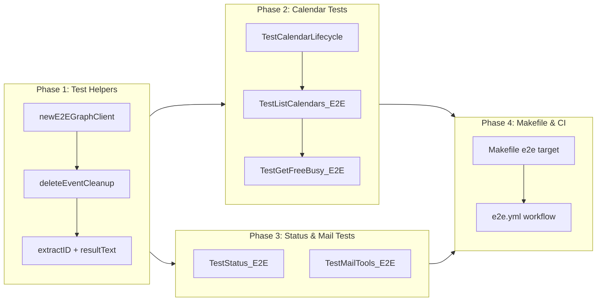

# End-to-End Live Graph API Tests

## Change Summary

Add end-to-end integration tests that exercise MCP tool handlers against the real Microsoft Graph API using a dedicated M365 sandbox tenant. Tests use the ROPC (Resource Owner Password Credentials) flow via `azidentity.NewUsernamePasswordCredential` for non-interactive authentication in CI, enabling delegated-context `/me` endpoint access without interactive login. Tests are gated behind a `//go:build e2e` build tag and a `make e2e` target, ensuring they never run during regular `go test` or `make ci`.

## Motivation and Background

The existing test suite uses mock HTTP servers (`httptest.Server`) and the `newTestGraphClient` helper to validate tool handler logic in isolation. While these unit tests verify request construction, parameter parsing, serialization, and error handling, they cannot detect:

- **Breaking Graph API changes**: Microsoft may change response schemas, deprecate query parameters, or alter OData filter behavior. Mock tests cannot catch these regressions.
- **Authentication integration failures**: The auth flow (token acquisition, scope negotiation, token refresh) is never exercised against real Entra ID endpoints.
- **End-to-end data flow issues**: Subtle mismatches between the SDK's request serialization and Graph API expectations (e.g., time zone formatting, extended property syntax, pagination cursors) are invisible to mock tests.
- **Multi-step workflow correctness**: The create -> list -> get -> update -> search -> cancel -> delete lifecycle has never been validated against a real mailbox.

A dedicated M365 developer sandbox tenant with a test user provides a safe, isolated environment for these tests without touching production data. The ROPC flow enables non-interactive authentication in CI by exchanging a username and password directly for a delegated access token.

## Change Drivers

* **No live API validation**: All existing tests mock the Graph API. Zero confidence that tool handlers work against the real service.
* **Silent regressions**: Graph API changes (response schema, OData behavior, SDK updates) can break the server without any test signal.
* **CI confidence gap**: The `make ci` pipeline validates compilation, linting, and unit tests but cannot verify that the server actually works with Microsoft Graph.
* **Release readiness**: Before publishing releases, live API validation provides a strong quality signal that cannot be obtained from mocks alone.

## Current State

### Test Infrastructure

All tests in `internal/tools/` use `newTestGraphClient(t, handler)` from `test_helpers_test.go`, which creates a `GraphServiceClient` backed by a local `httptest.Server`. Requests are intercepted by `testTransport`, which rewrites Graph API URLs to the local server. No real tokens, no real API calls.

### Authentication

`internal/auth/auth.go` supports three credential types: `auth_code`, `browser`, and `device_code`. All three require interactive user action (browser redirect or device code entry). There is no non-interactive credential path suitable for CI.

### Build Tags

No build tags are currently used to gate test execution. All tests run on every `go test ./...` invocation.

### Makefile

The `Makefile` has targets for `build`, `test`, `lint`, `fmt`, `ci`, and `security`. There is no `e2e` target.

### CI Pipeline

`.github/workflows/ci.yml` runs `make ci` on PRs. There is no nightly or scheduled workflow, and no e2e job.

## Proposed Change

### 1. ROPC Authentication Helper

Create a shared test helper that constructs an `azidentity.UsernamePasswordCredential` from environment variables and builds a `GraphServiceClient` with delegated scopes. ROPC provides a delegated token (same as interactive flows), so `/me` endpoints work correctly -- unlike `client_credentials` which requires `/users/{id}` and does not support all calendar/mail endpoints.

```go
// newE2EGraphClient creates a GraphServiceClient authenticated via ROPC
// for end-to-end testing. Skips the test if required environment variables
// are not set.
func newE2EGraphClient(t *testing.T) *msgraphsdk.GraphServiceClient {
    t.Helper()

    tenantID := os.Getenv("E2E_TENANT_ID")
    clientID := os.Getenv("E2E_CLIENT_ID")
    username := os.Getenv("E2E_USERNAME")
    password := os.Getenv("E2E_PASSWORD")

    if tenantID == "" || clientID == "" || username == "" || password == "" {
        t.Skip("E2E environment variables not set, skipping live test")
    }

    cred, err := azidentity.NewUsernamePasswordCredential(
        tenantID, clientID, username, password, nil,
    )
    if err != nil {
        t.Fatalf("create ROPC credential: %v", err)
    }

    scopes := []string{"Calendars.ReadWrite", "Mail.Read"}
    client, err := msgraphsdk.NewGraphServiceClientWithCredentials(cred, scopes)
    if err != nil {
        t.Fatalf("create graph client: %v", err)
    }

    return client
}
```

**Why ROPC over client_credentials**: The MCP tool handlers use `/me/events`, `/me/messages`, `/me/calendars`, and `/me/calendarView` -- all delegated endpoints that require a user context. The `client_credentials` grant produces an application-only token where `/me` is undefined. Switching all handlers to use `/users/{id}` would require pervasive changes and diverge the test paths from production code paths. ROPC acquires a delegated token non-interactively, matching the exact token type that `browser`, `device_code`, and `auth_code` flows produce.

### 2. Build Tag Gating

All e2e test files use `//go:build e2e` so they are excluded from `go test ./...` and `make ci`. They only run when explicitly invoked with `-tags e2e`.

### 3. Calendar Tool Lifecycle Test

A single ordered test function exercises the complete calendar event lifecycle, using subtests for each step:

```go
//go:build e2e

func TestCalendarLifecycle(t *testing.T) {
    client := newE2EGraphClient(t)
    ctx := auth.WithGraphClient(context.Background(), client)

    retryCfg := graph.RetryConfig{MaxRetries: 3, InitialBackoff: time.Second}
    timeout := 30 * time.Second
    tz := "UTC"

    subject := fmt.Sprintf("E2E-%s-%d", t.Name(), time.Now().UnixMilli())
    startDT := time.Now().Add(24 * time.Hour).Truncate(time.Hour).Format("2006-01-02T15:04:05")
    endDT := time.Now().Add(25 * time.Hour).Truncate(time.Hour).Format("2006-01-02T15:04:05")

    var eventID string

    t.Run("create_event", func(t *testing.T) {
        handler := HandleCreateEvent(retryCfg, timeout, tz, "")
        req := mcp.CallToolRequest{}
        req.Params.Arguments = map[string]any{
            "subject":        subject,
            "start_datetime": startDT,
            "end_datetime":   endDT,
            "start_timezone": tz,
            "end_timezone":   tz,
        }
        result, err := handler(ctx, req)
        require(t, err == nil, "create_event error: %v", err)
        require(t, !result.IsError, "create_event failed: %v", resultText(result))
        eventID = extractID(t, result)
        t.Cleanup(func() { deleteEventCleanup(t, ctx, retryCfg, timeout, eventID) })
    })

    t.Run("list_events", func(t *testing.T) { /* verify event visible */ })
    t.Run("get_event", func(t *testing.T) { /* verify full details */ })
    t.Run("update_event", func(t *testing.T) { /* modify subject */ })
    t.Run("search_events", func(t *testing.T) { /* search by subject */ })
    t.Run("reschedule_event", func(t *testing.T) { /* move to next day */ })
    t.Run("cancel_event", func(t *testing.T) { /* cancel with message */ })
    t.Run("delete_event", func(t *testing.T) { /* delete event */ })
}
```

### 4. Cleanup Pattern

Every test event is registered for cleanup via `t.Cleanup` immediately after creation. The cleanup function attempts a `DELETE /me/events/{id}` call. If the event was already deleted by the test (e.g., the `delete_event` subtest), the cleanup silently ignores 404 responses.

```go
// deleteEventCleanup is a t.Cleanup callback that attempts to delete a test
// event. It logs but does not fail the test if the event is already gone.
func deleteEventCleanup(t *testing.T, ctx context.Context, retryCfg graph.RetryConfig, timeout time.Duration, eventID string) {
    t.Helper()
    handler := HandleDeleteEvent(retryCfg, timeout)
    req := mcp.CallToolRequest{}
    req.Params.Arguments = map[string]any{"event_id": eventID}
    result, err := handler(ctx, req)
    if err != nil {
        t.Logf("cleanup: delete event %s error: %v", eventID, err)
    } else if result.IsError {
        t.Logf("cleanup: delete event %s failed (likely already deleted): %s", eventID, resultText(result))
    }
}
```

### 5. Additional Test Coverage

Beyond the calendar lifecycle test, dedicated tests cover:

- **list_calendars**: Verify at least one calendar exists (the default calendar).
- **get_free_busy**: Query availability for the test user's own mailbox over a known time range.
- **status tool**: Verify the status tool returns version and timezone information.
- **Mail tools** (conditional on `OUTLOOK_MCP_MAIL_ENABLED=true`): `list_mail_folders` (verify Inbox exists), `search_messages` (search for a known subject), `get_message` (retrieve a specific message by ID from search results).

### 6. Makefile Target

```makefile
e2e:
	go test -tags e2e -timeout 5m -count=1 -v ./internal/tools/...
```

The `-count=1` flag disables test caching (e2e tests must always hit the live API), and `-timeout 5m` provides ample time for API latency and rate limiting.

### 7. GitHub Actions Nightly Workflow

A new `.github/workflows/e2e.yml` workflow runs the e2e tests on a nightly schedule. Secrets are stored as GitHub repository secrets. The workflow is not triggered on PRs to avoid exposing secrets to fork PRs and to avoid rate limiting the sandbox tenant on every push.

## Requirements

### Functional Requirements

1. A `newE2EGraphClient` test helper **MUST** construct a `GraphServiceClient` using `azidentity.NewUsernamePasswordCredential` with credentials from `E2E_TENANT_ID`, `E2E_CLIENT_ID`, `E2E_USERNAME`, and `E2E_PASSWORD` environment variables.
2. When any required environment variable is missing, `newE2EGraphClient` **MUST** call `t.Skip` to skip the test rather than failing.
3. All e2e test files **MUST** use the `//go:build e2e` build tag.
4. The calendar lifecycle test **MUST** exercise the full sequence: `create_event` -> `list_events` (verify visible) -> `get_event` -> `update_event` -> `search_events` -> `reschedule_event` -> `cancel_event` -> `delete_event`.
5. Every test event created during e2e tests **MUST** be registered for cleanup via `t.Cleanup` immediately after creation.
6. The cleanup function **MUST** silently tolerate 404 responses from the Graph API (event already deleted).
7. Test event subjects **MUST** include `t.Name()` and a timestamp to ensure uniqueness across concurrent runs.
8. Test events **MUST** use future dates (at least 24 hours ahead) to avoid interference with the test user's actual calendar.
9. A `list_calendars` e2e test **MUST** verify that at least one calendar is returned.
10. A `get_free_busy` e2e test **MUST** query availability for the test user's mailbox and verify a response is returned.
11. A `status` tool e2e test **MUST** verify the status response contains version and timezone fields.
12. When `OUTLOOK_MCP_MAIL_ENABLED=true` is set in the e2e environment, mail tool tests **MUST** exercise `list_mail_folders`, `search_messages`, and `get_message`.
13. When `OUTLOOK_MCP_MAIL_ENABLED` is not set, mail tool tests **MUST** be skipped via `t.Skip`.
14. The `Makefile` **MUST** include an `e2e` target that runs `go test -tags e2e -timeout 5m -count=1 -v ./internal/tools/...`.
15. A GitHub Actions workflow **MUST** run e2e tests on a nightly cron schedule, reading credentials from repository secrets.
16. The GitHub Actions e2e workflow **MUST NOT** be triggered on pull request events.
17. The e2e workflow **MUST** also support `workflow_dispatch` for manual triggering.
18. A `docs/testing/e2e-setup.md` file **MUST** document the local development setup: M365 sandbox provisioning, app registration steps, test user creation, MFA exclusion, and environment variable configuration.
19. E2e tests **MUST** be runnable locally with `make e2e` after exporting the four `E2E_*` environment variables (or sourcing an `.env` file).
20. The `.env` and `*.env` patterns **MUST** be present in `.gitignore` to prevent accidental credential commits.

### Non-Functional Requirements

1. E2e tests **MUST** execute sequentially (no `t.Parallel()`) to avoid rate limiting and event collision.
2. E2e tests **MUST** reuse the existing retry and timeout configuration rather than implementing their own retry logic.
3. All new test code **MUST** include Go doc comments per project documentation standards.
4. All existing unit tests **MUST** continue to pass unmodified after the changes (build tag isolation).
5. E2e test credentials **MUST** only be stored in GitHub repository secrets and local environment variables -- never committed to the repository.
6. The test user **MUST** be an isolated account in the M365 developer sandbox tenant with no access to production data.

## Affected Components

| Component | Change |
|-----------|--------|
| `internal/tools/e2e_helpers_test.go` (new) | `newE2EGraphClient`, `deleteEventCleanup`, `extractID`, `resultText` helpers with `//go:build e2e` tag |
| `internal/tools/e2e_calendar_test.go` (new) | `TestCalendarLifecycle` (create, list, get, update, search, reschedule, cancel, delete), `TestListCalendars_E2E`, `TestGetFreeBusy_E2E` |
| `internal/tools/e2e_mail_test.go` (new) | `TestMailTools_E2E` (list_mail_folders, search_messages, get_message), conditional on `OUTLOOK_MCP_MAIL_ENABLED` |
| `internal/tools/e2e_status_test.go` (new) | `TestStatus_E2E` |
| `Makefile` | Add `e2e` target |
| `.github/workflows/e2e.yml` (new) | Nightly cron workflow for e2e tests |
| `.gitignore` | Ensure `.env` and `*.env` patterns are present (for local e2e credential files) |
| `docs/testing/e2e-setup.md` (new) | Step-by-step local setup guide: M365 sandbox, app registration, test user, env vars |

## Scope Boundaries

### In Scope

* ROPC-based `newE2EGraphClient` test helper with environment variable skip logic
* `//go:build e2e` tag on all e2e test files
* Calendar lifecycle test covering all 8 calendar mutation/read tools
* Standalone tests for `list_calendars`, `get_free_busy`, and `status`
* Conditional mail tool tests behind `OUTLOOK_MCP_MAIL_ENABLED`
* `t.Cleanup`-based event cleanup with 404 tolerance
* `make e2e` Makefile target
* GitHub Actions nightly e2e workflow
* M365 sandbox tenant setup documentation in the CR

### Out of Scope ("Here, But Not Further")

* **Multi-account e2e tests**: Only the single test user is exercised. Multi-account workflows (`add_account`, `remove_account`) involve interactive authentication flows that cannot be automated with ROPC.
* **Provenance tagging e2e tests**: Verifying extended properties on live events requires reading back the property after creation. This is a valuable future addition but adds complexity to the initial CR.
* **Performance benchmarking**: The e2e tests validate correctness, not throughput or latency.
* **Parallel test execution**: Tests run sequentially to stay within rate limits and simplify event lifecycle ordering.
* **App registration automation**: The M365 sandbox app registration is a manual one-time setup documented in this CR. Terraform or Bicep automation is a future improvement.
* **Test data seeding**: Mail tool tests search for existing messages rather than creating new ones. Seeding test messages would require `Mail.Send` permission, which is out of scope.

## Impact Assessment

### User Impact

None. E2e tests are an internal development/CI concern. No changes to tool behavior, configuration, or user-facing features.

### Technical Impact

Low. All new files are test files with the `e2e` build tag. No production code is modified. The `Makefile` gains one target. The CI pipeline gains one optional nightly workflow.

### Security Impact

The ROPC flow requires storing a test user's password as a CI secret. This is acceptable because:
- The test user is an isolated account in a sandbox tenant with no access to production data.
- The sandbox tenant has no production workloads or sensitive information.
- GitHub repository secrets are encrypted at rest and masked in logs.
- The password is never committed to the repository.
- The app registration has only `Calendars.ReadWrite`, `Mail.Read`, and `User.Read` permissions -- no admin or write-mail scopes.

### Business Impact

Significantly increases confidence in release quality by validating the full tool chain against the real Graph API on a nightly basis. Catches API regressions before they reach users.

## Implementation Approach

### Prerequisites: M365 Sandbox Tenant Setup

Before implementation, the following one-time setup steps are required:

1. **Create an M365 Developer Sandbox**: Join the [Microsoft 365 Developer Program](https://developer.microsoft.com/en-us/microsoft-365/dev-program) and provision a sandbox tenant. This provides 25 E5 licenses for 90 days (renewable).

2. **Create a test user**: In the sandbox tenant's Entra ID, create a dedicated test user (e.g., `e2e-test@<tenant>.onmicrosoft.com`). Assign an E5 license so the user has a mailbox and calendar.

3. **Register an app for ROPC**: In Entra ID > App registrations, create a new app:
   - **Name**: `outlook-local-mcp-e2e`
   - **Supported account types**: Single tenant (this tenant only)
   - **Redirect URIs**: None (ROPC does not use redirect)
   - **API permissions** (delegated): `Calendars.ReadWrite`, `Mail.Read`, `User.Read`
   - **Grant admin consent** for all permissions
   - **Enable public client flows**: Under Authentication > Advanced settings, set "Allow public client flows" to **Yes** (required for ROPC)

4. **Disable MFA for the test user**: ROPC does not support MFA. In Entra ID > Security > Conditional Access, create an exclusion policy for the test user, or ensure no CA policies require MFA for this user. Alternatively, use Security Defaults with an exclusion.

5. **Store credentials**: Add the following as GitHub repository secrets:
   - `E2E_TENANT_ID`: The sandbox tenant ID (GUID)
   - `E2E_CLIENT_ID`: The app registration's client (application) ID
   - `E2E_USERNAME`: The test user's UPN (e.g., `e2e-test@<tenant>.onmicrosoft.com`)
   - `E2E_PASSWORD`: The test user's password

6. **Seed test data for mail tests**: Send a few test emails to and from the test user so that `search_messages` and `get_message` have data to work with. Use the Outlook web app or Graph Explorer.

### Phase 1: E2E Test Helpers

Create `internal/tools/e2e_helpers_test.go` with `//go:build e2e`:
- `newE2EGraphClient(t)` -- constructs ROPC credential and Graph client, skips if env vars missing.
- `deleteEventCleanup(t, ctx, retryCfg, timeout, eventID)` -- t.Cleanup callback that attempts DELETE and tolerates 404.
- `extractID(t, result)` -- parses tool result JSON and returns the `id` field.
- `resultText(result)` -- extracts text content from a tool result for error messages.

### Phase 2: Calendar Lifecycle Test

Create `internal/tools/e2e_calendar_test.go` with `//go:build e2e`:
- `TestCalendarLifecycle` -- ordered subtests: create -> list -> get -> update -> search -> reschedule -> cancel -> delete.
- `TestListCalendars_E2E` -- verify at least one calendar returned.
- `TestGetFreeBusy_E2E` -- query free/busy for the test user's own address.

### Phase 3: Status and Mail Tests

Create `internal/tools/e2e_status_test.go` with `//go:build e2e`:
- `TestStatus_E2E` -- verify status tool returns version and timezone.

Create `internal/tools/e2e_mail_test.go` with `//go:build e2e`:
- `TestMailTools_E2E` -- conditional on `OUTLOOK_MCP_MAIL_ENABLED=true`, exercises list_mail_folders, search_messages, get_message.

### Phase 4: Makefile and CI

- Add `e2e` target to `Makefile`.
- Create `.github/workflows/e2e.yml` with nightly cron schedule.
- Update `.gitignore` if needed for `.env` files.

### Implementation Flow



## Test Strategy

### Tests to Add

| Test File | Test Name | Description |
|-----------|-----------|-------------|
| `e2e_helpers_test.go` | (helper functions, no tests) | Shared ROPC client, cleanup, and extraction helpers |
| `e2e_calendar_test.go` | `TestCalendarLifecycle/create_event` | Creates an event with unique subject and future date |
| `e2e_calendar_test.go` | `TestCalendarLifecycle/list_events` | Lists events in the time range and verifies the created event is present |
| `e2e_calendar_test.go` | `TestCalendarLifecycle/get_event` | Gets the event by ID and verifies subject, start, and end match |
| `e2e_calendar_test.go` | `TestCalendarLifecycle/update_event` | Updates the event subject and verifies the change persists |
| `e2e_calendar_test.go` | `TestCalendarLifecycle/search_events` | Searches by the updated subject and verifies the event appears |
| `e2e_calendar_test.go` | `TestCalendarLifecycle/reschedule_event` | Reschedules the event to a new start time and verifies the move |
| `e2e_calendar_test.go` | `TestCalendarLifecycle/cancel_event` | Cancels the event with a message |
| `e2e_calendar_test.go` | `TestCalendarLifecycle/delete_event` | Deletes the event and verifies it is gone |
| `e2e_calendar_test.go` | `TestListCalendars_E2E` | Verifies at least one calendar is returned |
| `e2e_calendar_test.go` | `TestGetFreeBusy_E2E` | Queries free/busy for the test user and verifies a response |
| `e2e_status_test.go` | `TestStatus_E2E` | Verifies status tool returns version and timezone |
| `e2e_mail_test.go` | `TestMailTools_E2E/list_mail_folders` | Verifies at least Inbox is returned |
| `e2e_mail_test.go` | `TestMailTools_E2E/search_messages` | Searches for a known subject and verifies results |
| `e2e_mail_test.go` | `TestMailTools_E2E/get_message` | Retrieves a message from search results by ID |

### Tests to Modify

Not applicable. All new files. No existing tests are modified.

### Tests to Remove

Not applicable.

## Acceptance Criteria

### AC-1: E2E tests skip when credentials are absent

```gherkin
Given the E2E_TENANT_ID, E2E_CLIENT_ID, E2E_USERNAME, or E2E_PASSWORD environment variable is not set
When go test -tags e2e is run
Then all e2e tests MUST be skipped with a descriptive skip message
  And the test run MUST report 0 failures
```

### AC-2: E2E tests do not run without build tag

```gherkin
Given no -tags e2e flag is passed
When go test ./... is run
Then no e2e test functions MUST be compiled or executed
  And the test run MUST behave identically to before this change
```

### AC-3: Calendar lifecycle creates and retrieves an event

```gherkin
Given E2E credentials are set for a valid sandbox tenant
When TestCalendarLifecycle runs
Then create_event MUST succeed and return an event ID
  And list_events MUST include the created event in the specified time range
  And get_event MUST return the event with the correct subject
```

### AC-4: Calendar lifecycle updates and searches an event

```gherkin
Given an event was created in TestCalendarLifecycle
When update_event changes the subject
Then get_event MUST return the updated subject
  And search_events with the updated subject MUST include the event
```

### AC-5: Calendar lifecycle reschedules, cancels, and deletes an event

```gherkin
Given an event was created and updated in TestCalendarLifecycle
When reschedule_event moves the event to a new start time
Then get_event MUST reflect the new start time
When cancel_event is called with a cancellation message
Then the operation MUST succeed
When delete_event is called
Then the operation MUST succeed
  And get_event for the deleted event MUST return an error
```

### AC-6: Test cleanup removes events on failure

```gherkin
Given an event was created during an e2e test
When the test fails at any step after creation
Then t.Cleanup MUST attempt to delete the event
  And if the event was already deleted, cleanup MUST NOT fail the test
```

### AC-7: list_calendars returns at least one calendar

```gherkin
Given E2E credentials are set for a sandbox tenant with a licensed user
When TestListCalendars_E2E runs
Then the response MUST contain at least one calendar
  And each calendar MUST include an id and displayName
```

### AC-8: get_free_busy returns availability

```gherkin
Given E2E credentials are set for a sandbox tenant
When TestGetFreeBusy_E2E queries the test user's availability
Then the response MUST succeed
  And the response MUST contain schedule data
```

### AC-9: Status tool returns server info

```gherkin
Given E2E credentials are set
When TestStatus_E2E runs
Then the status response MUST contain a version field
  And the status response MUST contain a timezone field
```

### AC-10: Mail tools work when enabled

```gherkin
Given OUTLOOK_MCP_MAIL_ENABLED=true and E2E credentials are set
When TestMailTools_E2E runs
Then list_mail_folders MUST return at least one folder containing "Inbox"
  And search_messages MUST return results for a known subject
  And get_message MUST return the full message body for a valid message ID
```

### AC-11: Mail tests skip when disabled

```gherkin
Given OUTLOOK_MCP_MAIL_ENABLED is not set or set to "false"
When TestMailTools_E2E runs
Then the test MUST be skipped with a descriptive skip message
```

### AC-12: make e2e target works

```gherkin
Given the Makefile contains the e2e target
When make e2e is run with valid E2E environment variables
Then go test -tags e2e -timeout 5m -count=1 -v ./internal/tools/... MUST be executed
  And the tests MUST complete within the 5-minute timeout
```

### AC-13: GitHub Actions nightly workflow

```gherkin
Given .github/workflows/e2e.yml exists
Then the workflow MUST be triggered on schedule (cron)
  And the workflow MUST support workflow_dispatch for manual triggering
  And the workflow MUST NOT be triggered on pull_request events
  And the workflow MUST read E2E_TENANT_ID, E2E_CLIENT_ID, E2E_USERNAME, and E2E_PASSWORD from repository secrets
```

### AC-16: Local setup documentation exists

```gherkin
Given docs/testing/e2e-setup.md exists
Then it MUST document the M365 sandbox provisioning steps
  And it MUST document the app registration configuration (ROPC, public client flows, permissions)
  And it MUST document the test user creation and MFA exclusion
  And it MUST document the required environment variables (E2E_TENANT_ID, E2E_CLIENT_ID, E2E_USERNAME, E2E_PASSWORD)
  And it MUST provide an example .env file template
```

### AC-17: Local execution with environment variables

```gherkin
Given the four E2E_* environment variables are exported
When make e2e is run locally
Then e2e tests MUST execute against the configured sandbox tenant
  And the tests MUST complete within the 5-minute timeout
```

### AC-18: Credential files excluded from git

```gherkin
Given the .gitignore file
Then it MUST contain patterns that exclude .env and *.env files
  And git status MUST NOT show .env files as untracked
```

### AC-14: Event subjects are unique

```gherkin
Given an e2e test creates a calendar event
Then the event subject MUST include the test name and a timestamp
  And two consecutive runs MUST produce different subjects
```

### AC-15: Test events use future dates

```gherkin
Given an e2e test creates a calendar event
Then the event start time MUST be at least 24 hours in the future
```

## Quality Standards Compliance

### Build & Compilation

- [ ] Code compiles/builds without errors
- [ ] No new compiler warnings introduced

### Linting & Code Style

- [ ] All linter checks pass with zero warnings/errors
- [ ] Code follows project coding conventions and style guides
- [ ] Any linter exceptions are documented with justification

### Test Execution

- [ ] All existing tests pass after implementation
- [ ] All new tests pass (with valid E2E credentials)
- [ ] Test coverage meets project requirements for changed code

### Documentation

- [ ] Inline code documentation updated where applicable
- [ ] User-facing documentation updated if behavior changes

### Code Review

- [ ] Changes submitted via pull request
- [ ] PR title follows Conventional Commits format
- [ ] Code review completed and approved
- [ ] Changes squash-merged to maintain linear history

### Verification Commands

```bash
# Build verification (e2e tests excluded without tag)
go build ./...

# Lint verification
golangci-lint run

# Unit test execution (e2e tests excluded)
go test ./... -v

# Full CI check (e2e tests excluded)
make ci

# E2E test execution (requires credentials)
make e2e
```

## Risks and Mitigation

### Risk 1: ROPC deprecation by Microsoft

**Likelihood:** medium
**Impact:** high
**Mitigation:** Microsoft has stated that ROPC is a "legacy" grant type and recommends against it for production applications. However, it remains fully functional and is explicitly documented for testing scenarios. If ROPC is deprecated, the e2e tests can be migrated to use a service principal with `client_credentials` by refactoring handlers to accept a configurable user ID prefix (e.g., `/users/{id}` vs. `/me`). Alternatively, a headless browser automation tool (e.g., Playwright) could drive the interactive `auth_code` flow. The build tag isolation ensures that ROPC deprecation has zero impact on production code.

### Risk 2: M365 sandbox tenant expiration

**Likelihood:** medium
**Impact:** medium
**Mitigation:** Microsoft 365 Developer Program sandbox tenants expire after 90 days but are automatically renewed if developer activity is detected. The nightly e2e runs count as activity. If the tenant expires, re-provisioning takes approximately 15 minutes. The CI workflow should alert on persistent e2e failures (e.g., Slack notification on workflow failure).

### Risk 3: Graph API rate limiting in CI

**Likelihood:** low
**Impact:** low
**Mitigation:** E2e tests run sequentially (no `t.Parallel()`), creating at most 1-2 events per run. Microsoft Graph allows approximately 10,000 requests per 10 minutes per user. A single e2e run makes fewer than 20 API calls. The existing retry logic with exponential backoff handles transient 429 responses. Nightly (not per-PR) scheduling further reduces rate limit risk.

### Risk 4: Flaky tests due to Graph API eventual consistency

**Likelihood:** medium
**Impact:** low
**Mitigation:** Graph API operations (especially CalendarView and `$search`) may exhibit eventual consistency -- a created event may not appear immediately in list or search results. The lifecycle test can include a brief polling loop (3 attempts with 2-second intervals) on the `list_events` and `search_events` steps before asserting. This is a bounded retry, not an unbounded sleep loop.

### Risk 5: Secret exposure in CI logs

**Likelihood:** low
**Impact:** high
**Mitigation:** GitHub Actions automatically masks repository secrets in log output. The `azidentity` library does not log credentials. The e2e test helper does not log or print credential values. The `OUTLOOK_MCP_LOG_SANITIZE=true` default ensures any PII in Graph API responses is masked in log output. The workflow uses `environment` protection rules if available.

## Dependencies

* CR-0006 (Read-Only Tools) -- provides `list_events`, `get_event`, `search_events`, `list_calendars`, `get_free_busy` handlers under test
* CR-0008 (Create & Update Event Tools) -- provides `create_event`, `update_event` handlers under test
* CR-0009 (Delete & Cancel Event Tools) -- provides `delete_event`, `cancel_event` handlers under test
* CR-0042 (UX Polish & Tool Ergonomics) -- provides `reschedule_event` handler under test
* CR-0043 (Mail Read & Event-Email Correlation) -- provides `list_mail_folders`, `search_messages`, `get_message` handlers under test
* CR-0041 (Test Isolation) -- existing test helpers and patterns

## Estimated Effort

| Phase | Description | Estimate |
|-------|-------------|----------|
| Prerequisites | M365 sandbox tenant setup, app registration, secret configuration | 1 hour |
| Phase 1 | E2E test helpers (ROPC client, cleanup, extraction) | 1.5 hours |
| Phase 2 | Calendar lifecycle test + list_calendars + get_free_busy | 3 hours |
| Phase 3 | Status test + mail tools test | 1.5 hours |
| Phase 4 | Makefile target + GitHub Actions workflow + gitignore | 1 hour |
| **Total** | | **8 hours** |

## Decision Outcome

Chosen approach: **ROPC-based e2e tests with build tag isolation and nightly CI**, because:

1. **ROPC matches the delegated token type**: All MCP tool handlers use `/me` endpoints, which require a delegated (user-context) token. ROPC is the only non-interactive OAuth grant that produces a delegated token, making it the only viable option for CI without interactive login.
2. **Build tag isolation is zero-risk**: The `//go:build e2e` tag ensures that e2e tests are completely invisible to `go test ./...`, `make ci`, and the standard CI pipeline. No production code is modified.
3. **Nightly over per-PR**: Running against the real Graph API on every PR would slow down the CI feedback loop, risk rate limiting, and expose secrets to fork PRs. Nightly runs provide regular validation without these drawbacks.
4. **Sequential execution is sufficient**: With fewer than 20 API calls per run and Microsoft Graph's generous rate limits, sequential execution is simple and adequate. Parallel test execution adds complexity without meaningful time savings for this test count.

Alternatives considered:
- **Client credentials (app-only) flow**: Produces an application-only token where `/me` is undefined. Would require all test paths to use `/users/{id}`, diverging from production code paths and requiring handler modifications. Rejected because it tests a different code path than production.
- **Headless browser automation for interactive auth**: Tools like Playwright could drive the `auth_code` flow through a real browser. Higher fidelity but significantly more complex infrastructure, slower execution, and fragile (dependent on Entra ID login page DOM structure). Disproportionate effort for the initial implementation.
- **Mock service with recorded responses**: Record Graph API responses and replay them in tests. Loses the key benefit of e2e testing (detecting real API changes). Already achieved by the existing unit test suite.
- **Per-PR e2e execution**: Maximum coverage but exposes secrets to fork PRs, risks rate limiting, and slows PR feedback. The security and rate limit concerns outweigh the benefit of per-PR validation.

## Related Items

* CR-0006 -- Read-Only Tools (tool handlers under test)
* CR-0008 -- Create & Update Event Tools (tool handlers under test)
* CR-0009 -- Delete & Cancel Event Tools (tool handlers under test)
* CR-0041 -- Test Isolation & Real Credential Removal (test helper patterns)
* CR-0042 -- UX Polish & Tool Ergonomics (reschedule_event handler under test)
* CR-0043 -- Mail Read & Event-Email Correlation (mail tool handlers under test)
