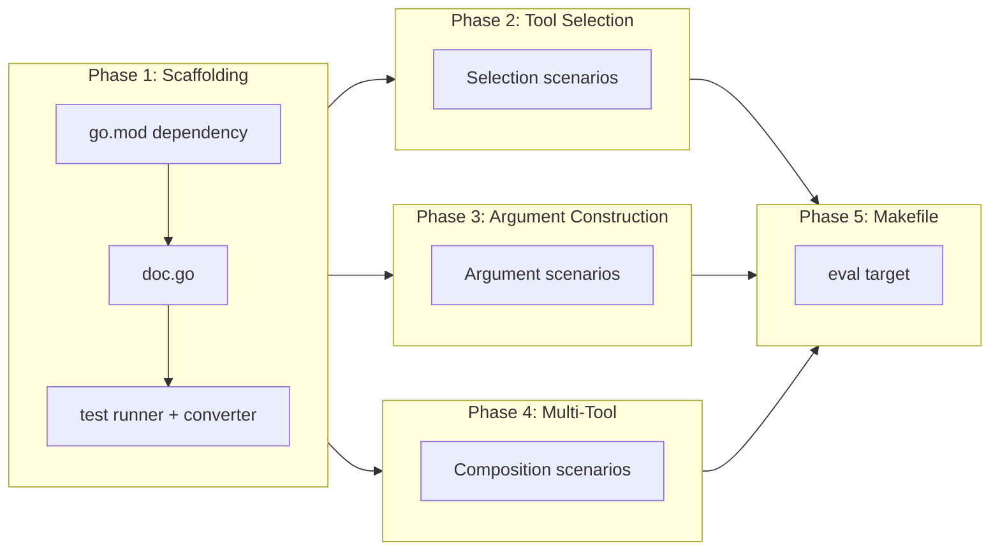

# LLM-Driven Tool Evaluation Tests

## Change Summary

Add Go-native LLM evaluation tests that use the Claude API (`tool_use`) to verify that an LLM can correctly interpret MCP tool descriptions, select the appropriate tool for a natural language request, and construct valid tool call arguments. These tests validate the "LLM interpretability" of the MCP tool surface -- they do not test Graph API correctness or server-side behavior.

## Motivation and Background

The MCP server exposes 19+ tools (calendar, mail, account management, status) to LLM clients via the Model Context Protocol. Each tool has a description, parameter names, parameter descriptions, and JSON Schema constraints. The LLM relies entirely on this metadata to decide which tool to call and how to construct arguments.

Today, tool descriptions and schemas are tested only indirectly: unit tests verify handler behavior, and integration tests confirm Graph API interactions. But no test verifies the critical question: **given a natural language request, does an LLM select the correct tool with valid arguments?**

Problems this gap allows:

- **Ambiguous descriptions**: Two tools with overlapping descriptions (e.g., `list_events` vs `search_events` vs `get_free_busy`) may cause the LLM to pick the wrong one. A description change that seems harmless could shift tool selection.
- **Missing or misleading parameter descriptions**: If a parameter description is unclear, the LLM may omit required arguments, use the wrong format, or hallucinate parameter names that don't exist.
- **Regression on rename/refactor**: Renaming a parameter or rewording a description can silently degrade LLM tool selection accuracy with no test catching it.
- **Schema drift**: If the JSON Schema constraints (required fields, enum values, min/max) don't match what the description promises, the LLM may construct invalid calls.

LLM evaluation tests close this gap by sending natural language prompts to Claude with the actual tool definitions and asserting on the resulting tool calls.

## Change Drivers

* **No LLM interpretability testing**: Tool descriptions are the primary interface between the LLM and the server, yet they are never tested from the LLM's perspective.
* **Description regressions**: Changes to tool descriptions or parameter names can silently break LLM tool selection with no automated detection.
* **Ambiguity between similar tools**: `list_events`, `search_events`, `get_free_busy`, and `list_messages` have overlapping use cases. The descriptions must guide the LLM to the correct tool for each intent.
* **Argument construction quality**: The LLM must produce valid ISO 8601 datetimes, correct enum values, and properly structured JSON -- all guided by the tool descriptions and schemas.

## Current State

### Tool Definitions

The MCP server registers tools via `mcp-go`'s `mcp.NewTool()` with `mcp.WithDescription()`, `mcp.WithString()`, `mcp.WithNumber()`, `mcp.WithBoolean()`, and related helpers. Each tool definition produces a `mcp.Tool` struct containing the tool name, description, and a JSON Schema for parameters.

### Test Coverage

- **Unit tests**: Each tool handler has unit tests that mock the Graph API and verify handler logic, argument parsing, error handling, and response serialization.
- **Tool description tests**: `internal/tools/tool_description_test.go` verifies that tool definitions have non-empty descriptions and parameter schemas. This is a structural check, not a semantic one.
- **No LLM-in-the-loop tests**: No test sends tool definitions to an LLM and verifies the resulting tool selection or argument construction.

### Anthropic Go SDK

The `github.com/anthropics/anthropic-sdk-go` package provides a Go client for the Claude API with native support for `tool_use`. It accepts tool definitions in the Claude API format (name, description, input_schema as JSON Schema) and returns structured `tool_use` content blocks with the selected tool name and arguments.

## Proposed Change

### 1. Test File with `eval` Build Tag

Create `internal/eval/tool_selection_test.go` with the `//go:build eval` constraint. These tests are excluded from the standard `go test ./...` run and require `ANTHROPIC_API_KEY` to be set. A dedicated `make eval` target runs them.

### 2. Tool Definition Converter

Extract MCP tool definitions from the `mcp-go` `mcp.Tool` structs and convert them to the Claude API tool format. The `mcp.Tool` struct contains the tool name, description, and `InputSchema` (a JSON Schema object). The Claude API expects tools as an array of `{name, description, input_schema}` objects.

```go
// extractClaudeToolDefs converts mcp-go tool definitions to the Anthropic API
// tool format. Each mcp.Tool contains a Name, Description, and InputSchema
// (JSON Schema for parameters). The function maps these to the Claude API's
// tool definition structure.
//
// Parameters:
//   - mcpTools: the slice of mcp.Tool definitions from the server registration.
//
// Returns a slice of anthropic.ToolParam ready for use in a Claude API request.
func extractClaudeToolDefs(mcpTools []mcp.Tool) []anthropic.ToolParam {
	tools := make([]anthropic.ToolParam, 0, len(mcpTools))
	for _, t := range mcpTools {
		schemaBytes, err := json.Marshal(t.InputSchema)
		if err != nil {
			continue
		}
		tools = append(tools, anthropic.ToolParam{
			Name:        t.Name,
			Description: anthropic.String(t.Description),
			InputSchema: anthropic.RawMessageParam(json.RawMessage(schemaBytes)),
		})
	}
	return tools
}
```

### 3. Scenario-Based Test Structure

Each test scenario defines a natural language prompt, the expected tool name, required arguments that must be present, and forbidden arguments that must not appear. The test sends the prompt to Claude with all tool definitions and asserts on the response.

```go
// evalScenario defines a single LLM evaluation test case. The prompt is sent
// to Claude with the full set of tool definitions. The test asserts that Claude
// selects the expectedTool and includes all requiredArgs in the tool call.
//
// Fields:
//   - name: human-readable test name for t.Run().
//   - prompt: natural language request sent to Claude.
//   - expectedTool: the tool name Claude should select.
//   - requiredArgs: argument keys that MUST be present in the tool call.
//   - forbiddenArgs: argument keys that MUST NOT be present in the tool call.
type evalScenario struct {
	name          string
	prompt        string
	expectedTool  string
	requiredArgs  []string
	forbiddenArgs []string
}
```

### 4. Assertion Pattern

The test calls the Claude API with `temperature=0`, extracts the first `tool_use` block from the response, and asserts:

1. The tool name matches `expectedTool`.
2. All `requiredArgs` keys are present in the tool call arguments.
3. No `forbiddenArgs` keys are present in the tool call arguments.
4. The tool call arguments are valid JSON.

```go
// runEvalScenario sends the scenario prompt to Claude with the given tool
// definitions and asserts that the response contains a tool_use block matching
// the scenario's expectations.
//
// Parameters:
//   - t: the testing.T instance for assertions and logging.
//   - client: the Anthropic API client.
//   - tools: the Claude API tool definitions.
//   - sc: the evaluation scenario to run.
//
// Side effects: calls the Claude API (network I/O, billed API usage).
func runEvalScenario(t *testing.T, client *anthropic.Client, tools []anthropic.ToolParam, sc evalScenario) {
	t.Helper()

	resp, err := client.Messages.New(context.Background(), anthropic.MessageNewParams{
		Model:       anthropic.ModelClaudeHaiku4_5,
		MaxTokens:   1024,
		Temperature: anthropic.Float(0),
		Tools:       tools,
		Messages: []anthropic.MessageParam{
			anthropic.NewUserMessage(anthropic.NewTextBlock(sc.prompt)),
		},
	})
	require.NoError(t, err, "Claude API call failed")

	// Find the first tool_use content block.
	var toolName string
	var toolArgs map[string]any
	for _, block := range resp.Content {
		if block.Type == "tool_use" {
			toolName = block.Name
			err := json.Unmarshal([]byte(block.Input), &toolArgs)
			require.NoError(t, err, "failed to parse tool_use input")
			break
		}
	}

	assert.Equal(t, sc.expectedTool, toolName, "wrong tool selected")
	for _, arg := range sc.requiredArgs {
		assert.Contains(t, toolArgs, arg, "required arg %q missing", arg)
	}
	for _, arg := range sc.forbiddenArgs {
		assert.NotContains(t, toolArgs, arg, "forbidden arg %q present", arg)
	}
}
```

### 5. Test Categories

#### Tool Selection Tests

Verify that Claude picks the correct tool for unambiguous natural language requests. These test the clarity and distinctiveness of tool descriptions.

#### Argument Construction Tests

Verify that Claude constructs valid arguments (correct parameter names, ISO 8601 format, valid enum values) when given a detailed natural language request.

#### Multi-Tool Composition Tests

Verify that Claude selects a reasonable tool when the request could involve multiple tools. These test the LLM's ability to reason about tool capabilities and pick the best first step.

### 6. Makefile Target

Add a `make eval` target that runs the eval tests with the `eval` build tag:

```makefile
eval:
	go test -tags eval -v -count=1 -timeout 300s ./internal/eval/...
```

## Requirements

### Functional Requirements

1. A new `internal/eval/` package **MUST** be created with a `tool_selection_test.go` file.
2. All test files in the eval package **MUST** use the `//go:build eval` build tag.
3. The eval tests **MUST** require the `ANTHROPIC_API_KEY` environment variable and skip with `t.Skip()` when it is not set.
4. The `extractClaudeToolDefs()` function **MUST** convert `mcp.Tool` definitions to the Anthropic API tool format, preserving the tool name, description, and input schema.
5. Each eval scenario **MUST** define a `prompt`, `expectedTool`, `requiredArgs`, and `forbiddenArgs`.
6. The test runner **MUST** call the Claude API with `temperature=0` to maximize determinism.
7. The test runner **MUST** use `claude-haiku-4-5` as the model for cost efficiency.
8. The test runner **MUST** assert that the selected tool name matches the expected tool.
9. The test runner **MUST** assert that all required argument keys are present in the tool call.
10. The test runner **MUST** assert that no forbidden argument keys are present in the tool call.
11. The eval package **MUST** include at least 15 scenarios covering all registered tools.
12. The `Makefile` **MUST** include an `eval` target that runs the eval tests with the `eval` build tag.
13. The eval tests **MUST NOT** be included in the standard `go test ./...` or `make test` runs.
14. The eval tests **MUST NOT** make any Graph API calls or require Microsoft authentication.
15. A GitHub Actions workflow (`.github/workflows/eval.yml`) **MUST** be created with `workflow_dispatch` trigger for manual execution, reading `ANTHROPIC_API_KEY` from repository secrets.
16. The eval workflow **MUST NOT** be triggered automatically on push or pull_request events (to avoid unnecessary API cost).
17. Eval tests **MUST** be runnable locally with `ANTHROPIC_API_KEY=sk-... make eval` without any other environment variables or configuration.

### Non-Functional Requirements

1. The eval tests **MUST** complete within 5 minutes (300s timeout) for the full scenario suite.
2. Per-run API cost **MUST** be estimated and documented (see Cost Analysis section).
3. All new code **MUST** include Go doc comments per project documentation standards.
4. All existing tests **MUST** continue to pass after the changes.
5. The `make ci` target **MUST NOT** include the eval tests (they require an API key and incur cost).

## Affected Components

| Component | Change |
|-----------|--------|
| `internal/eval/doc.go` (new) | Package-level documentation for the eval package |
| `internal/eval/tool_selection_test.go` (new) | Eval test scenarios, `extractClaudeToolDefs`, `runEvalScenario`, scenario definitions |
| `Makefile` | Add `eval` target |
| `go.mod` | Add `github.com/anthropics/anthropic-sdk-go` dependency |
| `go.sum` | Updated with new dependency checksums |
| `.github/workflows/eval.yml` (new) | Manual-trigger workflow for eval tests, reads `ANTHROPIC_API_KEY` from secrets |

## Scope Boundaries

### In Scope

* `internal/eval/` package with `eval` build tag
* `extractClaudeToolDefs()` converter from `mcp.Tool` to Claude API tool format
* `runEvalScenario()` test runner with tool name, required args, and forbidden args assertions
* 18 eval scenarios covering tool selection, argument construction, and multi-tool composition
* `make eval` Makefile target
* Cost analysis and documentation

### Out of Scope ("Here, But Not Further")

* **Graph API correctness testing**: The eval tests do not call the Graph API. They test LLM understanding of tool definitions, not server behavior.
* **End-to-end MCP protocol testing**: The eval tests do not start the MCP server or send MCP protocol messages. They test tool definitions in isolation.
* **Schema-driven property-based generation**: Feeding tool schemas to Claude to generate edge-case parameter sets and validating them against the server is a future extension. This CR covers deterministic scenario-based evaluation only.
* **Multi-turn conversations**: Each scenario is a single-turn prompt. Multi-turn eval (e.g., tool result feedback and follow-up tool calls) is out of scope.
* **Model comparison**: Tests use `claude-haiku-4-5` only. Benchmarking across models is a future extension.
* **Scheduled/automatic CI runs**: The eval workflow uses `workflow_dispatch` (manual trigger only). Automatic scheduled runs (cron) are a future extension once test stability is proven.
* **Eval result persistence or dashboarding**: Results are Go test output only. No structured result storage.

## Impact Assessment

### User Impact

None. This CR adds developer-facing test infrastructure only. No tool descriptions, server behavior, or user-facing functionality are changed.

### Technical Impact

Minimal. A new `internal/eval/` package is added with a single test file behind a build tag. The `anthropic-sdk-go` dependency is added to `go.mod` but is only imported by the eval package (build-tagged). The standard build and test targets are unaffected.

### Business Impact

Improves confidence that tool descriptions are clear and unambiguous for LLM clients. Enables regression detection when tool descriptions are modified. Reduces the risk of shipping description changes that degrade the LLM user experience.

## Implementation Approach

### Phase 1: Package Scaffolding and Dependency

1. Add `github.com/anthropics/anthropic-sdk-go` to `go.mod`.
2. Create `internal/eval/doc.go` with package documentation.
3. Create `internal/eval/tool_selection_test.go` with the `//go:build eval` tag, `extractClaudeToolDefs()` function, and `runEvalScenario()` test runner.

### Phase 2: Tool Selection Scenarios

Define scenarios that test whether Claude picks the correct tool for unambiguous requests. These cover all 19 registered tools (calendar, mail, account management, status).

### Phase 3: Argument Construction Scenarios

Define scenarios that test whether Claude constructs valid arguments with correct parameter names, formats, and values.

### Phase 4: Multi-Tool Composition Scenarios

Define scenarios where the request could involve multiple tools, testing whether Claude picks a reasonable first tool.

### Phase 5: Makefile Integration

Add the `eval` target to the Makefile.

### Implementation Flow



## Test Scenarios

### Tool Selection Scenarios

| # | Scenario | Prompt | Expected Tool | Required Args | Forbidden Args |
|---|----------|--------|---------------|---------------|----------------|
| 1 | List today's meetings | "What meetings do I have today?" | `list_events` | `date` | |
| 2 | Get event details | "Show me the full details of event ID abc123" | `get_event` | `event_id` | |
| 3 | Search by subject | "Find all events about the budget review" | `search_events` | `query` | |
| 4 | Check availability | "Am I free tomorrow afternoon?" | `get_free_busy` | | |
| 5 | List calendars | "What calendars do I have access to?" | `list_calendars` | | |
| 6 | Create a meeting | "Schedule a team standup tomorrow at 9am" | `create_event` | `subject`, `start_datetime` | |
| 7 | Update event subject | "Change the title of event abc123 to 'Sprint Planning'" | `update_event` | `event_id`, `subject` | |
| 8 | Delete an event | "Remove the meeting with ID abc123 from my calendar" | `delete_event` | `event_id` | |
| 9 | Cancel a meeting | "Cancel the team lunch meeting (ID abc123) and let everyone know" | `cancel_event` | `event_id` | |
| 10 | Server status | "What is the current status of the MCP server?" | `status` | | |
| 11 | Respond to invite | "Accept the meeting invitation for event abc123" | `respond_event` | `event_id`, `response` | |
| 12 | Reschedule event | "Move event abc123 to next Monday at 2pm" | `reschedule_event` | `event_id`, `new_start_datetime` | |
| 13 | List mail folders | "What mail folders do I have?" | `list_mail_folders` | | |
| 14 | Search emails | "Find emails about the Q1 planning session" | `search_messages` | `query` | |
| 15 | Get email details | "Show me the full content of message ID msg456" | `get_message` | `message_id` | |
| 16 | List emails by conversation | "Show me all emails in conversation thread conv789" | `list_messages` | `conversation_id` | |

### Argument Construction Scenarios

| # | Scenario | Prompt | Expected Tool | Required Args | Forbidden Args |
|---|----------|--------|---------------|---------------|----------------|
| 17 | Create with attendees | "Create a meeting called 'Design Review' tomorrow at 2pm with alice@contoso.com and bob@contoso.com" | `create_event` | `subject`, `start_datetime`, `attendees` | |

### Multi-Tool Composition Scenarios

| # | Scenario | Prompt | Expected Tool | Required Args | Forbidden Args |
|---|----------|--------|---------------|---------------|----------------|
| 18 | Availability check (ambiguous) | "Can I schedule something next Tuesday at 3pm?" | `get_free_busy` | | |

## Cost Analysis

### Per-Scenario Cost

Using `claude-haiku-4-5` (the most cost-effective model with tool_use support):

- **Input tokens per scenario**: ~1,500-2,500 tokens (system prompt + all tool definitions + user prompt). The tool definitions for 19 tools with full JSON schemas constitute the bulk of the input.
- **Output tokens per scenario**: ~50-150 tokens (a single `tool_use` block with name and arguments).
- **Haiku pricing** (as of March 2026): $0.80 / 1M input tokens, $4.00 / 1M output tokens.
- **Per-scenario cost**: ~$0.002-$0.003 (input) + ~$0.0004 (output) = ~$0.003 per scenario.

### Per-Run Cost

With 18 scenarios:

- **Estimated cost per full run**: ~$0.05 (18 scenarios x ~$0.003 each).
- **Monthly cost at 1 run/day**: ~$1.50.
- **Monthly cost at 5 runs/day** (active development): ~$7.50.

This cost is negligible for a development team. Using `claude-haiku-4-5` instead of `claude-sonnet-4-20250514` or `claude-opus-4-0-20250415` reduces cost by 10-50x while maintaining sufficient capability for tool selection tasks.

### Why Haiku Is Sufficient

Tool selection and argument construction are relatively straightforward reasoning tasks. The LLM needs to:
1. Match a natural language intent to the closest tool description.
2. Extract parameter values from the prompt and map them to parameter names.

These tasks do not require the advanced reasoning capabilities of Sonnet or Opus. Haiku's tool_use capability is well-suited for this evaluation.

## How This Complements Existing Tests

| Test Type | What It Tests | LLM Involved | Graph API | Build Tag |
|-----------|--------------|--------------|-----------|-----------|
| Unit tests (`go test`) | Handler logic, argument parsing, error paths, serialization | No | Mocked | none |
| Tool description tests | Structural completeness (non-empty descriptions, schema present) | No | No | none |
| **Eval tests (`make eval`)** | **LLM tool selection accuracy, argument construction from natural language** | **Yes (Claude)** | **No** | **`eval`** |
| VCR/integration tests (future) | End-to-end Graph API interactions with recorded responses | No | Recorded | `integration` |

The eval tests occupy a unique position: they are the only tests that validate the tool surface from the LLM's perspective. Unit tests verify that the server handles arguments correctly once received. Eval tests verify that the LLM produces those arguments correctly in the first place.

## Test Strategy

### Tests to Add

| Test File | Test Name | Description |
|-----------|-----------|-------------|
| `tool_selection_test.go` | `TestToolSelection_ListEvents` | "What meetings do I have today?" selects `list_events` with `date` arg |
| `tool_selection_test.go` | `TestToolSelection_GetEvent` | "Show me full details of event abc123" selects `get_event` with `event_id` |
| `tool_selection_test.go` | `TestToolSelection_SearchEvents` | "Find events about budget review" selects `search_events` with `query` |
| `tool_selection_test.go` | `TestToolSelection_GetFreeBusy` | "Am I free tomorrow afternoon?" selects `get_free_busy` |
| `tool_selection_test.go` | `TestToolSelection_ListCalendars` | "What calendars do I have?" selects `list_calendars` |
| `tool_selection_test.go` | `TestToolSelection_CreateEvent` | "Schedule a standup tomorrow at 9am" selects `create_event` |
| `tool_selection_test.go` | `TestToolSelection_UpdateEvent` | "Change title of event abc123" selects `update_event` |
| `tool_selection_test.go` | `TestToolSelection_DeleteEvent` | "Remove event abc123 from calendar" selects `delete_event` |
| `tool_selection_test.go` | `TestToolSelection_CancelEvent` | "Cancel the team lunch and notify everyone" selects `cancel_event` |
| `tool_selection_test.go` | `TestToolSelection_Status` | "What is the server status?" selects `status` |
| `tool_selection_test.go` | `TestToolSelection_RespondEvent` | "Accept meeting invitation abc123" selects `respond_event` |
| `tool_selection_test.go` | `TestToolSelection_RescheduleEvent` | "Move event abc123 to Monday 2pm" selects `reschedule_event` |
| `tool_selection_test.go` | `TestToolSelection_ListMailFolders` | "What mail folders do I have?" selects `list_mail_folders` |
| `tool_selection_test.go` | `TestToolSelection_SearchMessages` | "Find emails about Q1 planning" selects `search_messages` |
| `tool_selection_test.go` | `TestToolSelection_GetMessage` | "Show full content of message msg456" selects `get_message` |
| `tool_selection_test.go` | `TestToolSelection_ListMessages` | "Show emails in conversation conv789" selects `list_messages` |
| `tool_selection_test.go` | `TestArgConstruction_CreateWithAttendees` | "Create Design Review at 2pm with alice and bob" selects `create_event` with `subject`, `start_datetime`, `attendees` |
| `tool_selection_test.go` | `TestMultiTool_AvailabilityCheck` | "Can I schedule something next Tuesday 3pm?" selects `get_free_busy` |

### Tests to Modify

Not applicable.

### Tests to Remove

Not applicable.

## Acceptance Criteria

### AC-1: Eval package exists with build tag

```gherkin
Given the internal/eval/ directory exists
When go test ./internal/eval/... is run without the eval build tag
Then no tests MUST be compiled or executed
```

### AC-2: API key required

```gherkin
Given the eval build tag is active
When ANTHROPIC_API_KEY is not set
Then all eval tests MUST skip with a descriptive message
```

### AC-3: Tool definition conversion

```gherkin
Given the full set of mcp.Tool definitions from the server
When extractClaudeToolDefs() is called
Then the result MUST contain one entry per tool
  And each entry MUST have the correct name, description, and input_schema
```

### AC-4: Tool selection accuracy

```gherkin
Given a natural language prompt with a clear intent mapping to one tool
When the prompt is sent to Claude with all tool definitions
Then Claude MUST select the expected tool
```

### AC-5: Required arguments present

```gherkin
Given a scenario with requiredArgs defined
When the prompt is sent to Claude and a tool_use block is returned
Then all requiredArgs keys MUST be present in the tool call arguments
```

### AC-6: Forbidden arguments absent

```gherkin
Given a scenario with forbiddenArgs defined
When the prompt is sent to Claude and a tool_use block is returned
Then no forbiddenArgs keys MUST be present in the tool call arguments
```

### AC-7: Haiku model used

```gherkin
Given an eval scenario is executed
When the Claude API is called
Then the model MUST be claude-haiku-4-5
  And temperature MUST be 0
```

### AC-8: Makefile target

```gherkin
Given the Makefile
When make eval is run with ANTHROPIC_API_KEY set
Then go test -tags eval MUST be executed against internal/eval/...
```

### AC-9: Standard tests unaffected

```gherkin
Given the eval package is added
When make ci is run
Then the eval tests MUST NOT be compiled or executed
  And all existing tests MUST continue to pass
```

### AC-10: Minimum scenario coverage

```gherkin
Given the eval test file
Then it MUST contain at least 15 distinct eval scenarios
  And the scenarios MUST cover all tool categories: calendar read, calendar write, mail, account management, and status
```

### AC-11: GitHub Actions eval workflow

```gherkin
Given .github/workflows/eval.yml exists
Then the workflow MUST support workflow_dispatch for manual triggering
  And the workflow MUST NOT be triggered on push or pull_request events
  And the workflow MUST read ANTHROPIC_API_KEY from repository secrets
  And the workflow MUST run make eval
```

### AC-12: Local execution with API key

```gherkin
Given ANTHROPIC_API_KEY is set as an environment variable
When make eval is run locally
Then eval tests MUST execute and call the Claude API
  And results MUST be reported as standard Go test output
  And the run MUST complete within the 300-second timeout
```

## Quality Standards Compliance

### Build & Compilation

- [ ] Code compiles/builds without errors
- [ ] No new compiler warnings introduced

### Linting & Code Style

- [ ] All linter checks pass with zero warnings/errors
- [ ] Code follows project coding conventions and style guides
- [ ] Any linter exceptions are documented with justification

### Test Execution

- [ ] All existing tests pass after implementation
- [ ] All new tests pass (when run with `make eval` and `ANTHROPIC_API_KEY` set)
- [ ] Test coverage meets project requirements for changed code

### Documentation

- [ ] Inline code documentation updated where applicable
- [ ] User-facing documentation updated if behavior changes

### Code Review

- [ ] Changes submitted via pull request
- [ ] PR title follows Conventional Commits format
- [ ] Code review completed and approved
- [ ] Changes squash-merged to maintain linear history

### Verification Commands

```bash
# Build verification (eval code is excluded from standard build)
go build ./...

# Lint verification
golangci-lint run

# Standard test execution (eval tests excluded)
go test ./... -v

# Full CI check (eval tests excluded)
make ci

# Eval test execution (requires ANTHROPIC_API_KEY)
ANTHROPIC_API_KEY=sk-... make eval

# GitHub Actions manual trigger (via gh CLI)
gh workflow run eval.yml
```

## Risks and Mitigation

### Risk 1: Non-determinism in LLM responses

**Likelihood:** medium
**Impact:** medium — flaky tests erode developer trust.
**Mitigation:** Use `temperature=0` to maximize determinism. If flakiness is observed in practice, introduce a majority-vote mechanism: run each scenario N times (e.g., 3) and assert that the majority of runs select the correct tool. The initial implementation uses single-run assertions; majority-vote is a documented fallback strategy.

### Risk 2: API cost accumulation

**Likelihood:** low
**Impact:** low — estimated $0.05 per full run with Haiku.
**Mitigation:** Use `claude-haiku-4-5` (cheapest model with tool_use). Exclude eval tests from `make ci` and standard test runs. Document per-run cost in this CR. Developers run `make eval` only when modifying tool descriptions or before releases.

### Risk 3: API rate limiting or availability

**Likelihood:** low
**Impact:** low — eval tests are optional and not in CI.
**Mitigation:** The Anthropic Go SDK handles retries for transient errors. A 300-second timeout allows for API latency. Tests skip gracefully when the API key is not set.

### Risk 4: Model behavior changes across Claude versions

**Likelihood:** medium (over months)
**Impact:** low — tool selection is a stable capability.
**Mitigation:** Pin to `claude-haiku-4-5` (a specific model version). When the model version is deprecated, update the constant and re-validate scenarios. Tool selection is a core capability unlikely to regress across model versions.

### Risk 5: Anthropic SDK dependency adds build complexity

**Likelihood:** low
**Impact:** low — the dependency is only imported by the `eval` build tag.
**Mitigation:** The `anthropic-sdk-go` package is imported only in files with `//go:build eval`. The standard `go build` and `go test` commands never compile this dependency. It appears in `go.mod` but has no impact on the production binary.

### Risk 6: Tool definition format drift between mcp-go and Claude API

**Likelihood:** low
**Impact:** medium — converter would produce invalid tool definitions.
**Mitigation:** The `extractClaudeToolDefs()` function is straightforward: it maps `mcp.Tool.Name`, `mcp.Tool.Description`, and `mcp.Tool.InputSchema` (already JSON Schema) to the Claude API format. Both use standard JSON Schema for parameter definitions. If the mcp-go `Tool` struct changes, the converter will fail to compile, catching the drift at build time.

## Dependencies

* CR-0006 (Read-Only Tools) — tool definitions being evaluated
* CR-0007 (Search & Free/Busy) — tool definitions being evaluated
* CR-0008 (Create & Update) — tool definitions being evaluated
* CR-0009 (Delete & Cancel) — tool definitions being evaluated
* CR-0025 (Multi-Account) — account management tool definitions being evaluated
* CR-0037 (Status Tool) — status tool definition being evaluated
* CR-0042 (Respond & Reschedule) — tool definitions being evaluated
* CR-0043 (Mail Tools) — mail tool definitions being evaluated

## Estimated Effort

| Phase | Description | Estimate |
|-------|-------------|----------|
| Phase 1 | Package scaffolding, dependency, converter, test runner | 2 hours |
| Phase 2 | Tool selection scenarios (12 scenarios) | 1.5 hours |
| Phase 3 | Argument construction scenarios (3 scenarios) | 1 hour |
| Phase 4 | Multi-tool composition scenarios (3 scenarios) | 1 hour |
| Phase 5 | Makefile integration | 15 minutes |
| **Total** | | **5.75 hours** |

## Decision Outcome

Chosen approach: **Scenario-based LLM evaluation tests using the Anthropic Go SDK with the `eval` build tag**, because:

1. **Direct validation**: Sends actual tool definitions to an actual LLM and verifies the output. No proxy or simulation can replicate this fidelity.
2. **Cost-effective**: Using `claude-haiku-4-5` at ~$0.05 per full run makes this practical for routine use during development and pre-release validation.
3. **Non-intrusive**: The `eval` build tag ensures zero impact on standard builds, tests, and CI. The `anthropic-sdk-go` dependency is never compiled into the production binary.
4. **Extensible**: New scenarios can be added as a single struct definition. The framework supports future extensions like majority-vote, multi-turn evaluation, and schema-driven fuzzing.
5. **Complementary**: Fills a gap that unit tests, structural description tests, and integration tests cannot cover — the LLM's interpretation of tool descriptions.

Alternatives considered:
- **Manual LLM testing**: Pasting tool definitions into a chat interface and eyeballing results. Not repeatable, not automated, not version-controlled.
- **Heuristic-based description linting**: Static rules like "description must mention the return type" or "parameter names must be snake_case". Useful but does not validate actual LLM behavior. Could be added as a complement, not a replacement.
- **Embedding-based similarity testing**: Compare prompt embeddings to tool description embeddings and assert the closest match. Cheaper (no API call per scenario) but much less accurate than actual tool_use evaluation. Embeddings don't account for schema constraints or multi-tool disambiguation.
- **Running eval tests in CI with secrets**: Possible but adds cost, API key management complexity, and flakiness risk to the CI pipeline. Better to start with manual `make eval` and promote to CI if the tests prove stable.

## Related Items

* CR-0006 — Read-Only Tools (tool definitions under evaluation)
* CR-0007 — Search & Free/Busy (tool definitions under evaluation)
* CR-0008 — Create & Update Event Tools (tool definitions under evaluation)
* CR-0009 — Delete & Cancel Event Tools (tool definitions under evaluation)
* CR-0025 — Multi-Account Elicitation (account management tool definitions under evaluation)
* CR-0037 — Status Diagnostic Tool (status tool definition under evaluation)
* CR-0042 — Meeting Response & Reschedule (tool definitions under evaluation)
* CR-0043 — Mail Read & Event-Email Correlation (mail tool definitions under evaluation)
