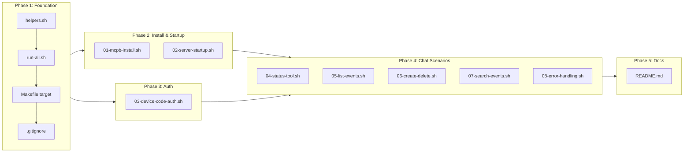

# Electron UI Acceptance Tests (Layer 6)

## Change Summary

Add local-only UI acceptance tests that automate Claude Desktop via Chrome DevTools Protocol (using `agent-browser`) to validate the full user journey: MCPB extension installation, MCP server startup, authentication flow, tool discovery, and chat-driven tool execution against real calendar data. These are the highest-fidelity tests in the testing pyramid — they prove the product works end-to-end from a real user's perspective.

## Motivation and Background

The testing pyramid (CR-0044 through CR-0047) covers protocol integration, HTTP replay, live Graph API, and LLM tool evaluation — but every layer stops short of the actual user experience. None of them validate:

1. **Does the `.mcpb` extension install correctly in Claude Desktop?** The extension packaging (CR-0029) produces a bundle with platform-specific binaries, a `manifest.json`, and a `user_config` schema. No automated test verifies that Claude Desktop can parse, install, and configure this bundle.

2. **Does Claude Desktop launch the MCP server correctly?** The `mcp_config` in `manifest.json` specifies the binary path, args, and environment variable mappings from `user_config`. No test verifies that Claude Desktop spawns the process with the correct configuration.

3. **Does the authentication flow complete through the UI?** Device code auth requires the user to see a URL and code, visit the page, and authenticate. Browser auth opens a system browser. Auth code flow requires pasting a redirect URL. No test validates these flows through Claude Desktop's UI.

4. **Does Claude select and execute MCP tools when chatting?** The LLM eval tests (CR-0047) verify tool selection in isolation using the API. But Claude Desktop has its own tool execution pipeline — tool approval prompts, result rendering, multi-turn follow-ups — that only a UI test can validate.

5. **Does the tool output render correctly in the chat?** Calendar event JSON, free/busy schedules, error messages — all must be readable in Claude Desktop's chat interface, not just valid JSON.

Claude Desktop is an Electron app built on Chromium. The `agent-browser` CLI (from `vercel-labs/agent-browser`) connects via Chrome DevTools Protocol (CDP) to any Electron app launched with `--remote-debugging-port`. This enables programmatic control: snapshot the DOM to identify interactive elements, click buttons, fill text fields, press keys, read text content, and take screenshots. The project already declares `agent-browser` as a managed tool in `.mise.toml` — running `mise install` provisions it alongside the rest of the toolchain.

## Change Drivers

* **No end-to-end user journey test**: Every other test layer validates a subsystem in isolation. Only a UI test proves the complete integration works.
* **MCPB install is untested**: The `.mcpb` extension format is validated structurally by `mcpb validate`, but never tested as an actual install-and-use flow.
* **Auth flows are untested in context**: The auth middleware is unit-tested, but the device code URL/code display, browser redirect, and auth code paste are never tested through Claude Desktop's UI.
* **Release confidence gap**: Before publishing a new `.mcpb` to the Anthropic Directory, there is no automated way to verify the complete user experience.

## Current State

### Testing Layers

| Layer | CR | What it tests | User journey coverage |
|---|---|---|---|
| L1: Unit | existing | Handler logic, serialization | None |
| L2: Protocol | CR-0044 | MCP tool discovery, schema, middleware | Server-side only |
| L3: VCR | CR-0045 | Graph API call/response fidelity | Server-side only |
| L4: E2E | CR-0046 | Live Graph API interactions | Server-side only |
| L5: Eval | CR-0047 | LLM tool selection from descriptions | API-only, no UI |
| **L6: UI** | **this CR** | **Full user journey through Claude Desktop** | **Complete** |

### Electron Skill and Toolchain

The project already has the `electron` skill installed (`.agents/skills/electron/SKILL.md`), which provides `agent-browser` automation for Electron apps. The `agent-browser` CLI is declared in `.mise.toml` as `"npm:agent-browser" = "latest"` and is provisioned automatically by `mise install` alongside all other project tools (Go, golangci-lint, goreleaser, mcpb, etc.).

The skill supports:

- Connecting to Electron apps via `--remote-debugging-port`
- DOM snapshots with interactive element identification (`@e1`, `@e2`, etc.)
- Click, fill, type, press, get-text operations
- Screenshot capture (standard, full-page, annotated)
- Tab/window management for multi-webview apps
- Named sessions for multi-app control

### Claude Desktop

Claude Desktop is an Electron app that:

- Supports MCP server configuration via `claude_desktop_config.json` or MCPB extension install
- Displays MCP tools in the chat interface with approval prompts
- Renders tool results as formatted content blocks in the chat
- Can be launched with `--remote-debugging-port=9222` for CDP access

### MCPB Extension

The project produces an `.mcpb` bundle (CR-0029) containing:

- `manifest.json` with `server.mcp_config` (binary path, env var mappings)
- Platform binaries (`darwin-arm64`, `win32-x64`)
- `user_config` schema (client_id, tenant_id, auth_method, timezone)
- Tool declarations (14 tools listed in manifest)

## Proposed Change

### 1. Test Script Directory

Create `test/ui/` containing shell scripts that orchestrate Claude Desktop automation via `agent-browser`. Each script is a self-contained test scenario that can be run independently.

```
test/ui/
  README.md               # Setup instructions, prerequisites, troubleshooting
  run-all.sh              # Orchestrator: runs all scenarios, reports pass/fail
  helpers.sh              # Shared functions: connect, snapshot, assert-text, screenshot
  01-mcpb-install.sh      # Scenario: install .mcpb extension
  02-server-startup.sh    # Scenario: verify server appears in MCP settings
  03-device-code-auth.sh  # Scenario: device code auth flow (semi-automated)
  04-status-tool.sh       # Scenario: call status tool via chat
  05-list-events.sh       # Scenario: list today's events via chat
  06-create-delete.sh     # Scenario: create and delete an event via chat
  07-search-events.sh     # Scenario: search events via chat
  08-error-handling.sh    # Scenario: verify error rendering for invalid requests
```

### 2. Helper Library (`helpers.sh`)

Shared functions that abstract common `agent-browser` operations:

```bash
#!/usr/bin/env bash
# helpers.sh — Shared functions for Claude Desktop UI tests.

set -euo pipefail

CDP_PORT="${CDP_PORT:-9222}"
AB="agent-browser --cdp ${CDP_PORT}"
SCREENSHOT_DIR="${SCREENSHOT_DIR:-test/ui/screenshots}"
PASS_COUNT=0
FAIL_COUNT=0

# connect_claude — Launch Claude Desktop with CDP and wait for ready.
connect_claude() {
  if ! $AB snapshot -i >/dev/null 2>&1; then
    echo "ERROR: Claude Desktop not reachable on CDP port ${CDP_PORT}."
    echo "Launch with: open -a 'Claude' --args --remote-debugging-port=${CDP_PORT}"
    exit 1
  fi
  echo "Connected to Claude Desktop on port ${CDP_PORT}"
}

# snapshot — Capture interactive elements and return the snapshot text.
snapshot() {
  $AB snapshot -i
}

# click_ref — Click an element by its @ref identifier.
click_ref() {
  local ref="$1"
  $AB click "$ref"
}

# fill_ref — Fill a text field by @ref with the given text.
fill_ref() {
  local ref="$1"
  local text="$2"
  $AB fill "$ref" "$text"
}

# type_text — Type text at the current focus point.
type_text() {
  local text="$1"
  $AB keyboard type "$text"
}

# press_key — Send a keyboard key press.
press_key() {
  local key="$1"
  $AB press "$key"
}

# get_text — Extract text content from an element.
get_text() {
  local ref="$1"
  $AB get text "$ref"
}

# wait_ms — Wait for a specified number of milliseconds.
wait_ms() {
  local ms="$1"
  $AB wait "$ms"
}

# screenshot — Take a screenshot with a descriptive name.
screenshot() {
  local name="$1"
  mkdir -p "$SCREENSHOT_DIR"
  $AB screenshot "${SCREENSHOT_DIR}/${name}.png"
}

# assert_text_visible — Assert that specific text appears in the current snapshot.
# Returns 0 on match, 1 on failure.
assert_text_visible() {
  local expected="$1"
  local description="${2:-text '$expected' visible}"
  local snap
  snap=$($AB snapshot -i 2>&1)
  if echo "$snap" | grep -qi "$expected"; then
    echo "  PASS: $description"
    PASS_COUNT=$((PASS_COUNT + 1))
    return 0
  else
    echo "  FAIL: $description (expected '$expected' not found)"
    screenshot "fail-$(date +%s)"
    FAIL_COUNT=$((FAIL_COUNT + 1))
    return 1
  fi
}

# assert_text_not_visible — Assert that specific text does NOT appear.
assert_text_not_visible() {
  local unexpected="$1"
  local description="${2:-text '$unexpected' not visible}"
  local snap
  snap=$($AB snapshot -i 2>&1)
  if echo "$snap" | grep -qi "$unexpected"; then
    echo "  FAIL: $description (unexpected '$unexpected' found)"
    screenshot "fail-$(date +%s)"
    FAIL_COUNT=$((FAIL_COUNT + 1))
    return 1
  else
    echo "  PASS: $description"
    PASS_COUNT=$((PASS_COUNT + 1))
    return 0
  fi
}

# wait_for_text — Poll until text appears or timeout.
# Usage: wait_for_text "expected text" 30 (timeout in seconds)
wait_for_text() {
  local expected="$1"
  local timeout="${2:-30}"
  local elapsed=0
  while [ $elapsed -lt $timeout ]; do
    if $AB snapshot -i 2>&1 | grep -qi "$expected"; then
      return 0
    fi
    sleep 2
    elapsed=$((elapsed + 2))
  done
  echo "  TIMEOUT: waiting for '$expected' after ${timeout}s"
  screenshot "timeout-$(date +%s)"
  return 1
}

# send_chat — Type a message in the Claude Desktop chat input and send it.
send_chat() {
  local message="$1"
  # Focus the chat input (typically the main textarea)
  local snap
  snap=$($AB snapshot -i 2>&1)
  # Find the chat input element — look for textarea or contenteditable
  local input_ref
  input_ref=$(echo "$snap" | grep -i "textarea\|contenteditable\|message\|chat" | head -1 | grep -oE '@e[0-9]+' | head -1)
  if [ -z "$input_ref" ]; then
    echo "  ERROR: Could not find chat input element"
    return 1
  fi
  $AB click "$input_ref"
  wait_ms 200
  $AB keyboard inserttext "$message"
  wait_ms 200
  $AB press Enter
}

# report — Print final pass/fail summary.
report() {
  local total=$((PASS_COUNT + FAIL_COUNT))
  echo ""
  echo "========================================"
  echo "  Results: ${PASS_COUNT} passed, ${FAIL_COUNT} failed (${total} total)"
  echo "========================================"
  if [ "$FAIL_COUNT" -gt 0 ]; then
    echo "  Screenshots saved to: ${SCREENSHOT_DIR}/"
    return 1
  fi
  return 0
}
```

### 3. Example Test Scenario: Status Tool (`04-status-tool.sh`)

```bash
#!/usr/bin/env bash
# 04-status-tool.sh — Verify the status tool works via Claude Desktop chat.

set -euo pipefail
SCRIPT_DIR="$(cd "$(dirname "$0")" && pwd)"
source "${SCRIPT_DIR}/helpers.sh"

echo "=== Scenario 4: Status Tool via Chat ==="

connect_claude
screenshot "04-before"

# Send a prompt that should trigger the status tool.
send_chat "What is the current status of the Outlook MCP server? Use the status tool."

# Wait for the tool call to complete (status tool has no auth requirement).
wait_for_text "uptime" 30

# Assert key status fields are visible in the response.
assert_text_visible "version" "status response contains version"
assert_text_visible "timezone" "status response contains timezone"
assert_text_visible "uptime" "status response contains uptime"

screenshot "04-after"
report
```

### 4. Example Test Scenario: MCPB Install (`01-mcpb-install.sh`)

```bash
#!/usr/bin/env bash
# 01-mcpb-install.sh — Install .mcpb extension and verify it appears in settings.

set -euo pipefail
SCRIPT_DIR="$(cd "$(dirname "$0")" && pwd)"
source "${SCRIPT_DIR}/helpers.sh"

MCPB_PATH="${MCPB_PATH:-outlook-local-mcp.mcpb}"

echo "=== Scenario 1: MCPB Extension Install ==="

if [ ! -f "$MCPB_PATH" ]; then
  echo "ERROR: MCPB file not found at ${MCPB_PATH}"
  echo "Build with: make mcpb-pack"
  exit 1
fi

connect_claude
screenshot "01-before"

# Open the extension file — Claude Desktop handles .mcpb via file association.
open "$MCPB_PATH"
wait_ms 3000

# Wait for the install confirmation dialog.
wait_for_text "install" 15

# Find and click the install/confirm button.
snap=$(snapshot)
install_ref=$(echo "$snap" | grep -i "install\|confirm\|add" | grep -oE '@e[0-9]+' | head -1)
if [ -n "$install_ref" ]; then
  click_ref "$install_ref"
  wait_ms 2000
fi

# Verify the extension appears in settings.
# Navigate to Settings > Extensions.
# (Element refs will vary by Claude Desktop version — snapshot to discover)
wait_for_text "Outlook" 15
assert_text_visible "Outlook" "extension name visible after install"

screenshot "01-after"
report
```

### 5. Test Orchestrator (`run-all.sh`)

```bash
#!/usr/bin/env bash
# run-all.sh — Run all UI acceptance test scenarios.

set -euo pipefail
SCRIPT_DIR="$(cd "$(dirname "$0")" && pwd)"

CDP_PORT="${CDP_PORT:-9222}"
TOTAL_PASS=0
TOTAL_FAIL=0
RESULTS=()

echo "========================================"
echo "  Outlook MCP — UI Acceptance Tests"
echo "  CDP Port: ${CDP_PORT}"
echo "========================================"
echo ""

# Verify prerequisites (agent-browser is managed via mise — see .mise.toml).
if ! command -v agent-browser &>/dev/null; then
  echo "ERROR: agent-browser not found."
  echo "Run 'mise install' to provision all project tools (including agent-browser)."
  exit 1
fi

if ! agent-browser --cdp "${CDP_PORT}" snapshot -i &>/dev/null; then
  echo "ERROR: Claude Desktop not reachable on CDP port ${CDP_PORT}."
  echo ""
  echo "Launch Claude Desktop with CDP enabled:"
  echo "  open -a 'Claude' --args --remote-debugging-port=${CDP_PORT}"
  echo ""
  echo "Then re-run: $0"
  exit 1
fi

# Run each scenario script.
for script in "${SCRIPT_DIR}"/[0-9][0-9]-*.sh; do
  name=$(basename "$script" .sh)
  echo "--- Running: ${name} ---"
  if bash "$script"; then
    RESULTS+=("PASS: ${name}")
    TOTAL_PASS=$((TOTAL_PASS + 1))
  else
    RESULTS+=("FAIL: ${name}")
    TOTAL_FAIL=$((TOTAL_FAIL + 1))
  fi
  echo ""
done

# Final summary.
echo "========================================"
echo "  Final Results"
echo "========================================"
for r in "${RESULTS[@]}"; do
  echo "  $r"
done
echo ""
echo "  ${TOTAL_PASS} passed, ${TOTAL_FAIL} failed"
echo "========================================"

if [ "$TOTAL_FAIL" -gt 0 ]; then
  exit 1
fi
```

### 6. Makefile Target

```makefile
ui-test:
	@echo "Running UI acceptance tests against Claude Desktop..."
	@echo "Ensure Claude Desktop is running with: open -a 'Claude' --args --remote-debugging-port=9222"
	bash test/ui/run-all.sh
```

### 7. Prerequisites Documentation

A `test/ui/README.md` documents:

1. **Provision toolchain**: `mise install` — provisions `agent-browser` (and all other project tools) from `.mise.toml`. No global npm install needed.
2. **Launch Claude Desktop with CDP**: `open -a 'Claude' --args --remote-debugging-port=9222`
3. **Build the MCPB bundle** (for install tests): `make mcpb-pack`
4. **Authenticate** (for tool execution tests): Complete device code auth before running chat scenarios
5. **Environment variables**: `CDP_PORT` (default: 9222), `MCPB_PATH` (default: `outlook-local-mcp.mcpb`), `SCREENSHOT_DIR` (default: `test/ui/screenshots`)
6. **Running individual scenarios**: `bash test/ui/04-status-tool.sh`
7. **Running all scenarios**: `make ui-test`
8. **Troubleshooting**: Common issues (CDP connection refused, element not found, timeouts, `mise install` failures)

## Requirements

### Functional Requirements

1. A `test/ui/` directory **MUST** be created with shell-based test scenarios.
2. A `test/ui/helpers.sh` shared library **MUST** provide functions for: connecting to Claude Desktop, snapshotting DOM, clicking elements, filling text fields, typing text, pressing keys, extracting text, waiting for text, sending chat messages, taking screenshots, and asserting text visibility.
3. The `connect_claude()` helper **MUST** verify Claude Desktop is reachable on the configured CDP port and exit with a clear error message if not.
4. The `send_chat()` helper **MUST** locate the chat input element via DOM snapshot, type the message, and press Enter to send.
5. The `assert_text_visible()` helper **MUST** take a snapshot, search for the expected text (case-insensitive), log PASS/FAIL, take a screenshot on failure, and track pass/fail counts.
6. The `wait_for_text()` helper **MUST** poll with a configurable timeout (default 30s) and return failure on timeout.
7. Each test scenario **MUST** be a self-contained shell script in `test/ui/` prefixed with a two-digit number for ordering.
8. A `test/ui/run-all.sh` orchestrator **MUST** run all numbered scenarios in order and report a final pass/fail summary.
9. Scenario `01-mcpb-install.sh` **MUST** open the `.mcpb` file, wait for the install dialog, confirm installation, and verify the extension appears.
10. Scenario `02-server-startup.sh` **MUST** verify the MCP server is listed in Claude Desktop's settings/extensions with a running status indicator.
11. Scenario `03-device-code-auth.sh` **MUST** trigger a tool call that requires auth, detect the device code URL/code in the chat, and pause for manual authentication (semi-automated).
12. Scenario `04-status-tool.sh` **MUST** send a chat prompt that triggers the `status` tool and assert that version, timezone, and uptime appear in the response.
13. Scenario `05-list-events.sh` **MUST** send a chat prompt that triggers `list_events` and assert that calendar event data appears in the response.
14. Scenario `06-create-delete.sh` **MUST** send a prompt to create a test event, verify it was created, then send a prompt to delete it and verify deletion.
15. Scenario `07-search-events.sh` **MUST** send a prompt to search for events and verify that search results appear.
16. Scenario `08-error-handling.sh` **MUST** send a prompt with an invalid event ID and verify that an error message is rendered in the chat.
17. The `Makefile` **MUST** include a `ui-test` target that runs `test/ui/run-all.sh`.
18. A `test/ui/README.md` **MUST** document all prerequisites (`mise install` for toolchain provisioning, Claude Desktop CDP launch, MCPB build, authentication), environment variables, individual/batch execution, and troubleshooting.
19. All test scenarios **MUST** take before/after screenshots saved to `test/ui/screenshots/`.
20. The `test/ui/screenshots/` directory **MUST** be added to `.gitignore`.
21. UI tests **MUST** be runnable locally with `make ui-test` after launching Claude Desktop with CDP enabled.
22. UI tests **MUST NOT** be included in `make ci` or any GitHub Actions workflow (they require a desktop environment, Claude Desktop, and interactive authentication).

### Non-Functional Requirements

1. Each individual test scenario **MUST** complete within 60 seconds (excluding manual authentication pauses).
2. The full test suite **MUST** complete within 10 minutes.
3. All shell scripts **MUST** use `set -euo pipefail` for strict error handling.
4. All shell scripts **MUST** include a header comment describing the scenario's purpose.
5. Screenshot filenames **MUST** include the scenario number and a descriptive suffix (e.g., `04-before.png`, `04-after.png`, `fail-1711054321.png`).
6. The helper library **MUST NOT** depend on any tool beyond `bash`, `agent-browser` (provisioned via `mise install`), `grep`, `sed`, `date`, and standard POSIX utilities.

## Affected Components

| Component | Change |
|-----------|--------|
| `test/ui/README.md` (new) | Prerequisites, setup, execution, and troubleshooting documentation |
| `test/ui/helpers.sh` (new) | Shared helper library for agent-browser automation |
| `test/ui/run-all.sh` (new) | Test orchestrator script |
| `test/ui/01-mcpb-install.sh` (new) | MCPB extension installation scenario |
| `test/ui/02-server-startup.sh` (new) | Server startup verification scenario |
| `test/ui/03-device-code-auth.sh` (new) | Device code authentication scenario (semi-automated) |
| `test/ui/04-status-tool.sh` (new) | Status tool chat scenario |
| `test/ui/05-list-events.sh` (new) | List events chat scenario |
| `test/ui/06-create-delete.sh` (new) | Create and delete event chat scenario |
| `test/ui/07-search-events.sh` (new) | Search events chat scenario |
| `test/ui/08-error-handling.sh` (new) | Error rendering chat scenario |
| `Makefile` | Add `ui-test` target |
| `.gitignore` | Add `test/ui/screenshots/` pattern |

## Scope Boundaries

### In Scope

* `test/ui/` directory with shell-based test scenarios
* `helpers.sh` shared library for agent-browser operations
* `run-all.sh` orchestrator with pass/fail summary
* 8 test scenarios covering: MCPB install, server startup, device code auth, status tool, list events, create/delete event, search events, error handling
* `make ui-test` Makefile target
* `test/ui/README.md` prerequisites and setup documentation
* Screenshot capture on failure for debugging
* `.gitignore` update for screenshots

### Out of Scope ("Here, But Not Further")

* **GitHub Actions CI**: UI tests require a desktop environment and Claude Desktop — not suitable for CI runners. Local-only.
* **Browser auth flow automation**: Browser auth opens the system browser, which is a separate process. Automating Microsoft's OAuth consent page is fragile and out of scope. Device code flow is semi-automated (the script pauses for manual auth).
* **Mail tool scenarios**: Mail tools (CR-0043) are behind an opt-in flag. Testing them requires `OUTLOOK_MCP_MAIL_ENABLED=true` and adds complexity. Future extension.
* **Multi-account scenarios**: Testing `add_account` / `remove_account` through the UI requires multiple Microsoft accounts. Future extension.
* **Cross-platform testing**: Scripts target macOS (`open -a 'Claude'`). Windows/Linux adaptations are future work.
* **Visual regression testing**: Screenshots are captured for debugging but not compared pixel-by-pixel against baselines.
* **Claude Desktop version pinning**: Element references (`@e1`, `@e2`) may change across Claude Desktop versions. Scripts use text-based element discovery rather than hardcoded refs.
* **Automatic Claude Desktop launch**: The user must launch Claude Desktop with `--remote-debugging-port` manually. Auto-launch is fragile and platform-dependent.

## Impact Assessment

### User Impact

None. This CR adds developer-facing test infrastructure only. No tool descriptions, server behavior, or user-facing functionality are changed.

### Technical Impact

Minimal. Shell scripts in `test/ui/` are completely isolated from the Go codebase. No Go code changes. The only production file changes are `.gitignore` (one line) and `Makefile` (one target).

### Security Impact

None. The CDP connection is localhost-only (port 9222). No credentials are stored in scripts — authentication is performed interactively through Claude Desktop's UI. Screenshots may capture sensitive calendar data and are excluded from git via `.gitignore`.

### Business Impact

Provides the highest-confidence validation before publishing a new `.mcpb` to the Anthropic Directory. Catches integration issues (install failures, auth breakage, tool rendering bugs) that no other test layer can detect.

## Implementation Approach

### Prerequisites

1. **Provision toolchain**: `mise install` — installs `agent-browser` and all other project tools from `.mise.toml`. No global npm install needed.
2. **Build MCPB bundle**: `make mcpb-pack` (produces `outlook-local-mcp.mcpb`)
3. **Launch Claude Desktop with CDP**: `open -a 'Claude' --args --remote-debugging-port=9222`
4. **Authenticate once**: Complete device code auth through the UI before running chat scenarios

### Phase 1: Helper Library and Orchestrator

1. Create `test/ui/helpers.sh` with all shared functions.
2. Create `test/ui/run-all.sh` orchestrator.
3. Add `ui-test` target to Makefile.
4. Add `test/ui/screenshots/` to `.gitignore`.

### Phase 2: Install and Startup Scenarios

1. Create `01-mcpb-install.sh` — open `.mcpb`, confirm install, verify extension appears.
2. Create `02-server-startup.sh` — verify server listed in MCP settings.

### Phase 3: Authentication Scenario

1. Create `03-device-code-auth.sh` — trigger auth, detect code display, pause for manual auth, verify success.

### Phase 4: Chat Tool Scenarios

1. Create `04-status-tool.sh` — status tool via chat prompt.
2. Create `05-list-events.sh` — list events via chat prompt.
3. Create `06-create-delete.sh` — create then delete event via chat.
4. Create `07-search-events.sh` — search events via chat prompt.
5. Create `08-error-handling.sh` — invalid event ID error rendering.

### Phase 5: Documentation

1. Create `test/ui/README.md` with complete setup and troubleshooting guide.

### Implementation Flow



## Test Strategy

### Tests to Add

| Script | Scenario | What it validates |
|--------|----------|-------------------|
| `01-mcpb-install.sh` | MCPB extension install | `.mcpb` file opens, install dialog appears, extension registered |
| `02-server-startup.sh` | Server listed in settings | MCP server appears in Claude Desktop settings with running status |
| `03-device-code-auth.sh` | Device code auth flow | Auth trigger, code display, manual auth, success confirmation |
| `04-status-tool.sh` | Status tool via chat | Chat prompt triggers `status`, response shows version/timezone/uptime |
| `05-list-events.sh` | List events via chat | Chat prompt triggers `list_events`, calendar data visible in response |
| `06-create-delete.sh` | Create + delete lifecycle | Create event visible, then delete confirmed — full write cycle |
| `07-search-events.sh` | Search events via chat | Chat prompt triggers `search_events`, results visible |
| `08-error-handling.sh` | Error rendering | Invalid event ID → error message rendered in chat (not crash) |

### Tests to Modify

Not applicable.

### Tests to Remove

Not applicable.

## Acceptance Criteria

### AC-1: Helper library exists and works

```gherkin
Given test/ui/helpers.sh is sourced
When connect_claude is called with Claude Desktop running on CDP port 9222
Then the function MUST succeed and print a connection confirmation
```

### AC-2: Orchestrator runs all scenarios

```gherkin
Given test/ui/run-all.sh is executed
Then it MUST verify agent-browser is available (installed via mise)
  And it MUST print a clear error referencing mise install if agent-browser is missing
  And it MUST verify Claude Desktop is reachable on CDP
  And it MUST run all numbered scenario scripts in order
  And it MUST print a final pass/fail summary
  And it MUST exit with code 0 if all pass, 1 if any fail
```

### AC-3: MCPB install scenario

```gherkin
Given Claude Desktop is running with CDP enabled
  And a valid .mcpb file exists
When 01-mcpb-install.sh is executed
Then it MUST open the .mcpb file
  And it MUST detect the install confirmation dialog
  And it MUST verify the extension name "Outlook" appears after install
```

### AC-4: Server startup scenario

```gherkin
Given the MCPB extension is installed in Claude Desktop
When 02-server-startup.sh is executed
Then it MUST verify the MCP server appears in Claude Desktop's settings or extension list
```

### AC-5: Device code auth scenario

```gherkin
Given the MCP server requires authentication
When 03-device-code-auth.sh is executed
Then it MUST trigger a tool call that requires auth
  And it MUST detect the device code URL or code in the chat output
  And it MUST pause for manual authentication (with clear instructions printed to terminal)
  And after manual auth completes, it MUST verify the tool call succeeds
```

### AC-6: Status tool scenario

```gherkin
Given Claude Desktop is authenticated with the MCP server
When 04-status-tool.sh sends a chat prompt requesting server status
Then the response MUST contain version, timezone, and uptime information
```

### AC-7: List events scenario

```gherkin
Given Claude Desktop is authenticated with the MCP server
When 05-list-events.sh sends a chat prompt requesting today's events
Then the response MUST contain calendar event data or a "no events" message
```

### AC-8: Create and delete scenario

```gherkin
Given Claude Desktop is authenticated with the MCP server
When 06-create-delete.sh sends a prompt to create a test event
Then the response MUST confirm event creation
When the script sends a prompt to delete the created event
Then the response MUST confirm event deletion
```

### AC-9: Search events scenario

```gherkin
Given Claude Desktop is authenticated with the MCP server
When 07-search-events.sh sends a search prompt
Then the response MUST contain search results or a "no results" message
```

### AC-10: Error handling scenario

```gherkin
Given Claude Desktop is authenticated with the MCP server
When 08-error-handling.sh sends a prompt referencing a non-existent event ID
Then the response MUST contain an error message
  And Claude Desktop MUST NOT crash or become unresponsive
```

### AC-11: Makefile target

```gherkin
Given the Makefile
When make ui-test is run
Then it MUST execute test/ui/run-all.sh
```

### AC-12: Screenshots on failure

```gherkin
Given a test assertion fails
Then a screenshot MUST be saved to test/ui/screenshots/
  And the filename MUST include a timestamp for uniqueness
```

### AC-13: Screenshots excluded from git

```gherkin
Given the .gitignore file
Then it MUST contain a pattern that excludes test/ui/screenshots/
```

### AC-14: Prerequisites documentation

```gherkin
Given test/ui/README.md exists
Then it MUST document mise install as the way to provision agent-browser and the project toolchain
  And it MUST NOT instruct users to run npm install -g agent-browser
  And it MUST document how to launch Claude Desktop with CDP enabled
  And it MUST document how to build the .mcpb bundle
  And it MUST document how to authenticate before running chat scenarios
  And it MUST document all configurable environment variables (CDP_PORT, MCPB_PATH, SCREENSHOT_DIR)
  And it MUST document how to run individual scenarios and the full suite
  And it MUST include a troubleshooting section
```

### AC-15: Local-only execution

```gherkin
Given the test/ui/ directory
Then the ui-test Makefile target MUST NOT be included in make ci
  And no GitHub Actions workflow MUST reference ui-test
  And the README MUST clearly state these are local-only tests
```

## Quality Standards Compliance

### Build & Compilation

- [ ] Code compiles/builds without errors (Go code unchanged)
- [ ] No new compiler warnings introduced

### Linting & Code Style

- [ ] All linter checks pass with zero warnings/errors
- [ ] Shell scripts pass `shellcheck` with no errors
- [ ] Any shellcheck exceptions are documented with justification

### Test Execution

- [ ] All existing tests pass after implementation
- [ ] All UI test scenarios pass when prerequisites are met

### Documentation

- [ ] `test/ui/README.md` provides complete setup and usage instructions
- [ ] Each scenario script includes a header comment

### Code Review

- [ ] Changes submitted via pull request
- [ ] PR title follows Conventional Commits format
- [ ] Code review completed and approved
- [ ] Changes squash-merged to maintain linear history

### Verification Commands

```bash
# Provision all project tools (including agent-browser) via mise
mise install

# Build verification (no Go changes)
go build ./...

# Full CI check (ui-test NOT included)
make ci

# Launch Claude Desktop with CDP
open -a 'Claude' --args --remote-debugging-port=9222

# Run a single scenario
bash test/ui/04-status-tool.sh

# Run all UI tests
make ui-test
```

## Risks and Mitigation

### Risk 1: Claude Desktop DOM structure changes across versions

**Likelihood:** high (Electron apps evolve frequently)
**Impact:** medium — element discovery may break, causing false failures.
**Mitigation:** Scripts use text-based element discovery (grep on snapshot output for keywords like "install", "textarea", "settings") rather than hardcoded `@eN` references. The `send_chat()` helper searches for textarea/contenteditable elements dynamically. When Claude Desktop updates, a single snapshot call reveals the new DOM structure, and scripts can be updated in minutes.

### Risk 2: LLM non-determinism in chat scenarios

**Likelihood:** high
**Impact:** medium — Claude may not always call the expected tool or may phrase responses differently.
**Mitigation:** Assertions check for broad patterns (e.g., "version", "timezone", "uptime" for status; "created", "scheduled" for create) rather than exact strings. The `wait_for_text` helper polls with timeout to handle variable response times. Prompts include explicit tool name hints (e.g., "Use the status tool") to improve determinism.

### Risk 3: Authentication state dependency

**Likelihood:** medium
**Impact:** high — chat scenarios fail if not authenticated.
**Mitigation:** Scenario ordering (`03-device-code-auth.sh` runs before chat scenarios). The `03` script is semi-automated — it pauses for manual authentication. The `run-all.sh` orchestrator runs scripts in order. Documentation makes the auth prerequisite explicit.

### Risk 4: `agent-browser` availability and compatibility

**Likelihood:** low
**Impact:** high — tests cannot run without the tool.
**Mitigation:** `agent-browser` is declared in `.mise.toml` and provisioned automatically by `mise install` alongside the rest of the toolchain. `run-all.sh` checks for its presence before running any scenarios and directs the user to `mise install` if missing. The tool is actively maintained by Vercel Labs and compatible with all Chromium-based apps. The mise-managed version is pinned to `latest` and can be locked to a specific version if compatibility issues arise.

### Risk 5: Screenshots capture sensitive calendar data

**Likelihood:** high (by design — screenshots show real calendar events)
**Impact:** medium — data leak risk if committed to git.
**Mitigation:** `test/ui/screenshots/` is in `.gitignore`. The `README.md` warns that screenshots may contain PII. Screenshots are stored locally only.

### Risk 6: macOS-only launch command

**Likelihood:** certain (scripts use `open -a 'Claude'`)
**Impact:** low — project only supports macOS and Windows (per manifest), and Windows users are a future extension.
**Mitigation:** Documented as macOS-only in Scope Boundaries. The `helpers.sh` does not include the launch command — it only connects to an already-running CDP port. Users on other platforms can launch Claude Desktop manually with the `--remote-debugging-port` flag and the scripts will work once connected.

## Dependencies

* CR-0029 (MCPB Extension Packaging) — `.mcpb` bundle used by install scenario
* CR-0003 (Authentication) — device code flow tested in auth scenario
* CR-0006 (Read-Only Tools) — `list_events`, `search_events`, `get_event` tested in chat scenarios
* CR-0008 (Create & Update) — `create_event` tested in create/delete scenario
* CR-0009 (Delete & Cancel) — `delete_event` tested in create/delete scenario
* CR-0037 (Status Tool) — `status` tested in status scenario
* Electron skill (`.agents/skills/electron/`) — `agent-browser` CLI

## Estimated Effort

| Phase | Description | Estimate |
|-------|-------------|----------|
| Phase 1 | Helper library, orchestrator, Makefile, .gitignore | 3 hours |
| Phase 2 | MCPB install and server startup scenarios | 2 hours |
| Phase 3 | Device code auth scenario (semi-automated) | 1.5 hours |
| Phase 4 | Chat tool scenarios (5 scripts) | 4 hours |
| Phase 5 | README documentation | 1 hour |
| **Total** | | **11.5 hours** |

## Decision Outcome

Chosen approach: **Shell-based `agent-browser` automation scripts in `test/ui/`**, because:

1. **No Go code needed**: Shell scripts are the natural choice for orchestrating an external Electron app. Adding a Go test framework for UI automation would be over-engineering.
2. **Self-contained scenarios**: Each script tests one user journey. Scripts can be run individually during development or as a batch for release validation.
3. **Leverages existing skill**: The project already has the `electron` skill installed, providing the `agent-browser` CLI and documentation.
4. **Screenshot debugging**: Automatic screenshot capture on failure provides visual evidence of what went wrong, which is essential for UI test debugging.
5. **Semi-automated auth**: The device code flow requires human interaction (visiting a URL). The semi-automated approach (script pauses, human authenticates, script resumes) is pragmatic and honest about the limitation.
6. **Local-only by design**: UI tests inherently require a desktop environment and an interactive Claude Desktop session. Not pretending they can run in CI avoids brittle workarounds.

Alternatives considered:

- **Playwright/Puppeteer**: General-purpose browser automation. More powerful but requires a full Node.js test framework, doesn't natively support Electron app connection, and is overkill for 8 scenarios. `agent-browser` is purpose-built for Electron CDP automation.
- **Go-based CDP client** (e.g., `chromedp`): Would allow writing UI tests in Go, matching the project's language. But adds a heavy dependency for a small number of local-only scripts, and shell is more natural for process orchestration and text assertions.
- **Manual testing checklist**: A documented checklist of manual steps. No automation, no regression detection, no screenshot evidence. The current approach automates 90% of the checklist while allowing human intervention only where necessary (auth).
- **Xdotool/AppleScript UI automation**: OS-level input simulation. Extremely fragile — depends on window positions, focus state, and pixel coordinates. CDP-based automation is far more reliable because it operates on the DOM, not the screen.

## Related Items

* CR-0029 — MCPB Extension Packaging (`.mcpb` bundle tested by install scenario)
* CR-0003 — Authentication (device code flow tested in auth scenario)
* CR-0006 — Read-Only Tools (calendar tools tested in chat scenarios)
* CR-0008 — Create & Update Event Tools (create event tested in lifecycle scenario)
* CR-0009 — Delete & Cancel Event Tools (delete event tested in lifecycle scenario)
* CR-0037 — Status Diagnostic Tool (status tested in chat scenario)
* CR-0044 — MCP Protocol Integration Tests (Layer 2 — protocol-level, complements Layer 6 UI)
* CR-0045 — VCR Replay Tests (Layer 3 — HTTP replay, complements Layer 6 UI)
* CR-0046 — E2E Live Graph API Tests (Layer 4 — live API, complements Layer 6 UI)
* CR-0047 — LLM-Driven Tool Eval Tests (Layer 5 — tool selection, complements Layer 6 UI)
