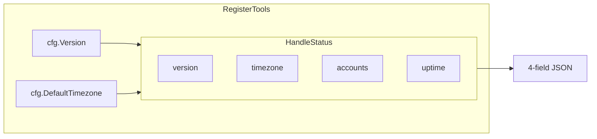
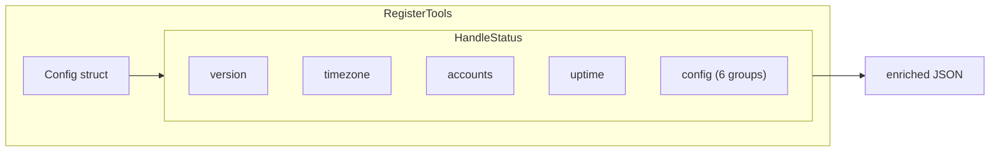

# Status Tool: Expose Runtime Configuration

## Change Summary

The `status` tool currently returns only four fields: `version`, `timezone`, `accounts`, and `server_uptime_seconds`. Operators and automated test protocols (e.g. `mcp-tool-crud-test.md`) need to verify runtime configuration (log level, log file path, token storage backend, auth method, read-only mode, etc.) but must resort to reading log files and parsing startup entries. This CR adds a `config` object to the status response that surfaces all effective runtime configuration values with their sources (environment variable, default, or inferred).

## Motivation and Background

Three concrete problems motivate this change:

1. **Debugging configuration issues** -- When a user reports that events are created with the wrong timezone or that audit logs are missing, the first question is "what configuration is the server actually running with?" Today the answer requires reading the log file, finding the most recent `"server starting"` entry, and manually extracting fields. The status tool should answer this directly.

2. **Automated test protocols** -- The CRUD lifecycle test (`docs/prompts/mcp-tool-crud-test.md`) needs to verify that the server is running with `LOG_LEVEL=debug` and file logging enabled before proceeding. Step 0b currently instructs the agent to locate and parse the log file -- a fragile approach that depends on the log file being accessible and the startup entry format remaining stable. A structured status response eliminates this.

3. **Multi-account debugging** -- When `add_account` fails or a secondary account shows `authenticated: false`, operators need to know which `client_id`, `tenant_id`, and `auth_method` are in effect. The current status response provides no identity configuration.

## Current State

The `status` tool (`internal/tools/status.go`) returns a `statusResponse` struct with four fields:

```go
type statusResponse struct {
    Version             string          `json:"version"`
    Timezone            string          `json:"timezone"`
    Accounts            []statusAccount `json:"accounts"`
    ServerUptimeSeconds int64           `json:"server_uptime_seconds"`
}
```

The handler (`HandleStatus`) receives `version` and `timezone` as string arguments, plus the account registry and start time. It has no access to the full `Config` struct.

The `Config` struct (`internal/config/config.go`) contains 25 fields covering identity, auth, logging, retry, timeout, observability, mail, provenance, and version. None of these are exposed via any MCP tool.

### Current State Diagram



## Proposed Change

Add a `config` object to the status response that includes all effective runtime configuration values, grouped by category. Each config entry includes the effective value and whether it came from an environment variable, was inferred, or is the default.

### Proposed Response Shape

```json
{
  "version": "1.2.0",
  "timezone": "Europe/Stockholm",
  "accounts": [...],
  "server_uptime_seconds": 3600,
  "config": {
    "identity": {
      "client_id": "dd5fc5c5-...",
      "tenant_id": "common",
      "auth_method": "device_code",
      "auth_method_source": "inferred"
    },
    "logging": {
      "log_level": "debug",
      "log_format": "json",
      "log_file": "/path/to/outlook-local-mcp.log",
      "log_sanitize": true,
      "audit_log_enabled": true,
      "audit_log_path": ""
    },
    "storage": {
      "token_storage": "auto",
      "token_cache_backend": "keychain",
      "auth_record_path": "/Users/.../.outlook-local-mcp/auth_record.json",
      "accounts_path": "/Users/.../.outlook-local-mcp/accounts.json",
      "cache_name": "outlook-local-mcp"
    },
    "graph_api": {
      "max_retries": 3,
      "retry_backoff_ms": 1000,
      "request_timeout_seconds": 30,
      "shutdown_timeout_seconds": 15
    },
    "features": {
      "read_only": false,
      "mail_enabled": false,
      "provenance_tag": "com.github.desek.outlook-local-mcp.created"
    },
    "observability": {
      "otel_enabled": false,
      "otel_endpoint": "",
      "otel_service_name": "outlook-local-mcp"
    }
  }
}
```

### Key Design Decisions

1. **Grouped by category** -- Rather than a flat list of 24 fields, the config is organized into 6 logical groups (identity, logging, storage, graph_api, features, observability) for readability.

2. **`auth_method_source`** -- Since `auth_method` can be explicitly set, inferred from the client ID, or defaulted, include a `source` field (`"explicit"`, `"inferred"`, or `"default"`) to aid debugging.

3. **`token_cache_backend`** -- The `token_storage` config value (`"auto"`, `"keychain"`, `"file"`) doesn't tell you what actually resolved. Add a field that reports the actual backend in use (`"keychain"` or `"file"`), which is what test protocols need.

4. **Sensitive value redaction** -- `client_id` is not a secret (it's a public application ID). No config values in this struct are secrets -- tokens and credentials are never stored in `Config`. No redaction is needed.

5. **No additional Graph API calls** -- The config is read from the in-memory `Config` struct, maintaining the status tool's zero-network-call guarantee.

### Proposed State Diagram



### Implementation Detail

1. **Pass `Config` to `HandleStatus`** -- Change the `HandleStatus` signature from `(version, timezone string, ...)` to `(cfg config.Config, ...)`. The handler already receives `version` and `timezone` from `cfg`; this consolidates to a single parameter. The `version` and `timezone` top-level fields remain for backward compatibility.

2. **Add `token_cache_backend` to Config** -- After token cache initialization in `main.go`, set a new `Config.TokenCacheBackend` field to `"keychain"` or `"file"` based on which backend was actually initialized. This is a runtime-resolved value, not an env var.

3. **Add `auth_method_source` to Config** -- Extend `InferAuthMethod` to return both the method and its source, or add a separate `AuthMethodSource` field to `Config` set during `LoadConfig`.

4. **Build nested response** -- The handler constructs the `config` object from the `Config` struct fields, mapping each to the appropriate category.

## Requirements

### Functional Requirements

1. The `status` tool response **MUST** include a `config` top-level object containing the server's effective runtime configuration.
2. The `config` object **MUST** be organized into six groups: `identity`, `logging`, `storage`, `graph_api`, `features`, and `observability`.
3. The `identity` group **MUST** include `client_id`, `tenant_id`, `auth_method`, and `auth_method_source`.
4. The `auth_method_source` field **MUST** report `"explicit"` when `OUTLOOK_MCP_AUTH_METHOD` is set, `"inferred"` when the resolved client ID matched a well-known UUID in `WellKnownClientIDs`, or `"default"` when the client ID did not match any well-known UUID and the fallback method (`"browser"`) was used.
5. The `logging` group **MUST** include `log_level`, `log_format`, `log_file`, `log_sanitize`, `audit_log_enabled`, and `audit_log_path`.
6. The `storage` group **MUST** include `token_storage`, `token_cache_backend`, `auth_record_path`, `accounts_path`, and `cache_name`.
7. The `token_cache_backend` field **MUST** report the actual resolved backend (`"keychain"` or `"file"`), not the configured preference.
8. The `graph_api` group **MUST** include `max_retries`, `retry_backoff_ms`, `request_timeout_seconds`, and `shutdown_timeout_seconds`.
9. The `features` group **MUST** include `read_only`, `mail_enabled`, and `provenance_tag`.
10. The `observability` group **MUST** include `otel_enabled`, `otel_endpoint`, and `otel_service_name`.
11. The existing top-level fields (`version`, `timezone`, `accounts`, `server_uptime_seconds`) **MUST** remain unchanged for backward compatibility.
12. The `HandleStatus` function **MUST** accept the full `Config` struct instead of individual `version` and `timezone` string parameters.

### Non-Functional Requirements

1. The status tool **MUST** continue to make zero Graph API calls and complete within 100ms.
2. The status response **MUST NOT** include any secrets (tokens, passwords, keys). All `Config` fields are non-secret by design; this requirement guards against future field additions.
3. All new struct types and fields **MUST** include Go doc comments per project documentation standards.

## Affected Components

| Component | Change |
|-----------|--------|
| `internal/tools/status.go` | Add config groups to `statusResponse`, change `HandleStatus` to accept `Config`, add `statusConfig*` struct types |
| `internal/config/config.go` | Add `TokenCacheBackend` and `AuthMethodSource` fields to `Config` |
| `internal/config/config.go` | Modify `InferAuthMethod` to also populate `AuthMethodSource` |
| `internal/server/server.go` | Pass full `cfg` to `HandleStatus` instead of `cfg.Version, cfg.DefaultTimezone` |
| `cmd/outlook-local-mcp/main.go` | Set `cfg.TokenCacheBackend` after token cache initialization |

## Scope Boundaries

### In Scope

- Adding `config` object to status response with 6 groups and all `Config` fields
- Adding `token_cache_backend` (runtime-resolved) and `auth_method_source` (load-time) to `Config`
- Changing `HandleStatus` signature to accept `Config`
- Updating `mcp-tool-crud-test.md` Step 0 to use the status tool's config instead of parsing log files

### Out of Scope

- Adding a `config` MCP tool for runtime configuration changes (config is immutable after startup)
- Exposing per-account identity config (client_id, tenant_id per account) -- that belongs in `list_accounts` via a separate CR
- Adding an `output` parameter to the status tool (the response is small enough that summary/raw distinction adds no value)
- Changing the status tool description in `extension/manifest.json` (the tool name and purpose are unchanged)

## Impact Assessment

### User Impact

Operators can now call `status` and immediately see all runtime configuration without reading log files. Automated test protocols can verify prerequisites (log level, log file, token cache) in a single structured tool call instead of fragile log parsing.

### Technical Impact

- **Breaking change to `HandleStatus` signature** -- `HandleStatus(version, timezone string, ...)` becomes `HandleStatus(cfg config.Config, ...)`. This is an internal API change; no external consumers are affected since the function is only called from `server.go`.
- **Response size increase** -- The status response grows from ~200 bytes to ~800 bytes. Negligible for a diagnostic tool called infrequently.
- **New `Config` fields** -- Two new fields (`TokenCacheBackend`, `AuthMethodSource`) are added to `Config`. These are set at initialization time and are read-only thereafter.

### Business Impact

Reduces debugging time for configuration issues from "find and parse log files" to "call status tool". Enables reliable automated testing prerequisites.

## Implementation Approach

Single phase -- the change is self-contained with no phasing dependencies.

### Phase 1: Enrich Status Response

1. Add `TokenCacheBackend` and `AuthMethodSource` fields to `Config` struct.
2. Modify `InferAuthMethod` to return the source alongside the method (or set `AuthMethodSource` after calling it).
3. Set `cfg.TokenCacheBackend` in `main.go` after token cache initialization.
4. Change `HandleStatus` to accept `config.Config` instead of `version` and `timezone` strings.
5. Define `statusConfig*` struct types for the 6 config groups.
6. Build the config object from `Config` fields in the handler.
7. Update `server.go` to pass `cfg` to `HandleStatus`.
8. Update `mcp-tool-crud-test.md` Step 0 to use the status response config fields.

## Test Strategy

### Tests to Add

| Test File | Test Name | Description | Inputs | Expected Output |
|-----------|-----------|-------------|--------|-----------------|
| `status_test.go` | `TestStatus_ConfigPresent` | Config object exists in response | Default config | Response contains `config` key with 6 groups |
| `status_test.go` | `TestStatus_IdentityGroup` | Identity group has all fields | Config with known client_id, tenant_id | `identity.client_id`, `identity.tenant_id`, `identity.auth_method`, `identity.auth_method_source` present |
| `status_test.go` | `TestStatus_LoggingGroup` | Logging group has all fields | Config with log_level=debug, log_file set | `logging.log_level` = "debug", `logging.log_file` = path |
| `status_test.go` | `TestStatus_StorageGroup` | Storage group has all fields | Config with token_storage=auto | `storage.token_storage` = "auto", `storage.token_cache_backend` present |
| `status_test.go` | `TestStatus_GraphAPIGroup` | Graph API group has all fields | Config with defaults | `graph_api.max_retries` = 3, `graph_api.request_timeout_seconds` = 30 |
| `status_test.go` | `TestStatus_FeaturesGroup` | Features group has all fields | Config with read_only=false | `features.read_only` = false, `features.mail_enabled` = false |
| `status_test.go` | `TestStatus_ObservabilityGroup` | Observability group has all fields | Config with otel_enabled=false | `observability.otel_enabled` = false |
| `status_test.go` | `TestStatus_AuthMethodSourceExplicit` | Source is "explicit" when env var set | AuthMethodSource = "explicit" | `identity.auth_method_source` = "explicit" |
| `status_test.go` | `TestStatus_AuthMethodSourceInferred` | Source is "inferred" for well-known client | AuthMethodSource = "inferred" | `identity.auth_method_source` = "inferred" |
| `status_test.go` | `TestStatus_TokenCacheBackendKeychain` | Backend reports keychain | TokenCacheBackend = "keychain" | `storage.token_cache_backend` = "keychain" |
| `status_test.go` | `TestStatus_TokenCacheBackendFile` | Backend reports file | TokenCacheBackend = "file" | `storage.token_cache_backend` = "file" |
| `status_test.go` | `TestStatus_BackwardCompatTopLevel` | Top-level fields unchanged | Any config | `version`, `timezone`, `accounts`, `server_uptime_seconds` all present |
| `config_test.go` | `TestInferAuthMethod_ReturnsSource` | InferAuthMethod sets source | Various client IDs | AuthMethodSource correctly set |

### Tests to Modify

| Test File | Test Name | Current Behavior | New Behavior | Reason |
|-----------|-----------|------------------|--------------|--------|
| `status_test.go` | `TestStatus_ReturnsHealthSummary` | Calls `HandleStatus` with `version, timezone` strings | Calls `HandleStatus` with `Config` struct | Signature changed |
| `status_test.go` | `TestStatus_NoGraphAPICalls` | Calls `HandleStatus` with `version, timezone` strings | Calls `HandleStatus` with `Config` struct | Signature changed |

### Tests to Remove

None.

## Acceptance Criteria

### AC-1: Config object in status response

```gherkin
Given the MCP server is running with default configuration
When the LLM calls the status tool
Then the response contains a "config" object
  And the config object contains exactly 6 groups: "identity", "logging", "storage", "graph_api", "features", "observability"
```

### AC-2: Identity config reflects runtime values

```gherkin
Given the server is running with OUTLOOK_MCP_AUTH_METHOD="device_code"
When the LLM calls the status tool
Then config.identity.auth_method is "device_code"
  And config.identity.auth_method_source is "explicit"
```

### AC-3: Auth method source is "inferred" for well-known client

```gherkin
Given the server is running with OUTLOOK_MCP_CLIENT_ID="outlook-desktop" and no OUTLOOK_MCP_AUTH_METHOD set
When the LLM calls the status tool
Then config.identity.auth_method is "device_code"
  And config.identity.auth_method_source is "inferred"
```

### AC-4: Token cache backend reports actual resolved backend

```gherkin
Given the server is running with OUTLOOK_MCP_TOKEN_STORAGE="auto" on macOS
  And the OS keychain was successfully initialized
When the LLM calls the status tool
Then config.storage.token_storage is "auto"
  And config.storage.token_cache_backend is "keychain"
```

### AC-5: Logging config visible in status

```gherkin
Given the server is running with OUTLOOK_MCP_LOG_LEVEL="debug" and OUTLOOK_MCP_LOG_FILE="/tmp/mcp.log"
When the LLM calls the status tool
Then config.logging.log_level is "debug"
  And config.logging.log_file is "/tmp/mcp.log"
```

### AC-6: Graph API config with defaults

```gherkin
Given the server is running with no retry/timeout env vars set
When the LLM calls the status tool
Then config.graph_api.max_retries is 3
  And config.graph_api.retry_backoff_ms is 1000
  And config.graph_api.request_timeout_seconds is 30
  And config.graph_api.shutdown_timeout_seconds is 15
```

### AC-7: Features config

```gherkin
Given the server is running with OUTLOOK_MCP_READ_ONLY="true"
When the LLM calls the status tool
Then config.features.read_only is true
  And config.features.mail_enabled is false
  And config.features.provenance_tag is "com.github.desek.outlook-local-mcp.created"
```

### AC-8: Backward compatibility of top-level fields

```gherkin
Given the server is running
When the LLM calls the status tool
Then the response contains "version", "timezone", "accounts", and "server_uptime_seconds" at the top level
  And these fields have the same values as before this change
```

### AC-9: Zero network calls maintained

```gherkin
Given the server is running with no network connectivity
When the LLM calls the status tool
Then the response is returned successfully within 100ms
  And no Graph API calls are made
```

### AC-10: Test protocol uses status config

```gherkin
Given the CRUD test protocol (mcp-tool-crud-test.md) Step 0 is executed
When the agent calls the status tool
Then the agent can verify log_level is "debug" from config.logging.log_level
  And the agent can verify log_file is set from config.logging.log_file
  And the agent can record the token_cache_backend from config.storage.token_cache_backend
  And the agent does NOT need to locate or parse the server log file for Step 0
```

### AC-11: Observability config

```gherkin
Given the server is running with OUTLOOK_MCP_OTEL_ENABLED="false"
When the LLM calls the status tool
Then config.observability.otel_enabled is false
  And config.observability.otel_endpoint is ""
  And config.observability.otel_service_name is "outlook-local-mcp"
```

## Quality Standards Compliance

### Build & Compilation

- [x] Code compiles/builds without errors
- [x] No new compiler warnings introduced

### Linting & Code Style

- [x] All linter checks pass with zero warnings/errors
- [x] Code follows project coding conventions and style guides
- [x] Any linter exceptions are documented with justification

### Test Execution

- [x] All existing tests pass after implementation
- [x] All new tests pass
- [x] Test coverage meets project requirements for changed code

### Documentation

- [x] Inline code documentation updated where applicable
- [x] Tool descriptions updated for new/modified tools
- [x] User-facing documentation updated if behavior changes

### Code Review

- [ ] Changes submitted via pull request
- [ ] PR title follows Conventional Commits format
- [ ] Code review completed and approved
- [ ] Changes squash-merged to maintain linear history

### Verification Commands

```bash
# Build verification
make build

# Lint verification
make lint

# Test execution
make test

# Full CI check
make ci
```

## Risks and Mitigation

### Risk 1: Response size growth

**Likelihood:** low
**Impact:** low
**Mitigation:** The config adds ~600 bytes to the response. The status tool is called infrequently (diagnostic, not per-request). No pagination or truncation needed.

### Risk 2: Config struct coupling

**Likelihood:** medium
**Impact:** low
**Mitigation:** When new fields are added to `Config`, they must also be added to the status response. This is a maintenance burden but a desirable one -- it ensures the status tool stays complete. A future improvement could use reflection, but explicit mapping is safer and simpler.

### Risk 3: Exposing file paths in status response

**Likelihood:** low
**Impact:** low
**Mitigation:** File paths (`auth_record_path`, `accounts_path`, `log_file`, `audit_log_path`) are diagnostic information, not secrets. They are already logged in the server startup entry at INFO level. The MCP transport is local (stdio), so the response never leaves the machine.

## Estimated Effort

| Phase | Description | Estimate |
|-------|-------------|----------|
| Phase 1 | Add config fields, change HandleStatus signature, build response, tests | 3-4 hours |
| Phase 1b | Update mcp-tool-crud-test.md Step 0 | 0.5 hours |
| **Total** | | **3.5-4.5 hours** |

## Decision Outcome

Chosen approach: "Expose full config via status tool with categorized groups", because it provides a single structured source of truth for runtime configuration without introducing new tools or API calls.

Alternatives considered:
- **Separate `get_config` tool**: Adds a new tool to the tool list for a single-use diagnostic. Rejected because the status tool already serves this purpose and adding another tool increases the LLM's tool selection burden.
- **Add config to server startup log only**: Already the current state. Rejected because it requires log file access and parsing, which is fragile and unavailable to MCP clients.
- **Flat config object (no grouping)**: A single `config` object with 25 flat keys. Rejected because grouping improves readability and makes it easier to inspect a specific concern (e.g. "show me the logging config").

## Related Items

- CR-0013 -- Configuration Validation (defines the Config struct and validation rules)
- CR-0042 -- UX Polish: Tool Ergonomics (improved status tool description and other tool ergonomics)
- CR-0038 -- CGO-Enabled Builds & Keychain Fallback (introduced `token_storage` config and keychain/file backend resolution)
- `internal/tools/status.go` -- Status tool handler to modify
- `internal/config/config.go` -- Config struct to extend
- `docs/prompts/mcp-tool-crud-test.md` -- Test protocol Step 0 to simplify

<!--
## CR Review Summary (2026-03-22)

**Findings: 5 | Fixes applied: 5 | Unresolvable: 0**

### Findings and Fixes

1. **FR-4 ambiguity: "default" auth_method_source description** -- FR-4 stated `"default"` is
   used "when no inference rule matched," but InferAuthMethod always applies an inference rule
   (custom client -> browser). Clarified wording: `"default"` is used when the client ID did
   not match any well-known UUID and the fallback method ("browser") was used.

2. **Missing AC for FR-10 (observability group)** -- FR-10 requires the observability group to
   include `otel_enabled`, `otel_endpoint`, and `otel_service_name`, but no AC exercised this
   requirement. Added AC-11 with a Gherkin scenario verifying all three fields. The existing
   test table entry `TestStatus_ObservabilityGroup` already covers AC-11.

3. **Incorrect Config field count** -- CR stated "24 fields" but the Config struct has 25
   fields (Version was missed). Updated to "25 fields" in Current State and Decision Outcome.

4. **Tests to Modify table referenced nonexistent test name** -- The table listed
   `TestHandleStatus (if exists)` but the actual tests using the old HandleStatus signature are
   `TestStatus_ReturnsHealthSummary` and `TestStatus_NoGraphAPICalls`. Updated to list both by
   their actual names.

5. **Diagrams verified** -- Both Current State and Proposed State Mermaid diagrams match the
   source code (server.go:103 confirms cfg.Version/cfg.DefaultTimezone flow) and the proposed
   changes. No fixes needed.

### Coverage Matrix

| Requirement | AC(s) | Test(s) | Status |
|-------------|-------|---------|--------|
| FR-1 | AC-1 | TestStatus_ConfigPresent | OK |
| FR-2 | AC-1 | TestStatus_ConfigPresent | OK |
| FR-3 | AC-2, AC-3 | TestStatus_IdentityGroup, TestStatus_AuthMethodSourceExplicit, TestStatus_AuthMethodSourceInferred | OK |
| FR-4 | AC-2, AC-3 | TestStatus_AuthMethodSourceExplicit, TestStatus_AuthMethodSourceInferred | OK |
| FR-5 | AC-5 | TestStatus_LoggingGroup | OK |
| FR-6 | AC-4 | TestStatus_StorageGroup | OK |
| FR-7 | AC-4 | TestStatus_TokenCacheBackendKeychain, TestStatus_TokenCacheBackendFile | OK |
| FR-8 | AC-6 | TestStatus_GraphAPIGroup | OK |
| FR-9 | AC-7 | TestStatus_FeaturesGroup | OK |
| FR-10 | AC-11 | TestStatus_ObservabilityGroup | OK (AC added) |
| FR-11 | AC-8 | TestStatus_BackwardCompatTopLevel | OK |
| FR-12 | AC-1..AC-11 | All tests use Config struct | OK |
| NFR-1 | AC-9 | TestStatus_NoGraphAPICalls | OK |
| NFR-2 | -- | Design constraint | OK |
| NFR-3 | -- | Code quality standard | OK |
-->
