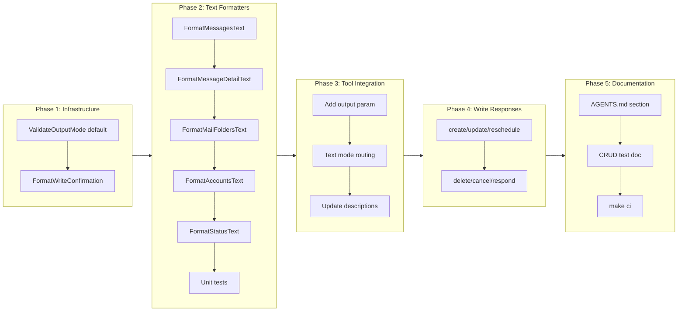

# Token-Efficient Response Defaults

## Change Summary

Change the default MCP tool output mode from `summary` (compact JSON) to `text` (CLI-like plain text) for all read tools. Extend `text` formatting to the 6 tools that currently lack it (4 mail tools, `account_list`, `status`). Convert write tool responses from full raw `SerializeEvent` JSON to concise text confirmations. Convert action confirmation responses (delete, cancel, respond) from JSON to text while preserving their existing message strings. Review and curate the `summary` field sets to be intentionally chosen per tool. Add a mandatory **MCP Tool Response Tiering** section to `AGENTS.md` that codifies the output tier hierarchy as a project-wide best practice.

## Motivation and Background

CR-0033 introduced the `summary`/`raw`/`text` output tier system to reduce token consumption. While `text` mode is dramatically more token-efficient than JSON, it was added as opt-in (`output=text`) with `summary` JSON remaining the default. Real-world usage shows that the LLM consumer almost never needs structured JSON — it extracts the human-readable data and rephrases it. Defaulting to `text` would cut token usage by 60-70% on every read tool call without any loss of end-user experience quality.

Additionally, write tools (`create_event`, `update_event`, `reschedule_event`) currently return the full raw `SerializeEvent` output (~18 fields), even though the LLM already knows what it just created — it only needs an ID and confirmation of key fields. Action confirmations (`delete_event`, `cancel_event`, `respond_event`) currently return JSON objects; converting these to plain text aligns them with the text-default philosophy while retaining their useful `message` strings.

### Token Cost Analysis (Real-World Examples)

| Scenario | Current (summary JSON) | Proposed (text) | Savings |
|---|---|---|---|
| `calendar_list_events` (10 events) | ~2,500 tokens | ~800 tokens | **68%** |
| `calendar_get_event` (1 event) | ~400 tokens | ~150 tokens | **63%** |
| `mail_list_messages` (25 messages) | ~5,000 tokens | ~1,500 tokens | **70%** |
| `calendar_create_event` response | ~350 tokens | ~80 tokens | **77%** |
| `calendar_delete_event` response | ~60 tokens | ~30 tokens | **50%** |
| `status` response | ~400 tokens | ~120 tokens | **70%** |

Over a typical session with 20-30 tool calls, this represents **thousands of tokens saved**, reducing both context window pressure and API cost for LLM consumers.

## Change Drivers

* **Context window efficiency**: Every token returned by an MCP tool competes with user instructions, conversation history, and the LLM's reasoning space. Text output maximizes information density per token.
* **Default should match primary consumer**: The primary consumer of MCP tool output is an LLM, which does not need JSON structure — it needs human-readable data with machine-addressable IDs for follow-up actions.
* **Write tool responses are over-serialized**: Returning 18 fields after a create/update when only `id` + key fields matter wastes tokens on data the LLM already has.
* **Action confirmations use JSON for simple text data**: The delete/cancel/respond responses wrap a boolean, event ID, and message in JSON structure. Plain text conveys the same information with less overhead.
* **Summary field sets should be intentional**: The `summary` tier exists to provide a curated, minimal JSON representation. Each tool's summary field set should be deliberately chosen for its use case — not derived mechanically from the raw output. The existing `SerializeSummaryEvent` and `SerializeSummaryMessage` already follow this principle; this CR extends it as a documented standard.
* **Inconsistent text support**: Calendar tools have text formatters, but mail, account, and status tools do not — forcing those tools to always return JSON.

## Current State

### Output Mode Defaults

`ValidateOutputMode()` in `internal/tools/output.go` returns `"summary"` when the `output` parameter is empty. All read tools default to JSON summary output.

### Text Mode Coverage

| Tool | Has `text` formatter | Default output |
|---|---|---|
| `calendar_list_events` | Yes (`FormatEventsText`) | JSON summary |
| `calendar_search_events` | Yes (`FormatEventsText`) | JSON summary |
| `calendar_get_event` | Yes (`FormatEventDetailText`) | JSON summary |
| `calendar_list` | Yes (`FormatCalendarsText`) | JSON summary |
| `calendar_get_free_busy` | Yes (`FormatFreeBusyText`) | JSON summary |
| `mail_list_messages` | **No** | JSON summary |
| `mail_search_messages` | **No** | JSON summary |
| `mail_get_message` | **No** | JSON summary |
| `mail_list_folders` | **No** | JSON only (no `output` param) |
| `account_list` | **No** | JSON only (no `output` param) |
| `status` | **No** | JSON only (no `output` param) |

### Write Tool Responses

| Tool | Current response format |
|---|---|
| `calendar_create_event` | Full `SerializeEvent()` — 18+ fields including `webLink`, `importance`, `sensitivity`, `isCancelled`, nested `start`/`end` objects, nested `organizer` object |
| `calendar_update_event` | Full `SerializeEvent()` — same 18+ fields |
| `calendar_reschedule_event` | Full `SerializeEvent()` — same 18+ fields |
| `calendar_delete_event` | `{"deleted":true,"event_id":"...","message":"Event deleted successfully. Cancellation notices were sent to attendees if applicable."}` |
| `calendar_cancel_event` | `{"cancelled":true,"event_id":"...","message":"Meeting cancelled. Cancellation message sent to all attendees."}` |
| `calendar_respond_event` | `{"responded":true,"event_id":"...","response":"accept","message":"Event accepted successfully. Response sent to organizer."}` |

### Summary vs Raw Field Sets

The `summary` mode already uses intentionally curated field sets via dedicated serialization functions:

- **Events**: `SerializeSummaryEvent` returns 9 flattened fields (id, subject, start, end, displayTime, location, organizer, showAs, isOnlineMeeting) vs `SerializeEvent` which returns 18+ fields with nested objects.
- **Messages**: `SerializeSummaryMessage` returns 12 fields vs `SerializeMessage` which returns 22+ fields including body, headers, and all recipient lists.
- **Calendars**: `SerializeCalendar` has no summary variant — always returns the full 7-field set.

The `raw` mode returns the complete Graph API field set unchanged, including empty/zero values. This is intentional — `raw` means raw.

## Proposed Change

### 1. Change Default Output Mode to `text`

Update `ValidateOutputMode()` to return `"text"` instead of `"summary"` when the `output` parameter is empty. The tier hierarchy becomes:

| Mode | When to use | Format |
|---|---|---|
| **`text`** (new default) | General LLM consumption, human-readable display | CLI-like plain text with numbered lists, labeled fields |
| `summary` | Programmatic use, when the LLM needs structured JSON for reasoning | Compact JSON with an intentionally curated field set per tool |
| `raw` | Debugging, when every Graph API field is needed | Full, unmodified JSON matching Graph API response shape (including empty values) |

### 2. Add Text Formatters for Missing Tools

#### `FormatMessagesText` (for `mail_list_messages`, `mail_search_messages`)

```
1. Weekly Design Review
   From: alice@contoso.com | Mon Mar 16, 2026 3:45 PM
   Preview: Hi team, please review the attached mockups before...

2. Sprint Planning Notes
   From: bob@contoso.com | Mon Mar 16, 2026 2:12 PM
   [Unread] [Has attachments]
   Preview: Here are the notes from today's sprint planning...

2 message(s) total.
```

#### `FormatMessageDetailText` (for `mail_get_message`)

```
Weekly Design Review
From: alice@contoso.com
To: team@contoso.com
Date: Mon Mar 16, 2026 3:45 PM
Importance: high
[Has attachments]

Hi team, please review the attached mockups before Wednesday...
```

#### `FormatMailFoldersText` (for `mail_list_folders`)

```
1. Inbox (3 unread, 142 total)
2. Sent Items (0 unread, 89 total)
3. Drafts (0 unread, 2 total)

3 folder(s) total.
```

#### `FormatAccountsText` (for `account_list`)

```
1. work (authenticated)
2. personal (not authenticated)

2 account(s) total.
```

#### `FormatStatusText` (for `status`)

```
Server: outlook-local-mcp v1.2.0
Timezone: Europe/Stockholm
Uptime: 3h 42m

Accounts:
  work: authenticated
  personal: not authenticated

Features: read-only=off, mail=on, provenance=mcp_created
```

### 3. Write Tool Text Responses

Write tools do not accept an `output` parameter (per CR-0033 NFR-2). Their responses change unconditionally:

#### `calendar_create_event`, `calendar_update_event`, `calendar_reschedule_event`

Replace full `SerializeEvent()` with a concise text confirmation:

```
Event created: "Weekly Sync"
ID: AAMkAGQ3...
Time: Wed Mar 25, 2:00 PM - 3:00 PM
Location: Conference Room A
```

The response includes the event ID (for follow-up operations) and the key fields the user cares about (subject, time, location). The LLM already knows all other fields because it just provided them in the request.

#### `calendar_delete_event`, `calendar_cancel_event`, `calendar_respond_event`

Convert from JSON to plain text while retaining the existing message strings:

- Delete:
  ```
  Event deleted: AAMkAGQ3...
  Cancellation notices were sent to attendees if applicable.
  ```
- Cancel:
  ```
  Event cancelled: AAMkAGQ3...
  Cancellation message sent to all attendees.
  ```
- Respond:
  ```
  Event accepted: AAMkAGQ3...
  Response sent to organizer.
  ```

### 4. Summary Field Set Curation

The `summary` mode uses intentionally chosen field sets per tool via dedicated serialization functions. Each summary field set is designed for a specific use case — the fields included are the ones the LLM or user is most likely to need. Fields are **not** derived by mechanically stripping empty values from `raw`; they are deliberately selected.

The existing summary serializers (`SerializeSummaryEvent`, `SerializeSummaryMessage`, `SerializeSummaryGetEvent`) already follow this principle and are unchanged by this CR. New summary serializers added for tools that currently lack a summary mode (e.g., `status`) **MUST** follow the same pattern: explicitly define the included fields, do not derive them from the raw output. For tools newly receiving an `output` parameter (`mail_list_folders`, `account_list`, `status`), the `summary` mode **MUST** return their existing JSON output structure — these tools already return compact, curated JSON that serves as a reasonable summary representation. No new summary serializer is required unless the existing JSON output contains excessive fields.

The `raw` mode returns the complete Graph API serialization **unchanged** — all fields, including empty strings, `false` booleans, and empty arrays. This is the whole point of `raw`: it is the unmodified data for debugging and full-field inspection.

| Mode | Field selection | Empty values |
|---|---|---|
| `text` | Curated by the text formatter | N/A (plain text) |
| `summary` | Intentionally defined per-tool field set | Included as-is (the field set itself is minimal) |
| `raw` | All Graph API fields | Included as-is (unmodified) |

### 5. Trim `status` Tool Default Response

The `status` tool currently returns a deeply nested JSON object with 6 configuration groups (~30 fields). In `text` mode (new default), return only the essential health data. The full configuration remains available via `output=summary` or `output=raw`.

### 6. Add `output` Parameter to Tools That Lack It

Add the `output` parameter (with `text` default) to tools that currently do not accept it:
- `mail_list_folders`
- `account_list`
- `status`

### 7. AGENTS.md: MCP Tool Response Tiering Section

Add a mandatory section to `AGENTS.md` that codifies the output tier hierarchy as a project-wide best practice. This ensures all future tools follow the same pattern.

## Requirements

### Functional Requirements

1. `ValidateOutputMode()` **MUST** return `"text"` when the `output` parameter is empty or missing.
2. All read tools **MUST** default to `text` output mode.
3. `mail_list_messages` and `mail_search_messages` **MUST** support `text` mode via a `FormatMessagesText` formatter.
4. `mail_get_message` **MUST** support `text` mode via a `FormatMessageDetailText` formatter.
5. `mail_list_folders` **MUST** support `text` mode via a `FormatMailFoldersText` formatter and accept an `output` parameter.
6. `account_list` **MUST** support `text` mode via a `FormatAccountsText` formatter and accept an `output` parameter.
7. `status` **MUST** support `text` mode via a `FormatStatusText` formatter and accept an `output` parameter.
8. `calendar_create_event`, `calendar_update_event`, and `calendar_reschedule_event` **MUST** return concise text confirmations containing: action verb, subject, event ID, displayTime, and location (when set).
9. `calendar_delete_event` **MUST** return plain text containing `Event deleted: {event_id}` followed by the existing message string on a second line.
10. `calendar_cancel_event` **MUST** return plain text containing `Event cancelled: {event_id}` followed by the existing message string on a second line.
11. `calendar_respond_event` **MUST** return plain text containing `Event {response}: {event_id}` (e.g., `Event accepted: AAMk...`) followed by the existing message string on a second line.
12. `output=summary` **MUST** use intentionally curated field sets via dedicated serialization functions (e.g., `SerializeSummaryEvent`, `SerializeSummaryMessage`). Summary field sets **MUST NOT** be derived by mechanically filtering empty values from the raw output. All fields in the defined summary set are always included, even when empty.
13. `output=raw` **MUST** return the full, unmodified Graph API serialization — all fields, including empty strings, `false` booleans, and empty arrays. The `raw` output **MUST** be identical to today's behavior.
14. The `status` tool in `text` mode **MUST** show only: version, timezone, uptime, account list with auth state, and feature flags. Full configuration **MUST** remain available via `output=summary` or `output=raw`.
15. `AGENTS.md` **MUST** include a **MCP Tool Response Tiering** section documenting the three-tier output model, the default mode, when each mode is appropriate, and the requirement that all new tools implement all three tiers.
16. The `output` parameter description on all tools **MUST** state that `text` is the default.
17. The `calendar_get_event` tool description **MUST** state that the default output includes `bodyPreview` (a plain-text snippet), and that the full HTML body is only available via `output=raw`.
18. The `mail_get_message` tool description **MUST** state that the default output includes `bodyPreview` (a plain-text snippet), and that the full HTML body and headers are only available via `output=raw`.
19. The `output` parameter description on `calendar_get_event` and `mail_get_message` **MUST** explicitly mention: `text` (default) shows body preview, `summary` includes `bodyPreview` field, `raw` includes full `body` with HTML content.

### Non-Functional Requirements

1. Text formatters **MUST NOT** increase latency beyond 1ms per item compared to JSON serialization.
2. Summary serialization functions **MUST** explicitly define their field set (not filter from raw). Each tool's summary fields are documented in the function's docstring.
3. Write tool text responses **MUST NOT** exceed 5 lines.
4. All text formatters **MUST** be pure functions with no side effects.
5. The `text_format.go` file **MUST** remain the single location for all text formatters. New formatters for mail, accounts, and status are added to this file.

## Affected Components

| Component | Change |
|---|---|
| `internal/tools/output.go` | Change default from `"summary"` to `"text"` in `ValidateOutputMode()` |
| `internal/tools/text_format.go` | Add `FormatMessagesText`, `FormatMessageDetailText`, `FormatMailFoldersText`, `FormatAccountsText`, `FormatStatusText`, `FormatWriteConfirmation` |
| `internal/tools/text_format_test.go` | Tests for all new text formatters |
| `internal/tools/list_messages.go` | Add `text` mode routing |
| `internal/tools/search_messages.go` | Add `text` mode routing |
| `internal/tools/get_message.go` | Add `text` mode routing; update tool description and `output` param description to document body escalation (`bodyPreview` default → `output=raw` for full body/headers) |
| `internal/tools/list_mail_folders.go` | Add `output` parameter and `text` mode routing |
| `internal/tools/list_accounts.go` | Add `output` parameter and `text` mode routing |
| `internal/tools/status.go` | Add `output` parameter and `text` mode routing |
| `internal/tools/create_event.go` | Replace `SerializeEvent` response with text confirmation |
| `internal/tools/update_event.go` | Replace `SerializeEvent` response with text confirmation |
| `internal/tools/reschedule_event.go` | Replace `SerializeEvent` response with text confirmation |
| `internal/tools/delete_event.go` | Convert JSON response to plain text, retain message string |
| `internal/tools/cancel_event.go` | Convert JSON response to plain text, retain message string |
| `internal/tools/respond_event.go` | Convert JSON response to plain text, retain message string |
| `internal/tools/get_event.go` | Update tool description and `output` param description to document body escalation (`bodyPreview` default → `output=raw` for full body) |
| `AGENTS.md` | Add **MCP Tool Response Tiering** section |
| `docs/prompts/mcp-tool-crud-test.md` | Update expected response formats in test steps |

## Scope Boundaries

### In Scope

- Changing the default output mode from `summary` to `text`
- Adding 6 new text formatters for mail, account, and status tools
- Converting 6 write tool responses to concise text
- Adding `output` parameter to `mail_list_folders`, `account_list`, `status`
- Adding AGENTS.md documentation section
- Updating tool parameter descriptions to reflect new default
- Adding body escalation guidance to `calendar_get_event` and `mail_get_message` descriptions
- Updating `mcp-tool-crud-test.md` for new response formats and body escalation verification
- Unit tests for all new formatters and changed behavior

### Out of Scope

- Configurable field selection (e.g., `$select`-like parameter for MCP clients)
- Truncating `bodyPreview` length in summary mode
- Adding `text` formatters for `account_add`, `account_remove`, or `complete_auth` (these are interactive tools with unique flows)
- Changing Graph API `$select` field lists (the data fetched is unchanged; only the serialization output changes)
- Changes to the `raw` mode serialization (raw output is unchanged — all fields, all values, including empties)
- Changes to the existing `summary` mode field sets (the curated fields in `SerializeSummaryEvent`, `SerializeSummaryMessage`, etc. are already well-designed)

## Implementation Approach

### Phase 1: Shared Infrastructure

1. Change `ValidateOutputMode()` default from `"summary"` to `"text"`.
2. Add `FormatWriteConfirmation(action, subject, eventID, displayTime, location string) string` to `text_format.go`.

### Phase 2: Text Formatters for Missing Tools

Add to `text_format.go`:
1. `FormatMessagesText(messages []map[string]any) string`
2. `FormatMessageDetailText(message map[string]any) string`
3. `FormatMailFoldersText(folders []map[string]any) string`
4. `FormatAccountsText(accounts []map[string]any) string`
5. `FormatStatusText(status statusResponse) string`

Unit tests for each formatter in `text_format_test.go`.

### Phase 3: Integrate Text Mode into Mail, Account, and Status Tools

1. Add `output` parameter to `mail_list_folders`, `account_list`, `status` tool definitions.
2. Add `text` mode routing to `mail_list_messages`, `mail_search_messages`, `mail_get_message`, `mail_list_folders`, `account_list`, `status`.
3. Update tool parameter descriptions for `output` on all tools to state `text` is the default.
4. Update `calendar_get_event` and `mail_get_message` tool descriptions and `output` parameter descriptions to document the body escalation pattern (`bodyPreview` default → `output=raw` for full HTML body).

### Phase 4: Write Tool Response Conversion

1. Replace `SerializeEvent` + `json.Marshal` in `create_event`, `update_event`, `reschedule_event` with `FormatWriteConfirmation`.
2. Replace JSON maps in `delete_event`, `cancel_event`, `respond_event` with plain text, retaining message strings.

### Phase 5: Documentation

1. Add **MCP Tool Response Tiering** section to `AGENTS.md`.
2. Update `docs/prompts/mcp-tool-crud-test.md`:
   - Update response format expectations for all existing steps (text default instead of JSON).
   - Add body escalation verification steps: call `calendar_get_event` with default output to verify `bodyPreview` is present in text, then call with `output=raw` to verify full HTML body is present.
3. Run `make ci` to verify all checks pass.

### Implementation Flow



## Test Strategy

### Tests to Add

| Test File | Test Name | Description | Inputs | Expected Output |
|---|---|---|---|---|
| `text_format_test.go` | `TestFormatMessagesText` | Numbered message list with from, date, preview | 2 summary message maps | Numbered list with From/Date/Preview lines |
| `text_format_test.go` | `TestFormatMessagesText_Empty` | Empty message list | nil | `"No messages found."` |
| `text_format_test.go` | `TestFormatMessageDetailText` | Single message detail | 1 full message map | Subject, From, To, Date, body preview |
| `text_format_test.go` | `TestFormatMailFoldersText` | Numbered folder list with counts | 3 folder maps | Numbered list with unread/total counts |
| `text_format_test.go` | `TestFormatMailFoldersText_Empty` | Empty folder list | nil | `"No folders found."` |
| `text_format_test.go` | `TestFormatAccountsText` | Numbered account list | 2 account maps | `"1. work (authenticated)"` etc. |
| `text_format_test.go` | `TestFormatAccountsText_Empty` | Empty account list | nil | `"No accounts registered."` |
| `text_format_test.go` | `TestFormatStatusText` | Status text output | statusResponse struct | Version, timezone, uptime, accounts, features |
| `text_format_test.go` | `TestFormatWriteConfirmation` | Write confirmation text | action, subject, id, time, location | Multi-line confirmation |
| `text_format_test.go` | `TestFormatWriteConfirmation_NoLocation` | Write confirmation without location | action, subject, id, time, empty location | Confirmation without Location line |
| `output_test.go` | `TestValidateOutputMode_DefaultIsText` | Default output mode is text | empty string | `"text"` |

### Tests to Modify

| Test File | Test Name | Current Behavior | New Behavior | Reason |
|---|---|---|---|---|
| `output_test.go` | `TestValidateOutputMode_Empty` | Returns `"summary"` | Returns `"text"` | Default changed |
| `list_events_test.go` | `TestListEventsSuccess` | Asserts JSON summary response | Asserts text response | Default is now text |
| `get_event_test.go` | `TestGetEventSuccess` | Asserts JSON summary response | Asserts text response | Default is now text |
| `search_events_test.go` | `TestSearchEventsSuccess` | Asserts JSON summary response | Asserts text response | Default is now text |
| `list_calendars_test.go` | `TestListCalendarsSuccess` | Asserts JSON response | Asserts text response | Default is now text |
| `get_free_busy_test.go` | `TestGetFreeBusySuccess` | Asserts JSON response | Asserts text response | Default is now text |
| `create_event_test.go` | `TestCreateEventSuccess` | Asserts JSON with full event fields | Asserts text confirmation | Response format changed |
| `update_event_test.go` | `TestUpdateEventSuccess` | Asserts JSON with full event fields | Asserts text confirmation | Response format changed |
| `reschedule_event_test.go` | `TestRescheduleEventSuccess` | Asserts JSON with full event fields | Asserts text confirmation | Response format changed |
| `delete_event_test.go` | `TestDeleteEventSuccess` | Asserts JSON with `message` field | Asserts plain text with message string | Format changed from JSON to text |
| `cancel_event_test.go` | `TestCancelEventSuccess` | Asserts JSON with `message` field | Asserts plain text with message string | Format changed from JSON to text |
| `respond_event_test.go` | `TestRespondEventSuccess` | Asserts JSON with `message` field | Asserts plain text with message string | Format changed from JSON to text |
| `list_accounts_test.go` | `TestListAccountsSuccess` | Asserts JSON response | Asserts text response | Default is now text |
| `status_test.go` | `TestStatusSuccess` | Asserts full JSON config | Asserts text health summary | Default is now text |

### Tests to Remove

Not applicable.

## Acceptance Criteria

### AC-1: Default output mode is text

```gherkin
Given an MCP client calls any read tool without an output parameter
When the tool returns successfully
Then the response is plain text (not JSON)
  And the text is formatted as a human-readable listing or detail view
```

### AC-2: Text output for mail_list_messages

```gherkin
Given an MCP client calls mail_list_messages without an output parameter
When the tool returns 3 messages
Then the response is a numbered plain-text list
  And each entry shows subject, sender, date, and body preview
  And the list ends with "3 message(s) total."
```

### AC-3: Text output for mail_get_message

```gherkin
Given an MCP client calls mail_get_message without an output parameter
When the tool returns successfully
Then the response shows subject, from, to, date, importance (if not normal), attachment indicator, and body preview
  And the full HTML body is not included
```

### AC-4: Text output for mail_list_folders

```gherkin
Given an MCP client calls mail_list_folders without an output parameter
When the tool returns 3 folders
Then the response is a numbered plain-text list
  And each entry shows display name, unread count, and total count
  And the list ends with "3 folder(s) total."
```

### AC-5: Text output for account_list

```gherkin
Given an MCP client calls account_list without an output parameter
When the tool returns 2 accounts
Then the response is a numbered plain-text list
  And each entry shows label and authentication state
  And the list ends with "2 account(s) total."
```

### AC-6: Text output for status

```gherkin
Given an MCP client calls status without an output parameter
When the tool returns successfully
Then the response shows version, timezone, uptime, account list with auth state, and feature flags
  And the full configuration (logging, storage, graph_api, observability) is not included
```

### AC-7: Write tool text confirmations

```gherkin
Given an MCP client calls calendar_create_event
When the event is created successfully
Then the response is a multi-line text confirmation containing:
  "Event created: {subject}"
  "ID: {event_id}"
  "Time: {displayTime}"
  And optionally "Location: {location}" when set
  And the response does not contain JSON
  And the response does not exceed 5 lines
```

### AC-8: Action confirmations as plain text with message strings

```gherkin
Given an MCP client calls calendar_delete_event
When the event is deleted successfully
Then the response is plain text (not JSON)
  And the first line is "Event deleted: {event_id}"
  And the second line contains the existing message string about cancellation notices

Given an MCP client calls calendar_cancel_event
When the event is cancelled successfully
Then the response is plain text (not JSON)
  And the first line is "Event cancelled: {event_id}"
  And the second line contains the existing message string about cancellation to attendees

Given an MCP client calls calendar_respond_event with response=accept
When the response is sent successfully
Then the response is plain text (not JSON)
  And the first line is "Event accepted: {event_id}"
  And the second line contains the existing message string about response to organizer
```

### AC-9: summary mode uses curated field sets

```gherkin
Given an MCP client calls calendar_list_events with output=summary
When the tool returns successfully
Then the response is compact JSON with the intentionally defined summary field set
  And the field set matches SerializeSummaryEvent (id, subject, start, end, displayTime, location, organizer, showAs, isOnlineMeeting)
  And all fields in the set are present even when their values are empty
```

### AC-10: raw mode is unchanged

```gherkin
Given an MCP client calls any read tool with output=raw
When the tool returns successfully
Then the response is full JSON with the complete Graph API field set
  And all fields are present including empty strings, false booleans, and empty arrays
  And the output is identical to the pre-CR-0051 behavior
```

### AC-11: AGENTS.md response tiering section

```gherkin
Given AGENTS.md
When the MCP Tool Response Tiering section is inspected
Then it documents three tiers: text (default), summary, raw
  And it states that text is the default for all read tools
  And it states that write tools return text confirmations unconditionally
  And it states that all new tools MUST implement all three tiers for read operations
  And it states that raw must be explicitly requested
```

### AC-12: Updated tool parameter descriptions

```gherkin
Given any tool with an output parameter
When the parameter description is inspected
Then it states that 'text' is the default
  And it lists 'text', 'summary', and 'raw' as valid values
```

### AC-13: Body escalation guidance in tool descriptions

```gherkin
Given the calendar_get_event tool definition
When the tool description is inspected
Then it states that the default output includes bodyPreview (plain-text snippet)
  And it states that the full HTML body is only available via output=raw

Given the calendar_get_event output parameter description
When the parameter description is inspected
Then it explains that text (default) shows body preview
  And it explains that summary includes the bodyPreview field
  And it explains that raw includes the full body with HTML content

Given the mail_get_message tool definition
When the tool description is inspected
Then it states that the default output includes bodyPreview (plain-text snippet)
  And it states that the full HTML body and headers are only available via output=raw
```

### AC-14: CRUD test verifies body escalation pattern

```gherkin
Given the CRUD test document (docs/prompts/mcp-tool-crud-test.md)
When the test steps are inspected
Then there is a step that calls calendar_get_event with default output and verifies bodyPreview is present in the text response
  And there is a step that calls calendar_get_event with output=raw and verifies the full body HTML content is present
  And the test verifies that bodyPreview in default mode is sufficient to determine whether full body retrieval is needed
```

## Quality Standards Compliance

### Build & Compilation

- [x] Code compiles/builds without errors
- [x] No new compiler warnings introduced

### Linting & Code Style

- [x] All linter checks pass with zero warnings/errors
- [x] Code follows project coding conventions and style guides
- [x] Any linter exceptions are documented with justification

### Test Execution

- [x] All existing tests pass after implementation
- [x] All new tests pass
- [x] Test coverage meets project requirements for changed code

### Documentation

- [x] Inline code documentation updated where applicable
- [x] Tool descriptions updated for new/modified tools
- [x] User-facing documentation updated if behavior changes

### Code Review

- [ ] Changes submitted via pull request
- [ ] PR title follows Conventional Commits format
- [ ] Code review completed and approved
- [ ] Changes squash-merged to maintain linear history

### Verification Commands

```bash
# Build verification
make build

# Lint verification
make lint

# Test execution
make test

# Full CI check
make ci
```

## Risks and Mitigation

### Risk 1: Text output loses machine-addressable data for LLM follow-up actions

**Likelihood:** low
**Impact:** medium — the LLM needs event IDs to call `calendar_get_event`, `calendar_update_event`, etc.
**Mitigation:** All text formatters for list operations include the `id` field on a dedicated line. The LLM can extract IDs from text just as easily as from JSON. For tools where the LLM needs structured data for programmatic reasoning, `output=summary` is one parameter away.

### Risk 2: Breaking existing MCP client integrations that parse JSON

**Likelihood:** medium
**Impact:** medium — clients that parse the JSON output will receive text instead.
**Mitigation:** This is a documented breaking change targeting 2.0.0. Clients can set `output=summary` to restore JSON behavior. The `output` parameter was already available since CR-0033.

### Risk 3: Text formatters produce inconsistent output across tools

**Likelihood:** low
**Impact:** low — inconsistency in text formatting is cosmetic.
**Mitigation:** NFR-5 requires all formatters to live in `text_format.go`. The existing formatters (`FormatEventsText`, etc.) establish a consistent pattern (numbered lists, indented details, total count) that new formatters follow.

## Dependencies

- CR-0033 (completed) — introduced the `summary`/`raw`/`text` output tier system
- CR-0042 (completed) — introduced text formatters for calendar tools
- CR-0050 (completed) — established tool naming convention used throughout this CR

## Decision Outcome

Chosen approach: "text-default with comprehensive text formatters and write tool text confirmations", because it maximizes token efficiency for the primary consumer (LLM clients) while preserving full data access via explicit `output=summary` or `output=raw` parameters. `summary` uses intentionally curated field sets; `raw` is fully unchanged. The approach builds incrementally on the existing three-tier system from CR-0033 and CR-0042.

Alternatives considered:
- **Keep summary JSON as default, only add missing text formatters**: Does not achieve the primary goal of token reduction by default. Every tool call would still return JSON unless the LLM explicitly requests text.
- **Remove JSON output modes entirely**: Too aggressive. Some advanced use cases and programmatic consumers need structured JSON.
- **Make text the only output for write tools, but keep JSON for reads**: Inconsistent. If text is good enough for writes, it should be the default for reads too.

## Related Items

- CR-0033 — MCP Server-Side Response Filtering (introduced `summary`/`raw`/`text` tiers)
- CR-0042 — UX Polish: Tool Ergonomics (introduced text formatters for calendar tools)
- CR-0049 — Status Runtime Config (introduced the status tool's configuration groups)
- CR-0050 — Domain-Prefixed Tool Names (established naming convention)

## Appendix: AGENTS.md Section to Add

The following section **MUST** be added to `AGENTS.md` after the "Tool Naming Convention" section:

```markdown
## MCP Tool Response Tiering

All MCP tool responses **MUST** follow a three-tier output model to minimize token consumption for LLM consumers while preserving data access for programmatic use cases:

| Tier | Mode | Default | Format | Use Case |
|------|------|---------|--------|----------|
| 1 | `text` | **Yes** | CLI-like plain text with numbered lists and labeled fields | General LLM consumption, human-readable display |
| 2 | `summary` | No | Compact JSON with an intentionally curated field set per tool | Programmatic LLM reasoning requiring structured data |
| 3 | `raw` | No | Full, unmodified JSON matching Graph API response shape | Debugging, full-field inspection |

### Rules

* **Read tools** accept an `output` parameter with values `text` (default), `summary`, and `raw`. All three tiers **MUST** be implemented.
* **Write tools** return text confirmations unconditionally (no `output` parameter). Confirmations include the action, subject, resource ID, key fields, and contextual message strings (e.g., attendee notification status).
* **`text` is the default** — tool handlers **MUST** return plain text when `output` is empty or omitted.
* **`raw` must be explicitly requested** — it is never the default for any tool. Raw output is the complete, unmodified Graph API serialization including empty values.
* **`summary` field sets are intentional** — each tool's summary mode uses a deliberately chosen field set via a dedicated serialization function (e.g., `SerializeSummaryEvent`). Summary fields are **not** derived by filtering empty values from raw output. New tools **MUST** define their summary field set explicitly.
* **Text formatters** live in `internal/tools/text_format.go`. New formatters follow the established patterns: numbered lists for collections, labeled fields for details, total counts at the end.
* **Body escalation pattern**: Tools that return content previews by default (e.g., `bodyPreview`) **MUST** document in their tool description that the full content (e.g., HTML body) requires `output=raw`. This guides the LLM to use the preview to decide whether fetching the full content is necessary, avoiding unnecessary token consumption.

### Why This Matters

Every token in an MCP tool response competes with user instructions, conversation history, and LLM reasoning space. A 10-event JSON list consumes ~2,500 tokens; the same data as text consumes ~800 tokens — a 68% reduction. Over a session with 20-30 tool calls, this saves thousands of tokens and materially improves LLM performance.
```

<!--
## CR Review Summary (2026-03-22)

**Reviewer:** CR Reviewer Agent
**Findings:** 3
**Fixes applied:** 3
**Unresolvable items:** 0

### Findings & Fixes

1. **Scope inconsistency — `search_messages.go` missing from Affected Components**
   FR-3 and Phase 3 reference `mail_search_messages` / `search_messages.go`, but the
   Affected Components table omitted it. The table already listed
   `internal/tools/search_messages.go` for text mode routing; no change was needed there.
   However, `internal/tools/get_message.go` appeared twice (once for text mode routing,
   once for description updates). Consolidated the two entries into a single row covering
   both changes, eliminating the duplicate.

2. **Duplicate Affected Components entry — `get_message.go` listed twice**
   Merged the two `get_message.go` rows into one that covers both text mode routing and
   body escalation description updates.

3. **Ambiguity — `summary` mode undefined for newly parameterized tools**
   Tools newly receiving the `output` parameter (`mail_list_folders`, `account_list`,
   `status`) had no specification for what `summary` mode returns. Added a clarifying
   statement in the "Summary Field Set Curation" section: these tools' existing JSON
   output serves as the summary representation; no new summary serializer is required
   unless the existing output contains excessive fields.

### Verification Results

- All 19 Functional Requirements have corresponding Acceptance Criteria.
- All 14 Acceptance Criteria have corresponding test entries (automated or manual).
- The Mermaid diagram accurately reflects the 5-phase implementation flow.
- No contradictions found between FRs, ACs, and Implementation Approach.
- All requirements use precise "MUST" / "MUST NOT" language.
-->

